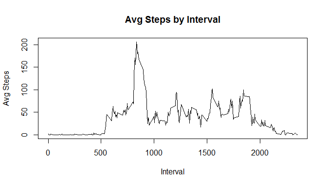
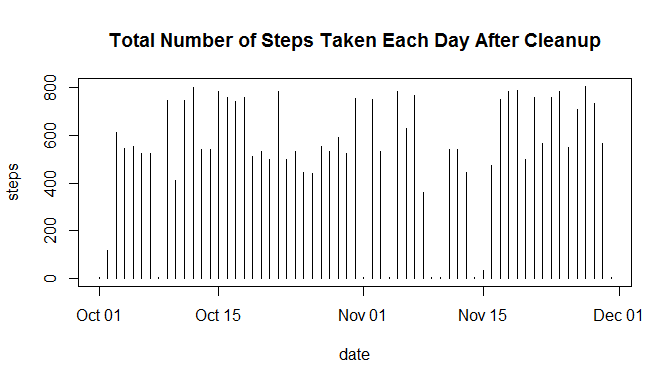
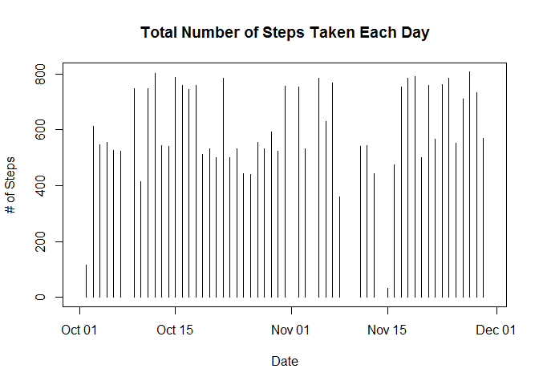
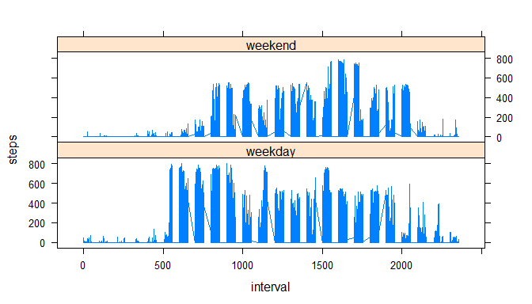

# Reproducible Research: Peer Assessment 1


## Loading and preprocessing the data

1. Load the data.


```r
setwd("~/GitHub/RepData_PeerAssessment1")

unzip(paste(getwd(),"\\","activity.zip",sep=""), exdir = getwd())
        
df <- read.csv("activity.csv", as.is = TRUE)
```

2. Process/transform the data.


```r
df$date <- as.Date(df$date)

library("dplyr")
```

```
## Warning: package 'dplyr' was built under R version 3.1.3
```

```
## 
## Attaching package: 'dplyr'
## 
## The following object is masked from 'package:stats':
## 
##     filter
## 
## The following objects are masked from 'package:base':
## 
##     intersect, setdiff, setequal, union
```

```r
library("lattice")

by_date <- group_by(df, date)
by_interval <- group_by(df, interval)

str(df)
```

```
## 'data.frame':	17568 obs. of  3 variables:
##  $ steps   : int  NA NA NA NA NA NA NA NA NA NA ...
##  $ date    : Date, format: "2012-10-01" "2012-10-01" ...
##  $ interval: int  0 5 10 15 20 25 30 35 40 45 ...
```

```r
summary(df)
```

```
##      steps             date               interval     
##  Min.   :  0.00   Min.   :2012-10-01   Min.   :   0.0  
##  1st Qu.:  0.00   1st Qu.:2012-10-16   1st Qu.: 588.8  
##  Median :  0.00   Median :2012-10-31   Median :1177.5  
##  Mean   : 37.38   Mean   :2012-10-31   Mean   :1177.5  
##  3rd Qu.: 12.00   3rd Qu.:2012-11-15   3rd Qu.:1766.2  
##  Max.   :806.00   Max.   :2012-11-30   Max.   :2355.0  
##  NA's   :2304
```

## What is mean total number of steps taken per day?

1. Make a histogram of the total number of steps taken each day.


```r
plot(df$date, df$steps, type = "h", main = "Total Number of Steps Taken Each Day", ylab = "# of Steps", xlab = "Date")
```

 

2. Calculate and report the **mean** and **median** total number of steps taken per day


```r
df.daily.summary <- summarize(group_by(df, date), mean(steps, na.rm = TRUE), median(steps, na.rm = TRUE))

df.daily.summary
```

```
## Source: local data frame [61 x 3]
## 
##          date mean(steps, na.rm = TRUE) median(steps, na.rm = TRUE)
## 1  2012-10-01                       NaN                          NA
## 2  2012-10-02                   0.43750                           0
## 3  2012-10-03                  39.41667                           0
## 4  2012-10-04                  42.06944                           0
## 5  2012-10-05                  46.15972                           0
## 6  2012-10-06                  53.54167                           0
## 7  2012-10-07                  38.24653                           0
## 8  2012-10-08                       NaN                          NA
## 9  2012-10-09                  44.48264                           0
## 10 2012-10-10                  34.37500                           0
## ..        ...                       ...                         ...
```

## What is the average daily activity pattern?

1. Make a time series plot (i.e. `type = "l"`) of the 5-minute interval (x-axis) and the average number of steps taken, averaged across all days (y-axis)


```r
df.interval.mean <- summarise(by_interval, mean.steps = mean(steps, na.rm = TRUE))

df.interval.mean[is.na(df.interval.mean$mean.steps),2] <- 0

plot(df.interval.mean$interval, df.interval.mean$mean.steps, type = "l", main = "Avg Steps by Interval", xlab = "Interval", ylab = "Avg Steps")
```

 

2. Which 5-minute interval, on average across all the days in the dataset, contains the maximum number of steps?


```r
df.interval.summary <- summarise(by_interval, sum(steps, na.rm = TRUE))

df.interval.summary[which(df.interval.summary$`sum(steps, na.rm = TRUE)`==max(df.interval.summary$`sum(steps, na.rm = TRUE)`)),1]
```

```
## Source: local data frame [1 x 1]
## 
##   interval
## 1      835
```

## Imputing missing values

1. Calculate and report the total number of missing values in the dataset (i.e. the total number of rows with `NA`s)


```r
length(df[is.na(df$steps),1])
```

```
## [1] 2304
```

2. Devise a strategy for filling in all of the missing values in the dataset. The strategy does not need to be sophisticated. For example, you could use the mean/median for that day, or the mean for that 5-minute interval, etc.

We plan to imputer by using the mean for the 5-minute interval we calculated earlier.

3. Create a new dataset that is equal to the original dataset but with the missing data filled in.


```r
df.imputed <- merge(df, df.interval.mean)

length(df.imputed[is.na(df.imputed$steps),1])
```

```
## [1] 2304
```

```r
df.imputed$steps[is.na(df.imputed$steps)] <- df.imputed$mean.steps
```

```
## Warning in df.imputed$steps[is.na(df.imputed$steps)] <-
## df.imputed$mean.steps: number of items to replace is not a multiple of
## replacement length
```

```r
length(df.imputed[is.na(df.imputed$steps),1])
```

```
## [1] 0
```

4. Make a histogram of the total number of steps taken each day and Calculate and report the **mean** and **median** total number of steps taken per day. Do these values differ from the estimates from the first part of the assignment? What is the impact of imputing missing data on the estimates of the total daily number of steps?


```r
with(df.imputed, plot(date, steps, type = "h", main = "Total Number of Steps Taken Each Day After Cleanup"))
```

 

```r
with(df, plot(date, steps, type = "h", main = "Total Number of Steps Taken Each Day", ylab = "# of Steps", xlab = "Date"))
```

 

```r
df.compare <- merge(df,df.imputed, by = c("date", "interval"))
select(df.compare, date, interval, raw.steps = steps.x, imputed.steps = steps.y)
```

```
##             date interval raw.steps imputed.steps
## 1     2012-10-01        0        NA     1.7169811
## 2     2012-10-01       10        NA     1.7169811
## 3     2012-10-01      100        NA     0.3396226
## 4     2012-10-01     1000        NA     0.3396226
## 5     2012-10-01     1005        NA     0.3396226
## 6     2012-10-01     1010        NA     0.0000000
## 7     2012-10-01     1015        NA     0.0000000
## 8     2012-10-01     1020        NA     0.0000000
## 9     2012-10-01     1025        NA     0.0000000
## 10    2012-10-01     1030        NA     0.0000000
## 11    2012-10-01     1035        NA     0.0000000
## 12    2012-10-01     1040        NA     0.0000000
## 13    2012-10-01     1045        NA     0.0000000
## 14    2012-10-01      105        NA     0.3396226
## 15    2012-10-01     1050        NA     1.1132075
## 16    2012-10-01     1055        NA     1.1132075
## 17    2012-10-01      110        NA     0.3396226
## 18    2012-10-01     1100        NA     1.1132075
## 19    2012-10-01     1105        NA     1.1132075
## 20    2012-10-01     1110        NA     1.1132075
## 21    2012-10-01     1115        NA     1.1132075
## 22    2012-10-01     1120        NA     1.1132075
## 23    2012-10-01     1125        NA     1.8301887
## 24    2012-10-01     1130        NA     1.8301887
## 25    2012-10-01     1135        NA     1.8301887
## 26    2012-10-01     1140        NA     1.8301887
## 27    2012-10-01     1145        NA     1.8301887
## 28    2012-10-01      115        NA     0.3396226
## 29    2012-10-01     1150        NA     1.8301887
## 30    2012-10-01     1155        NA     1.8301887
## 31    2012-10-01      120        NA     0.1320755
## 32    2012-10-01     1200        NA     1.8301887
## 33    2012-10-01     1205        NA     0.1698113
## 34    2012-10-01     1210        NA     0.1698113
## 35    2012-10-01     1215        NA     0.1698113
## 36    2012-10-01     1220        NA     0.1698113
## 37    2012-10-01     1225        NA     0.1698113
## 38    2012-10-01     1230        NA     0.1698113
## 39    2012-10-01     1235        NA     0.1698113
## 40    2012-10-01     1240        NA     0.1698113
## 41    2012-10-01     1245        NA     0.1698113
## 42    2012-10-01      125        NA     0.1320755
## 43    2012-10-01     1250        NA     0.1698113
## 44    2012-10-01     1255        NA     0.1698113
## 45    2012-10-01      130        NA     0.1320755
## 46    2012-10-01     1300        NA     0.1698113
## 47    2012-10-01     1305        NA     0.1698113
## 48    2012-10-01     1310        NA     0.1698113
## 49    2012-10-01     1315        NA     0.1698113
## 50    2012-10-01     1320        NA     0.3773585
## 51    2012-10-01     1325        NA     0.3773585
## 52    2012-10-01     1330        NA     0.3773585
## 53    2012-10-01     1335        NA     0.3773585
## 54    2012-10-01     1340        NA     0.3773585
## 55    2012-10-01     1345        NA     0.3773585
## 56    2012-10-01      135        NA     0.1320755
## 57    2012-10-01     1350        NA     0.3773585
## 58    2012-10-01     1355        NA     0.3773585
## 59    2012-10-01      140        NA     0.1320755
## 60    2012-10-01     1400        NA     0.2641509
## 61    2012-10-01     1405        NA     0.2641509
## 62    2012-10-01     1410        NA     0.2641509
## 63    2012-10-01     1415        NA     0.2641509
## 64    2012-10-01     1420        NA     0.2641509
## 65    2012-10-01     1425        NA     0.2641509
## 66    2012-10-01     1430        NA     0.2641509
## 67    2012-10-01     1435        NA     0.0000000
## 68    2012-10-01     1440        NA     0.0000000
## 69    2012-10-01     1445        NA     0.0000000
## 70    2012-10-01      145        NA     0.1320755
## 71    2012-10-01     1450        NA     0.0000000
## 72    2012-10-01     1455        NA     0.0000000
## 73    2012-10-01       15        NA     1.7169811
## 74    2012-10-01      150        NA     0.1320755
## 75    2012-10-01     1500        NA     0.0000000
## 76    2012-10-01     1505        NA     0.0000000
## 77    2012-10-01     1510        NA     0.0000000
## 78    2012-10-01     1515        NA     0.0000000
## 79    2012-10-01     1520        NA     0.0000000
## 80    2012-10-01     1525        NA     0.0000000
## 81    2012-10-01     1530        NA     0.0000000
## 82    2012-10-01     1535        NA     0.0000000
## 83    2012-10-01     1540        NA     0.0000000
## 84    2012-10-01     1545        NA     0.0000000
## 85    2012-10-01      155        NA     0.1509434
## 86    2012-10-01     1550        NA     0.0000000
## 87    2012-10-01     1555        NA     0.0000000
## 88    2012-10-01     1600        NA     0.0000000
## 89    2012-10-01     1605        NA     0.0000000
## 90    2012-10-01     1610        NA     0.0000000
## 91    2012-10-01     1615        NA     0.0000000
## 92    2012-10-01     1620        NA     0.0000000
## 93    2012-10-01     1625        NA     0.0000000
## 94    2012-10-01     1630        NA     1.1320755
## 95    2012-10-01     1635        NA     1.1320755
## 96    2012-10-01     1640        NA     1.1320755
## 97    2012-10-01     1645        NA     1.1320755
## 98    2012-10-01     1650        NA     1.1320755
## 99    2012-10-01     1655        NA     1.1320755
## 100   2012-10-01     1700        NA     1.1320755
## 101   2012-10-01     1705        NA     0.0000000
## 102   2012-10-01     1710        NA     0.0000000
## 103   2012-10-01     1715        NA     0.0000000
## 104   2012-10-01     1720        NA     0.0000000
## 105   2012-10-01     1725        NA     0.0000000
## 106   2012-10-01     1730        NA     0.0000000
## 107   2012-10-01     1735        NA     0.0000000
## 108   2012-10-01     1740        NA     0.0000000
## 109   2012-10-01     1745        NA     0.0000000
## 110   2012-10-01     1750        NA     0.0000000
## 111   2012-10-01     1755        NA     0.0000000
## 112   2012-10-01     1800        NA     0.0000000
## 113   2012-10-01     1805        NA     0.0000000
## 114   2012-10-01     1810        NA     0.0000000
## 115   2012-10-01     1815        NA     0.0000000
## 116   2012-10-01     1820        NA     0.0000000
## 117   2012-10-01     1825        NA     0.1320755
## 118   2012-10-01     1830        NA     0.1320755
## 119   2012-10-01     1835        NA     0.1320755
## 120   2012-10-01     1840        NA     0.1320755
## 121   2012-10-01     1845        NA     0.1320755
## 122   2012-10-01     1850        NA     0.1320755
## 123   2012-10-01     1855        NA     0.1320755
## 124   2012-10-01     1900        NA     0.0000000
## 125   2012-10-01     1905        NA     0.0000000
## 126   2012-10-01     1910        NA     0.0000000
## 127   2012-10-01     1915        NA     0.0000000
## 128   2012-10-01     1920        NA     0.0000000
## 129   2012-10-01     1925        NA     0.0000000
## 130   2012-10-01     1930        NA     0.0000000
## 131   2012-10-01     1935        NA     0.0000000
## 132   2012-10-01     1940        NA     0.2264151
## 133   2012-10-01     1945        NA     0.2264151
## 134   2012-10-01     1950        NA     0.2264151
## 135   2012-10-01     1955        NA     0.2264151
## 136   2012-10-01       20        NA     1.7169811
## 137   2012-10-01      200        NA     0.1509434
## 138   2012-10-01     2000        NA     0.2264151
## 139   2012-10-01     2005        NA     0.2264151
## 140   2012-10-01     2010        NA     0.2264151
## 141   2012-10-01     2015        NA     0.2264151
## 142   2012-10-01     2020        NA     0.0000000
## 143   2012-10-01     2025        NA     0.0000000
## 144   2012-10-01     2030        NA     0.0000000
## 145   2012-10-01     2035        NA     0.0000000
## 146   2012-10-01     2040        NA     0.0000000
## 147   2012-10-01     2045        NA     0.0000000
## 148   2012-10-01      205        NA     0.1509434
## 149   2012-10-01     2050        NA     0.0000000
## 150   2012-10-01     2055        NA     0.0000000
## 151   2012-10-01      210        NA     0.1509434
## 152   2012-10-01     2100        NA     0.0000000
## 153   2012-10-01     2105        NA     0.0000000
## 154   2012-10-01     2110        NA     0.0000000
## 155   2012-10-01     2115        NA     0.0000000
## 156   2012-10-01     2120        NA     0.0000000
## 157   2012-10-01     2125        NA     0.0000000
## 158   2012-10-01     2130        NA     0.0000000
## 159   2012-10-01     2135        NA     1.5471698
## 160   2012-10-01     2140        NA     1.5471698
## 161   2012-10-01     2145        NA     1.5471698
## 162   2012-10-01      215        NA     0.1509434
## 163   2012-10-01     2150        NA     1.5471698
## 164   2012-10-01     2155        NA     1.5471698
## 165   2012-10-01      220        NA     0.1509434
## 166   2012-10-01     2200        NA     1.5471698
## 167   2012-10-01     2205        NA     1.5471698
## 168   2012-10-01     2210        NA     0.9433962
## 169   2012-10-01     2215        NA     0.9433962
## 170   2012-10-01     2220        NA     0.9433962
## 171   2012-10-01     2225        NA     0.9433962
## 172   2012-10-01     2230        NA     0.9433962
## 173   2012-10-01     2235        NA     0.9433962
## 174   2012-10-01     2240        NA     0.9433962
## 175   2012-10-01     2245        NA     0.9433962
## 176   2012-10-01      225        NA     0.1509434
## 177   2012-10-01     2250        NA     0.0000000
## 178   2012-10-01     2255        NA     0.0000000
## 179   2012-10-01      230        NA     0.0754717
## 180   2012-10-01     2300        NA     0.0000000
## 181   2012-10-01     2305        NA     0.0000000
## 182   2012-10-01     2310        NA     0.0000000
## 183   2012-10-01     2315        NA     0.0000000
## 184   2012-10-01     2320        NA     0.0000000
## 185   2012-10-01     2325        NA     0.0000000
## 186   2012-10-01     2330        NA     0.0000000
## 187   2012-10-01     2335        NA     0.0000000
## 188   2012-10-01     2340        NA     0.0000000
## 189   2012-10-01     2345        NA     0.0000000
## 190   2012-10-01      235        NA     0.0754717
## 191   2012-10-01     2350        NA     0.0000000
## 192   2012-10-01     2355        NA     0.0000000
## 193   2012-10-01      240        NA     0.0754717
## 194   2012-10-01      245        NA     0.0754717
## 195   2012-10-01       25        NA     1.7169811
## 196   2012-10-01      250        NA     0.0754717
## 197   2012-10-01      255        NA     0.0754717
## 198   2012-10-01       30        NA     1.7169811
## 199   2012-10-01      300        NA     0.0754717
## 200   2012-10-01      305        NA     0.0754717
## 201   2012-10-01      310        NA     2.0943396
## 202   2012-10-01      315        NA     2.0943396
## 203   2012-10-01      320        NA     2.0943396
## 204   2012-10-01      325        NA     2.0943396
## 205   2012-10-01      330        NA     2.0943396
## 206   2012-10-01      335        NA     2.0943396
## 207   2012-10-01      340        NA     2.0943396
## 208   2012-10-01      345        NA     0.5283019
## 209   2012-10-01       35        NA     0.3396226
## 210   2012-10-01      350        NA     0.5283019
## 211   2012-10-01      355        NA     0.5283019
## 212   2012-10-01       40        NA     0.3396226
## 213   2012-10-01      400        NA     0.5283019
## 214   2012-10-01      405        NA     0.5283019
## 215   2012-10-01      410        NA     0.5283019
## 216   2012-10-01      415        NA     0.5283019
## 217   2012-10-01      420        NA     0.5283019
## 218   2012-10-01      425        NA     0.5283019
## 219   2012-10-01      430        NA     0.8679245
## 220   2012-10-01      435        NA     0.8679245
## 221   2012-10-01      440        NA     0.8679245
## 222   2012-10-01      445        NA     0.8679245
## 223   2012-10-01       45        NA     0.3396226
## 224   2012-10-01      450        NA     0.8679245
## 225   2012-10-01      455        NA     0.8679245
## 226   2012-10-01        5        NA     1.7169811
## 227   2012-10-01       50        NA     0.3396226
## 228   2012-10-01      500        NA     0.8679245
## 229   2012-10-01      505        NA     0.0000000
## 230   2012-10-01      510        NA     0.0000000
## 231   2012-10-01      515        NA     0.0000000
## 232   2012-10-01      520        NA     0.0000000
## 233   2012-10-01      525        NA     0.0000000
## 234   2012-10-01      530        NA     0.0000000
## 235   2012-10-01      535        NA     0.0000000
## 236   2012-10-01      540        NA     1.4716981
## 237   2012-10-01      545        NA     1.4716981
## 238   2012-10-01       55        NA     0.3396226
## 239   2012-10-01      550        NA     1.4716981
## 240   2012-10-01      555        NA     1.4716981
## 241   2012-10-01      600        NA     1.4716981
## 242   2012-10-01      605        NA     1.4716981
## 243   2012-10-01      610        NA     1.4716981
## 244   2012-10-01      615        NA     1.4716981
## 245   2012-10-01      620        NA     0.3018868
## 246   2012-10-01      625        NA     0.3018868
## 247   2012-10-01      630        NA     0.3018868
## 248   2012-10-01      635        NA     0.3018868
## 249   2012-10-01      640        NA     0.3018868
## 250   2012-10-01      645        NA     0.3018868
## 251   2012-10-01      650        NA     0.3018868
## 252   2012-10-01      655        NA     0.3018868
## 253   2012-10-01      700        NA     0.1320755
## 254   2012-10-01      705        NA     0.1320755
## 255   2012-10-01      710        NA     0.1320755
## 256   2012-10-01      715        NA     0.1320755
## 257   2012-10-01      720        NA     0.1320755
## 258   2012-10-01      725        NA     0.1320755
## 259   2012-10-01      730        NA     0.1320755
## 260   2012-10-01      735        NA     0.3207547
## 261   2012-10-01      740        NA     0.3207547
## 262   2012-10-01      745        NA     0.3207547
## 263   2012-10-01      750        NA     0.3207547
## 264   2012-10-01      755        NA     0.3207547
## 265   2012-10-01      800        NA     0.3207547
## 266   2012-10-01      805        NA     0.3207547
## 267   2012-10-01      810        NA     0.3207547
## 268   2012-10-01      815        NA     0.6792453
## 269   2012-10-01      820        NA     0.6792453
## 270   2012-10-01      825        NA     0.6792453
## 271   2012-10-01      830        NA     0.6792453
## 272   2012-10-01      835        NA     0.6792453
## 273   2012-10-01      840        NA     0.6792453
## 274   2012-10-01      845        NA     0.6792453
## 275   2012-10-01      850        NA     0.6792453
## 276   2012-10-01      855        NA     0.1509434
## 277   2012-10-01      900        NA     0.1509434
## 278   2012-10-01      905        NA     0.1509434
## 279   2012-10-01      910        NA     0.1509434
## 280   2012-10-01      915        NA     0.1509434
## 281   2012-10-01      920        NA     0.1509434
## 282   2012-10-01      925        NA     0.1509434
## 283   2012-10-01      930        NA     0.3396226
## 284   2012-10-01      935        NA     0.3396226
## 285   2012-10-01      940        NA     0.3396226
## 286   2012-10-01      945        NA     0.3396226
## 287   2012-10-01      950        NA     0.3396226
## 288   2012-10-01      955        NA     0.3396226
## 289   2012-10-02        0         0     0.0000000
## 290   2012-10-02       10         0     0.0000000
## 291   2012-10-02      100         0     0.0000000
## 292   2012-10-02     1000         0     0.0000000
## 293   2012-10-02     1005         0     0.0000000
## 294   2012-10-02     1010         0     0.0000000
## 295   2012-10-02     1015         0     0.0000000
## 296   2012-10-02     1020         0     0.0000000
## 297   2012-10-02     1025         0     0.0000000
## 298   2012-10-02     1030         0     0.0000000
## 299   2012-10-02     1035         0     0.0000000
## 300   2012-10-02     1040         0     0.0000000
## 301   2012-10-02     1045         0     0.0000000
## 302   2012-10-02      105         0     0.0000000
## 303   2012-10-02     1050         0     0.0000000
## 304   2012-10-02     1055         0     0.0000000
## 305   2012-10-02      110         0     0.0000000
## 306   2012-10-02     1100         0     0.0000000
## 307   2012-10-02     1105         0     0.0000000
## 308   2012-10-02     1110         0     0.0000000
## 309   2012-10-02     1115         0     0.0000000
## 310   2012-10-02     1120         0     0.0000000
## 311   2012-10-02     1125         0     0.0000000
## 312   2012-10-02     1130         0     0.0000000
## 313   2012-10-02     1135         0     0.0000000
## 314   2012-10-02     1140         0     0.0000000
## 315   2012-10-02     1145         0     0.0000000
## 316   2012-10-02      115         0     0.0000000
## 317   2012-10-02     1150         0     0.0000000
## 318   2012-10-02     1155         0     0.0000000
## 319   2012-10-02      120         0     0.0000000
## 320   2012-10-02     1200         0     0.0000000
## 321   2012-10-02     1205         0     0.0000000
## 322   2012-10-02     1210         0     0.0000000
## 323   2012-10-02     1215         0     0.0000000
## 324   2012-10-02     1220         0     0.0000000
## 325   2012-10-02     1225         0     0.0000000
## 326   2012-10-02     1230         0     0.0000000
## 327   2012-10-02     1235         0     0.0000000
## 328   2012-10-02     1240         0     0.0000000
## 329   2012-10-02     1245         0     0.0000000
## 330   2012-10-02      125         0     0.0000000
## 331   2012-10-02     1250         0     0.0000000
## 332   2012-10-02     1255         0     0.0000000
## 333   2012-10-02      130         0     0.0000000
## 334   2012-10-02     1300         0     0.0000000
## 335   2012-10-02     1305         0     0.0000000
## 336   2012-10-02     1310         0     0.0000000
## 337   2012-10-02     1315         0     0.0000000
## 338   2012-10-02     1320         0     0.0000000
## 339   2012-10-02     1325         0     0.0000000
## 340   2012-10-02     1330         0     0.0000000
## 341   2012-10-02     1335         0     0.0000000
## 342   2012-10-02     1340         0     0.0000000
## 343   2012-10-02     1345         0     0.0000000
## 344   2012-10-02      135         0     0.0000000
## 345   2012-10-02     1350         0     0.0000000
## 346   2012-10-02     1355         0     0.0000000
## 347   2012-10-02      140         0     0.0000000
## 348   2012-10-02     1400         0     0.0000000
## 349   2012-10-02     1405         0     0.0000000
## 350   2012-10-02     1410         0     0.0000000
## 351   2012-10-02     1415         0     0.0000000
## 352   2012-10-02     1420         0     0.0000000
## 353   2012-10-02     1425         0     0.0000000
## 354   2012-10-02     1430         0     0.0000000
## 355   2012-10-02     1435         0     0.0000000
## 356   2012-10-02     1440         0     0.0000000
## 357   2012-10-02     1445         0     0.0000000
## 358   2012-10-02      145         0     0.0000000
## 359   2012-10-02     1450         0     0.0000000
## 360   2012-10-02     1455         0     0.0000000
## 361   2012-10-02       15         0     0.0000000
## 362   2012-10-02      150         0     0.0000000
## 363   2012-10-02     1500         0     0.0000000
## 364   2012-10-02     1505         0     0.0000000
## 365   2012-10-02     1510         0     0.0000000
## 366   2012-10-02     1515         0     0.0000000
## 367   2012-10-02     1520         0     0.0000000
## 368   2012-10-02     1525         0     0.0000000
## 369   2012-10-02     1530         0     0.0000000
## 370   2012-10-02     1535         0     0.0000000
## 371   2012-10-02     1540         0     0.0000000
## 372   2012-10-02     1545         0     0.0000000
## 373   2012-10-02      155         0     0.0000000
## 374   2012-10-02     1550         0     0.0000000
## 375   2012-10-02     1555         0     0.0000000
## 376   2012-10-02     1600         0     0.0000000
## 377   2012-10-02     1605         0     0.0000000
## 378   2012-10-02     1610         0     0.0000000
## 379   2012-10-02     1615         0     0.0000000
## 380   2012-10-02     1620         0     0.0000000
## 381   2012-10-02     1625         0     0.0000000
## 382   2012-10-02     1630         0     0.0000000
## 383   2012-10-02     1635         0     0.0000000
## 384   2012-10-02     1640         0     0.0000000
## 385   2012-10-02     1645         0     0.0000000
## 386   2012-10-02     1650         0     0.0000000
## 387   2012-10-02     1655         0     0.0000000
## 388   2012-10-02     1700         0     0.0000000
## 389   2012-10-02     1705         0     0.0000000
## 390   2012-10-02     1710         0     0.0000000
## 391   2012-10-02     1715         0     0.0000000
## 392   2012-10-02     1720         0     0.0000000
## 393   2012-10-02     1725         0     0.0000000
## 394   2012-10-02     1730         0     0.0000000
## 395   2012-10-02     1735         0     0.0000000
## 396   2012-10-02     1740         0     0.0000000
## 397   2012-10-02     1745         0     0.0000000
## 398   2012-10-02     1750         0     0.0000000
## 399   2012-10-02     1755         0     0.0000000
## 400   2012-10-02     1800         0     0.0000000
## 401   2012-10-02     1805         0     0.0000000
## 402   2012-10-02     1810         0     0.0000000
## 403   2012-10-02     1815         0     0.0000000
## 404   2012-10-02     1820         0     0.0000000
## 405   2012-10-02     1825         0     0.0000000
## 406   2012-10-02     1830         0     0.0000000
## 407   2012-10-02     1835         0     0.0000000
## 408   2012-10-02     1840         0     0.0000000
## 409   2012-10-02     1845         0     0.0000000
## 410   2012-10-02     1850         0     0.0000000
## 411   2012-10-02     1855         0     0.0000000
## 412   2012-10-02     1900         0     0.0000000
## 413   2012-10-02     1905         0     0.0000000
## 414   2012-10-02     1910         0     0.0000000
## 415   2012-10-02     1915         0     0.0000000
## 416   2012-10-02     1920         0     0.0000000
## 417   2012-10-02     1925         0     0.0000000
## 418   2012-10-02     1930         0     0.0000000
## 419   2012-10-02     1935         0     0.0000000
## 420   2012-10-02     1940         0     0.0000000
## 421   2012-10-02     1945         0     0.0000000
## 422   2012-10-02     1950         0     0.0000000
## 423   2012-10-02     1955         0     0.0000000
## 424   2012-10-02       20         0     0.0000000
## 425   2012-10-02      200         0     0.0000000
## 426   2012-10-02     2000         0     0.0000000
## 427   2012-10-02     2005         0     0.0000000
## 428   2012-10-02     2010         0     0.0000000
## 429   2012-10-02     2015         0     0.0000000
## 430   2012-10-02     2020         0     0.0000000
## 431   2012-10-02     2025         0     0.0000000
## 432   2012-10-02     2030         0     0.0000000
## 433   2012-10-02     2035         0     0.0000000
## 434   2012-10-02     2040         0     0.0000000
## 435   2012-10-02     2045         0     0.0000000
## 436   2012-10-02      205         0     0.0000000
## 437   2012-10-02     2050         0     0.0000000
## 438   2012-10-02     2055         0     0.0000000
## 439   2012-10-02      210         0     0.0000000
## 440   2012-10-02     2100         0     0.0000000
## 441   2012-10-02     2105         0     0.0000000
## 442   2012-10-02     2110         0     0.0000000
## 443   2012-10-02     2115         0     0.0000000
## 444   2012-10-02     2120         0     0.0000000
## 445   2012-10-02     2125         0     0.0000000
## 446   2012-10-02     2130         0     0.0000000
## 447   2012-10-02     2135         0     0.0000000
## 448   2012-10-02     2140         0     0.0000000
## 449   2012-10-02     2145         0     0.0000000
## 450   2012-10-02      215         0     0.0000000
## 451   2012-10-02     2150         0     0.0000000
## 452   2012-10-02     2155         0     0.0000000
## 453   2012-10-02      220         0     0.0000000
## 454   2012-10-02     2200         0     0.0000000
## 455   2012-10-02     2205         0     0.0000000
## 456   2012-10-02     2210       117   117.0000000
## 457   2012-10-02     2215         9     9.0000000
## 458   2012-10-02     2220         0     0.0000000
## 459   2012-10-02     2225         0     0.0000000
## 460   2012-10-02     2230         0     0.0000000
## 461   2012-10-02     2235         0     0.0000000
## 462   2012-10-02     2240         0     0.0000000
## 463   2012-10-02     2245         0     0.0000000
## 464   2012-10-02      225         0     0.0000000
## 465   2012-10-02     2250         0     0.0000000
## 466   2012-10-02     2255         0     0.0000000
## 467   2012-10-02      230         0     0.0000000
## 468   2012-10-02     2300         0     0.0000000
## 469   2012-10-02     2305         0     0.0000000
## 470   2012-10-02     2310         0     0.0000000
## 471   2012-10-02     2315         0     0.0000000
## 472   2012-10-02     2320         0     0.0000000
## 473   2012-10-02     2325         0     0.0000000
## 474   2012-10-02     2330         0     0.0000000
## 475   2012-10-02     2335         0     0.0000000
## 476   2012-10-02     2340         0     0.0000000
## 477   2012-10-02     2345         0     0.0000000
## 478   2012-10-02      235         0     0.0000000
## 479   2012-10-02     2350         0     0.0000000
## 480   2012-10-02     2355         0     0.0000000
## 481   2012-10-02      240         0     0.0000000
## 482   2012-10-02      245         0     0.0000000
## 483   2012-10-02       25         0     0.0000000
## 484   2012-10-02      250         0     0.0000000
## 485   2012-10-02      255         0     0.0000000
## 486   2012-10-02       30         0     0.0000000
## 487   2012-10-02      300         0     0.0000000
## 488   2012-10-02      305         0     0.0000000
## 489   2012-10-02      310         0     0.0000000
## 490   2012-10-02      315         0     0.0000000
## 491   2012-10-02      320         0     0.0000000
## 492   2012-10-02      325         0     0.0000000
## 493   2012-10-02      330         0     0.0000000
## 494   2012-10-02      335         0     0.0000000
## 495   2012-10-02      340         0     0.0000000
## 496   2012-10-02      345         0     0.0000000
## 497   2012-10-02       35         0     0.0000000
## 498   2012-10-02      350         0     0.0000000
## 499   2012-10-02      355         0     0.0000000
## 500   2012-10-02       40         0     0.0000000
## 501   2012-10-02      400         0     0.0000000
## 502   2012-10-02      405         0     0.0000000
## 503   2012-10-02      410         0     0.0000000
## 504   2012-10-02      415         0     0.0000000
## 505   2012-10-02      420         0     0.0000000
## 506   2012-10-02      425         0     0.0000000
## 507   2012-10-02      430         0     0.0000000
## 508   2012-10-02      435         0     0.0000000
## 509   2012-10-02      440         0     0.0000000
## 510   2012-10-02      445         0     0.0000000
## 511   2012-10-02       45         0     0.0000000
## 512   2012-10-02      450         0     0.0000000
## 513   2012-10-02      455         0     0.0000000
## 514   2012-10-02        5         0     0.0000000
## 515   2012-10-02       50         0     0.0000000
## 516   2012-10-02      500         0     0.0000000
## 517   2012-10-02      505         0     0.0000000
## 518   2012-10-02      510         0     0.0000000
## 519   2012-10-02      515         0     0.0000000
## 520   2012-10-02      520         0     0.0000000
## 521   2012-10-02      525         0     0.0000000
## 522   2012-10-02      530         0     0.0000000
## 523   2012-10-02      535         0     0.0000000
## 524   2012-10-02      540         0     0.0000000
## 525   2012-10-02      545         0     0.0000000
## 526   2012-10-02       55         0     0.0000000
## 527   2012-10-02      550         0     0.0000000
## 528   2012-10-02      555         0     0.0000000
## 529   2012-10-02      600         0     0.0000000
## 530   2012-10-02      605         0     0.0000000
## 531   2012-10-02      610         0     0.0000000
## 532   2012-10-02      615         0     0.0000000
## 533   2012-10-02      620         0     0.0000000
## 534   2012-10-02      625         0     0.0000000
## 535   2012-10-02      630         0     0.0000000
## 536   2012-10-02      635         0     0.0000000
## 537   2012-10-02      640         0     0.0000000
## 538   2012-10-02      645         0     0.0000000
## 539   2012-10-02      650         0     0.0000000
## 540   2012-10-02      655         0     0.0000000
## 541   2012-10-02      700         0     0.0000000
## 542   2012-10-02      705         0     0.0000000
## 543   2012-10-02      710         0     0.0000000
## 544   2012-10-02      715         0     0.0000000
## 545   2012-10-02      720         0     0.0000000
## 546   2012-10-02      725         0     0.0000000
## 547   2012-10-02      730         0     0.0000000
## 548   2012-10-02      735         0     0.0000000
## 549   2012-10-02      740         0     0.0000000
## 550   2012-10-02      745         0     0.0000000
## 551   2012-10-02      750         0     0.0000000
## 552   2012-10-02      755         0     0.0000000
## 553   2012-10-02      800         0     0.0000000
## 554   2012-10-02      805         0     0.0000000
## 555   2012-10-02      810         0     0.0000000
## 556   2012-10-02      815         0     0.0000000
## 557   2012-10-02      820         0     0.0000000
## 558   2012-10-02      825         0     0.0000000
## 559   2012-10-02      830         0     0.0000000
## 560   2012-10-02      835         0     0.0000000
## 561   2012-10-02      840         0     0.0000000
## 562   2012-10-02      845         0     0.0000000
## 563   2012-10-02      850         0     0.0000000
## 564   2012-10-02      855         0     0.0000000
## 565   2012-10-02      900         0     0.0000000
## 566   2012-10-02      905         0     0.0000000
## 567   2012-10-02      910         0     0.0000000
## 568   2012-10-02      915         0     0.0000000
## 569   2012-10-02      920         0     0.0000000
## 570   2012-10-02      925         0     0.0000000
## 571   2012-10-02      930         0     0.0000000
## 572   2012-10-02      935         0     0.0000000
## 573   2012-10-02      940         0     0.0000000
## 574   2012-10-02      945         0     0.0000000
## 575   2012-10-02      950         0     0.0000000
## 576   2012-10-02      955         0     0.0000000
## 577   2012-10-03        0         0     0.0000000
## 578   2012-10-03       10         0     0.0000000
## 579   2012-10-03      100         0     0.0000000
## 580   2012-10-03     1000         0     0.0000000
## 581   2012-10-03     1005         0     0.0000000
## 582   2012-10-03     1010         0     0.0000000
## 583   2012-10-03     1015         0     0.0000000
## 584   2012-10-03     1020         0     0.0000000
## 585   2012-10-03     1025         0     0.0000000
## 586   2012-10-03     1030         0     0.0000000
## 587   2012-10-03     1035         0     0.0000000
## 588   2012-10-03     1040         0     0.0000000
## 589   2012-10-03     1045         0     0.0000000
## 590   2012-10-03      105         0     0.0000000
## 591   2012-10-03     1050         0     0.0000000
## 592   2012-10-03     1055         0     0.0000000
## 593   2012-10-03      110         0     0.0000000
## 594   2012-10-03     1100         0     0.0000000
## 595   2012-10-03     1105         0     0.0000000
## 596   2012-10-03     1110         0     0.0000000
## 597   2012-10-03     1115         0     0.0000000
## 598   2012-10-03     1120         0     0.0000000
## 599   2012-10-03     1125         0     0.0000000
## 600   2012-10-03     1130         0     0.0000000
## 601   2012-10-03     1135        72    72.0000000
## 602   2012-10-03     1140        73    73.0000000
## 603   2012-10-03     1145         0     0.0000000
## 604   2012-10-03      115         0     0.0000000
## 605   2012-10-03     1150         0     0.0000000
## 606   2012-10-03     1155       116   116.0000000
## 607   2012-10-03      120         0     0.0000000
## 608   2012-10-03     1200        97    97.0000000
## 609   2012-10-03     1205         0     0.0000000
## 610   2012-10-03     1210         0     0.0000000
## 611   2012-10-03     1215         0     0.0000000
## 612   2012-10-03     1220         0     0.0000000
## 613   2012-10-03     1225         0     0.0000000
## 614   2012-10-03     1230        15    15.0000000
## 615   2012-10-03     1235         0     0.0000000
## 616   2012-10-03     1240         0     0.0000000
## 617   2012-10-03     1245         0     0.0000000
## 618   2012-10-03      125         0     0.0000000
## 619   2012-10-03     1250         0     0.0000000
## 620   2012-10-03     1255         0     0.0000000
## 621   2012-10-03      130         0     0.0000000
## 622   2012-10-03     1300        80    80.0000000
## 623   2012-10-03     1305        69    69.0000000
## 624   2012-10-03     1310         0     0.0000000
## 625   2012-10-03     1315         0     0.0000000
## 626   2012-10-03     1320         0     0.0000000
## 627   2012-10-03     1325         0     0.0000000
## 628   2012-10-03     1330         0     0.0000000
## 629   2012-10-03     1335         0     0.0000000
## 630   2012-10-03     1340         0     0.0000000
## 631   2012-10-03     1345        99    99.0000000
## 632   2012-10-03      135         0     0.0000000
## 633   2012-10-03     1350       100   100.0000000
## 634   2012-10-03     1355         0     0.0000000
## 635   2012-10-03      140         0     0.0000000
## 636   2012-10-03     1400         0     0.0000000
## 637   2012-10-03     1405        33    33.0000000
## 638   2012-10-03     1410         0     0.0000000
## 639   2012-10-03     1415         0     0.0000000
## 640   2012-10-03     1420         7     7.0000000
## 641   2012-10-03     1425         0     0.0000000
## 642   2012-10-03     1430         0     0.0000000
## 643   2012-10-03     1435         0     0.0000000
## 644   2012-10-03     1440         0     0.0000000
## 645   2012-10-03     1445         0     0.0000000
## 646   2012-10-03      145         0     0.0000000
## 647   2012-10-03     1450         0     0.0000000
## 648   2012-10-03     1455         0     0.0000000
## 649   2012-10-03       15         0     0.0000000
## 650   2012-10-03      150         0     0.0000000
## 651   2012-10-03     1500         0     0.0000000
## 652   2012-10-03     1505         0     0.0000000
## 653   2012-10-03     1510         0     0.0000000
## 654   2012-10-03     1515         0     0.0000000
## 655   2012-10-03     1520         0     0.0000000
## 656   2012-10-03     1525         0     0.0000000
## 657   2012-10-03     1530         0     0.0000000
## 658   2012-10-03     1535         0     0.0000000
## 659   2012-10-03     1540         0     0.0000000
## 660   2012-10-03     1545        88    88.0000000
## 661   2012-10-03      155         0     0.0000000
## 662   2012-10-03     1550       154   154.0000000
## 663   2012-10-03     1555         0     0.0000000
## 664   2012-10-03     1600        20    20.0000000
## 665   2012-10-03     1605         0     0.0000000
## 666   2012-10-03     1610         0     0.0000000
## 667   2012-10-03     1615         0     0.0000000
## 668   2012-10-03     1620         0     0.0000000
## 669   2012-10-03     1625         0     0.0000000
## 670   2012-10-03     1630         0     0.0000000
## 671   2012-10-03     1635         0     0.0000000
## 672   2012-10-03     1640         0     0.0000000
## 673   2012-10-03     1645         0     0.0000000
## 674   2012-10-03     1650         0     0.0000000
## 675   2012-10-03     1655         0     0.0000000
## 676   2012-10-03     1700         0     0.0000000
## 677   2012-10-03     1705         0     0.0000000
## 678   2012-10-03     1710       198   198.0000000
## 679   2012-10-03     1715        61    61.0000000
## 680   2012-10-03     1720        75    75.0000000
## 681   2012-10-03     1725         0     0.0000000
## 682   2012-10-03     1730         0     0.0000000
## 683   2012-10-03     1735       193   193.0000000
## 684   2012-10-03     1740       298   298.0000000
## 685   2012-10-03     1745         0     0.0000000
## 686   2012-10-03     1750        15    15.0000000
## 687   2012-10-03     1755        21    21.0000000
## 688   2012-10-03     1800         0     0.0000000
## 689   2012-10-03     1805         0     0.0000000
## 690   2012-10-03     1810         0     0.0000000
## 691   2012-10-03     1815         0     0.0000000
## 692   2012-10-03     1820        51    51.0000000
## 693   2012-10-03     1825        36    36.0000000
## 694   2012-10-03     1830         0     0.0000000
## 695   2012-10-03     1835        26    26.0000000
## 696   2012-10-03     1840        22    22.0000000
## 697   2012-10-03     1845         0     0.0000000
## 698   2012-10-03     1850        39    39.0000000
## 699   2012-10-03     1855        52    52.0000000
## 700   2012-10-03     1900        15    15.0000000
## 701   2012-10-03     1905        41    41.0000000
## 702   2012-10-03     1910         0     0.0000000
## 703   2012-10-03     1915        42    42.0000000
## 704   2012-10-03     1920         0     0.0000000
## 705   2012-10-03     1925         0     0.0000000
## 706   2012-10-03     1930       159   159.0000000
## 707   2012-10-03     1935        32    32.0000000
## 708   2012-10-03     1940         0     0.0000000
## 709   2012-10-03     1945         0     0.0000000
## 710   2012-10-03     1950         0     0.0000000
## 711   2012-10-03     1955         0     0.0000000
## 712   2012-10-03       20         0     0.0000000
## 713   2012-10-03      200         0     0.0000000
## 714   2012-10-03     2000        34    34.0000000
## 715   2012-10-03     2005         0     0.0000000
## 716   2012-10-03     2010         0     0.0000000
## 717   2012-10-03     2015         0     0.0000000
## 718   2012-10-03     2020         0     0.0000000
## 719   2012-10-03     2025        36    36.0000000
## 720   2012-10-03     2030        73    73.0000000
## 721   2012-10-03     2035         9     9.0000000
## 722   2012-10-03     2040         0     0.0000000
## 723   2012-10-03     2045         0     0.0000000
## 724   2012-10-03      205         0     0.0000000
## 725   2012-10-03     2050         0     0.0000000
## 726   2012-10-03     2055         0     0.0000000
## 727   2012-10-03      210         0     0.0000000
## 728   2012-10-03     2100         0     0.0000000
## 729   2012-10-03     2105         0     0.0000000
## 730   2012-10-03     2110         0     0.0000000
## 731   2012-10-03     2115         0     0.0000000
## 732   2012-10-03     2120         0     0.0000000
## 733   2012-10-03     2125         0     0.0000000
## 734   2012-10-03     2130        90    90.0000000
## 735   2012-10-03     2135       128   128.0000000
## 736   2012-10-03     2140        46    46.0000000
## 737   2012-10-03     2145         0     0.0000000
## 738   2012-10-03      215         0     0.0000000
## 739   2012-10-03     2150         0     0.0000000
## 740   2012-10-03     2155         0     0.0000000
## 741   2012-10-03      220         0     0.0000000
## 742   2012-10-03     2200         0     0.0000000
## 743   2012-10-03     2205         0     0.0000000
## 744   2012-10-03     2210         0     0.0000000
## 745   2012-10-03     2215         0     0.0000000
## 746   2012-10-03     2220         0     0.0000000
## 747   2012-10-03     2225         0     0.0000000
## 748   2012-10-03     2230         0     0.0000000
## 749   2012-10-03     2235         0     0.0000000
## 750   2012-10-03     2240         0     0.0000000
## 751   2012-10-03     2245         0     0.0000000
## 752   2012-10-03      225         0     0.0000000
## 753   2012-10-03     2250         0     0.0000000
## 754   2012-10-03     2255         0     0.0000000
## 755   2012-10-03      230         0     0.0000000
## 756   2012-10-03     2300         0     0.0000000
## 757   2012-10-03     2305         0     0.0000000
## 758   2012-10-03     2310         0     0.0000000
## 759   2012-10-03     2315         0     0.0000000
## 760   2012-10-03     2320         0     0.0000000
## 761   2012-10-03     2325         0     0.0000000
## 762   2012-10-03     2330         0     0.0000000
## 763   2012-10-03     2335         0     0.0000000
## 764   2012-10-03     2340         0     0.0000000
## 765   2012-10-03     2345         8     8.0000000
## 766   2012-10-03      235         0     0.0000000
## 767   2012-10-03     2350         0     0.0000000
## 768   2012-10-03     2355         0     0.0000000
## 769   2012-10-03      240         0     0.0000000
## 770   2012-10-03      245         0     0.0000000
## 771   2012-10-03       25         0     0.0000000
## 772   2012-10-03      250         0     0.0000000
## 773   2012-10-03      255         0     0.0000000
## 774   2012-10-03       30         0     0.0000000
## 775   2012-10-03      300         0     0.0000000
## 776   2012-10-03      305         0     0.0000000
## 777   2012-10-03      310         0     0.0000000
## 778   2012-10-03      315         0     0.0000000
## 779   2012-10-03      320         0     0.0000000
## 780   2012-10-03      325         0     0.0000000
## 781   2012-10-03      330         0     0.0000000
## 782   2012-10-03      335         0     0.0000000
## 783   2012-10-03      340         0     0.0000000
## 784   2012-10-03      345         0     0.0000000
## 785   2012-10-03       35         0     0.0000000
## 786   2012-10-03      350         0     0.0000000
## 787   2012-10-03      355         0     0.0000000
## 788   2012-10-03       40         0     0.0000000
## 789   2012-10-03      400         0     0.0000000
## 790   2012-10-03      405         0     0.0000000
## 791   2012-10-03      410         4     4.0000000
## 792   2012-10-03      415         0     0.0000000
## 793   2012-10-03      420         0     0.0000000
## 794   2012-10-03      425         0     0.0000000
## 795   2012-10-03      430        36    36.0000000
## 796   2012-10-03      435         0     0.0000000
## 797   2012-10-03      440         0     0.0000000
## 798   2012-10-03      445         0     0.0000000
## 799   2012-10-03       45         0     0.0000000
## 800   2012-10-03      450         0     0.0000000
## 801   2012-10-03      455         0     0.0000000
## 802   2012-10-03        5         0     0.0000000
## 803   2012-10-03       50         0     0.0000000
## 804   2012-10-03      500         0     0.0000000
## 805   2012-10-03      505         0     0.0000000
## 806   2012-10-03      510         0     0.0000000
## 807   2012-10-03      515         0     0.0000000
## 808   2012-10-03      520         0     0.0000000
## 809   2012-10-03      525         0     0.0000000
## 810   2012-10-03      530         0     0.0000000
## 811   2012-10-03      535        25    25.0000000
## 812   2012-10-03      540         0     0.0000000
## 813   2012-10-03      545         0     0.0000000
## 814   2012-10-03       55         0     0.0000000
## 815   2012-10-03      550        90    90.0000000
## 816   2012-10-03      555       411   411.0000000
## 817   2012-10-03      600       413   413.0000000
## 818   2012-10-03      605       415   415.0000000
## 819   2012-10-03      610       519   519.0000000
## 820   2012-10-03      615       529   529.0000000
## 821   2012-10-03      620       613   613.0000000
## 822   2012-10-03      625       562   562.0000000
## 823   2012-10-03      630       612   612.0000000
## 824   2012-10-03      635       534   534.0000000
## 825   2012-10-03      640       323   323.0000000
## 826   2012-10-03      645       600   600.0000000
## 827   2012-10-03      650       533   533.0000000
## 828   2012-10-03      655       251   251.0000000
## 829   2012-10-03      700        56    56.0000000
## 830   2012-10-03      705         0     0.0000000
## 831   2012-10-03      710        32    32.0000000
## 832   2012-10-03      715        80    80.0000000
## 833   2012-10-03      720        10    10.0000000
## 834   2012-10-03      725         9     9.0000000
## 835   2012-10-03      730       145   145.0000000
## 836   2012-10-03      735        46    46.0000000
## 837   2012-10-03      740         0     0.0000000
## 838   2012-10-03      745        44    44.0000000
## 839   2012-10-03      750       126   126.0000000
## 840   2012-10-03      755        42    42.0000000
## 841   2012-10-03      800       138   138.0000000
## 842   2012-10-03      805        53    53.0000000
## 843   2012-10-03      810         0     0.0000000
## 844   2012-10-03      815         0     0.0000000
## 845   2012-10-03      820        22    22.0000000
## 846   2012-10-03      825        57    57.0000000
## 847   2012-10-03      830       161   161.0000000
## 848   2012-10-03      835        19    19.0000000
## 849   2012-10-03      840        15    15.0000000
## 850   2012-10-03      845         0     0.0000000
## 851   2012-10-03      850        16    16.0000000
## 852   2012-10-03      855         0     0.0000000
## 853   2012-10-03      900         0     0.0000000
## 854   2012-10-03      905         8     8.0000000
## 855   2012-10-03      910         0     0.0000000
## 856   2012-10-03      915        51    51.0000000
## 857   2012-10-03      920       516   516.0000000
## 858   2012-10-03      925       245   245.0000000
## 859   2012-10-03      930         0     0.0000000
## 860   2012-10-03      935       161   161.0000000
## 861   2012-10-03      940         7     7.0000000
## 862   2012-10-03      945         0     0.0000000
## 863   2012-10-03      950         0     0.0000000
## 864   2012-10-03      955         0     0.0000000
## 865   2012-10-04        0        47    47.0000000
## 866   2012-10-04       10         0     0.0000000
## 867   2012-10-04      100         0     0.0000000
## 868   2012-10-04     1000         0     0.0000000
## 869   2012-10-04     1005         0     0.0000000
## 870   2012-10-04     1010        82    82.0000000
## 871   2012-10-04     1015         0     0.0000000
## 872   2012-10-04     1020         0     0.0000000
## 873   2012-10-04     1025         0     0.0000000
## 874   2012-10-04     1030         0     0.0000000
## 875   2012-10-04     1035         0     0.0000000
## 876   2012-10-04     1040         0     0.0000000
## 877   2012-10-04     1045         0     0.0000000
## 878   2012-10-04      105         0     0.0000000
## 879   2012-10-04     1050         0     0.0000000
## 880   2012-10-04     1055         0     0.0000000
## 881   2012-10-04      110         0     0.0000000
## 882   2012-10-04     1100         0     0.0000000
## 883   2012-10-04     1105         0     0.0000000
## 884   2012-10-04     1110         0     0.0000000
## 885   2012-10-04     1115         0     0.0000000
## 886   2012-10-04     1120         0     0.0000000
## 887   2012-10-04     1125       180   180.0000000
## 888   2012-10-04     1130        21    21.0000000
## 889   2012-10-04     1135         0     0.0000000
## 890   2012-10-04     1140         0     0.0000000
## 891   2012-10-04     1145         0     0.0000000
## 892   2012-10-04      115         0     0.0000000
## 893   2012-10-04     1150         0     0.0000000
## 894   2012-10-04     1155         0     0.0000000
## 895   2012-10-04      120         0     0.0000000
## 896   2012-10-04     1200       160   160.0000000
## 897   2012-10-04     1205        79    79.0000000
## 898   2012-10-04     1210         0     0.0000000
## 899   2012-10-04     1215         0     0.0000000
## 900   2012-10-04     1220         0     0.0000000
## 901   2012-10-04     1225        46    46.0000000
## 902   2012-10-04     1230        66    66.0000000
## 903   2012-10-04     1235       127   127.0000000
## 904   2012-10-04     1240         0     0.0000000
## 905   2012-10-04     1245         0     0.0000000
## 906   2012-10-04      125         0     0.0000000
## 907   2012-10-04     1250         0     0.0000000
## 908   2012-10-04     1255         0     0.0000000
## 909   2012-10-04      130         0     0.0000000
## 910   2012-10-04     1300         0     0.0000000
## 911   2012-10-04     1305         0     0.0000000
## 912   2012-10-04     1310        31    31.0000000
## 913   2012-10-04     1315         0     0.0000000
## 914   2012-10-04     1320         0     0.0000000
## 915   2012-10-04     1325         0     0.0000000
## 916   2012-10-04     1330         0     0.0000000
## 917   2012-10-04     1335         0     0.0000000
## 918   2012-10-04     1340        28    28.0000000
## 919   2012-10-04     1345       496   496.0000000
## 920   2012-10-04      135         0     0.0000000
## 921   2012-10-04     1350        78    78.0000000
## 922   2012-10-04     1355         0     0.0000000
## 923   2012-10-04      140         0     0.0000000
## 924   2012-10-04     1400         0     0.0000000
## 925   2012-10-04     1405         0     0.0000000
## 926   2012-10-04     1410         0     0.0000000
## 927   2012-10-04     1415         0     0.0000000
## 928   2012-10-04     1420         0     0.0000000
## 929   2012-10-04     1425         0     0.0000000
## 930   2012-10-04     1430         0     0.0000000
## 931   2012-10-04     1435        77    77.0000000
## 932   2012-10-04     1440        20    20.0000000
## 933   2012-10-04     1445         7     7.0000000
## 934   2012-10-04      145         0     0.0000000
## 935   2012-10-04     1450         1     1.0000000
## 936   2012-10-04     1455       128   128.0000000
## 937   2012-10-04       15         0     0.0000000
## 938   2012-10-04      150         0     0.0000000
## 939   2012-10-04     1500       354   354.0000000
## 940   2012-10-04     1505       310   310.0000000
## 941   2012-10-04     1510         0     0.0000000
## 942   2012-10-04     1515         0     0.0000000
## 943   2012-10-04     1520        25    25.0000000
## 944   2012-10-04     1525        15    15.0000000
## 945   2012-10-04     1530         0     0.0000000
## 946   2012-10-04     1535         0     0.0000000
## 947   2012-10-04     1540         0     0.0000000
## 948   2012-10-04     1545         0     0.0000000
## 949   2012-10-04      155         0     0.0000000
## 950   2012-10-04     1550        33    33.0000000
## 951   2012-10-04     1555        33    33.0000000
## 952   2012-10-04     1600        32    32.0000000
## 953   2012-10-04     1605        66    66.0000000
## 954   2012-10-04     1610        77    77.0000000
## 955   2012-10-04     1615         0     0.0000000
## 956   2012-10-04     1620        44    44.0000000
## 957   2012-10-04     1625         0     0.0000000
## 958   2012-10-04     1630         0     0.0000000
## 959   2012-10-04     1635         0     0.0000000
## 960   2012-10-04     1640         0     0.0000000
## 961   2012-10-04     1645         0     0.0000000
## 962   2012-10-04     1650         0     0.0000000
## 963   2012-10-04     1655         0     0.0000000
## 964   2012-10-04     1700         0     0.0000000
## 965   2012-10-04     1705         0     0.0000000
## 966   2012-10-04     1710         0     0.0000000
## 967   2012-10-04     1715         0     0.0000000
## 968   2012-10-04     1720         0     0.0000000
## 969   2012-10-04     1725        40    40.0000000
## 970   2012-10-04     1730         0     0.0000000
## 971   2012-10-04     1735        37    37.0000000
## 972   2012-10-04     1740        90    90.0000000
## 973   2012-10-04     1745        53    53.0000000
## 974   2012-10-04     1750        73    73.0000000
## 975   2012-10-04     1755        92    92.0000000
## 976   2012-10-04     1800       285   285.0000000
## 977   2012-10-04     1805       527   527.0000000
## 978   2012-10-04     1810       531   531.0000000
## 979   2012-10-04     1815       547   547.0000000
## 980   2012-10-04     1820       175   175.0000000
## 981   2012-10-04     1825       114   114.0000000
## 982   2012-10-04     1830        62    62.0000000
## 983   2012-10-04     1835         0     0.0000000
## 984   2012-10-04     1840        59    59.0000000
## 985   2012-10-04     1845        65    65.0000000
## 986   2012-10-04     1850         0     0.0000000
## 987   2012-10-04     1855       101   101.0000000
## 988   2012-10-04     1900        43    43.0000000
## 989   2012-10-04     1905         0     0.0000000
## 990   2012-10-04     1910         0     0.0000000
## 991   2012-10-04     1915         0     0.0000000
## 992   2012-10-04     1920        49    49.0000000
## 993   2012-10-04     1925        21    21.0000000
## 994   2012-10-04     1930         0     0.0000000
## 995   2012-10-04     1935        16    16.0000000
## 996   2012-10-04     1940        56    56.0000000
## 997   2012-10-04     1945         0     0.0000000
## 998   2012-10-04     1950         0     0.0000000
## 999   2012-10-04     1955         0     0.0000000
## 1000  2012-10-04       20         0     0.0000000
## 1001  2012-10-04      200         0     0.0000000
## 1002  2012-10-04     2000         0     0.0000000
## 1003  2012-10-04     2005         0     0.0000000
## 1004  2012-10-04     2010         0     0.0000000
## 1005  2012-10-04     2015         0     0.0000000
## 1006  2012-10-04     2020         0     0.0000000
## 1007  2012-10-04     2025         0     0.0000000
## 1008  2012-10-04     2030         0     0.0000000
## 1009  2012-10-04     2035         0     0.0000000
## 1010  2012-10-04     2040        17    17.0000000
## 1011  2012-10-04     2045        15    15.0000000
## 1012  2012-10-04      205         0     0.0000000
## 1013  2012-10-04     2050         0     0.0000000
## 1014  2012-10-04     2055         0     0.0000000
## 1015  2012-10-04      210         0     0.0000000
## 1016  2012-10-04     2100        27    27.0000000
## 1017  2012-10-04     2105       106   106.0000000
## 1018  2012-10-04     2110       122   122.0000000
## 1019  2012-10-04     2115        41    41.0000000
## 1020  2012-10-04     2120        35    35.0000000
## 1021  2012-10-04     2125         6     6.0000000
## 1022  2012-10-04     2130         0     0.0000000
## 1023  2012-10-04     2135         0     0.0000000
## 1024  2012-10-04     2140        68    68.0000000
## 1025  2012-10-04     2145         0     0.0000000
## 1026  2012-10-04      215         0     0.0000000
## 1027  2012-10-04     2150         0     0.0000000
## 1028  2012-10-04     2155         0     0.0000000
## 1029  2012-10-04      220         0     0.0000000
## 1030  2012-10-04     2200         0     0.0000000
## 1031  2012-10-04     2205         0     0.0000000
## 1032  2012-10-04     2210         0     0.0000000
## 1033  2012-10-04     2215         0     0.0000000
## 1034  2012-10-04     2220         0     0.0000000
## 1035  2012-10-04     2225         0     0.0000000
## 1036  2012-10-04     2230         0     0.0000000
## 1037  2012-10-04     2235         0     0.0000000
## 1038  2012-10-04     2240         0     0.0000000
## 1039  2012-10-04     2245         0     0.0000000
## 1040  2012-10-04      225         0     0.0000000
## 1041  2012-10-04     2250         0     0.0000000
## 1042  2012-10-04     2255         0     0.0000000
## 1043  2012-10-04      230         0     0.0000000
## 1044  2012-10-04     2300         0     0.0000000
## 1045  2012-10-04     2305         0     0.0000000
## 1046  2012-10-04     2310         0     0.0000000
## 1047  2012-10-04     2315         0     0.0000000
## 1048  2012-10-04     2320         0     0.0000000
## 1049  2012-10-04     2325         0     0.0000000
## 1050  2012-10-04     2330         0     0.0000000
## 1051  2012-10-04     2335         0     0.0000000
## 1052  2012-10-04     2340         0     0.0000000
## 1053  2012-10-04     2345         0     0.0000000
## 1054  2012-10-04      235         0     0.0000000
## 1055  2012-10-04     2350         0     0.0000000
## 1056  2012-10-04     2355         0     0.0000000
## 1057  2012-10-04      240         0     0.0000000
## 1058  2012-10-04      245         0     0.0000000
## 1059  2012-10-04       25         0     0.0000000
## 1060  2012-10-04      250         0     0.0000000
## 1061  2012-10-04      255         0     0.0000000
## 1062  2012-10-04       30         0     0.0000000
## 1063  2012-10-04      300         0     0.0000000
## 1064  2012-10-04      305         0     0.0000000
## 1065  2012-10-04      310         0     0.0000000
## 1066  2012-10-04      315         0     0.0000000
## 1067  2012-10-04      320         0     0.0000000
## 1068  2012-10-04      325         0     0.0000000
## 1069  2012-10-04      330         0     0.0000000
## 1070  2012-10-04      335         0     0.0000000
## 1071  2012-10-04      340         0     0.0000000
## 1072  2012-10-04      345         0     0.0000000
## 1073  2012-10-04       35         0     0.0000000
## 1074  2012-10-04      350         0     0.0000000
## 1075  2012-10-04      355         0     0.0000000
## 1076  2012-10-04       40         0     0.0000000
## 1077  2012-10-04      400         0     0.0000000
## 1078  2012-10-04      405         0     0.0000000
## 1079  2012-10-04      410         0     0.0000000
## 1080  2012-10-04      415         0     0.0000000
## 1081  2012-10-04      420         0     0.0000000
## 1082  2012-10-04      425         0     0.0000000
## 1083  2012-10-04      430         0     0.0000000
## 1084  2012-10-04      435         0     0.0000000
## 1085  2012-10-04      440         0     0.0000000
## 1086  2012-10-04      445         0     0.0000000
## 1087  2012-10-04       45         0     0.0000000
## 1088  2012-10-04      450         0     0.0000000
## 1089  2012-10-04      455         0     0.0000000
## 1090  2012-10-04        5         0     0.0000000
## 1091  2012-10-04       50         0     0.0000000
## 1092  2012-10-04      500         0     0.0000000
## 1093  2012-10-04      505         0     0.0000000
## 1094  2012-10-04      510         7     7.0000000
## 1095  2012-10-04      515        18    18.0000000
## 1096  2012-10-04      520        57    57.0000000
## 1097  2012-10-04      525        40    40.0000000
## 1098  2012-10-04      530         0     0.0000000
## 1099  2012-10-04      535         0     0.0000000
## 1100  2012-10-04      540         0     0.0000000
## 1101  2012-10-04      545         0     0.0000000
## 1102  2012-10-04       55         0     0.0000000
## 1103  2012-10-04      550        16    16.0000000
## 1104  2012-10-04      555         1     1.0000000
## 1105  2012-10-04      600         0     0.0000000
## 1106  2012-10-04      605        18    18.0000000
## 1107  2012-10-04      610        20    20.0000000
## 1108  2012-10-04      615        40    40.0000000
## 1109  2012-10-04      620        36    36.0000000
## 1110  2012-10-04      625        17    17.0000000
## 1111  2012-10-04      630        49    49.0000000
## 1112  2012-10-04      635        86    86.0000000
## 1113  2012-10-04      640        49    49.0000000
## 1114  2012-10-04      645         0     0.0000000
## 1115  2012-10-04      650        29    29.0000000
## 1116  2012-10-04      655        59    59.0000000
## 1117  2012-10-04      700         7     7.0000000
## 1118  2012-10-04      705        25    25.0000000
## 1119  2012-10-04      710        30    30.0000000
## 1120  2012-10-04      715        31    31.0000000
## 1121  2012-10-04      720         7     7.0000000
## 1122  2012-10-04      725        18    18.0000000
## 1123  2012-10-04      730       113   113.0000000
## 1124  2012-10-04      735       181   181.0000000
## 1125  2012-10-04      740        87    87.0000000
## 1126  2012-10-04      745         0     0.0000000
## 1127  2012-10-04      750         0     0.0000000
## 1128  2012-10-04      755         0     0.0000000
## 1129  2012-10-04      800        57    57.0000000
## 1130  2012-10-04      805        99    99.0000000
## 1131  2012-10-04      810       507   507.0000000
## 1132  2012-10-04      815       522   522.0000000
## 1133  2012-10-04      820       510   510.0000000
## 1134  2012-10-04      825       519   519.0000000
## 1135  2012-10-04      830       508   508.0000000
## 1136  2012-10-04      835       423   423.0000000
## 1137  2012-10-04      840       499   499.0000000
## 1138  2012-10-04      845       259   259.0000000
## 1139  2012-10-04      850        31    31.0000000
## 1140  2012-10-04      855        17    17.0000000
## 1141  2012-10-04      900         0     0.0000000
## 1142  2012-10-04      905         0     0.0000000
## 1143  2012-10-04      910         0     0.0000000
## 1144  2012-10-04      915         0     0.0000000
## 1145  2012-10-04      920         0     0.0000000
## 1146  2012-10-04      925        17    17.0000000
## 1147  2012-10-04      930         0     0.0000000
## 1148  2012-10-04      935       145   145.0000000
## 1149  2012-10-04      940       453   453.0000000
## 1150  2012-10-04      945       229   229.0000000
## 1151  2012-10-04      950       144   144.0000000
## 1152  2012-10-04      955         0     0.0000000
## 1153  2012-10-05        0         0     0.0000000
## 1154  2012-10-05       10         0     0.0000000
## 1155  2012-10-05      100         0     0.0000000
## 1156  2012-10-05     1000         0     0.0000000
## 1157  2012-10-05     1005         0     0.0000000
## 1158  2012-10-05     1010         0     0.0000000
## 1159  2012-10-05     1015         0     0.0000000
## 1160  2012-10-05     1020         0     0.0000000
## 1161  2012-10-05     1025         0     0.0000000
## 1162  2012-10-05     1030         0     0.0000000
## 1163  2012-10-05     1035         0     0.0000000
## 1164  2012-10-05     1040         0     0.0000000
## 1165  2012-10-05     1045         0     0.0000000
## 1166  2012-10-05      105         0     0.0000000
## 1167  2012-10-05     1050         0     0.0000000
## 1168  2012-10-05     1055         0     0.0000000
## 1169  2012-10-05      110         0     0.0000000
## 1170  2012-10-05     1100         0     0.0000000
## 1171  2012-10-05     1105         0     0.0000000
## 1172  2012-10-05     1110         0     0.0000000
## 1173  2012-10-05     1115         0     0.0000000
## 1174  2012-10-05     1120         0     0.0000000
## 1175  2012-10-05     1125         0     0.0000000
## 1176  2012-10-05     1130         0     0.0000000
## 1177  2012-10-05     1135         0     0.0000000
## 1178  2012-10-05     1140         0     0.0000000
## 1179  2012-10-05     1145         0     0.0000000
## 1180  2012-10-05      115         0     0.0000000
## 1181  2012-10-05     1150         0     0.0000000
## 1182  2012-10-05     1155         0     0.0000000
## 1183  2012-10-05      120         0     0.0000000
## 1184  2012-10-05     1200       138   138.0000000
## 1185  2012-10-05     1205       541   541.0000000
## 1186  2012-10-05     1210       555   555.0000000
## 1187  2012-10-05     1215       345   345.0000000
## 1188  2012-10-05     1220       345   345.0000000
## 1189  2012-10-05     1225        10    10.0000000
## 1190  2012-10-05     1230       485   485.0000000
## 1191  2012-10-05     1235       515   515.0000000
## 1192  2012-10-05     1240       168   168.0000000
## 1193  2012-10-05     1245         0     0.0000000
## 1194  2012-10-05      125         0     0.0000000
## 1195  2012-10-05     1250         0     0.0000000
## 1196  2012-10-05     1255         0     0.0000000
## 1197  2012-10-05      130         0     0.0000000
## 1198  2012-10-05     1300         0     0.0000000
## 1199  2012-10-05     1305         0     0.0000000
## 1200  2012-10-05     1310         0     0.0000000
## 1201  2012-10-05     1315         0     0.0000000
## 1202  2012-10-05     1320       349   349.0000000
## 1203  2012-10-05     1325       341   341.0000000
## 1204  2012-10-05     1330         0     0.0000000
## 1205  2012-10-05     1335         0     0.0000000
## 1206  2012-10-05     1340         0     0.0000000
## 1207  2012-10-05     1345         0     0.0000000
## 1208  2012-10-05      135         0     0.0000000
## 1209  2012-10-05     1350         0     0.0000000
## 1210  2012-10-05     1355       158   158.0000000
## 1211  2012-10-05      140         0     0.0000000
## 1212  2012-10-05     1400       545   545.0000000
## 1213  2012-10-05     1405        82    82.0000000
## 1214  2012-10-05     1410         0     0.0000000
## 1215  2012-10-05     1415       105   105.0000000
## 1216  2012-10-05     1420         0     0.0000000
## 1217  2012-10-05     1425         0     0.0000000
## 1218  2012-10-05     1430         0     0.0000000
## 1219  2012-10-05     1435         0     0.0000000
## 1220  2012-10-05     1440         0     0.0000000
## 1221  2012-10-05     1445         0     0.0000000
## 1222  2012-10-05      145         9     9.0000000
## 1223  2012-10-05     1450         0     0.0000000
## 1224  2012-10-05     1455         0     0.0000000
## 1225  2012-10-05       15         0     0.0000000
## 1226  2012-10-05      150        14    14.0000000
## 1227  2012-10-05     1500         0     0.0000000
## 1228  2012-10-05     1505         0     0.0000000
## 1229  2012-10-05     1510         0     0.0000000
## 1230  2012-10-05     1515         0     0.0000000
## 1231  2012-10-05     1520         0     0.0000000
## 1232  2012-10-05     1525         0     0.0000000
## 1233  2012-10-05     1530         0     0.0000000
## 1234  2012-10-05     1535         0     0.0000000
## 1235  2012-10-05     1540       326   326.0000000
## 1236  2012-10-05     1545       172   172.0000000
## 1237  2012-10-05      155         0     0.0000000
## 1238  2012-10-05     1550       332   332.0000000
## 1239  2012-10-05     1555       402   402.0000000
## 1240  2012-10-05     1600        70    70.0000000
## 1241  2012-10-05     1605         0     0.0000000
## 1242  2012-10-05     1610         0     0.0000000
## 1243  2012-10-05     1615         0     0.0000000
## 1244  2012-10-05     1620         0     0.0000000
## 1245  2012-10-05     1625         0     0.0000000
## 1246  2012-10-05     1630         0     0.0000000
## 1247  2012-10-05     1635         0     0.0000000
## 1248  2012-10-05     1640         0     0.0000000
## 1249  2012-10-05     1645         0     0.0000000
## 1250  2012-10-05     1650         0     0.0000000
## 1251  2012-10-05     1655         0     0.0000000
## 1252  2012-10-05     1700         0     0.0000000
## 1253  2012-10-05     1705         0     0.0000000
## 1254  2012-10-05     1710         0     0.0000000
## 1255  2012-10-05     1715        53    53.0000000
## 1256  2012-10-05     1720         0     0.0000000
## 1257  2012-10-05     1725         0     0.0000000
## 1258  2012-10-05     1730         0     0.0000000
## 1259  2012-10-05     1735         0     0.0000000
## 1260  2012-10-05     1740         0     0.0000000
## 1261  2012-10-05     1745         0     0.0000000
## 1262  2012-10-05     1750         7     7.0000000
## 1263  2012-10-05     1755        10    10.0000000
## 1264  2012-10-05     1800        65    65.0000000
## 1265  2012-10-05     1805        40    40.0000000
## 1266  2012-10-05     1810        15    15.0000000
## 1267  2012-10-05     1815        29    29.0000000
## 1268  2012-10-05     1820         0     0.0000000
## 1269  2012-10-05     1825        20    20.0000000
## 1270  2012-10-05     1830        35    35.0000000
## 1271  2012-10-05     1835        69    69.0000000
## 1272  2012-10-05     1840        25    25.0000000
## 1273  2012-10-05     1845        46    46.0000000
## 1274  2012-10-05     1850        15    15.0000000
## 1275  2012-10-05     1855        26    26.0000000
## 1276  2012-10-05     1900        33    33.0000000
## 1277  2012-10-05     1905        58    58.0000000
## 1278  2012-10-05     1910        75    75.0000000
## 1279  2012-10-05     1915        59    59.0000000
## 1280  2012-10-05     1920         0     0.0000000
## 1281  2012-10-05     1925         0     0.0000000
## 1282  2012-10-05     1930         0     0.0000000
## 1283  2012-10-05     1935         0     0.0000000
## 1284  2012-10-05     1940         0     0.0000000
## 1285  2012-10-05     1945         0     0.0000000
## 1286  2012-10-05     1950         0     0.0000000
## 1287  2012-10-05     1955         0     0.0000000
## 1288  2012-10-05       20         0     0.0000000
## 1289  2012-10-05      200         0     0.0000000
## 1290  2012-10-05     2000         0     0.0000000
## 1291  2012-10-05     2005         0     0.0000000
## 1292  2012-10-05     2010         0     0.0000000
## 1293  2012-10-05     2015         0     0.0000000
## 1294  2012-10-05     2020         0     0.0000000
## 1295  2012-10-05     2025         0     0.0000000
## 1296  2012-10-05     2030         0     0.0000000
## 1297  2012-10-05     2035        71    71.0000000
## 1298  2012-10-05     2040         0     0.0000000
## 1299  2012-10-05     2045         0     0.0000000
## 1300  2012-10-05      205         0     0.0000000
## 1301  2012-10-05     2050         0     0.0000000
## 1302  2012-10-05     2055         0     0.0000000
## 1303  2012-10-05      210         0     0.0000000
## 1304  2012-10-05     2100         0     0.0000000
## 1305  2012-10-05     2105         0     0.0000000
## 1306  2012-10-05     2110         0     0.0000000
## 1307  2012-10-05     2115         0     0.0000000
## 1308  2012-10-05     2120         0     0.0000000
## 1309  2012-10-05     2125         0     0.0000000
## 1310  2012-10-05     2130         0     0.0000000
## 1311  2012-10-05     2135         0     0.0000000
## 1312  2012-10-05     2140         0     0.0000000
## 1313  2012-10-05     2145         0     0.0000000
## 1314  2012-10-05      215         0     0.0000000
## 1315  2012-10-05     2150         0     0.0000000
## 1316  2012-10-05     2155         0     0.0000000
## 1317  2012-10-05      220         0     0.0000000
## 1318  2012-10-05     2200         0     0.0000000
## 1319  2012-10-05     2205         0     0.0000000
## 1320  2012-10-05     2210         0     0.0000000
## 1321  2012-10-05     2215         0     0.0000000
## 1322  2012-10-05     2220         0     0.0000000
## 1323  2012-10-05     2225         0     0.0000000
## 1324  2012-10-05     2230         0     0.0000000
## 1325  2012-10-05     2235         0     0.0000000
## 1326  2012-10-05     2240         0     0.0000000
## 1327  2012-10-05     2245         0     0.0000000
## 1328  2012-10-05      225         7     7.0000000
## 1329  2012-10-05     2250         0     0.0000000
## 1330  2012-10-05     2255         0     0.0000000
## 1331  2012-10-05      230         0     0.0000000
## 1332  2012-10-05     2300         0     0.0000000
## 1333  2012-10-05     2305         0     0.0000000
## 1334  2012-10-05     2310         0     0.0000000
## 1335  2012-10-05     2315         0     0.0000000
## 1336  2012-10-05     2320         0     0.0000000
## 1337  2012-10-05     2325         0     0.0000000
## 1338  2012-10-05     2330         0     0.0000000
## 1339  2012-10-05     2335         0     0.0000000
## 1340  2012-10-05     2340         0     0.0000000
## 1341  2012-10-05     2345         0     0.0000000
## 1342  2012-10-05      235         0     0.0000000
## 1343  2012-10-05     2350         0     0.0000000
## 1344  2012-10-05     2355         0     0.0000000
## 1345  2012-10-05      240         0     0.0000000
## 1346  2012-10-05      245         0     0.0000000
## 1347  2012-10-05       25         0     0.0000000
## 1348  2012-10-05      250        27    27.0000000
## 1349  2012-10-05      255         0     0.0000000
## 1350  2012-10-05       30         0     0.0000000
## 1351  2012-10-05      300         0     0.0000000
## 1352  2012-10-05      305         0     0.0000000
## 1353  2012-10-05      310         0     0.0000000
## 1354  2012-10-05      315         0     0.0000000
## 1355  2012-10-05      320         0     0.0000000
## 1356  2012-10-05      325         0     0.0000000
## 1357  2012-10-05      330         0     0.0000000
## 1358  2012-10-05      335         0     0.0000000
## 1359  2012-10-05      340         0     0.0000000
## 1360  2012-10-05      345         0     0.0000000
## 1361  2012-10-05       35         0     0.0000000
## 1362  2012-10-05      350         0     0.0000000
## 1363  2012-10-05      355         0     0.0000000
## 1364  2012-10-05       40         0     0.0000000
## 1365  2012-10-05      400         0     0.0000000
## 1366  2012-10-05      405        39    39.0000000
## 1367  2012-10-05      410         0     0.0000000
## 1368  2012-10-05      415         0     0.0000000
## 1369  2012-10-05      420         0     0.0000000
## 1370  2012-10-05      425         0     0.0000000
## 1371  2012-10-05      430         0     0.0000000
## 1372  2012-10-05      435         0     0.0000000
## 1373  2012-10-05      440         0     0.0000000
## 1374  2012-10-05      445         0     0.0000000
## 1375  2012-10-05       45         0     0.0000000
## 1376  2012-10-05      450         0     0.0000000
## 1377  2012-10-05      455         0     0.0000000
## 1378  2012-10-05        5         0     0.0000000
## 1379  2012-10-05       50         0     0.0000000
## 1380  2012-10-05      500         0     0.0000000
## 1381  2012-10-05      505        27    27.0000000
## 1382  2012-10-05      510         0     0.0000000
## 1383  2012-10-05      515         0     0.0000000
## 1384  2012-10-05      520         0     0.0000000
## 1385  2012-10-05      525         0     0.0000000
## 1386  2012-10-05      530         0     0.0000000
## 1387  2012-10-05      535         0     0.0000000
## 1388  2012-10-05      540         0     0.0000000
## 1389  2012-10-05      545         0     0.0000000
## 1390  2012-10-05       55         0     0.0000000
## 1391  2012-10-05      550         0     0.0000000
## 1392  2012-10-05      555        52    52.0000000
## 1393  2012-10-05      600        36    36.0000000
## 1394  2012-10-05      605         0     0.0000000
## 1395  2012-10-05      610         0     0.0000000
## 1396  2012-10-05      615        28    28.0000000
## 1397  2012-10-05      620        67    67.0000000
## 1398  2012-10-05      625       119   119.0000000
## 1399  2012-10-05      630         7     7.0000000
## 1400  2012-10-05      635        21    21.0000000
## 1401  2012-10-05      640        29    29.0000000
## 1402  2012-10-05      645        68    68.0000000
## 1403  2012-10-05      650        29    29.0000000
## 1404  2012-10-05      655         0     0.0000000
## 1405  2012-10-05      700        11    11.0000000
## 1406  2012-10-05      705        19    19.0000000
## 1407  2012-10-05      710        84    84.0000000
## 1408  2012-10-05      715        50    50.0000000
## 1409  2012-10-05      720         2     2.0000000
## 1410  2012-10-05      725        43    43.0000000
## 1411  2012-10-05      730       126   126.0000000
## 1412  2012-10-05      735        30    30.0000000
## 1413  2012-10-05      740        19    19.0000000
## 1414  2012-10-05      745         8     8.0000000
## 1415  2012-10-05      750       171   171.0000000
## 1416  2012-10-05      755        68    68.0000000
## 1417  2012-10-05      800       114   114.0000000
## 1418  2012-10-05      805         0     0.0000000
## 1419  2012-10-05      810         9     9.0000000
## 1420  2012-10-05      815       122   122.0000000
## 1421  2012-10-05      820       400   400.0000000
## 1422  2012-10-05      825       451   451.0000000
## 1423  2012-10-05      830       371   371.0000000
## 1424  2012-10-05      835       470   470.0000000
## 1425  2012-10-05      840       473   473.0000000
## 1426  2012-10-05      845       512   512.0000000
## 1427  2012-10-05      850       449   449.0000000
## 1428  2012-10-05      855       496   496.0000000
## 1429  2012-10-05      900       530   530.0000000
## 1430  2012-10-05      905       509   509.0000000
## 1431  2012-10-05      910       252   252.0000000
## 1432  2012-10-05      915        84    84.0000000
## 1433  2012-10-05      920        16    16.0000000
## 1434  2012-10-05      925         0     0.0000000
## 1435  2012-10-05      930         6     6.0000000
## 1436  2012-10-05      935        46    46.0000000
## 1437  2012-10-05      940        39    39.0000000
## 1438  2012-10-05      945         0     0.0000000
## 1439  2012-10-05      950         0     0.0000000
## 1440  2012-10-05      955         0     0.0000000
## 1441  2012-10-06        0         0     0.0000000
## 1442  2012-10-06       10         0     0.0000000
## 1443  2012-10-06      100         0     0.0000000
## 1444  2012-10-06     1000        16    16.0000000
## 1445  2012-10-06     1005        26    26.0000000
## 1446  2012-10-06     1010         0     0.0000000
## 1447  2012-10-06     1015         0     0.0000000
## 1448  2012-10-06     1020         0     0.0000000
## 1449  2012-10-06     1025         0     0.0000000
## 1450  2012-10-06     1030         0     0.0000000
## 1451  2012-10-06     1035         0     0.0000000
## 1452  2012-10-06     1040         0     0.0000000
## 1453  2012-10-06     1045         0     0.0000000
## 1454  2012-10-06      105         0     0.0000000
## 1455  2012-10-06     1050         0     0.0000000
## 1456  2012-10-06     1055         0     0.0000000
## 1457  2012-10-06      110         0     0.0000000
## 1458  2012-10-06     1100         0     0.0000000
## 1459  2012-10-06     1105         0     0.0000000
## 1460  2012-10-06     1110         0     0.0000000
## 1461  2012-10-06     1115         0     0.0000000
## 1462  2012-10-06     1120         0     0.0000000
## 1463  2012-10-06     1125         0     0.0000000
## 1464  2012-10-06     1130         0     0.0000000
## 1465  2012-10-06     1135        95    95.0000000
## 1466  2012-10-06     1140        64    64.0000000
## 1467  2012-10-06     1145         7     7.0000000
## 1468  2012-10-06      115         0     0.0000000
## 1469  2012-10-06     1150        33    33.0000000
## 1470  2012-10-06     1155        72    72.0000000
## 1471  2012-10-06      120         0     0.0000000
## 1472  2012-10-06     1200       221   221.0000000
## 1473  2012-10-06     1205       439   439.0000000
## 1474  2012-10-06     1210       519   519.0000000
## 1475  2012-10-06     1215       440   440.0000000
## 1476  2012-10-06     1220       394   394.0000000
## 1477  2012-10-06     1225        97    97.0000000
## 1478  2012-10-06     1230        71    71.0000000
## 1479  2012-10-06     1235        10    10.0000000
## 1480  2012-10-06     1240        87    87.0000000
## 1481  2012-10-06     1245       443   443.0000000
## 1482  2012-10-06      125         0     0.0000000
## 1483  2012-10-06     1250       500   500.0000000
## 1484  2012-10-06     1255       465   465.0000000
## 1485  2012-10-06      130         0     0.0000000
## 1486  2012-10-06     1300       485   485.0000000
## 1487  2012-10-06     1305       351   351.0000000
## 1488  2012-10-06     1310       515   515.0000000
## 1489  2012-10-06     1315       511   511.0000000
## 1490  2012-10-06     1320       506   506.0000000
## 1491  2012-10-06     1325       486   486.0000000
## 1492  2012-10-06     1330       171   171.0000000
## 1493  2012-10-06     1335        12    12.0000000
## 1494  2012-10-06     1340        24    24.0000000
## 1495  2012-10-06     1345        42    42.0000000
## 1496  2012-10-06      135         0     0.0000000
## 1497  2012-10-06     1350       140   140.0000000
## 1498  2012-10-06     1355        15    15.0000000
## 1499  2012-10-06      140         0     0.0000000
## 1500  2012-10-06     1400         0     0.0000000
## 1501  2012-10-06     1405        43    43.0000000
## 1502  2012-10-06     1410        67    67.0000000
## 1503  2012-10-06     1415        48    48.0000000
## 1504  2012-10-06     1420         0     0.0000000
## 1505  2012-10-06     1425         0     0.0000000
## 1506  2012-10-06     1430         9     9.0000000
## 1507  2012-10-06     1435        31    31.0000000
## 1508  2012-10-06     1440        30    30.0000000
## 1509  2012-10-06     1445        64    64.0000000
## 1510  2012-10-06      145         0     0.0000000
## 1511  2012-10-06     1450       115   115.0000000
## 1512  2012-10-06     1455        25    25.0000000
## 1513  2012-10-06       15         0     0.0000000
## 1514  2012-10-06      150         0     0.0000000
## 1515  2012-10-06     1500         0     0.0000000
## 1516  2012-10-06     1505        27    27.0000000
## 1517  2012-10-06     1510         0     0.0000000
## 1518  2012-10-06     1515         0     0.0000000
## 1519  2012-10-06     1520         0     0.0000000
## 1520  2012-10-06     1525         0     0.0000000
## 1521  2012-10-06     1530         0     0.0000000
## 1522  2012-10-06     1535         0     0.0000000
## 1523  2012-10-06     1540         0     0.0000000
## 1524  2012-10-06     1545         0     0.0000000
## 1525  2012-10-06      155         0     0.0000000
## 1526  2012-10-06     1550         0     0.0000000
## 1527  2012-10-06     1555         0     0.0000000
## 1528  2012-10-06     1600        27    27.0000000
## 1529  2012-10-06     1605        27    27.0000000
## 1530  2012-10-06     1610         0     0.0000000
## 1531  2012-10-06     1615         0     0.0000000
## 1532  2012-10-06     1620         9     9.0000000
## 1533  2012-10-06     1625         0     0.0000000
## 1534  2012-10-06     1630         0     0.0000000
## 1535  2012-10-06     1635        54    54.0000000
## 1536  2012-10-06     1640        35    35.0000000
## 1537  2012-10-06     1645         0     0.0000000
## 1538  2012-10-06     1650        49    49.0000000
## 1539  2012-10-06     1655         0     0.0000000
## 1540  2012-10-06     1700         0     0.0000000
## 1541  2012-10-06     1705         0     0.0000000
## 1542  2012-10-06     1710         0     0.0000000
## 1543  2012-10-06     1715        93    93.0000000
## 1544  2012-10-06     1720         0     0.0000000
## 1545  2012-10-06     1725         0     0.0000000
## 1546  2012-10-06     1730        13    13.0000000
## 1547  2012-10-06     1735         0     0.0000000
## 1548  2012-10-06     1740         6     6.0000000
## 1549  2012-10-06     1745        12    12.0000000
## 1550  2012-10-06     1750         0     0.0000000
## 1551  2012-10-06     1755         0     0.0000000
## 1552  2012-10-06     1800        34    34.0000000
## 1553  2012-10-06     1805        77    77.0000000
## 1554  2012-10-06     1810       173   173.0000000
## 1555  2012-10-06     1815       370   370.0000000
## 1556  2012-10-06     1820       402   402.0000000
## 1557  2012-10-06     1825       504   504.0000000
## 1558  2012-10-06     1830       485   485.0000000
## 1559  2012-10-06     1835       437   437.0000000
## 1560  2012-10-06     1840       526   526.0000000
## 1561  2012-10-06     1845       264   264.0000000
## 1562  2012-10-06     1850         0     0.0000000
## 1563  2012-10-06     1855        35    35.0000000
## 1564  2012-10-06     1900       124   124.0000000
## 1565  2012-10-06     1905        93    93.0000000
## 1566  2012-10-06     1910         0     0.0000000
## 1567  2012-10-06     1915         0     0.0000000
## 1568  2012-10-06     1920         0     0.0000000
## 1569  2012-10-06     1925         0     0.0000000
## 1570  2012-10-06     1930         0     0.0000000
## 1571  2012-10-06     1935         0     0.0000000
## 1572  2012-10-06     1940         0     0.0000000
## 1573  2012-10-06     1945         0     0.0000000
## 1574  2012-10-06     1950         0     0.0000000
## 1575  2012-10-06     1955         0     0.0000000
## 1576  2012-10-06       20         0     0.0000000
## 1577  2012-10-06      200         0     0.0000000
## 1578  2012-10-06     2000         0     0.0000000
## 1579  2012-10-06     2005         0     0.0000000
## 1580  2012-10-06     2010        33    33.0000000
## 1581  2012-10-06     2015       118   118.0000000
## 1582  2012-10-06     2020         0     0.0000000
## 1583  2012-10-06     2025         6     6.0000000
## 1584  2012-10-06     2030         0     0.0000000
## 1585  2012-10-06     2035       262   262.0000000
## 1586  2012-10-06     2040        33    33.0000000
## 1587  2012-10-06     2045        46    46.0000000
## 1588  2012-10-06      205         0     0.0000000
## 1589  2012-10-06     2050        35    35.0000000
## 1590  2012-10-06     2055         0     0.0000000
## 1591  2012-10-06      210         0     0.0000000
## 1592  2012-10-06     2100         0     0.0000000
## 1593  2012-10-06     2105         0     0.0000000
## 1594  2012-10-06     2110         0     0.0000000
## 1595  2012-10-06     2115         0     0.0000000
## 1596  2012-10-06     2120         0     0.0000000
## 1597  2012-10-06     2125         0     0.0000000
## 1598  2012-10-06     2130         0     0.0000000
## 1599  2012-10-06     2135         0     0.0000000
## 1600  2012-10-06     2140         0     0.0000000
## 1601  2012-10-06     2145         0     0.0000000
## 1602  2012-10-06      215         0     0.0000000
## 1603  2012-10-06     2150         0     0.0000000
## 1604  2012-10-06     2155         0     0.0000000
## 1605  2012-10-06      220         0     0.0000000
## 1606  2012-10-06     2200         0     0.0000000
## 1607  2012-10-06     2205         0     0.0000000
## 1608  2012-10-06     2210         0     0.0000000
## 1609  2012-10-06     2215         0     0.0000000
## 1610  2012-10-06     2220         0     0.0000000
## 1611  2012-10-06     2225         0     0.0000000
## 1612  2012-10-06     2230         0     0.0000000
## 1613  2012-10-06     2235         0     0.0000000
## 1614  2012-10-06     2240         0     0.0000000
## 1615  2012-10-06     2245         0     0.0000000
## 1616  2012-10-06      225         0     0.0000000
## 1617  2012-10-06     2250         0     0.0000000
## 1618  2012-10-06     2255         0     0.0000000
## 1619  2012-10-06      230         0     0.0000000
## 1620  2012-10-06     2300         0     0.0000000
## 1621  2012-10-06     2305         0     0.0000000
## 1622  2012-10-06     2310         0     0.0000000
## 1623  2012-10-06     2315         0     0.0000000
## 1624  2012-10-06     2320         0     0.0000000
## 1625  2012-10-06     2325         0     0.0000000
## 1626  2012-10-06     2330         0     0.0000000
## 1627  2012-10-06     2335         0     0.0000000
## 1628  2012-10-06     2340         0     0.0000000
## 1629  2012-10-06     2345         0     0.0000000
## 1630  2012-10-06      235         0     0.0000000
## 1631  2012-10-06     2350         0     0.0000000
## 1632  2012-10-06     2355         0     0.0000000
## 1633  2012-10-06      240         0     0.0000000
## 1634  2012-10-06      245         0     0.0000000
## 1635  2012-10-06       25         0     0.0000000
## 1636  2012-10-06      250         0     0.0000000
## 1637  2012-10-06      255         0     0.0000000
## 1638  2012-10-06       30         0     0.0000000
## 1639  2012-10-06      300         0     0.0000000
## 1640  2012-10-06      305         0     0.0000000
## 1641  2012-10-06      310         0     0.0000000
## 1642  2012-10-06      315         0     0.0000000
## 1643  2012-10-06      320         0     0.0000000
## 1644  2012-10-06      325         0     0.0000000
## 1645  2012-10-06      330        40    40.0000000
## 1646  2012-10-06      335        11    11.0000000
## 1647  2012-10-06      340         0     0.0000000
## 1648  2012-10-06      345         0     0.0000000
## 1649  2012-10-06       35         0     0.0000000
## 1650  2012-10-06      350         0     0.0000000
## 1651  2012-10-06      355         0     0.0000000
## 1652  2012-10-06       40         0     0.0000000
## 1653  2012-10-06      400         0     0.0000000
## 1654  2012-10-06      405         0     0.0000000
## 1655  2012-10-06      410         0     0.0000000
## 1656  2012-10-06      415         0     0.0000000
## 1657  2012-10-06      420         0     0.0000000
## 1658  2012-10-06      425        19    19.0000000
## 1659  2012-10-06      430        67    67.0000000
## 1660  2012-10-06      435         0     0.0000000
## 1661  2012-10-06      440         0     0.0000000
## 1662  2012-10-06      445         0     0.0000000
## 1663  2012-10-06       45         0     0.0000000
## 1664  2012-10-06      450         0     0.0000000
## 1665  2012-10-06      455         0     0.0000000
## 1666  2012-10-06        5         0     0.0000000
## 1667  2012-10-06       50         0     0.0000000
## 1668  2012-10-06      500         0     0.0000000
## 1669  2012-10-06      505         0     0.0000000
## 1670  2012-10-06      510         0     0.0000000
## 1671  2012-10-06      515         0     0.0000000
## 1672  2012-10-06      520         0     0.0000000
## 1673  2012-10-06      525         0     0.0000000
## 1674  2012-10-06      530         0     0.0000000
## 1675  2012-10-06      535         0     0.0000000
## 1676  2012-10-06      540        27    27.0000000
## 1677  2012-10-06      545         0     0.0000000
## 1678  2012-10-06       55         0     0.0000000
## 1679  2012-10-06      550         0     0.0000000
## 1680  2012-10-06      555         0     0.0000000
## 1681  2012-10-06      600         0     0.0000000
## 1682  2012-10-06      605         0     0.0000000
## 1683  2012-10-06      610         0     0.0000000
## 1684  2012-10-06      615        36    36.0000000
## 1685  2012-10-06      620        50    50.0000000
## 1686  2012-10-06      625        38    38.0000000
## 1687  2012-10-06      630         0     0.0000000
## 1688  2012-10-06      635         4     4.0000000
## 1689  2012-10-06      640        42    42.0000000
## 1690  2012-10-06      645        14    14.0000000
## 1691  2012-10-06      650         8     8.0000000
## 1692  2012-10-06      655       135   135.0000000
## 1693  2012-10-06      700       172   172.0000000
## 1694  2012-10-06      705       124   124.0000000
## 1695  2012-10-06      710        31    31.0000000
## 1696  2012-10-06      715        52    52.0000000
## 1697  2012-10-06      720         0     0.0000000
## 1698  2012-10-06      725       104   104.0000000
## 1699  2012-10-06      730       170   170.0000000
## 1700  2012-10-06      735        58    58.0000000
## 1701  2012-10-06      740         0     0.0000000
## 1702  2012-10-06      745         0     0.0000000
## 1703  2012-10-06      750        75    75.0000000
## 1704  2012-10-06      755         0     0.0000000
## 1705  2012-10-06      800         0     0.0000000
## 1706  2012-10-06      805       211   211.0000000
## 1707  2012-10-06      810       321   321.0000000
## 1708  2012-10-06      815       149   149.0000000
## 1709  2012-10-06      820         0     0.0000000
## 1710  2012-10-06      825        82    82.0000000
## 1711  2012-10-06      830        94    94.0000000
## 1712  2012-10-06      835       225   225.0000000
## 1713  2012-10-06      840       216   216.0000000
## 1714  2012-10-06      845       199   199.0000000
## 1715  2012-10-06      850        50    50.0000000
## 1716  2012-10-06      855       187   187.0000000
## 1717  2012-10-06      900        30    30.0000000
## 1718  2012-10-06      905         0     0.0000000
## 1719  2012-10-06      910        65    65.0000000
## 1720  2012-10-06      915       173   173.0000000
## 1721  2012-10-06      920        43    43.0000000
## 1722  2012-10-06      925         0     0.0000000
## 1723  2012-10-06      930         0     0.0000000
## 1724  2012-10-06      935         0     0.0000000
## 1725  2012-10-06      940         0     0.0000000
## 1726  2012-10-06      945         0     0.0000000
## 1727  2012-10-06      950         0     0.0000000
## 1728  2012-10-06      955         0     0.0000000
## 1729  2012-10-07        0         0     0.0000000
## 1730  2012-10-07       10         0     0.0000000
## 1731  2012-10-07      100         0     0.0000000
## 1732  2012-10-07     1000       281   281.0000000
## 1733  2012-10-07     1005       247   247.0000000
## 1734  2012-10-07     1010       235   235.0000000
## 1735  2012-10-07     1015       334   334.0000000
## 1736  2012-10-07     1020       389   389.0000000
## 1737  2012-10-07     1025       414   414.0000000
## 1738  2012-10-07     1030        88    88.0000000
## 1739  2012-10-07     1035         0     0.0000000
## 1740  2012-10-07     1040         0     0.0000000
## 1741  2012-10-07     1045         0     0.0000000
## 1742  2012-10-07      105        36    36.0000000
## 1743  2012-10-07     1050         0     0.0000000
## 1744  2012-10-07     1055        19    19.0000000
## 1745  2012-10-07      110         0     0.0000000
## 1746  2012-10-07     1100         0     0.0000000
## 1747  2012-10-07     1105        16    16.0000000
## 1748  2012-10-07     1110         0     0.0000000
## 1749  2012-10-07     1115         0     0.0000000
## 1750  2012-10-07     1120         0     0.0000000
## 1751  2012-10-07     1125        68    68.0000000
## 1752  2012-10-07     1130        64    64.0000000
## 1753  2012-10-07     1135         0     0.0000000
## 1754  2012-10-07     1140       118   118.0000000
## 1755  2012-10-07     1145        26    26.0000000
## 1756  2012-10-07      115         0     0.0000000
## 1757  2012-10-07     1150         0     0.0000000
## 1758  2012-10-07     1155        34    34.0000000
## 1759  2012-10-07      120         0     0.0000000
## 1760  2012-10-07     1200        18    18.0000000
## 1761  2012-10-07     1205        34    34.0000000
## 1762  2012-10-07     1210        28    28.0000000
## 1763  2012-10-07     1215         0     0.0000000
## 1764  2012-10-07     1220         0     0.0000000
## 1765  2012-10-07     1225         0     0.0000000
## 1766  2012-10-07     1230        37    37.0000000
## 1767  2012-10-07     1235        40    40.0000000
## 1768  2012-10-07     1240        35    35.0000000
## 1769  2012-10-07     1245        53    53.0000000
## 1770  2012-10-07      125         0     0.0000000
## 1771  2012-10-07     1250        15    15.0000000
## 1772  2012-10-07     1255        12    12.0000000
## 1773  2012-10-07      130         8     8.0000000
## 1774  2012-10-07     1300         0     0.0000000
## 1775  2012-10-07     1305         0     0.0000000
## 1776  2012-10-07     1310        16    16.0000000
## 1777  2012-10-07     1315         0     0.0000000
## 1778  2012-10-07     1320         0     0.0000000
## 1779  2012-10-07     1325         0     0.0000000
## 1780  2012-10-07     1330        44    44.0000000
## 1781  2012-10-07     1335         0     0.0000000
## 1782  2012-10-07     1340         0     0.0000000
## 1783  2012-10-07     1345         0     0.0000000
## 1784  2012-10-07      135         0     0.0000000
## 1785  2012-10-07     1350         0     0.0000000
## 1786  2012-10-07     1355         0     0.0000000
## 1787  2012-10-07      140         0     0.0000000
## 1788  2012-10-07     1400         0     0.0000000
## 1789  2012-10-07     1405         0     0.0000000
## 1790  2012-10-07     1410         0     0.0000000
## 1791  2012-10-07     1415         0     0.0000000
## 1792  2012-10-07     1420         0     0.0000000
## 1793  2012-10-07     1425        11    11.0000000
## 1794  2012-10-07     1430        11    11.0000000
## 1795  2012-10-07     1435         0     0.0000000
## 1796  2012-10-07     1440         0     0.0000000
## 1797  2012-10-07     1445         0     0.0000000
## 1798  2012-10-07      145        11    11.0000000
## 1799  2012-10-07     1450         0     0.0000000
## 1800  2012-10-07     1455         0     0.0000000
## 1801  2012-10-07       15         0     0.0000000
## 1802  2012-10-07      150         0     0.0000000
## 1803  2012-10-07     1500         0     0.0000000
## 1804  2012-10-07     1505         0     0.0000000
## 1805  2012-10-07     1510         0     0.0000000
## 1806  2012-10-07     1515         0     0.0000000
## 1807  2012-10-07     1520         0     0.0000000
## 1808  2012-10-07     1525         0     0.0000000
## 1809  2012-10-07     1530         0     0.0000000
## 1810  2012-10-07     1535         0     0.0000000
## 1811  2012-10-07     1540         0     0.0000000
## 1812  2012-10-07     1545        80    80.0000000
## 1813  2012-10-07      155         0     0.0000000
## 1814  2012-10-07     1550         0     0.0000000
## 1815  2012-10-07     1555         0     0.0000000
## 1816  2012-10-07     1600         0     0.0000000
## 1817  2012-10-07     1605         0     0.0000000
## 1818  2012-10-07     1610        12    12.0000000
## 1819  2012-10-07     1615        25    25.0000000
## 1820  2012-10-07     1620        30    30.0000000
## 1821  2012-10-07     1625        50    50.0000000
## 1822  2012-10-07     1630         0     0.0000000
## 1823  2012-10-07     1635        83    83.0000000
## 1824  2012-10-07     1640        13    13.0000000
## 1825  2012-10-07     1645       146   146.0000000
## 1826  2012-10-07     1650       422   422.0000000
## 1827  2012-10-07     1655       453   453.0000000
## 1828  2012-10-07     1700       411   411.0000000
## 1829  2012-10-07     1705       439   439.0000000
## 1830  2012-10-07     1710       523   523.0000000
## 1831  2012-10-07     1715       413   413.0000000
## 1832  2012-10-07     1720        13    13.0000000
## 1833  2012-10-07     1725       165   165.0000000
## 1834  2012-10-07     1730         0     0.0000000
## 1835  2012-10-07     1735        79    79.0000000
## 1836  2012-10-07     1740         7     7.0000000
## 1837  2012-10-07     1745       142   142.0000000
## 1838  2012-10-07     1750       107   107.0000000
## 1839  2012-10-07     1755         0     0.0000000
## 1840  2012-10-07     1800        90    90.0000000
## 1841  2012-10-07     1805        17    17.0000000
## 1842  2012-10-07     1810        18    18.0000000
## 1843  2012-10-07     1815        61    61.0000000
## 1844  2012-10-07     1820         0     0.0000000
## 1845  2012-10-07     1825         0     0.0000000
## 1846  2012-10-07     1830         0     0.0000000
## 1847  2012-10-07     1835        80    80.0000000
## 1848  2012-10-07     1840       190   190.0000000
## 1849  2012-10-07     1845        82    82.0000000
## 1850  2012-10-07     1850        51    51.0000000
## 1851  2012-10-07     1855        30    30.0000000
## 1852  2012-10-07     1900        23    23.0000000
## 1853  2012-10-07     1905        51    51.0000000
## 1854  2012-10-07     1910        31    31.0000000
## 1855  2012-10-07     1915         0     0.0000000
## 1856  2012-10-07     1920         7     7.0000000
## 1857  2012-10-07     1925        49    49.0000000
## 1858  2012-10-07     1930         0     0.0000000
## 1859  2012-10-07     1935         0     0.0000000
## 1860  2012-10-07     1940         0     0.0000000
## 1861  2012-10-07     1945         0     0.0000000
## 1862  2012-10-07     1950         0     0.0000000
## 1863  2012-10-07     1955         0     0.0000000
## 1864  2012-10-07       20         0     0.0000000
## 1865  2012-10-07      200         0     0.0000000
## 1866  2012-10-07     2000         0     0.0000000
## 1867  2012-10-07     2005         0     0.0000000
## 1868  2012-10-07     2010        42    42.0000000
## 1869  2012-10-07     2015       175   175.0000000
## 1870  2012-10-07     2020       170   170.0000000
## 1871  2012-10-07     2025         0     0.0000000
## 1872  2012-10-07     2030       290   290.0000000
## 1873  2012-10-07     2035         0     0.0000000
## 1874  2012-10-07     2040         0     0.0000000
## 1875  2012-10-07     2045         0     0.0000000
## 1876  2012-10-07      205         0     0.0000000
## 1877  2012-10-07     2050        36    36.0000000
## 1878  2012-10-07     2055         0     0.0000000
## 1879  2012-10-07      210         0     0.0000000
## 1880  2012-10-07     2100       117   117.0000000
## 1881  2012-10-07     2105        72    72.0000000
## 1882  2012-10-07     2110        52    52.0000000
## 1883  2012-10-07     2115         8     8.0000000
## 1884  2012-10-07     2120         0     0.0000000
## 1885  2012-10-07     2125         0     0.0000000
## 1886  2012-10-07     2130         0     0.0000000
## 1887  2012-10-07     2135         0     0.0000000
## 1888  2012-10-07     2140         0     0.0000000
## 1889  2012-10-07     2145        61    61.0000000
## 1890  2012-10-07      215         0     0.0000000
## 1891  2012-10-07     2150         0     0.0000000
## 1892  2012-10-07     2155         0     0.0000000
## 1893  2012-10-07      220         0     0.0000000
## 1894  2012-10-07     2200         0     0.0000000
## 1895  2012-10-07     2205         0     0.0000000
## 1896  2012-10-07     2210         0     0.0000000
## 1897  2012-10-07     2215         0     0.0000000
## 1898  2012-10-07     2220         0     0.0000000
## 1899  2012-10-07     2225         0     0.0000000
## 1900  2012-10-07     2230         0     0.0000000
## 1901  2012-10-07     2235         0     0.0000000
## 1902  2012-10-07     2240         0     0.0000000
## 1903  2012-10-07     2245         0     0.0000000
## 1904  2012-10-07      225         0     0.0000000
## 1905  2012-10-07     2250         0     0.0000000
## 1906  2012-10-07     2255         0     0.0000000
## 1907  2012-10-07      230         0     0.0000000
## 1908  2012-10-07     2300         0     0.0000000
## 1909  2012-10-07     2305         0     0.0000000
## 1910  2012-10-07     2310         0     0.0000000
## 1911  2012-10-07     2315         0     0.0000000
## 1912  2012-10-07     2320         0     0.0000000
## 1913  2012-10-07     2325         0     0.0000000
## 1914  2012-10-07     2330         0     0.0000000
## 1915  2012-10-07     2335         0     0.0000000
## 1916  2012-10-07     2340         0     0.0000000
## 1917  2012-10-07     2345         0     0.0000000
## 1918  2012-10-07      235         0     0.0000000
## 1919  2012-10-07     2350         0     0.0000000
## 1920  2012-10-07     2355         0     0.0000000
## 1921  2012-10-07      240         0     0.0000000
## 1922  2012-10-07      245         0     0.0000000
## 1923  2012-10-07       25         0     0.0000000
## 1924  2012-10-07      250         0     0.0000000
## 1925  2012-10-07      255         0     0.0000000
## 1926  2012-10-07       30         0     0.0000000
## 1927  2012-10-07      300         0     0.0000000
## 1928  2012-10-07      305         0     0.0000000
## 1929  2012-10-07      310         0     0.0000000
## 1930  2012-10-07      315         0     0.0000000
## 1931  2012-10-07      320         0     0.0000000
## 1932  2012-10-07      325         0     0.0000000
## 1933  2012-10-07      330         0     0.0000000
## 1934  2012-10-07      335         0     0.0000000
## 1935  2012-10-07      340         0     0.0000000
## 1936  2012-10-07      345         0     0.0000000
## 1937  2012-10-07       35         0     0.0000000
## 1938  2012-10-07      350         0     0.0000000
## 1939  2012-10-07      355         0     0.0000000
## 1940  2012-10-07       40         0     0.0000000
## 1941  2012-10-07      400         0     0.0000000
## 1942  2012-10-07      405         0     0.0000000
## 1943  2012-10-07      410         0     0.0000000
## 1944  2012-10-07      415         0     0.0000000
## 1945  2012-10-07      420         0     0.0000000
## 1946  2012-10-07      425         0     0.0000000
## 1947  2012-10-07      430         0     0.0000000
## 1948  2012-10-07      435         0     0.0000000
## 1949  2012-10-07      440        36    36.0000000
## 1950  2012-10-07      445         0     0.0000000
## 1951  2012-10-07       45         0     0.0000000
## 1952  2012-10-07      450         0     0.0000000
## 1953  2012-10-07      455         0     0.0000000
## 1954  2012-10-07        5         0     0.0000000
## 1955  2012-10-07       50         0     0.0000000
## 1956  2012-10-07      500         0     0.0000000
## 1957  2012-10-07      505         0     0.0000000
## 1958  2012-10-07      510         0     0.0000000
## 1959  2012-10-07      515         0     0.0000000
## 1960  2012-10-07      520         0     0.0000000
## 1961  2012-10-07      525         0     0.0000000
## 1962  2012-10-07      530         0     0.0000000
## 1963  2012-10-07      535         0     0.0000000
## 1964  2012-10-07      540         0     0.0000000
## 1965  2012-10-07      545         0     0.0000000
## 1966  2012-10-07       55         7     7.0000000
## 1967  2012-10-07      550         0     0.0000000
## 1968  2012-10-07      555         0     0.0000000
## 1969  2012-10-07      600         0     0.0000000
## 1970  2012-10-07      605         0     0.0000000
## 1971  2012-10-07      610         0     0.0000000
## 1972  2012-10-07      615        34    34.0000000
## 1973  2012-10-07      620        13    13.0000000
## 1974  2012-10-07      625         7     7.0000000
## 1975  2012-10-07      630        71    71.0000000
## 1976  2012-10-07      635         0     0.0000000
## 1977  2012-10-07      640         0     0.0000000
## 1978  2012-10-07      645        10    10.0000000
## 1979  2012-10-07      650        29    29.0000000
## 1980  2012-10-07      655        19    19.0000000
## 1981  2012-10-07      700        30    30.0000000
## 1982  2012-10-07      705         0     0.0000000
## 1983  2012-10-07      710        43    43.0000000
## 1984  2012-10-07      715         0     0.0000000
## 1985  2012-10-07      720        99    99.0000000
## 1986  2012-10-07      725        66    66.0000000
## 1987  2012-10-07      730         0     0.0000000
## 1988  2012-10-07      735         0     0.0000000
## 1989  2012-10-07      740        43    43.0000000
## 1990  2012-10-07      745        40    40.0000000
## 1991  2012-10-07      750        19    19.0000000
## 1992  2012-10-07      755        74    74.0000000
## 1993  2012-10-07      800       121   121.0000000
## 1994  2012-10-07      805        73    73.0000000
## 1995  2012-10-07      810         0     0.0000000
## 1996  2012-10-07      815        27    27.0000000
## 1997  2012-10-07      820        99    99.0000000
## 1998  2012-10-07      825        58    58.0000000
## 1999  2012-10-07      830        62    62.0000000
## 2000  2012-10-07      835         0     0.0000000
## 2001  2012-10-07      840         0     0.0000000
## 2002  2012-10-07      845         0     0.0000000
## 2003  2012-10-07      850         0     0.0000000
## 2004  2012-10-07      855         0     0.0000000
## 2005  2012-10-07      900        23    23.0000000
## 2006  2012-10-07      905         0     0.0000000
## 2007  2012-10-07      910       223   223.0000000
## 2008  2012-10-07      915       312   312.0000000
## 2009  2012-10-07      920       106   106.0000000
## 2010  2012-10-07      925       284   284.0000000
## 2011  2012-10-07      930        88    88.0000000
## 2012  2012-10-07      935       124   124.0000000
## 2013  2012-10-07      940       102   102.0000000
## 2014  2012-10-07      945       230   230.0000000
## 2015  2012-10-07      950        78    78.0000000
## 2016  2012-10-07      955       207   207.0000000
## 2017  2012-10-08        0        NA     1.7169811
## 2018  2012-10-08       10        NA     1.7169811
## 2019  2012-10-08      100        NA     0.3396226
## 2020  2012-10-08     1000        NA     0.3396226
## 2021  2012-10-08     1005        NA     0.3396226
## 2022  2012-10-08     1010        NA     0.0000000
## 2023  2012-10-08     1015        NA     0.0000000
## 2024  2012-10-08     1020        NA     0.0000000
## 2025  2012-10-08     1025        NA     0.0000000
## 2026  2012-10-08     1030        NA     0.0000000
## 2027  2012-10-08     1035        NA     0.0000000
## 2028  2012-10-08     1040        NA     0.0000000
## 2029  2012-10-08     1045        NA     0.0000000
## 2030  2012-10-08      105        NA     0.3396226
## 2031  2012-10-08     1050        NA     1.1132075
## 2032  2012-10-08     1055        NA     1.1132075
## 2033  2012-10-08      110        NA     0.3396226
## 2034  2012-10-08     1100        NA     1.1132075
## 2035  2012-10-08     1105        NA     1.1132075
## 2036  2012-10-08     1110        NA     1.1132075
## 2037  2012-10-08     1115        NA     1.1132075
## 2038  2012-10-08     1120        NA     1.1132075
## 2039  2012-10-08     1125        NA     1.1132075
## 2040  2012-10-08     1130        NA     1.8301887
## 2041  2012-10-08     1135        NA     1.8301887
## 2042  2012-10-08     1140        NA     1.8301887
## 2043  2012-10-08     1145        NA     1.8301887
## 2044  2012-10-08      115        NA     0.1320755
## 2045  2012-10-08     1150        NA     1.8301887
## 2046  2012-10-08     1155        NA     1.8301887
## 2047  2012-10-08      120        NA     0.1320755
## 2048  2012-10-08     1200        NA     1.8301887
## 2049  2012-10-08     1205        NA     0.1698113
## 2050  2012-10-08     1210        NA     0.1698113
## 2051  2012-10-08     1215        NA     0.1698113
## 2052  2012-10-08     1220        NA     0.1698113
## 2053  2012-10-08     1225        NA     0.1698113
## 2054  2012-10-08     1230        NA     0.1698113
## 2055  2012-10-08     1235        NA     0.1698113
## 2056  2012-10-08     1240        NA     0.1698113
## 2057  2012-10-08     1245        NA     0.1698113
## 2058  2012-10-08      125        NA     0.1320755
## 2059  2012-10-08     1250        NA     0.1698113
## 2060  2012-10-08     1255        NA     0.1698113
## 2061  2012-10-08      130        NA     0.1320755
## 2062  2012-10-08     1300        NA     0.1698113
## 2063  2012-10-08     1305        NA     0.1698113
## 2064  2012-10-08     1310        NA     0.1698113
## 2065  2012-10-08     1315        NA     0.1698113
## 2066  2012-10-08     1320        NA     0.1698113
## 2067  2012-10-08     1325        NA     0.3773585
## 2068  2012-10-08     1330        NA     0.3773585
## 2069  2012-10-08     1335        NA     0.3773585
## 2070  2012-10-08     1340        NA     0.3773585
## 2071  2012-10-08     1345        NA     0.3773585
## 2072  2012-10-08      135        NA     0.1320755
## 2073  2012-10-08     1350        NA     0.3773585
## 2074  2012-10-08     1355        NA     0.3773585
## 2075  2012-10-08      140        NA     0.1320755
## 2076  2012-10-08     1400        NA     0.2641509
## 2077  2012-10-08     1405        NA     0.2641509
## 2078  2012-10-08     1410        NA     0.2641509
## 2079  2012-10-08     1415        NA     0.2641509
## 2080  2012-10-08     1420        NA     0.2641509
## 2081  2012-10-08     1425        NA     0.2641509
## 2082  2012-10-08     1430        NA     0.2641509
## 2083  2012-10-08     1435        NA     0.2641509
## 2084  2012-10-08     1440        NA     0.0000000
## 2085  2012-10-08     1445        NA     0.0000000
## 2086  2012-10-08      145        NA     0.1320755
## 2087  2012-10-08     1450        NA     0.0000000
## 2088  2012-10-08     1455        NA     0.0000000
## 2089  2012-10-08       15        NA     1.7169811
## 2090  2012-10-08      150        NA     0.1320755
## 2091  2012-10-08     1500        NA     0.0000000
## 2092  2012-10-08     1505        NA     0.0000000
## 2093  2012-10-08     1510        NA     0.0000000
## 2094  2012-10-08     1515        NA     0.0000000
## 2095  2012-10-08     1520        NA     0.0000000
## 2096  2012-10-08     1525        NA     0.0000000
## 2097  2012-10-08     1530        NA     0.0000000
## 2098  2012-10-08     1535        NA     0.0000000
## 2099  2012-10-08     1540        NA     0.0000000
## 2100  2012-10-08     1545        NA     0.0000000
## 2101  2012-10-08      155        NA     0.1509434
## 2102  2012-10-08     1550        NA     0.0000000
## 2103  2012-10-08     1555        NA     0.0000000
## 2104  2012-10-08     1600        NA     0.0000000
## 2105  2012-10-08     1605        NA     0.0000000
## 2106  2012-10-08     1610        NA     0.0000000
## 2107  2012-10-08     1615        NA     0.0000000
## 2108  2012-10-08     1620        NA     0.0000000
## 2109  2012-10-08     1625        NA     0.0000000
## 2110  2012-10-08     1630        NA     1.1320755
## 2111  2012-10-08     1635        NA     1.1320755
## 2112  2012-10-08     1640        NA     1.1320755
## 2113  2012-10-08     1645        NA     1.1320755
## 2114  2012-10-08     1650        NA     1.1320755
## 2115  2012-10-08     1655        NA     1.1320755
## 2116  2012-10-08     1700        NA     1.1320755
## 2117  2012-10-08     1705        NA     1.1320755
## 2118  2012-10-08     1710        NA     0.0000000
## 2119  2012-10-08     1715        NA     0.0000000
## 2120  2012-10-08     1720        NA     0.0000000
## 2121  2012-10-08     1725        NA     0.0000000
## 2122  2012-10-08     1730        NA     0.0000000
## 2123  2012-10-08     1735        NA     0.0000000
## 2124  2012-10-08     1740        NA     0.0000000
## 2125  2012-10-08     1745        NA     0.0000000
## 2126  2012-10-08     1750        NA     0.0000000
## 2127  2012-10-08     1755        NA     0.0000000
## 2128  2012-10-08     1800        NA     0.0000000
## 2129  2012-10-08     1805        NA     0.0000000
## 2130  2012-10-08     1810        NA     0.0000000
## 2131  2012-10-08     1815        NA     0.0000000
## 2132  2012-10-08     1820        NA     0.0000000
## 2133  2012-10-08     1825        NA     0.1320755
## 2134  2012-10-08     1830        NA     0.1320755
## 2135  2012-10-08     1835        NA     0.1320755
## 2136  2012-10-08     1840        NA     0.1320755
## 2137  2012-10-08     1845        NA     0.1320755
## 2138  2012-10-08     1850        NA     0.1320755
## 2139  2012-10-08     1855        NA     0.1320755
## 2140  2012-10-08     1900        NA     0.1320755
## 2141  2012-10-08     1905        NA     0.0000000
## 2142  2012-10-08     1910        NA     0.0000000
## 2143  2012-10-08     1915        NA     0.0000000
## 2144  2012-10-08     1920        NA     0.0000000
## 2145  2012-10-08     1925        NA     0.0000000
## 2146  2012-10-08     1930        NA     0.0000000
## 2147  2012-10-08     1935        NA     0.0000000
## 2148  2012-10-08     1940        NA     0.2264151
## 2149  2012-10-08     1945        NA     0.2264151
## 2150  2012-10-08     1950        NA     0.2264151
## 2151  2012-10-08     1955        NA     0.2264151
## 2152  2012-10-08       20        NA     1.7169811
## 2153  2012-10-08      200        NA     0.1509434
## 2154  2012-10-08     2000        NA     0.2264151
## 2155  2012-10-08     2005        NA     0.2264151
## 2156  2012-10-08     2010        NA     0.2264151
## 2157  2012-10-08     2015        NA     0.2264151
## 2158  2012-10-08     2020        NA     0.0000000
## 2159  2012-10-08     2025        NA     0.0000000
## 2160  2012-10-08     2030        NA     0.0000000
## 2161  2012-10-08     2035        NA     0.0000000
## 2162  2012-10-08     2040        NA     0.0000000
## 2163  2012-10-08     2045        NA     0.0000000
## 2164  2012-10-08      205        NA     0.1509434
## 2165  2012-10-08     2050        NA     0.0000000
## 2166  2012-10-08     2055        NA     0.0000000
## 2167  2012-10-08      210        NA     0.1509434
## 2168  2012-10-08     2100        NA     0.0000000
## 2169  2012-10-08     2105        NA     0.0000000
## 2170  2012-10-08     2110        NA     0.0000000
## 2171  2012-10-08     2115        NA     0.0000000
## 2172  2012-10-08     2120        NA     0.0000000
## 2173  2012-10-08     2125        NA     0.0000000
## 2174  2012-10-08     2130        NA     0.0000000
## 2175  2012-10-08     2135        NA     1.5471698
## 2176  2012-10-08     2140        NA     1.5471698
## 2177  2012-10-08     2145        NA     1.5471698
## 2178  2012-10-08      215        NA     0.1509434
## 2179  2012-10-08     2150        NA     1.5471698
## 2180  2012-10-08     2155        NA     1.5471698
## 2181  2012-10-08      220        NA     0.1509434
## 2182  2012-10-08     2200        NA     1.5471698
## 2183  2012-10-08     2205        NA     1.5471698
## 2184  2012-10-08     2210        NA     1.5471698
## 2185  2012-10-08     2215        NA     0.9433962
## 2186  2012-10-08     2220        NA     0.9433962
## 2187  2012-10-08     2225        NA     0.9433962
## 2188  2012-10-08     2230        NA     0.9433962
## 2189  2012-10-08     2235        NA     0.9433962
## 2190  2012-10-08     2240        NA     0.9433962
## 2191  2012-10-08     2245        NA     0.9433962
## 2192  2012-10-08      225        NA     0.1509434
## 2193  2012-10-08     2250        NA     0.0000000
## 2194  2012-10-08     2255        NA     0.0000000
## 2195  2012-10-08      230        NA     0.0754717
## 2196  2012-10-08     2300        NA     0.0000000
## 2197  2012-10-08     2305        NA     0.0000000
## 2198  2012-10-08     2310        NA     0.0000000
## 2199  2012-10-08     2315        NA     0.0000000
## 2200  2012-10-08     2320        NA     0.0000000
## 2201  2012-10-08     2325        NA     0.0000000
## 2202  2012-10-08     2330        NA     0.0000000
## 2203  2012-10-08     2335        NA     0.0000000
## 2204  2012-10-08     2340        NA     0.0000000
## 2205  2012-10-08     2345        NA     0.0000000
## 2206  2012-10-08      235        NA     0.0754717
## 2207  2012-10-08     2350        NA     0.0000000
## 2208  2012-10-08     2355        NA     0.0000000
## 2209  2012-10-08      240        NA     0.0754717
## 2210  2012-10-08      245        NA     0.0754717
## 2211  2012-10-08       25        NA     1.7169811
## 2212  2012-10-08      250        NA     0.0754717
## 2213  2012-10-08      255        NA     0.0754717
## 2214  2012-10-08       30        NA     1.7169811
## 2215  2012-10-08      300        NA     0.0754717
## 2216  2012-10-08      305        NA     0.0754717
## 2217  2012-10-08      310        NA     2.0943396
## 2218  2012-10-08      315        NA     2.0943396
## 2219  2012-10-08      320        NA     2.0943396
## 2220  2012-10-08      325        NA     2.0943396
## 2221  2012-10-08      330        NA     2.0943396
## 2222  2012-10-08      335        NA     2.0943396
## 2223  2012-10-08      340        NA     2.0943396
## 2224  2012-10-08      345        NA     0.5283019
## 2225  2012-10-08       35        NA     0.3396226
## 2226  2012-10-08      350        NA     0.5283019
## 2227  2012-10-08      355        NA     0.5283019
## 2228  2012-10-08       40        NA     0.3396226
## 2229  2012-10-08      400        NA     0.5283019
## 2230  2012-10-08      405        NA     0.5283019
## 2231  2012-10-08      410        NA     0.5283019
## 2232  2012-10-08      415        NA     0.5283019
## 2233  2012-10-08      420        NA     0.5283019
## 2234  2012-10-08      425        NA     0.8679245
## 2235  2012-10-08      430        NA     0.8679245
## 2236  2012-10-08      435        NA     0.8679245
## 2237  2012-10-08      440        NA     0.8679245
## 2238  2012-10-08      445        NA     0.8679245
## 2239  2012-10-08       45        NA     0.3396226
## 2240  2012-10-08      450        NA     0.8679245
## 2241  2012-10-08      455        NA     0.8679245
## 2242  2012-10-08        5        NA     1.7169811
## 2243  2012-10-08       50        NA     0.3396226
## 2244  2012-10-08      500        NA     0.8679245
## 2245  2012-10-08      505        NA     0.0000000
## 2246  2012-10-08      510        NA     0.0000000
## 2247  2012-10-08      515        NA     0.0000000
## 2248  2012-10-08      520        NA     0.0000000
## 2249  2012-10-08      525        NA     0.0000000
## 2250  2012-10-08      530        NA     0.0000000
## 2251  2012-10-08      535        NA     0.0000000
## 2252  2012-10-08      540        NA     0.0000000
## 2253  2012-10-08      545        NA     1.4716981
## 2254  2012-10-08       55        NA     0.3396226
## 2255  2012-10-08      550        NA     1.4716981
## 2256  2012-10-08      555        NA     1.4716981
## 2257  2012-10-08      600        NA     1.4716981
## 2258  2012-10-08      605        NA     1.4716981
## 2259  2012-10-08      610        NA     1.4716981
## 2260  2012-10-08      615        NA     1.4716981
## 2261  2012-10-08      620        NA     0.3018868
## 2262  2012-10-08      625        NA     0.3018868
## 2263  2012-10-08      630        NA     0.3018868
## 2264  2012-10-08      635        NA     0.3018868
## 2265  2012-10-08      640        NA     0.3018868
## 2266  2012-10-08      645        NA     0.3018868
## 2267  2012-10-08      650        NA     0.3018868
## 2268  2012-10-08      655        NA     0.3018868
## 2269  2012-10-08      700        NA     0.1320755
## 2270  2012-10-08      705        NA     0.1320755
## 2271  2012-10-08      710        NA     0.1320755
## 2272  2012-10-08      715        NA     0.1320755
## 2273  2012-10-08      720        NA     0.1320755
## 2274  2012-10-08      725        NA     0.1320755
## 2275  2012-10-08      730        NA     0.1320755
## 2276  2012-10-08      735        NA     0.3207547
## 2277  2012-10-08      740        NA     0.3207547
## 2278  2012-10-08      745        NA     0.3207547
## 2279  2012-10-08      750        NA     0.3207547
## 2280  2012-10-08      755        NA     0.3207547
## 2281  2012-10-08      800        NA     0.3207547
## 2282  2012-10-08      805        NA     0.3207547
## 2283  2012-10-08      810        NA     0.3207547
## 2284  2012-10-08      815        NA     0.6792453
## 2285  2012-10-08      820        NA     0.6792453
## 2286  2012-10-08      825        NA     0.6792453
## 2287  2012-10-08      830        NA     0.6792453
## 2288  2012-10-08      835        NA     0.6792453
## 2289  2012-10-08      840        NA     0.6792453
## 2290  2012-10-08      845        NA     0.6792453
## 2291  2012-10-08      850        NA     0.6792453
## 2292  2012-10-08      855        NA     0.1509434
## 2293  2012-10-08      900        NA     0.1509434
## 2294  2012-10-08      905        NA     0.1509434
## 2295  2012-10-08      910        NA     0.1509434
## 2296  2012-10-08      915        NA     0.1509434
## 2297  2012-10-08      920        NA     0.1509434
## 2298  2012-10-08      925        NA     0.1509434
## 2299  2012-10-08      930        NA     0.3396226
## 2300  2012-10-08      935        NA     0.3396226
## 2301  2012-10-08      940        NA     0.3396226
## 2302  2012-10-08      945        NA     0.3396226
## 2303  2012-10-08      950        NA     0.3396226
## 2304  2012-10-08      955        NA     0.3396226
## 2305  2012-10-09        0         0     0.0000000
## 2306  2012-10-09       10         0     0.0000000
## 2307  2012-10-09      100         0     0.0000000
## 2308  2012-10-09     1000        23    23.0000000
## 2309  2012-10-09     1005         0     0.0000000
## 2310  2012-10-09     1010        35    35.0000000
## 2311  2012-10-09     1015       526   526.0000000
## 2312  2012-10-09     1020         0     0.0000000
## 2313  2012-10-09     1025         0     0.0000000
## 2314  2012-10-09     1030       133   133.0000000
## 2315  2012-10-09     1035        45    45.0000000
## 2316  2012-10-09     1040         0     0.0000000
## 2317  2012-10-09     1045         0     0.0000000
## 2318  2012-10-09      105         0     0.0000000
## 2319  2012-10-09     1050         0     0.0000000
## 2320  2012-10-09     1055        57    57.0000000
## 2321  2012-10-09      110         0     0.0000000
## 2322  2012-10-09     1100         0     0.0000000
## 2323  2012-10-09     1105         0     0.0000000
## 2324  2012-10-09     1110         0     0.0000000
## 2325  2012-10-09     1115         0     0.0000000
## 2326  2012-10-09     1120         0     0.0000000
## 2327  2012-10-09     1125         0     0.0000000
## 2328  2012-10-09     1130         0     0.0000000
## 2329  2012-10-09     1135         0     0.0000000
## 2330  2012-10-09     1140         0     0.0000000
## 2331  2012-10-09     1145         0     0.0000000
## 2332  2012-10-09      115         0     0.0000000
## 2333  2012-10-09     1150         0     0.0000000
## 2334  2012-10-09     1155        38    38.0000000
## 2335  2012-10-09      120         0     0.0000000
## 2336  2012-10-09     1200       211   211.0000000
## 2337  2012-10-09     1205       279   279.0000000
## 2338  2012-10-09     1210        19    19.0000000
## 2339  2012-10-09     1215        20    20.0000000
## 2340  2012-10-09     1220        19    19.0000000
## 2341  2012-10-09     1225         0     0.0000000
## 2342  2012-10-09     1230         0     0.0000000
## 2343  2012-10-09     1235         0     0.0000000
## 2344  2012-10-09     1240         0     0.0000000
## 2345  2012-10-09     1245         0     0.0000000
## 2346  2012-10-09      125         0     0.0000000
## 2347  2012-10-09     1250         0     0.0000000
## 2348  2012-10-09     1255         0     0.0000000
## 2349  2012-10-09      130         0     0.0000000
## 2350  2012-10-09     1300         0     0.0000000
## 2351  2012-10-09     1305         0     0.0000000
## 2352  2012-10-09     1310         0     0.0000000
## 2353  2012-10-09     1315         0     0.0000000
## 2354  2012-10-09     1320         0     0.0000000
## 2355  2012-10-09     1325         0     0.0000000
## 2356  2012-10-09     1330       247   247.0000000
## 2357  2012-10-09     1335       196   196.0000000
## 2358  2012-10-09     1340       108   108.0000000
## 2359  2012-10-09     1345       137   137.0000000
## 2360  2012-10-09      135         0     0.0000000
## 2361  2012-10-09     1350         0     0.0000000
## 2362  2012-10-09     1355         0     0.0000000
## 2363  2012-10-09      140         0     0.0000000
## 2364  2012-10-09     1400         0     0.0000000
## 2365  2012-10-09     1405        10    10.0000000
## 2366  2012-10-09     1410         0     0.0000000
## 2367  2012-10-09     1415         0     0.0000000
## 2368  2012-10-09     1420         0     0.0000000
## 2369  2012-10-09     1425         0     0.0000000
## 2370  2012-10-09     1430         0     0.0000000
## 2371  2012-10-09     1435         0     0.0000000
## 2372  2012-10-09     1440         0     0.0000000
## 2373  2012-10-09     1445         0     0.0000000
## 2374  2012-10-09      145         0     0.0000000
## 2375  2012-10-09     1450         0     0.0000000
## 2376  2012-10-09     1455         0     0.0000000
## 2377  2012-10-09       15         0     0.0000000
## 2378  2012-10-09      150         0     0.0000000
## 2379  2012-10-09     1500         0     0.0000000
## 2380  2012-10-09     1505         0     0.0000000
## 2381  2012-10-09     1510         0     0.0000000
## 2382  2012-10-09     1515         0     0.0000000
## 2383  2012-10-09     1520         0     0.0000000
## 2384  2012-10-09     1525         0     0.0000000
## 2385  2012-10-09     1530         0     0.0000000
## 2386  2012-10-09     1535         0     0.0000000
## 2387  2012-10-09     1540         0     0.0000000
## 2388  2012-10-09     1545        76    76.0000000
## 2389  2012-10-09      155         0     0.0000000
## 2390  2012-10-09     1550         0     0.0000000
## 2391  2012-10-09     1555         0     0.0000000
## 2392  2012-10-09     1600         0     0.0000000
## 2393  2012-10-09     1605        61    61.0000000
## 2394  2012-10-09     1610        58    58.0000000
## 2395  2012-10-09     1615         0     0.0000000
## 2396  2012-10-09     1620         0     0.0000000
## 2397  2012-10-09     1625         0     0.0000000
## 2398  2012-10-09     1630         0     0.0000000
## 2399  2012-10-09     1635         0     0.0000000
## 2400  2012-10-09     1640         0     0.0000000
## 2401  2012-10-09     1645         0     0.0000000
## 2402  2012-10-09     1650        43    43.0000000
## 2403  2012-10-09     1655         3     3.0000000
## 2404  2012-10-09     1700         0     0.0000000
## 2405  2012-10-09     1705         7     7.0000000
## 2406  2012-10-09     1710        34    34.0000000
## 2407  2012-10-09     1715        46    46.0000000
## 2408  2012-10-09     1720       336   336.0000000
## 2409  2012-10-09     1725       283   283.0000000
## 2410  2012-10-09     1730         0     0.0000000
## 2411  2012-10-09     1735         7     7.0000000
## 2412  2012-10-09     1740         0     0.0000000
## 2413  2012-10-09     1745         0     0.0000000
## 2414  2012-10-09     1750         0     0.0000000
## 2415  2012-10-09     1755         0     0.0000000
## 2416  2012-10-09     1800         0     0.0000000
## 2417  2012-10-09     1805         0     0.0000000
## 2418  2012-10-09     1810        75    75.0000000
## 2419  2012-10-09     1815        82    82.0000000
## 2420  2012-10-09     1820         0     0.0000000
## 2421  2012-10-09     1825        33    33.0000000
## 2422  2012-10-09     1830        24    24.0000000
## 2423  2012-10-09     1835        61    61.0000000
## 2424  2012-10-09     1840        16    16.0000000
## 2425  2012-10-09     1845        76    76.0000000
## 2426  2012-10-09     1850        33    33.0000000
## 2427  2012-10-09     1855         0     0.0000000
## 2428  2012-10-09     1900         0     0.0000000
## 2429  2012-10-09     1905        57    57.0000000
## 2430  2012-10-09     1910         0     0.0000000
## 2431  2012-10-09     1915         0     0.0000000
## 2432  2012-10-09     1920         0     0.0000000
## 2433  2012-10-09     1925         0     0.0000000
## 2434  2012-10-09     1930         0     0.0000000
## 2435  2012-10-09     1935         0     0.0000000
## 2436  2012-10-09     1940         0     0.0000000
## 2437  2012-10-09     1945         0     0.0000000
## 2438  2012-10-09     1950         0     0.0000000
## 2439  2012-10-09     1955         0     0.0000000
## 2440  2012-10-09       20         0     0.0000000
## 2441  2012-10-09      200         0     0.0000000
## 2442  2012-10-09     2000         0     0.0000000
## 2443  2012-10-09     2005         0     0.0000000
## 2444  2012-10-09     2010         0     0.0000000
## 2445  2012-10-09     2015        81    81.0000000
## 2446  2012-10-09     2020        48    48.0000000
## 2447  2012-10-09     2025         0     0.0000000
## 2448  2012-10-09     2030         0     0.0000000
## 2449  2012-10-09     2035         0     0.0000000
## 2450  2012-10-09     2040         0     0.0000000
## 2451  2012-10-09     2045         0     0.0000000
## 2452  2012-10-09      205         0     0.0000000
## 2453  2012-10-09     2050         0     0.0000000
## 2454  2012-10-09     2055         0     0.0000000
## 2455  2012-10-09      210        56    56.0000000
## 2456  2012-10-09     2100        31    31.0000000
## 2457  2012-10-09     2105        15    15.0000000
## 2458  2012-10-09     2110       138   138.0000000
## 2459  2012-10-09     2115        88    88.0000000
## 2460  2012-10-09     2120         0     0.0000000
## 2461  2012-10-09     2125        14    14.0000000
## 2462  2012-10-09     2130        36    36.0000000
## 2463  2012-10-09     2135       102   102.0000000
## 2464  2012-10-09     2140        14    14.0000000
## 2465  2012-10-09     2145       279   279.0000000
## 2466  2012-10-09      215         0     0.0000000
## 2467  2012-10-09     2150       153   153.0000000
## 2468  2012-10-09     2155         0     0.0000000
## 2469  2012-10-09      220         0     0.0000000
## 2470  2012-10-09     2200         0     0.0000000
## 2471  2012-10-09     2205       109   109.0000000
## 2472  2012-10-09     2210         0     0.0000000
## 2473  2012-10-09     2215         0     0.0000000
## 2474  2012-10-09     2220         0     0.0000000
## 2475  2012-10-09     2225        14    14.0000000
## 2476  2012-10-09     2230        16    16.0000000
## 2477  2012-10-09     2235         0     0.0000000
## 2478  2012-10-09     2240         0     0.0000000
## 2479  2012-10-09     2245         0     0.0000000
## 2480  2012-10-09      225         0     0.0000000
## 2481  2012-10-09     2250         0     0.0000000
## 2482  2012-10-09     2255         0     0.0000000
## 2483  2012-10-09      230         0     0.0000000
## 2484  2012-10-09     2300         0     0.0000000
## 2485  2012-10-09     2305         0     0.0000000
## 2486  2012-10-09     2310         0     0.0000000
## 2487  2012-10-09     2315         0     0.0000000
## 2488  2012-10-09     2320         0     0.0000000
## 2489  2012-10-09     2325         0     0.0000000
## 2490  2012-10-09     2330         0     0.0000000
## 2491  2012-10-09     2335         0     0.0000000
## 2492  2012-10-09     2340         0     0.0000000
## 2493  2012-10-09     2345         0     0.0000000
## 2494  2012-10-09      235         0     0.0000000
## 2495  2012-10-09     2350         0     0.0000000
## 2496  2012-10-09     2355        20    20.0000000
## 2497  2012-10-09      240         0     0.0000000
## 2498  2012-10-09      245         0     0.0000000
## 2499  2012-10-09       25        13    13.0000000
## 2500  2012-10-09      250         0     0.0000000
## 2501  2012-10-09      255        50    50.0000000
## 2502  2012-10-09       30        28    28.0000000
## 2503  2012-10-09      300         0     0.0000000
## 2504  2012-10-09      305         0     0.0000000
## 2505  2012-10-09      310         0     0.0000000
## 2506  2012-10-09      315         0     0.0000000
## 2507  2012-10-09      320         0     0.0000000
## 2508  2012-10-09      325         0     0.0000000
## 2509  2012-10-09      330         0     0.0000000
## 2510  2012-10-09      335         0     0.0000000
## 2511  2012-10-09      340         0     0.0000000
## 2512  2012-10-09      345         0     0.0000000
## 2513  2012-10-09       35         0     0.0000000
## 2514  2012-10-09      350         0     0.0000000
## 2515  2012-10-09      355         0     0.0000000
## 2516  2012-10-09       40         0     0.0000000
## 2517  2012-10-09      400         0     0.0000000
## 2518  2012-10-09      405         0     0.0000000
## 2519  2012-10-09      410        57    57.0000000
## 2520  2012-10-09      415         0     0.0000000
## 2521  2012-10-09      420         0     0.0000000
## 2522  2012-10-09      425         0     0.0000000
## 2523  2012-10-09      430         0     0.0000000
## 2524  2012-10-09      435         0     0.0000000
## 2525  2012-10-09      440         0     0.0000000
## 2526  2012-10-09      445         0     0.0000000
## 2527  2012-10-09       45         0     0.0000000
## 2528  2012-10-09      450         0     0.0000000
## 2529  2012-10-09      455         0     0.0000000
## 2530  2012-10-09        5         0     0.0000000
## 2531  2012-10-09       50         0     0.0000000
## 2532  2012-10-09      500         0     0.0000000
## 2533  2012-10-09      505         0     0.0000000
## 2534  2012-10-09      510         0     0.0000000
## 2535  2012-10-09      515         0     0.0000000
## 2536  2012-10-09      520         0     0.0000000
## 2537  2012-10-09      525         0     0.0000000
## 2538  2012-10-09      530         0     0.0000000
## 2539  2012-10-09      535         0     0.0000000
## 2540  2012-10-09      540         0     0.0000000
## 2541  2012-10-09      545         4     4.0000000
## 2542  2012-10-09       55         0     0.0000000
## 2543  2012-10-09      550         0     0.0000000
## 2544  2012-10-09      555         0     0.0000000
## 2545  2012-10-09      600         0     0.0000000
## 2546  2012-10-09      605         0     0.0000000
## 2547  2012-10-09      610         0     0.0000000
## 2548  2012-10-09      615         8     8.0000000
## 2549  2012-10-09      620         0     0.0000000
## 2550  2012-10-09      625        13    13.0000000
## 2551  2012-10-09      630        45    45.0000000
## 2552  2012-10-09      635        25    25.0000000
## 2553  2012-10-09      640        28    28.0000000
## 2554  2012-10-09      645        15    15.0000000
## 2555  2012-10-09      650        34    34.0000000
## 2556  2012-10-09      655        63    63.0000000
## 2557  2012-10-09      700        18    18.0000000
## 2558  2012-10-09      705        62    62.0000000
## 2559  2012-10-09      710        22    22.0000000
## 2560  2012-10-09      715         0     0.0000000
## 2561  2012-10-09      720        26    26.0000000
## 2562  2012-10-09      725        19    19.0000000
## 2563  2012-10-09      730         0     0.0000000
## 2564  2012-10-09      735        10    10.0000000
## 2565  2012-10-09      740        22    22.0000000
## 2566  2012-10-09      745        18    18.0000000
## 2567  2012-10-09      750       161   161.0000000
## 2568  2012-10-09      755       146   146.0000000
## 2569  2012-10-09      800        26    26.0000000
## 2570  2012-10-09      805       257   257.0000000
## 2571  2012-10-09      810       748   748.0000000
## 2572  2012-10-09      815       743   743.0000000
## 2573  2012-10-09      820       727   727.0000000
## 2574  2012-10-09      825       393   393.0000000
## 2575  2012-10-09      830       667   667.0000000
## 2576  2012-10-09      835       635   635.0000000
## 2577  2012-10-09      840       732   732.0000000
## 2578  2012-10-09      845       613   613.0000000
## 2579  2012-10-09      850       530   530.0000000
## 2580  2012-10-09      855       655   655.0000000
## 2581  2012-10-09      900       134   134.0000000
## 2582  2012-10-09      905         0     0.0000000
## 2583  2012-10-09      910         0     0.0000000
## 2584  2012-10-09      915        32    32.0000000
## 2585  2012-10-09      920        75    75.0000000
## 2586  2012-10-09      925       182   182.0000000
## 2587  2012-10-09      930         0     0.0000000
## 2588  2012-10-09      935         6     6.0000000
## 2589  2012-10-09      940         0     0.0000000
## 2590  2012-10-09      945        41    41.0000000
## 2591  2012-10-09      950         0     0.0000000
## 2592  2012-10-09      955         0     0.0000000
## 2593  2012-10-10        0        34    34.0000000
## 2594  2012-10-10       10         7     7.0000000
## 2595  2012-10-10      100         0     0.0000000
## 2596  2012-10-10     1000       400   400.0000000
## 2597  2012-10-10     1005       105   105.0000000
## 2598  2012-10-10     1010       292   292.0000000
## 2599  2012-10-10     1015       291   291.0000000
## 2600  2012-10-10     1020        30    30.0000000
## 2601  2012-10-10     1025         0     0.0000000
## 2602  2012-10-10     1030         0     0.0000000
## 2603  2012-10-10     1035        40    40.0000000
## 2604  2012-10-10     1040        38    38.0000000
## 2605  2012-10-10     1045         0     0.0000000
## 2606  2012-10-10      105         0     0.0000000
## 2607  2012-10-10     1050         0     0.0000000
## 2608  2012-10-10     1055         0     0.0000000
## 2609  2012-10-10      110         0     0.0000000
## 2610  2012-10-10     1100         0     0.0000000
## 2611  2012-10-10     1105         0     0.0000000
## 2612  2012-10-10     1110         0     0.0000000
## 2613  2012-10-10     1115        72    72.0000000
## 2614  2012-10-10     1120        37    37.0000000
## 2615  2012-10-10     1125         0     0.0000000
## 2616  2012-10-10     1130         0     0.0000000
## 2617  2012-10-10     1135        25    25.0000000
## 2618  2012-10-10     1140        17    17.0000000
## 2619  2012-10-10     1145         0     0.0000000
## 2620  2012-10-10      115         0     0.0000000
## 2621  2012-10-10     1150         0     0.0000000
## 2622  2012-10-10     1155        88    88.0000000
## 2623  2012-10-10      120         0     0.0000000
## 2624  2012-10-10     1200         7     7.0000000
## 2625  2012-10-10     1205       413   413.0000000
## 2626  2012-10-10     1210       326   326.0000000
## 2627  2012-10-10     1215        93    93.0000000
## 2628  2012-10-10     1220       334   334.0000000
## 2629  2012-10-10     1225       317   317.0000000
## 2630  2012-10-10     1230         0     0.0000000
## 2631  2012-10-10     1235         0     0.0000000
## 2632  2012-10-10     1240         0     0.0000000
## 2633  2012-10-10     1245         0     0.0000000
## 2634  2012-10-10      125         0     0.0000000
## 2635  2012-10-10     1250        68    68.0000000
## 2636  2012-10-10     1255       129   129.0000000
## 2637  2012-10-10      130         0     0.0000000
## 2638  2012-10-10     1300         0     0.0000000
## 2639  2012-10-10     1305         0     0.0000000
## 2640  2012-10-10     1310         0     0.0000000
## 2641  2012-10-10     1315         0     0.0000000
## 2642  2012-10-10     1320         0     0.0000000
## 2643  2012-10-10     1325         0     0.0000000
## 2644  2012-10-10     1330         0     0.0000000
## 2645  2012-10-10     1335         0     0.0000000
## 2646  2012-10-10     1340         0     0.0000000
## 2647  2012-10-10     1345         0     0.0000000
## 2648  2012-10-10      135         0     0.0000000
## 2649  2012-10-10     1350         0     0.0000000
## 2650  2012-10-10     1355         0     0.0000000
## 2651  2012-10-10      140         0     0.0000000
## 2652  2012-10-10     1400         0     0.0000000
## 2653  2012-10-10     1405         0     0.0000000
## 2654  2012-10-10     1410       103   103.0000000
## 2655  2012-10-10     1415       119   119.0000000
## 2656  2012-10-10     1420         0     0.0000000
## 2657  2012-10-10     1425         0     0.0000000
## 2658  2012-10-10     1430         0     0.0000000
## 2659  2012-10-10     1435        70    70.0000000
## 2660  2012-10-10     1440       125   125.0000000
## 2661  2012-10-10     1445         0     0.0000000
## 2662  2012-10-10      145         0     0.0000000
## 2663  2012-10-10     1450         0     0.0000000
## 2664  2012-10-10     1455         0     0.0000000
## 2665  2012-10-10       15         0     0.0000000
## 2666  2012-10-10      150         0     0.0000000
## 2667  2012-10-10     1500         0     0.0000000
## 2668  2012-10-10     1505         0     0.0000000
## 2669  2012-10-10     1510         0     0.0000000
## 2670  2012-10-10     1515         0     0.0000000
## 2671  2012-10-10     1520         0     0.0000000
## 2672  2012-10-10     1525         0     0.0000000
## 2673  2012-10-10     1530       176   176.0000000
## 2674  2012-10-10     1535        71    71.0000000
## 2675  2012-10-10     1540        43    43.0000000
## 2676  2012-10-10     1545       340   340.0000000
## 2677  2012-10-10      155         0     0.0000000
## 2678  2012-10-10     1550         7     7.0000000
## 2679  2012-10-10     1555        13    13.0000000
## 2680  2012-10-10     1600        15    15.0000000
## 2681  2012-10-10     1605         0     0.0000000
## 2682  2012-10-10     1610         0     0.0000000
## 2683  2012-10-10     1615         0     0.0000000
## 2684  2012-10-10     1620         0     0.0000000
## 2685  2012-10-10     1625         0     0.0000000
## 2686  2012-10-10     1630         0     0.0000000
## 2687  2012-10-10     1635         0     0.0000000
## 2688  2012-10-10     1640         0     0.0000000
## 2689  2012-10-10     1645         0     0.0000000
## 2690  2012-10-10     1650         0     0.0000000
## 2691  2012-10-10     1655        15    15.0000000
## 2692  2012-10-10     1700        50    50.0000000
## 2693  2012-10-10     1705       271   271.0000000
## 2694  2012-10-10     1710       106   106.0000000
## 2695  2012-10-10     1715       272   272.0000000
## 2696  2012-10-10     1720       308   308.0000000
## 2697  2012-10-10     1725         0     0.0000000
## 2698  2012-10-10     1730         0     0.0000000
## 2699  2012-10-10     1735       111   111.0000000
## 2700  2012-10-10     1740       281   281.0000000
## 2701  2012-10-10     1745        11    11.0000000
## 2702  2012-10-10     1750       139   139.0000000
## 2703  2012-10-10     1755        36    36.0000000
## 2704  2012-10-10     1800         0     0.0000000
## 2705  2012-10-10     1805         0     0.0000000
## 2706  2012-10-10     1810         0     0.0000000
## 2707  2012-10-10     1815         0     0.0000000
## 2708  2012-10-10     1820         0     0.0000000
## 2709  2012-10-10     1825         0     0.0000000
## 2710  2012-10-10     1830        58    58.0000000
## 2711  2012-10-10     1835        63    63.0000000
## 2712  2012-10-10     1840       260   260.0000000
## 2713  2012-10-10     1845        82    82.0000000
## 2714  2012-10-10     1850       310   310.0000000
## 2715  2012-10-10     1855         0     0.0000000
## 2716  2012-10-10     1900         0     0.0000000
## 2717  2012-10-10     1905         0     0.0000000
## 2718  2012-10-10     1910         8     8.0000000
## 2719  2012-10-10     1915        12    12.0000000
## 2720  2012-10-10     1920       364   364.0000000
## 2721  2012-10-10     1925       219   219.0000000
## 2722  2012-10-10     1930         0     0.0000000
## 2723  2012-10-10     1935         0     0.0000000
## 2724  2012-10-10     1940         0     0.0000000
## 2725  2012-10-10     1945       174   174.0000000
## 2726  2012-10-10     1950       205   205.0000000
## 2727  2012-10-10     1955        12    12.0000000
## 2728  2012-10-10       20         0     0.0000000
## 2729  2012-10-10      200         0     0.0000000
## 2730  2012-10-10     2000         0     0.0000000
## 2731  2012-10-10     2005         0     0.0000000
## 2732  2012-10-10     2010        11    11.0000000
## 2733  2012-10-10     2015        17    17.0000000
## 2734  2012-10-10     2020         0     0.0000000
## 2735  2012-10-10     2025         0     0.0000000
## 2736  2012-10-10     2030        37    37.0000000
## 2737  2012-10-10     2035         0     0.0000000
## 2738  2012-10-10     2040         0     0.0000000
## 2739  2012-10-10     2045       105   105.0000000
## 2740  2012-10-10      205         0     0.0000000
## 2741  2012-10-10     2050        34    34.0000000
## 2742  2012-10-10     2055         0     0.0000000
## 2743  2012-10-10      210         0     0.0000000
## 2744  2012-10-10     2100       152   152.0000000
## 2745  2012-10-10     2105         0     0.0000000
## 2746  2012-10-10     2110         0     0.0000000
## 2747  2012-10-10     2115         0     0.0000000
## 2748  2012-10-10     2120         0     0.0000000
## 2749  2012-10-10     2125         0     0.0000000
## 2750  2012-10-10     2130         0     0.0000000
## 2751  2012-10-10     2135         0     0.0000000
## 2752  2012-10-10     2140         0     0.0000000
## 2753  2012-10-10     2145         0     0.0000000
## 2754  2012-10-10      215         0     0.0000000
## 2755  2012-10-10     2150         0     0.0000000
## 2756  2012-10-10     2155         0     0.0000000
## 2757  2012-10-10      220         0     0.0000000
## 2758  2012-10-10     2200         0     0.0000000
## 2759  2012-10-10     2205         0     0.0000000
## 2760  2012-10-10     2210         0     0.0000000
## 2761  2012-10-10     2215       112   112.0000000
## 2762  2012-10-10     2220        23    23.0000000
## 2763  2012-10-10     2225        12    12.0000000
## 2764  2012-10-10     2230         8     8.0000000
## 2765  2012-10-10     2235         0     0.0000000
## 2766  2012-10-10     2240         0     0.0000000
## 2767  2012-10-10     2245         0     0.0000000
## 2768  2012-10-10      225         0     0.0000000
## 2769  2012-10-10     2250         0     0.0000000
## 2770  2012-10-10     2255         0     0.0000000
## 2771  2012-10-10      230         0     0.0000000
## 2772  2012-10-10     2300         7     7.0000000
## 2773  2012-10-10     2305         0     0.0000000
## 2774  2012-10-10     2310         0     0.0000000
## 2775  2012-10-10     2315         0     0.0000000
## 2776  2012-10-10     2320         0     0.0000000
## 2777  2012-10-10     2325         0     0.0000000
## 2778  2012-10-10     2330         0     0.0000000
## 2779  2012-10-10     2335         0     0.0000000
## 2780  2012-10-10     2340         0     0.0000000
## 2781  2012-10-10     2345         0     0.0000000
## 2782  2012-10-10      235         0     0.0000000
## 2783  2012-10-10     2350         8     8.0000000
## 2784  2012-10-10     2355         0     0.0000000
## 2785  2012-10-10      240         0     0.0000000
## 2786  2012-10-10      245         0     0.0000000
## 2787  2012-10-10       25         0     0.0000000
## 2788  2012-10-10      250         0     0.0000000
## 2789  2012-10-10      255         0     0.0000000
## 2790  2012-10-10       30         0     0.0000000
## 2791  2012-10-10      300         0     0.0000000
## 2792  2012-10-10      305         0     0.0000000
## 2793  2012-10-10      310         0     0.0000000
## 2794  2012-10-10      315         0     0.0000000
## 2795  2012-10-10      320         0     0.0000000
## 2796  2012-10-10      325         0     0.0000000
## 2797  2012-10-10      330         0     0.0000000
## 2798  2012-10-10      335         0     0.0000000
## 2799  2012-10-10      340         0     0.0000000
## 2800  2012-10-10      345         0     0.0000000
## 2801  2012-10-10       35         0     0.0000000
## 2802  2012-10-10      350         0     0.0000000
## 2803  2012-10-10      355         0     0.0000000
## 2804  2012-10-10       40         0     0.0000000
## 2805  2012-10-10      400         0     0.0000000
## 2806  2012-10-10      405         0     0.0000000
## 2807  2012-10-10      410         0     0.0000000
## 2808  2012-10-10      415         0     0.0000000
## 2809  2012-10-10      420         0     0.0000000
## 2810  2012-10-10      425         0     0.0000000
## 2811  2012-10-10      430         0     0.0000000
## 2812  2012-10-10      435         0     0.0000000
## 2813  2012-10-10      440         0     0.0000000
## 2814  2012-10-10      445         0     0.0000000
## 2815  2012-10-10       45         0     0.0000000
## 2816  2012-10-10      450         0     0.0000000
## 2817  2012-10-10      455         0     0.0000000
## 2818  2012-10-10        5        18    18.0000000
## 2819  2012-10-10       50         0     0.0000000
## 2820  2012-10-10      500         0     0.0000000
## 2821  2012-10-10      505        34    34.0000000
## 2822  2012-10-10      510         0     0.0000000
## 2823  2012-10-10      515         0     0.0000000
## 2824  2012-10-10      520         0     0.0000000
## 2825  2012-10-10      525         0     0.0000000
## 2826  2012-10-10      530         0     0.0000000
## 2827  2012-10-10      535         0     0.0000000
## 2828  2012-10-10      540         0     0.0000000
## 2829  2012-10-10      545         0     0.0000000
## 2830  2012-10-10       55         0     0.0000000
## 2831  2012-10-10      550         0     0.0000000
## 2832  2012-10-10      555         0     0.0000000
## 2833  2012-10-10      600         0     0.0000000
## 2834  2012-10-10      605         7     7.0000000
## 2835  2012-10-10      610         9     9.0000000
## 2836  2012-10-10      615        36    36.0000000
## 2837  2012-10-10      620         0     0.0000000
## 2838  2012-10-10      625        47    47.0000000
## 2839  2012-10-10      630        67    67.0000000
## 2840  2012-10-10      635         0     0.0000000
## 2841  2012-10-10      640        49    49.0000000
## 2842  2012-10-10      645        23    23.0000000
## 2843  2012-10-10      650        15    15.0000000
## 2844  2012-10-10      655        29    29.0000000
## 2845  2012-10-10      700        42    42.0000000
## 2846  2012-10-10      705        49    49.0000000
## 2847  2012-10-10      710        92    92.0000000
## 2848  2012-10-10      715        28    28.0000000
## 2849  2012-10-10      720        33    33.0000000
## 2850  2012-10-10      725        63    63.0000000
## 2851  2012-10-10      730        97    97.0000000
## 2852  2012-10-10      735        90    90.0000000
## 2853  2012-10-10      740       101   101.0000000
## 2854  2012-10-10      745        55    55.0000000
## 2855  2012-10-10      750        75    75.0000000
## 2856  2012-10-10      755        40    40.0000000
## 2857  2012-10-10      800        47    47.0000000
## 2858  2012-10-10      805        22    22.0000000
## 2859  2012-10-10      810        61    61.0000000
## 2860  2012-10-10      815         0     0.0000000
## 2861  2012-10-10      820         0     0.0000000
## 2862  2012-10-10      825         0     0.0000000
## 2863  2012-10-10      830         0     0.0000000
## 2864  2012-10-10      835         0     0.0000000
## 2865  2012-10-10      840         0     0.0000000
## 2866  2012-10-10      845        60    60.0000000
## 2867  2012-10-10      850        54    54.0000000
## 2868  2012-10-10      855        16    16.0000000
## 2869  2012-10-10      900       135   135.0000000
## 2870  2012-10-10      905        61    61.0000000
## 2871  2012-10-10      910        69    69.0000000
## 2872  2012-10-10      915        32    32.0000000
## 2873  2012-10-10      920         0     0.0000000
## 2874  2012-10-10      925         0     0.0000000
## 2875  2012-10-10      930        17    17.0000000
## 2876  2012-10-10      935         0     0.0000000
## 2877  2012-10-10      940         0     0.0000000
## 2878  2012-10-10      945        69    69.0000000
## 2879  2012-10-10      950         0     0.0000000
## 2880  2012-10-10      955        20    20.0000000
## 2881  2012-10-11        0         0     0.0000000
## 2882  2012-10-11       10         0     0.0000000
## 2883  2012-10-11      100         0     0.0000000
## 2884  2012-10-11     1000         0     0.0000000
## 2885  2012-10-11     1005         0     0.0000000
## 2886  2012-10-11     1010         0     0.0000000
## 2887  2012-10-11     1015         0     0.0000000
## 2888  2012-10-11     1020         0     0.0000000
## 2889  2012-10-11     1025         0     0.0000000
## 2890  2012-10-11     1030         0     0.0000000
## 2891  2012-10-11     1035         0     0.0000000
## 2892  2012-10-11     1040         0     0.0000000
## 2893  2012-10-11     1045         0     0.0000000
## 2894  2012-10-11      105         0     0.0000000
## 2895  2012-10-11     1050         0     0.0000000
## 2896  2012-10-11     1055         0     0.0000000
## 2897  2012-10-11      110         8     8.0000000
## 2898  2012-10-11     1100         0     0.0000000
## 2899  2012-10-11     1105         0     0.0000000
## 2900  2012-10-11     1110         0     0.0000000
## 2901  2012-10-11     1115         0     0.0000000
## 2902  2012-10-11     1120         0     0.0000000
## 2903  2012-10-11     1125         7     7.0000000
## 2904  2012-10-11     1130        46    46.0000000
## 2905  2012-10-11     1135         0     0.0000000
## 2906  2012-10-11     1140         0     0.0000000
## 2907  2012-10-11     1145         0     0.0000000
## 2908  2012-10-11      115         0     0.0000000
## 2909  2012-10-11     1150         0     0.0000000
## 2910  2012-10-11     1155         0     0.0000000
## 2911  2012-10-11      120         0     0.0000000
## 2912  2012-10-11     1200         0     0.0000000
## 2913  2012-10-11     1205         0     0.0000000
## 2914  2012-10-11     1210         0     0.0000000
## 2915  2012-10-11     1215        31    31.0000000
## 2916  2012-10-11     1220        45    45.0000000
## 2917  2012-10-11     1225         0     0.0000000
## 2918  2012-10-11     1230         0     0.0000000
## 2919  2012-10-11     1235         0     0.0000000
## 2920  2012-10-11     1240         0     0.0000000
## 2921  2012-10-11     1245         0     0.0000000
## 2922  2012-10-11      125         0     0.0000000
## 2923  2012-10-11     1250         0     0.0000000
## 2924  2012-10-11     1255         0     0.0000000
## 2925  2012-10-11      130         0     0.0000000
## 2926  2012-10-11     1300         0     0.0000000
## 2927  2012-10-11     1305         0     0.0000000
## 2928  2012-10-11     1310         0     0.0000000
## 2929  2012-10-11     1315         0     0.0000000
## 2930  2012-10-11     1320         0     0.0000000
## 2931  2012-10-11     1325         0     0.0000000
## 2932  2012-10-11     1330         0     0.0000000
## 2933  2012-10-11     1335         0     0.0000000
## 2934  2012-10-11     1340         0     0.0000000
## 2935  2012-10-11     1345         0     0.0000000
## 2936  2012-10-11      135         0     0.0000000
## 2937  2012-10-11     1350         0     0.0000000
## 2938  2012-10-11     1355         0     0.0000000
## 2939  2012-10-11      140         0     0.0000000
## 2940  2012-10-11     1400         0     0.0000000
## 2941  2012-10-11     1405         0     0.0000000
## 2942  2012-10-11     1410         0     0.0000000
## 2943  2012-10-11     1415         0     0.0000000
## 2944  2012-10-11     1420         0     0.0000000
## 2945  2012-10-11     1425         0     0.0000000
## 2946  2012-10-11     1430        22    22.0000000
## 2947  2012-10-11     1435        27    27.0000000
## 2948  2012-10-11     1440         0     0.0000000
## 2949  2012-10-11     1445         0     0.0000000
## 2950  2012-10-11      145         0     0.0000000
## 2951  2012-10-11     1450         0     0.0000000
## 2952  2012-10-11     1455         0     0.0000000
## 2953  2012-10-11       15         8     8.0000000
## 2954  2012-10-11      150         0     0.0000000
## 2955  2012-10-11     1500         0     0.0000000
## 2956  2012-10-11     1505         0     0.0000000
## 2957  2012-10-11     1510         0     0.0000000
## 2958  2012-10-11     1515         0     0.0000000
## 2959  2012-10-11     1520         0     0.0000000
## 2960  2012-10-11     1525         0     0.0000000
## 2961  2012-10-11     1530        75    75.0000000
## 2962  2012-10-11     1535       119   119.0000000
## 2963  2012-10-11     1540       395   395.0000000
## 2964  2012-10-11     1545        78    78.0000000
## 2965  2012-10-11      155         0     0.0000000
## 2966  2012-10-11     1550       292   292.0000000
## 2967  2012-10-11     1555       416   416.0000000
## 2968  2012-10-11     1600        35    35.0000000
## 2969  2012-10-11     1605         0     0.0000000
## 2970  2012-10-11     1610         0     0.0000000
## 2971  2012-10-11     1615        27    27.0000000
## 2972  2012-10-11     1620        32    32.0000000
## 2973  2012-10-11     1625         0     0.0000000
## 2974  2012-10-11     1630         0     0.0000000
## 2975  2012-10-11     1635         0     0.0000000
## 2976  2012-10-11     1640         0     0.0000000
## 2977  2012-10-11     1645         0     0.0000000
## 2978  2012-10-11     1650        49    49.0000000
## 2979  2012-10-11     1655        57    57.0000000
## 2980  2012-10-11     1700        34    34.0000000
## 2981  2012-10-11     1705         0     0.0000000
## 2982  2012-10-11     1710         0     0.0000000
## 2983  2012-10-11     1715         0     0.0000000
## 2984  2012-10-11     1720         0     0.0000000
## 2985  2012-10-11     1725         0     0.0000000
## 2986  2012-10-11     1730        39    39.0000000
## 2987  2012-10-11     1735        30    30.0000000
## 2988  2012-10-11     1740         9     9.0000000
## 2989  2012-10-11     1745        41    41.0000000
## 2990  2012-10-11     1750         7     7.0000000
## 2991  2012-10-11     1755         0     0.0000000
## 2992  2012-10-11     1800         0     0.0000000
## 2993  2012-10-11     1805        40    40.0000000
## 2994  2012-10-11     1810        22    22.0000000
## 2995  2012-10-11     1815        31    31.0000000
## 2996  2012-10-11     1820        19    19.0000000
## 2997  2012-10-11     1825         0     0.0000000
## 2998  2012-10-11     1830         8     8.0000000
## 2999  2012-10-11     1835        22    22.0000000
## 3000  2012-10-11     1840        62    62.0000000
## 3001  2012-10-11     1845        60    60.0000000
## 3002  2012-10-11     1850         0     0.0000000
## 3003  2012-10-11     1855         0     0.0000000
## 3004  2012-10-11     1900         0     0.0000000
## 3005  2012-10-11     1905         0     0.0000000
## 3006  2012-10-11     1910         0     0.0000000
## 3007  2012-10-11     1915         0     0.0000000
## 3008  2012-10-11     1920         0     0.0000000
## 3009  2012-10-11     1925         0     0.0000000
## 3010  2012-10-11     1930         0     0.0000000
## 3011  2012-10-11     1935         0     0.0000000
## 3012  2012-10-11     1940         0     0.0000000
## 3013  2012-10-11     1945         0     0.0000000
## 3014  2012-10-11     1950         0     0.0000000
## 3015  2012-10-11     1955         0     0.0000000
## 3016  2012-10-11       20         0     0.0000000
## 3017  2012-10-11      200         0     0.0000000
## 3018  2012-10-11     2000         0     0.0000000
## 3019  2012-10-11     2005         0     0.0000000
## 3020  2012-10-11     2010         0     0.0000000
## 3021  2012-10-11     2015         0     0.0000000
## 3022  2012-10-11     2020         0     0.0000000
## 3023  2012-10-11     2025         0     0.0000000
## 3024  2012-10-11     2030         0     0.0000000
## 3025  2012-10-11     2035         0     0.0000000
## 3026  2012-10-11     2040         0     0.0000000
## 3027  2012-10-11     2045         0     0.0000000
## 3028  2012-10-11      205         0     0.0000000
## 3029  2012-10-11     2050         0     0.0000000
## 3030  2012-10-11     2055         0     0.0000000
## 3031  2012-10-11      210         0     0.0000000
## 3032  2012-10-11     2100         0     0.0000000
## 3033  2012-10-11     2105         0     0.0000000
## 3034  2012-10-11     2110        95    95.0000000
## 3035  2012-10-11     2115         0     0.0000000
## 3036  2012-10-11     2120        91    91.0000000
## 3037  2012-10-11     2125        50    50.0000000
## 3038  2012-10-11     2130        31    31.0000000
## 3039  2012-10-11     2135         0     0.0000000
## 3040  2012-10-11     2140         0     0.0000000
## 3041  2012-10-11     2145         0     0.0000000
## 3042  2012-10-11      215         0     0.0000000
## 3043  2012-10-11     2150        20    20.0000000
## 3044  2012-10-11     2155        11    11.0000000
## 3045  2012-10-11      220         0     0.0000000
## 3046  2012-10-11     2200         0     0.0000000
## 3047  2012-10-11     2205         0     0.0000000
## 3048  2012-10-11     2210         0     0.0000000
## 3049  2012-10-11     2215         0     0.0000000
## 3050  2012-10-11     2220         0     0.0000000
## 3051  2012-10-11     2225         0     0.0000000
## 3052  2012-10-11     2230         0     0.0000000
## 3053  2012-10-11     2235         0     0.0000000
## 3054  2012-10-11     2240         0     0.0000000
## 3055  2012-10-11     2245         0     0.0000000
## 3056  2012-10-11      225         0     0.0000000
## 3057  2012-10-11     2250         0     0.0000000
## 3058  2012-10-11     2255         0     0.0000000
## 3059  2012-10-11      230         0     0.0000000
## 3060  2012-10-11     2300        11    11.0000000
## 3061  2012-10-11     2305         0     0.0000000
## 3062  2012-10-11     2310         0     0.0000000
## 3063  2012-10-11     2315         0     0.0000000
## 3064  2012-10-11     2320         0     0.0000000
## 3065  2012-10-11     2325         4     4.0000000
## 3066  2012-10-11     2330         0     0.0000000
## 3067  2012-10-11     2335         0     0.0000000
## 3068  2012-10-11     2340         0     0.0000000
## 3069  2012-10-11     2345         0     0.0000000
## 3070  2012-10-11      235         0     0.0000000
## 3071  2012-10-11     2350         0     0.0000000
## 3072  2012-10-11     2355         0     0.0000000
## 3073  2012-10-11      240         0     0.0000000
## 3074  2012-10-11      245         0     0.0000000
## 3075  2012-10-11       25         0     0.0000000
## 3076  2012-10-11      250         0     0.0000000
## 3077  2012-10-11      255         0     0.0000000
## 3078  2012-10-11       30         0     0.0000000
## 3079  2012-10-11      300         0     0.0000000
## 3080  2012-10-11      305         0     0.0000000
## 3081  2012-10-11      310         0     0.0000000
## 3082  2012-10-11      315         0     0.0000000
## 3083  2012-10-11      320         0     0.0000000
## 3084  2012-10-11      325         0     0.0000000
## 3085  2012-10-11      330         0     0.0000000
## 3086  2012-10-11      335         0     0.0000000
## 3087  2012-10-11      340         0     0.0000000
## 3088  2012-10-11      345         0     0.0000000
## 3089  2012-10-11       35         0     0.0000000
## 3090  2012-10-11      350         0     0.0000000
## 3091  2012-10-11      355         0     0.0000000
## 3092  2012-10-11       40         0     0.0000000
## 3093  2012-10-11      400         0     0.0000000
## 3094  2012-10-11      405         0     0.0000000
## 3095  2012-10-11      410         0     0.0000000
## 3096  2012-10-11      415         0     0.0000000
## 3097  2012-10-11      420         0     0.0000000
## 3098  2012-10-11      425         0     0.0000000
## 3099  2012-10-11      430         0     0.0000000
## 3100  2012-10-11      435         0     0.0000000
## 3101  2012-10-11      440       139   139.0000000
## 3102  2012-10-11      445        15    15.0000000
## 3103  2012-10-11       45         0     0.0000000
## 3104  2012-10-11      450         0     0.0000000
## 3105  2012-10-11      455         0     0.0000000
## 3106  2012-10-11        5         0     0.0000000
## 3107  2012-10-11       50         0     0.0000000
## 3108  2012-10-11      500         0     0.0000000
## 3109  2012-10-11      505         0     0.0000000
## 3110  2012-10-11      510         0     0.0000000
## 3111  2012-10-11      515         0     0.0000000
## 3112  2012-10-11      520         0     0.0000000
## 3113  2012-10-11      525         0     0.0000000
## 3114  2012-10-11      530         0     0.0000000
## 3115  2012-10-11      535         0     0.0000000
## 3116  2012-10-11      540         0     0.0000000
## 3117  2012-10-11      545         0     0.0000000
## 3118  2012-10-11       55         0     0.0000000
## 3119  2012-10-11      550         0     0.0000000
## 3120  2012-10-11      555        11    11.0000000
## 3121  2012-10-11      600         0     0.0000000
## 3122  2012-10-11      605        10    10.0000000
## 3123  2012-10-11      610        40    40.0000000
## 3124  2012-10-11      615         0     0.0000000
## 3125  2012-10-11      620         0     0.0000000
## 3126  2012-10-11      625        32    32.0000000
## 3127  2012-10-11      630        34    34.0000000
## 3128  2012-10-11      635       105   105.0000000
## 3129  2012-10-11      640        33    33.0000000
## 3130  2012-10-11      645         8     8.0000000
## 3131  2012-10-11      650        16    16.0000000
## 3132  2012-10-11      655        18    18.0000000
## 3133  2012-10-11      700         0     0.0000000
## 3134  2012-10-11      705         9     9.0000000
## 3135  2012-10-11      710         0     0.0000000
## 3136  2012-10-11      715         0     0.0000000
## 3137  2012-10-11      720        27    27.0000000
## 3138  2012-10-11      725        22    22.0000000
## 3139  2012-10-11      730         0     0.0000000
## 3140  2012-10-11      735        50    50.0000000
## 3141  2012-10-11      740         0     0.0000000
## 3142  2012-10-11      745         0     0.0000000
## 3143  2012-10-11      750         0     0.0000000
## 3144  2012-10-11      755        23    23.0000000
## 3145  2012-10-11      800        43    43.0000000
## 3146  2012-10-11      805        70    70.0000000
## 3147  2012-10-11      810       619   619.0000000
## 3148  2012-10-11      815       743   743.0000000
## 3149  2012-10-11      820       446   446.0000000
## 3150  2012-10-11      825       748   748.0000000
## 3151  2012-10-11      830       424   424.0000000
## 3152  2012-10-11      835       747   747.0000000
## 3153  2012-10-11      840       739   739.0000000
## 3154  2012-10-11      845       741   741.0000000
## 3155  2012-10-11      850       726   726.0000000
## 3156  2012-10-11      855       166   166.0000000
## 3157  2012-10-11      900       548   548.0000000
## 3158  2012-10-11      905       343   343.0000000
## 3159  2012-10-11      910        13    13.0000000
## 3160  2012-10-11      915        26    26.0000000
## 3161  2012-10-11      920        64    64.0000000
## 3162  2012-10-11      925         0     0.0000000
## 3163  2012-10-11      930         0     0.0000000
## 3164  2012-10-11      935         0     0.0000000
## 3165  2012-10-11      940         0     0.0000000
## 3166  2012-10-11      945         0     0.0000000
## 3167  2012-10-11      950         0     0.0000000
## 3168  2012-10-11      955         0     0.0000000
## 3169  2012-10-12        0         0     0.0000000
## 3170  2012-10-12       10         0     0.0000000
## 3171  2012-10-12      100         0     0.0000000
## 3172  2012-10-12     1000         0     0.0000000
## 3173  2012-10-12     1005         0     0.0000000
## 3174  2012-10-12     1010         0     0.0000000
## 3175  2012-10-12     1015         0     0.0000000
## 3176  2012-10-12     1020        46    46.0000000
## 3177  2012-10-12     1025         7     7.0000000
## 3178  2012-10-12     1030         0     0.0000000
## 3179  2012-10-12     1035       328   328.0000000
## 3180  2012-10-12     1040       156   156.0000000
## 3181  2012-10-12     1045         0     0.0000000
## 3182  2012-10-12      105         0     0.0000000
## 3183  2012-10-12     1050         0     0.0000000
## 3184  2012-10-12     1055         0     0.0000000
## 3185  2012-10-12      110         0     0.0000000
## 3186  2012-10-12     1100       129   129.0000000
## 3187  2012-10-12     1105       339   339.0000000
## 3188  2012-10-12     1110       150   150.0000000
## 3189  2012-10-12     1115         0     0.0000000
## 3190  2012-10-12     1120         0     0.0000000
## 3191  2012-10-12     1125         0     0.0000000
## 3192  2012-10-12     1130        70    70.0000000
## 3193  2012-10-12     1135         0     0.0000000
## 3194  2012-10-12     1140         9     9.0000000
## 3195  2012-10-12     1145         0     0.0000000
## 3196  2012-10-12      115         0     0.0000000
## 3197  2012-10-12     1150         0     0.0000000
## 3198  2012-10-12     1155         0     0.0000000
## 3199  2012-10-12      120         0     0.0000000
## 3200  2012-10-12     1200        70    70.0000000
## 3201  2012-10-12     1205         0     0.0000000
## 3202  2012-10-12     1210         0     0.0000000
## 3203  2012-10-12     1215         0     0.0000000
## 3204  2012-10-12     1220         0     0.0000000
## 3205  2012-10-12     1225         0     0.0000000
## 3206  2012-10-12     1230         0     0.0000000
## 3207  2012-10-12     1235         0     0.0000000
## 3208  2012-10-12     1240        18    18.0000000
## 3209  2012-10-12     1245        91    91.0000000
## 3210  2012-10-12      125         0     0.0000000
## 3211  2012-10-12     1250         0     0.0000000
## 3212  2012-10-12     1255         0     0.0000000
## 3213  2012-10-12      130        38    38.0000000
## 3214  2012-10-12     1300         0     0.0000000
## 3215  2012-10-12     1305        75    75.0000000
## 3216  2012-10-12     1310         0     0.0000000
## 3217  2012-10-12     1315         0     0.0000000
## 3218  2012-10-12     1320         0     0.0000000
## 3219  2012-10-12     1325         0     0.0000000
## 3220  2012-10-12     1330        99    99.0000000
## 3221  2012-10-12     1335         0     0.0000000
## 3222  2012-10-12     1340         0     0.0000000
## 3223  2012-10-12     1345         0     0.0000000
## 3224  2012-10-12      135         0     0.0000000
## 3225  2012-10-12     1350         0     0.0000000
## 3226  2012-10-12     1355        96    96.0000000
## 3227  2012-10-12      140         0     0.0000000
## 3228  2012-10-12     1400        16    16.0000000
## 3229  2012-10-12     1405        20    20.0000000
## 3230  2012-10-12     1410       144   144.0000000
## 3231  2012-10-12     1415       321   321.0000000
## 3232  2012-10-12     1420       267   267.0000000
## 3233  2012-10-12     1425         0     0.0000000
## 3234  2012-10-12     1430         0     0.0000000
## 3235  2012-10-12     1435         0     0.0000000
## 3236  2012-10-12     1440         0     0.0000000
## 3237  2012-10-12     1445         0     0.0000000
## 3238  2012-10-12      145         0     0.0000000
## 3239  2012-10-12     1450         9     9.0000000
## 3240  2012-10-12     1455         0     0.0000000
## 3241  2012-10-12       15         0     0.0000000
## 3242  2012-10-12      150         0     0.0000000
## 3243  2012-10-12     1500         0     0.0000000
## 3244  2012-10-12     1505        24    24.0000000
## 3245  2012-10-12     1510        78    78.0000000
## 3246  2012-10-12     1515         0     0.0000000
## 3247  2012-10-12     1520        26    26.0000000
## 3248  2012-10-12     1525        35    35.0000000
## 3249  2012-10-12     1530         0     0.0000000
## 3250  2012-10-12     1535         0     0.0000000
## 3251  2012-10-12     1540         0     0.0000000
## 3252  2012-10-12     1545       365   365.0000000
## 3253  2012-10-12      155         0     0.0000000
## 3254  2012-10-12     1550        90    90.0000000
## 3255  2012-10-12     1555       432   432.0000000
## 3256  2012-10-12     1600       275   275.0000000
## 3257  2012-10-12     1605        34    34.0000000
## 3258  2012-10-12     1610         0     0.0000000
## 3259  2012-10-12     1615        92    92.0000000
## 3260  2012-10-12     1620        15    15.0000000
## 3261  2012-10-12     1625         0     0.0000000
## 3262  2012-10-12     1630         0     0.0000000
## 3263  2012-10-12     1635         0     0.0000000
## 3264  2012-10-12     1640         0     0.0000000
## 3265  2012-10-12     1645        20    20.0000000
## 3266  2012-10-12     1650        10    10.0000000
## 3267  2012-10-12     1655         9     9.0000000
## 3268  2012-10-12     1700         0     0.0000000
## 3269  2012-10-12     1705         0     0.0000000
## 3270  2012-10-12     1710        32    32.0000000
## 3271  2012-10-12     1715        24    24.0000000
## 3272  2012-10-12     1720         0     0.0000000
## 3273  2012-10-12     1725         0     0.0000000
## 3274  2012-10-12     1730        38    38.0000000
## 3275  2012-10-12     1735        40    40.0000000
## 3276  2012-10-12     1740        19    19.0000000
## 3277  2012-10-12     1745        71    71.0000000
## 3278  2012-10-12     1750         2     2.0000000
## 3279  2012-10-12     1755        21    21.0000000
## 3280  2012-10-12     1800         0     0.0000000
## 3281  2012-10-12     1805       433   433.0000000
## 3282  2012-10-12     1810       463   463.0000000
## 3283  2012-10-12     1815       511   511.0000000
## 3284  2012-10-12     1820       298   298.0000000
## 3285  2012-10-12     1825       500   500.0000000
## 3286  2012-10-12     1830       473   473.0000000
## 3287  2012-10-12     1835       506   506.0000000
## 3288  2012-10-12     1840        24    24.0000000
## 3289  2012-10-12     1845        35    35.0000000
## 3290  2012-10-12     1850        41    41.0000000
## 3291  2012-10-12     1855        46    46.0000000
## 3292  2012-10-12     1900         0     0.0000000
## 3293  2012-10-12     1905         0     0.0000000
## 3294  2012-10-12     1910         0     0.0000000
## 3295  2012-10-12     1915        16    16.0000000
## 3296  2012-10-12     1920        23    23.0000000
## 3297  2012-10-12     1925         0     0.0000000
## 3298  2012-10-12     1930         0     0.0000000
## 3299  2012-10-12     1935         0     0.0000000
## 3300  2012-10-12     1940        18    18.0000000
## 3301  2012-10-12     1945        54    54.0000000
## 3302  2012-10-12     1950        36    36.0000000
## 3303  2012-10-12     1955         0     0.0000000
## 3304  2012-10-12       20         0     0.0000000
## 3305  2012-10-12      200         0     0.0000000
## 3306  2012-10-12     2000         0     0.0000000
## 3307  2012-10-12     2005         0     0.0000000
## 3308  2012-10-12     2010         0     0.0000000
## 3309  2012-10-12     2015         0     0.0000000
## 3310  2012-10-12     2020         0     0.0000000
## 3311  2012-10-12     2025         0     0.0000000
## 3312  2012-10-12     2030         0     0.0000000
## 3313  2012-10-12     2035         0     0.0000000
## 3314  2012-10-12     2040         0     0.0000000
## 3315  2012-10-12     2045        18    18.0000000
## 3316  2012-10-12      205         0     0.0000000
## 3317  2012-10-12     2050        30    30.0000000
## 3318  2012-10-12     2055        23    23.0000000
## 3319  2012-10-12      210         0     0.0000000
## 3320  2012-10-12     2100        70    70.0000000
## 3321  2012-10-12     2105       113   113.0000000
## 3322  2012-10-12     2110         0     0.0000000
## 3323  2012-10-12     2115         0     0.0000000
## 3324  2012-10-12     2120         0     0.0000000
## 3325  2012-10-12     2125         0     0.0000000
## 3326  2012-10-12     2130         0     0.0000000
## 3327  2012-10-12     2135         0     0.0000000
## 3328  2012-10-12     2140         0     0.0000000
## 3329  2012-10-12     2145         0     0.0000000
## 3330  2012-10-12      215         0     0.0000000
## 3331  2012-10-12     2150         0     0.0000000
## 3332  2012-10-12     2155         0     0.0000000
## 3333  2012-10-12      220         0     0.0000000
## 3334  2012-10-12     2200         0     0.0000000
## 3335  2012-10-12     2205         0     0.0000000
## 3336  2012-10-12     2210         0     0.0000000
## 3337  2012-10-12     2215         9     9.0000000
## 3338  2012-10-12     2220         0     0.0000000
## 3339  2012-10-12     2225         0     0.0000000
## 3340  2012-10-12     2230         8     8.0000000
## 3341  2012-10-12     2235         0     0.0000000
## 3342  2012-10-12     2240         0     0.0000000
## 3343  2012-10-12     2245         0     0.0000000
## 3344  2012-10-12      225         0     0.0000000
## 3345  2012-10-12     2250         0     0.0000000
## 3346  2012-10-12     2255         0     0.0000000
## 3347  2012-10-12      230         0     0.0000000
## 3348  2012-10-12     2300         0     0.0000000
## 3349  2012-10-12     2305         0     0.0000000
## 3350  2012-10-12     2310         0     0.0000000
## 3351  2012-10-12     2315         0     0.0000000
## 3352  2012-10-12     2320         0     0.0000000
## 3353  2012-10-12     2325         0     0.0000000
## 3354  2012-10-12     2330         0     0.0000000
## 3355  2012-10-12     2335         0     0.0000000
## 3356  2012-10-12     2340         0     0.0000000
## 3357  2012-10-12     2345         0     0.0000000
## 3358  2012-10-12      235         0     0.0000000
## 3359  2012-10-12     2350         0     0.0000000
## 3360  2012-10-12     2355         0     0.0000000
## 3361  2012-10-12      240         0     0.0000000
## 3362  2012-10-12      245         0     0.0000000
## 3363  2012-10-12       25         0     0.0000000
## 3364  2012-10-12      250         7     7.0000000
## 3365  2012-10-12      255         0     0.0000000
## 3366  2012-10-12       30         0     0.0000000
## 3367  2012-10-12      300         0     0.0000000
## 3368  2012-10-12      305         0     0.0000000
## 3369  2012-10-12      310         0     0.0000000
## 3370  2012-10-12      315         0     0.0000000
## 3371  2012-10-12      320         0     0.0000000
## 3372  2012-10-12      325         0     0.0000000
## 3373  2012-10-12      330         0     0.0000000
## 3374  2012-10-12      335         0     0.0000000
## 3375  2012-10-12      340         0     0.0000000
## 3376  2012-10-12      345         0     0.0000000
## 3377  2012-10-12       35         0     0.0000000
## 3378  2012-10-12      350         0     0.0000000
## 3379  2012-10-12      355         0     0.0000000
## 3380  2012-10-12       40         0     0.0000000
## 3381  2012-10-12      400         0     0.0000000
## 3382  2012-10-12      405         0     0.0000000
## 3383  2012-10-12      410         0     0.0000000
## 3384  2012-10-12      415         0     0.0000000
## 3385  2012-10-12      420         0     0.0000000
## 3386  2012-10-12      425         0     0.0000000
## 3387  2012-10-12      430        48    48.0000000
## 3388  2012-10-12      435         0     0.0000000
## 3389  2012-10-12      440         0     0.0000000
## 3390  2012-10-12      445         0     0.0000000
## 3391  2012-10-12       45         0     0.0000000
## 3392  2012-10-12      450         0     0.0000000
## 3393  2012-10-12      455         0     0.0000000
## 3394  2012-10-12        5         0     0.0000000
## 3395  2012-10-12       50         0     0.0000000
## 3396  2012-10-12      500         0     0.0000000
## 3397  2012-10-12      505         0     0.0000000
## 3398  2012-10-12      510         0     0.0000000
## 3399  2012-10-12      515         0     0.0000000
## 3400  2012-10-12      520         0     0.0000000
## 3401  2012-10-12      525         0     0.0000000
## 3402  2012-10-12      530         0     0.0000000
## 3403  2012-10-12      535         0     0.0000000
## 3404  2012-10-12      540        30    30.0000000
## 3405  2012-10-12      545        92    92.0000000
## 3406  2012-10-12       55         0     0.0000000
## 3407  2012-10-12      550         0     0.0000000
## 3408  2012-10-12      555        11    11.0000000
## 3409  2012-10-12      600         0     0.0000000
## 3410  2012-10-12      605        10    10.0000000
## 3411  2012-10-12      610        19    19.0000000
## 3412  2012-10-12      615       111   111.0000000
## 3413  2012-10-12      620        38    38.0000000
## 3414  2012-10-12      625        16    16.0000000
## 3415  2012-10-12      630        29    29.0000000
## 3416  2012-10-12      635         9     9.0000000
## 3417  2012-10-12      640        45    45.0000000
## 3418  2012-10-12      645        35    35.0000000
## 3419  2012-10-12      650        53    53.0000000
## 3420  2012-10-12      655        43    43.0000000
## 3421  2012-10-12      700         8     8.0000000
## 3422  2012-10-12      705        40    40.0000000
## 3423  2012-10-12      710         0     0.0000000
## 3424  2012-10-12      715        32    32.0000000
## 3425  2012-10-12      720        57    57.0000000
## 3426  2012-10-12      725        35    35.0000000
## 3427  2012-10-12      730       117   117.0000000
## 3428  2012-10-12      735       117   117.0000000
## 3429  2012-10-12      740        25    25.0000000
## 3430  2012-10-12      745        95    95.0000000
## 3431  2012-10-12      750        29    29.0000000
## 3432  2012-10-12      755       141   141.0000000
## 3433  2012-10-12      800        51    51.0000000
## 3434  2012-10-12      805       123   123.0000000
## 3435  2012-10-12      810       440   440.0000000
## 3436  2012-10-12      815       687   687.0000000
## 3437  2012-10-12      820       614   614.0000000
## 3438  2012-10-12      825       474   474.0000000
## 3439  2012-10-12      830       750   750.0000000
## 3440  2012-10-12      835       742   742.0000000
## 3441  2012-10-12      840       770   770.0000000
## 3442  2012-10-12      845       735   735.0000000
## 3443  2012-10-12      850       746   746.0000000
## 3444  2012-10-12      855       748   748.0000000
## 3445  2012-10-12      900       802   802.0000000
## 3446  2012-10-12      905       280   280.0000000
## 3447  2012-10-12      910        31    31.0000000
## 3448  2012-10-12      915         0     0.0000000
## 3449  2012-10-12      920         0     0.0000000
## 3450  2012-10-12      925         0     0.0000000
## 3451  2012-10-12      930         0     0.0000000
## 3452  2012-10-12      935         0     0.0000000
## 3453  2012-10-12      940         0     0.0000000
## 3454  2012-10-12      945         7     7.0000000
## 3455  2012-10-12      950        92    92.0000000
## 3456  2012-10-12      955         0     0.0000000
## 3457  2012-10-13        0         0     0.0000000
## 3458  2012-10-13       10         0     0.0000000
## 3459  2012-10-13      100         0     0.0000000
## 3460  2012-10-13     1000         0     0.0000000
## 3461  2012-10-13     1005         0     0.0000000
## 3462  2012-10-13     1010         0     0.0000000
## 3463  2012-10-13     1015         0     0.0000000
## 3464  2012-10-13     1020        15    15.0000000
## 3465  2012-10-13     1025        29    29.0000000
## 3466  2012-10-13     1030        88    88.0000000
## 3467  2012-10-13     1035         0     0.0000000
## 3468  2012-10-13     1040         0     0.0000000
## 3469  2012-10-13     1045        22    22.0000000
## 3470  2012-10-13      105         0     0.0000000
## 3471  2012-10-13     1050         0     0.0000000
## 3472  2012-10-13     1055        69    69.0000000
## 3473  2012-10-13      110         0     0.0000000
## 3474  2012-10-13     1100        22    22.0000000
## 3475  2012-10-13     1105         0     0.0000000
## 3476  2012-10-13     1110        20    20.0000000
## 3477  2012-10-13     1115        80    80.0000000
## 3478  2012-10-13     1120         6     6.0000000
## 3479  2012-10-13     1125        79    79.0000000
## 3480  2012-10-13     1130         6     6.0000000
## 3481  2012-10-13     1135        79    79.0000000
## 3482  2012-10-13     1140         0     0.0000000
## 3483  2012-10-13     1145         0     0.0000000
## 3484  2012-10-13      115         0     0.0000000
## 3485  2012-10-13     1150         0     0.0000000
## 3486  2012-10-13     1155         0     0.0000000
## 3487  2012-10-13      120         0     0.0000000
## 3488  2012-10-13     1200        23    23.0000000
## 3489  2012-10-13     1205        74    74.0000000
## 3490  2012-10-13     1210       335   335.0000000
## 3491  2012-10-13     1215       429   429.0000000
## 3492  2012-10-13     1220        64    64.0000000
## 3493  2012-10-13     1225         0     0.0000000
## 3494  2012-10-13     1230         0     0.0000000
## 3495  2012-10-13     1235         0     0.0000000
## 3496  2012-10-13     1240         0     0.0000000
## 3497  2012-10-13     1245        81    81.0000000
## 3498  2012-10-13      125         0     0.0000000
## 3499  2012-10-13     1250        38    38.0000000
## 3500  2012-10-13     1255         9     9.0000000
## 3501  2012-10-13      130         0     0.0000000
## 3502  2012-10-13     1300         0     0.0000000
## 3503  2012-10-13     1305         0     0.0000000
## 3504  2012-10-13     1310         0     0.0000000
## 3505  2012-10-13     1315         0     0.0000000
## 3506  2012-10-13     1320         0     0.0000000
## 3507  2012-10-13     1325         0     0.0000000
## 3508  2012-10-13     1330         0     0.0000000
## 3509  2012-10-13     1335        11    11.0000000
## 3510  2012-10-13     1340        38    38.0000000
## 3511  2012-10-13     1345       139   139.0000000
## 3512  2012-10-13      135         0     0.0000000
## 3513  2012-10-13     1350       532   532.0000000
## 3514  2012-10-13     1355       507   507.0000000
## 3515  2012-10-13      140         0     0.0000000
## 3516  2012-10-13     1400       210   210.0000000
## 3517  2012-10-13     1405       276   276.0000000
## 3518  2012-10-13     1410       518   518.0000000
## 3519  2012-10-13     1415       495   495.0000000
## 3520  2012-10-13     1420       214   214.0000000
## 3521  2012-10-13     1425        98    98.0000000
## 3522  2012-10-13     1430       161   161.0000000
## 3523  2012-10-13     1435         0     0.0000000
## 3524  2012-10-13     1440         0     0.0000000
## 3525  2012-10-13     1445         0     0.0000000
## 3526  2012-10-13      145         0     0.0000000
## 3527  2012-10-13     1450        12    12.0000000
## 3528  2012-10-13     1455       120   120.0000000
## 3529  2012-10-13       15         0     0.0000000
## 3530  2012-10-13      150         0     0.0000000
## 3531  2012-10-13     1500       194   194.0000000
## 3532  2012-10-13     1505         0     0.0000000
## 3533  2012-10-13     1510         0     0.0000000
## 3534  2012-10-13     1515       114   114.0000000
## 3535  2012-10-13     1520         7     7.0000000
## 3536  2012-10-13     1525         0     0.0000000
## 3537  2012-10-13     1530        34    34.0000000
## 3538  2012-10-13     1535         0     0.0000000
## 3539  2012-10-13     1540         0     0.0000000
## 3540  2012-10-13     1545        18    18.0000000
## 3541  2012-10-13      155         0     0.0000000
## 3542  2012-10-13     1550        31    31.0000000
## 3543  2012-10-13     1555        15    15.0000000
## 3544  2012-10-13     1600         0     0.0000000
## 3545  2012-10-13     1605         0     0.0000000
## 3546  2012-10-13     1610        18    18.0000000
## 3547  2012-10-13     1615        39    39.0000000
## 3548  2012-10-13     1620        66    66.0000000
## 3549  2012-10-13     1625       111   111.0000000
## 3550  2012-10-13     1630         7     7.0000000
## 3551  2012-10-13     1635         0     0.0000000
## 3552  2012-10-13     1640         0     0.0000000
## 3553  2012-10-13     1645        71    71.0000000
## 3554  2012-10-13     1650        41    41.0000000
## 3555  2012-10-13     1655         0     0.0000000
## 3556  2012-10-13     1700         0     0.0000000
## 3557  2012-10-13     1705         0     0.0000000
## 3558  2012-10-13     1710         0     0.0000000
## 3559  2012-10-13     1715         0     0.0000000
## 3560  2012-10-13     1720         0     0.0000000
## 3561  2012-10-13     1725         0     0.0000000
## 3562  2012-10-13     1730         0     0.0000000
## 3563  2012-10-13     1735         0     0.0000000
## 3564  2012-10-13     1740         0     0.0000000
## 3565  2012-10-13     1745         0     0.0000000
## 3566  2012-10-13     1750         0     0.0000000
## 3567  2012-10-13     1755        20    20.0000000
## 3568  2012-10-13     1800        43    43.0000000
## 3569  2012-10-13     1805        23    23.0000000
## 3570  2012-10-13     1810         0     0.0000000
## 3571  2012-10-13     1815        25    25.0000000
## 3572  2012-10-13     1820        54    54.0000000
## 3573  2012-10-13     1825         0     0.0000000
## 3574  2012-10-13     1830        19    19.0000000
## 3575  2012-10-13     1835         0     0.0000000
## 3576  2012-10-13     1840         0     0.0000000
## 3577  2012-10-13     1845         0     0.0000000
## 3578  2012-10-13     1850         0     0.0000000
## 3579  2012-10-13     1855         0     0.0000000
## 3580  2012-10-13     1900         9     9.0000000
## 3581  2012-10-13     1905        28    28.0000000
## 3582  2012-10-13     1910         8     8.0000000
## 3583  2012-10-13     1915         0     0.0000000
## 3584  2012-10-13     1920        48    48.0000000
## 3585  2012-10-13     1925        64    64.0000000
## 3586  2012-10-13     1930         0     0.0000000
## 3587  2012-10-13     1935         0     0.0000000
## 3588  2012-10-13     1940        67    67.0000000
## 3589  2012-10-13     1945        29    29.0000000
## 3590  2012-10-13     1950         0     0.0000000
## 3591  2012-10-13     1955         0     0.0000000
## 3592  2012-10-13       20         0     0.0000000
## 3593  2012-10-13      200         0     0.0000000
## 3594  2012-10-13     2000         0     0.0000000
## 3595  2012-10-13     2005         0     0.0000000
## 3596  2012-10-13     2010         0     0.0000000
## 3597  2012-10-13     2015        36    36.0000000
## 3598  2012-10-13     2020        22    22.0000000
## 3599  2012-10-13     2025         0     0.0000000
## 3600  2012-10-13     2030         9     9.0000000
## 3601  2012-10-13     2035         0     0.0000000
## 3602  2012-10-13     2040         0     0.0000000
## 3603  2012-10-13     2045         0     0.0000000
## 3604  2012-10-13      205         0     0.0000000
## 3605  2012-10-13     2050        29    29.0000000
## 3606  2012-10-13     2055       129   129.0000000
## 3607  2012-10-13      210         0     0.0000000
## 3608  2012-10-13     2100         0     0.0000000
## 3609  2012-10-13     2105         0     0.0000000
## 3610  2012-10-13     2110         0     0.0000000
## 3611  2012-10-13     2115         0     0.0000000
## 3612  2012-10-13     2120         0     0.0000000
## 3613  2012-10-13     2125         0     0.0000000
## 3614  2012-10-13     2130         0     0.0000000
## 3615  2012-10-13     2135         0     0.0000000
## 3616  2012-10-13     2140         0     0.0000000
## 3617  2012-10-13     2145         0     0.0000000
## 3618  2012-10-13      215         0     0.0000000
## 3619  2012-10-13     2150         0     0.0000000
## 3620  2012-10-13     2155         0     0.0000000
## 3621  2012-10-13      220         0     0.0000000
## 3622  2012-10-13     2200         0     0.0000000
## 3623  2012-10-13     2205         0     0.0000000
## 3624  2012-10-13     2210         0     0.0000000
## 3625  2012-10-13     2215         0     0.0000000
## 3626  2012-10-13     2220         0     0.0000000
## 3627  2012-10-13     2225         0     0.0000000
## 3628  2012-10-13     2230         0     0.0000000
## 3629  2012-10-13     2235         0     0.0000000
## 3630  2012-10-13     2240         0     0.0000000
## 3631  2012-10-13     2245         0     0.0000000
## 3632  2012-10-13      225         0     0.0000000
## 3633  2012-10-13     2250         0     0.0000000
## 3634  2012-10-13     2255         0     0.0000000
## 3635  2012-10-13      230         0     0.0000000
## 3636  2012-10-13     2300         0     0.0000000
## 3637  2012-10-13     2305         0     0.0000000
## 3638  2012-10-13     2310         0     0.0000000
## 3639  2012-10-13     2315         0     0.0000000
## 3640  2012-10-13     2320         0     0.0000000
## 3641  2012-10-13     2325         0     0.0000000
## 3642  2012-10-13     2330         0     0.0000000
## 3643  2012-10-13     2335         0     0.0000000
## 3644  2012-10-13     2340         0     0.0000000
## 3645  2012-10-13     2345         0     0.0000000
## 3646  2012-10-13      235         0     0.0000000
## 3647  2012-10-13     2350         0     0.0000000
## 3648  2012-10-13     2355         0     0.0000000
## 3649  2012-10-13      240         0     0.0000000
## 3650  2012-10-13      245         0     0.0000000
## 3651  2012-10-13       25         0     0.0000000
## 3652  2012-10-13      250         0     0.0000000
## 3653  2012-10-13      255         0     0.0000000
## 3654  2012-10-13       30         0     0.0000000
## 3655  2012-10-13      300         0     0.0000000
## 3656  2012-10-13      305         0     0.0000000
## 3657  2012-10-13      310         0     0.0000000
## 3658  2012-10-13      315         0     0.0000000
## 3659  2012-10-13      320         0     0.0000000
## 3660  2012-10-13      325         0     0.0000000
## 3661  2012-10-13      330         0     0.0000000
## 3662  2012-10-13      335         0     0.0000000
## 3663  2012-10-13      340        10    10.0000000
## 3664  2012-10-13      345         0     0.0000000
## 3665  2012-10-13       35         0     0.0000000
## 3666  2012-10-13      350         0     0.0000000
## 3667  2012-10-13      355         0     0.0000000
## 3668  2012-10-13       40         0     0.0000000
## 3669  2012-10-13      400         0     0.0000000
## 3670  2012-10-13      405         0     0.0000000
## 3671  2012-10-13      410         0     0.0000000
## 3672  2012-10-13      415         0     0.0000000
## 3673  2012-10-13      420         0     0.0000000
## 3674  2012-10-13      425         0     0.0000000
## 3675  2012-10-13      430        24    24.0000000
## 3676  2012-10-13      435        29    29.0000000
## 3677  2012-10-13      440         0     0.0000000
## 3678  2012-10-13      445         9     9.0000000
## 3679  2012-10-13       45         0     0.0000000
## 3680  2012-10-13      450        33    33.0000000
## 3681  2012-10-13      455         0     0.0000000
## 3682  2012-10-13        5         0     0.0000000
## 3683  2012-10-13       50         0     0.0000000
## 3684  2012-10-13      500         0     0.0000000
## 3685  2012-10-13      505         0     0.0000000
## 3686  2012-10-13      510         0     0.0000000
## 3687  2012-10-13      515         0     0.0000000
## 3688  2012-10-13      520         0     0.0000000
## 3689  2012-10-13      525         0     0.0000000
## 3690  2012-10-13      530         0     0.0000000
## 3691  2012-10-13      535         0     0.0000000
## 3692  2012-10-13      540         0     0.0000000
## 3693  2012-10-13      545         0     0.0000000
## 3694  2012-10-13       55         0     0.0000000
## 3695  2012-10-13      550         0     0.0000000
## 3696  2012-10-13      555        39    39.0000000
## 3697  2012-10-13      600         0     0.0000000
## 3698  2012-10-13      605         0     0.0000000
## 3699  2012-10-13      610         0     0.0000000
## 3700  2012-10-13      615        55    55.0000000
## 3701  2012-10-13      620         0     0.0000000
## 3702  2012-10-13      625         0     0.0000000
## 3703  2012-10-13      630         0     0.0000000
## 3704  2012-10-13      635        69    69.0000000
## 3705  2012-10-13      640        26    26.0000000
## 3706  2012-10-13      645        12    12.0000000
## 3707  2012-10-13      650        28    28.0000000
## 3708  2012-10-13      655         0     0.0000000
## 3709  2012-10-13      700         0     0.0000000
## 3710  2012-10-13      705         0     0.0000000
## 3711  2012-10-13      710        32    32.0000000
## 3712  2012-10-13      715         0     0.0000000
## 3713  2012-10-13      720         0     0.0000000
## 3714  2012-10-13      725         6     6.0000000
## 3715  2012-10-13      730        52    52.0000000
## 3716  2012-10-13      735        32    32.0000000
## 3717  2012-10-13      740         8     8.0000000
## 3718  2012-10-13      745        88    88.0000000
## 3719  2012-10-13      750         0     0.0000000
## 3720  2012-10-13      755         0     0.0000000
## 3721  2012-10-13      800        73    73.0000000
## 3722  2012-10-13      805         0     0.0000000
## 3723  2012-10-13      810         7     7.0000000
## 3724  2012-10-13      815         0     0.0000000
## 3725  2012-10-13      820        24    24.0000000
## 3726  2012-10-13      825       103   103.0000000
## 3727  2012-10-13      830        23    23.0000000
## 3728  2012-10-13      835        67    67.0000000
## 3729  2012-10-13      840       248   248.0000000
## 3730  2012-10-13      845       512   512.0000000
## 3731  2012-10-13      850       542   542.0000000
## 3732  2012-10-13      855       265   265.0000000
## 3733  2012-10-13      900        18    18.0000000
## 3734  2012-10-13      905       497   497.0000000
## 3735  2012-10-13      910       476   476.0000000
## 3736  2012-10-13      915       479   479.0000000
## 3737  2012-10-13      920       491   491.0000000
## 3738  2012-10-13      925       504   504.0000000
## 3739  2012-10-13      930       488   488.0000000
## 3740  2012-10-13      935       498   498.0000000
## 3741  2012-10-13      940        55    55.0000000
## 3742  2012-10-13      945       120   120.0000000
## 3743  2012-10-13      950        57    57.0000000
## 3744  2012-10-13      955         0     0.0000000
## 3745  2012-10-14        0         0     0.0000000
## 3746  2012-10-14       10         0     0.0000000
## 3747  2012-10-14      100         0     0.0000000
## 3748  2012-10-14     1000       392   392.0000000
## 3749  2012-10-14     1005       468   468.0000000
## 3750  2012-10-14     1010       475   475.0000000
## 3751  2012-10-14     1015       524   524.0000000
## 3752  2012-10-14     1020       507   507.0000000
## 3753  2012-10-14     1025       528   528.0000000
## 3754  2012-10-14     1030       533   533.0000000
## 3755  2012-10-14     1035       540   540.0000000
## 3756  2012-10-14     1040       540   540.0000000
## 3757  2012-10-14     1045        65    65.0000000
## 3758  2012-10-14      105         0     0.0000000
## 3759  2012-10-14     1050        48    48.0000000
## 3760  2012-10-14     1055        46    46.0000000
## 3761  2012-10-14      110         0     0.0000000
## 3762  2012-10-14     1100       143   143.0000000
## 3763  2012-10-14     1105         0     0.0000000
## 3764  2012-10-14     1110        79    79.0000000
## 3765  2012-10-14     1115         0     0.0000000
## 3766  2012-10-14     1120         0     0.0000000
## 3767  2012-10-14     1125         0     0.0000000
## 3768  2012-10-14     1130         0     0.0000000
## 3769  2012-10-14     1135         0     0.0000000
## 3770  2012-10-14     1140         0     0.0000000
## 3771  2012-10-14     1145         0     0.0000000
## 3772  2012-10-14      115         0     0.0000000
## 3773  2012-10-14     1150         0     0.0000000
## 3774  2012-10-14     1155         0     0.0000000
## 3775  2012-10-14      120         0     0.0000000
## 3776  2012-10-14     1200         0     0.0000000
## 3777  2012-10-14     1205         0     0.0000000
## 3778  2012-10-14     1210         0     0.0000000
## 3779  2012-10-14     1215         0     0.0000000
## 3780  2012-10-14     1220         0     0.0000000
## 3781  2012-10-14     1225         0     0.0000000
## 3782  2012-10-14     1230         0     0.0000000
## 3783  2012-10-14     1235         0     0.0000000
## 3784  2012-10-14     1240         0     0.0000000
## 3785  2012-10-14     1245         0     0.0000000
## 3786  2012-10-14      125         0     0.0000000
## 3787  2012-10-14     1250         0     0.0000000
## 3788  2012-10-14     1255         0     0.0000000
## 3789  2012-10-14      130         0     0.0000000
## 3790  2012-10-14     1300        17    17.0000000
## 3791  2012-10-14     1305         0     0.0000000
## 3792  2012-10-14     1310         0     0.0000000
## 3793  2012-10-14     1315         0     0.0000000
## 3794  2012-10-14     1320         0     0.0000000
## 3795  2012-10-14     1325         0     0.0000000
## 3796  2012-10-14     1330         0     0.0000000
## 3797  2012-10-14     1335         0     0.0000000
## 3798  2012-10-14     1340         0     0.0000000
## 3799  2012-10-14     1345         0     0.0000000
## 3800  2012-10-14      135         9     9.0000000
## 3801  2012-10-14     1350         0     0.0000000
## 3802  2012-10-14     1355         0     0.0000000
## 3803  2012-10-14      140         0     0.0000000
## 3804  2012-10-14     1400        44    44.0000000
## 3805  2012-10-14     1405        32    32.0000000
## 3806  2012-10-14     1410         0     0.0000000
## 3807  2012-10-14     1415         0     0.0000000
## 3808  2012-10-14     1420        38    38.0000000
## 3809  2012-10-14     1425        17    17.0000000
## 3810  2012-10-14     1430         4     4.0000000
## 3811  2012-10-14     1435        59    59.0000000
## 3812  2012-10-14     1440        78    78.0000000
## 3813  2012-10-14     1445         0     0.0000000
## 3814  2012-10-14      145         0     0.0000000
## 3815  2012-10-14     1450         0     0.0000000
## 3816  2012-10-14     1455         8     8.0000000
## 3817  2012-10-14       15         0     0.0000000
## 3818  2012-10-14      150         0     0.0000000
## 3819  2012-10-14     1500        10    10.0000000
## 3820  2012-10-14     1505        82    82.0000000
## 3821  2012-10-14     1510       120   120.0000000
## 3822  2012-10-14     1515       232   232.0000000
## 3823  2012-10-14     1520       505   505.0000000
## 3824  2012-10-14     1525       498   498.0000000
## 3825  2012-10-14     1530       298   298.0000000
## 3826  2012-10-14     1535       330   330.0000000
## 3827  2012-10-14     1540       486   486.0000000
## 3828  2012-10-14     1545       533   533.0000000
## 3829  2012-10-14      155         0     0.0000000
## 3830  2012-10-14     1550       298   298.0000000
## 3831  2012-10-14     1555       285   285.0000000
## 3832  2012-10-14     1600       250   250.0000000
## 3833  2012-10-14     1605       223   223.0000000
## 3834  2012-10-14     1610       302   302.0000000
## 3835  2012-10-14     1615       465   465.0000000
## 3836  2012-10-14     1620       520   520.0000000
## 3837  2012-10-14     1625       526   526.0000000
## 3838  2012-10-14     1630       535   535.0000000
## 3839  2012-10-14     1635       247   247.0000000
## 3840  2012-10-14     1640       400   400.0000000
## 3841  2012-10-14     1645        72    72.0000000
## 3842  2012-10-14     1650         0     0.0000000
## 3843  2012-10-14     1655         0     0.0000000
## 3844  2012-10-14     1700         0     0.0000000
## 3845  2012-10-14     1705         0     0.0000000
## 3846  2012-10-14     1710         0     0.0000000
## 3847  2012-10-14     1715         0     0.0000000
## 3848  2012-10-14     1720       432   432.0000000
## 3849  2012-10-14     1725        85    85.0000000
## 3850  2012-10-14     1730        39    39.0000000
## 3851  2012-10-14     1735        55    55.0000000
## 3852  2012-10-14     1740         0     0.0000000
## 3853  2012-10-14     1745        17    17.0000000
## 3854  2012-10-14     1750        30    30.0000000
## 3855  2012-10-14     1755        43    43.0000000
## 3856  2012-10-14     1800         0     0.0000000
## 3857  2012-10-14     1805         0     0.0000000
## 3858  2012-10-14     1810         0     0.0000000
## 3859  2012-10-14     1815         0     0.0000000
## 3860  2012-10-14     1820        63    63.0000000
## 3861  2012-10-14     1825        58    58.0000000
## 3862  2012-10-14     1830        49    49.0000000
## 3863  2012-10-14     1835        16    16.0000000
## 3864  2012-10-14     1840         0     0.0000000
## 3865  2012-10-14     1845        65    65.0000000
## 3866  2012-10-14     1850         0     0.0000000
## 3867  2012-10-14     1855       153   153.0000000
## 3868  2012-10-14     1900        73    73.0000000
## 3869  2012-10-14     1905         1     1.0000000
## 3870  2012-10-14     1910         0     0.0000000
## 3871  2012-10-14     1915         0     0.0000000
## 3872  2012-10-14     1920         0     0.0000000
## 3873  2012-10-14     1925         0     0.0000000
## 3874  2012-10-14     1930         0     0.0000000
## 3875  2012-10-14     1935         0     0.0000000
## 3876  2012-10-14     1940         0     0.0000000
## 3877  2012-10-14     1945         0     0.0000000
## 3878  2012-10-14     1950         0     0.0000000
## 3879  2012-10-14     1955         0     0.0000000
## 3880  2012-10-14       20         0     0.0000000
## 3881  2012-10-14      200         0     0.0000000
## 3882  2012-10-14     2000         0     0.0000000
## 3883  2012-10-14     2005         0     0.0000000
## 3884  2012-10-14     2010         0     0.0000000
## 3885  2012-10-14     2015         0     0.0000000
## 3886  2012-10-14     2020         0     0.0000000
## 3887  2012-10-14     2025         0     0.0000000
## 3888  2012-10-14     2030         0     0.0000000
## 3889  2012-10-14     2035         0     0.0000000
## 3890  2012-10-14     2040         0     0.0000000
## 3891  2012-10-14     2045         0     0.0000000
## 3892  2012-10-14      205         0     0.0000000
## 3893  2012-10-14     2050         8     8.0000000
## 3894  2012-10-14     2055        95    95.0000000
## 3895  2012-10-14      210         4     4.0000000
## 3896  2012-10-14     2100       157   157.0000000
## 3897  2012-10-14     2105        22    22.0000000
## 3898  2012-10-14     2110         0     0.0000000
## 3899  2012-10-14     2115         0     0.0000000
## 3900  2012-10-14     2120         0     0.0000000
## 3901  2012-10-14     2125         0     0.0000000
## 3902  2012-10-14     2130        37    37.0000000
## 3903  2012-10-14     2135         0     0.0000000
## 3904  2012-10-14     2140         0     0.0000000
## 3905  2012-10-14     2145         0     0.0000000
## 3906  2012-10-14      215         0     0.0000000
## 3907  2012-10-14     2150         0     0.0000000
## 3908  2012-10-14     2155         0     0.0000000
## 3909  2012-10-14      220         0     0.0000000
## 3910  2012-10-14     2200         0     0.0000000
## 3911  2012-10-14     2205         0     0.0000000
## 3912  2012-10-14     2210         0     0.0000000
## 3913  2012-10-14     2215         0     0.0000000
## 3914  2012-10-14     2220         0     0.0000000
## 3915  2012-10-14     2225         0     0.0000000
## 3916  2012-10-14     2230         0     0.0000000
## 3917  2012-10-14     2235         0     0.0000000
## 3918  2012-10-14     2240         0     0.0000000
## 3919  2012-10-14     2245         0     0.0000000
## 3920  2012-10-14      225         0     0.0000000
## 3921  2012-10-14     2250         0     0.0000000
## 3922  2012-10-14     2255         0     0.0000000
## 3923  2012-10-14      230         0     0.0000000
## 3924  2012-10-14     2300         0     0.0000000
## 3925  2012-10-14     2305         0     0.0000000
## 3926  2012-10-14     2310         0     0.0000000
## 3927  2012-10-14     2315         0     0.0000000
## 3928  2012-10-14     2320         0     0.0000000
## 3929  2012-10-14     2325         0     0.0000000
## 3930  2012-10-14     2330         0     0.0000000
## 3931  2012-10-14     2335         0     0.0000000
## 3932  2012-10-14     2340         0     0.0000000
## 3933  2012-10-14     2345         0     0.0000000
## 3934  2012-10-14      235         0     0.0000000
## 3935  2012-10-14     2350         0     0.0000000
## 3936  2012-10-14     2355         0     0.0000000
## 3937  2012-10-14      240         0     0.0000000
## 3938  2012-10-14      245         0     0.0000000
## 3939  2012-10-14       25        52    52.0000000
## 3940  2012-10-14      250         0     0.0000000
## 3941  2012-10-14      255         0     0.0000000
## 3942  2012-10-14       30         0     0.0000000
## 3943  2012-10-14      300         0     0.0000000
## 3944  2012-10-14      305         0     0.0000000
## 3945  2012-10-14      310         0     0.0000000
## 3946  2012-10-14      315         0     0.0000000
## 3947  2012-10-14      320         0     0.0000000
## 3948  2012-10-14      325         0     0.0000000
## 3949  2012-10-14      330         0     0.0000000
## 3950  2012-10-14      335         0     0.0000000
## 3951  2012-10-14      340         0     0.0000000
## 3952  2012-10-14      345         0     0.0000000
## 3953  2012-10-14       35         0     0.0000000
## 3954  2012-10-14      350         0     0.0000000
## 3955  2012-10-14      355         0     0.0000000
## 3956  2012-10-14       40         0     0.0000000
## 3957  2012-10-14      400         0     0.0000000
## 3958  2012-10-14      405         0     0.0000000
## 3959  2012-10-14      410         0     0.0000000
## 3960  2012-10-14      415         0     0.0000000
## 3961  2012-10-14      420         0     0.0000000
## 3962  2012-10-14      425         0     0.0000000
## 3963  2012-10-14      430         0     0.0000000
## 3964  2012-10-14      435         0     0.0000000
## 3965  2012-10-14      440         0     0.0000000
## 3966  2012-10-14      445         0     0.0000000
## 3967  2012-10-14       45         0     0.0000000
## 3968  2012-10-14      450        45    45.0000000
## 3969  2012-10-14      455         0     0.0000000
## 3970  2012-10-14        5         0     0.0000000
## 3971  2012-10-14       50         0     0.0000000
## 3972  2012-10-14      500         0     0.0000000
## 3973  2012-10-14      505         0     0.0000000
## 3974  2012-10-14      510         0     0.0000000
## 3975  2012-10-14      515         0     0.0000000
## 3976  2012-10-14      520         0     0.0000000
## 3977  2012-10-14      525         0     0.0000000
## 3978  2012-10-14      530         0     0.0000000
## 3979  2012-10-14      535         0     0.0000000
## 3980  2012-10-14      540         0     0.0000000
## 3981  2012-10-14      545         0     0.0000000
## 3982  2012-10-14       55         0     0.0000000
## 3983  2012-10-14      550        18    18.0000000
## 3984  2012-10-14      555        41    41.0000000
## 3985  2012-10-14      600         0     0.0000000
## 3986  2012-10-14      605         0     0.0000000
## 3987  2012-10-14      610         0     0.0000000
## 3988  2012-10-14      615         0     0.0000000
## 3989  2012-10-14      620         0     0.0000000
## 3990  2012-10-14      625        20    20.0000000
## 3991  2012-10-14      630        16    16.0000000
## 3992  2012-10-14      635        37    37.0000000
## 3993  2012-10-14      640         0     0.0000000
## 3994  2012-10-14      645         0     0.0000000
## 3995  2012-10-14      650         0     0.0000000
## 3996  2012-10-14      655        13    13.0000000
## 3997  2012-10-14      700         0     0.0000000
## 3998  2012-10-14      705         0     0.0000000
## 3999  2012-10-14      710        14    14.0000000
## 4000  2012-10-14      715        21    21.0000000
## 4001  2012-10-14      720         0     0.0000000
## 4002  2012-10-14      725        59    59.0000000
## 4003  2012-10-14      730         0     0.0000000
## 4004  2012-10-14      735        28    28.0000000
## 4005  2012-10-14      740        62    62.0000000
## 4006  2012-10-14      745        28    28.0000000
## 4007  2012-10-14      750        15    15.0000000
## 4008  2012-10-14      755         0     0.0000000
## 4009  2012-10-14      800         0     0.0000000
## 4010  2012-10-14      805         0     0.0000000
## 4011  2012-10-14      810         0     0.0000000
## 4012  2012-10-14      815        25    25.0000000
## 4013  2012-10-14      820        63    63.0000000
## 4014  2012-10-14      825         0     0.0000000
## 4015  2012-10-14      830         0     0.0000000
## 4016  2012-10-14      835        52    52.0000000
## 4017  2012-10-14      840        23    23.0000000
## 4018  2012-10-14      845         0     0.0000000
## 4019  2012-10-14      850         0     0.0000000
## 4020  2012-10-14      855        87    87.0000000
## 4021  2012-10-14      900        15    15.0000000
## 4022  2012-10-14      905         0     0.0000000
## 4023  2012-10-14      910        59    59.0000000
## 4024  2012-10-14      915        15    15.0000000
## 4025  2012-10-14      920         0     0.0000000
## 4026  2012-10-14      925         0     0.0000000
## 4027  2012-10-14      930         0     0.0000000
## 4028  2012-10-14      935        19    19.0000000
## 4029  2012-10-14      940         0     0.0000000
## 4030  2012-10-14      945        59    59.0000000
## 4031  2012-10-14      950        78    78.0000000
## 4032  2012-10-14      955       221   221.0000000
## 4033  2012-10-15        0         0     0.0000000
## 4034  2012-10-15       10         0     0.0000000
## 4035  2012-10-15      100         0     0.0000000
## 4036  2012-10-15     1000         0     0.0000000
## 4037  2012-10-15     1005         0     0.0000000
## 4038  2012-10-15     1010         0     0.0000000
## 4039  2012-10-15     1015         0     0.0000000
## 4040  2012-10-15     1020         0     0.0000000
## 4041  2012-10-15     1025         0     0.0000000
## 4042  2012-10-15     1030         0     0.0000000
## 4043  2012-10-15     1035         0     0.0000000
## 4044  2012-10-15     1040         0     0.0000000
## 4045  2012-10-15     1045         0     0.0000000
## 4046  2012-10-15      105         0     0.0000000
## 4047  2012-10-15     1050         0     0.0000000
## 4048  2012-10-15     1055         0     0.0000000
## 4049  2012-10-15      110         0     0.0000000
## 4050  2012-10-15     1100         0     0.0000000
## 4051  2012-10-15     1105         0     0.0000000
## 4052  2012-10-15     1110         0     0.0000000
## 4053  2012-10-15     1115         0     0.0000000
## 4054  2012-10-15     1120         0     0.0000000
## 4055  2012-10-15     1125         0     0.0000000
## 4056  2012-10-15     1130         0     0.0000000
## 4057  2012-10-15     1135        38    38.0000000
## 4058  2012-10-15     1140        37    37.0000000
## 4059  2012-10-15     1145       193   193.0000000
## 4060  2012-10-15      115         0     0.0000000
## 4061  2012-10-15     1150        25    25.0000000
## 4062  2012-10-15     1155         0     0.0000000
## 4063  2012-10-15      120         0     0.0000000
## 4064  2012-10-15     1200         0     0.0000000
## 4065  2012-10-15     1205         0     0.0000000
## 4066  2012-10-15     1210        29    29.0000000
## 4067  2012-10-15     1215        71    71.0000000
## 4068  2012-10-15     1220        73    73.0000000
## 4069  2012-10-15     1225         8     8.0000000
## 4070  2012-10-15     1230         6     6.0000000
## 4071  2012-10-15     1235        38    38.0000000
## 4072  2012-10-15     1240         0     0.0000000
## 4073  2012-10-15     1245         0     0.0000000
## 4074  2012-10-15      125         0     0.0000000
## 4075  2012-10-15     1250         0     0.0000000
## 4076  2012-10-15     1255         0     0.0000000
## 4077  2012-10-15      130         0     0.0000000
## 4078  2012-10-15     1300         0     0.0000000
## 4079  2012-10-15     1305         0     0.0000000
## 4080  2012-10-15     1310         0     0.0000000
## 4081  2012-10-15     1315         0     0.0000000
## 4082  2012-10-15     1320         0     0.0000000
## 4083  2012-10-15     1325         0     0.0000000
## 4084  2012-10-15     1330         0     0.0000000
## 4085  2012-10-15     1335         0     0.0000000
## 4086  2012-10-15     1340         0     0.0000000
## 4087  2012-10-15     1345         0     0.0000000
## 4088  2012-10-15      135         0     0.0000000
## 4089  2012-10-15     1350         0     0.0000000
## 4090  2012-10-15     1355         0     0.0000000
## 4091  2012-10-15      140         0     0.0000000
## 4092  2012-10-15     1400         0     0.0000000
## 4093  2012-10-15     1405         0     0.0000000
## 4094  2012-10-15     1410         0     0.0000000
## 4095  2012-10-15     1415         0     0.0000000
## 4096  2012-10-15     1420         0     0.0000000
## 4097  2012-10-15     1425         0     0.0000000
## 4098  2012-10-15     1430         0     0.0000000
## 4099  2012-10-15     1435         0     0.0000000
## 4100  2012-10-15     1440         0     0.0000000
## 4101  2012-10-15     1445         0     0.0000000
## 4102  2012-10-15      145         0     0.0000000
## 4103  2012-10-15     1450         0     0.0000000
## 4104  2012-10-15     1455         0     0.0000000
## 4105  2012-10-15       15         0     0.0000000
## 4106  2012-10-15      150         0     0.0000000
## 4107  2012-10-15     1500         0     0.0000000
## 4108  2012-10-15     1505        64    64.0000000
## 4109  2012-10-15     1510        82    82.0000000
## 4110  2012-10-15     1515         0     0.0000000
## 4111  2012-10-15     1520         0     0.0000000
## 4112  2012-10-15     1525         4     4.0000000
## 4113  2012-10-15     1530         0     0.0000000
## 4114  2012-10-15     1535         0     0.0000000
## 4115  2012-10-15     1540         0     0.0000000
## 4116  2012-10-15     1545         0     0.0000000
## 4117  2012-10-15      155         0     0.0000000
## 4118  2012-10-15     1550         0     0.0000000
## 4119  2012-10-15     1555        19    19.0000000
## 4120  2012-10-15     1600         0     0.0000000
## 4121  2012-10-15     1605         0     0.0000000
## 4122  2012-10-15     1610        58    58.0000000
## 4123  2012-10-15     1615        94    94.0000000
## 4124  2012-10-15     1620         0     0.0000000
## 4125  2012-10-15     1625         0     0.0000000
## 4126  2012-10-15     1630         0     0.0000000
## 4127  2012-10-15     1635         0     0.0000000
## 4128  2012-10-15     1640         0     0.0000000
## 4129  2012-10-15     1645         0     0.0000000
## 4130  2012-10-15     1650         0     0.0000000
## 4131  2012-10-15     1655         0     0.0000000
## 4132  2012-10-15     1700         0     0.0000000
## 4133  2012-10-15     1705         0     0.0000000
## 4134  2012-10-15     1710         0     0.0000000
## 4135  2012-10-15     1715         0     0.0000000
## 4136  2012-10-15     1720         0     0.0000000
## 4137  2012-10-15     1725         0     0.0000000
## 4138  2012-10-15     1730         0     0.0000000
## 4139  2012-10-15     1735         0     0.0000000
## 4140  2012-10-15     1740         0     0.0000000
## 4141  2012-10-15     1745         4     4.0000000
## 4142  2012-10-15     1750         0     0.0000000
## 4143  2012-10-15     1755         0     0.0000000
## 4144  2012-10-15     1800        30    30.0000000
## 4145  2012-10-15     1805         0     0.0000000
## 4146  2012-10-15     1810         7     7.0000000
## 4147  2012-10-15     1815         0     0.0000000
## 4148  2012-10-15     1820        32    32.0000000
## 4149  2012-10-15     1825        54    54.0000000
## 4150  2012-10-15     1830        83    83.0000000
## 4151  2012-10-15     1835         0     0.0000000
## 4152  2012-10-15     1840       203   203.0000000
## 4153  2012-10-15     1845       581   581.0000000
## 4154  2012-10-15     1850        55    55.0000000
## 4155  2012-10-15     1855       310   310.0000000
## 4156  2012-10-15     1900       437   437.0000000
## 4157  2012-10-15     1905         0     0.0000000
## 4158  2012-10-15     1910        46    46.0000000
## 4159  2012-10-15     1915         0     0.0000000
## 4160  2012-10-15     1920         0     0.0000000
## 4161  2012-10-15     1925        50    50.0000000
## 4162  2012-10-15     1930         0     0.0000000
## 4163  2012-10-15     1935         0     0.0000000
## 4164  2012-10-15     1940         0     0.0000000
## 4165  2012-10-15     1945         0     0.0000000
## 4166  2012-10-15     1950         0     0.0000000
## 4167  2012-10-15     1955         0     0.0000000
## 4168  2012-10-15       20         0     0.0000000
## 4169  2012-10-15      200         0     0.0000000
## 4170  2012-10-15     2000         0     0.0000000
## 4171  2012-10-15     2005         0     0.0000000
## 4172  2012-10-15     2010         0     0.0000000
## 4173  2012-10-15     2015        65    65.0000000
## 4174  2012-10-15     2020         0     0.0000000
## 4175  2012-10-15     2025         0     0.0000000
## 4176  2012-10-15     2030         0     0.0000000
## 4177  2012-10-15     2035         0     0.0000000
## 4178  2012-10-15     2040         0     0.0000000
## 4179  2012-10-15     2045         0     0.0000000
## 4180  2012-10-15      205         0     0.0000000
## 4181  2012-10-15     2050         0     0.0000000
## 4182  2012-10-15     2055         0     0.0000000
## 4183  2012-10-15      210         0     0.0000000
## 4184  2012-10-15     2100        22    22.0000000
## 4185  2012-10-15     2105         8     8.0000000
## 4186  2012-10-15     2110         0     0.0000000
## 4187  2012-10-15     2115         9     9.0000000
## 4188  2012-10-15     2120         0     0.0000000
## 4189  2012-10-15     2125         0     0.0000000
## 4190  2012-10-15     2130       152   152.0000000
## 4191  2012-10-15     2135       406   406.0000000
## 4192  2012-10-15     2140        86    86.0000000
## 4193  2012-10-15     2145         0     0.0000000
## 4194  2012-10-15      215         0     0.0000000
## 4195  2012-10-15     2150         8     8.0000000
## 4196  2012-10-15     2155        17    17.0000000
## 4197  2012-10-15      220         0     0.0000000
## 4198  2012-10-15     2200         0     0.0000000
## 4199  2012-10-15     2205         0     0.0000000
## 4200  2012-10-15     2210         0     0.0000000
## 4201  2012-10-15     2215         0     0.0000000
## 4202  2012-10-15     2220         0     0.0000000
## 4203  2012-10-15     2225         0     0.0000000
## 4204  2012-10-15     2230         0     0.0000000
## 4205  2012-10-15     2235         0     0.0000000
## 4206  2012-10-15     2240         0     0.0000000
## 4207  2012-10-15     2245         0     0.0000000
## 4208  2012-10-15      225         0     0.0000000
## 4209  2012-10-15     2250         0     0.0000000
## 4210  2012-10-15     2255         0     0.0000000
## 4211  2012-10-15      230         0     0.0000000
## 4212  2012-10-15     2300         0     0.0000000
## 4213  2012-10-15     2305        16    16.0000000
## 4214  2012-10-15     2310         0     0.0000000
## 4215  2012-10-15     2315         0     0.0000000
## 4216  2012-10-15     2320         0     0.0000000
## 4217  2012-10-15     2325         0     0.0000000
## 4218  2012-10-15     2330         0     0.0000000
## 4219  2012-10-15     2335         0     0.0000000
## 4220  2012-10-15     2340         0     0.0000000
## 4221  2012-10-15     2345         0     0.0000000
## 4222  2012-10-15      235         0     0.0000000
## 4223  2012-10-15     2350         0     0.0000000
## 4224  2012-10-15     2355         0     0.0000000
## 4225  2012-10-15      240         0     0.0000000
## 4226  2012-10-15      245         0     0.0000000
## 4227  2012-10-15       25        35    35.0000000
## 4228  2012-10-15      250         0     0.0000000
## 4229  2012-10-15      255         0     0.0000000
## 4230  2012-10-15       30         0     0.0000000
## 4231  2012-10-15      300         0     0.0000000
## 4232  2012-10-15      305         0     0.0000000
## 4233  2012-10-15      310         0     0.0000000
## 4234  2012-10-15      315         0     0.0000000
## 4235  2012-10-15      320         0     0.0000000
## 4236  2012-10-15      325         0     0.0000000
## 4237  2012-10-15      330         0     0.0000000
## 4238  2012-10-15      335         0     0.0000000
## 4239  2012-10-15      340        16    16.0000000
## 4240  2012-10-15      345         0     0.0000000
## 4241  2012-10-15       35         0     0.0000000
## 4242  2012-10-15      350         0     0.0000000
## 4243  2012-10-15      355         0     0.0000000
## 4244  2012-10-15       40         0     0.0000000
## 4245  2012-10-15      400         0     0.0000000
## 4246  2012-10-15      405        11    11.0000000
## 4247  2012-10-15      410        24    24.0000000
## 4248  2012-10-15      415         0     0.0000000
## 4249  2012-10-15      420         0     0.0000000
## 4250  2012-10-15      425         0     0.0000000
## 4251  2012-10-15      430         0     0.0000000
## 4252  2012-10-15      435         0     0.0000000
## 4253  2012-10-15      440         0     0.0000000
## 4254  2012-10-15      445         0     0.0000000
## 4255  2012-10-15       45         0     0.0000000
## 4256  2012-10-15      450         0     0.0000000
## 4257  2012-10-15      455         0     0.0000000
## 4258  2012-10-15        5         0     0.0000000
## 4259  2012-10-15       50         0     0.0000000
## 4260  2012-10-15      500         0     0.0000000
## 4261  2012-10-15      505         0     0.0000000
## 4262  2012-10-15      510         0     0.0000000
## 4263  2012-10-15      515         0     0.0000000
## 4264  2012-10-15      520         0     0.0000000
## 4265  2012-10-15      525         0     0.0000000
## 4266  2012-10-15      530         0     0.0000000
## 4267  2012-10-15      535         0     0.0000000
## 4268  2012-10-15      540         0     0.0000000
## 4269  2012-10-15      545         0     0.0000000
## 4270  2012-10-15       55         0     0.0000000
## 4271  2012-10-15      550         0     0.0000000
## 4272  2012-10-15      555         0     0.0000000
## 4273  2012-10-15      600        10    10.0000000
## 4274  2012-10-15      605         0     0.0000000
## 4275  2012-10-15      610         0     0.0000000
## 4276  2012-10-15      615         0     0.0000000
## 4277  2012-10-15      620        54    54.0000000
## 4278  2012-10-15      625         0     0.0000000
## 4279  2012-10-15      630        20    20.0000000
## 4280  2012-10-15      635         0     0.0000000
## 4281  2012-10-15      640        90    90.0000000
## 4282  2012-10-15      645         0     0.0000000
## 4283  2012-10-15      650         7     7.0000000
## 4284  2012-10-15      655         0     0.0000000
## 4285  2012-10-15      700        54    54.0000000
## 4286  2012-10-15      705        20    20.0000000
## 4287  2012-10-15      710         0     0.0000000
## 4288  2012-10-15      715         0     0.0000000
## 4289  2012-10-15      720         0     0.0000000
## 4290  2012-10-15      725        64    64.0000000
## 4291  2012-10-15      730        24    24.0000000
## 4292  2012-10-15      735         0     0.0000000
## 4293  2012-10-15      740        68    68.0000000
## 4294  2012-10-15      745        43    43.0000000
## 4295  2012-10-15      750        43    43.0000000
## 4296  2012-10-15      755        81    81.0000000
## 4297  2012-10-15      800        35    35.0000000
## 4298  2012-10-15      805       133   133.0000000
## 4299  2012-10-15      810        99    99.0000000
## 4300  2012-10-15      815        22    22.0000000
## 4301  2012-10-15      820        75    75.0000000
## 4302  2012-10-15      825        72    72.0000000
## 4303  2012-10-15      830       224   224.0000000
## 4304  2012-10-15      835       786   786.0000000
## 4305  2012-10-15      840       315   315.0000000
## 4306  2012-10-15      845       264   264.0000000
## 4307  2012-10-15      850       781   781.0000000
## 4308  2012-10-15      855       757   757.0000000
## 4309  2012-10-15      900       732   732.0000000
## 4310  2012-10-15      905       686   686.0000000
## 4311  2012-10-15      910       592   592.0000000
## 4312  2012-10-15      915       119   119.0000000
## 4313  2012-10-15      920       127   127.0000000
## 4314  2012-10-15      925        21    21.0000000
## 4315  2012-10-15      930        35    35.0000000
## 4316  2012-10-15      935         0     0.0000000
## 4317  2012-10-15      940         0     0.0000000
## 4318  2012-10-15      945        78    78.0000000
## 4319  2012-10-15      950         2     2.0000000
## 4320  2012-10-15      955         0     0.0000000
## 4321  2012-10-16        0         0     0.0000000
## 4322  2012-10-16       10         0     0.0000000
## 4323  2012-10-16      100         0     0.0000000
## 4324  2012-10-16     1000         0     0.0000000
## 4325  2012-10-16     1005         0     0.0000000
## 4326  2012-10-16     1010        16    16.0000000
## 4327  2012-10-16     1015       433   433.0000000
## 4328  2012-10-16     1020       143   143.0000000
## 4329  2012-10-16     1025         7     7.0000000
## 4330  2012-10-16     1030       232   232.0000000
## 4331  2012-10-16     1035         0     0.0000000
## 4332  2012-10-16     1040         0     0.0000000
## 4333  2012-10-16     1045         0     0.0000000
## 4334  2012-10-16      105         0     0.0000000
## 4335  2012-10-16     1050         0     0.0000000
## 4336  2012-10-16     1055        46    46.0000000
## 4337  2012-10-16      110         0     0.0000000
## 4338  2012-10-16     1100         0     0.0000000
## 4339  2012-10-16     1105         0     0.0000000
## 4340  2012-10-16     1110         0     0.0000000
## 4341  2012-10-16     1115         0     0.0000000
## 4342  2012-10-16     1120         0     0.0000000
## 4343  2012-10-16     1125         0     0.0000000
## 4344  2012-10-16     1130         0     0.0000000
## 4345  2012-10-16     1135         0     0.0000000
## 4346  2012-10-16     1140         0     0.0000000
## 4347  2012-10-16     1145         0     0.0000000
## 4348  2012-10-16      115         0     0.0000000
## 4349  2012-10-16     1150         0     0.0000000
## 4350  2012-10-16     1155         0     0.0000000
## 4351  2012-10-16      120         0     0.0000000
## 4352  2012-10-16     1200         0     0.0000000
## 4353  2012-10-16     1205         0     0.0000000
## 4354  2012-10-16     1210        36    36.0000000
## 4355  2012-10-16     1215         0     0.0000000
## 4356  2012-10-16     1220        16    16.0000000
## 4357  2012-10-16     1225        92    92.0000000
## 4358  2012-10-16     1230        96    96.0000000
## 4359  2012-10-16     1235         0     0.0000000
## 4360  2012-10-16     1240        56    56.0000000
## 4361  2012-10-16     1245         0     0.0000000
## 4362  2012-10-16      125         0     0.0000000
## 4363  2012-10-16     1250        21    21.0000000
## 4364  2012-10-16     1255       308   308.0000000
## 4365  2012-10-16      130         0     0.0000000
## 4366  2012-10-16     1300       120   120.0000000
## 4367  2012-10-16     1305         0     0.0000000
## 4368  2012-10-16     1310         0     0.0000000
## 4369  2012-10-16     1315         0     0.0000000
## 4370  2012-10-16     1320         0     0.0000000
## 4371  2012-10-16     1325        81    81.0000000
## 4372  2012-10-16     1330        11    11.0000000
## 4373  2012-10-16     1335        57    57.0000000
## 4374  2012-10-16     1340         0     0.0000000
## 4375  2012-10-16     1345         0     0.0000000
## 4376  2012-10-16      135         0     0.0000000
## 4377  2012-10-16     1350         0     0.0000000
## 4378  2012-10-16     1355         0     0.0000000
## 4379  2012-10-16      140         4     4.0000000
## 4380  2012-10-16     1400         0     0.0000000
## 4381  2012-10-16     1405         0     0.0000000
## 4382  2012-10-16     1410        28    28.0000000
## 4383  2012-10-16     1415        41    41.0000000
## 4384  2012-10-16     1420       179   179.0000000
## 4385  2012-10-16     1425       143   143.0000000
## 4386  2012-10-16     1430        13    13.0000000
## 4387  2012-10-16     1435         0     0.0000000
## 4388  2012-10-16     1440         0     0.0000000
## 4389  2012-10-16     1445         0     0.0000000
## 4390  2012-10-16      145         0     0.0000000
## 4391  2012-10-16     1450         0     0.0000000
## 4392  2012-10-16     1455         0     0.0000000
## 4393  2012-10-16       15         0     0.0000000
## 4394  2012-10-16      150         0     0.0000000
## 4395  2012-10-16     1500         0     0.0000000
## 4396  2012-10-16     1505       211   211.0000000
## 4397  2012-10-16     1510         0     0.0000000
## 4398  2012-10-16     1515       168   168.0000000
## 4399  2012-10-16     1520         0     0.0000000
## 4400  2012-10-16     1525         8     8.0000000
## 4401  2012-10-16     1530         0     0.0000000
## 4402  2012-10-16     1535         0     0.0000000
## 4403  2012-10-16     1540         0     0.0000000
## 4404  2012-10-16     1545         0     0.0000000
## 4405  2012-10-16      155         0     0.0000000
## 4406  2012-10-16     1550         0     0.0000000
## 4407  2012-10-16     1555         0     0.0000000
## 4408  2012-10-16     1600         0     0.0000000
## 4409  2012-10-16     1605         0     0.0000000
## 4410  2012-10-16     1610         0     0.0000000
## 4411  2012-10-16     1615         0     0.0000000
## 4412  2012-10-16     1620         0     0.0000000
## 4413  2012-10-16     1625         0     0.0000000
## 4414  2012-10-16     1630         0     0.0000000
## 4415  2012-10-16     1635         0     0.0000000
## 4416  2012-10-16     1640        10    10.0000000
## 4417  2012-10-16     1645         0     0.0000000
## 4418  2012-10-16     1650         0     0.0000000
## 4419  2012-10-16     1655         0     0.0000000
## 4420  2012-10-16     1700       260   260.0000000
## 4421  2012-10-16     1705       464   464.0000000
## 4422  2012-10-16     1710         0     0.0000000
## 4423  2012-10-16     1715        15    15.0000000
## 4424  2012-10-16     1720         7     7.0000000
## 4425  2012-10-16     1725        20    20.0000000
## 4426  2012-10-16     1730         0     0.0000000
## 4427  2012-10-16     1735         0     0.0000000
## 4428  2012-10-16     1740        15    15.0000000
## 4429  2012-10-16     1745         0     0.0000000
## 4430  2012-10-16     1750         0     0.0000000
## 4431  2012-10-16     1755         0     0.0000000
## 4432  2012-10-16     1800        86    86.0000000
## 4433  2012-10-16     1805        24    24.0000000
## 4434  2012-10-16     1810        26    26.0000000
## 4435  2012-10-16     1815        19    19.0000000
## 4436  2012-10-16     1820        17    17.0000000
## 4437  2012-10-16     1825         0     0.0000000
## 4438  2012-10-16     1830        26    26.0000000
## 4439  2012-10-16     1835       107   107.0000000
## 4440  2012-10-16     1840       513   513.0000000
## 4441  2012-10-16     1845       318   318.0000000
## 4442  2012-10-16     1850       325   325.0000000
## 4443  2012-10-16     1855       467   467.0000000
## 4444  2012-10-16     1900       494   494.0000000
## 4445  2012-10-16     1905       426   426.0000000
## 4446  2012-10-16     1910        70    70.0000000
## 4447  2012-10-16     1915        67    67.0000000
## 4448  2012-10-16     1920        45    45.0000000
## 4449  2012-10-16     1925        39    39.0000000
## 4450  2012-10-16     1930        60    60.0000000
## 4451  2012-10-16     1935        19    19.0000000
## 4452  2012-10-16     1940        63    63.0000000
## 4453  2012-10-16     1945        39    39.0000000
## 4454  2012-10-16     1950         0     0.0000000
## 4455  2012-10-16     1955         0     0.0000000
## 4456  2012-10-16       20         0     0.0000000
## 4457  2012-10-16      200         0     0.0000000
## 4458  2012-10-16     2000         0     0.0000000
## 4459  2012-10-16     2005         0     0.0000000
## 4460  2012-10-16     2010         0     0.0000000
## 4461  2012-10-16     2015         0     0.0000000
## 4462  2012-10-16     2020         0     0.0000000
## 4463  2012-10-16     2025         0     0.0000000
## 4464  2012-10-16     2030         0     0.0000000
## 4465  2012-10-16     2035         0     0.0000000
## 4466  2012-10-16     2040         0     0.0000000
## 4467  2012-10-16     2045         0     0.0000000
## 4468  2012-10-16      205         0     0.0000000
## 4469  2012-10-16     2050        88    88.0000000
## 4470  2012-10-16     2055         0     0.0000000
## 4471  2012-10-16      210         0     0.0000000
## 4472  2012-10-16     2100         0     0.0000000
## 4473  2012-10-16     2105         0     0.0000000
## 4474  2012-10-16     2110         0     0.0000000
## 4475  2012-10-16     2115         0     0.0000000
## 4476  2012-10-16     2120         0     0.0000000
## 4477  2012-10-16     2125         0     0.0000000
## 4478  2012-10-16     2130         0     0.0000000
## 4479  2012-10-16     2135         0     0.0000000
## 4480  2012-10-16     2140         0     0.0000000
## 4481  2012-10-16     2145         0     0.0000000
## 4482  2012-10-16      215         0     0.0000000
## 4483  2012-10-16     2150         0     0.0000000
## 4484  2012-10-16     2155         0     0.0000000
## 4485  2012-10-16      220         0     0.0000000
## 4486  2012-10-16     2200         0     0.0000000
## 4487  2012-10-16     2205         0     0.0000000
## 4488  2012-10-16     2210         0     0.0000000
## 4489  2012-10-16     2215         0     0.0000000
## 4490  2012-10-16     2220        74    74.0000000
## 4491  2012-10-16     2225         0     0.0000000
## 4492  2012-10-16     2230         0     0.0000000
## 4493  2012-10-16     2235         0     0.0000000
## 4494  2012-10-16     2240         0     0.0000000
## 4495  2012-10-16     2245         0     0.0000000
## 4496  2012-10-16      225         0     0.0000000
## 4497  2012-10-16     2250         0     0.0000000
## 4498  2012-10-16     2255         0     0.0000000
## 4499  2012-10-16      230         0     0.0000000
## 4500  2012-10-16     2300         0     0.0000000
## 4501  2012-10-16     2305         0     0.0000000
## 4502  2012-10-16     2310         0     0.0000000
## 4503  2012-10-16     2315         0     0.0000000
## 4504  2012-10-16     2320         0     0.0000000
## 4505  2012-10-16     2325         0     0.0000000
## 4506  2012-10-16     2330        56    56.0000000
## 4507  2012-10-16     2335         0     0.0000000
## 4508  2012-10-16     2340         0     0.0000000
## 4509  2012-10-16     2345         0     0.0000000
## 4510  2012-10-16      235        12    12.0000000
## 4511  2012-10-16     2350         0     0.0000000
## 4512  2012-10-16     2355         0     0.0000000
## 4513  2012-10-16      240         0     0.0000000
## 4514  2012-10-16      245         0     0.0000000
## 4515  2012-10-16       25         0     0.0000000
## 4516  2012-10-16      250         0     0.0000000
## 4517  2012-10-16      255         0     0.0000000
## 4518  2012-10-16       30         0     0.0000000
## 4519  2012-10-16      300         0     0.0000000
## 4520  2012-10-16      305         0     0.0000000
## 4521  2012-10-16      310         0     0.0000000
## 4522  2012-10-16      315         0     0.0000000
## 4523  2012-10-16      320         0     0.0000000
## 4524  2012-10-16      325         0     0.0000000
## 4525  2012-10-16      330         0     0.0000000
## 4526  2012-10-16      335         0     0.0000000
## 4527  2012-10-16      340         0     0.0000000
## 4528  2012-10-16      345         0     0.0000000
## 4529  2012-10-16       35         0     0.0000000
## 4530  2012-10-16      350         0     0.0000000
## 4531  2012-10-16      355         0     0.0000000
## 4532  2012-10-16       40         0     0.0000000
## 4533  2012-10-16      400         0     0.0000000
## 4534  2012-10-16      405         0     0.0000000
## 4535  2012-10-16      410         0     0.0000000
## 4536  2012-10-16      415         0     0.0000000
## 4537  2012-10-16      420         0     0.0000000
## 4538  2012-10-16      425         0     0.0000000
## 4539  2012-10-16      430         0     0.0000000
## 4540  2012-10-16      435         0     0.0000000
## 4541  2012-10-16      440         0     0.0000000
## 4542  2012-10-16      445         0     0.0000000
## 4543  2012-10-16       45         0     0.0000000
## 4544  2012-10-16      450         0     0.0000000
## 4545  2012-10-16      455         0     0.0000000
## 4546  2012-10-16        5         0     0.0000000
## 4547  2012-10-16       50         0     0.0000000
## 4548  2012-10-16      500         0     0.0000000
## 4549  2012-10-16      505         0     0.0000000
## 4550  2012-10-16      510        12    12.0000000
## 4551  2012-10-16      515         0     0.0000000
## 4552  2012-10-16      520         0     0.0000000
## 4553  2012-10-16      525         0     0.0000000
## 4554  2012-10-16      530         0     0.0000000
## 4555  2012-10-16      535         0     0.0000000
## 4556  2012-10-16      540         0     0.0000000
## 4557  2012-10-16      545         0     0.0000000
## 4558  2012-10-16       55         0     0.0000000
## 4559  2012-10-16      550        12    12.0000000
## 4560  2012-10-16      555         0     0.0000000
## 4561  2012-10-16      600         0     0.0000000
## 4562  2012-10-16      605        17    17.0000000
## 4563  2012-10-16      610         0     0.0000000
## 4564  2012-10-16      615         0     0.0000000
## 4565  2012-10-16      620         0     0.0000000
## 4566  2012-10-16      625         0     0.0000000
## 4567  2012-10-16      630        58    58.0000000
## 4568  2012-10-16      635       178   178.0000000
## 4569  2012-10-16      640        15    15.0000000
## 4570  2012-10-16      645        55    55.0000000
## 4571  2012-10-16      650        55    55.0000000
## 4572  2012-10-16      655        83    83.0000000
## 4573  2012-10-16      700        29    29.0000000
## 4574  2012-10-16      705        57    57.0000000
## 4575  2012-10-16      710        13    13.0000000
## 4576  2012-10-16      715        38    38.0000000
## 4577  2012-10-16      720       166   166.0000000
## 4578  2012-10-16      725        65    65.0000000
## 4579  2012-10-16      730        86    86.0000000
## 4580  2012-10-16      735        58    58.0000000
## 4581  2012-10-16      740       135   135.0000000
## 4582  2012-10-16      745       119   119.0000000
## 4583  2012-10-16      750         0     0.0000000
## 4584  2012-10-16      755        80    80.0000000
## 4585  2012-10-16      800       146   146.0000000
## 4586  2012-10-16      805        89    89.0000000
## 4587  2012-10-16      810       317   317.0000000
## 4588  2012-10-16      815       758   758.0000000
## 4589  2012-10-16      820       750   750.0000000
## 4590  2012-10-16      825       721   721.0000000
## 4591  2012-10-16      830       697   697.0000000
## 4592  2012-10-16      835       743   743.0000000
## 4593  2012-10-16      840       755   755.0000000
## 4594  2012-10-16      845       737   737.0000000
## 4595  2012-10-16      850       495   495.0000000
## 4596  2012-10-16      855       385   385.0000000
## 4597  2012-10-16      900        36    36.0000000
## 4598  2012-10-16      905        31    31.0000000
## 4599  2012-10-16      910        71    71.0000000
## 4600  2012-10-16      915         0     0.0000000
## 4601  2012-10-16      920        56    56.0000000
## 4602  2012-10-16      925       100   100.0000000
## 4603  2012-10-16      930         0     0.0000000
## 4604  2012-10-16      935         0     0.0000000
## 4605  2012-10-16      940         0     0.0000000
## 4606  2012-10-16      945        29    29.0000000
## 4607  2012-10-16      950         0     0.0000000
## 4608  2012-10-16      955         0     0.0000000
## 4609  2012-10-17        0         0     0.0000000
## 4610  2012-10-17       10         0     0.0000000
## 4611  2012-10-17      100        17    17.0000000
## 4612  2012-10-17     1000        92    92.0000000
## 4613  2012-10-17     1005         0     0.0000000
## 4614  2012-10-17     1010         0     0.0000000
## 4615  2012-10-17     1015         0     0.0000000
## 4616  2012-10-17     1020         0     0.0000000
## 4617  2012-10-17     1025        16    16.0000000
## 4618  2012-10-17     1030         0     0.0000000
## 4619  2012-10-17     1035         0     0.0000000
## 4620  2012-10-17     1040         0     0.0000000
## 4621  2012-10-17     1045         0     0.0000000
## 4622  2012-10-17      105         0     0.0000000
## 4623  2012-10-17     1050         0     0.0000000
## 4624  2012-10-17     1055         0     0.0000000
## 4625  2012-10-17      110         0     0.0000000
## 4626  2012-10-17     1100         0     0.0000000
## 4627  2012-10-17     1105        16    16.0000000
## 4628  2012-10-17     1110        17    17.0000000
## 4629  2012-10-17     1115       199   199.0000000
## 4630  2012-10-17     1120       429   429.0000000
## 4631  2012-10-17     1125         0     0.0000000
## 4632  2012-10-17     1130       186   186.0000000
## 4633  2012-10-17     1135       160   160.0000000
## 4634  2012-10-17     1140         0     0.0000000
## 4635  2012-10-17     1145         0     0.0000000
## 4636  2012-10-17      115         0     0.0000000
## 4637  2012-10-17     1150         0     0.0000000
## 4638  2012-10-17     1155         0     0.0000000
## 4639  2012-10-17      120         0     0.0000000
## 4640  2012-10-17     1200         0     0.0000000
## 4641  2012-10-17     1205         0     0.0000000
## 4642  2012-10-17     1210         0     0.0000000
## 4643  2012-10-17     1215         0     0.0000000
## 4644  2012-10-17     1220         0     0.0000000
## 4645  2012-10-17     1225       143   143.0000000
## 4646  2012-10-17     1230        86    86.0000000
## 4647  2012-10-17     1235         0     0.0000000
## 4648  2012-10-17     1240         0     0.0000000
## 4649  2012-10-17     1245         0     0.0000000
## 4650  2012-10-17      125         0     0.0000000
## 4651  2012-10-17     1250         0     0.0000000
## 4652  2012-10-17     1255         0     0.0000000
## 4653  2012-10-17      130         0     0.0000000
## 4654  2012-10-17     1300        30    30.0000000
## 4655  2012-10-17     1305         0     0.0000000
## 4656  2012-10-17     1310         0     0.0000000
## 4657  2012-10-17     1315         8     8.0000000
## 4658  2012-10-17     1320         0     0.0000000
## 4659  2012-10-17     1325       285   285.0000000
## 4660  2012-10-17     1330       146   146.0000000
## 4661  2012-10-17     1335         3     3.0000000
## 4662  2012-10-17     1340         0     0.0000000
## 4663  2012-10-17     1345         0     0.0000000
## 4664  2012-10-17      135         0     0.0000000
## 4665  2012-10-17     1350         0     0.0000000
## 4666  2012-10-17     1355         0     0.0000000
## 4667  2012-10-17      140         0     0.0000000
## 4668  2012-10-17     1400         0     0.0000000
## 4669  2012-10-17     1405         0     0.0000000
## 4670  2012-10-17     1410         0     0.0000000
## 4671  2012-10-17     1415         0     0.0000000
## 4672  2012-10-17     1420         0     0.0000000
## 4673  2012-10-17     1425         0     0.0000000
## 4674  2012-10-17     1430         0     0.0000000
## 4675  2012-10-17     1435         0     0.0000000
## 4676  2012-10-17     1440         0     0.0000000
## 4677  2012-10-17     1445         0     0.0000000
## 4678  2012-10-17      145         0     0.0000000
## 4679  2012-10-17     1450       241   241.0000000
## 4680  2012-10-17     1455        11    11.0000000
## 4681  2012-10-17       15         0     0.0000000
## 4682  2012-10-17      150         0     0.0000000
## 4683  2012-10-17     1500         0     0.0000000
## 4684  2012-10-17     1505         0     0.0000000
## 4685  2012-10-17     1510         0     0.0000000
## 4686  2012-10-17     1515         0     0.0000000
## 4687  2012-10-17     1520         0     0.0000000
## 4688  2012-10-17     1525        80    80.0000000
## 4689  2012-10-17     1530         0     0.0000000
## 4690  2012-10-17     1535         0     0.0000000
## 4691  2012-10-17     1540         0     0.0000000
## 4692  2012-10-17     1545         0     0.0000000
## 4693  2012-10-17      155         0     0.0000000
## 4694  2012-10-17     1550        86    86.0000000
## 4695  2012-10-17     1555        48    48.0000000
## 4696  2012-10-17     1600        28    28.0000000
## 4697  2012-10-17     1605         0     0.0000000
## 4698  2012-10-17     1610         0     0.0000000
## 4699  2012-10-17     1615         0     0.0000000
## 4700  2012-10-17     1620         0     0.0000000
## 4701  2012-10-17     1625         0     0.0000000
## 4702  2012-10-17     1630         0     0.0000000
## 4703  2012-10-17     1635         0     0.0000000
## 4704  2012-10-17     1640         0     0.0000000
## 4705  2012-10-17     1645         0     0.0000000
## 4706  2012-10-17     1650         0     0.0000000
## 4707  2012-10-17     1655       137   137.0000000
## 4708  2012-10-17     1700        40    40.0000000
## 4709  2012-10-17     1705         0     0.0000000
## 4710  2012-10-17     1710         0     0.0000000
## 4711  2012-10-17     1715        63    63.0000000
## 4712  2012-10-17     1720       163   163.0000000
## 4713  2012-10-17     1725       408   408.0000000
## 4714  2012-10-17     1730       153   153.0000000
## 4715  2012-10-17     1735         0     0.0000000
## 4716  2012-10-17     1740        12    12.0000000
## 4717  2012-10-17     1745         0     0.0000000
## 4718  2012-10-17     1750         8     8.0000000
## 4719  2012-10-17     1755         0     0.0000000
## 4720  2012-10-17     1800         0     0.0000000
## 4721  2012-10-17     1805         0     0.0000000
## 4722  2012-10-17     1810         0     0.0000000
## 4723  2012-10-17     1815       115   115.0000000
## 4724  2012-10-17     1820        31    31.0000000
## 4725  2012-10-17     1825        52    52.0000000
## 4726  2012-10-17     1830        60    60.0000000
## 4727  2012-10-17     1835         0     0.0000000
## 4728  2012-10-17     1840         0     0.0000000
## 4729  2012-10-17     1845        42    42.0000000
## 4730  2012-10-17     1850       178   178.0000000
## 4731  2012-10-17     1855       479   479.0000000
## 4732  2012-10-17     1900       297   297.0000000
## 4733  2012-10-17     1905       371   371.0000000
## 4734  2012-10-17     1910       483   483.0000000
## 4735  2012-10-17     1915       319   319.0000000
## 4736  2012-10-17     1920        26    26.0000000
## 4737  2012-10-17     1925        14    14.0000000
## 4738  2012-10-17     1930        79    79.0000000
## 4739  2012-10-17     1935         0     0.0000000
## 4740  2012-10-17     1940         0     0.0000000
## 4741  2012-10-17     1945         0     0.0000000
## 4742  2012-10-17     1950        47    47.0000000
## 4743  2012-10-17     1955         0     0.0000000
## 4744  2012-10-17       20         0     0.0000000
## 4745  2012-10-17      200         0     0.0000000
## 4746  2012-10-17     2000         0     0.0000000
## 4747  2012-10-17     2005         0     0.0000000
## 4748  2012-10-17     2010         0     0.0000000
## 4749  2012-10-17     2015         0     0.0000000
## 4750  2012-10-17     2020         0     0.0000000
## 4751  2012-10-17     2025         0     0.0000000
## 4752  2012-10-17     2030         0     0.0000000
## 4753  2012-10-17     2035         0     0.0000000
## 4754  2012-10-17     2040         0     0.0000000
## 4755  2012-10-17     2045         0     0.0000000
## 4756  2012-10-17      205         0     0.0000000
## 4757  2012-10-17     2050         0     0.0000000
## 4758  2012-10-17     2055         0     0.0000000
## 4759  2012-10-17      210         0     0.0000000
## 4760  2012-10-17     2100         0     0.0000000
## 4761  2012-10-17     2105        88    88.0000000
## 4762  2012-10-17     2110        68    68.0000000
## 4763  2012-10-17     2115         6     6.0000000
## 4764  2012-10-17     2120         0     0.0000000
## 4765  2012-10-17     2125         0     0.0000000
## 4766  2012-10-17     2130         0     0.0000000
## 4767  2012-10-17     2135         0     0.0000000
## 4768  2012-10-17     2140         0     0.0000000
## 4769  2012-10-17     2145         8     8.0000000
## 4770  2012-10-17      215         0     0.0000000
## 4771  2012-10-17     2150         0     0.0000000
## 4772  2012-10-17     2155         0     0.0000000
## 4773  2012-10-17      220         0     0.0000000
## 4774  2012-10-17     2200         0     0.0000000
## 4775  2012-10-17     2205         0     0.0000000
## 4776  2012-10-17     2210         0     0.0000000
## 4777  2012-10-17     2215         0     0.0000000
## 4778  2012-10-17     2220         8     8.0000000
## 4779  2012-10-17     2225         0     0.0000000
## 4780  2012-10-17     2230         8     8.0000000
## 4781  2012-10-17     2235         0     0.0000000
## 4782  2012-10-17     2240         0     0.0000000
## 4783  2012-10-17     2245         0     0.0000000
## 4784  2012-10-17      225         0     0.0000000
## 4785  2012-10-17     2250         0     0.0000000
## 4786  2012-10-17     2255         0     0.0000000
## 4787  2012-10-17      230         0     0.0000000
## 4788  2012-10-17     2300         0     0.0000000
## 4789  2012-10-17     2305         0     0.0000000
## 4790  2012-10-17     2310         0     0.0000000
## 4791  2012-10-17     2315         0     0.0000000
## 4792  2012-10-17     2320         0     0.0000000
## 4793  2012-10-17     2325         0     0.0000000
## 4794  2012-10-17     2330         0     0.0000000
## 4795  2012-10-17     2335         0     0.0000000
## 4796  2012-10-17     2340         0     0.0000000
## 4797  2012-10-17     2345         0     0.0000000
## 4798  2012-10-17      235         0     0.0000000
## 4799  2012-10-17     2350         0     0.0000000
## 4800  2012-10-17     2355        29    29.0000000
## 4801  2012-10-17      240         0     0.0000000
## 4802  2012-10-17      245         0     0.0000000
## 4803  2012-10-17       25         0     0.0000000
## 4804  2012-10-17      250         0     0.0000000
## 4805  2012-10-17      255         0     0.0000000
## 4806  2012-10-17       30         0     0.0000000
## 4807  2012-10-17      300         0     0.0000000
## 4808  2012-10-17      305         0     0.0000000
## 4809  2012-10-17      310         0     0.0000000
## 4810  2012-10-17      315         0     0.0000000
## 4811  2012-10-17      320         0     0.0000000
## 4812  2012-10-17      325         0     0.0000000
## 4813  2012-10-17      330         0     0.0000000
## 4814  2012-10-17      335         8     8.0000000
## 4815  2012-10-17      340         0     0.0000000
## 4816  2012-10-17      345         4     4.0000000
## 4817  2012-10-17       35         0     0.0000000
## 4818  2012-10-17      350         0     0.0000000
## 4819  2012-10-17      355         0     0.0000000
## 4820  2012-10-17       40         0     0.0000000
## 4821  2012-10-17      400         5     5.0000000
## 4822  2012-10-17      405         0     0.0000000
## 4823  2012-10-17      410         0     0.0000000
## 4824  2012-10-17      415         0     0.0000000
## 4825  2012-10-17      420         0     0.0000000
## 4826  2012-10-17      425         0     0.0000000
## 4827  2012-10-17      430        43    43.0000000
## 4828  2012-10-17      435         0     0.0000000
## 4829  2012-10-17      440         0     0.0000000
## 4830  2012-10-17      445         0     0.0000000
## 4831  2012-10-17       45        72    72.0000000
## 4832  2012-10-17      450         0     0.0000000
## 4833  2012-10-17      455         0     0.0000000
## 4834  2012-10-17        5         0     0.0000000
## 4835  2012-10-17       50         8     8.0000000
## 4836  2012-10-17      500         0     0.0000000
## 4837  2012-10-17      505         9     9.0000000
## 4838  2012-10-17      510        39    39.0000000
## 4839  2012-10-17      515         0     0.0000000
## 4840  2012-10-17      520         0     0.0000000
## 4841  2012-10-17      525         0     0.0000000
## 4842  2012-10-17      530         0     0.0000000
## 4843  2012-10-17      535         0     0.0000000
## 4844  2012-10-17      540         0     0.0000000
## 4845  2012-10-17      545         0     0.0000000
## 4846  2012-10-17       55         0     0.0000000
## 4847  2012-10-17      550         0     0.0000000
## 4848  2012-10-17      555         0     0.0000000
## 4849  2012-10-17      600         0     0.0000000
## 4850  2012-10-17      605         0     0.0000000
## 4851  2012-10-17      610         0     0.0000000
## 4852  2012-10-17      615         8     8.0000000
## 4853  2012-10-17      620        43    43.0000000
## 4854  2012-10-17      625         0     0.0000000
## 4855  2012-10-17      630         0     0.0000000
## 4856  2012-10-17      635         0     0.0000000
## 4857  2012-10-17      640        33    33.0000000
## 4858  2012-10-17      645         0     0.0000000
## 4859  2012-10-17      650        17    17.0000000
## 4860  2012-10-17      655        31    31.0000000
## 4861  2012-10-17      700        45    45.0000000
## 4862  2012-10-17      705        23    23.0000000
## 4863  2012-10-17      710        35    35.0000000
## 4864  2012-10-17      715         0     0.0000000
## 4865  2012-10-17      720        37    37.0000000
## 4866  2012-10-17      725       127   127.0000000
## 4867  2012-10-17      730         7     7.0000000
## 4868  2012-10-17      735        10    10.0000000
## 4869  2012-10-17      740         0     0.0000000
## 4870  2012-10-17      745        26    26.0000000
## 4871  2012-10-17      750        66    66.0000000
## 4872  2012-10-17      755        74    74.0000000
## 4873  2012-10-17      800       540   540.0000000
## 4874  2012-10-17      805       364   364.0000000
## 4875  2012-10-17      810       344   344.0000000
## 4876  2012-10-17      815       652   652.0000000
## 4877  2012-10-17      820       680   680.0000000
## 4878  2012-10-17      825       680   680.0000000
## 4879  2012-10-17      830       744   744.0000000
## 4880  2012-10-17      835       720   720.0000000
## 4881  2012-10-17      840       701   701.0000000
## 4882  2012-10-17      845       266   266.0000000
## 4883  2012-10-17      850         0     0.0000000
## 4884  2012-10-17      855       103   103.0000000
## 4885  2012-10-17      900       668   668.0000000
## 4886  2012-10-17      905       101   101.0000000
## 4887  2012-10-17      910         0     0.0000000
## 4888  2012-10-17      915         0     0.0000000
## 4889  2012-10-17      920         0     0.0000000
## 4890  2012-10-17      925         0     0.0000000
## 4891  2012-10-17      930         0     0.0000000
## 4892  2012-10-17      935         0     0.0000000
## 4893  2012-10-17      940         0     0.0000000
## 4894  2012-10-17      945         0     0.0000000
## 4895  2012-10-17      950         0     0.0000000
## 4896  2012-10-17      955         0     0.0000000
## 4897  2012-10-18        0         0     0.0000000
## 4898  2012-10-18       10         0     0.0000000
## 4899  2012-10-18      100         0     0.0000000
## 4900  2012-10-18     1000         0     0.0000000
## 4901  2012-10-18     1005         0     0.0000000
## 4902  2012-10-18     1010         0     0.0000000
## 4903  2012-10-18     1015         0     0.0000000
## 4904  2012-10-18     1020         0     0.0000000
## 4905  2012-10-18     1025         0     0.0000000
## 4906  2012-10-18     1030         0     0.0000000
## 4907  2012-10-18     1035         0     0.0000000
## 4908  2012-10-18     1040         0     0.0000000
## 4909  2012-10-18     1045         0     0.0000000
## 4910  2012-10-18      105         0     0.0000000
## 4911  2012-10-18     1050         0     0.0000000
## 4912  2012-10-18     1055         0     0.0000000
## 4913  2012-10-18      110         0     0.0000000
## 4914  2012-10-18     1100         0     0.0000000
## 4915  2012-10-18     1105         0     0.0000000
## 4916  2012-10-18     1110         0     0.0000000
## 4917  2012-10-18     1115         0     0.0000000
## 4918  2012-10-18     1120         0     0.0000000
## 4919  2012-10-18     1125         0     0.0000000
## 4920  2012-10-18     1130         0     0.0000000
## 4921  2012-10-18     1135         0     0.0000000
## 4922  2012-10-18     1140         0     0.0000000
## 4923  2012-10-18     1145         0     0.0000000
## 4924  2012-10-18      115         0     0.0000000
## 4925  2012-10-18     1150         0     0.0000000
## 4926  2012-10-18     1155         0     0.0000000
## 4927  2012-10-18      120         0     0.0000000
## 4928  2012-10-18     1200         0     0.0000000
## 4929  2012-10-18     1205         0     0.0000000
## 4930  2012-10-18     1210         0     0.0000000
## 4931  2012-10-18     1215       193   193.0000000
## 4932  2012-10-18     1220        37    37.0000000
## 4933  2012-10-18     1225         0     0.0000000
## 4934  2012-10-18     1230         0     0.0000000
## 4935  2012-10-18     1235         0     0.0000000
## 4936  2012-10-18     1240         0     0.0000000
## 4937  2012-10-18     1245         0     0.0000000
## 4938  2012-10-18      125         0     0.0000000
## 4939  2012-10-18     1250         0     0.0000000
## 4940  2012-10-18     1255         0     0.0000000
## 4941  2012-10-18      130        42    42.0000000
## 4942  2012-10-18     1300         0     0.0000000
## 4943  2012-10-18     1305         0     0.0000000
## 4944  2012-10-18     1310         0     0.0000000
## 4945  2012-10-18     1315         0     0.0000000
## 4946  2012-10-18     1320         0     0.0000000
## 4947  2012-10-18     1325         0     0.0000000
## 4948  2012-10-18     1330         0     0.0000000
## 4949  2012-10-18     1335         0     0.0000000
## 4950  2012-10-18     1340         0     0.0000000
## 4951  2012-10-18     1345         0     0.0000000
## 4952  2012-10-18      135         0     0.0000000
## 4953  2012-10-18     1350         0     0.0000000
## 4954  2012-10-18     1355         0     0.0000000
## 4955  2012-10-18      140         0     0.0000000
## 4956  2012-10-18     1400         0     0.0000000
## 4957  2012-10-18     1405         0     0.0000000
## 4958  2012-10-18     1410         0     0.0000000
## 4959  2012-10-18     1415         0     0.0000000
## 4960  2012-10-18     1420         0     0.0000000
## 4961  2012-10-18     1425         0     0.0000000
## 4962  2012-10-18     1430         0     0.0000000
## 4963  2012-10-18     1435        63    63.0000000
## 4964  2012-10-18     1440         4     4.0000000
## 4965  2012-10-18     1445         0     0.0000000
## 4966  2012-10-18      145         0     0.0000000
## 4967  2012-10-18     1450         0     0.0000000
## 4968  2012-10-18     1455         0     0.0000000
## 4969  2012-10-18       15         0     0.0000000
## 4970  2012-10-18      150         0     0.0000000
## 4971  2012-10-18     1500         0     0.0000000
## 4972  2012-10-18     1505         0     0.0000000
## 4973  2012-10-18     1510         0     0.0000000
## 4974  2012-10-18     1515         0     0.0000000
## 4975  2012-10-18     1520         0     0.0000000
## 4976  2012-10-18     1525         0     0.0000000
## 4977  2012-10-18     1530         0     0.0000000
## 4978  2012-10-18     1535        64    64.0000000
## 4979  2012-10-18     1540       468   468.0000000
## 4980  2012-10-18     1545       127   127.0000000
## 4981  2012-10-18      155         0     0.0000000
## 4982  2012-10-18     1550       504   504.0000000
## 4983  2012-10-18     1555       286   286.0000000
## 4984  2012-10-18     1600        44    44.0000000
## 4985  2012-10-18     1605        61    61.0000000
## 4986  2012-10-18     1610        27    27.0000000
## 4987  2012-10-18     1615         0     0.0000000
## 4988  2012-10-18     1620         0     0.0000000
## 4989  2012-10-18     1625         0     0.0000000
## 4990  2012-10-18     1630         0     0.0000000
## 4991  2012-10-18     1635         0     0.0000000
## 4992  2012-10-18     1640         0     0.0000000
## 4993  2012-10-18     1645         0     0.0000000
## 4994  2012-10-18     1650         0     0.0000000
## 4995  2012-10-18     1655         0     0.0000000
## 4996  2012-10-18     1700         0     0.0000000
## 4997  2012-10-18     1705         0     0.0000000
## 4998  2012-10-18     1710         0     0.0000000
## 4999  2012-10-18     1715         0     0.0000000
## 5000  2012-10-18     1720         0     0.0000000
## 5001  2012-10-18     1725         0     0.0000000
## 5002  2012-10-18     1730         0     0.0000000
## 5003  2012-10-18     1735         0     0.0000000
## 5004  2012-10-18     1740         0     0.0000000
## 5005  2012-10-18     1745        21    21.0000000
## 5006  2012-10-18     1750       106   106.0000000
## 5007  2012-10-18     1755         0     0.0000000
## 5008  2012-10-18     1800         0     0.0000000
## 5009  2012-10-18     1805       163   163.0000000
## 5010  2012-10-18     1810         0     0.0000000
## 5011  2012-10-18     1815       168   168.0000000
## 5012  2012-10-18     1820         0     0.0000000
## 5013  2012-10-18     1825       111   111.0000000
## 5014  2012-10-18     1830         8     8.0000000
## 5015  2012-10-18     1835         8     8.0000000
## 5016  2012-10-18     1840        26    26.0000000
## 5017  2012-10-18     1845        20    20.0000000
## 5018  2012-10-18     1850         0     0.0000000
## 5019  2012-10-18     1855        21    21.0000000
## 5020  2012-10-18     1900         0     0.0000000
## 5021  2012-10-18     1905       168   168.0000000
## 5022  2012-10-18     1910        42    42.0000000
## 5023  2012-10-18     1915         0     0.0000000
## 5024  2012-10-18     1920         0     0.0000000
## 5025  2012-10-18     1925         0     0.0000000
## 5026  2012-10-18     1930         0     0.0000000
## 5027  2012-10-18     1935         0     0.0000000
## 5028  2012-10-18     1940         5     5.0000000
## 5029  2012-10-18     1945         0     0.0000000
## 5030  2012-10-18     1950        62    62.0000000
## 5031  2012-10-18     1955        17    17.0000000
## 5032  2012-10-18       20         0     0.0000000
## 5033  2012-10-18      200         0     0.0000000
## 5034  2012-10-18     2000         0     0.0000000
## 5035  2012-10-18     2005         0     0.0000000
## 5036  2012-10-18     2010         0     0.0000000
## 5037  2012-10-18     2015         0     0.0000000
## 5038  2012-10-18     2020         0     0.0000000
## 5039  2012-10-18     2025         0     0.0000000
## 5040  2012-10-18     2030         0     0.0000000
## 5041  2012-10-18     2035         0     0.0000000
## 5042  2012-10-18     2040         0     0.0000000
## 5043  2012-10-18     2045         0     0.0000000
## 5044  2012-10-18      205         0     0.0000000
## 5045  2012-10-18     2050         0     0.0000000
## 5046  2012-10-18     2055         0     0.0000000
## 5047  2012-10-18      210         0     0.0000000
## 5048  2012-10-18     2100         0     0.0000000
## 5049  2012-10-18     2105         0     0.0000000
## 5050  2012-10-18     2110         0     0.0000000
## 5051  2012-10-18     2115         0     0.0000000
## 5052  2012-10-18     2120         0     0.0000000
## 5053  2012-10-18     2125        23    23.0000000
## 5054  2012-10-18     2130        43    43.0000000
## 5055  2012-10-18     2135         0     0.0000000
## 5056  2012-10-18     2140         0     0.0000000
## 5057  2012-10-18     2145         0     0.0000000
## 5058  2012-10-18      215         0     0.0000000
## 5059  2012-10-18     2150         0     0.0000000
## 5060  2012-10-18     2155         0     0.0000000
## 5061  2012-10-18      220         0     0.0000000
## 5062  2012-10-18     2200        50    50.0000000
## 5063  2012-10-18     2205         0     0.0000000
## 5064  2012-10-18     2210        17    17.0000000
## 5065  2012-10-18     2215         5     5.0000000
## 5066  2012-10-18     2220         0     0.0000000
## 5067  2012-10-18     2225         0     0.0000000
## 5068  2012-10-18     2230         0     0.0000000
## 5069  2012-10-18     2235         0     0.0000000
## 5070  2012-10-18     2240         0     0.0000000
## 5071  2012-10-18     2245         0     0.0000000
## 5072  2012-10-18      225         0     0.0000000
## 5073  2012-10-18     2250         0     0.0000000
## 5074  2012-10-18     2255         0     0.0000000
## 5075  2012-10-18      230         0     0.0000000
## 5076  2012-10-18     2300         0     0.0000000
## 5077  2012-10-18     2305         0     0.0000000
## 5078  2012-10-18     2310         0     0.0000000
## 5079  2012-10-18     2315         0     0.0000000
## 5080  2012-10-18     2320         0     0.0000000
## 5081  2012-10-18     2325         0     0.0000000
## 5082  2012-10-18     2330         0     0.0000000
## 5083  2012-10-18     2335         0     0.0000000
## 5084  2012-10-18     2340         0     0.0000000
## 5085  2012-10-18     2345         0     0.0000000
## 5086  2012-10-18      235         0     0.0000000
## 5087  2012-10-18     2350         0     0.0000000
## 5088  2012-10-18     2355         0     0.0000000
## 5089  2012-10-18      240         0     0.0000000
## 5090  2012-10-18      245         0     0.0000000
## 5091  2012-10-18       25        11    11.0000000
## 5092  2012-10-18      250         0     0.0000000
## 5093  2012-10-18      255         0     0.0000000
## 5094  2012-10-18       30         0     0.0000000
## 5095  2012-10-18      300         0     0.0000000
## 5096  2012-10-18      305         0     0.0000000
## 5097  2012-10-18      310         0     0.0000000
## 5098  2012-10-18      315         0     0.0000000
## 5099  2012-10-18      320         0     0.0000000
## 5100  2012-10-18      325         0     0.0000000
## 5101  2012-10-18      330         0     0.0000000
## 5102  2012-10-18      335        12    12.0000000
## 5103  2012-10-18      340         0     0.0000000
## 5104  2012-10-18      345         0     0.0000000
## 5105  2012-10-18       35         0     0.0000000
## 5106  2012-10-18      350         0     0.0000000
## 5107  2012-10-18      355         0     0.0000000
## 5108  2012-10-18       40         0     0.0000000
## 5109  2012-10-18      400         0     0.0000000
## 5110  2012-10-18      405         0     0.0000000
## 5111  2012-10-18      410         0     0.0000000
## 5112  2012-10-18      415         0     0.0000000
## 5113  2012-10-18      420         9     9.0000000
## 5114  2012-10-18      425         0     0.0000000
## 5115  2012-10-18      430         0     0.0000000
## 5116  2012-10-18      435         0     0.0000000
## 5117  2012-10-18      440         0     0.0000000
## 5118  2012-10-18      445         0     0.0000000
## 5119  2012-10-18       45         0     0.0000000
## 5120  2012-10-18      450        68    68.0000000
## 5121  2012-10-18      455         0     0.0000000
## 5122  2012-10-18        5         0     0.0000000
## 5123  2012-10-18       50         0     0.0000000
## 5124  2012-10-18      500         0     0.0000000
## 5125  2012-10-18      505         0     0.0000000
## 5126  2012-10-18      510         0     0.0000000
## 5127  2012-10-18      515         0     0.0000000
## 5128  2012-10-18      520         0     0.0000000
## 5129  2012-10-18      525         8     8.0000000
## 5130  2012-10-18      530         0     0.0000000
## 5131  2012-10-18      535         0     0.0000000
## 5132  2012-10-18      540         0     0.0000000
## 5133  2012-10-18      545         0     0.0000000
## 5134  2012-10-18       55         0     0.0000000
## 5135  2012-10-18      550         0     0.0000000
## 5136  2012-10-18      555        11    11.0000000
## 5137  2012-10-18      600         0     0.0000000
## 5138  2012-10-18      605         0     0.0000000
## 5139  2012-10-18      610         0     0.0000000
## 5140  2012-10-18      615        20    20.0000000
## 5141  2012-10-18      620         0     0.0000000
## 5142  2012-10-18      625        65    65.0000000
## 5143  2012-10-18      630        22    22.0000000
## 5144  2012-10-18      635         0     0.0000000
## 5145  2012-10-18      640         0     0.0000000
## 5146  2012-10-18      645        33    33.0000000
## 5147  2012-10-18      650        32    32.0000000
## 5148  2012-10-18      655        81    81.0000000
## 5149  2012-10-18      700        62    62.0000000
## 5150  2012-10-18      705         0     0.0000000
## 5151  2012-10-18      710        12    12.0000000
## 5152  2012-10-18      715        68    68.0000000
## 5153  2012-10-18      720         0     0.0000000
## 5154  2012-10-18      725         0     0.0000000
## 5155  2012-10-18      730       114   114.0000000
## 5156  2012-10-18      735        20    20.0000000
## 5157  2012-10-18      740         0     0.0000000
## 5158  2012-10-18      745         0     0.0000000
## 5159  2012-10-18      750         0     0.0000000
## 5160  2012-10-18      755         0     0.0000000
## 5161  2012-10-18      800       105   105.0000000
## 5162  2012-10-18      805        48    48.0000000
## 5163  2012-10-18      810       619   619.0000000
## 5164  2012-10-18      815       759   759.0000000
## 5165  2012-10-18      820       735   735.0000000
## 5166  2012-10-18      825       618   618.0000000
## 5167  2012-10-18      830       446   446.0000000
## 5168  2012-10-18      835       757   757.0000000
## 5169  2012-10-18      840       608   608.0000000
## 5170  2012-10-18      845       568   568.0000000
## 5171  2012-10-18      850       571   571.0000000
## 5172  2012-10-18      855       355   355.0000000
## 5173  2012-10-18      900        55    55.0000000
## 5174  2012-10-18      905        32    32.0000000
## 5175  2012-10-18      910        79    79.0000000
## 5176  2012-10-18      915        49    49.0000000
## 5177  2012-10-18      920         0     0.0000000
## 5178  2012-10-18      925         0     0.0000000
## 5179  2012-10-18      930         0     0.0000000
## 5180  2012-10-18      935         0     0.0000000
## 5181  2012-10-18      940         0     0.0000000
## 5182  2012-10-18      945         0     0.0000000
## 5183  2012-10-18      950         0     0.0000000
## 5184  2012-10-18      955         0     0.0000000
## 5185  2012-10-19        0         0     0.0000000
## 5186  2012-10-19       10         0     0.0000000
## 5187  2012-10-19      100         0     0.0000000
## 5188  2012-10-19     1000         0     0.0000000
## 5189  2012-10-19     1005         0     0.0000000
## 5190  2012-10-19     1010         0     0.0000000
## 5191  2012-10-19     1015         0     0.0000000
## 5192  2012-10-19     1020         0     0.0000000
## 5193  2012-10-19     1025         0     0.0000000
## 5194  2012-10-19     1030         0     0.0000000
## 5195  2012-10-19     1035         0     0.0000000
## 5196  2012-10-19     1040       160   160.0000000
## 5197  2012-10-19     1045        43    43.0000000
## 5198  2012-10-19      105         0     0.0000000
## 5199  2012-10-19     1050       257   257.0000000
## 5200  2012-10-19     1055        31    31.0000000
## 5201  2012-10-19      110         0     0.0000000
## 5202  2012-10-19     1100         0     0.0000000
## 5203  2012-10-19     1105         0     0.0000000
## 5204  2012-10-19     1110         0     0.0000000
## 5205  2012-10-19     1115         0     0.0000000
## 5206  2012-10-19     1120       152   152.0000000
## 5207  2012-10-19     1125       362   362.0000000
## 5208  2012-10-19     1130       167   167.0000000
## 5209  2012-10-19     1135       290   290.0000000
## 5210  2012-10-19     1140         0     0.0000000
## 5211  2012-10-19     1145         0     0.0000000
## 5212  2012-10-19      115         0     0.0000000
## 5213  2012-10-19     1150         0     0.0000000
## 5214  2012-10-19     1155         0     0.0000000
## 5215  2012-10-19      120         0     0.0000000
## 5216  2012-10-19     1200         0     0.0000000
## 5217  2012-10-19     1205       121   121.0000000
## 5218  2012-10-19     1210       303   303.0000000
## 5219  2012-10-19     1215        52    52.0000000
## 5220  2012-10-19     1220        11    11.0000000
## 5221  2012-10-19     1225       260   260.0000000
## 5222  2012-10-19     1230        77    77.0000000
## 5223  2012-10-19     1235         0     0.0000000
## 5224  2012-10-19     1240         0     0.0000000
## 5225  2012-10-19     1245        77    77.0000000
## 5226  2012-10-19      125         0     0.0000000
## 5227  2012-10-19     1250       137   137.0000000
## 5228  2012-10-19     1255         0     0.0000000
## 5229  2012-10-19      130         0     0.0000000
## 5230  2012-10-19     1300         0     0.0000000
## 5231  2012-10-19     1305         0     0.0000000
## 5232  2012-10-19     1310         0     0.0000000
## 5233  2012-10-19     1315         0     0.0000000
## 5234  2012-10-19     1320       146   146.0000000
## 5235  2012-10-19     1325       428   428.0000000
## 5236  2012-10-19     1330         0     0.0000000
## 5237  2012-10-19     1335         0     0.0000000
## 5238  2012-10-19     1340         0     0.0000000
## 5239  2012-10-19     1345       143   143.0000000
## 5240  2012-10-19      135         0     0.0000000
## 5241  2012-10-19     1350         0     0.0000000
## 5242  2012-10-19     1355        74    74.0000000
## 5243  2012-10-19      140         0     0.0000000
## 5244  2012-10-19     1400         0     0.0000000
## 5245  2012-10-19     1405         0     0.0000000
## 5246  2012-10-19     1410         0     0.0000000
## 5247  2012-10-19     1415         0     0.0000000
## 5248  2012-10-19     1420         0     0.0000000
## 5249  2012-10-19     1425         0     0.0000000
## 5250  2012-10-19     1430         0     0.0000000
## 5251  2012-10-19     1435         0     0.0000000
## 5252  2012-10-19     1440         0     0.0000000
## 5253  2012-10-19     1445         0     0.0000000
## 5254  2012-10-19      145         0     0.0000000
## 5255  2012-10-19     1450         0     0.0000000
## 5256  2012-10-19     1455         0     0.0000000
## 5257  2012-10-19       15         0     0.0000000
## 5258  2012-10-19      150         0     0.0000000
## 5259  2012-10-19     1500         0     0.0000000
## 5260  2012-10-19     1505         0     0.0000000
## 5261  2012-10-19     1510         0     0.0000000
## 5262  2012-10-19     1515        86    86.0000000
## 5263  2012-10-19     1520         0     0.0000000
## 5264  2012-10-19     1525         0     0.0000000
## 5265  2012-10-19     1530       351   351.0000000
## 5266  2012-10-19     1535       236   236.0000000
## 5267  2012-10-19     1540       128   128.0000000
## 5268  2012-10-19     1545        80    80.0000000
## 5269  2012-10-19      155         0     0.0000000
## 5270  2012-10-19     1550         0     0.0000000
## 5271  2012-10-19     1555        62    62.0000000
## 5272  2012-10-19     1600         0     0.0000000
## 5273  2012-10-19     1605       258   258.0000000
## 5274  2012-10-19     1610       311   311.0000000
## 5275  2012-10-19     1615         0     0.0000000
## 5276  2012-10-19     1620         0     0.0000000
## 5277  2012-10-19     1625         0     0.0000000
## 5278  2012-10-19     1630        30    30.0000000
## 5279  2012-10-19     1635         9     9.0000000
## 5280  2012-10-19     1640       282   282.0000000
## 5281  2012-10-19     1645       476   476.0000000
## 5282  2012-10-19     1650       168   168.0000000
## 5283  2012-10-19     1655       415   415.0000000
## 5284  2012-10-19     1700        88    88.0000000
## 5285  2012-10-19     1705         0     0.0000000
## 5286  2012-10-19     1710        19    19.0000000
## 5287  2012-10-19     1715         0     0.0000000
## 5288  2012-10-19     1720         0     0.0000000
## 5289  2012-10-19     1725         0     0.0000000
## 5290  2012-10-19     1730         0     0.0000000
## 5291  2012-10-19     1735         0     0.0000000
## 5292  2012-10-19     1740        85    85.0000000
## 5293  2012-10-19     1745         0     0.0000000
## 5294  2012-10-19     1750        28    28.0000000
## 5295  2012-10-19     1755        71    71.0000000
## 5296  2012-10-19     1800        28    28.0000000
## 5297  2012-10-19     1805        19    19.0000000
## 5298  2012-10-19     1810       391   391.0000000
## 5299  2012-10-19     1815       494   494.0000000
## 5300  2012-10-19     1820       299   299.0000000
## 5301  2012-10-19     1825       512   512.0000000
## 5302  2012-10-19     1830       482   482.0000000
## 5303  2012-10-19     1835        74    74.0000000
## 5304  2012-10-19     1840        56    56.0000000
## 5305  2012-10-19     1845         0     0.0000000
## 5306  2012-10-19     1850         9     9.0000000
## 5307  2012-10-19     1855         0     0.0000000
## 5308  2012-10-19     1900         7     7.0000000
## 5309  2012-10-19     1905        25    25.0000000
## 5310  2012-10-19     1910         0     0.0000000
## 5311  2012-10-19     1915         0     0.0000000
## 5312  2012-10-19     1920         0     0.0000000
## 5313  2012-10-19     1925         0     0.0000000
## 5314  2012-10-19     1930        46    46.0000000
## 5315  2012-10-19     1935        66    66.0000000
## 5316  2012-10-19     1940        62    62.0000000
## 5317  2012-10-19     1945         1     1.0000000
## 5318  2012-10-19     1950       200   200.0000000
## 5319  2012-10-19     1955        86    86.0000000
## 5320  2012-10-19       20         0     0.0000000
## 5321  2012-10-19      200         0     0.0000000
## 5322  2012-10-19     2000        51    51.0000000
## 5323  2012-10-19     2005        58    58.0000000
## 5324  2012-10-19     2010         0     0.0000000
## 5325  2012-10-19     2015         0     0.0000000
## 5326  2012-10-19     2020        24    24.0000000
## 5327  2012-10-19     2025         0     0.0000000
## 5328  2012-10-19     2030        33    33.0000000
## 5329  2012-10-19     2035         0     0.0000000
## 5330  2012-10-19     2040         0     0.0000000
## 5331  2012-10-19     2045         0     0.0000000
## 5332  2012-10-19      205         0     0.0000000
## 5333  2012-10-19     2050         0     0.0000000
## 5334  2012-10-19     2055         0     0.0000000
## 5335  2012-10-19      210         0     0.0000000
## 5336  2012-10-19     2100         0     0.0000000
## 5337  2012-10-19     2105         0     0.0000000
## 5338  2012-10-19     2110         0     0.0000000
## 5339  2012-10-19     2115         0     0.0000000
## 5340  2012-10-19     2120         0     0.0000000
## 5341  2012-10-19     2125         0     0.0000000
## 5342  2012-10-19     2130         0     0.0000000
## 5343  2012-10-19     2135         0     0.0000000
## 5344  2012-10-19     2140         0     0.0000000
## 5345  2012-10-19     2145         0     0.0000000
## 5346  2012-10-19      215         0     0.0000000
## 5347  2012-10-19     2150         0     0.0000000
## 5348  2012-10-19     2155         0     0.0000000
## 5349  2012-10-19      220         0     0.0000000
## 5350  2012-10-19     2200        10    10.0000000
## 5351  2012-10-19     2205        30    30.0000000
## 5352  2012-10-19     2210        97    97.0000000
## 5353  2012-10-19     2215         0     0.0000000
## 5354  2012-10-19     2220         0     0.0000000
## 5355  2012-10-19     2225        21    21.0000000
## 5356  2012-10-19     2230         0     0.0000000
## 5357  2012-10-19     2235         0     0.0000000
## 5358  2012-10-19     2240         0     0.0000000
## 5359  2012-10-19     2245         0     0.0000000
## 5360  2012-10-19      225         0     0.0000000
## 5361  2012-10-19     2250         0     0.0000000
## 5362  2012-10-19     2255         0     0.0000000
## 5363  2012-10-19      230         0     0.0000000
## 5364  2012-10-19     2300         0     0.0000000
## 5365  2012-10-19     2305         0     0.0000000
## 5366  2012-10-19     2310         0     0.0000000
## 5367  2012-10-19     2315         0     0.0000000
## 5368  2012-10-19     2320         0     0.0000000
## 5369  2012-10-19     2325         0     0.0000000
## 5370  2012-10-19     2330         0     0.0000000
## 5371  2012-10-19     2335         0     0.0000000
## 5372  2012-10-19     2340         0     0.0000000
## 5373  2012-10-19     2345         0     0.0000000
## 5374  2012-10-19      235         0     0.0000000
## 5375  2012-10-19     2350         0     0.0000000
## 5376  2012-10-19     2355         8     8.0000000
## 5377  2012-10-19      240         0     0.0000000
## 5378  2012-10-19      245         0     0.0000000
## 5379  2012-10-19       25         0     0.0000000
## 5380  2012-10-19      250         0     0.0000000
## 5381  2012-10-19      255         0     0.0000000
## 5382  2012-10-19       30         0     0.0000000
## 5383  2012-10-19      300         0     0.0000000
## 5384  2012-10-19      305         0     0.0000000
## 5385  2012-10-19      310         0     0.0000000
## 5386  2012-10-19      315         0     0.0000000
## 5387  2012-10-19      320         0     0.0000000
## 5388  2012-10-19      325         0     0.0000000
## 5389  2012-10-19      330         0     0.0000000
## 5390  2012-10-19      335         0     0.0000000
## 5391  2012-10-19      340         0     0.0000000
## 5392  2012-10-19      345         0     0.0000000
## 5393  2012-10-19       35         0     0.0000000
## 5394  2012-10-19      350         0     0.0000000
## 5395  2012-10-19      355         0     0.0000000
## 5396  2012-10-19       40         0     0.0000000
## 5397  2012-10-19      400         0     0.0000000
## 5398  2012-10-19      405         0     0.0000000
## 5399  2012-10-19      410         0     0.0000000
## 5400  2012-10-19      415         0     0.0000000
## 5401  2012-10-19      420         9     9.0000000
## 5402  2012-10-19      425         0     0.0000000
## 5403  2012-10-19      430         0     0.0000000
## 5404  2012-10-19      435         0     0.0000000
## 5405  2012-10-19      440         0     0.0000000
## 5406  2012-10-19      445         0     0.0000000
## 5407  2012-10-19       45         0     0.0000000
## 5408  2012-10-19      450         5     5.0000000
## 5409  2012-10-19      455         7     7.0000000
## 5410  2012-10-19        5         0     0.0000000
## 5411  2012-10-19       50         8     8.0000000
## 5412  2012-10-19      500         0     0.0000000
## 5413  2012-10-19      505         0     0.0000000
## 5414  2012-10-19      510         0     0.0000000
## 5415  2012-10-19      515         0     0.0000000
## 5416  2012-10-19      520         0     0.0000000
## 5417  2012-10-19      525         0     0.0000000
## 5418  2012-10-19      530         0     0.0000000
## 5419  2012-10-19      535         0     0.0000000
## 5420  2012-10-19      540         0     0.0000000
## 5421  2012-10-19      545         0     0.0000000
## 5422  2012-10-19       55         0     0.0000000
## 5423  2012-10-19      550         0     0.0000000
## 5424  2012-10-19      555         0     0.0000000
## 5425  2012-10-19      600         0     0.0000000
## 5426  2012-10-19      605         0     0.0000000
## 5427  2012-10-19      610        20    20.0000000
## 5428  2012-10-19      615         0     0.0000000
## 5429  2012-10-19      620         0     0.0000000
## 5430  2012-10-19      625         0     0.0000000
## 5431  2012-10-19      630        16    16.0000000
## 5432  2012-10-19      635         0     0.0000000
## 5433  2012-10-19      640       149   149.0000000
## 5434  2012-10-19      645         0     0.0000000
## 5435  2012-10-19      650         0     0.0000000
## 5436  2012-10-19      655        31    31.0000000
## 5437  2012-10-19      700        17    17.0000000
## 5438  2012-10-19      705         0     0.0000000
## 5439  2012-10-19      710         0     0.0000000
## 5440  2012-10-19      715         0     0.0000000
## 5441  2012-10-19      720        20    20.0000000
## 5442  2012-10-19      725         0     0.0000000
## 5443  2012-10-19      730         0     0.0000000
## 5444  2012-10-19      735        62    62.0000000
## 5445  2012-10-19      740       182   182.0000000
## 5446  2012-10-19      745        15    15.0000000
## 5447  2012-10-19      750        54    54.0000000
## 5448  2012-10-19      755         6     6.0000000
## 5449  2012-10-19      800        66    66.0000000
## 5450  2012-10-19      805        12    12.0000000
## 5451  2012-10-19      810       156   156.0000000
## 5452  2012-10-19      815         0     0.0000000
## 5453  2012-10-19      820        32    32.0000000
## 5454  2012-10-19      825       158   158.0000000
## 5455  2012-10-19      830        33    33.0000000
## 5456  2012-10-19      835         0     0.0000000
## 5457  2012-10-19      840         0     0.0000000
## 5458  2012-10-19      845         0     0.0000000
## 5459  2012-10-19      850         0     0.0000000
## 5460  2012-10-19      855         0     0.0000000
## 5461  2012-10-19      900        15    15.0000000
## 5462  2012-10-19      905         0     0.0000000
## 5463  2012-10-19      910        95    95.0000000
## 5464  2012-10-19      915       511   511.0000000
## 5465  2012-10-19      920       186   186.0000000
## 5466  2012-10-19      925         0     0.0000000
## 5467  2012-10-19      930         0     0.0000000
## 5468  2012-10-19      935         0     0.0000000
## 5469  2012-10-19      940         0     0.0000000
## 5470  2012-10-19      945       193   193.0000000
## 5471  2012-10-19      950       108   108.0000000
## 5472  2012-10-19      955         0     0.0000000
## 5473  2012-10-20        0         0     0.0000000
## 5474  2012-10-20       10         0     0.0000000
## 5475  2012-10-20      100         0     0.0000000
## 5476  2012-10-20     1000         0     0.0000000
## 5477  2012-10-20     1005         0     0.0000000
## 5478  2012-10-20     1010         0     0.0000000
## 5479  2012-10-20     1015         0     0.0000000
## 5480  2012-10-20     1020         0     0.0000000
## 5481  2012-10-20     1025         0     0.0000000
## 5482  2012-10-20     1030         0     0.0000000
## 5483  2012-10-20     1035         0     0.0000000
## 5484  2012-10-20     1040        85    85.0000000
## 5485  2012-10-20     1045        30    30.0000000
## 5486  2012-10-20      105         0     0.0000000
## 5487  2012-10-20     1050         0     0.0000000
## 5488  2012-10-20     1055         0     0.0000000
## 5489  2012-10-20      110         0     0.0000000
## 5490  2012-10-20     1100         0     0.0000000
## 5491  2012-10-20     1105        13    13.0000000
## 5492  2012-10-20     1110         0     0.0000000
## 5493  2012-10-20     1115         0     0.0000000
## 5494  2012-10-20     1120        22    22.0000000
## 5495  2012-10-20     1125        11    11.0000000
## 5496  2012-10-20     1130         0     0.0000000
## 5497  2012-10-20     1135        69    69.0000000
## 5498  2012-10-20     1140        75    75.0000000
## 5499  2012-10-20     1145       128   128.0000000
## 5500  2012-10-20      115         0     0.0000000
## 5501  2012-10-20     1150         6     6.0000000
## 5502  2012-10-20     1155         0     0.0000000
## 5503  2012-10-20      120         0     0.0000000
## 5504  2012-10-20     1200         0     0.0000000
## 5505  2012-10-20     1205         0     0.0000000
## 5506  2012-10-20     1210         0     0.0000000
## 5507  2012-10-20     1215       129   129.0000000
## 5508  2012-10-20     1220        63    63.0000000
## 5509  2012-10-20     1225       133   133.0000000
## 5510  2012-10-20     1230        49    49.0000000
## 5511  2012-10-20     1235        13    13.0000000
## 5512  2012-10-20     1240         0     0.0000000
## 5513  2012-10-20     1245         0     0.0000000
## 5514  2012-10-20      125         0     0.0000000
## 5515  2012-10-20     1250         0     0.0000000
## 5516  2012-10-20     1255        53    53.0000000
## 5517  2012-10-20      130         0     0.0000000
## 5518  2012-10-20     1300        21    21.0000000
## 5519  2012-10-20     1305         0     0.0000000
## 5520  2012-10-20     1310         0     0.0000000
## 5521  2012-10-20     1315         0     0.0000000
## 5522  2012-10-20     1320         0     0.0000000
## 5523  2012-10-20     1325        19    19.0000000
## 5524  2012-10-20     1330        71    71.0000000
## 5525  2012-10-20     1335         0     0.0000000
## 5526  2012-10-20     1340         0     0.0000000
## 5527  2012-10-20     1345         0     0.0000000
## 5528  2012-10-20      135         0     0.0000000
## 5529  2012-10-20     1350         0     0.0000000
## 5530  2012-10-20     1355         0     0.0000000
## 5531  2012-10-20      140         0     0.0000000
## 5532  2012-10-20     1400         0     0.0000000
## 5533  2012-10-20     1405         0     0.0000000
## 5534  2012-10-20     1410         0     0.0000000
## 5535  2012-10-20     1415        44    44.0000000
## 5536  2012-10-20     1420        35    35.0000000
## 5537  2012-10-20     1425        44    44.0000000
## 5538  2012-10-20     1430         0     0.0000000
## 5539  2012-10-20     1435       137   137.0000000
## 5540  2012-10-20     1440         0     0.0000000
## 5541  2012-10-20     1445         0     0.0000000
## 5542  2012-10-20      145         0     0.0000000
## 5543  2012-10-20     1450         0     0.0000000
## 5544  2012-10-20     1455         0     0.0000000
## 5545  2012-10-20       15         0     0.0000000
## 5546  2012-10-20      150         0     0.0000000
## 5547  2012-10-20     1500         0     0.0000000
## 5548  2012-10-20     1505         0     0.0000000
## 5549  2012-10-20     1510         0     0.0000000
## 5550  2012-10-20     1515         0     0.0000000
## 5551  2012-10-20     1520         0     0.0000000
## 5552  2012-10-20     1525         0     0.0000000
## 5553  2012-10-20     1530         0     0.0000000
## 5554  2012-10-20     1535         0     0.0000000
## 5555  2012-10-20     1540         0     0.0000000
## 5556  2012-10-20     1545         0     0.0000000
## 5557  2012-10-20      155         0     0.0000000
## 5558  2012-10-20     1550        28    28.0000000
## 5559  2012-10-20     1555        87    87.0000000
## 5560  2012-10-20     1600        53    53.0000000
## 5561  2012-10-20     1605         0     0.0000000
## 5562  2012-10-20     1610         0     0.0000000
## 5563  2012-10-20     1615        32    32.0000000
## 5564  2012-10-20     1620        26    26.0000000
## 5565  2012-10-20     1625         0     0.0000000
## 5566  2012-10-20     1630         5     5.0000000
## 5567  2012-10-20     1635        30    30.0000000
## 5568  2012-10-20     1640       122   122.0000000
## 5569  2012-10-20     1645        92    92.0000000
## 5570  2012-10-20     1650         0     0.0000000
## 5571  2012-10-20     1655        19    19.0000000
## 5572  2012-10-20     1700         0     0.0000000
## 5573  2012-10-20     1705         0     0.0000000
## 5574  2012-10-20     1710         0     0.0000000
## 5575  2012-10-20     1715         0     0.0000000
## 5576  2012-10-20     1720         0     0.0000000
## 5577  2012-10-20     1725         0     0.0000000
## 5578  2012-10-20     1730         0     0.0000000
## 5579  2012-10-20     1735         0     0.0000000
## 5580  2012-10-20     1740        38    38.0000000
## 5581  2012-10-20     1745         0     0.0000000
## 5582  2012-10-20     1750         0     0.0000000
## 5583  2012-10-20     1755         0     0.0000000
## 5584  2012-10-20     1800         0     0.0000000
## 5585  2012-10-20     1805       135   135.0000000
## 5586  2012-10-20     1810       142   142.0000000
## 5587  2012-10-20     1815        16    16.0000000
## 5588  2012-10-20     1820         0     0.0000000
## 5589  2012-10-20     1825         0     0.0000000
## 5590  2012-10-20     1830        16    16.0000000
## 5591  2012-10-20     1835        38    38.0000000
## 5592  2012-10-20     1840        78    78.0000000
## 5593  2012-10-20     1845        12    12.0000000
## 5594  2012-10-20     1850        75    75.0000000
## 5595  2012-10-20     1855        34    34.0000000
## 5596  2012-10-20     1900       112   112.0000000
## 5597  2012-10-20     1905       119   119.0000000
## 5598  2012-10-20     1910        43    43.0000000
## 5599  2012-10-20     1915         0     0.0000000
## 5600  2012-10-20     1920        53    53.0000000
## 5601  2012-10-20     1925        36    36.0000000
## 5602  2012-10-20     1930        19    19.0000000
## 5603  2012-10-20     1935         0     0.0000000
## 5604  2012-10-20     1940        32    32.0000000
## 5605  2012-10-20     1945       508   508.0000000
## 5606  2012-10-20     1950       439   439.0000000
## 5607  2012-10-20     1955       529   529.0000000
## 5608  2012-10-20       20         0     0.0000000
## 5609  2012-10-20      200         0     0.0000000
## 5610  2012-10-20     2000       489   489.0000000
## 5611  2012-10-20     2005       528   528.0000000
## 5612  2012-10-20     2010       473   473.0000000
## 5613  2012-10-20     2015       516   516.0000000
## 5614  2012-10-20     2020       480   480.0000000
## 5615  2012-10-20     2025       532   532.0000000
## 5616  2012-10-20     2030       529   529.0000000
## 5617  2012-10-20     2035       529   529.0000000
## 5618  2012-10-20     2040       517   517.0000000
## 5619  2012-10-20     2045       489   489.0000000
## 5620  2012-10-20      205         0     0.0000000
## 5621  2012-10-20     2050       453   453.0000000
## 5622  2012-10-20     2055        56    56.0000000
## 5623  2012-10-20      210         0     0.0000000
## 5624  2012-10-20     2100        38    38.0000000
## 5625  2012-10-20     2105        52    52.0000000
## 5626  2012-10-20     2110         0     0.0000000
## 5627  2012-10-20     2115         0     0.0000000
## 5628  2012-10-20     2120         0     0.0000000
## 5629  2012-10-20     2125         0     0.0000000
## 5630  2012-10-20     2130         0     0.0000000
## 5631  2012-10-20     2135        23    23.0000000
## 5632  2012-10-20     2140         9     9.0000000
## 5633  2012-10-20     2145         0     0.0000000
## 5634  2012-10-20      215         0     0.0000000
## 5635  2012-10-20     2150         0     0.0000000
## 5636  2012-10-20     2155         0     0.0000000
## 5637  2012-10-20      220         0     0.0000000
## 5638  2012-10-20     2200         0     0.0000000
## 5639  2012-10-20     2205         0     0.0000000
## 5640  2012-10-20     2210         0     0.0000000
## 5641  2012-10-20     2215         0     0.0000000
## 5642  2012-10-20     2220         0     0.0000000
## 5643  2012-10-20     2225        25    25.0000000
## 5644  2012-10-20     2230         0     0.0000000
## 5645  2012-10-20     2235         0     0.0000000
## 5646  2012-10-20     2240         0     0.0000000
## 5647  2012-10-20     2245         0     0.0000000
## 5648  2012-10-20      225         0     0.0000000
## 5649  2012-10-20     2250         0     0.0000000
## 5650  2012-10-20     2255         0     0.0000000
## 5651  2012-10-20      230         0     0.0000000
## 5652  2012-10-20     2300         0     0.0000000
## 5653  2012-10-20     2305         0     0.0000000
## 5654  2012-10-20     2310         0     0.0000000
## 5655  2012-10-20     2315         0     0.0000000
## 5656  2012-10-20     2320         0     0.0000000
## 5657  2012-10-20     2325         0     0.0000000
## 5658  2012-10-20     2330         0     0.0000000
## 5659  2012-10-20     2335         0     0.0000000
## 5660  2012-10-20     2340         0     0.0000000
## 5661  2012-10-20     2345         0     0.0000000
## 5662  2012-10-20      235         0     0.0000000
## 5663  2012-10-20     2350         0     0.0000000
## 5664  2012-10-20     2355         0     0.0000000
## 5665  2012-10-20      240         0     0.0000000
## 5666  2012-10-20      245         0     0.0000000
## 5667  2012-10-20       25         0     0.0000000
## 5668  2012-10-20      250         0     0.0000000
## 5669  2012-10-20      255         0     0.0000000
## 5670  2012-10-20       30         0     0.0000000
## 5671  2012-10-20      300         0     0.0000000
## 5672  2012-10-20      305         0     0.0000000
## 5673  2012-10-20      310         0     0.0000000
## 5674  2012-10-20      315         0     0.0000000
## 5675  2012-10-20      320         0     0.0000000
## 5676  2012-10-20      325         0     0.0000000
## 5677  2012-10-20      330         0     0.0000000
## 5678  2012-10-20      335         0     0.0000000
## 5679  2012-10-20      340         0     0.0000000
## 5680  2012-10-20      345         0     0.0000000
## 5681  2012-10-20       35         0     0.0000000
## 5682  2012-10-20      350         0     0.0000000
## 5683  2012-10-20      355         0     0.0000000
## 5684  2012-10-20       40         0     0.0000000
## 5685  2012-10-20      400         0     0.0000000
## 5686  2012-10-20      405         0     0.0000000
## 5687  2012-10-20      410        51    51.0000000
## 5688  2012-10-20      415         0     0.0000000
## 5689  2012-10-20      420         0     0.0000000
## 5690  2012-10-20      425         0     0.0000000
## 5691  2012-10-20      430         0     0.0000000
## 5692  2012-10-20      435         0     0.0000000
## 5693  2012-10-20      440         0     0.0000000
## 5694  2012-10-20      445         0     0.0000000
## 5695  2012-10-20       45         6     6.0000000
## 5696  2012-10-20      450         0     0.0000000
## 5697  2012-10-20      455         9     9.0000000
## 5698  2012-10-20        5         0     0.0000000
## 5699  2012-10-20       50         0     0.0000000
## 5700  2012-10-20      500         0     0.0000000
## 5701  2012-10-20      505         0     0.0000000
## 5702  2012-10-20      510         0     0.0000000
## 5703  2012-10-20      515         0     0.0000000
## 5704  2012-10-20      520         0     0.0000000
## 5705  2012-10-20      525        53    53.0000000
## 5706  2012-10-20      530         0     0.0000000
## 5707  2012-10-20      535         0     0.0000000
## 5708  2012-10-20      540         0     0.0000000
## 5709  2012-10-20      545         0     0.0000000
## 5710  2012-10-20       55         0     0.0000000
## 5711  2012-10-20      550         0     0.0000000
## 5712  2012-10-20      555         7     7.0000000
## 5713  2012-10-20      600         0     0.0000000
## 5714  2012-10-20      605         0     0.0000000
## 5715  2012-10-20      610         0     0.0000000
## 5716  2012-10-20      615        73    73.0000000
## 5717  2012-10-20      620         7     7.0000000
## 5718  2012-10-20      625         0     0.0000000
## 5719  2012-10-20      630         0     0.0000000
## 5720  2012-10-20      635         4     4.0000000
## 5721  2012-10-20      640         0     0.0000000
## 5722  2012-10-20      645         0     0.0000000
## 5723  2012-10-20      650         0     0.0000000
## 5724  2012-10-20      655         0     0.0000000
## 5725  2012-10-20      700         0     0.0000000
## 5726  2012-10-20      705         0     0.0000000
## 5727  2012-10-20      710         0     0.0000000
## 5728  2012-10-20      715         0     0.0000000
## 5729  2012-10-20      720         0     0.0000000
## 5730  2012-10-20      725         0     0.0000000
## 5731  2012-10-20      730         0     0.0000000
## 5732  2012-10-20      735         0     0.0000000
## 5733  2012-10-20      740         0     0.0000000
## 5734  2012-10-20      745         0     0.0000000
## 5735  2012-10-20      750         0     0.0000000
## 5736  2012-10-20      755         0     0.0000000
## 5737  2012-10-20      800         0     0.0000000
## 5738  2012-10-20      805         0     0.0000000
## 5739  2012-10-20      810         0     0.0000000
## 5740  2012-10-20      815         0     0.0000000
## 5741  2012-10-20      820         0     0.0000000
## 5742  2012-10-20      825         0     0.0000000
## 5743  2012-10-20      830         0     0.0000000
## 5744  2012-10-20      835         0     0.0000000
## 5745  2012-10-20      840         0     0.0000000
## 5746  2012-10-20      845         0     0.0000000
## 5747  2012-10-20      850         0     0.0000000
## 5748  2012-10-20      855         0     0.0000000
## 5749  2012-10-20      900         0     0.0000000
## 5750  2012-10-20      905         0     0.0000000
## 5751  2012-10-20      910        33    33.0000000
## 5752  2012-10-20      915        61    61.0000000
## 5753  2012-10-20      920         0     0.0000000
## 5754  2012-10-20      925         0     0.0000000
## 5755  2012-10-20      930        24    24.0000000
## 5756  2012-10-20      935        48    48.0000000
## 5757  2012-10-20      940         0     0.0000000
## 5758  2012-10-20      945         0     0.0000000
## 5759  2012-10-20      950        42    42.0000000
## 5760  2012-10-20      955        21    21.0000000
## 5761  2012-10-21        0         0     0.0000000
## 5762  2012-10-21       10         0     0.0000000
## 5763  2012-10-21      100         0     0.0000000
## 5764  2012-10-21     1000         0     0.0000000
## 5765  2012-10-21     1005         0     0.0000000
## 5766  2012-10-21     1010         0     0.0000000
## 5767  2012-10-21     1015         0     0.0000000
## 5768  2012-10-21     1020         0     0.0000000
## 5769  2012-10-21     1025         0     0.0000000
## 5770  2012-10-21     1030         0     0.0000000
## 5771  2012-10-21     1035         0     0.0000000
## 5772  2012-10-21     1040         0     0.0000000
## 5773  2012-10-21     1045         0     0.0000000
## 5774  2012-10-21      105         0     0.0000000
## 5775  2012-10-21     1050        49    49.0000000
## 5776  2012-10-21     1055        17    17.0000000
## 5777  2012-10-21      110         0     0.0000000
## 5778  2012-10-21     1100        98    98.0000000
## 5779  2012-10-21     1105       122   122.0000000
## 5780  2012-10-21     1110        35    35.0000000
## 5781  2012-10-21     1115        59    59.0000000
## 5782  2012-10-21     1120       179   179.0000000
## 5783  2012-10-21     1125       203   203.0000000
## 5784  2012-10-21     1130       117   117.0000000
## 5785  2012-10-21     1135         0     0.0000000
## 5786  2012-10-21     1140        43    43.0000000
## 5787  2012-10-21     1145         6     6.0000000
## 5788  2012-10-21      115         0     0.0000000
## 5789  2012-10-21     1150        91    91.0000000
## 5790  2012-10-21     1155        88    88.0000000
## 5791  2012-10-21      120         0     0.0000000
## 5792  2012-10-21     1200        61    61.0000000
## 5793  2012-10-21     1205        64    64.0000000
## 5794  2012-10-21     1210        18    18.0000000
## 5795  2012-10-21     1215         0     0.0000000
## 5796  2012-10-21     1220         0     0.0000000
## 5797  2012-10-21     1225         0     0.0000000
## 5798  2012-10-21     1230         0     0.0000000
## 5799  2012-10-21     1235        54    54.0000000
## 5800  2012-10-21     1240         0     0.0000000
## 5801  2012-10-21     1245        46    46.0000000
## 5802  2012-10-21      125         0     0.0000000
## 5803  2012-10-21     1250       184   184.0000000
## 5804  2012-10-21     1255         0     0.0000000
## 5805  2012-10-21      130         0     0.0000000
## 5806  2012-10-21     1300         0     0.0000000
## 5807  2012-10-21     1305         0     0.0000000
## 5808  2012-10-21     1310         0     0.0000000
## 5809  2012-10-21     1315         0     0.0000000
## 5810  2012-10-21     1320        36    36.0000000
## 5811  2012-10-21     1325         0     0.0000000
## 5812  2012-10-21     1330         0     0.0000000
## 5813  2012-10-21     1335         0     0.0000000
## 5814  2012-10-21     1340         0     0.0000000
## 5815  2012-10-21     1345        18    18.0000000
## 5816  2012-10-21      135         0     0.0000000
## 5817  2012-10-21     1350        14    14.0000000
## 5818  2012-10-21     1355       309   309.0000000
## 5819  2012-10-21      140         0     0.0000000
## 5820  2012-10-21     1400       119   119.0000000
## 5821  2012-10-21     1405         0     0.0000000
## 5822  2012-10-21     1410         0     0.0000000
## 5823  2012-10-21     1415         0     0.0000000
## 5824  2012-10-21     1420         0     0.0000000
## 5825  2012-10-21     1425         0     0.0000000
## 5826  2012-10-21     1430         0     0.0000000
## 5827  2012-10-21     1435         0     0.0000000
## 5828  2012-10-21     1440         0     0.0000000
## 5829  2012-10-21     1445       188   188.0000000
## 5830  2012-10-21      145         0     0.0000000
## 5831  2012-10-21     1450       361   361.0000000
## 5832  2012-10-21     1455         0     0.0000000
## 5833  2012-10-21       15         0     0.0000000
## 5834  2012-10-21      150         0     0.0000000
## 5835  2012-10-21     1500        19    19.0000000
## 5836  2012-10-21     1505       305   305.0000000
## 5837  2012-10-21     1510       462   462.0000000
## 5838  2012-10-21     1515       384   384.0000000
## 5839  2012-10-21     1520       395   395.0000000
## 5840  2012-10-21     1525       451   451.0000000
## 5841  2012-10-21     1530       223   223.0000000
## 5842  2012-10-21     1535       260   260.0000000
## 5843  2012-10-21     1540        14    14.0000000
## 5844  2012-10-21     1545         0     0.0000000
## 5845  2012-10-21      155         0     0.0000000
## 5846  2012-10-21     1550         0     0.0000000
## 5847  2012-10-21     1555         0     0.0000000
## 5848  2012-10-21     1600        30    30.0000000
## 5849  2012-10-21     1605         7     7.0000000
## 5850  2012-10-21     1610         0     0.0000000
## 5851  2012-10-21     1615         0     0.0000000
## 5852  2012-10-21     1620         0     0.0000000
## 5853  2012-10-21     1625         0     0.0000000
## 5854  2012-10-21     1630        16    16.0000000
## 5855  2012-10-21     1635         0     0.0000000
## 5856  2012-10-21     1640         0     0.0000000
## 5857  2012-10-21     1645         0     0.0000000
## 5858  2012-10-21     1650        74    74.0000000
## 5859  2012-10-21     1655        22    22.0000000
## 5860  2012-10-21     1700       110   110.0000000
## 5861  2012-10-21     1705         7     7.0000000
## 5862  2012-10-21     1710         0     0.0000000
## 5863  2012-10-21     1715         0     0.0000000
## 5864  2012-10-21     1720        25    25.0000000
## 5865  2012-10-21     1725        48    48.0000000
## 5866  2012-10-21     1730        69    69.0000000
## 5867  2012-10-21     1735        62    62.0000000
## 5868  2012-10-21     1740        40    40.0000000
## 5869  2012-10-21     1745         0     0.0000000
## 5870  2012-10-21     1750         0     0.0000000
## 5871  2012-10-21     1755         0     0.0000000
## 5872  2012-10-21     1800         0     0.0000000
## 5873  2012-10-21     1805        31    31.0000000
## 5874  2012-10-21     1810         0     0.0000000
## 5875  2012-10-21     1815        51    51.0000000
## 5876  2012-10-21     1820        24    24.0000000
## 5877  2012-10-21     1825        33    33.0000000
## 5878  2012-10-21     1830         0     0.0000000
## 5879  2012-10-21     1835        41    41.0000000
## 5880  2012-10-21     1840         0     0.0000000
## 5881  2012-10-21     1845         0     0.0000000
## 5882  2012-10-21     1850         0     0.0000000
## 5883  2012-10-21     1855         0     0.0000000
## 5884  2012-10-21     1900         0     0.0000000
## 5885  2012-10-21     1905         0     0.0000000
## 5886  2012-10-21     1910         0     0.0000000
## 5887  2012-10-21     1915         0     0.0000000
## 5888  2012-10-21     1920         0     0.0000000
## 5889  2012-10-21     1925         0     0.0000000
## 5890  2012-10-21     1930         0     0.0000000
## 5891  2012-10-21     1935         0     0.0000000
## 5892  2012-10-21     1940         0     0.0000000
## 5893  2012-10-21     1945         0     0.0000000
## 5894  2012-10-21     1950         0     0.0000000
## 5895  2012-10-21     1955         6     6.0000000
## 5896  2012-10-21       20         0     0.0000000
## 5897  2012-10-21      200         0     0.0000000
## 5898  2012-10-21     2000        12    12.0000000
## 5899  2012-10-21     2005       219   219.0000000
## 5900  2012-10-21     2010        94    94.0000000
## 5901  2012-10-21     2015       457   457.0000000
## 5902  2012-10-21     2020       501   501.0000000
## 5903  2012-10-21     2025       454   454.0000000
## 5904  2012-10-21     2030       184   184.0000000
## 5905  2012-10-21     2035        20    20.0000000
## 5906  2012-10-21     2040        35    35.0000000
## 5907  2012-10-21     2045        18    18.0000000
## 5908  2012-10-21      205         0     0.0000000
## 5909  2012-10-21     2050        15    15.0000000
## 5910  2012-10-21     2055         0     0.0000000
## 5911  2012-10-21      210         0     0.0000000
## 5912  2012-10-21     2100         0     0.0000000
## 5913  2012-10-21     2105         0     0.0000000
## 5914  2012-10-21     2110         0     0.0000000
## 5915  2012-10-21     2115         0     0.0000000
## 5916  2012-10-21     2120         0     0.0000000
## 5917  2012-10-21     2125         0     0.0000000
## 5918  2012-10-21     2130         0     0.0000000
## 5919  2012-10-21     2135         0     0.0000000
## 5920  2012-10-21     2140         0     0.0000000
## 5921  2012-10-21     2145         0     0.0000000
## 5922  2012-10-21      215         0     0.0000000
## 5923  2012-10-21     2150         0     0.0000000
## 5924  2012-10-21     2155         0     0.0000000
## 5925  2012-10-21      220         0     0.0000000
## 5926  2012-10-21     2200         0     0.0000000
## 5927  2012-10-21     2205         0     0.0000000
## 5928  2012-10-21     2210         0     0.0000000
## 5929  2012-10-21     2215         0     0.0000000
## 5930  2012-10-21     2220         0     0.0000000
## 5931  2012-10-21     2225         0     0.0000000
## 5932  2012-10-21     2230         0     0.0000000
## 5933  2012-10-21     2235         0     0.0000000
## 5934  2012-10-21     2240         0     0.0000000
## 5935  2012-10-21     2245         0     0.0000000
## 5936  2012-10-21      225         0     0.0000000
## 5937  2012-10-21     2250         0     0.0000000
## 5938  2012-10-21     2255         0     0.0000000
## 5939  2012-10-21      230         0     0.0000000
## 5940  2012-10-21     2300         0     0.0000000
## 5941  2012-10-21     2305         0     0.0000000
## 5942  2012-10-21     2310         0     0.0000000
## 5943  2012-10-21     2315         0     0.0000000
## 5944  2012-10-21     2320         0     0.0000000
## 5945  2012-10-21     2325         9     9.0000000
## 5946  2012-10-21     2330         0     0.0000000
## 5947  2012-10-21     2335         0     0.0000000
## 5948  2012-10-21     2340         0     0.0000000
## 5949  2012-10-21     2345         0     0.0000000
## 5950  2012-10-21      235         0     0.0000000
## 5951  2012-10-21     2350         0     0.0000000
## 5952  2012-10-21     2355         0     0.0000000
## 5953  2012-10-21      240         0     0.0000000
## 5954  2012-10-21      245         0     0.0000000
## 5955  2012-10-21       25         0     0.0000000
## 5956  2012-10-21      250         0     0.0000000
## 5957  2012-10-21      255         0     0.0000000
## 5958  2012-10-21       30         0     0.0000000
## 5959  2012-10-21      300         0     0.0000000
## 5960  2012-10-21      305         0     0.0000000
## 5961  2012-10-21      310         0     0.0000000
## 5962  2012-10-21      315         0     0.0000000
## 5963  2012-10-21      320         0     0.0000000
## 5964  2012-10-21      325         0     0.0000000
## 5965  2012-10-21      330         0     0.0000000
## 5966  2012-10-21      335         0     0.0000000
## 5967  2012-10-21      340         0     0.0000000
## 5968  2012-10-21      345         0     0.0000000
## 5969  2012-10-21       35         0     0.0000000
## 5970  2012-10-21      350         0     0.0000000
## 5971  2012-10-21      355         0     0.0000000
## 5972  2012-10-21       40         0     0.0000000
## 5973  2012-10-21      400        58    58.0000000
## 5974  2012-10-21      405         0     0.0000000
## 5975  2012-10-21      410         0     0.0000000
## 5976  2012-10-21      415         0     0.0000000
## 5977  2012-10-21      420         0     0.0000000
## 5978  2012-10-21      425         0     0.0000000
## 5979  2012-10-21      430         0     0.0000000
## 5980  2012-10-21      435         0     0.0000000
## 5981  2012-10-21      440         0     0.0000000
## 5982  2012-10-21      445         0     0.0000000
## 5983  2012-10-21       45         0     0.0000000
## 5984  2012-10-21      450         0     0.0000000
## 5985  2012-10-21      455         8     8.0000000
## 5986  2012-10-21        5         0     0.0000000
## 5987  2012-10-21       50         0     0.0000000
## 5988  2012-10-21      500         0     0.0000000
## 5989  2012-10-21      505         0     0.0000000
## 5990  2012-10-21      510         0     0.0000000
## 5991  2012-10-21      515        34    34.0000000
## 5992  2012-10-21      520         0     0.0000000
## 5993  2012-10-21      525         0     0.0000000
## 5994  2012-10-21      530         0     0.0000000
## 5995  2012-10-21      535         0     0.0000000
## 5996  2012-10-21      540         0     0.0000000
## 5997  2012-10-21      545         0     0.0000000
## 5998  2012-10-21       55         0     0.0000000
## 5999  2012-10-21      550         0     0.0000000
## 6000  2012-10-21      555         0     0.0000000
## 6001  2012-10-21      600         0     0.0000000
## 6002  2012-10-21      605         0     0.0000000
## 6003  2012-10-21      610        19    19.0000000
## 6004  2012-10-21      615        74    74.0000000
## 6005  2012-10-21      620         1     1.0000000
## 6006  2012-10-21      625        11    11.0000000
## 6007  2012-10-21      630         0     0.0000000
## 6008  2012-10-21      635        48    48.0000000
## 6009  2012-10-21      640        24    24.0000000
## 6010  2012-10-21      645        16    16.0000000
## 6011  2012-10-21      650         0     0.0000000
## 6012  2012-10-21      655         7     7.0000000
## 6013  2012-10-21      700        15    15.0000000
## 6014  2012-10-21      705        77    77.0000000
## 6015  2012-10-21      710        52    52.0000000
## 6016  2012-10-21      715        23    23.0000000
## 6017  2012-10-21      720         0     0.0000000
## 6018  2012-10-21      725        49    49.0000000
## 6019  2012-10-21      730         0     0.0000000
## 6020  2012-10-21      735        51    51.0000000
## 6021  2012-10-21      740         0     0.0000000
## 6022  2012-10-21      745         0     0.0000000
## 6023  2012-10-21      750         0     0.0000000
## 6024  2012-10-21      755         0     0.0000000
## 6025  2012-10-21      800         0     0.0000000
## 6026  2012-10-21      805         0     0.0000000
## 6027  2012-10-21      810         0     0.0000000
## 6028  2012-10-21      815         0     0.0000000
## 6029  2012-10-21      820        25    25.0000000
## 6030  2012-10-21      825         8     8.0000000
## 6031  2012-10-21      830        32    32.0000000
## 6032  2012-10-21      835        14    14.0000000
## 6033  2012-10-21      840        85    85.0000000
## 6034  2012-10-21      845         0     0.0000000
## 6035  2012-10-21      850        21    21.0000000
## 6036  2012-10-21      855         0     0.0000000
## 6037  2012-10-21      900         0     0.0000000
## 6038  2012-10-21      905         0     0.0000000
## 6039  2012-10-21      910         0     0.0000000
## 6040  2012-10-21      915         0     0.0000000
## 6041  2012-10-21      920        75    75.0000000
## 6042  2012-10-21      925        56    56.0000000
## 6043  2012-10-21      930       132   132.0000000
## 6044  2012-10-21      935         0     0.0000000
## 6045  2012-10-21      940         0     0.0000000
## 6046  2012-10-21      945         0     0.0000000
## 6047  2012-10-21      950         0     0.0000000
## 6048  2012-10-21      955         0     0.0000000
## 6049  2012-10-22        0        10    10.0000000
## 6050  2012-10-22       10         0     0.0000000
## 6051  2012-10-22      100         0     0.0000000
## 6052  2012-10-22     1000         0     0.0000000
## 6053  2012-10-22     1005         0     0.0000000
## 6054  2012-10-22     1010         0     0.0000000
## 6055  2012-10-22     1015         0     0.0000000
## 6056  2012-10-22     1020         0     0.0000000
## 6057  2012-10-22     1025         0     0.0000000
## 6058  2012-10-22     1030         0     0.0000000
## 6059  2012-10-22     1035         0     0.0000000
## 6060  2012-10-22     1040         0     0.0000000
## 6061  2012-10-22     1045         0     0.0000000
## 6062  2012-10-22      105         0     0.0000000
## 6063  2012-10-22     1050         0     0.0000000
## 6064  2012-10-22     1055         0     0.0000000
## 6065  2012-10-22      110         0     0.0000000
## 6066  2012-10-22     1100        95    95.0000000
## 6067  2012-10-22     1105        29    29.0000000
## 6068  2012-10-22     1110        96    96.0000000
## 6069  2012-10-22     1115       107   107.0000000
## 6070  2012-10-22     1120        45    45.0000000
## 6071  2012-10-22     1125        52    52.0000000
## 6072  2012-10-22     1130       527   527.0000000
## 6073  2012-10-22     1135       729   729.0000000
## 6074  2012-10-22     1140       783   783.0000000
## 6075  2012-10-22     1145       756   756.0000000
## 6076  2012-10-22      115         0     0.0000000
## 6077  2012-10-22     1150       715   715.0000000
## 6078  2012-10-22     1155       713   713.0000000
## 6079  2012-10-22      120         0     0.0000000
## 6080  2012-10-22     1200       283   283.0000000
## 6081  2012-10-22     1205        81    81.0000000
## 6082  2012-10-22     1210        85    85.0000000
## 6083  2012-10-22     1215       489   489.0000000
## 6084  2012-10-22     1220       136   136.0000000
## 6085  2012-10-22     1225       141   141.0000000
## 6086  2012-10-22     1230       519   519.0000000
## 6087  2012-10-22     1235         7     7.0000000
## 6088  2012-10-22     1240         8     8.0000000
## 6089  2012-10-22     1245       109   109.0000000
## 6090  2012-10-22      125         0     0.0000000
## 6091  2012-10-22     1250         0     0.0000000
## 6092  2012-10-22     1255         0     0.0000000
## 6093  2012-10-22      130         0     0.0000000
## 6094  2012-10-22     1300         0     0.0000000
## 6095  2012-10-22     1305         0     0.0000000
## 6096  2012-10-22     1310         0     0.0000000
## 6097  2012-10-22     1315         0     0.0000000
## 6098  2012-10-22     1320         0     0.0000000
## 6099  2012-10-22     1325         0     0.0000000
## 6100  2012-10-22     1330         0     0.0000000
## 6101  2012-10-22     1335         0     0.0000000
## 6102  2012-10-22     1340         0     0.0000000
## 6103  2012-10-22     1345         0     0.0000000
## 6104  2012-10-22      135         0     0.0000000
## 6105  2012-10-22     1350         0     0.0000000
## 6106  2012-10-22     1355         0     0.0000000
## 6107  2012-10-22      140         0     0.0000000
## 6108  2012-10-22     1400         0     0.0000000
## 6109  2012-10-22     1405         0     0.0000000
## 6110  2012-10-22     1410         0     0.0000000
## 6111  2012-10-22     1415         0     0.0000000
## 6112  2012-10-22     1420         0     0.0000000
## 6113  2012-10-22     1425         0     0.0000000
## 6114  2012-10-22     1430         0     0.0000000
## 6115  2012-10-22     1435         0     0.0000000
## 6116  2012-10-22     1440         0     0.0000000
## 6117  2012-10-22     1445         0     0.0000000
## 6118  2012-10-22      145         0     0.0000000
## 6119  2012-10-22     1450         0     0.0000000
## 6120  2012-10-22     1455         0     0.0000000
## 6121  2012-10-22       15         0     0.0000000
## 6122  2012-10-22      150         0     0.0000000
## 6123  2012-10-22     1500         0     0.0000000
## 6124  2012-10-22     1505         0     0.0000000
## 6125  2012-10-22     1510         0     0.0000000
## 6126  2012-10-22     1515         0     0.0000000
## 6127  2012-10-22     1520         0     0.0000000
## 6128  2012-10-22     1525         0     0.0000000
## 6129  2012-10-22     1530         0     0.0000000
## 6130  2012-10-22     1535         0     0.0000000
## 6131  2012-10-22     1540         0     0.0000000
## 6132  2012-10-22     1545         0     0.0000000
## 6133  2012-10-22      155         0     0.0000000
## 6134  2012-10-22     1550         0     0.0000000
## 6135  2012-10-22     1555         0     0.0000000
## 6136  2012-10-22     1600         0     0.0000000
## 6137  2012-10-22     1605         0     0.0000000
## 6138  2012-10-22     1610         0     0.0000000
## 6139  2012-10-22     1615         0     0.0000000
## 6140  2012-10-22     1620         0     0.0000000
## 6141  2012-10-22     1625         0     0.0000000
## 6142  2012-10-22     1630         0     0.0000000
## 6143  2012-10-22     1635         0     0.0000000
## 6144  2012-10-22     1640         0     0.0000000
## 6145  2012-10-22     1645         0     0.0000000
## 6146  2012-10-22     1650         0     0.0000000
## 6147  2012-10-22     1655         0     0.0000000
## 6148  2012-10-22     1700         0     0.0000000
## 6149  2012-10-22     1705         0     0.0000000
## 6150  2012-10-22     1710         7     7.0000000
## 6151  2012-10-22     1715        80    80.0000000
## 6152  2012-10-22     1720       160   160.0000000
## 6153  2012-10-22     1725       403   403.0000000
## 6154  2012-10-22     1730       263   263.0000000
## 6155  2012-10-22     1735       411   411.0000000
## 6156  2012-10-22     1740       375   375.0000000
## 6157  2012-10-22     1745       465   465.0000000
## 6158  2012-10-22     1750       472   472.0000000
## 6159  2012-10-22     1755       487   487.0000000
## 6160  2012-10-22     1800        27    27.0000000
## 6161  2012-10-22     1805         0     0.0000000
## 6162  2012-10-22     1810         0     0.0000000
## 6163  2012-10-22     1815        39    39.0000000
## 6164  2012-10-22     1820        24    24.0000000
## 6165  2012-10-22     1825         0     0.0000000
## 6166  2012-10-22     1830        33    33.0000000
## 6167  2012-10-22     1835        32    32.0000000
## 6168  2012-10-22     1840        33    33.0000000
## 6169  2012-10-22     1845        10    10.0000000
## 6170  2012-10-22     1850       136   136.0000000
## 6171  2012-10-22     1855        38    38.0000000
## 6172  2012-10-22     1900         0     0.0000000
## 6173  2012-10-22     1905         0     0.0000000
## 6174  2012-10-22     1910        14    14.0000000
## 6175  2012-10-22     1915        41    41.0000000
## 6176  2012-10-22     1920         0     0.0000000
## 6177  2012-10-22     1925         0     0.0000000
## 6178  2012-10-22     1930         0     0.0000000
## 6179  2012-10-22     1935         0     0.0000000
## 6180  2012-10-22     1940         0     0.0000000
## 6181  2012-10-22     1945         0     0.0000000
## 6182  2012-10-22     1950         0     0.0000000
## 6183  2012-10-22     1955        19    19.0000000
## 6184  2012-10-22       20         0     0.0000000
## 6185  2012-10-22      200         0     0.0000000
## 6186  2012-10-22     2000        23    23.0000000
## 6187  2012-10-22     2005         0     0.0000000
## 6188  2012-10-22     2010         0     0.0000000
## 6189  2012-10-22     2015         0     0.0000000
## 6190  2012-10-22     2020         0     0.0000000
## 6191  2012-10-22     2025         0     0.0000000
## 6192  2012-10-22     2030         0     0.0000000
## 6193  2012-10-22     2035         0     0.0000000
## 6194  2012-10-22     2040         0     0.0000000
## 6195  2012-10-22     2045         0     0.0000000
## 6196  2012-10-22      205         0     0.0000000
## 6197  2012-10-22     2050         0     0.0000000
## 6198  2012-10-22     2055         0     0.0000000
## 6199  2012-10-22      210         0     0.0000000
## 6200  2012-10-22     2100         0     0.0000000
## 6201  2012-10-22     2105         0     0.0000000
## 6202  2012-10-22     2110         0     0.0000000
## 6203  2012-10-22     2115         0     0.0000000
## 6204  2012-10-22     2120         0     0.0000000
## 6205  2012-10-22     2125         0     0.0000000
## 6206  2012-10-22     2130         0     0.0000000
## 6207  2012-10-22     2135         0     0.0000000
## 6208  2012-10-22     2140         0     0.0000000
## 6209  2012-10-22     2145         0     0.0000000
## 6210  2012-10-22      215         0     0.0000000
## 6211  2012-10-22     2150         0     0.0000000
## 6212  2012-10-22     2155         0     0.0000000
## 6213  2012-10-22      220         0     0.0000000
## 6214  2012-10-22     2200         0     0.0000000
## 6215  2012-10-22     2205         0     0.0000000
## 6216  2012-10-22     2210         0     0.0000000
## 6217  2012-10-22     2215        77    77.0000000
## 6218  2012-10-22     2220       174   174.0000000
## 6219  2012-10-22     2225       389   389.0000000
## 6220  2012-10-22     2230       396   396.0000000
## 6221  2012-10-22     2235        62    62.0000000
## 6222  2012-10-22     2240         0     0.0000000
## 6223  2012-10-22     2245         6     6.0000000
## 6224  2012-10-22      225         0     0.0000000
## 6225  2012-10-22     2250        58    58.0000000
## 6226  2012-10-22     2255         0     0.0000000
## 6227  2012-10-22      230         0     0.0000000
## 6228  2012-10-22     2300         0     0.0000000
## 6229  2012-10-22     2305         0     0.0000000
## 6230  2012-10-22     2310         0     0.0000000
## 6231  2012-10-22     2315         0     0.0000000
## 6232  2012-10-22     2320         0     0.0000000
## 6233  2012-10-22     2325         0     0.0000000
## 6234  2012-10-22     2330         0     0.0000000
## 6235  2012-10-22     2335         0     0.0000000
## 6236  2012-10-22     2340         0     0.0000000
## 6237  2012-10-22     2345         0     0.0000000
## 6238  2012-10-22      235         0     0.0000000
## 6239  2012-10-22     2350         0     0.0000000
## 6240  2012-10-22     2355         0     0.0000000
## 6241  2012-10-22      240         0     0.0000000
## 6242  2012-10-22      245         0     0.0000000
## 6243  2012-10-22       25         0     0.0000000
## 6244  2012-10-22      250        38    38.0000000
## 6245  2012-10-22      255         0     0.0000000
## 6246  2012-10-22       30         0     0.0000000
## 6247  2012-10-22      300         0     0.0000000
## 6248  2012-10-22      305         0     0.0000000
## 6249  2012-10-22      310         0     0.0000000
## 6250  2012-10-22      315         0     0.0000000
## 6251  2012-10-22      320         0     0.0000000
## 6252  2012-10-22      325         0     0.0000000
## 6253  2012-10-22      330        38    38.0000000
## 6254  2012-10-22      335         0     0.0000000
## 6255  2012-10-22      340         0     0.0000000
## 6256  2012-10-22      345         0     0.0000000
## 6257  2012-10-22       35         0     0.0000000
## 6258  2012-10-22      350         0     0.0000000
## 6259  2012-10-22      355         0     0.0000000
## 6260  2012-10-22       40         0     0.0000000
## 6261  2012-10-22      400         0     0.0000000
## 6262  2012-10-22      405         0     0.0000000
## 6263  2012-10-22      410         0     0.0000000
## 6264  2012-10-22      415         0     0.0000000
## 6265  2012-10-22      420         0     0.0000000
## 6266  2012-10-22      425         0     0.0000000
## 6267  2012-10-22      430         0     0.0000000
## 6268  2012-10-22      435         0     0.0000000
## 6269  2012-10-22      440         0     0.0000000
## 6270  2012-10-22      445         0     0.0000000
## 6271  2012-10-22       45         0     0.0000000
## 6272  2012-10-22      450         0     0.0000000
## 6273  2012-10-22      455         0     0.0000000
## 6274  2012-10-22        5         0     0.0000000
## 6275  2012-10-22       50         0     0.0000000
## 6276  2012-10-22      500         0     0.0000000
## 6277  2012-10-22      505         0     0.0000000
## 6278  2012-10-22      510         0     0.0000000
## 6279  2012-10-22      515         0     0.0000000
## 6280  2012-10-22      520         0     0.0000000
## 6281  2012-10-22      525         0     0.0000000
## 6282  2012-10-22      530        13    13.0000000
## 6283  2012-10-22      535         0     0.0000000
## 6284  2012-10-22      540         0     0.0000000
## 6285  2012-10-22      545         0     0.0000000
## 6286  2012-10-22       55         0     0.0000000
## 6287  2012-10-22      550         0     0.0000000
## 6288  2012-10-22      555        70    70.0000000
## 6289  2012-10-22      600        19    19.0000000
## 6290  2012-10-22      605         0     0.0000000
## 6291  2012-10-22      610         0     0.0000000
## 6292  2012-10-22      615        32    32.0000000
## 6293  2012-10-22      620       102   102.0000000
## 6294  2012-10-22      625         0     0.0000000
## 6295  2012-10-22      630         0     0.0000000
## 6296  2012-10-22      635         0     0.0000000
## 6297  2012-10-22      640        38    38.0000000
## 6298  2012-10-22      645         0     0.0000000
## 6299  2012-10-22      650        76    76.0000000
## 6300  2012-10-22      655        43    43.0000000
## 6301  2012-10-22      700         0     0.0000000
## 6302  2012-10-22      705        14    14.0000000
## 6303  2012-10-22      710        33    33.0000000
## 6304  2012-10-22      715        16    16.0000000
## 6305  2012-10-22      720        23    23.0000000
## 6306  2012-10-22      725         8     8.0000000
## 6307  2012-10-22      730        16    16.0000000
## 6308  2012-10-22      735         0     0.0000000
## 6309  2012-10-22      740         0     0.0000000
## 6310  2012-10-22      745        49    49.0000000
## 6311  2012-10-22      750        34    34.0000000
## 6312  2012-10-22      755        29    29.0000000
## 6313  2012-10-22      800        48    48.0000000
## 6314  2012-10-22      805        47    47.0000000
## 6315  2012-10-22      810       122   122.0000000
## 6316  2012-10-22      815        13    13.0000000
## 6317  2012-10-22      820       255   255.0000000
## 6318  2012-10-22      825         0     0.0000000
## 6319  2012-10-22      830        64    64.0000000
## 6320  2012-10-22      835        25    25.0000000
## 6321  2012-10-22      840       162   162.0000000
## 6322  2012-10-22      845        31    31.0000000
## 6323  2012-10-22      850        63    63.0000000
## 6324  2012-10-22      855         0     0.0000000
## 6325  2012-10-22      900        71    71.0000000
## 6326  2012-10-22      905         3     3.0000000
## 6327  2012-10-22      910         0     0.0000000
## 6328  2012-10-22      915         0     0.0000000
## 6329  2012-10-22      920        18    18.0000000
## 6330  2012-10-22      925       540   540.0000000
## 6331  2012-10-22      930        38    38.0000000
## 6332  2012-10-22      935         0     0.0000000
## 6333  2012-10-22      940         0     0.0000000
## 6334  2012-10-22      945         0     0.0000000
## 6335  2012-10-22      950         0     0.0000000
## 6336  2012-10-22      955         0     0.0000000
## 6337  2012-10-23        0         0     0.0000000
## 6338  2012-10-23       10         0     0.0000000
## 6339  2012-10-23      100         0     0.0000000
## 6340  2012-10-23     1000         0     0.0000000
## 6341  2012-10-23     1005         0     0.0000000
## 6342  2012-10-23     1010         0     0.0000000
## 6343  2012-10-23     1015         0     0.0000000
## 6344  2012-10-23     1020         0     0.0000000
## 6345  2012-10-23     1025         0     0.0000000
## 6346  2012-10-23     1030         0     0.0000000
## 6347  2012-10-23     1035         0     0.0000000
## 6348  2012-10-23     1040         0     0.0000000
## 6349  2012-10-23     1045         0     0.0000000
## 6350  2012-10-23      105         0     0.0000000
## 6351  2012-10-23     1050         0     0.0000000
## 6352  2012-10-23     1055         0     0.0000000
## 6353  2012-10-23      110         0     0.0000000
## 6354  2012-10-23     1100       260   260.0000000
## 6355  2012-10-23     1105       182   182.0000000
## 6356  2012-10-23     1110         8     8.0000000
## 6357  2012-10-23     1115        66    66.0000000
## 6358  2012-10-23     1120         0     0.0000000
## 6359  2012-10-23     1125         0     0.0000000
## 6360  2012-10-23     1130        62    62.0000000
## 6361  2012-10-23     1135       114   114.0000000
## 6362  2012-10-23     1140        20    20.0000000
## 6363  2012-10-23     1145        19    19.0000000
## 6364  2012-10-23      115         0     0.0000000
## 6365  2012-10-23     1150         0     0.0000000
## 6366  2012-10-23     1155       156   156.0000000
## 6367  2012-10-23      120         0     0.0000000
## 6368  2012-10-23     1200       499   499.0000000
## 6369  2012-10-23     1205        64    64.0000000
## 6370  2012-10-23     1210       376   376.0000000
## 6371  2012-10-23     1215       209   209.0000000
## 6372  2012-10-23     1220         0     0.0000000
## 6373  2012-10-23     1225         0     0.0000000
## 6374  2012-10-23     1230         0     0.0000000
## 6375  2012-10-23     1235         0     0.0000000
## 6376  2012-10-23     1240         0     0.0000000
## 6377  2012-10-23     1245         0     0.0000000
## 6378  2012-10-23      125         0     0.0000000
## 6379  2012-10-23     1250        13    13.0000000
## 6380  2012-10-23     1255       346   346.0000000
## 6381  2012-10-23      130         0     0.0000000
## 6382  2012-10-23     1300        50    50.0000000
## 6383  2012-10-23     1305        40    40.0000000
## 6384  2012-10-23     1310         0     0.0000000
## 6385  2012-10-23     1315         0     0.0000000
## 6386  2012-10-23     1320         0     0.0000000
## 6387  2012-10-23     1325         0     0.0000000
## 6388  2012-10-23     1330        17    17.0000000
## 6389  2012-10-23     1335         7     7.0000000
## 6390  2012-10-23     1340         0     0.0000000
## 6391  2012-10-23     1345         0     0.0000000
## 6392  2012-10-23      135         0     0.0000000
## 6393  2012-10-23     1350        79    79.0000000
## 6394  2012-10-23     1355        95    95.0000000
## 6395  2012-10-23      140         5     5.0000000
## 6396  2012-10-23     1400        50    50.0000000
## 6397  2012-10-23     1405        71    71.0000000
## 6398  2012-10-23     1410         0     0.0000000
## 6399  2012-10-23     1415         0     0.0000000
## 6400  2012-10-23     1420         0     0.0000000
## 6401  2012-10-23     1425         0     0.0000000
## 6402  2012-10-23     1430         0     0.0000000
## 6403  2012-10-23     1435        16    16.0000000
## 6404  2012-10-23     1440       124   124.0000000
## 6405  2012-10-23     1445         0     0.0000000
## 6406  2012-10-23      145         0     0.0000000
## 6407  2012-10-23     1450         0     0.0000000
## 6408  2012-10-23     1455         0     0.0000000
## 6409  2012-10-23       15         0     0.0000000
## 6410  2012-10-23      150         0     0.0000000
## 6411  2012-10-23     1500       109   109.0000000
## 6412  2012-10-23     1505         0     0.0000000
## 6413  2012-10-23     1510         0     0.0000000
## 6414  2012-10-23     1515         0     0.0000000
## 6415  2012-10-23     1520       139   139.0000000
## 6416  2012-10-23     1525        56    56.0000000
## 6417  2012-10-23     1530       110   110.0000000
## 6418  2012-10-23     1535         0     0.0000000
## 6419  2012-10-23     1540        75    75.0000000
## 6420  2012-10-23     1545       276   276.0000000
## 6421  2012-10-23      155         0     0.0000000
## 6422  2012-10-23     1550         0     0.0000000
## 6423  2012-10-23     1555         0     0.0000000
## 6424  2012-10-23     1600       154   154.0000000
## 6425  2012-10-23     1605         0     0.0000000
## 6426  2012-10-23     1610         0     0.0000000
## 6427  2012-10-23     1615         0     0.0000000
## 6428  2012-10-23     1620         0     0.0000000
## 6429  2012-10-23     1625         0     0.0000000
## 6430  2012-10-23     1630         0     0.0000000
## 6431  2012-10-23     1635         0     0.0000000
## 6432  2012-10-23     1640         0     0.0000000
## 6433  2012-10-23     1645         0     0.0000000
## 6434  2012-10-23     1650        36    36.0000000
## 6435  2012-10-23     1655       116   116.0000000
## 6436  2012-10-23     1700        11    11.0000000
## 6437  2012-10-23     1705         0     0.0000000
## 6438  2012-10-23     1710         8     8.0000000
## 6439  2012-10-23     1715       120   120.0000000
## 6440  2012-10-23     1720         0     0.0000000
## 6441  2012-10-23     1725         0     0.0000000
## 6442  2012-10-23     1730       237   237.0000000
## 6443  2012-10-23     1735       198   198.0000000
## 6444  2012-10-23     1740       304   304.0000000
## 6445  2012-10-23     1745         0     0.0000000
## 6446  2012-10-23     1750         0     0.0000000
## 6447  2012-10-23     1755       154   154.0000000
## 6448  2012-10-23     1800         0     0.0000000
## 6449  2012-10-23     1805         0     0.0000000
## 6450  2012-10-23     1810         0     0.0000000
## 6451  2012-10-23     1815         0     0.0000000
## 6452  2012-10-23     1820         0     0.0000000
## 6453  2012-10-23     1825         0     0.0000000
## 6454  2012-10-23     1830         0     0.0000000
## 6455  2012-10-23     1835         0     0.0000000
## 6456  2012-10-23     1840         0     0.0000000
## 6457  2012-10-23     1845         0     0.0000000
## 6458  2012-10-23     1850         0     0.0000000
## 6459  2012-10-23     1855         0     0.0000000
## 6460  2012-10-23     1900         0     0.0000000
## 6461  2012-10-23     1905         0     0.0000000
## 6462  2012-10-23     1910         0     0.0000000
## 6463  2012-10-23     1915         0     0.0000000
## 6464  2012-10-23     1920         0     0.0000000
## 6465  2012-10-23     1925         0     0.0000000
## 6466  2012-10-23     1930        33    33.0000000
## 6467  2012-10-23     1935       451   451.0000000
## 6468  2012-10-23     1940       432   432.0000000
## 6469  2012-10-23     1945       146   146.0000000
## 6470  2012-10-23     1950       483   483.0000000
## 6471  2012-10-23     1955       201   201.0000000
## 6472  2012-10-23       20         4     4.0000000
## 6473  2012-10-23      200         0     0.0000000
## 6474  2012-10-23     2000         0     0.0000000
## 6475  2012-10-23     2005         0     0.0000000
## 6476  2012-10-23     2010        46    46.0000000
## 6477  2012-10-23     2015         7     7.0000000
## 6478  2012-10-23     2020         0     0.0000000
## 6479  2012-10-23     2025         0     0.0000000
## 6480  2012-10-23     2030         0     0.0000000
## 6481  2012-10-23     2035        17    17.0000000
## 6482  2012-10-23     2040        61    61.0000000
## 6483  2012-10-23     2045         0     0.0000000
## 6484  2012-10-23      205         0     0.0000000
## 6485  2012-10-23     2050         0     0.0000000
## 6486  2012-10-23     2055         0     0.0000000
## 6487  2012-10-23      210         0     0.0000000
## 6488  2012-10-23     2100         0     0.0000000
## 6489  2012-10-23     2105         0     0.0000000
## 6490  2012-10-23     2110        62    62.0000000
## 6491  2012-10-23     2115        28    28.0000000
## 6492  2012-10-23     2120         0     0.0000000
## 6493  2012-10-23     2125         0     0.0000000
## 6494  2012-10-23     2130         0     0.0000000
## 6495  2012-10-23     2135         0     0.0000000
## 6496  2012-10-23     2140         0     0.0000000
## 6497  2012-10-23     2145         0     0.0000000
## 6498  2012-10-23      215         0     0.0000000
## 6499  2012-10-23     2150         0     0.0000000
## 6500  2012-10-23     2155         0     0.0000000
## 6501  2012-10-23      220         0     0.0000000
## 6502  2012-10-23     2200         0     0.0000000
## 6503  2012-10-23     2205         0     0.0000000
## 6504  2012-10-23     2210         0     0.0000000
## 6505  2012-10-23     2215         0     0.0000000
## 6506  2012-10-23     2220        18    18.0000000
## 6507  2012-10-23     2225         0     0.0000000
## 6508  2012-10-23     2230        26    26.0000000
## 6509  2012-10-23     2235        55    55.0000000
## 6510  2012-10-23     2240         0     0.0000000
## 6511  2012-10-23     2245         0     0.0000000
## 6512  2012-10-23      225         0     0.0000000
## 6513  2012-10-23     2250         0     0.0000000
## 6514  2012-10-23     2255         0     0.0000000
## 6515  2012-10-23      230         0     0.0000000
## 6516  2012-10-23     2300         7     7.0000000
## 6517  2012-10-23     2305         0     0.0000000
## 6518  2012-10-23     2310         0     0.0000000
## 6519  2012-10-23     2315         0     0.0000000
## 6520  2012-10-23     2320         0     0.0000000
## 6521  2012-10-23     2325         0     0.0000000
## 6522  2012-10-23     2330         0     0.0000000
## 6523  2012-10-23     2335         0     0.0000000
## 6524  2012-10-23     2340         0     0.0000000
## 6525  2012-10-23     2345         0     0.0000000
## 6526  2012-10-23      235         0     0.0000000
## 6527  2012-10-23     2350         0     0.0000000
## 6528  2012-10-23     2355         0     0.0000000
## 6529  2012-10-23      240         0     0.0000000
## 6530  2012-10-23      245         0     0.0000000
## 6531  2012-10-23       25         0     0.0000000
## 6532  2012-10-23      250        10    10.0000000
## 6533  2012-10-23      255         0     0.0000000
## 6534  2012-10-23       30         0     0.0000000
## 6535  2012-10-23      300         0     0.0000000
## 6536  2012-10-23      305         0     0.0000000
## 6537  2012-10-23      310         0     0.0000000
## 6538  2012-10-23      315         0     0.0000000
## 6539  2012-10-23      320         0     0.0000000
## 6540  2012-10-23      325         0     0.0000000
## 6541  2012-10-23      330         0     0.0000000
## 6542  2012-10-23      335         0     0.0000000
## 6543  2012-10-23      340         0     0.0000000
## 6544  2012-10-23      345         0     0.0000000
## 6545  2012-10-23       35         0     0.0000000
## 6546  2012-10-23      350         0     0.0000000
## 6547  2012-10-23      355         0     0.0000000
## 6548  2012-10-23       40         0     0.0000000
## 6549  2012-10-23      400         0     0.0000000
## 6550  2012-10-23      405         0     0.0000000
## 6551  2012-10-23      410         0     0.0000000
## 6552  2012-10-23      415         0     0.0000000
## 6553  2012-10-23      420         0     0.0000000
## 6554  2012-10-23      425         0     0.0000000
## 6555  2012-10-23      430         0     0.0000000
## 6556  2012-10-23      435         0     0.0000000
## 6557  2012-10-23      440         0     0.0000000
## 6558  2012-10-23      445         0     0.0000000
## 6559  2012-10-23       45         0     0.0000000
## 6560  2012-10-23      450         0     0.0000000
## 6561  2012-10-23      455         0     0.0000000
## 6562  2012-10-23        5         0     0.0000000
## 6563  2012-10-23       50         0     0.0000000
## 6564  2012-10-23      500         0     0.0000000
## 6565  2012-10-23      505         0     0.0000000
## 6566  2012-10-23      510         0     0.0000000
## 6567  2012-10-23      515         0     0.0000000
## 6568  2012-10-23      520         0     0.0000000
## 6569  2012-10-23      525         0     0.0000000
## 6570  2012-10-23      530         0     0.0000000
## 6571  2012-10-23      535         0     0.0000000
## 6572  2012-10-23      540         0     0.0000000
## 6573  2012-10-23      545         0     0.0000000
## 6574  2012-10-23       55         0     0.0000000
## 6575  2012-10-23      550         0     0.0000000
## 6576  2012-10-23      555         0     0.0000000
## 6577  2012-10-23      600         7     7.0000000
## 6578  2012-10-23      605         0     0.0000000
## 6579  2012-10-23      610         0     0.0000000
## 6580  2012-10-23      615         0     0.0000000
## 6581  2012-10-23      620         0     0.0000000
## 6582  2012-10-23      625         0     0.0000000
## 6583  2012-10-23      630         0     0.0000000
## 6584  2012-10-23      635         0     0.0000000
## 6585  2012-10-23      640         0     0.0000000
## 6586  2012-10-23      645         0     0.0000000
## 6587  2012-10-23      650        10    10.0000000
## 6588  2012-10-23      655        12    12.0000000
## 6589  2012-10-23      700        38    38.0000000
## 6590  2012-10-23      705         0     0.0000000
## 6591  2012-10-23      710        27    27.0000000
## 6592  2012-10-23      715        18    18.0000000
## 6593  2012-10-23      720        56    56.0000000
## 6594  2012-10-23      725        12    12.0000000
## 6595  2012-10-23      730        96    96.0000000
## 6596  2012-10-23      735         7     7.0000000
## 6597  2012-10-23      740        27    27.0000000
## 6598  2012-10-23      745         4     4.0000000
## 6599  2012-10-23      750        40    40.0000000
## 6600  2012-10-23      755        84    84.0000000
## 6601  2012-10-23      800         0     0.0000000
## 6602  2012-10-23      805       190   190.0000000
## 6603  2012-10-23      810        79    79.0000000
## 6604  2012-10-23      815        15    15.0000000
## 6605  2012-10-23      820         0     0.0000000
## 6606  2012-10-23      825         0     0.0000000
## 6607  2012-10-23      830        19    19.0000000
## 6608  2012-10-23      835         0     0.0000000
## 6609  2012-10-23      840        28    28.0000000
## 6610  2012-10-23      845        20    20.0000000
## 6611  2012-10-23      850         0     0.0000000
## 6612  2012-10-23      855        62    62.0000000
## 6613  2012-10-23      900       400   400.0000000
## 6614  2012-10-23      905       189   189.0000000
## 6615  2012-10-23      910         9     9.0000000
## 6616  2012-10-23      915       192   192.0000000
## 6617  2012-10-23      920        42    42.0000000
## 6618  2012-10-23      925         0     0.0000000
## 6619  2012-10-23      930         0     0.0000000
## 6620  2012-10-23      935         0     0.0000000
## 6621  2012-10-23      940         0     0.0000000
## 6622  2012-10-23      945        27    27.0000000
## 6623  2012-10-23      950        70    70.0000000
## 6624  2012-10-23      955         0     0.0000000
## 6625  2012-10-24        0         0     0.0000000
## 6626  2012-10-24       10         0     0.0000000
## 6627  2012-10-24      100         0     0.0000000
## 6628  2012-10-24     1000         0     0.0000000
## 6629  2012-10-24     1005         0     0.0000000
## 6630  2012-10-24     1010         0     0.0000000
## 6631  2012-10-24     1015         0     0.0000000
## 6632  2012-10-24     1020       137   137.0000000
## 6633  2012-10-24     1025       323   323.0000000
## 6634  2012-10-24     1030       286   286.0000000
## 6635  2012-10-24     1035         0     0.0000000
## 6636  2012-10-24     1040         0     0.0000000
## 6637  2012-10-24     1045       171   171.0000000
## 6638  2012-10-24      105         0     0.0000000
## 6639  2012-10-24     1050       173   173.0000000
## 6640  2012-10-24     1055        84    84.0000000
## 6641  2012-10-24      110         0     0.0000000
## 6642  2012-10-24     1100         5     5.0000000
## 6643  2012-10-24     1105         0     0.0000000
## 6644  2012-10-24     1110         0     0.0000000
## 6645  2012-10-24     1115         0     0.0000000
## 6646  2012-10-24     1120         0     0.0000000
## 6647  2012-10-24     1125         0     0.0000000
## 6648  2012-10-24     1130         0     0.0000000
## 6649  2012-10-24     1135         0     0.0000000
## 6650  2012-10-24     1140         0     0.0000000
## 6651  2012-10-24     1145         0     0.0000000
## 6652  2012-10-24      115         0     0.0000000
## 6653  2012-10-24     1150         7     7.0000000
## 6654  2012-10-24     1155         0     0.0000000
## 6655  2012-10-24      120         0     0.0000000
## 6656  2012-10-24     1200         0     0.0000000
## 6657  2012-10-24     1205       124   124.0000000
## 6658  2012-10-24     1210       135   135.0000000
## 6659  2012-10-24     1215         0     0.0000000
## 6660  2012-10-24     1220         0     0.0000000
## 6661  2012-10-24     1225         0     0.0000000
## 6662  2012-10-24     1230         0     0.0000000
## 6663  2012-10-24     1235         0     0.0000000
## 6664  2012-10-24     1240         0     0.0000000
## 6665  2012-10-24     1245         0     0.0000000
## 6666  2012-10-24      125         0     0.0000000
## 6667  2012-10-24     1250         7     7.0000000
## 6668  2012-10-24     1255       261   261.0000000
## 6669  2012-10-24      130         0     0.0000000
## 6670  2012-10-24     1300         0     0.0000000
## 6671  2012-10-24     1305         0     0.0000000
## 6672  2012-10-24     1310         0     0.0000000
## 6673  2012-10-24     1315         0     0.0000000
## 6674  2012-10-24     1320         8     8.0000000
## 6675  2012-10-24     1325         0     0.0000000
## 6676  2012-10-24     1330         0     0.0000000
## 6677  2012-10-24     1335         0     0.0000000
## 6678  2012-10-24     1340         0     0.0000000
## 6679  2012-10-24     1345         0     0.0000000
## 6680  2012-10-24      135         0     0.0000000
## 6681  2012-10-24     1350         0     0.0000000
## 6682  2012-10-24     1355         0     0.0000000
## 6683  2012-10-24      140         0     0.0000000
## 6684  2012-10-24     1400         0     0.0000000
## 6685  2012-10-24     1405         0     0.0000000
## 6686  2012-10-24     1410       159   159.0000000
## 6687  2012-10-24     1415         0     0.0000000
## 6688  2012-10-24     1420        26    26.0000000
## 6689  2012-10-24     1425       350   350.0000000
## 6690  2012-10-24     1430       274   274.0000000
## 6691  2012-10-24     1435         0     0.0000000
## 6692  2012-10-24     1440         0     0.0000000
## 6693  2012-10-24     1445        19    19.0000000
## 6694  2012-10-24      145         0     0.0000000
## 6695  2012-10-24     1450        82    82.0000000
## 6696  2012-10-24     1455         0     0.0000000
## 6697  2012-10-24       15         0     0.0000000
## 6698  2012-10-24      150         0     0.0000000
## 6699  2012-10-24     1500         9     9.0000000
## 6700  2012-10-24     1505         0     0.0000000
## 6701  2012-10-24     1510         0     0.0000000
## 6702  2012-10-24     1515        52    52.0000000
## 6703  2012-10-24     1520        51    51.0000000
## 6704  2012-10-24     1525         0     0.0000000
## 6705  2012-10-24     1530        20    20.0000000
## 6706  2012-10-24     1535       130   130.0000000
## 6707  2012-10-24     1540       334   334.0000000
## 6708  2012-10-24     1545       156   156.0000000
## 6709  2012-10-24      155         0     0.0000000
## 6710  2012-10-24     1550       506   506.0000000
## 6711  2012-10-24     1555        59    59.0000000
## 6712  2012-10-24     1600         0     0.0000000
## 6713  2012-10-24     1605         0     0.0000000
## 6714  2012-10-24     1610         0     0.0000000
## 6715  2012-10-24     1615        25    25.0000000
## 6716  2012-10-24     1620        21    21.0000000
## 6717  2012-10-24     1625         0     0.0000000
## 6718  2012-10-24     1630         0     0.0000000
## 6719  2012-10-24     1635         0     0.0000000
## 6720  2012-10-24     1640         0     0.0000000
## 6721  2012-10-24     1645         0     0.0000000
## 6722  2012-10-24     1650         0     0.0000000
## 6723  2012-10-24     1655       117   117.0000000
## 6724  2012-10-24     1700         0     0.0000000
## 6725  2012-10-24     1705         0     0.0000000
## 6726  2012-10-24     1710        18    18.0000000
## 6727  2012-10-24     1715        26    26.0000000
## 6728  2012-10-24     1720         0     0.0000000
## 6729  2012-10-24     1725         0     0.0000000
## 6730  2012-10-24     1730         0     0.0000000
## 6731  2012-10-24     1735         0     0.0000000
## 6732  2012-10-24     1740         0     0.0000000
## 6733  2012-10-24     1745         0     0.0000000
## 6734  2012-10-24     1750         9     9.0000000
## 6735  2012-10-24     1755        42    42.0000000
## 6736  2012-10-24     1800        42    42.0000000
## 6737  2012-10-24     1805        44    44.0000000
## 6738  2012-10-24     1810        94    94.0000000
## 6739  2012-10-24     1815        80    80.0000000
## 6740  2012-10-24     1820         0     0.0000000
## 6741  2012-10-24     1825        53    53.0000000
## 6742  2012-10-24     1830       103   103.0000000
## 6743  2012-10-24     1835        70    70.0000000
## 6744  2012-10-24     1840        93    93.0000000
## 6745  2012-10-24     1845       413   413.0000000
## 6746  2012-10-24     1850       524   524.0000000
## 6747  2012-10-24     1855       410   410.0000000
## 6748  2012-10-24     1900       533   533.0000000
## 6749  2012-10-24     1905       311   311.0000000
## 6750  2012-10-24     1910        38    38.0000000
## 6751  2012-10-24     1915        46    46.0000000
## 6752  2012-10-24     1920        77    77.0000000
## 6753  2012-10-24     1925        58    58.0000000
## 6754  2012-10-24     1930         0     0.0000000
## 6755  2012-10-24     1935         0     0.0000000
## 6756  2012-10-24     1940        48    48.0000000
## 6757  2012-10-24     1945         0     0.0000000
## 6758  2012-10-24     1950        38    38.0000000
## 6759  2012-10-24     1955         0     0.0000000
## 6760  2012-10-24       20         0     0.0000000
## 6761  2012-10-24      200         0     0.0000000
## 6762  2012-10-24     2000        40    40.0000000
## 6763  2012-10-24     2005        15    15.0000000
## 6764  2012-10-24     2010         0     0.0000000
## 6765  2012-10-24     2015        37    37.0000000
## 6766  2012-10-24     2020         0     0.0000000
## 6767  2012-10-24     2025         0     0.0000000
## 6768  2012-10-24     2030         0     0.0000000
## 6769  2012-10-24     2035         0     0.0000000
## 6770  2012-10-24     2040         0     0.0000000
## 6771  2012-10-24     2045         0     0.0000000
## 6772  2012-10-24      205         0     0.0000000
## 6773  2012-10-24     2050         0     0.0000000
## 6774  2012-10-24     2055         0     0.0000000
## 6775  2012-10-24      210         0     0.0000000
## 6776  2012-10-24     2100         0     0.0000000
## 6777  2012-10-24     2105        42    42.0000000
## 6778  2012-10-24     2110        23    23.0000000
## 6779  2012-10-24     2115        74    74.0000000
## 6780  2012-10-24     2120         0     0.0000000
## 6781  2012-10-24     2125         0     0.0000000
## 6782  2012-10-24     2130        21    21.0000000
## 6783  2012-10-24     2135         0     0.0000000
## 6784  2012-10-24     2140         0     0.0000000
## 6785  2012-10-24     2145         0     0.0000000
## 6786  2012-10-24      215         0     0.0000000
## 6787  2012-10-24     2150         0     0.0000000
## 6788  2012-10-24     2155         0     0.0000000
## 6789  2012-10-24      220         0     0.0000000
## 6790  2012-10-24     2200         0     0.0000000
## 6791  2012-10-24     2205         0     0.0000000
## 6792  2012-10-24     2210         0     0.0000000
## 6793  2012-10-24     2215        62    62.0000000
## 6794  2012-10-24     2220         0     0.0000000
## 6795  2012-10-24     2225         0     0.0000000
## 6796  2012-10-24     2230         0     0.0000000
## 6797  2012-10-24     2235         0     0.0000000
## 6798  2012-10-24     2240         0     0.0000000
## 6799  2012-10-24     2245         0     0.0000000
## 6800  2012-10-24      225         0     0.0000000
## 6801  2012-10-24     2250         0     0.0000000
## 6802  2012-10-24     2255         0     0.0000000
## 6803  2012-10-24      230         0     0.0000000
## 6804  2012-10-24     2300         0     0.0000000
## 6805  2012-10-24     2305         0     0.0000000
## 6806  2012-10-24     2310         0     0.0000000
## 6807  2012-10-24     2315         0     0.0000000
## 6808  2012-10-24     2320         0     0.0000000
## 6809  2012-10-24     2325         0     0.0000000
## 6810  2012-10-24     2330        27    27.0000000
## 6811  2012-10-24     2335        27    27.0000000
## 6812  2012-10-24     2340         0     0.0000000
## 6813  2012-10-24     2345         0     0.0000000
## 6814  2012-10-24      235         0     0.0000000
## 6815  2012-10-24     2350         0     0.0000000
## 6816  2012-10-24     2355         0     0.0000000
## 6817  2012-10-24      240         0     0.0000000
## 6818  2012-10-24      245         0     0.0000000
## 6819  2012-10-24       25         0     0.0000000
## 6820  2012-10-24      250         0     0.0000000
## 6821  2012-10-24      255         0     0.0000000
## 6822  2012-10-24       30         0     0.0000000
## 6823  2012-10-24      300         0     0.0000000
## 6824  2012-10-24      305         0     0.0000000
## 6825  2012-10-24      310         0     0.0000000
## 6826  2012-10-24      315         0     0.0000000
## 6827  2012-10-24      320         0     0.0000000
## 6828  2012-10-24      325         0     0.0000000
## 6829  2012-10-24      330         0     0.0000000
## 6830  2012-10-24      335         0     0.0000000
## 6831  2012-10-24      340         0     0.0000000
## 6832  2012-10-24      345         0     0.0000000
## 6833  2012-10-24       35         0     0.0000000
## 6834  2012-10-24      350         0     0.0000000
## 6835  2012-10-24      355         0     0.0000000
## 6836  2012-10-24       40         0     0.0000000
## 6837  2012-10-24      400         0     0.0000000
## 6838  2012-10-24      405         0     0.0000000
## 6839  2012-10-24      410         0     0.0000000
## 6840  2012-10-24      415         0     0.0000000
## 6841  2012-10-24      420         0     0.0000000
## 6842  2012-10-24      425         0     0.0000000
## 6843  2012-10-24      430         0     0.0000000
## 6844  2012-10-24      435         0     0.0000000
## 6845  2012-10-24      440         0     0.0000000
## 6846  2012-10-24      445         0     0.0000000
## 6847  2012-10-24       45         0     0.0000000
## 6848  2012-10-24      450         0     0.0000000
## 6849  2012-10-24      455         0     0.0000000
## 6850  2012-10-24        5         0     0.0000000
## 6851  2012-10-24       50         0     0.0000000
## 6852  2012-10-24      500         0     0.0000000
## 6853  2012-10-24      505         0     0.0000000
## 6854  2012-10-24      510         0     0.0000000
## 6855  2012-10-24      515         0     0.0000000
## 6856  2012-10-24      520         0     0.0000000
## 6857  2012-10-24      525         0     0.0000000
## 6858  2012-10-24      530         0     0.0000000
## 6859  2012-10-24      535         0     0.0000000
## 6860  2012-10-24      540         0     0.0000000
## 6861  2012-10-24      545         0     0.0000000
## 6862  2012-10-24       55         0     0.0000000
## 6863  2012-10-24      550         0     0.0000000
## 6864  2012-10-24      555         0     0.0000000
## 6865  2012-10-24      600         0     0.0000000
## 6866  2012-10-24      605         0     0.0000000
## 6867  2012-10-24      610         0     0.0000000
## 6868  2012-10-24      615         0     0.0000000
## 6869  2012-10-24      620         0     0.0000000
## 6870  2012-10-24      625         0     0.0000000
## 6871  2012-10-24      630         0     0.0000000
## 6872  2012-10-24      635         0     0.0000000
## 6873  2012-10-24      640         0     0.0000000
## 6874  2012-10-24      645         0     0.0000000
## 6875  2012-10-24      650         0     0.0000000
## 6876  2012-10-24      655        83    83.0000000
## 6877  2012-10-24      700         0     0.0000000
## 6878  2012-10-24      705        32    32.0000000
## 6879  2012-10-24      710        18    18.0000000
## 6880  2012-10-24      715         0     0.0000000
## 6881  2012-10-24      720        60    60.0000000
## 6882  2012-10-24      725         0     0.0000000
## 6883  2012-10-24      730         0     0.0000000
## 6884  2012-10-24      735         0     0.0000000
## 6885  2012-10-24      740       105   105.0000000
## 6886  2012-10-24      745        29    29.0000000
## 6887  2012-10-24      750        15    15.0000000
## 6888  2012-10-24      755        49    49.0000000
## 6889  2012-10-24      800        43    43.0000000
## 6890  2012-10-24      805         4     4.0000000
## 6891  2012-10-24      810       111   111.0000000
## 6892  2012-10-24      815         0     0.0000000
## 6893  2012-10-24      820         0     0.0000000
## 6894  2012-10-24      825         0     0.0000000
## 6895  2012-10-24      830         0     0.0000000
## 6896  2012-10-24      835         0     0.0000000
## 6897  2012-10-24      840         0     0.0000000
## 6898  2012-10-24      845         0     0.0000000
## 6899  2012-10-24      850         0     0.0000000
## 6900  2012-10-24      855         0     0.0000000
## 6901  2012-10-24      900         0     0.0000000
## 6902  2012-10-24      905         0     0.0000000
## 6903  2012-10-24      910        90    90.0000000
## 6904  2012-10-24      915        18    18.0000000
## 6905  2012-10-24      920         0     0.0000000
## 6906  2012-10-24      925         0     0.0000000
## 6907  2012-10-24      930        19    19.0000000
## 6908  2012-10-24      935        16    16.0000000
## 6909  2012-10-24      940         0     0.0000000
## 6910  2012-10-24      945         0     0.0000000
## 6911  2012-10-24      950        14    14.0000000
## 6912  2012-10-24      955         0     0.0000000
## 6913  2012-10-25        0         0     0.0000000
## 6914  2012-10-25       10         0     0.0000000
## 6915  2012-10-25      100         0     0.0000000
## 6916  2012-10-25     1000         0     0.0000000
## 6917  2012-10-25     1005         0     0.0000000
## 6918  2012-10-25     1010         0     0.0000000
## 6919  2012-10-25     1015         0     0.0000000
## 6920  2012-10-25     1020         0     0.0000000
## 6921  2012-10-25     1025        48    48.0000000
## 6922  2012-10-25     1030         0     0.0000000
## 6923  2012-10-25     1035         0     0.0000000
## 6924  2012-10-25     1040         0     0.0000000
## 6925  2012-10-25     1045         0     0.0000000
## 6926  2012-10-25      105         0     0.0000000
## 6927  2012-10-25     1050         0     0.0000000
## 6928  2012-10-25     1055         0     0.0000000
## 6929  2012-10-25      110         0     0.0000000
## 6930  2012-10-25     1100         7     7.0000000
## 6931  2012-10-25     1105         0     0.0000000
## 6932  2012-10-25     1110        51    51.0000000
## 6933  2012-10-25     1115         0     0.0000000
## 6934  2012-10-25     1120        52    52.0000000
## 6935  2012-10-25     1125         0     0.0000000
## 6936  2012-10-25     1130         0     0.0000000
## 6937  2012-10-25     1135         0     0.0000000
## 6938  2012-10-25     1140         0     0.0000000
## 6939  2012-10-25     1145         0     0.0000000
## 6940  2012-10-25      115         0     0.0000000
## 6941  2012-10-25     1150         0     0.0000000
## 6942  2012-10-25     1155         0     0.0000000
## 6943  2012-10-25      120         0     0.0000000
## 6944  2012-10-25     1200         0     0.0000000
## 6945  2012-10-25     1205         0     0.0000000
## 6946  2012-10-25     1210         0     0.0000000
## 6947  2012-10-25     1215         0     0.0000000
## 6948  2012-10-25     1220         0     0.0000000
## 6949  2012-10-25     1225         0     0.0000000
## 6950  2012-10-25     1230         0     0.0000000
## 6951  2012-10-25     1235         0     0.0000000
## 6952  2012-10-25     1240         0     0.0000000
## 6953  2012-10-25     1245         0     0.0000000
## 6954  2012-10-25      125        59    59.0000000
## 6955  2012-10-25     1250         0     0.0000000
## 6956  2012-10-25     1255         0     0.0000000
## 6957  2012-10-25      130         9     9.0000000
## 6958  2012-10-25     1300         0     0.0000000
## 6959  2012-10-25     1305         0     0.0000000
## 6960  2012-10-25     1310         0     0.0000000
## 6961  2012-10-25     1315         0     0.0000000
## 6962  2012-10-25     1320       103   103.0000000
## 6963  2012-10-25     1325         0     0.0000000
## 6964  2012-10-25     1330         0     0.0000000
## 6965  2012-10-25     1335         0     0.0000000
## 6966  2012-10-25     1340        59    59.0000000
## 6967  2012-10-25     1345        26    26.0000000
## 6968  2012-10-25      135         0     0.0000000
## 6969  2012-10-25     1350         0     0.0000000
## 6970  2012-10-25     1355         0     0.0000000
## 6971  2012-10-25      140         0     0.0000000
## 6972  2012-10-25     1400         0     0.0000000
## 6973  2012-10-25     1405         0     0.0000000
## 6974  2012-10-25     1410         0     0.0000000
## 6975  2012-10-25     1415         0     0.0000000
## 6976  2012-10-25     1420         0     0.0000000
## 6977  2012-10-25     1425         0     0.0000000
## 6978  2012-10-25     1430         0     0.0000000
## 6979  2012-10-25     1435         0     0.0000000
## 6980  2012-10-25     1440         0     0.0000000
## 6981  2012-10-25     1445         0     0.0000000
## 6982  2012-10-25      145         0     0.0000000
## 6983  2012-10-25     1450         0     0.0000000
## 6984  2012-10-25     1455         0     0.0000000
## 6985  2012-10-25       15         0     0.0000000
## 6986  2012-10-25      150         0     0.0000000
## 6987  2012-10-25     1500         0     0.0000000
## 6988  2012-10-25     1505         0     0.0000000
## 6989  2012-10-25     1510         0     0.0000000
## 6990  2012-10-25     1515         0     0.0000000
## 6991  2012-10-25     1520         0     0.0000000
## 6992  2012-10-25     1525         0     0.0000000
## 6993  2012-10-25     1530         0     0.0000000
## 6994  2012-10-25     1535         0     0.0000000
## 6995  2012-10-25     1540         0     0.0000000
## 6996  2012-10-25     1545         0     0.0000000
## 6997  2012-10-25      155         0     0.0000000
## 6998  2012-10-25     1550         0     0.0000000
## 6999  2012-10-25     1555         0     0.0000000
## 7000  2012-10-25     1600         0     0.0000000
## 7001  2012-10-25     1605         0     0.0000000
## 7002  2012-10-25     1610         0     0.0000000
## 7003  2012-10-25     1615         0     0.0000000
## 7004  2012-10-25     1620        31    31.0000000
## 7005  2012-10-25     1625        25    25.0000000
## 7006  2012-10-25     1630        31    31.0000000
## 7007  2012-10-25     1635         0     0.0000000
## 7008  2012-10-25     1640         0     0.0000000
## 7009  2012-10-25     1645         0     0.0000000
## 7010  2012-10-25     1650         0     0.0000000
## 7011  2012-10-25     1655         0     0.0000000
## 7012  2012-10-25     1700         0     0.0000000
## 7013  2012-10-25     1705         0     0.0000000
## 7014  2012-10-25     1710         0     0.0000000
## 7015  2012-10-25     1715         0     0.0000000
## 7016  2012-10-25     1720         0     0.0000000
## 7017  2012-10-25     1725         0     0.0000000
## 7018  2012-10-25     1730         0     0.0000000
## 7019  2012-10-25     1735         0     0.0000000
## 7020  2012-10-25     1740         0     0.0000000
## 7021  2012-10-25     1745        21    21.0000000
## 7022  2012-10-25     1750         0     0.0000000
## 7023  2012-10-25     1755        10    10.0000000
## 7024  2012-10-25     1800         0     0.0000000
## 7025  2012-10-25     1805         0     0.0000000
## 7026  2012-10-25     1810         0     0.0000000
## 7027  2012-10-25     1815         0     0.0000000
## 7028  2012-10-25     1820         0     0.0000000
## 7029  2012-10-25     1825         0     0.0000000
## 7030  2012-10-25     1830        39    39.0000000
## 7031  2012-10-25     1835         0     0.0000000
## 7032  2012-10-25     1840        81    81.0000000
## 7033  2012-10-25     1845        76    76.0000000
## 7034  2012-10-25     1850        24    24.0000000
## 7035  2012-10-25     1855        45    45.0000000
## 7036  2012-10-25     1900        47    47.0000000
## 7037  2012-10-25     1905        28    28.0000000
## 7038  2012-10-25     1910         9     9.0000000
## 7039  2012-10-25     1915         0     0.0000000
## 7040  2012-10-25     1920        20    20.0000000
## 7041  2012-10-25     1925        52    52.0000000
## 7042  2012-10-25     1930        18    18.0000000
## 7043  2012-10-25     1935         0     0.0000000
## 7044  2012-10-25     1940         0     0.0000000
## 7045  2012-10-25     1945        54    54.0000000
## 7046  2012-10-25     1950       443   443.0000000
## 7047  2012-10-25     1955       399   399.0000000
## 7048  2012-10-25       20         0     0.0000000
## 7049  2012-10-25      200         0     0.0000000
## 7050  2012-10-25     2000        22    22.0000000
## 7051  2012-10-25     2005         0     0.0000000
## 7052  2012-10-25     2010         0     0.0000000
## 7053  2012-10-25     2015        41    41.0000000
## 7054  2012-10-25     2020         0     0.0000000
## 7055  2012-10-25     2025         0     0.0000000
## 7056  2012-10-25     2030        68    68.0000000
## 7057  2012-10-25     2035         0     0.0000000
## 7058  2012-10-25     2040         0     0.0000000
## 7059  2012-10-25     2045         0     0.0000000
## 7060  2012-10-25      205         0     0.0000000
## 7061  2012-10-25     2050         0     0.0000000
## 7062  2012-10-25     2055         0     0.0000000
## 7063  2012-10-25      210         0     0.0000000
## 7064  2012-10-25     2100         0     0.0000000
## 7065  2012-10-25     2105         0     0.0000000
## 7066  2012-10-25     2110         0     0.0000000
## 7067  2012-10-25     2115         0     0.0000000
## 7068  2012-10-25     2120         0     0.0000000
## 7069  2012-10-25     2125         0     0.0000000
## 7070  2012-10-25     2130         0     0.0000000
## 7071  2012-10-25     2135         0     0.0000000
## 7072  2012-10-25     2140         0     0.0000000
## 7073  2012-10-25     2145         0     0.0000000
## 7074  2012-10-25      215         0     0.0000000
## 7075  2012-10-25     2150         0     0.0000000
## 7076  2012-10-25     2155         0     0.0000000
## 7077  2012-10-25      220         0     0.0000000
## 7078  2012-10-25     2200         0     0.0000000
## 7079  2012-10-25     2205         0     0.0000000
## 7080  2012-10-25     2210         0     0.0000000
## 7081  2012-10-25     2215         0     0.0000000
## 7082  2012-10-25     2220         0     0.0000000
## 7083  2012-10-25     2225         0     0.0000000
## 7084  2012-10-25     2230         0     0.0000000
## 7085  2012-10-25     2235         0     0.0000000
## 7086  2012-10-25     2240         0     0.0000000
## 7087  2012-10-25     2245         0     0.0000000
## 7088  2012-10-25      225         0     0.0000000
## 7089  2012-10-25     2250         0     0.0000000
## 7090  2012-10-25     2255         0     0.0000000
## 7091  2012-10-25      230         0     0.0000000
## 7092  2012-10-25     2300         0     0.0000000
## 7093  2012-10-25     2305       101   101.0000000
## 7094  2012-10-25     2310         0     0.0000000
## 7095  2012-10-25     2315        24    24.0000000
## 7096  2012-10-25     2320        51    51.0000000
## 7097  2012-10-25     2325        16    16.0000000
## 7098  2012-10-25     2330         0     0.0000000
## 7099  2012-10-25     2335         0     0.0000000
## 7100  2012-10-25     2340        17    17.0000000
## 7101  2012-10-25     2345         0     0.0000000
## 7102  2012-10-25      235         0     0.0000000
## 7103  2012-10-25     2350         4     4.0000000
## 7104  2012-10-25     2355         0     0.0000000
## 7105  2012-10-25      240         0     0.0000000
## 7106  2012-10-25      245         0     0.0000000
## 7107  2012-10-25       25         0     0.0000000
## 7108  2012-10-25      250         0     0.0000000
## 7109  2012-10-25      255         0     0.0000000
## 7110  2012-10-25       30         0     0.0000000
## 7111  2012-10-25      300         0     0.0000000
## 7112  2012-10-25      305         0     0.0000000
## 7113  2012-10-25      310         0     0.0000000
## 7114  2012-10-25      315         0     0.0000000
## 7115  2012-10-25      320         0     0.0000000
## 7116  2012-10-25      325         0     0.0000000
## 7117  2012-10-25      330         0     0.0000000
## 7118  2012-10-25      335         0     0.0000000
## 7119  2012-10-25      340         0     0.0000000
## 7120  2012-10-25      345         0     0.0000000
## 7121  2012-10-25       35        46    46.0000000
## 7122  2012-10-25      350         0     0.0000000
## 7123  2012-10-25      355         0     0.0000000
## 7124  2012-10-25       40         0     0.0000000
## 7125  2012-10-25      400         0     0.0000000
## 7126  2012-10-25      405         0     0.0000000
## 7127  2012-10-25      410         0     0.0000000
## 7128  2012-10-25      415         0     0.0000000
## 7129  2012-10-25      420         0     0.0000000
## 7130  2012-10-25      425         0     0.0000000
## 7131  2012-10-25      430         0     0.0000000
## 7132  2012-10-25      435         0     0.0000000
## 7133  2012-10-25      440         0     0.0000000
## 7134  2012-10-25      445         0     0.0000000
## 7135  2012-10-25       45         0     0.0000000
## 7136  2012-10-25      450         0     0.0000000
## 7137  2012-10-25      455         0     0.0000000
## 7138  2012-10-25        5         0     0.0000000
## 7139  2012-10-25       50         0     0.0000000
## 7140  2012-10-25      500         0     0.0000000
## 7141  2012-10-25      505         0     0.0000000
## 7142  2012-10-25      510         0     0.0000000
## 7143  2012-10-25      515         0     0.0000000
## 7144  2012-10-25      520         0     0.0000000
## 7145  2012-10-25      525         0     0.0000000
## 7146  2012-10-25      530         0     0.0000000
## 7147  2012-10-25      535         0     0.0000000
## 7148  2012-10-25      540         0     0.0000000
## 7149  2012-10-25      545         0     0.0000000
## 7150  2012-10-25       55         0     0.0000000
## 7151  2012-10-25      550         0     0.0000000
## 7152  2012-10-25      555         0     0.0000000
## 7153  2012-10-25      600         0     0.0000000
## 7154  2012-10-25      605         0     0.0000000
## 7155  2012-10-25      610         0     0.0000000
## 7156  2012-10-25      615         0     0.0000000
## 7157  2012-10-25      620         0     0.0000000
## 7158  2012-10-25      625         0     0.0000000
## 7159  2012-10-25      630         0     0.0000000
## 7160  2012-10-25      635         0     0.0000000
## 7161  2012-10-25      640         0     0.0000000
## 7162  2012-10-25      645         0     0.0000000
## 7163  2012-10-25      650         0     0.0000000
## 7164  2012-10-25      655         0     0.0000000
## 7165  2012-10-25      700         0     0.0000000
## 7166  2012-10-25      705         0     0.0000000
## 7167  2012-10-25      710         0     0.0000000
## 7168  2012-10-25      715         0     0.0000000
## 7169  2012-10-25      720         0     0.0000000
## 7170  2012-10-25      725         0     0.0000000
## 7171  2012-10-25      730         0     0.0000000
## 7172  2012-10-25      735         0     0.0000000
## 7173  2012-10-25      740         0     0.0000000
## 7174  2012-10-25      745        11    11.0000000
## 7175  2012-10-25      750       109   109.0000000
## 7176  2012-10-25      755        25    25.0000000
## 7177  2012-10-25      800         0     0.0000000
## 7178  2012-10-25      805         0     0.0000000
## 7179  2012-10-25      810         0     0.0000000
## 7180  2012-10-25      815         0     0.0000000
## 7181  2012-10-25      820        78    78.0000000
## 7182  2012-10-25      825         8     8.0000000
## 7183  2012-10-25      830         0     0.0000000
## 7184  2012-10-25      835         0     0.0000000
## 7185  2012-10-25      840         4     4.0000000
## 7186  2012-10-25      845         0     0.0000000
## 7187  2012-10-25      850         0     0.0000000
## 7188  2012-10-25      855         0     0.0000000
## 7189  2012-10-25      900         0     0.0000000
## 7190  2012-10-25      905         0     0.0000000
## 7191  2012-10-25      910         0     0.0000000
## 7192  2012-10-25      915         0     0.0000000
## 7193  2012-10-25      920         0     0.0000000
## 7194  2012-10-25      925         0     0.0000000
## 7195  2012-10-25      930         0     0.0000000
## 7196  2012-10-25      935         0     0.0000000
## 7197  2012-10-25      940         0     0.0000000
## 7198  2012-10-25      945         0     0.0000000
## 7199  2012-10-25      950         0     0.0000000
## 7200  2012-10-25      955         0     0.0000000
## 7201  2012-10-26        0         0     0.0000000
## 7202  2012-10-26       10         0     0.0000000
## 7203  2012-10-26      100         0     0.0000000
## 7204  2012-10-26     1000         0     0.0000000
## 7205  2012-10-26     1005         0     0.0000000
## 7206  2012-10-26     1010         0     0.0000000
## 7207  2012-10-26     1015        55    55.0000000
## 7208  2012-10-26     1020        22    22.0000000
## 7209  2012-10-26     1025         0     0.0000000
## 7210  2012-10-26     1030         0     0.0000000
## 7211  2012-10-26     1035         0     0.0000000
## 7212  2012-10-26     1040         0     0.0000000
## 7213  2012-10-26     1045        41    41.0000000
## 7214  2012-10-26      105         0     0.0000000
## 7215  2012-10-26     1050        17    17.0000000
## 7216  2012-10-26     1055       306   306.0000000
## 7217  2012-10-26      110         0     0.0000000
## 7218  2012-10-26     1100         0     0.0000000
## 7219  2012-10-26     1105         0     0.0000000
## 7220  2012-10-26     1110         0     0.0000000
## 7221  2012-10-26     1115         0     0.0000000
## 7222  2012-10-26     1120         0     0.0000000
## 7223  2012-10-26     1125         0     0.0000000
## 7224  2012-10-26     1130        46    46.0000000
## 7225  2012-10-26     1135       313   313.0000000
## 7226  2012-10-26     1140        20    20.0000000
## 7227  2012-10-26     1145         0     0.0000000
## 7228  2012-10-26      115         0     0.0000000
## 7229  2012-10-26     1150         0     0.0000000
## 7230  2012-10-26     1155         0     0.0000000
## 7231  2012-10-26      120         0     0.0000000
## 7232  2012-10-26     1200         0     0.0000000
## 7233  2012-10-26     1205         0     0.0000000
## 7234  2012-10-26     1210        28    28.0000000
## 7235  2012-10-26     1215       225   225.0000000
## 7236  2012-10-26     1220         0     0.0000000
## 7237  2012-10-26     1225         0     0.0000000
## 7238  2012-10-26     1230         0     0.0000000
## 7239  2012-10-26     1235        21    21.0000000
## 7240  2012-10-26     1240         0     0.0000000
## 7241  2012-10-26     1245         0     0.0000000
## 7242  2012-10-26      125         0     0.0000000
## 7243  2012-10-26     1250         0     0.0000000
## 7244  2012-10-26     1255         0     0.0000000
## 7245  2012-10-26      130         0     0.0000000
## 7246  2012-10-26     1300         0     0.0000000
## 7247  2012-10-26     1305         0     0.0000000
## 7248  2012-10-26     1310         0     0.0000000
## 7249  2012-10-26     1315        11    11.0000000
## 7250  2012-10-26     1320         0     0.0000000
## 7251  2012-10-26     1325         0     0.0000000
## 7252  2012-10-26     1330       131   131.0000000
## 7253  2012-10-26     1335        80    80.0000000
## 7254  2012-10-26     1340        39    39.0000000
## 7255  2012-10-26     1345         0     0.0000000
## 7256  2012-10-26      135         0     0.0000000
## 7257  2012-10-26     1350        77    77.0000000
## 7258  2012-10-26     1355       111   111.0000000
## 7259  2012-10-26      140         0     0.0000000
## 7260  2012-10-26     1400       412   412.0000000
## 7261  2012-10-26     1405       194   194.0000000
## 7262  2012-10-26     1410         0     0.0000000
## 7263  2012-10-26     1415        15    15.0000000
## 7264  2012-10-26     1420        17    17.0000000
## 7265  2012-10-26     1425         0     0.0000000
## 7266  2012-10-26     1430        22    22.0000000
## 7267  2012-10-26     1435         0     0.0000000
## 7268  2012-10-26     1440         0     0.0000000
## 7269  2012-10-26     1445       242   242.0000000
## 7270  2012-10-26      145         0     0.0000000
## 7271  2012-10-26     1450       128   128.0000000
## 7272  2012-10-26     1455         0     0.0000000
## 7273  2012-10-26       15         0     0.0000000
## 7274  2012-10-26      150         0     0.0000000
## 7275  2012-10-26     1500       110   110.0000000
## 7276  2012-10-26     1505        39    39.0000000
## 7277  2012-10-26     1510         0     0.0000000
## 7278  2012-10-26     1515        31    31.0000000
## 7279  2012-10-26     1520       105   105.0000000
## 7280  2012-10-26     1525         0     0.0000000
## 7281  2012-10-26     1530         0     0.0000000
## 7282  2012-10-26     1535         0     0.0000000
## 7283  2012-10-26     1540         0     0.0000000
## 7284  2012-10-26     1545         0     0.0000000
## 7285  2012-10-26      155         0     0.0000000
## 7286  2012-10-26     1550         0     0.0000000
## 7287  2012-10-26     1555         0     0.0000000
## 7288  2012-10-26     1600         0     0.0000000
## 7289  2012-10-26     1605        19    19.0000000
## 7290  2012-10-26     1610         0     0.0000000
## 7291  2012-10-26     1615         0     0.0000000
## 7292  2012-10-26     1620         0     0.0000000
## 7293  2012-10-26     1625         0     0.0000000
## 7294  2012-10-26     1630         0     0.0000000
## 7295  2012-10-26     1635         0     0.0000000
## 7296  2012-10-26     1640         0     0.0000000
## 7297  2012-10-26     1645         0     0.0000000
## 7298  2012-10-26     1650         0     0.0000000
## 7299  2012-10-26     1655         0     0.0000000
## 7300  2012-10-26     1700         0     0.0000000
## 7301  2012-10-26     1705         0     0.0000000
## 7302  2012-10-26     1710         0     0.0000000
## 7303  2012-10-26     1715         0     0.0000000
## 7304  2012-10-26     1720         0     0.0000000
## 7305  2012-10-26     1725         0     0.0000000
## 7306  2012-10-26     1730        25    25.0000000
## 7307  2012-10-26     1735         0     0.0000000
## 7308  2012-10-26     1740         0     0.0000000
## 7309  2012-10-26     1745         0     0.0000000
## 7310  2012-10-26     1750         0     0.0000000
## 7311  2012-10-26     1755         0     0.0000000
## 7312  2012-10-26     1800         0     0.0000000
## 7313  2012-10-26     1805         0     0.0000000
## 7314  2012-10-26     1810        28    28.0000000
## 7315  2012-10-26     1815        19    19.0000000
## 7316  2012-10-26     1820        51    51.0000000
## 7317  2012-10-26     1825         9     9.0000000
## 7318  2012-10-26     1830         0     0.0000000
## 7319  2012-10-26     1835       257   257.0000000
## 7320  2012-10-26     1840       112   112.0000000
## 7321  2012-10-26     1845       357   357.0000000
## 7322  2012-10-26     1850        60    60.0000000
## 7323  2012-10-26     1855        15    15.0000000
## 7324  2012-10-26     1900        74    74.0000000
## 7325  2012-10-26     1905        76    76.0000000
## 7326  2012-10-26     1910         0     0.0000000
## 7327  2012-10-26     1915        35    35.0000000
## 7328  2012-10-26     1920        32    32.0000000
## 7329  2012-10-26     1925        29    29.0000000
## 7330  2012-10-26     1930         0     0.0000000
## 7331  2012-10-26     1935         0     0.0000000
## 7332  2012-10-26     1940         0     0.0000000
## 7333  2012-10-26     1945         0     0.0000000
## 7334  2012-10-26     1950         0     0.0000000
## 7335  2012-10-26     1955         0     0.0000000
## 7336  2012-10-26       20         0     0.0000000
## 7337  2012-10-26      200         0     0.0000000
## 7338  2012-10-26     2000        36    36.0000000
## 7339  2012-10-26     2005         0     0.0000000
## 7340  2012-10-26     2010         7     7.0000000
## 7341  2012-10-26     2015        65    65.0000000
## 7342  2012-10-26     2020         0     0.0000000
## 7343  2012-10-26     2025         0     0.0000000
## 7344  2012-10-26     2030         0     0.0000000
## 7345  2012-10-26     2035         0     0.0000000
## 7346  2012-10-26     2040         0     0.0000000
## 7347  2012-10-26     2045         0     0.0000000
## 7348  2012-10-26      205         0     0.0000000
## 7349  2012-10-26     2050         0     0.0000000
## 7350  2012-10-26     2055         0     0.0000000
## 7351  2012-10-26      210         0     0.0000000
## 7352  2012-10-26     2100         0     0.0000000
## 7353  2012-10-26     2105         0     0.0000000
## 7354  2012-10-26     2110         0     0.0000000
## 7355  2012-10-26     2115         0     0.0000000
## 7356  2012-10-26     2120         0     0.0000000
## 7357  2012-10-26     2125         0     0.0000000
## 7358  2012-10-26     2130         0     0.0000000
## 7359  2012-10-26     2135         0     0.0000000
## 7360  2012-10-26     2140         0     0.0000000
## 7361  2012-10-26     2145         0     0.0000000
## 7362  2012-10-26      215         0     0.0000000
## 7363  2012-10-26     2150         0     0.0000000
## 7364  2012-10-26     2155         0     0.0000000
## 7365  2012-10-26      220         0     0.0000000
## 7366  2012-10-26     2200         0     0.0000000
## 7367  2012-10-26     2205         0     0.0000000
## 7368  2012-10-26     2210         0     0.0000000
## 7369  2012-10-26     2215         0     0.0000000
## 7370  2012-10-26     2220         0     0.0000000
## 7371  2012-10-26     2225         0     0.0000000
## 7372  2012-10-26     2230         0     0.0000000
## 7373  2012-10-26     2235         0     0.0000000
## 7374  2012-10-26     2240         0     0.0000000
## 7375  2012-10-26     2245         0     0.0000000
## 7376  2012-10-26      225         0     0.0000000
## 7377  2012-10-26     2250        18    18.0000000
## 7378  2012-10-26     2255        63    63.0000000
## 7379  2012-10-26      230         0     0.0000000
## 7380  2012-10-26     2300        15    15.0000000
## 7381  2012-10-26     2305         0     0.0000000
## 7382  2012-10-26     2310         0     0.0000000
## 7383  2012-10-26     2315         0     0.0000000
## 7384  2012-10-26     2320         0     0.0000000
## 7385  2012-10-26     2325         0     0.0000000
## 7386  2012-10-26     2330         0     0.0000000
## 7387  2012-10-26     2335         0     0.0000000
## 7388  2012-10-26     2340         0     0.0000000
## 7389  2012-10-26     2345         0     0.0000000
## 7390  2012-10-26      235         0     0.0000000
## 7391  2012-10-26     2350         0     0.0000000
## 7392  2012-10-26     2355         0     0.0000000
## 7393  2012-10-26      240         0     0.0000000
## 7394  2012-10-26      245         0     0.0000000
## 7395  2012-10-26       25         0     0.0000000
## 7396  2012-10-26      250         0     0.0000000
## 7397  2012-10-26      255         0     0.0000000
## 7398  2012-10-26       30         0     0.0000000
## 7399  2012-10-26      300         0     0.0000000
## 7400  2012-10-26      305         0     0.0000000
## 7401  2012-10-26      310         0     0.0000000
## 7402  2012-10-26      315         0     0.0000000
## 7403  2012-10-26      320         0     0.0000000
## 7404  2012-10-26      325         0     0.0000000
## 7405  2012-10-26      330         0     0.0000000
## 7406  2012-10-26      335         0     0.0000000
## 7407  2012-10-26      340         0     0.0000000
## 7408  2012-10-26      345         0     0.0000000
## 7409  2012-10-26       35         0     0.0000000
## 7410  2012-10-26      350         0     0.0000000
## 7411  2012-10-26      355         0     0.0000000
## 7412  2012-10-26       40         0     0.0000000
## 7413  2012-10-26      400         0     0.0000000
## 7414  2012-10-26      405         0     0.0000000
## 7415  2012-10-26      410         0     0.0000000
## 7416  2012-10-26      415         0     0.0000000
## 7417  2012-10-26      420         0     0.0000000
## 7418  2012-10-26      425         0     0.0000000
## 7419  2012-10-26      430         0     0.0000000
## 7420  2012-10-26      435         6     6.0000000
## 7421  2012-10-26      440        10    10.0000000
## 7422  2012-10-26      445        20    20.0000000
## 7423  2012-10-26       45         0     0.0000000
## 7424  2012-10-26      450        14    14.0000000
## 7425  2012-10-26      455         0     0.0000000
## 7426  2012-10-26        5         0     0.0000000
## 7427  2012-10-26       50         0     0.0000000
## 7428  2012-10-26      500         0     0.0000000
## 7429  2012-10-26      505        13    13.0000000
## 7430  2012-10-26      510       101   101.0000000
## 7431  2012-10-26      515        67    67.0000000
## 7432  2012-10-26      520        37    37.0000000
## 7433  2012-10-26      525         0     0.0000000
## 7434  2012-10-26      530         0     0.0000000
## 7435  2012-10-26      535        15    15.0000000
## 7436  2012-10-26      540        27    27.0000000
## 7437  2012-10-26      545        40    40.0000000
## 7438  2012-10-26       55         0     0.0000000
## 7439  2012-10-26      550         0     0.0000000
## 7440  2012-10-26      555         0     0.0000000
## 7441  2012-10-26      600        55    55.0000000
## 7442  2012-10-26      605        23    23.0000000
## 7443  2012-10-26      610        69    69.0000000
## 7444  2012-10-26      615        30    30.0000000
## 7445  2012-10-26      620         0     0.0000000
## 7446  2012-10-26      625         0     0.0000000
## 7447  2012-10-26      630        10    10.0000000
## 7448  2012-10-26      635         0     0.0000000
## 7449  2012-10-26      640         0     0.0000000
## 7450  2012-10-26      645        32    32.0000000
## 7451  2012-10-26      650        14    14.0000000
## 7452  2012-10-26      655        54    54.0000000
## 7453  2012-10-26      700         0     0.0000000
## 7454  2012-10-26      705        14    14.0000000
## 7455  2012-10-26      710        12    12.0000000
## 7456  2012-10-26      715        11    11.0000000
## 7457  2012-10-26      720         0     0.0000000
## 7458  2012-10-26      725         0     0.0000000
## 7459  2012-10-26      730         0     0.0000000
## 7460  2012-10-26      735         0     0.0000000
## 7461  2012-10-26      740       134   134.0000000
## 7462  2012-10-26      745       170   170.0000000
## 7463  2012-10-26      750       153   153.0000000
## 7464  2012-10-26      755       167   167.0000000
## 7465  2012-10-26      800        78    78.0000000
## 7466  2012-10-26      805        34    34.0000000
## 7467  2012-10-26      810         0     0.0000000
## 7468  2012-10-26      815         0     0.0000000
## 7469  2012-10-26      820         8     8.0000000
## 7470  2012-10-26      825        13    13.0000000
## 7471  2012-10-26      830        15    15.0000000
## 7472  2012-10-26      835        34    34.0000000
## 7473  2012-10-26      840        16    16.0000000
## 7474  2012-10-26      845       203   203.0000000
## 7475  2012-10-26      850       440   440.0000000
## 7476  2012-10-26      855        56    56.0000000
## 7477  2012-10-26      900       164   164.0000000
## 7478  2012-10-26      905       159   159.0000000
## 7479  2012-10-26      910         0     0.0000000
## 7480  2012-10-26      915         0     0.0000000
## 7481  2012-10-26      920         0     0.0000000
## 7482  2012-10-26      925         0     0.0000000
## 7483  2012-10-26      930         0     0.0000000
## 7484  2012-10-26      935         0     0.0000000
## 7485  2012-10-26      940         0     0.0000000
## 7486  2012-10-26      945         0     0.0000000
## 7487  2012-10-26      950         0     0.0000000
## 7488  2012-10-26      955         0     0.0000000
## 7489  2012-10-27        0         0     0.0000000
## 7490  2012-10-27       10         0     0.0000000
## 7491  2012-10-27      100         0     0.0000000
## 7492  2012-10-27     1000         0     0.0000000
## 7493  2012-10-27     1005        31    31.0000000
## 7494  2012-10-27     1010         0     0.0000000
## 7495  2012-10-27     1015         0     0.0000000
## 7496  2012-10-27     1020         0     0.0000000
## 7497  2012-10-27     1025         0     0.0000000
## 7498  2012-10-27     1030         0     0.0000000
## 7499  2012-10-27     1035         0     0.0000000
## 7500  2012-10-27     1040         0     0.0000000
## 7501  2012-10-27     1045         0     0.0000000
## 7502  2012-10-27      105         0     0.0000000
## 7503  2012-10-27     1050         0     0.0000000
## 7504  2012-10-27     1055         0     0.0000000
## 7505  2012-10-27      110         0     0.0000000
## 7506  2012-10-27     1100         0     0.0000000
## 7507  2012-10-27     1105         0     0.0000000
## 7508  2012-10-27     1110         0     0.0000000
## 7509  2012-10-27     1115         0     0.0000000
## 7510  2012-10-27     1120        39    39.0000000
## 7511  2012-10-27     1125         0     0.0000000
## 7512  2012-10-27     1130         0     0.0000000
## 7513  2012-10-27     1135         0     0.0000000
## 7514  2012-10-27     1140         0     0.0000000
## 7515  2012-10-27     1145         0     0.0000000
## 7516  2012-10-27      115         0     0.0000000
## 7517  2012-10-27     1150        34    34.0000000
## 7518  2012-10-27     1155        47    47.0000000
## 7519  2012-10-27      120         0     0.0000000
## 7520  2012-10-27     1200        40    40.0000000
## 7521  2012-10-27     1205        42    42.0000000
## 7522  2012-10-27     1210         6     6.0000000
## 7523  2012-10-27     1215        22    22.0000000
## 7524  2012-10-27     1220        78    78.0000000
## 7525  2012-10-27     1225        41    41.0000000
## 7526  2012-10-27     1230        54    54.0000000
## 7527  2012-10-27     1235        38    38.0000000
## 7528  2012-10-27     1240         0     0.0000000
## 7529  2012-10-27     1245         0     0.0000000
## 7530  2012-10-27      125         0     0.0000000
## 7531  2012-10-27     1250        74    74.0000000
## 7532  2012-10-27     1255       314   314.0000000
## 7533  2012-10-27      130         0     0.0000000
## 7534  2012-10-27     1300        98    98.0000000
## 7535  2012-10-27     1305       107   107.0000000
## 7536  2012-10-27     1310         0     0.0000000
## 7537  2012-10-27     1315       180   180.0000000
## 7538  2012-10-27     1320       114   114.0000000
## 7539  2012-10-27     1325        16    16.0000000
## 7540  2012-10-27     1330         0     0.0000000
## 7541  2012-10-27     1335         0     0.0000000
## 7542  2012-10-27     1340         0     0.0000000
## 7543  2012-10-27     1345        72    72.0000000
## 7544  2012-10-27      135         0     0.0000000
## 7545  2012-10-27     1350       155   155.0000000
## 7546  2012-10-27     1355       135   135.0000000
## 7547  2012-10-27      140         0     0.0000000
## 7548  2012-10-27     1400       136   136.0000000
## 7549  2012-10-27     1405       120   120.0000000
## 7550  2012-10-27     1410        30    30.0000000
## 7551  2012-10-27     1415         0     0.0000000
## 7552  2012-10-27     1420       150   150.0000000
## 7553  2012-10-27     1425       149   149.0000000
## 7554  2012-10-27     1430       373   373.0000000
## 7555  2012-10-27     1435       166   166.0000000
## 7556  2012-10-27     1440         0     0.0000000
## 7557  2012-10-27     1445         0     0.0000000
## 7558  2012-10-27      145         0     0.0000000
## 7559  2012-10-27     1450         0     0.0000000
## 7560  2012-10-27     1455       108   108.0000000
## 7561  2012-10-27       15         0     0.0000000
## 7562  2012-10-27      150         0     0.0000000
## 7563  2012-10-27     1500         0     0.0000000
## 7564  2012-10-27     1505         0     0.0000000
## 7565  2012-10-27     1510        66    66.0000000
## 7566  2012-10-27     1515         0     0.0000000
## 7567  2012-10-27     1520         0     0.0000000
## 7568  2012-10-27     1525         0     0.0000000
## 7569  2012-10-27     1530         0     0.0000000
## 7570  2012-10-27     1535         0     0.0000000
## 7571  2012-10-27     1540         0     0.0000000
## 7572  2012-10-27     1545         0     0.0000000
## 7573  2012-10-27      155         0     0.0000000
## 7574  2012-10-27     1550         0     0.0000000
## 7575  2012-10-27     1555         0     0.0000000
## 7576  2012-10-27     1600         0     0.0000000
## 7577  2012-10-27     1605         0     0.0000000
## 7578  2012-10-27     1610         0     0.0000000
## 7579  2012-10-27     1615         0     0.0000000
## 7580  2012-10-27     1620         0     0.0000000
## 7581  2012-10-27     1625         0     0.0000000
## 7582  2012-10-27     1630         0     0.0000000
## 7583  2012-10-27     1635         0     0.0000000
## 7584  2012-10-27     1640         0     0.0000000
## 7585  2012-10-27     1645         0     0.0000000
## 7586  2012-10-27     1650         0     0.0000000
## 7587  2012-10-27     1655         0     0.0000000
## 7588  2012-10-27     1700         0     0.0000000
## 7589  2012-10-27     1705         0     0.0000000
## 7590  2012-10-27     1710         0     0.0000000
## 7591  2012-10-27     1715         0     0.0000000
## 7592  2012-10-27     1720         0     0.0000000
## 7593  2012-10-27     1725         0     0.0000000
## 7594  2012-10-27     1730         0     0.0000000
## 7595  2012-10-27     1735        46    46.0000000
## 7596  2012-10-27     1740       148   148.0000000
## 7597  2012-10-27     1745        60    60.0000000
## 7598  2012-10-27     1750         0     0.0000000
## 7599  2012-10-27     1755        76    76.0000000
## 7600  2012-10-27     1800       183   183.0000000
## 7601  2012-10-27     1805       185   185.0000000
## 7602  2012-10-27     1810        47    47.0000000
## 7603  2012-10-27     1815       178   178.0000000
## 7604  2012-10-27     1820        22    22.0000000
## 7605  2012-10-27     1825         0     0.0000000
## 7606  2012-10-27     1830        74    74.0000000
## 7607  2012-10-27     1835        72    72.0000000
## 7608  2012-10-27     1840        60    60.0000000
## 7609  2012-10-27     1845        38    38.0000000
## 7610  2012-10-27     1850         6     6.0000000
## 7611  2012-10-27     1855         0     0.0000000
## 7612  2012-10-27     1900         0     0.0000000
## 7613  2012-10-27     1905        43    43.0000000
## 7614  2012-10-27     1910         0     0.0000000
## 7615  2012-10-27     1915         0     0.0000000
## 7616  2012-10-27     1920         0     0.0000000
## 7617  2012-10-27     1925         0     0.0000000
## 7618  2012-10-27     1930         0     0.0000000
## 7619  2012-10-27     1935         0     0.0000000
## 7620  2012-10-27     1940         0     0.0000000
## 7621  2012-10-27     1945         0     0.0000000
## 7622  2012-10-27     1950         0     0.0000000
## 7623  2012-10-27     1955        48    48.0000000
## 7624  2012-10-27       20         0     0.0000000
## 7625  2012-10-27      200         0     0.0000000
## 7626  2012-10-27     2000         0     0.0000000
## 7627  2012-10-27     2005         0     0.0000000
## 7628  2012-10-27     2010         0     0.0000000
## 7629  2012-10-27     2015         0     0.0000000
## 7630  2012-10-27     2020         0     0.0000000
## 7631  2012-10-27     2025         0     0.0000000
## 7632  2012-10-27     2030         0     0.0000000
## 7633  2012-10-27     2035         0     0.0000000
## 7634  2012-10-27     2040         0     0.0000000
## 7635  2012-10-27     2045         0     0.0000000
## 7636  2012-10-27      205         0     0.0000000
## 7637  2012-10-27     2050         0     0.0000000
## 7638  2012-10-27     2055         0     0.0000000
## 7639  2012-10-27      210         0     0.0000000
## 7640  2012-10-27     2100         0     0.0000000
## 7641  2012-10-27     2105         0     0.0000000
## 7642  2012-10-27     2110         0     0.0000000
## 7643  2012-10-27     2115         0     0.0000000
## 7644  2012-10-27     2120         0     0.0000000
## 7645  2012-10-27     2125         0     0.0000000
## 7646  2012-10-27     2130        42    42.0000000
## 7647  2012-10-27     2135        82    82.0000000
## 7648  2012-10-27     2140       108   108.0000000
## 7649  2012-10-27     2145         0     0.0000000
## 7650  2012-10-27      215         0     0.0000000
## 7651  2012-10-27     2150       108   108.0000000
## 7652  2012-10-27     2155         0     0.0000000
## 7653  2012-10-27      220         0     0.0000000
## 7654  2012-10-27     2200         0     0.0000000
## 7655  2012-10-27     2205         0     0.0000000
## 7656  2012-10-27     2210         0     0.0000000
## 7657  2012-10-27     2215         0     0.0000000
## 7658  2012-10-27     2220         0     0.0000000
## 7659  2012-10-27     2225         0     0.0000000
## 7660  2012-10-27     2230         0     0.0000000
## 7661  2012-10-27     2235         0     0.0000000
## 7662  2012-10-27     2240         0     0.0000000
## 7663  2012-10-27     2245         0     0.0000000
## 7664  2012-10-27      225         0     0.0000000
## 7665  2012-10-27     2250         0     0.0000000
## 7666  2012-10-27     2255         0     0.0000000
## 7667  2012-10-27      230         0     0.0000000
## 7668  2012-10-27     2300         0     0.0000000
## 7669  2012-10-27     2305         0     0.0000000
## 7670  2012-10-27     2310         0     0.0000000
## 7671  2012-10-27     2315         0     0.0000000
## 7672  2012-10-27     2320         0     0.0000000
## 7673  2012-10-27     2325         0     0.0000000
## 7674  2012-10-27     2330         0     0.0000000
## 7675  2012-10-27     2335         0     0.0000000
## 7676  2012-10-27     2340         0     0.0000000
## 7677  2012-10-27     2345         0     0.0000000
## 7678  2012-10-27      235         0     0.0000000
## 7679  2012-10-27     2350         0     0.0000000
## 7680  2012-10-27     2355         0     0.0000000
## 7681  2012-10-27      240         0     0.0000000
## 7682  2012-10-27      245         0     0.0000000
## 7683  2012-10-27       25         0     0.0000000
## 7684  2012-10-27      250         0     0.0000000
## 7685  2012-10-27      255         0     0.0000000
## 7686  2012-10-27       30         0     0.0000000
## 7687  2012-10-27      300         0     0.0000000
## 7688  2012-10-27      305         0     0.0000000
## 7689  2012-10-27      310         0     0.0000000
## 7690  2012-10-27      315         0     0.0000000
## 7691  2012-10-27      320        11    11.0000000
## 7692  2012-10-27      325         0     0.0000000
## 7693  2012-10-27      330         0     0.0000000
## 7694  2012-10-27      335         0     0.0000000
## 7695  2012-10-27      340         0     0.0000000
## 7696  2012-10-27      345         0     0.0000000
## 7697  2012-10-27       35         0     0.0000000
## 7698  2012-10-27      350         0     0.0000000
## 7699  2012-10-27      355         0     0.0000000
## 7700  2012-10-27       40         0     0.0000000
## 7701  2012-10-27      400         0     0.0000000
## 7702  2012-10-27      405         0     0.0000000
## 7703  2012-10-27      410         0     0.0000000
## 7704  2012-10-27      415         0     0.0000000
## 7705  2012-10-27      420         0     0.0000000
## 7706  2012-10-27      425         0     0.0000000
## 7707  2012-10-27      430         0     0.0000000
## 7708  2012-10-27      435         0     0.0000000
## 7709  2012-10-27      440         0     0.0000000
## 7710  2012-10-27      445         0     0.0000000
## 7711  2012-10-27       45         0     0.0000000
## 7712  2012-10-27      450         0     0.0000000
## 7713  2012-10-27      455        16    16.0000000
## 7714  2012-10-27        5         0     0.0000000
## 7715  2012-10-27       50         0     0.0000000
## 7716  2012-10-27      500         0     0.0000000
## 7717  2012-10-27      505         0     0.0000000
## 7718  2012-10-27      510         0     0.0000000
## 7719  2012-10-27      515         0     0.0000000
## 7720  2012-10-27      520         6     6.0000000
## 7721  2012-10-27      525         0     0.0000000
## 7722  2012-10-27      530         0     0.0000000
## 7723  2012-10-27      535         0     0.0000000
## 7724  2012-10-27      540         0     0.0000000
## 7725  2012-10-27      545         0     0.0000000
## 7726  2012-10-27       55         0     0.0000000
## 7727  2012-10-27      550         0     0.0000000
## 7728  2012-10-27      555         0     0.0000000
## 7729  2012-10-27      600         0     0.0000000
## 7730  2012-10-27      605         0     0.0000000
## 7731  2012-10-27      610         0     0.0000000
## 7732  2012-10-27      615         0     0.0000000
## 7733  2012-10-27      620         0     0.0000000
## 7734  2012-10-27      625         0     0.0000000
## 7735  2012-10-27      630         0     0.0000000
## 7736  2012-10-27      635         0     0.0000000
## 7737  2012-10-27      640         0     0.0000000
## 7738  2012-10-27      645         0     0.0000000
## 7739  2012-10-27      650         0     0.0000000
## 7740  2012-10-27      655         0     0.0000000
## 7741  2012-10-27      700         0     0.0000000
## 7742  2012-10-27      705         0     0.0000000
## 7743  2012-10-27      710         0     0.0000000
## 7744  2012-10-27      715         0     0.0000000
## 7745  2012-10-27      720         0     0.0000000
## 7746  2012-10-27      725         0     0.0000000
## 7747  2012-10-27      730         0     0.0000000
## 7748  2012-10-27      735         0     0.0000000
## 7749  2012-10-27      740         0     0.0000000
## 7750  2012-10-27      745        19    19.0000000
## 7751  2012-10-27      750        50    50.0000000
## 7752  2012-10-27      755        11    11.0000000
## 7753  2012-10-27      800        56    56.0000000
## 7754  2012-10-27      805         0     0.0000000
## 7755  2012-10-27      810         0     0.0000000
## 7756  2012-10-27      815        62    62.0000000
## 7757  2012-10-27      820        40    40.0000000
## 7758  2012-10-27      825       132   132.0000000
## 7759  2012-10-27      830       505   505.0000000
## 7760  2012-10-27      835       544   544.0000000
## 7761  2012-10-27      840       345   345.0000000
## 7762  2012-10-27      845       446   446.0000000
## 7763  2012-10-27      850       366   366.0000000
## 7764  2012-10-27      855       527   527.0000000
## 7765  2012-10-27      900       519   519.0000000
## 7766  2012-10-27      905       489   489.0000000
## 7767  2012-10-27      910       549   549.0000000
## 7768  2012-10-27      915       555   555.0000000
## 7769  2012-10-27      920       179   179.0000000
## 7770  2012-10-27      925         0     0.0000000
## 7771  2012-10-27      930         0     0.0000000
## 7772  2012-10-27      935         0     0.0000000
## 7773  2012-10-27      940        10    10.0000000
## 7774  2012-10-27      945        19    19.0000000
## 7775  2012-10-27      950         2     2.0000000
## 7776  2012-10-27      955         0     0.0000000
## 7777  2012-10-28        0         0     0.0000000
## 7778  2012-10-28       10         0     0.0000000
## 7779  2012-10-28      100         0     0.0000000
## 7780  2012-10-28     1000         0     0.0000000
## 7781  2012-10-28     1005         0     0.0000000
## 7782  2012-10-28     1010         0     0.0000000
## 7783  2012-10-28     1015         0     0.0000000
## 7784  2012-10-28     1020         0     0.0000000
## 7785  2012-10-28     1025         0     0.0000000
## 7786  2012-10-28     1030         0     0.0000000
## 7787  2012-10-28     1035         0     0.0000000
## 7788  2012-10-28     1040         0     0.0000000
## 7789  2012-10-28     1045         0     0.0000000
## 7790  2012-10-28      105         0     0.0000000
## 7791  2012-10-28     1050         0     0.0000000
## 7792  2012-10-28     1055         0     0.0000000
## 7793  2012-10-28      110         0     0.0000000
## 7794  2012-10-28     1100         0     0.0000000
## 7795  2012-10-28     1105         5     5.0000000
## 7796  2012-10-28     1110       100   100.0000000
## 7797  2012-10-28     1115       149   149.0000000
## 7798  2012-10-28     1120         0     0.0000000
## 7799  2012-10-28     1125         0     0.0000000
## 7800  2012-10-28     1130         0     0.0000000
## 7801  2012-10-28     1135        86    86.0000000
## 7802  2012-10-28     1140        48    48.0000000
## 7803  2012-10-28     1145        89    89.0000000
## 7804  2012-10-28      115         0     0.0000000
## 7805  2012-10-28     1150        79    79.0000000
## 7806  2012-10-28     1155        51    51.0000000
## 7807  2012-10-28      120         0     0.0000000
## 7808  2012-10-28     1200        57    57.0000000
## 7809  2012-10-28     1205        96    96.0000000
## 7810  2012-10-28     1210        20    20.0000000
## 7811  2012-10-28     1215       144   144.0000000
## 7812  2012-10-28     1220       128   128.0000000
## 7813  2012-10-28     1225        22    22.0000000
## 7814  2012-10-28     1230         0     0.0000000
## 7815  2012-10-28     1235        60    60.0000000
## 7816  2012-10-28     1240         0     0.0000000
## 7817  2012-10-28     1245        52    52.0000000
## 7818  2012-10-28      125         0     0.0000000
## 7819  2012-10-28     1250        32    32.0000000
## 7820  2012-10-28     1255        58    58.0000000
## 7821  2012-10-28      130         0     0.0000000
## 7822  2012-10-28     1300        56    56.0000000
## 7823  2012-10-28     1305        65    65.0000000
## 7824  2012-10-28     1310        55    55.0000000
## 7825  2012-10-28     1315        48    48.0000000
## 7826  2012-10-28     1320        50    50.0000000
## 7827  2012-10-28     1325       137   137.0000000
## 7828  2012-10-28     1330         0     0.0000000
## 7829  2012-10-28     1335         0     0.0000000
## 7830  2012-10-28     1340       204   204.0000000
## 7831  2012-10-28     1345       289   289.0000000
## 7832  2012-10-28      135         0     0.0000000
## 7833  2012-10-28     1350       115   115.0000000
## 7834  2012-10-28     1355       174   174.0000000
## 7835  2012-10-28      140         0     0.0000000
## 7836  2012-10-28     1400         0     0.0000000
## 7837  2012-10-28     1405       208   208.0000000
## 7838  2012-10-28     1410       100   100.0000000
## 7839  2012-10-28     1415       148   148.0000000
## 7840  2012-10-28     1420         0     0.0000000
## 7841  2012-10-28     1425        46    46.0000000
## 7842  2012-10-28     1430        23    23.0000000
## 7843  2012-10-28     1435       154   154.0000000
## 7844  2012-10-28     1440        55    55.0000000
## 7845  2012-10-28     1445         0     0.0000000
## 7846  2012-10-28      145         0     0.0000000
## 7847  2012-10-28     1450        22    22.0000000
## 7848  2012-10-28     1455         0     0.0000000
## 7849  2012-10-28       15         0     0.0000000
## 7850  2012-10-28      150         0     0.0000000
## 7851  2012-10-28     1500         0     0.0000000
## 7852  2012-10-28     1505         0     0.0000000
## 7853  2012-10-28     1510         0     0.0000000
## 7854  2012-10-28     1515         0     0.0000000
## 7855  2012-10-28     1520         0     0.0000000
## 7856  2012-10-28     1525         0     0.0000000
## 7857  2012-10-28     1530         0     0.0000000
## 7858  2012-10-28     1535         0     0.0000000
## 7859  2012-10-28     1540         0     0.0000000
## 7860  2012-10-28     1545         0     0.0000000
## 7861  2012-10-28      155         0     0.0000000
## 7862  2012-10-28     1550         0     0.0000000
## 7863  2012-10-28     1555         0     0.0000000
## 7864  2012-10-28     1600         0     0.0000000
## 7865  2012-10-28     1605         0     0.0000000
## 7866  2012-10-28     1610         0     0.0000000
## 7867  2012-10-28     1615         0     0.0000000
## 7868  2012-10-28     1620         0     0.0000000
## 7869  2012-10-28     1625         0     0.0000000
## 7870  2012-10-28     1630         0     0.0000000
## 7871  2012-10-28     1635         0     0.0000000
## 7872  2012-10-28     1640         0     0.0000000
## 7873  2012-10-28     1645         0     0.0000000
## 7874  2012-10-28     1650         0     0.0000000
## 7875  2012-10-28     1655         0     0.0000000
## 7876  2012-10-28     1700         0     0.0000000
## 7877  2012-10-28     1705        62    62.0000000
## 7878  2012-10-28     1710         0     0.0000000
## 7879  2012-10-28     1715        39    39.0000000
## 7880  2012-10-28     1720        79    79.0000000
## 7881  2012-10-28     1725        71    71.0000000
## 7882  2012-10-28     1730       501   501.0000000
## 7883  2012-10-28     1735       158   158.0000000
## 7884  2012-10-28     1740        50    50.0000000
## 7885  2012-10-28     1745        24    24.0000000
## 7886  2012-10-28     1750         0     0.0000000
## 7887  2012-10-28     1755         0     0.0000000
## 7888  2012-10-28     1800        69    69.0000000
## 7889  2012-10-28     1805        47    47.0000000
## 7890  2012-10-28     1810        53    53.0000000
## 7891  2012-10-28     1815         0     0.0000000
## 7892  2012-10-28     1820        36    36.0000000
## 7893  2012-10-28     1825        67    67.0000000
## 7894  2012-10-28     1830        60    60.0000000
## 7895  2012-10-28     1835         5     5.0000000
## 7896  2012-10-28     1840         0     0.0000000
## 7897  2012-10-28     1845        76    76.0000000
## 7898  2012-10-28     1850         8     8.0000000
## 7899  2012-10-28     1855        91    91.0000000
## 7900  2012-10-28     1900        21    21.0000000
## 7901  2012-10-28     1905        24    24.0000000
## 7902  2012-10-28     1910        35    35.0000000
## 7903  2012-10-28     1915       135   135.0000000
## 7904  2012-10-28     1920       166   166.0000000
## 7905  2012-10-28     1925         0     0.0000000
## 7906  2012-10-28     1930        32    32.0000000
## 7907  2012-10-28     1935       171   171.0000000
## 7908  2012-10-28     1940        10    10.0000000
## 7909  2012-10-28     1945        17    17.0000000
## 7910  2012-10-28     1950        21    21.0000000
## 7911  2012-10-28     1955        31    31.0000000
## 7912  2012-10-28       20         0     0.0000000
## 7913  2012-10-28      200         0     0.0000000
## 7914  2012-10-28     2000        25    25.0000000
## 7915  2012-10-28     2005        38    38.0000000
## 7916  2012-10-28     2010        22    22.0000000
## 7917  2012-10-28     2015        30    30.0000000
## 7918  2012-10-28     2020        17    17.0000000
## 7919  2012-10-28     2025         0     0.0000000
## 7920  2012-10-28     2030        75    75.0000000
## 7921  2012-10-28     2035        44    44.0000000
## 7922  2012-10-28     2040       138   138.0000000
## 7923  2012-10-28     2045        81    81.0000000
## 7924  2012-10-28      205         0     0.0000000
## 7925  2012-10-28     2050        27    27.0000000
## 7926  2012-10-28     2055         0     0.0000000
## 7927  2012-10-28      210         0     0.0000000
## 7928  2012-10-28     2100         0     0.0000000
## 7929  2012-10-28     2105         5     5.0000000
## 7930  2012-10-28     2110         2     2.0000000
## 7931  2012-10-28     2115       172   172.0000000
## 7932  2012-10-28     2120        16    16.0000000
## 7933  2012-10-28     2125        18    18.0000000
## 7934  2012-10-28     2130       148   148.0000000
## 7935  2012-10-28     2135       101   101.0000000
## 7936  2012-10-28     2140         0     0.0000000
## 7937  2012-10-28     2145        57    57.0000000
## 7938  2012-10-28      215         0     0.0000000
## 7939  2012-10-28     2150         0     0.0000000
## 7940  2012-10-28     2155         0     0.0000000
## 7941  2012-10-28      220         0     0.0000000
## 7942  2012-10-28     2200         0     0.0000000
## 7943  2012-10-28     2205         0     0.0000000
## 7944  2012-10-28     2210         0     0.0000000
## 7945  2012-10-28     2215         0     0.0000000
## 7946  2012-10-28     2220         0     0.0000000
## 7947  2012-10-28     2225         0     0.0000000
## 7948  2012-10-28     2230         0     0.0000000
## 7949  2012-10-28     2235         0     0.0000000
## 7950  2012-10-28     2240        17    17.0000000
## 7951  2012-10-28     2245         0     0.0000000
## 7952  2012-10-28      225         0     0.0000000
## 7953  2012-10-28     2250         9     9.0000000
## 7954  2012-10-28     2255       181   181.0000000
## 7955  2012-10-28      230         0     0.0000000
## 7956  2012-10-28     2300         0     0.0000000
## 7957  2012-10-28     2305         0     0.0000000
## 7958  2012-10-28     2310         0     0.0000000
## 7959  2012-10-28     2315         0     0.0000000
## 7960  2012-10-28     2320         0     0.0000000
## 7961  2012-10-28     2325         0     0.0000000
## 7962  2012-10-28     2330         0     0.0000000
## 7963  2012-10-28     2335         0     0.0000000
## 7964  2012-10-28     2340         0     0.0000000
## 7965  2012-10-28     2345         0     0.0000000
## 7966  2012-10-28      235         0     0.0000000
## 7967  2012-10-28     2350         0     0.0000000
## 7968  2012-10-28     2355         0     0.0000000
## 7969  2012-10-28      240         0     0.0000000
## 7970  2012-10-28      245         0     0.0000000
## 7971  2012-10-28       25         0     0.0000000
## 7972  2012-10-28      250         0     0.0000000
## 7973  2012-10-28      255         0     0.0000000
## 7974  2012-10-28       30         0     0.0000000
## 7975  2012-10-28      300         0     0.0000000
## 7976  2012-10-28      305         0     0.0000000
## 7977  2012-10-28      310         0     0.0000000
## 7978  2012-10-28      315         0     0.0000000
## 7979  2012-10-28      320         0     0.0000000
## 7980  2012-10-28      325         0     0.0000000
## 7981  2012-10-28      330         0     0.0000000
## 7982  2012-10-28      335         0     0.0000000
## 7983  2012-10-28      340         0     0.0000000
## 7984  2012-10-28      345         0     0.0000000
## 7985  2012-10-28       35         0     0.0000000
## 7986  2012-10-28      350         0     0.0000000
## 7987  2012-10-28      355         0     0.0000000
## 7988  2012-10-28       40         0     0.0000000
## 7989  2012-10-28      400         0     0.0000000
## 7990  2012-10-28      405         0     0.0000000
## 7991  2012-10-28      410         0     0.0000000
## 7992  2012-10-28      415         0     0.0000000
## 7993  2012-10-28      420         0     0.0000000
## 7994  2012-10-28      425         0     0.0000000
## 7995  2012-10-28      430         0     0.0000000
## 7996  2012-10-28      435         0     0.0000000
## 7997  2012-10-28      440         0     0.0000000
## 7998  2012-10-28      445         0     0.0000000
## 7999  2012-10-28       45         0     0.0000000
## 8000  2012-10-28      450         0     0.0000000
## 8001  2012-10-28      455         0     0.0000000
## 8002  2012-10-28        5         0     0.0000000
## 8003  2012-10-28       50         0     0.0000000
## 8004  2012-10-28      500         0     0.0000000
## 8005  2012-10-28      505         0     0.0000000
## 8006  2012-10-28      510         0     0.0000000
## 8007  2012-10-28      515         0     0.0000000
## 8008  2012-10-28      520         0     0.0000000
## 8009  2012-10-28      525         0     0.0000000
## 8010  2012-10-28      530         0     0.0000000
## 8011  2012-10-28      535         0     0.0000000
## 8012  2012-10-28      540         0     0.0000000
## 8013  2012-10-28      545         0     0.0000000
## 8014  2012-10-28       55         0     0.0000000
## 8015  2012-10-28      550         0     0.0000000
## 8016  2012-10-28      555         0     0.0000000
## 8017  2012-10-28      600         0     0.0000000
## 8018  2012-10-28      605         0     0.0000000
## 8019  2012-10-28      610         0     0.0000000
## 8020  2012-10-28      615         0     0.0000000
## 8021  2012-10-28      620         0     0.0000000
## 8022  2012-10-28      625         0     0.0000000
## 8023  2012-10-28      630         0     0.0000000
## 8024  2012-10-28      635         0     0.0000000
## 8025  2012-10-28      640         0     0.0000000
## 8026  2012-10-28      645         0     0.0000000
## 8027  2012-10-28      650         0     0.0000000
## 8028  2012-10-28      655         0     0.0000000
## 8029  2012-10-28      700         0     0.0000000
## 8030  2012-10-28      705         0     0.0000000
## 8031  2012-10-28      710         0     0.0000000
## 8032  2012-10-28      715         0     0.0000000
## 8033  2012-10-28      720         0     0.0000000
## 8034  2012-10-28      725         0     0.0000000
## 8035  2012-10-28      730         0     0.0000000
## 8036  2012-10-28      735         0     0.0000000
## 8037  2012-10-28      740         0     0.0000000
## 8038  2012-10-28      745         0     0.0000000
## 8039  2012-10-28      750         9     9.0000000
## 8040  2012-10-28      755       109   109.0000000
## 8041  2012-10-28      800       208   208.0000000
## 8042  2012-10-28      805       203   203.0000000
## 8043  2012-10-28      810       472   472.0000000
## 8044  2012-10-28      815       533   533.0000000
## 8045  2012-10-28      820       380   380.0000000
## 8046  2012-10-28      825       156   156.0000000
## 8047  2012-10-28      830       475   475.0000000
## 8048  2012-10-28      835       489   489.0000000
## 8049  2012-10-28      840       406   406.0000000
## 8050  2012-10-28      845       513   513.0000000
## 8051  2012-10-28      850       522   522.0000000
## 8052  2012-10-28      855        92    92.0000000
## 8053  2012-10-28      900        23    23.0000000
## 8054  2012-10-28      905        67    67.0000000
## 8055  2012-10-28      910       148   148.0000000
## 8056  2012-10-28      915         0     0.0000000
## 8057  2012-10-28      920         0     0.0000000
## 8058  2012-10-28      925         0     0.0000000
## 8059  2012-10-28      930         0     0.0000000
## 8060  2012-10-28      935         0     0.0000000
## 8061  2012-10-28      940         0     0.0000000
## 8062  2012-10-28      945         0     0.0000000
## 8063  2012-10-28      950        46    46.0000000
## 8064  2012-10-28      955         0     0.0000000
## 8065  2012-10-29        0         0     0.0000000
## 8066  2012-10-29       10         0     0.0000000
## 8067  2012-10-29      100         0     0.0000000
## 8068  2012-10-29     1000       104   104.0000000
## 8069  2012-10-29     1005         0     0.0000000
## 8070  2012-10-29     1010         0     0.0000000
## 8071  2012-10-29     1015         0     0.0000000
## 8072  2012-10-29     1020         0     0.0000000
## 8073  2012-10-29     1025         0     0.0000000
## 8074  2012-10-29     1030         0     0.0000000
## 8075  2012-10-29     1035         0     0.0000000
## 8076  2012-10-29     1040         0     0.0000000
## 8077  2012-10-29     1045         0     0.0000000
## 8078  2012-10-29      105         0     0.0000000
## 8079  2012-10-29     1050         0     0.0000000
## 8080  2012-10-29     1055         0     0.0000000
## 8081  2012-10-29      110         0     0.0000000
## 8082  2012-10-29     1100         0     0.0000000
## 8083  2012-10-29     1105         0     0.0000000
## 8084  2012-10-29     1110         7     7.0000000
## 8085  2012-10-29     1115         0     0.0000000
## 8086  2012-10-29     1120         0     0.0000000
## 8087  2012-10-29     1125         0     0.0000000
## 8088  2012-10-29     1130         0     0.0000000
## 8089  2012-10-29     1135         0     0.0000000
## 8090  2012-10-29     1140         0     0.0000000
## 8091  2012-10-29     1145        13    13.0000000
## 8092  2012-10-29      115         0     0.0000000
## 8093  2012-10-29     1150        20    20.0000000
## 8094  2012-10-29     1155         0     0.0000000
## 8095  2012-10-29      120         0     0.0000000
## 8096  2012-10-29     1200         0     0.0000000
## 8097  2012-10-29     1205         0     0.0000000
## 8098  2012-10-29     1210         0     0.0000000
## 8099  2012-10-29     1215        59    59.0000000
## 8100  2012-10-29     1220         0     0.0000000
## 8101  2012-10-29     1225         0     0.0000000
## 8102  2012-10-29     1230         0     0.0000000
## 8103  2012-10-29     1235         0     0.0000000
## 8104  2012-10-29     1240         0     0.0000000
## 8105  2012-10-29     1245        13    13.0000000
## 8106  2012-10-29      125         0     0.0000000
## 8107  2012-10-29     1250         0     0.0000000
## 8108  2012-10-29     1255         0     0.0000000
## 8109  2012-10-29      130         0     0.0000000
## 8110  2012-10-29     1300         0     0.0000000
## 8111  2012-10-29     1305         0     0.0000000
## 8112  2012-10-29     1310         0     0.0000000
## 8113  2012-10-29     1315         0     0.0000000
## 8114  2012-10-29     1320        25    25.0000000
## 8115  2012-10-29     1325         0     0.0000000
## 8116  2012-10-29     1330         0     0.0000000
## 8117  2012-10-29     1335         0     0.0000000
## 8118  2012-10-29     1340         0     0.0000000
## 8119  2012-10-29     1345         0     0.0000000
## 8120  2012-10-29      135         0     0.0000000
## 8121  2012-10-29     1350         0     0.0000000
## 8122  2012-10-29     1355         0     0.0000000
## 8123  2012-10-29      140         0     0.0000000
## 8124  2012-10-29     1400       104   104.0000000
## 8125  2012-10-29     1405        59    59.0000000
## 8126  2012-10-29     1410         0     0.0000000
## 8127  2012-10-29     1415         0     0.0000000
## 8128  2012-10-29     1420         0     0.0000000
## 8129  2012-10-29     1425         0     0.0000000
## 8130  2012-10-29     1430         0     0.0000000
## 8131  2012-10-29     1435        20    20.0000000
## 8132  2012-10-29     1440         0     0.0000000
## 8133  2012-10-29     1445         0     0.0000000
## 8134  2012-10-29      145         0     0.0000000
## 8135  2012-10-29     1450         0     0.0000000
## 8136  2012-10-29     1455         0     0.0000000
## 8137  2012-10-29       15         0     0.0000000
## 8138  2012-10-29      150         0     0.0000000
## 8139  2012-10-29     1500         0     0.0000000
## 8140  2012-10-29     1505         0     0.0000000
## 8141  2012-10-29     1510         0     0.0000000
## 8142  2012-10-29     1515         0     0.0000000
## 8143  2012-10-29     1520         0     0.0000000
## 8144  2012-10-29     1525         0     0.0000000
## 8145  2012-10-29     1530         0     0.0000000
## 8146  2012-10-29     1535        56    56.0000000
## 8147  2012-10-29     1540         0     0.0000000
## 8148  2012-10-29     1545         0     0.0000000
## 8149  2012-10-29      155         0     0.0000000
## 8150  2012-10-29     1550         0     0.0000000
## 8151  2012-10-29     1555         0     0.0000000
## 8152  2012-10-29     1600         0     0.0000000
## 8153  2012-10-29     1605         0     0.0000000
## 8154  2012-10-29     1610         0     0.0000000
## 8155  2012-10-29     1615         0     0.0000000
## 8156  2012-10-29     1620         0     0.0000000
## 8157  2012-10-29     1625        44    44.0000000
## 8158  2012-10-29     1630         0     0.0000000
## 8159  2012-10-29     1635         0     0.0000000
## 8160  2012-10-29     1640         0     0.0000000
## 8161  2012-10-29     1645         0     0.0000000
## 8162  2012-10-29     1650         0     0.0000000
## 8163  2012-10-29     1655         0     0.0000000
## 8164  2012-10-29     1700         0     0.0000000
## 8165  2012-10-29     1705         0     0.0000000
## 8166  2012-10-29     1710         0     0.0000000
## 8167  2012-10-29     1715         7     7.0000000
## 8168  2012-10-29     1720        49    49.0000000
## 8169  2012-10-29     1725        53    53.0000000
## 8170  2012-10-29     1730        20    20.0000000
## 8171  2012-10-29     1735       113   113.0000000
## 8172  2012-10-29     1740        13    13.0000000
## 8173  2012-10-29     1745        79    79.0000000
## 8174  2012-10-29     1750       128   128.0000000
## 8175  2012-10-29     1755       108   108.0000000
## 8176  2012-10-29     1800        62    62.0000000
## 8177  2012-10-29     1805         8     8.0000000
## 8178  2012-10-29     1810        39    39.0000000
## 8179  2012-10-29     1815        60    60.0000000
## 8180  2012-10-29     1820        75    75.0000000
## 8181  2012-10-29     1825       174   174.0000000
## 8182  2012-10-29     1830        60    60.0000000
## 8183  2012-10-29     1835        59    59.0000000
## 8184  2012-10-29     1840        82    82.0000000
## 8185  2012-10-29     1845        37    37.0000000
## 8186  2012-10-29     1850         0     0.0000000
## 8187  2012-10-29     1855         0     0.0000000
## 8188  2012-10-29     1900         0     0.0000000
## 8189  2012-10-29     1905        78    78.0000000
## 8190  2012-10-29     1910         0     0.0000000
## 8191  2012-10-29     1915         0     0.0000000
## 8192  2012-10-29     1920         0     0.0000000
## 8193  2012-10-29     1925         0     0.0000000
## 8194  2012-10-29     1930         0     0.0000000
## 8195  2012-10-29     1935         0     0.0000000
## 8196  2012-10-29     1940         0     0.0000000
## 8197  2012-10-29     1945         0     0.0000000
## 8198  2012-10-29     1950         0     0.0000000
## 8199  2012-10-29     1955         0     0.0000000
## 8200  2012-10-29       20         0     0.0000000
## 8201  2012-10-29      200         0     0.0000000
## 8202  2012-10-29     2000         0     0.0000000
## 8203  2012-10-29     2005         0     0.0000000
## 8204  2012-10-29     2010         0     0.0000000
## 8205  2012-10-29     2015         0     0.0000000
## 8206  2012-10-29     2020         0     0.0000000
## 8207  2012-10-29     2025         0     0.0000000
## 8208  2012-10-29     2030         0     0.0000000
## 8209  2012-10-29     2035         0     0.0000000
## 8210  2012-10-29     2040        59    59.0000000
## 8211  2012-10-29     2045       194   194.0000000
## 8212  2012-10-29      205         0     0.0000000
## 8213  2012-10-29     2050       591   591.0000000
## 8214  2012-10-29     2055       349   349.0000000
## 8215  2012-10-29      210         0     0.0000000
## 8216  2012-10-29     2100        44    44.0000000
## 8217  2012-10-29     2105         0     0.0000000
## 8218  2012-10-29     2110        64    64.0000000
## 8219  2012-10-29     2115        32    32.0000000
## 8220  2012-10-29     2120        45    45.0000000
## 8221  2012-10-29     2125        18    18.0000000
## 8222  2012-10-29     2130         0     0.0000000
## 8223  2012-10-29     2135         0     0.0000000
## 8224  2012-10-29     2140         0     0.0000000
## 8225  2012-10-29     2145         0     0.0000000
## 8226  2012-10-29      215         0     0.0000000
## 8227  2012-10-29     2150         0     0.0000000
## 8228  2012-10-29     2155        44    44.0000000
## 8229  2012-10-29      220         0     0.0000000
## 8230  2012-10-29     2200         0     0.0000000
## 8231  2012-10-29     2205         0     0.0000000
## 8232  2012-10-29     2210         0     0.0000000
## 8233  2012-10-29     2215         0     0.0000000
## 8234  2012-10-29     2220         0     0.0000000
## 8235  2012-10-29     2225         0     0.0000000
## 8236  2012-10-29     2230         0     0.0000000
## 8237  2012-10-29     2235         0     0.0000000
## 8238  2012-10-29     2240         0     0.0000000
## 8239  2012-10-29     2245         0     0.0000000
## 8240  2012-10-29      225         0     0.0000000
## 8241  2012-10-29     2250         0     0.0000000
## 8242  2012-10-29     2255         0     0.0000000
## 8243  2012-10-29      230         0     0.0000000
## 8244  2012-10-29     2300         0     0.0000000
## 8245  2012-10-29     2305         0     0.0000000
## 8246  2012-10-29     2310         0     0.0000000
## 8247  2012-10-29     2315         0     0.0000000
## 8248  2012-10-29     2320         0     0.0000000
## 8249  2012-10-29     2325         0     0.0000000
## 8250  2012-10-29     2330         0     0.0000000
## 8251  2012-10-29     2335         0     0.0000000
## 8252  2012-10-29     2340         0     0.0000000
## 8253  2012-10-29     2345         0     0.0000000
## 8254  2012-10-29      235         0     0.0000000
## 8255  2012-10-29     2350         0     0.0000000
## 8256  2012-10-29     2355         0     0.0000000
## 8257  2012-10-29      240         0     0.0000000
## 8258  2012-10-29      245         0     0.0000000
## 8259  2012-10-29       25         0     0.0000000
## 8260  2012-10-29      250         0     0.0000000
## 8261  2012-10-29      255         0     0.0000000
## 8262  2012-10-29       30         0     0.0000000
## 8263  2012-10-29      300         0     0.0000000
## 8264  2012-10-29      305         0     0.0000000
## 8265  2012-10-29      310         0     0.0000000
## 8266  2012-10-29      315         0     0.0000000
## 8267  2012-10-29      320         0     0.0000000
## 8268  2012-10-29      325         0     0.0000000
## 8269  2012-10-29      330         0     0.0000000
## 8270  2012-10-29      335         0     0.0000000
## 8271  2012-10-29      340         0     0.0000000
## 8272  2012-10-29      345         0     0.0000000
## 8273  2012-10-29       35         0     0.0000000
## 8274  2012-10-29      350         0     0.0000000
## 8275  2012-10-29      355         0     0.0000000
## 8276  2012-10-29       40         0     0.0000000
## 8277  2012-10-29      400         0     0.0000000
## 8278  2012-10-29      405         0     0.0000000
## 8279  2012-10-29      410         0     0.0000000
## 8280  2012-10-29      415         0     0.0000000
## 8281  2012-10-29      420         0     0.0000000
## 8282  2012-10-29      425         0     0.0000000
## 8283  2012-10-29      430         0     0.0000000
## 8284  2012-10-29      435         0     0.0000000
## 8285  2012-10-29      440         0     0.0000000
## 8286  2012-10-29      445         0     0.0000000
## 8287  2012-10-29       45         0     0.0000000
## 8288  2012-10-29      450         0     0.0000000
## 8289  2012-10-29      455         0     0.0000000
## 8290  2012-10-29        5         0     0.0000000
## 8291  2012-10-29       50         0     0.0000000
## 8292  2012-10-29      500         0     0.0000000
## 8293  2012-10-29      505         0     0.0000000
## 8294  2012-10-29      510         0     0.0000000
## 8295  2012-10-29      515         0     0.0000000
## 8296  2012-10-29      520         0     0.0000000
## 8297  2012-10-29      525         0     0.0000000
## 8298  2012-10-29      530         0     0.0000000
## 8299  2012-10-29      535         0     0.0000000
## 8300  2012-10-29      540         0     0.0000000
## 8301  2012-10-29      545         0     0.0000000
## 8302  2012-10-29       55         0     0.0000000
## 8303  2012-10-29      550         0     0.0000000
## 8304  2012-10-29      555         0     0.0000000
## 8305  2012-10-29      600         0     0.0000000
## 8306  2012-10-29      605         0     0.0000000
## 8307  2012-10-29      610         0     0.0000000
## 8308  2012-10-29      615         0     0.0000000
## 8309  2012-10-29      620         0     0.0000000
## 8310  2012-10-29      625         0     0.0000000
## 8311  2012-10-29      630         0     0.0000000
## 8312  2012-10-29      635         0     0.0000000
## 8313  2012-10-29      640         0     0.0000000
## 8314  2012-10-29      645         0     0.0000000
## 8315  2012-10-29      650         0     0.0000000
## 8316  2012-10-29      655         0     0.0000000
## 8317  2012-10-29      700         0     0.0000000
## 8318  2012-10-29      705        13    13.0000000
## 8319  2012-10-29      710        14    14.0000000
## 8320  2012-10-29      715        51    51.0000000
## 8321  2012-10-29      720         0     0.0000000
## 8322  2012-10-29      725         0     0.0000000
## 8323  2012-10-29      730        76    76.0000000
## 8324  2012-10-29      735       167   167.0000000
## 8325  2012-10-29      740       401   401.0000000
## 8326  2012-10-29      745       397   397.0000000
## 8327  2012-10-29      750        35    35.0000000
## 8328  2012-10-29      755        36    36.0000000
## 8329  2012-10-29      800        12    12.0000000
## 8330  2012-10-29      805        16    16.0000000
## 8331  2012-10-29      810        32    32.0000000
## 8332  2012-10-29      815        23    23.0000000
## 8333  2012-10-29      820        67    67.0000000
## 8334  2012-10-29      825         0     0.0000000
## 8335  2012-10-29      830        40    40.0000000
## 8336  2012-10-29      835        56    56.0000000
## 8337  2012-10-29      840        64    64.0000000
## 8338  2012-10-29      845       117   117.0000000
## 8339  2012-10-29      850         0     0.0000000
## 8340  2012-10-29      855         0     0.0000000
## 8341  2012-10-29      900         4     4.0000000
## 8342  2012-10-29      905         0     0.0000000
## 8343  2012-10-29      910         0     0.0000000
## 8344  2012-10-29      915         0     0.0000000
## 8345  2012-10-29      920         0     0.0000000
## 8346  2012-10-29      925         0     0.0000000
## 8347  2012-10-29      930         0     0.0000000
## 8348  2012-10-29      935         0     0.0000000
## 8349  2012-10-29      940         0     0.0000000
## 8350  2012-10-29      945         0     0.0000000
## 8351  2012-10-29      950         0     0.0000000
## 8352  2012-10-29      955       129   129.0000000
## 8353  2012-10-30        0         0     0.0000000
## 8354  2012-10-30       10         0     0.0000000
## 8355  2012-10-30      100         0     0.0000000
## 8356  2012-10-30     1000         0     0.0000000
## 8357  2012-10-30     1005         0     0.0000000
## 8358  2012-10-30     1010         0     0.0000000
## 8359  2012-10-30     1015         0     0.0000000
## 8360  2012-10-30     1020         0     0.0000000
## 8361  2012-10-30     1025         0     0.0000000
## 8362  2012-10-30     1030         0     0.0000000
## 8363  2012-10-30     1035         0     0.0000000
## 8364  2012-10-30     1040         0     0.0000000
## 8365  2012-10-30     1045         0     0.0000000
## 8366  2012-10-30      105         0     0.0000000
## 8367  2012-10-30     1050         0     0.0000000
## 8368  2012-10-30     1055         0     0.0000000
## 8369  2012-10-30      110         0     0.0000000
## 8370  2012-10-30     1100         0     0.0000000
## 8371  2012-10-30     1105         0     0.0000000
## 8372  2012-10-30     1110         0     0.0000000
## 8373  2012-10-30     1115         4     4.0000000
## 8374  2012-10-30     1120        21    21.0000000
## 8375  2012-10-30     1125        27    27.0000000
## 8376  2012-10-30     1130         0     0.0000000
## 8377  2012-10-30     1135         0     0.0000000
## 8378  2012-10-30     1140         0     0.0000000
## 8379  2012-10-30     1145         0     0.0000000
## 8380  2012-10-30      115         0     0.0000000
## 8381  2012-10-30     1150         0     0.0000000
## 8382  2012-10-30     1155         0     0.0000000
## 8383  2012-10-30      120         0     0.0000000
## 8384  2012-10-30     1200         0     0.0000000
## 8385  2012-10-30     1205         0     0.0000000
## 8386  2012-10-30     1210        58    58.0000000
## 8387  2012-10-30     1215         0     0.0000000
## 8388  2012-10-30     1220         0     0.0000000
## 8389  2012-10-30     1225         0     0.0000000
## 8390  2012-10-30     1230         0     0.0000000
## 8391  2012-10-30     1235         0     0.0000000
## 8392  2012-10-30     1240         0     0.0000000
## 8393  2012-10-30     1245         0     0.0000000
## 8394  2012-10-30      125         0     0.0000000
## 8395  2012-10-30     1250        29    29.0000000
## 8396  2012-10-30     1255        13    13.0000000
## 8397  2012-10-30      130         0     0.0000000
## 8398  2012-10-30     1300        17    17.0000000
## 8399  2012-10-30     1305        35    35.0000000
## 8400  2012-10-30     1310       105   105.0000000
## 8401  2012-10-30     1315        28    28.0000000
## 8402  2012-10-30     1320        20    20.0000000
## 8403  2012-10-30     1325        66    66.0000000
## 8404  2012-10-30     1330        10    10.0000000
## 8405  2012-10-30     1335       100   100.0000000
## 8406  2012-10-30     1340        48    48.0000000
## 8407  2012-10-30     1345        32    32.0000000
## 8408  2012-10-30      135         0     0.0000000
## 8409  2012-10-30     1350         0     0.0000000
## 8410  2012-10-30     1355        56    56.0000000
## 8411  2012-10-30      140         0     0.0000000
## 8412  2012-10-30     1400       137   137.0000000
## 8413  2012-10-30     1405       364   364.0000000
## 8414  2012-10-30     1410       477   477.0000000
## 8415  2012-10-30     1415       509   509.0000000
## 8416  2012-10-30     1420       213   213.0000000
## 8417  2012-10-30     1425       281   281.0000000
## 8418  2012-10-30     1430         0     0.0000000
## 8419  2012-10-30     1435         0     0.0000000
## 8420  2012-10-30     1440        22    22.0000000
## 8421  2012-10-30     1445       440   440.0000000
## 8422  2012-10-30      145         0     0.0000000
## 8423  2012-10-30     1450       468   468.0000000
## 8424  2012-10-30     1455       432   432.0000000
## 8425  2012-10-30       15         0     0.0000000
## 8426  2012-10-30      150         0     0.0000000
## 8427  2012-10-30     1500        50    50.0000000
## 8428  2012-10-30     1505         0     0.0000000
## 8429  2012-10-30     1510        22    22.0000000
## 8430  2012-10-30     1515         0     0.0000000
## 8431  2012-10-30     1520        37    37.0000000
## 8432  2012-10-30     1525        60    60.0000000
## 8433  2012-10-30     1530        12    12.0000000
## 8434  2012-10-30     1535         0     0.0000000
## 8435  2012-10-30     1540        40    40.0000000
## 8436  2012-10-30     1545        33    33.0000000
## 8437  2012-10-30      155         0     0.0000000
## 8438  2012-10-30     1550         0     0.0000000
## 8439  2012-10-30     1555         0     0.0000000
## 8440  2012-10-30     1600         0     0.0000000
## 8441  2012-10-30     1605         0     0.0000000
## 8442  2012-10-30     1610         0     0.0000000
## 8443  2012-10-30     1615         0     0.0000000
## 8444  2012-10-30     1620         0     0.0000000
## 8445  2012-10-30     1625         0     0.0000000
## 8446  2012-10-30     1630         0     0.0000000
## 8447  2012-10-30     1635         0     0.0000000
## 8448  2012-10-30     1640         0     0.0000000
## 8449  2012-10-30     1645         0     0.0000000
## 8450  2012-10-30     1650         0     0.0000000
## 8451  2012-10-30     1655         0     0.0000000
## 8452  2012-10-30     1700        32    32.0000000
## 8453  2012-10-30     1705         0     0.0000000
## 8454  2012-10-30     1710         0     0.0000000
## 8455  2012-10-30     1715        24    24.0000000
## 8456  2012-10-30     1720        60    60.0000000
## 8457  2012-10-30     1725        27    27.0000000
## 8458  2012-10-30     1730        96    96.0000000
## 8459  2012-10-30     1735        35    35.0000000
## 8460  2012-10-30     1740        78    78.0000000
## 8461  2012-10-30     1745         0     0.0000000
## 8462  2012-10-30     1750        37    37.0000000
## 8463  2012-10-30     1755         9     9.0000000
## 8464  2012-10-30     1800         0     0.0000000
## 8465  2012-10-30     1805        17    17.0000000
## 8466  2012-10-30     1810        37    37.0000000
## 8467  2012-10-30     1815        48    48.0000000
## 8468  2012-10-30     1820        39    39.0000000
## 8469  2012-10-30     1825       119   119.0000000
## 8470  2012-10-30     1830       515   515.0000000
## 8471  2012-10-30     1835       523   523.0000000
## 8472  2012-10-30     1840       488   488.0000000
## 8473  2012-10-30     1845       425   425.0000000
## 8474  2012-10-30     1850       495   495.0000000
## 8475  2012-10-30     1855       129   129.0000000
## 8476  2012-10-30     1900        72    72.0000000
## 8477  2012-10-30     1905        71    71.0000000
## 8478  2012-10-30     1910        20    20.0000000
## 8479  2012-10-30     1915         0     0.0000000
## 8480  2012-10-30     1920        65    65.0000000
## 8481  2012-10-30     1925         0     0.0000000
## 8482  2012-10-30     1930         0     0.0000000
## 8483  2012-10-30     1935        35    35.0000000
## 8484  2012-10-30     1940        25    25.0000000
## 8485  2012-10-30     1945        31    31.0000000
## 8486  2012-10-30     1950         0     0.0000000
## 8487  2012-10-30     1955         0     0.0000000
## 8488  2012-10-30       20         0     0.0000000
## 8489  2012-10-30      200         0     0.0000000
## 8490  2012-10-30     2000         0     0.0000000
## 8491  2012-10-30     2005         0     0.0000000
## 8492  2012-10-30     2010         0     0.0000000
## 8493  2012-10-30     2015         0     0.0000000
## 8494  2012-10-30     2020         0     0.0000000
## 8495  2012-10-30     2025         0     0.0000000
## 8496  2012-10-30     2030         0     0.0000000
## 8497  2012-10-30     2035        51    51.0000000
## 8498  2012-10-30     2040         0     0.0000000
## 8499  2012-10-30     2045         0     0.0000000
## 8500  2012-10-30      205         0     0.0000000
## 8501  2012-10-30     2050         0     0.0000000
## 8502  2012-10-30     2055         0     0.0000000
## 8503  2012-10-30      210         0     0.0000000
## 8504  2012-10-30     2100        34    34.0000000
## 8505  2012-10-30     2105       349   349.0000000
## 8506  2012-10-30     2110       272   272.0000000
## 8507  2012-10-30     2115       154   154.0000000
## 8508  2012-10-30     2120       142   142.0000000
## 8509  2012-10-30     2125        16    16.0000000
## 8510  2012-10-30     2130         0     0.0000000
## 8511  2012-10-30     2135         0     0.0000000
## 8512  2012-10-30     2140        14    14.0000000
## 8513  2012-10-30     2145         0     0.0000000
## 8514  2012-10-30      215         0     0.0000000
## 8515  2012-10-30     2150         0     0.0000000
## 8516  2012-10-30     2155         0     0.0000000
## 8517  2012-10-30      220         0     0.0000000
## 8518  2012-10-30     2200         0     0.0000000
## 8519  2012-10-30     2205         0     0.0000000
## 8520  2012-10-30     2210         0     0.0000000
## 8521  2012-10-30     2215         0     0.0000000
## 8522  2012-10-30     2220         0     0.0000000
## 8523  2012-10-30     2225         0     0.0000000
## 8524  2012-10-30     2230         0     0.0000000
## 8525  2012-10-30     2235         0     0.0000000
## 8526  2012-10-30     2240         0     0.0000000
## 8527  2012-10-30     2245         0     0.0000000
## 8528  2012-10-30      225         0     0.0000000
## 8529  2012-10-30     2250         0     0.0000000
## 8530  2012-10-30     2255         0     0.0000000
## 8531  2012-10-30      230         0     0.0000000
## 8532  2012-10-30     2300         0     0.0000000
## 8533  2012-10-30     2305         0     0.0000000
## 8534  2012-10-30     2310         0     0.0000000
## 8535  2012-10-30     2315         0     0.0000000
## 8536  2012-10-30     2320         0     0.0000000
## 8537  2012-10-30     2325         0     0.0000000
## 8538  2012-10-30     2330         0     0.0000000
## 8539  2012-10-30     2335         0     0.0000000
## 8540  2012-10-30     2340         0     0.0000000
## 8541  2012-10-30     2345         0     0.0000000
## 8542  2012-10-30      235         0     0.0000000
## 8543  2012-10-30     2350         0     0.0000000
## 8544  2012-10-30     2355         0     0.0000000
## 8545  2012-10-30      240         0     0.0000000
## 8546  2012-10-30      245         0     0.0000000
## 8547  2012-10-30       25         0     0.0000000
## 8548  2012-10-30      250         0     0.0000000
## 8549  2012-10-30      255         0     0.0000000
## 8550  2012-10-30       30         0     0.0000000
## 8551  2012-10-30      300         0     0.0000000
## 8552  2012-10-30      305         0     0.0000000
## 8553  2012-10-30      310         0     0.0000000
## 8554  2012-10-30      315         0     0.0000000
## 8555  2012-10-30      320         0     0.0000000
## 8556  2012-10-30      325         0     0.0000000
## 8557  2012-10-30      330         0     0.0000000
## 8558  2012-10-30      335         0     0.0000000
## 8559  2012-10-30      340         0     0.0000000
## 8560  2012-10-30      345         0     0.0000000
## 8561  2012-10-30       35         0     0.0000000
## 8562  2012-10-30      350         0     0.0000000
## 8563  2012-10-30      355         0     0.0000000
## 8564  2012-10-30       40         0     0.0000000
## 8565  2012-10-30      400         0     0.0000000
## 8566  2012-10-30      405         0     0.0000000
## 8567  2012-10-30      410         0     0.0000000
## 8568  2012-10-30      415         0     0.0000000
## 8569  2012-10-30      420         0     0.0000000
## 8570  2012-10-30      425         0     0.0000000
## 8571  2012-10-30      430         0     0.0000000
## 8572  2012-10-30      435         0     0.0000000
## 8573  2012-10-30      440         0     0.0000000
## 8574  2012-10-30      445         0     0.0000000
## 8575  2012-10-30       45         0     0.0000000
## 8576  2012-10-30      450         0     0.0000000
## 8577  2012-10-30      455         0     0.0000000
## 8578  2012-10-30        5         0     0.0000000
## 8579  2012-10-30       50         0     0.0000000
## 8580  2012-10-30      500         0     0.0000000
## 8581  2012-10-30      505         0     0.0000000
## 8582  2012-10-30      510         0     0.0000000
## 8583  2012-10-30      515         0     0.0000000
## 8584  2012-10-30      520         0     0.0000000
## 8585  2012-10-30      525         0     0.0000000
## 8586  2012-10-30      530         0     0.0000000
## 8587  2012-10-30      535         0     0.0000000
## 8588  2012-10-30      540         0     0.0000000
## 8589  2012-10-30      545         0     0.0000000
## 8590  2012-10-30       55         0     0.0000000
## 8591  2012-10-30      550         0     0.0000000
## 8592  2012-10-30      555         0     0.0000000
## 8593  2012-10-30      600         0     0.0000000
## 8594  2012-10-30      605         0     0.0000000
## 8595  2012-10-30      610         6     6.0000000
## 8596  2012-10-30      615        41    41.0000000
## 8597  2012-10-30      620         0     0.0000000
## 8598  2012-10-30      625        33    33.0000000
## 8599  2012-10-30      630        61    61.0000000
## 8600  2012-10-30      635         0     0.0000000
## 8601  2012-10-30      640        54    54.0000000
## 8602  2012-10-30      645        69    69.0000000
## 8603  2012-10-30      650         0     0.0000000
## 8604  2012-10-30      655         0     0.0000000
## 8605  2012-10-30      700        11    11.0000000
## 8606  2012-10-30      705        81    81.0000000
## 8607  2012-10-30      710        39    39.0000000
## 8608  2012-10-30      715        22    22.0000000
## 8609  2012-10-30      720         0     0.0000000
## 8610  2012-10-30      725        31    31.0000000
## 8611  2012-10-30      730         0     0.0000000
## 8612  2012-10-30      735       178   178.0000000
## 8613  2012-10-30      740        33    33.0000000
## 8614  2012-10-30      745       137   137.0000000
## 8615  2012-10-30      750        25    25.0000000
## 8616  2012-10-30      755        28    28.0000000
## 8617  2012-10-30      800        15    15.0000000
## 8618  2012-10-30      805        25    25.0000000
## 8619  2012-10-30      810         0     0.0000000
## 8620  2012-10-30      815        75    75.0000000
## 8621  2012-10-30      820         0     0.0000000
## 8622  2012-10-30      825         0     0.0000000
## 8623  2012-10-30      830         0     0.0000000
## 8624  2012-10-30      835         0     0.0000000
## 8625  2012-10-30      840         0     0.0000000
## 8626  2012-10-30      845         0     0.0000000
## 8627  2012-10-30      850         5     5.0000000
## 8628  2012-10-30      855         0     0.0000000
## 8629  2012-10-30      900         0     0.0000000
## 8630  2012-10-30      905         0     0.0000000
## 8631  2012-10-30      910         0     0.0000000
## 8632  2012-10-30      915         0     0.0000000
## 8633  2012-10-30      920         0     0.0000000
## 8634  2012-10-30      925         0     0.0000000
## 8635  2012-10-30      930         0     0.0000000
## 8636  2012-10-30      935         0     0.0000000
## 8637  2012-10-30      940         0     0.0000000
## 8638  2012-10-30      945         0     0.0000000
## 8639  2012-10-30      950         0     0.0000000
## 8640  2012-10-30      955         0     0.0000000
## 8641  2012-10-31        0         0     0.0000000
## 8642  2012-10-31       10         0     0.0000000
## 8643  2012-10-31      100         0     0.0000000
## 8644  2012-10-31     1000       122   122.0000000
## 8645  2012-10-31     1005         0     0.0000000
## 8646  2012-10-31     1010         0     0.0000000
## 8647  2012-10-31     1015         0     0.0000000
## 8648  2012-10-31     1020         0     0.0000000
## 8649  2012-10-31     1025         0     0.0000000
## 8650  2012-10-31     1030       206   206.0000000
## 8651  2012-10-31     1035       128   128.0000000
## 8652  2012-10-31     1040        67    67.0000000
## 8653  2012-10-31     1045         8     8.0000000
## 8654  2012-10-31      105         0     0.0000000
## 8655  2012-10-31     1050         0     0.0000000
## 8656  2012-10-31     1055        15    15.0000000
## 8657  2012-10-31      110         0     0.0000000
## 8658  2012-10-31     1100        20    20.0000000
## 8659  2012-10-31     1105         0     0.0000000
## 8660  2012-10-31     1110         0     0.0000000
## 8661  2012-10-31     1115         0     0.0000000
## 8662  2012-10-31     1120         0     0.0000000
## 8663  2012-10-31     1125         0     0.0000000
## 8664  2012-10-31     1130         0     0.0000000
## 8665  2012-10-31     1135         0     0.0000000
## 8666  2012-10-31     1140         0     0.0000000
## 8667  2012-10-31     1145         0     0.0000000
## 8668  2012-10-31      115         0     0.0000000
## 8669  2012-10-31     1150         0     0.0000000
## 8670  2012-10-31     1155         0     0.0000000
## 8671  2012-10-31      120         0     0.0000000
## 8672  2012-10-31     1200         0     0.0000000
## 8673  2012-10-31     1205         0     0.0000000
## 8674  2012-10-31     1210         0     0.0000000
## 8675  2012-10-31     1215         0     0.0000000
## 8676  2012-10-31     1220       286   286.0000000
## 8677  2012-10-31     1225       136   136.0000000
## 8678  2012-10-31     1230       170   170.0000000
## 8679  2012-10-31     1235         0     0.0000000
## 8680  2012-10-31     1240         0     0.0000000
## 8681  2012-10-31     1245         0     0.0000000
## 8682  2012-10-31      125         0     0.0000000
## 8683  2012-10-31     1250         0     0.0000000
## 8684  2012-10-31     1255       157   157.0000000
## 8685  2012-10-31      130         0     0.0000000
## 8686  2012-10-31     1300         0     0.0000000
## 8687  2012-10-31     1305         0     0.0000000
## 8688  2012-10-31     1310         7     7.0000000
## 8689  2012-10-31     1315         0     0.0000000
## 8690  2012-10-31     1320         0     0.0000000
## 8691  2012-10-31     1325         0     0.0000000
## 8692  2012-10-31     1330         0     0.0000000
## 8693  2012-10-31     1335         0     0.0000000
## 8694  2012-10-31     1340        65    65.0000000
## 8695  2012-10-31     1345         0     0.0000000
## 8696  2012-10-31      135         0     0.0000000
## 8697  2012-10-31     1350         0     0.0000000
## 8698  2012-10-31     1355         0     0.0000000
## 8699  2012-10-31      140         0     0.0000000
## 8700  2012-10-31     1400        55    55.0000000
## 8701  2012-10-31     1405         0     0.0000000
## 8702  2012-10-31     1410         0     0.0000000
## 8703  2012-10-31     1415         0     0.0000000
## 8704  2012-10-31     1420        82    82.0000000
## 8705  2012-10-31     1425       112   112.0000000
## 8706  2012-10-31     1430        83    83.0000000
## 8707  2012-10-31     1435        17    17.0000000
## 8708  2012-10-31     1440         0     0.0000000
## 8709  2012-10-31     1445         0     0.0000000
## 8710  2012-10-31      145         0     0.0000000
## 8711  2012-10-31     1450         0     0.0000000
## 8712  2012-10-31     1455         0     0.0000000
## 8713  2012-10-31       15         0     0.0000000
## 8714  2012-10-31      150         0     0.0000000
## 8715  2012-10-31     1500         0     0.0000000
## 8716  2012-10-31     1505         0     0.0000000
## 8717  2012-10-31     1510         0     0.0000000
## 8718  2012-10-31     1515         0     0.0000000
## 8719  2012-10-31     1520         0     0.0000000
## 8720  2012-10-31     1525         0     0.0000000
## 8721  2012-10-31     1530         0     0.0000000
## 8722  2012-10-31     1535         6     6.0000000
## 8723  2012-10-31     1540        18    18.0000000
## 8724  2012-10-31     1545         0     0.0000000
## 8725  2012-10-31      155         0     0.0000000
## 8726  2012-10-31     1550         0     0.0000000
## 8727  2012-10-31     1555         0     0.0000000
## 8728  2012-10-31     1600         0     0.0000000
## 8729  2012-10-31     1605       148   148.0000000
## 8730  2012-10-31     1610       492   492.0000000
## 8731  2012-10-31     1615       191   191.0000000
## 8732  2012-10-31     1620         0     0.0000000
## 8733  2012-10-31     1625         0     0.0000000
## 8734  2012-10-31     1630        59    59.0000000
## 8735  2012-10-31     1635        17    17.0000000
## 8736  2012-10-31     1640        27    27.0000000
## 8737  2012-10-31     1645         0     0.0000000
## 8738  2012-10-31     1650         0     0.0000000
## 8739  2012-10-31     1655         0     0.0000000
## 8740  2012-10-31     1700        48    48.0000000
## 8741  2012-10-31     1705        58    58.0000000
## 8742  2012-10-31     1710        89    89.0000000
## 8743  2012-10-31     1715        24    24.0000000
## 8744  2012-10-31     1720       180   180.0000000
## 8745  2012-10-31     1725       414   414.0000000
## 8746  2012-10-31     1730       148   148.0000000
## 8747  2012-10-31     1735       306   306.0000000
## 8748  2012-10-31     1740       111   111.0000000
## 8749  2012-10-31     1745       314   314.0000000
## 8750  2012-10-31     1750        63    63.0000000
## 8751  2012-10-31     1755        68    68.0000000
## 8752  2012-10-31     1800        53    53.0000000
## 8753  2012-10-31     1805        63    63.0000000
## 8754  2012-10-31     1810        12    12.0000000
## 8755  2012-10-31     1815         0     0.0000000
## 8756  2012-10-31     1820        29    29.0000000
## 8757  2012-10-31     1825       171   171.0000000
## 8758  2012-10-31     1830        11    11.0000000
## 8759  2012-10-31     1835        77    77.0000000
## 8760  2012-10-31     1840        36    36.0000000
## 8761  2012-10-31     1845        42    42.0000000
## 8762  2012-10-31     1850        64    64.0000000
## 8763  2012-10-31     1855         0     0.0000000
## 8764  2012-10-31     1900        82    82.0000000
## 8765  2012-10-31     1905        48    48.0000000
## 8766  2012-10-31     1910       457   457.0000000
## 8767  2012-10-31     1915       503   503.0000000
## 8768  2012-10-31     1920       140   140.0000000
## 8769  2012-10-31     1925        40    40.0000000
## 8770  2012-10-31     1930        51    51.0000000
## 8771  2012-10-31     1935         0     0.0000000
## 8772  2012-10-31     1940         0     0.0000000
## 8773  2012-10-31     1945         0     0.0000000
## 8774  2012-10-31     1950         0     0.0000000
## 8775  2012-10-31     1955         0     0.0000000
## 8776  2012-10-31       20         0     0.0000000
## 8777  2012-10-31      200         0     0.0000000
## 8778  2012-10-31     2000         0     0.0000000
## 8779  2012-10-31     2005         0     0.0000000
## 8780  2012-10-31     2010         0     0.0000000
## 8781  2012-10-31     2015         0     0.0000000
## 8782  2012-10-31     2020         0     0.0000000
## 8783  2012-10-31     2025         0     0.0000000
## 8784  2012-10-31     2030         0     0.0000000
## 8785  2012-10-31     2035         0     0.0000000
## 8786  2012-10-31     2040         0     0.0000000
## 8787  2012-10-31     2045         0     0.0000000
## 8788  2012-10-31      205         0     0.0000000
## 8789  2012-10-31     2050         0     0.0000000
## 8790  2012-10-31     2055         0     0.0000000
## 8791  2012-10-31      210         0     0.0000000
## 8792  2012-10-31     2100         0     0.0000000
## 8793  2012-10-31     2105         0     0.0000000
## 8794  2012-10-31     2110         0     0.0000000
## 8795  2012-10-31     2115         0     0.0000000
## 8796  2012-10-31     2120         0     0.0000000
## 8797  2012-10-31     2125         0     0.0000000
## 8798  2012-10-31     2130         0     0.0000000
## 8799  2012-10-31     2135         0     0.0000000
## 8800  2012-10-31     2140         0     0.0000000
## 8801  2012-10-31     2145         0     0.0000000
## 8802  2012-10-31      215         0     0.0000000
## 8803  2012-10-31     2150         0     0.0000000
## 8804  2012-10-31     2155         0     0.0000000
## 8805  2012-10-31      220         0     0.0000000
## 8806  2012-10-31     2200         0     0.0000000
## 8807  2012-10-31     2205         0     0.0000000
## 8808  2012-10-31     2210         0     0.0000000
## 8809  2012-10-31     2215        90    90.0000000
## 8810  2012-10-31     2220        78    78.0000000
## 8811  2012-10-31     2225         0     0.0000000
## 8812  2012-10-31     2230         0     0.0000000
## 8813  2012-10-31     2235         0     0.0000000
## 8814  2012-10-31     2240         0     0.0000000
## 8815  2012-10-31     2245         0     0.0000000
## 8816  2012-10-31      225         0     0.0000000
## 8817  2012-10-31     2250         0     0.0000000
## 8818  2012-10-31     2255         0     0.0000000
## 8819  2012-10-31      230         0     0.0000000
## 8820  2012-10-31     2300         0     0.0000000
## 8821  2012-10-31     2305         0     0.0000000
## 8822  2012-10-31     2310         0     0.0000000
## 8823  2012-10-31     2315         0     0.0000000
## 8824  2012-10-31     2320         0     0.0000000
## 8825  2012-10-31     2325         0     0.0000000
## 8826  2012-10-31     2330         0     0.0000000
## 8827  2012-10-31     2335         0     0.0000000
## 8828  2012-10-31     2340         0     0.0000000
## 8829  2012-10-31     2345         0     0.0000000
## 8830  2012-10-31      235         0     0.0000000
## 8831  2012-10-31     2350         0     0.0000000
## 8832  2012-10-31     2355         0     0.0000000
## 8833  2012-10-31      240         0     0.0000000
## 8834  2012-10-31      245         0     0.0000000
## 8835  2012-10-31       25         0     0.0000000
## 8836  2012-10-31      250         0     0.0000000
## 8837  2012-10-31      255         0     0.0000000
## 8838  2012-10-31       30         0     0.0000000
## 8839  2012-10-31      300         0     0.0000000
## 8840  2012-10-31      305         0     0.0000000
## 8841  2012-10-31      310         0     0.0000000
## 8842  2012-10-31      315         0     0.0000000
## 8843  2012-10-31      320         0     0.0000000
## 8844  2012-10-31      325         0     0.0000000
## 8845  2012-10-31      330         0     0.0000000
## 8846  2012-10-31      335         0     0.0000000
## 8847  2012-10-31      340         0     0.0000000
## 8848  2012-10-31      345         0     0.0000000
## 8849  2012-10-31       35         0     0.0000000
## 8850  2012-10-31      350         0     0.0000000
## 8851  2012-10-31      355         0     0.0000000
## 8852  2012-10-31       40         0     0.0000000
## 8853  2012-10-31      400         0     0.0000000
## 8854  2012-10-31      405         0     0.0000000
## 8855  2012-10-31      410         0     0.0000000
## 8856  2012-10-31      415         0     0.0000000
## 8857  2012-10-31      420         0     0.0000000
## 8858  2012-10-31      425         0     0.0000000
## 8859  2012-10-31      430         0     0.0000000
## 8860  2012-10-31      435         0     0.0000000
## 8861  2012-10-31      440         0     0.0000000
## 8862  2012-10-31      445         0     0.0000000
## 8863  2012-10-31       45         0     0.0000000
## 8864  2012-10-31      450         0     0.0000000
## 8865  2012-10-31      455         0     0.0000000
## 8866  2012-10-31        5         0     0.0000000
## 8867  2012-10-31       50         0     0.0000000
## 8868  2012-10-31      500         0     0.0000000
## 8869  2012-10-31      505         0     0.0000000
## 8870  2012-10-31      510         0     0.0000000
## 8871  2012-10-31      515         0     0.0000000
## 8872  2012-10-31      520         0     0.0000000
## 8873  2012-10-31      525         0     0.0000000
## 8874  2012-10-31      530         0     0.0000000
## 8875  2012-10-31      535         0     0.0000000
## 8876  2012-10-31      540         0     0.0000000
## 8877  2012-10-31      545         0     0.0000000
## 8878  2012-10-31       55         0     0.0000000
## 8879  2012-10-31      550         0     0.0000000
## 8880  2012-10-31      555         0     0.0000000
## 8881  2012-10-31      600         0     0.0000000
## 8882  2012-10-31      605         0     0.0000000
## 8883  2012-10-31      610         0     0.0000000
## 8884  2012-10-31      615         0     0.0000000
## 8885  2012-10-31      620         0     0.0000000
## 8886  2012-10-31      625         0     0.0000000
## 8887  2012-10-31      630        22    22.0000000
## 8888  2012-10-31      635        63    63.0000000
## 8889  2012-10-31      640        36    36.0000000
## 8890  2012-10-31      645        65    65.0000000
## 8891  2012-10-31      650        84    84.0000000
## 8892  2012-10-31      655       436   436.0000000
## 8893  2012-10-31      700       594   594.0000000
## 8894  2012-10-31      705       443   443.0000000
## 8895  2012-10-31      710       749   749.0000000
## 8896  2012-10-31      715       717   717.0000000
## 8897  2012-10-31      720       751   751.0000000
## 8898  2012-10-31      725       747   747.0000000
## 8899  2012-10-31      730       757   757.0000000
## 8900  2012-10-31      735       714   714.0000000
## 8901  2012-10-31      740       301   301.0000000
## 8902  2012-10-31      745       584   584.0000000
## 8903  2012-10-31      750       358   358.0000000
## 8904  2012-10-31      755         0     0.0000000
## 8905  2012-10-31      800        32    32.0000000
## 8906  2012-10-31      805         0     0.0000000
## 8907  2012-10-31      810         0     0.0000000
## 8908  2012-10-31      815         0     0.0000000
## 8909  2012-10-31      820        15    15.0000000
## 8910  2012-10-31      825        85    85.0000000
## 8911  2012-10-31      830       146   146.0000000
## 8912  2012-10-31      835         0     0.0000000
## 8913  2012-10-31      840         0     0.0000000
## 8914  2012-10-31      845         0     0.0000000
## 8915  2012-10-31      850        18    18.0000000
## 8916  2012-10-31      855        18    18.0000000
## 8917  2012-10-31      900         0     0.0000000
## 8918  2012-10-31      905        23    23.0000000
## 8919  2012-10-31      910         0     0.0000000
## 8920  2012-10-31      915       143   143.0000000
## 8921  2012-10-31      920       463   463.0000000
## 8922  2012-10-31      925         0     0.0000000
## 8923  2012-10-31      930       103   103.0000000
## 8924  2012-10-31      935         0     0.0000000
## 8925  2012-10-31      940         0     0.0000000
## 8926  2012-10-31      945         0     0.0000000
## 8927  2012-10-31      950       123   123.0000000
## 8928  2012-10-31      955       260   260.0000000
## 8929  2012-11-01        0        NA     1.7169811
## 8930  2012-11-01       10        NA     1.7169811
## 8931  2012-11-01      100        NA     0.3396226
## 8932  2012-11-01     1000        NA     0.3396226
## 8933  2012-11-01     1005        NA     0.3396226
## 8934  2012-11-01     1010        NA     0.0000000
## 8935  2012-11-01     1015        NA     0.0000000
## 8936  2012-11-01     1020        NA     0.0000000
## 8937  2012-11-01     1025        NA     0.0000000
## 8938  2012-11-01     1030        NA     0.0000000
## 8939  2012-11-01     1035        NA     0.0000000
## 8940  2012-11-01     1040        NA     0.0000000
## 8941  2012-11-01     1045        NA     0.0000000
## 8942  2012-11-01      105        NA     0.3396226
## 8943  2012-11-01     1050        NA     1.1132075
## 8944  2012-11-01     1055        NA     1.1132075
## 8945  2012-11-01      110        NA     0.3396226
## 8946  2012-11-01     1100        NA     1.1132075
## 8947  2012-11-01     1105        NA     1.1132075
## 8948  2012-11-01     1110        NA     1.1132075
## 8949  2012-11-01     1115        NA     1.1132075
## 8950  2012-11-01     1120        NA     1.1132075
## 8951  2012-11-01     1125        NA     1.8301887
## 8952  2012-11-01     1130        NA     1.8301887
## 8953  2012-11-01     1135        NA     1.8301887
## 8954  2012-11-01     1140        NA     1.8301887
## 8955  2012-11-01     1145        NA     1.8301887
## 8956  2012-11-01      115        NA     0.1320755
## 8957  2012-11-01     1150        NA     1.8301887
## 8958  2012-11-01     1155        NA     1.8301887
## 8959  2012-11-01      120        NA     0.1320755
## 8960  2012-11-01     1200        NA     1.8301887
## 8961  2012-11-01     1205        NA     0.1698113
## 8962  2012-11-01     1210        NA     0.1698113
## 8963  2012-11-01     1215        NA     0.1698113
## 8964  2012-11-01     1220        NA     0.1698113
## 8965  2012-11-01     1225        NA     0.1698113
## 8966  2012-11-01     1230        NA     0.1698113
## 8967  2012-11-01     1235        NA     0.1698113
## 8968  2012-11-01     1240        NA     0.1698113
## 8969  2012-11-01     1245        NA     0.1698113
## 8970  2012-11-01      125        NA     0.1320755
## 8971  2012-11-01     1250        NA     0.1698113
## 8972  2012-11-01     1255        NA     0.1698113
## 8973  2012-11-01      130        NA     0.1320755
## 8974  2012-11-01     1300        NA     0.1698113
## 8975  2012-11-01     1305        NA     0.1698113
## 8976  2012-11-01     1310        NA     0.1698113
## 8977  2012-11-01     1315        NA     0.1698113
## 8978  2012-11-01     1320        NA     0.3773585
## 8979  2012-11-01     1325        NA     0.3773585
## 8980  2012-11-01     1330        NA     0.3773585
## 8981  2012-11-01     1335        NA     0.3773585
## 8982  2012-11-01     1340        NA     0.3773585
## 8983  2012-11-01     1345        NA     0.3773585
## 8984  2012-11-01      135        NA     0.1320755
## 8985  2012-11-01     1350        NA     0.3773585
## 8986  2012-11-01     1355        NA     0.2641509
## 8987  2012-11-01      140        NA     0.1320755
## 8988  2012-11-01     1400        NA     0.2641509
## 8989  2012-11-01     1405        NA     0.2641509
## 8990  2012-11-01     1410        NA     0.2641509
## 8991  2012-11-01     1415        NA     0.2641509
## 8992  2012-11-01     1420        NA     0.2641509
## 8993  2012-11-01     1425        NA     0.2641509
## 8994  2012-11-01     1430        NA     0.2641509
## 8995  2012-11-01     1435        NA     0.2641509
## 8996  2012-11-01     1440        NA     0.0000000
## 8997  2012-11-01     1445        NA     0.0000000
## 8998  2012-11-01      145        NA     0.1320755
## 8999  2012-11-01     1450        NA     0.0000000
## 9000  2012-11-01     1455        NA     0.0000000
## 9001  2012-11-01       15        NA     1.7169811
## 9002  2012-11-01      150        NA     0.1320755
## 9003  2012-11-01     1500        NA     0.0000000
## 9004  2012-11-01     1505        NA     0.0000000
## 9005  2012-11-01     1510        NA     0.0000000
## 9006  2012-11-01     1515        NA     0.0000000
## 9007  2012-11-01     1520        NA     0.0000000
## 9008  2012-11-01     1525        NA     0.0000000
## 9009  2012-11-01     1530        NA     0.0000000
## 9010  2012-11-01     1535        NA     0.0000000
## 9011  2012-11-01     1540        NA     0.0000000
## 9012  2012-11-01     1545        NA     0.0000000
## 9013  2012-11-01      155        NA     0.1509434
## 9014  2012-11-01     1550        NA     0.0000000
## 9015  2012-11-01     1555        NA     0.0000000
## 9016  2012-11-01     1600        NA     0.0000000
## 9017  2012-11-01     1605        NA     0.0000000
## 9018  2012-11-01     1610        NA     0.0000000
## 9019  2012-11-01     1615        NA     0.0000000
## 9020  2012-11-01     1620        NA     0.0000000
## 9021  2012-11-01     1625        NA     0.0000000
## 9022  2012-11-01     1630        NA     0.0000000
## 9023  2012-11-01     1635        NA     1.1320755
## 9024  2012-11-01     1640        NA     1.1320755
## 9025  2012-11-01     1645        NA     1.1320755
## 9026  2012-11-01     1650        NA     1.1320755
## 9027  2012-11-01     1655        NA     1.1320755
## 9028  2012-11-01     1700        NA     1.1320755
## 9029  2012-11-01     1705        NA     1.1320755
## 9030  2012-11-01     1710        NA     0.0000000
## 9031  2012-11-01     1715        NA     0.0000000
## 9032  2012-11-01     1720        NA     0.0000000
## 9033  2012-11-01     1725        NA     0.0000000
## 9034  2012-11-01     1730        NA     0.0000000
## 9035  2012-11-01     1735        NA     0.0000000
## 9036  2012-11-01     1740        NA     0.0000000
## 9037  2012-11-01     1745        NA     0.0000000
## 9038  2012-11-01     1750        NA     0.0000000
## 9039  2012-11-01     1755        NA     0.0000000
## 9040  2012-11-01     1800        NA     0.0000000
## 9041  2012-11-01     1805        NA     0.0000000
## 9042  2012-11-01     1810        NA     0.0000000
## 9043  2012-11-01     1815        NA     0.0000000
## 9044  2012-11-01     1820        NA     0.0000000
## 9045  2012-11-01     1825        NA     0.1320755
## 9046  2012-11-01     1830        NA     0.1320755
## 9047  2012-11-01     1835        NA     0.1320755
## 9048  2012-11-01     1840        NA     0.1320755
## 9049  2012-11-01     1845        NA     0.1320755
## 9050  2012-11-01     1850        NA     0.1320755
## 9051  2012-11-01     1855        NA     0.1320755
## 9052  2012-11-01     1900        NA     0.1320755
## 9053  2012-11-01     1905        NA     0.0000000
## 9054  2012-11-01     1910        NA     0.0000000
## 9055  2012-11-01     1915        NA     0.0000000
## 9056  2012-11-01     1920        NA     0.0000000
## 9057  2012-11-01     1925        NA     0.0000000
## 9058  2012-11-01     1930        NA     0.0000000
## 9059  2012-11-01     1935        NA     0.0000000
## 9060  2012-11-01     1940        NA     0.2264151
## 9061  2012-11-01     1945        NA     0.2264151
## 9062  2012-11-01     1950        NA     0.2264151
## 9063  2012-11-01     1955        NA     0.2264151
## 9064  2012-11-01       20        NA     1.7169811
## 9065  2012-11-01      200        NA     0.1509434
## 9066  2012-11-01     2000        NA     0.2264151
## 9067  2012-11-01     2005        NA     0.2264151
## 9068  2012-11-01     2010        NA     0.2264151
## 9069  2012-11-01     2015        NA     0.2264151
## 9070  2012-11-01     2020        NA     0.0000000
## 9071  2012-11-01     2025        NA     0.0000000
## 9072  2012-11-01     2030        NA     0.0000000
## 9073  2012-11-01     2035        NA     0.0000000
## 9074  2012-11-01     2040        NA     0.0000000
## 9075  2012-11-01     2045        NA     0.0000000
## 9076  2012-11-01      205        NA     0.1509434
## 9077  2012-11-01     2050        NA     0.0000000
## 9078  2012-11-01     2055        NA     0.0000000
## 9079  2012-11-01      210        NA     0.1509434
## 9080  2012-11-01     2100        NA     0.0000000
## 9081  2012-11-01     2105        NA     0.0000000
## 9082  2012-11-01     2110        NA     0.0000000
## 9083  2012-11-01     2115        NA     0.0000000
## 9084  2012-11-01     2120        NA     0.0000000
## 9085  2012-11-01     2125        NA     0.0000000
## 9086  2012-11-01     2130        NA     0.0000000
## 9087  2012-11-01     2135        NA     1.5471698
## 9088  2012-11-01     2140        NA     1.5471698
## 9089  2012-11-01     2145        NA     1.5471698
## 9090  2012-11-01      215        NA     0.1509434
## 9091  2012-11-01     2150        NA     1.5471698
## 9092  2012-11-01     2155        NA     1.5471698
## 9093  2012-11-01      220        NA     0.1509434
## 9094  2012-11-01     2200        NA     1.5471698
## 9095  2012-11-01     2205        NA     1.5471698
## 9096  2012-11-01     2210        NA     1.5471698
## 9097  2012-11-01     2215        NA     0.9433962
## 9098  2012-11-01     2220        NA     0.9433962
## 9099  2012-11-01     2225        NA     0.9433962
## 9100  2012-11-01     2230        NA     0.9433962
## 9101  2012-11-01     2235        NA     0.9433962
## 9102  2012-11-01     2240        NA     0.9433962
## 9103  2012-11-01     2245        NA     0.9433962
## 9104  2012-11-01      225        NA     0.1509434
## 9105  2012-11-01     2250        NA     0.9433962
## 9106  2012-11-01     2255        NA     0.0000000
## 9107  2012-11-01      230        NA     0.1509434
## 9108  2012-11-01     2300        NA     0.0000000
## 9109  2012-11-01     2305        NA     0.0000000
## 9110  2012-11-01     2310        NA     0.0000000
## 9111  2012-11-01     2315        NA     0.0000000
## 9112  2012-11-01     2320        NA     0.0000000
## 9113  2012-11-01     2325        NA     0.0000000
## 9114  2012-11-01     2330        NA     0.0000000
## 9115  2012-11-01     2335        NA     0.0000000
## 9116  2012-11-01     2340        NA     0.0000000
## 9117  2012-11-01     2345        NA     0.0000000
## 9118  2012-11-01      235        NA     0.0754717
## 9119  2012-11-01     2350        NA     0.0000000
## 9120  2012-11-01     2355        NA     0.0000000
## 9121  2012-11-01      240        NA     0.0754717
## 9122  2012-11-01      245        NA     0.0754717
## 9123  2012-11-01       25        NA     1.7169811
## 9124  2012-11-01      250        NA     0.0754717
## 9125  2012-11-01      255        NA     0.0754717
## 9126  2012-11-01       30        NA     1.7169811
## 9127  2012-11-01      300        NA     0.0754717
## 9128  2012-11-01      305        NA     0.0754717
## 9129  2012-11-01      310        NA     0.0754717
## 9130  2012-11-01      315        NA     2.0943396
## 9131  2012-11-01      320        NA     2.0943396
## 9132  2012-11-01      325        NA     2.0943396
## 9133  2012-11-01      330        NA     2.0943396
## 9134  2012-11-01      335        NA     2.0943396
## 9135  2012-11-01      340        NA     2.0943396
## 9136  2012-11-01      345        NA     2.0943396
## 9137  2012-11-01       35        NA     0.3396226
## 9138  2012-11-01      350        NA     0.5283019
## 9139  2012-11-01      355        NA     0.5283019
## 9140  2012-11-01       40        NA     0.3396226
## 9141  2012-11-01      400        NA     0.5283019
## 9142  2012-11-01      405        NA     0.5283019
## 9143  2012-11-01      410        NA     0.5283019
## 9144  2012-11-01      415        NA     0.5283019
## 9145  2012-11-01      420        NA     0.5283019
## 9146  2012-11-01      425        NA     0.5283019
## 9147  2012-11-01      430        NA     0.8679245
## 9148  2012-11-01      435        NA     0.8679245
## 9149  2012-11-01      440        NA     0.8679245
## 9150  2012-11-01      445        NA     0.8679245
## 9151  2012-11-01       45        NA     0.3396226
## 9152  2012-11-01      450        NA     0.8679245
## 9153  2012-11-01      455        NA     0.8679245
## 9154  2012-11-01        5        NA     1.7169811
## 9155  2012-11-01       50        NA     0.3396226
## 9156  2012-11-01      500        NA     0.8679245
## 9157  2012-11-01      505        NA     0.0000000
## 9158  2012-11-01      510        NA     0.0000000
## 9159  2012-11-01      515        NA     0.0000000
## 9160  2012-11-01      520        NA     0.0000000
## 9161  2012-11-01      525        NA     0.0000000
## 9162  2012-11-01      530        NA     0.0000000
## 9163  2012-11-01      535        NA     0.0000000
## 9164  2012-11-01      540        NA     1.4716981
## 9165  2012-11-01      545        NA     1.4716981
## 9166  2012-11-01       55        NA     0.3396226
## 9167  2012-11-01      550        NA     1.4716981
## 9168  2012-11-01      555        NA     1.4716981
## 9169  2012-11-01      600        NA     1.4716981
## 9170  2012-11-01      605        NA     1.4716981
## 9171  2012-11-01      610        NA     1.4716981
## 9172  2012-11-01      615        NA     1.4716981
## 9173  2012-11-01      620        NA     0.3018868
## 9174  2012-11-01      625        NA     0.3018868
## 9175  2012-11-01      630        NA     0.3018868
## 9176  2012-11-01      635        NA     0.3018868
## 9177  2012-11-01      640        NA     0.3018868
## 9178  2012-11-01      645        NA     0.3018868
## 9179  2012-11-01      650        NA     0.3018868
## 9180  2012-11-01      655        NA     0.3018868
## 9181  2012-11-01      700        NA     0.1320755
## 9182  2012-11-01      705        NA     0.1320755
## 9183  2012-11-01      710        NA     0.1320755
## 9184  2012-11-01      715        NA     0.1320755
## 9185  2012-11-01      720        NA     0.1320755
## 9186  2012-11-01      725        NA     0.1320755
## 9187  2012-11-01      730        NA     0.1320755
## 9188  2012-11-01      735        NA     0.1320755
## 9189  2012-11-01      740        NA     0.3207547
## 9190  2012-11-01      745        NA     0.3207547
## 9191  2012-11-01      750        NA     0.3207547
## 9192  2012-11-01      755        NA     0.3207547
## 9193  2012-11-01      800        NA     0.3207547
## 9194  2012-11-01      805        NA     0.3207547
## 9195  2012-11-01      810        NA     0.3207547
## 9196  2012-11-01      815        NA     0.6792453
## 9197  2012-11-01      820        NA     0.6792453
## 9198  2012-11-01      825        NA     0.6792453
## 9199  2012-11-01      830        NA     0.6792453
## 9200  2012-11-01      835        NA     0.6792453
## 9201  2012-11-01      840        NA     0.6792453
## 9202  2012-11-01      845        NA     0.6792453
## 9203  2012-11-01      850        NA     0.1509434
## 9204  2012-11-01      855        NA     0.1509434
## 9205  2012-11-01      900        NA     0.1509434
## 9206  2012-11-01      905        NA     0.1509434
## 9207  2012-11-01      910        NA     0.1509434
## 9208  2012-11-01      915        NA     0.1509434
## 9209  2012-11-01      920        NA     0.1509434
## 9210  2012-11-01      925        NA     0.1509434
## 9211  2012-11-01      930        NA     0.1509434
## 9212  2012-11-01      935        NA     0.3396226
## 9213  2012-11-01      940        NA     0.3396226
## 9214  2012-11-01      945        NA     0.3396226
## 9215  2012-11-01      950        NA     0.3396226
## 9216  2012-11-01      955        NA     0.3396226
## 9217  2012-11-02        0         0     0.0000000
## 9218  2012-11-02       10         0     0.0000000
## 9219  2012-11-02      100         0     0.0000000
## 9220  2012-11-02     1000       487   487.0000000
## 9221  2012-11-02     1005       356   356.0000000
## 9222  2012-11-02     1010       146   146.0000000
## 9223  2012-11-02     1015         0     0.0000000
## 9224  2012-11-02     1020         0     0.0000000
## 9225  2012-11-02     1025         0     0.0000000
## 9226  2012-11-02     1030         8     8.0000000
## 9227  2012-11-02     1035        80    80.0000000
## 9228  2012-11-02     1040         0     0.0000000
## 9229  2012-11-02     1045         0     0.0000000
## 9230  2012-11-02      105         0     0.0000000
## 9231  2012-11-02     1050         0     0.0000000
## 9232  2012-11-02     1055         0     0.0000000
## 9233  2012-11-02      110         0     0.0000000
## 9234  2012-11-02     1100         0     0.0000000
## 9235  2012-11-02     1105         0     0.0000000
## 9236  2012-11-02     1110         0     0.0000000
## 9237  2012-11-02     1115         0     0.0000000
## 9238  2012-11-02     1120         0     0.0000000
## 9239  2012-11-02     1125         0     0.0000000
## 9240  2012-11-02     1130         0     0.0000000
## 9241  2012-11-02     1135         0     0.0000000
## 9242  2012-11-02     1140       415   415.0000000
## 9243  2012-11-02     1145       270   270.0000000
## 9244  2012-11-02      115         0     0.0000000
## 9245  2012-11-02     1150        17    17.0000000
## 9246  2012-11-02     1155         0     0.0000000
## 9247  2012-11-02      120         0     0.0000000
## 9248  2012-11-02     1200         0     0.0000000
## 9249  2012-11-02     1205         0     0.0000000
## 9250  2012-11-02     1210       328   328.0000000
## 9251  2012-11-02     1215        28    28.0000000
## 9252  2012-11-02     1220         0     0.0000000
## 9253  2012-11-02     1225        49    49.0000000
## 9254  2012-11-02     1230         0     0.0000000
## 9255  2012-11-02     1235         0     0.0000000
## 9256  2012-11-02     1240         0     0.0000000
## 9257  2012-11-02     1245         0     0.0000000
## 9258  2012-11-02      125         0     0.0000000
## 9259  2012-11-02     1250         0     0.0000000
## 9260  2012-11-02     1255         0     0.0000000
## 9261  2012-11-02      130         0     0.0000000
## 9262  2012-11-02     1300         0     0.0000000
## 9263  2012-11-02     1305         0     0.0000000
## 9264  2012-11-02     1310        95    95.0000000
## 9265  2012-11-02     1315         0     0.0000000
## 9266  2012-11-02     1320         0     0.0000000
## 9267  2012-11-02     1325         0     0.0000000
## 9268  2012-11-02     1330         0     0.0000000
## 9269  2012-11-02     1335         0     0.0000000
## 9270  2012-11-02     1340         0     0.0000000
## 9271  2012-11-02     1345         0     0.0000000
## 9272  2012-11-02      135         0     0.0000000
## 9273  2012-11-02     1350         0     0.0000000
## 9274  2012-11-02     1355         0     0.0000000
## 9275  2012-11-02      140         0     0.0000000
## 9276  2012-11-02     1400         0     0.0000000
## 9277  2012-11-02     1405        17    17.0000000
## 9278  2012-11-02     1410        11    11.0000000
## 9279  2012-11-02     1415        20    20.0000000
## 9280  2012-11-02     1420         0     0.0000000
## 9281  2012-11-02     1425         0     0.0000000
## 9282  2012-11-02     1430         0     0.0000000
## 9283  2012-11-02     1435        46    46.0000000
## 9284  2012-11-02     1440         0     0.0000000
## 9285  2012-11-02     1445         0     0.0000000
## 9286  2012-11-02      145         0     0.0000000
## 9287  2012-11-02     1450        94    94.0000000
## 9288  2012-11-02     1455         0     0.0000000
## 9289  2012-11-02       15         0     0.0000000
## 9290  2012-11-02      150         0     0.0000000
## 9291  2012-11-02     1500         0     0.0000000
## 9292  2012-11-02     1505        72    72.0000000
## 9293  2012-11-02     1510        89    89.0000000
## 9294  2012-11-02     1515         0     0.0000000
## 9295  2012-11-02     1520         0     0.0000000
## 9296  2012-11-02     1525         0     0.0000000
## 9297  2012-11-02     1530         0     0.0000000
## 9298  2012-11-02     1535         0     0.0000000
## 9299  2012-11-02     1540         0     0.0000000
## 9300  2012-11-02     1545         0     0.0000000
## 9301  2012-11-02      155         0     0.0000000
## 9302  2012-11-02     1550         0     0.0000000
## 9303  2012-11-02     1555         0     0.0000000
## 9304  2012-11-02     1600         0     0.0000000
## 9305  2012-11-02     1605         0     0.0000000
## 9306  2012-11-02     1610         0     0.0000000
## 9307  2012-11-02     1615        14    14.0000000
## 9308  2012-11-02     1620       112   112.0000000
## 9309  2012-11-02     1625       124   124.0000000
## 9310  2012-11-02     1630        97    97.0000000
## 9311  2012-11-02     1635         0     0.0000000
## 9312  2012-11-02     1640        15    15.0000000
## 9313  2012-11-02     1645         0     0.0000000
## 9314  2012-11-02     1650         0     0.0000000
## 9315  2012-11-02     1655         0     0.0000000
## 9316  2012-11-02     1700        17    17.0000000
## 9317  2012-11-02     1705         0     0.0000000
## 9318  2012-11-02     1710         0     0.0000000
## 9319  2012-11-02     1715         0     0.0000000
## 9320  2012-11-02     1720         0     0.0000000
## 9321  2012-11-02     1725         0     0.0000000
## 9322  2012-11-02     1730         0     0.0000000
## 9323  2012-11-02     1735         0     0.0000000
## 9324  2012-11-02     1740        54    54.0000000
## 9325  2012-11-02     1745       130   130.0000000
## 9326  2012-11-02     1750         6     6.0000000
## 9327  2012-11-02     1755        57    57.0000000
## 9328  2012-11-02     1800        27    27.0000000
## 9329  2012-11-02     1805         0     0.0000000
## 9330  2012-11-02     1810        38    38.0000000
## 9331  2012-11-02     1815        52    52.0000000
## 9332  2012-11-02     1820        93    93.0000000
## 9333  2012-11-02     1825        53    53.0000000
## 9334  2012-11-02     1830         0     0.0000000
## 9335  2012-11-02     1835        55    55.0000000
## 9336  2012-11-02     1840         0     0.0000000
## 9337  2012-11-02     1845        74    74.0000000
## 9338  2012-11-02     1850        14    14.0000000
## 9339  2012-11-02     1855         0     0.0000000
## 9340  2012-11-02     1900         0     0.0000000
## 9341  2012-11-02     1905         0     0.0000000
## 9342  2012-11-02     1910         0     0.0000000
## 9343  2012-11-02     1915         0     0.0000000
## 9344  2012-11-02     1920        98    98.0000000
## 9345  2012-11-02     1925        56    56.0000000
## 9346  2012-11-02     1930        54    54.0000000
## 9347  2012-11-02     1935        50    50.0000000
## 9348  2012-11-02     1940         0     0.0000000
## 9349  2012-11-02     1945        40    40.0000000
## 9350  2012-11-02     1950        15    15.0000000
## 9351  2012-11-02     1955        15    15.0000000
## 9352  2012-11-02       20         0     0.0000000
## 9353  2012-11-02      200         0     0.0000000
## 9354  2012-11-02     2000        35    35.0000000
## 9355  2012-11-02     2005         0     0.0000000
## 9356  2012-11-02     2010         0     0.0000000
## 9357  2012-11-02     2015         0     0.0000000
## 9358  2012-11-02     2020         0     0.0000000
## 9359  2012-11-02     2025         0     0.0000000
## 9360  2012-11-02     2030         0     0.0000000
## 9361  2012-11-02     2035         0     0.0000000
## 9362  2012-11-02     2040         0     0.0000000
## 9363  2012-11-02     2045        24    24.0000000
## 9364  2012-11-02      205         0     0.0000000
## 9365  2012-11-02     2050         0     0.0000000
## 9366  2012-11-02     2055         0     0.0000000
## 9367  2012-11-02      210         0     0.0000000
## 9368  2012-11-02     2100         0     0.0000000
## 9369  2012-11-02     2105         0     0.0000000
## 9370  2012-11-02     2110        77    77.0000000
## 9371  2012-11-02     2115         0     0.0000000
## 9372  2012-11-02     2120         0     0.0000000
## 9373  2012-11-02     2125         0     0.0000000
## 9374  2012-11-02     2130         0     0.0000000
## 9375  2012-11-02     2135         0     0.0000000
## 9376  2012-11-02     2140         0     0.0000000
## 9377  2012-11-02     2145         0     0.0000000
## 9378  2012-11-02      215         0     0.0000000
## 9379  2012-11-02     2150         0     0.0000000
## 9380  2012-11-02     2155         0     0.0000000
## 9381  2012-11-02      220         0     0.0000000
## 9382  2012-11-02     2200         0     0.0000000
## 9383  2012-11-02     2205         0     0.0000000
## 9384  2012-11-02     2210         0     0.0000000
## 9385  2012-11-02     2215         0     0.0000000
## 9386  2012-11-02     2220         0     0.0000000
## 9387  2012-11-02     2225         0     0.0000000
## 9388  2012-11-02     2230         0     0.0000000
## 9389  2012-11-02     2235         0     0.0000000
## 9390  2012-11-02     2240         0     0.0000000
## 9391  2012-11-02     2245         0     0.0000000
## 9392  2012-11-02      225         0     0.0000000
## 9393  2012-11-02     2250         0     0.0000000
## 9394  2012-11-02     2255         0     0.0000000
## 9395  2012-11-02      230         0     0.0000000
## 9396  2012-11-02     2300         0     0.0000000
## 9397  2012-11-02     2305         0     0.0000000
## 9398  2012-11-02     2310         0     0.0000000
## 9399  2012-11-02     2315         0     0.0000000
## 9400  2012-11-02     2320         0     0.0000000
## 9401  2012-11-02     2325         0     0.0000000
## 9402  2012-11-02     2330         0     0.0000000
## 9403  2012-11-02     2335         0     0.0000000
## 9404  2012-11-02     2340         0     0.0000000
## 9405  2012-11-02     2345         0     0.0000000
## 9406  2012-11-02      235         0     0.0000000
## 9407  2012-11-02     2350         0     0.0000000
## 9408  2012-11-02     2355         0     0.0000000
## 9409  2012-11-02      240         0     0.0000000
## 9410  2012-11-02      245         0     0.0000000
## 9411  2012-11-02       25         0     0.0000000
## 9412  2012-11-02      250         0     0.0000000
## 9413  2012-11-02      255         0     0.0000000
## 9414  2012-11-02       30         0     0.0000000
## 9415  2012-11-02      300         0     0.0000000
## 9416  2012-11-02      305         0     0.0000000
## 9417  2012-11-02      310         0     0.0000000
## 9418  2012-11-02      315         0     0.0000000
## 9419  2012-11-02      320         0     0.0000000
## 9420  2012-11-02      325         0     0.0000000
## 9421  2012-11-02      330         0     0.0000000
## 9422  2012-11-02      335         0     0.0000000
## 9423  2012-11-02      340         0     0.0000000
## 9424  2012-11-02      345         0     0.0000000
## 9425  2012-11-02       35         0     0.0000000
## 9426  2012-11-02      350         0     0.0000000
## 9427  2012-11-02      355         0     0.0000000
## 9428  2012-11-02       40         0     0.0000000
## 9429  2012-11-02      400         0     0.0000000
## 9430  2012-11-02      405         0     0.0000000
## 9431  2012-11-02      410         0     0.0000000
## 9432  2012-11-02      415         0     0.0000000
## 9433  2012-11-02      420         0     0.0000000
## 9434  2012-11-02      425         0     0.0000000
## 9435  2012-11-02      430         0     0.0000000
## 9436  2012-11-02      435         0     0.0000000
## 9437  2012-11-02      440         0     0.0000000
## 9438  2012-11-02      445         0     0.0000000
## 9439  2012-11-02       45         0     0.0000000
## 9440  2012-11-02      450         0     0.0000000
## 9441  2012-11-02      455         0     0.0000000
## 9442  2012-11-02        5         0     0.0000000
## 9443  2012-11-02       50         0     0.0000000
## 9444  2012-11-02      500         0     0.0000000
## 9445  2012-11-02      505         0     0.0000000
## 9446  2012-11-02      510         0     0.0000000
## 9447  2012-11-02      515         0     0.0000000
## 9448  2012-11-02      520         0     0.0000000
## 9449  2012-11-02      525         0     0.0000000
## 9450  2012-11-02      530         0     0.0000000
## 9451  2012-11-02      535         0     0.0000000
## 9452  2012-11-02      540         0     0.0000000
## 9453  2012-11-02      545         0     0.0000000
## 9454  2012-11-02       55         0     0.0000000
## 9455  2012-11-02      550         0     0.0000000
## 9456  2012-11-02      555         0     0.0000000
## 9457  2012-11-02      600         0     0.0000000
## 9458  2012-11-02      605         0     0.0000000
## 9459  2012-11-02      610         0     0.0000000
## 9460  2012-11-02      615         0     0.0000000
## 9461  2012-11-02      620         0     0.0000000
## 9462  2012-11-02      625         0     0.0000000
## 9463  2012-11-02      630         0     0.0000000
## 9464  2012-11-02      635         0     0.0000000
## 9465  2012-11-02      640         0     0.0000000
## 9466  2012-11-02      645         0     0.0000000
## 9467  2012-11-02      650         0     0.0000000
## 9468  2012-11-02      655         0     0.0000000
## 9469  2012-11-02      700         0     0.0000000
## 9470  2012-11-02      705         0     0.0000000
## 9471  2012-11-02      710         0     0.0000000
## 9472  2012-11-02      715       117   117.0000000
## 9473  2012-11-02      720         0     0.0000000
## 9474  2012-11-02      725        34    34.0000000
## 9475  2012-11-02      730       121   121.0000000
## 9476  2012-11-02      735        27    27.0000000
## 9477  2012-11-02      740        70    70.0000000
## 9478  2012-11-02      745        45    45.0000000
## 9479  2012-11-02      750         9     9.0000000
## 9480  2012-11-02      755        80    80.0000000
## 9481  2012-11-02      800       138   138.0000000
## 9482  2012-11-02      805        95    95.0000000
## 9483  2012-11-02      810       556   556.0000000
## 9484  2012-11-02      815       753   753.0000000
## 9485  2012-11-02      820       747   747.0000000
## 9486  2012-11-02      825       731   731.0000000
## 9487  2012-11-02      830       748   748.0000000
## 9488  2012-11-02      835       708   708.0000000
## 9489  2012-11-02      840       377   377.0000000
## 9490  2012-11-02      845       190   190.0000000
## 9491  2012-11-02      850       665   665.0000000
## 9492  2012-11-02      855        47    47.0000000
## 9493  2012-11-02      900        16    16.0000000
## 9494  2012-11-02      905         0     0.0000000
## 9495  2012-11-02      910        42    42.0000000
## 9496  2012-11-02      915        60    60.0000000
## 9497  2012-11-02      920        17    17.0000000
## 9498  2012-11-02      925         0     0.0000000
## 9499  2012-11-02      930         0     0.0000000
## 9500  2012-11-02      935         0     0.0000000
## 9501  2012-11-02      940        10    10.0000000
## 9502  2012-11-02      945        27    27.0000000
## 9503  2012-11-02      950         0     0.0000000
## 9504  2012-11-02      955        46    46.0000000
## 9505  2012-11-03        0         0     0.0000000
## 9506  2012-11-03       10         0     0.0000000
## 9507  2012-11-03      100         0     0.0000000
## 9508  2012-11-03     1000         0     0.0000000
## 9509  2012-11-03     1005         0     0.0000000
## 9510  2012-11-03     1010         0     0.0000000
## 9511  2012-11-03     1015        40    40.0000000
## 9512  2012-11-03     1020         0     0.0000000
## 9513  2012-11-03     1025         0     0.0000000
## 9514  2012-11-03     1030         0     0.0000000
## 9515  2012-11-03     1035         0     0.0000000
## 9516  2012-11-03     1040         0     0.0000000
## 9517  2012-11-03     1045         0     0.0000000
## 9518  2012-11-03      105         0     0.0000000
## 9519  2012-11-03     1050         0     0.0000000
## 9520  2012-11-03     1055         0     0.0000000
## 9521  2012-11-03      110         0     0.0000000
## 9522  2012-11-03     1100         0     0.0000000
## 9523  2012-11-03     1105         0     0.0000000
## 9524  2012-11-03     1110         0     0.0000000
## 9525  2012-11-03     1115         0     0.0000000
## 9526  2012-11-03     1120         0     0.0000000
## 9527  2012-11-03     1125        29    29.0000000
## 9528  2012-11-03     1130        12    12.0000000
## 9529  2012-11-03     1135        60    60.0000000
## 9530  2012-11-03     1140         8     8.0000000
## 9531  2012-11-03     1145        43    43.0000000
## 9532  2012-11-03      115         0     0.0000000
## 9533  2012-11-03     1150        54    54.0000000
## 9534  2012-11-03     1155        68    68.0000000
## 9535  2012-11-03      120         0     0.0000000
## 9536  2012-11-03     1200       104   104.0000000
## 9537  2012-11-03     1205         0     0.0000000
## 9538  2012-11-03     1210         0     0.0000000
## 9539  2012-11-03     1215        50    50.0000000
## 9540  2012-11-03     1220       266   266.0000000
## 9541  2012-11-03     1225        65    65.0000000
## 9542  2012-11-03     1230         0     0.0000000
## 9543  2012-11-03     1235         0     0.0000000
## 9544  2012-11-03     1240        52    52.0000000
## 9545  2012-11-03     1245         0     0.0000000
## 9546  2012-11-03      125         0     0.0000000
## 9547  2012-11-03     1250        52    52.0000000
## 9548  2012-11-03     1255        94    94.0000000
## 9549  2012-11-03      130         0     0.0000000
## 9550  2012-11-03     1300       179   179.0000000
## 9551  2012-11-03     1305         0     0.0000000
## 9552  2012-11-03     1310         0     0.0000000
## 9553  2012-11-03     1315       154   154.0000000
## 9554  2012-11-03     1320        33    33.0000000
## 9555  2012-11-03     1325        16    16.0000000
## 9556  2012-11-03     1330        79    79.0000000
## 9557  2012-11-03     1335       119   119.0000000
## 9558  2012-11-03     1340         0     0.0000000
## 9559  2012-11-03     1345         0     0.0000000
## 9560  2012-11-03      135         0     0.0000000
## 9561  2012-11-03     1350        41    41.0000000
## 9562  2012-11-03     1355        66    66.0000000
## 9563  2012-11-03      140         0     0.0000000
## 9564  2012-11-03     1400         0     0.0000000
## 9565  2012-11-03     1405        44    44.0000000
## 9566  2012-11-03     1410        31    31.0000000
## 9567  2012-11-03     1415        12    12.0000000
## 9568  2012-11-03     1420        23    23.0000000
## 9569  2012-11-03     1425        41    41.0000000
## 9570  2012-11-03     1430        50    50.0000000
## 9571  2012-11-03     1435         0     0.0000000
## 9572  2012-11-03     1440         0     0.0000000
## 9573  2012-11-03     1445         0     0.0000000
## 9574  2012-11-03      145         0     0.0000000
## 9575  2012-11-03     1450        24    24.0000000
## 9576  2012-11-03     1455        21    21.0000000
## 9577  2012-11-03       15         0     0.0000000
## 9578  2012-11-03      150         0     0.0000000
## 9579  2012-11-03     1500         0     0.0000000
## 9580  2012-11-03     1505         0     0.0000000
## 9581  2012-11-03     1510         0     0.0000000
## 9582  2012-11-03     1515         0     0.0000000
## 9583  2012-11-03     1520         0     0.0000000
## 9584  2012-11-03     1525         0     0.0000000
## 9585  2012-11-03     1530         0     0.0000000
## 9586  2012-11-03     1535       114   114.0000000
## 9587  2012-11-03     1540         0     0.0000000
## 9588  2012-11-03     1545         0     0.0000000
## 9589  2012-11-03      155         0     0.0000000
## 9590  2012-11-03     1550         0     0.0000000
## 9591  2012-11-03     1555         0     0.0000000
## 9592  2012-11-03     1600         0     0.0000000
## 9593  2012-11-03     1605         0     0.0000000
## 9594  2012-11-03     1610         0     0.0000000
## 9595  2012-11-03     1615         0     0.0000000
## 9596  2012-11-03     1620         0     0.0000000
## 9597  2012-11-03     1625         0     0.0000000
## 9598  2012-11-03     1630        20    20.0000000
## 9599  2012-11-03     1635        47    47.0000000
## 9600  2012-11-03     1640        24    24.0000000
## 9601  2012-11-03     1645        67    67.0000000
## 9602  2012-11-03     1650         0     0.0000000
## 9603  2012-11-03     1655         0     0.0000000
## 9604  2012-11-03     1700         0     0.0000000
## 9605  2012-11-03     1705         0     0.0000000
## 9606  2012-11-03     1710        86    86.0000000
## 9607  2012-11-03     1715       112   112.0000000
## 9608  2012-11-03     1720       142   142.0000000
## 9609  2012-11-03     1725        80    80.0000000
## 9610  2012-11-03     1730         0     0.0000000
## 9611  2012-11-03     1735         0     0.0000000
## 9612  2012-11-03     1740       277   277.0000000
## 9613  2012-11-03     1745       103   103.0000000
## 9614  2012-11-03     1750       117   117.0000000
## 9615  2012-11-03     1755       183   183.0000000
## 9616  2012-11-03     1800       263   263.0000000
## 9617  2012-11-03     1805       295   295.0000000
## 9618  2012-11-03     1810       392   392.0000000
## 9619  2012-11-03     1815       324   324.0000000
## 9620  2012-11-03     1820         0     0.0000000
## 9621  2012-11-03     1825         0     0.0000000
## 9622  2012-11-03     1830       112   112.0000000
## 9623  2012-11-03     1835         0     0.0000000
## 9624  2012-11-03     1840         8     8.0000000
## 9625  2012-11-03     1845         8     8.0000000
## 9626  2012-11-03     1850         0     0.0000000
## 9627  2012-11-03     1855        33    33.0000000
## 9628  2012-11-03     1900        71    71.0000000
## 9629  2012-11-03     1905        62    62.0000000
## 9630  2012-11-03     1910         0     0.0000000
## 9631  2012-11-03     1915        33    33.0000000
## 9632  2012-11-03     1920         5     5.0000000
## 9633  2012-11-03     1925         0     0.0000000
## 9634  2012-11-03     1930        34    34.0000000
## 9635  2012-11-03     1935        37    37.0000000
## 9636  2012-11-03     1940        90    90.0000000
## 9637  2012-11-03     1945        90    90.0000000
## 9638  2012-11-03     1950         0     0.0000000
## 9639  2012-11-03     1955         0     0.0000000
## 9640  2012-11-03       20         0     0.0000000
## 9641  2012-11-03      200         0     0.0000000
## 9642  2012-11-03     2000         0     0.0000000
## 9643  2012-11-03     2005         0     0.0000000
## 9644  2012-11-03     2010         0     0.0000000
## 9645  2012-11-03     2015         0     0.0000000
## 9646  2012-11-03     2020         0     0.0000000
## 9647  2012-11-03     2025         0     0.0000000
## 9648  2012-11-03     2030         0     0.0000000
## 9649  2012-11-03     2035         0     0.0000000
## 9650  2012-11-03     2040         0     0.0000000
## 9651  2012-11-03     2045         0     0.0000000
## 9652  2012-11-03      205         0     0.0000000
## 9653  2012-11-03     2050        74    74.0000000
## 9654  2012-11-03     2055        18    18.0000000
## 9655  2012-11-03      210         0     0.0000000
## 9656  2012-11-03     2100        72    72.0000000
## 9657  2012-11-03     2105         0     0.0000000
## 9658  2012-11-03     2110         0     0.0000000
## 9659  2012-11-03     2115         0     0.0000000
## 9660  2012-11-03     2120         0     0.0000000
## 9661  2012-11-03     2125         0     0.0000000
## 9662  2012-11-03     2130         0     0.0000000
## 9663  2012-11-03     2135         0     0.0000000
## 9664  2012-11-03     2140         0     0.0000000
## 9665  2012-11-03     2145         0     0.0000000
## 9666  2012-11-03      215         0     0.0000000
## 9667  2012-11-03     2150         0     0.0000000
## 9668  2012-11-03     2155         0     0.0000000
## 9669  2012-11-03      220         0     0.0000000
## 9670  2012-11-03     2200         0     0.0000000
## 9671  2012-11-03     2205         0     0.0000000
## 9672  2012-11-03     2210         0     0.0000000
## 9673  2012-11-03     2215         0     0.0000000
## 9674  2012-11-03     2220         0     0.0000000
## 9675  2012-11-03     2225         0     0.0000000
## 9676  2012-11-03     2230         0     0.0000000
## 9677  2012-11-03     2235         0     0.0000000
## 9678  2012-11-03     2240         0     0.0000000
## 9679  2012-11-03     2245         0     0.0000000
## 9680  2012-11-03      225         0     0.0000000
## 9681  2012-11-03     2250         0     0.0000000
## 9682  2012-11-03     2255         0     0.0000000
## 9683  2012-11-03      230         0     0.0000000
## 9684  2012-11-03     2300         0     0.0000000
## 9685  2012-11-03     2305         0     0.0000000
## 9686  2012-11-03     2310         0     0.0000000
## 9687  2012-11-03     2315         0     0.0000000
## 9688  2012-11-03     2320         0     0.0000000
## 9689  2012-11-03     2325         0     0.0000000
## 9690  2012-11-03     2330         0     0.0000000
## 9691  2012-11-03     2335         0     0.0000000
## 9692  2012-11-03     2340         0     0.0000000
## 9693  2012-11-03     2345         0     0.0000000
## 9694  2012-11-03      235         0     0.0000000
## 9695  2012-11-03     2350         0     0.0000000
## 9696  2012-11-03     2355         0     0.0000000
## 9697  2012-11-03      240         0     0.0000000
## 9698  2012-11-03      245         0     0.0000000
## 9699  2012-11-03       25         0     0.0000000
## 9700  2012-11-03      250         0     0.0000000
## 9701  2012-11-03      255         0     0.0000000
## 9702  2012-11-03       30         0     0.0000000
## 9703  2012-11-03      300         0     0.0000000
## 9704  2012-11-03      305         0     0.0000000
## 9705  2012-11-03      310         0     0.0000000
## 9706  2012-11-03      315         0     0.0000000
## 9707  2012-11-03      320         0     0.0000000
## 9708  2012-11-03      325         0     0.0000000
## 9709  2012-11-03      330         0     0.0000000
## 9710  2012-11-03      335         0     0.0000000
## 9711  2012-11-03      340         0     0.0000000
## 9712  2012-11-03      345         0     0.0000000
## 9713  2012-11-03       35         0     0.0000000
## 9714  2012-11-03      350         0     0.0000000
## 9715  2012-11-03      355         0     0.0000000
## 9716  2012-11-03       40         0     0.0000000
## 9717  2012-11-03      400         0     0.0000000
## 9718  2012-11-03      405         0     0.0000000
## 9719  2012-11-03      410         0     0.0000000
## 9720  2012-11-03      415         0     0.0000000
## 9721  2012-11-03      420         0     0.0000000
## 9722  2012-11-03      425         0     0.0000000
## 9723  2012-11-03      430         0     0.0000000
## 9724  2012-11-03      435         0     0.0000000
## 9725  2012-11-03      440         0     0.0000000
## 9726  2012-11-03      445         0     0.0000000
## 9727  2012-11-03       45         0     0.0000000
## 9728  2012-11-03      450         0     0.0000000
## 9729  2012-11-03      455         0     0.0000000
## 9730  2012-11-03        5         0     0.0000000
## 9731  2012-11-03       50         0     0.0000000
## 9732  2012-11-03      500         0     0.0000000
## 9733  2012-11-03      505         0     0.0000000
## 9734  2012-11-03      510         0     0.0000000
## 9735  2012-11-03      515         0     0.0000000
## 9736  2012-11-03      520         0     0.0000000
## 9737  2012-11-03      525         0     0.0000000
## 9738  2012-11-03      530         0     0.0000000
## 9739  2012-11-03      535         0     0.0000000
## 9740  2012-11-03      540         0     0.0000000
## 9741  2012-11-03      545         0     0.0000000
## 9742  2012-11-03       55         0     0.0000000
## 9743  2012-11-03      550         0     0.0000000
## 9744  2012-11-03      555         0     0.0000000
## 9745  2012-11-03      600         0     0.0000000
## 9746  2012-11-03      605         0     0.0000000
## 9747  2012-11-03      610         0     0.0000000
## 9748  2012-11-03      615         0     0.0000000
## 9749  2012-11-03      620         0     0.0000000
## 9750  2012-11-03      625         0     0.0000000
## 9751  2012-11-03      630         0     0.0000000
## 9752  2012-11-03      635         0     0.0000000
## 9753  2012-11-03      640         0     0.0000000
## 9754  2012-11-03      645         0     0.0000000
## 9755  2012-11-03      650         0     0.0000000
## 9756  2012-11-03      655         0     0.0000000
## 9757  2012-11-03      700        24    24.0000000
## 9758  2012-11-03      705        57    57.0000000
## 9759  2012-11-03      710         0     0.0000000
## 9760  2012-11-03      715         0     0.0000000
## 9761  2012-11-03      720         0     0.0000000
## 9762  2012-11-03      725        40    40.0000000
## 9763  2012-11-03      730        49    49.0000000
## 9764  2012-11-03      735         0     0.0000000
## 9765  2012-11-03      740        43    43.0000000
## 9766  2012-11-03      745         9     9.0000000
## 9767  2012-11-03      750         0     0.0000000
## 9768  2012-11-03      755         7     7.0000000
## 9769  2012-11-03      800        35    35.0000000
## 9770  2012-11-03      805         9     9.0000000
## 9771  2012-11-03      810        31    31.0000000
## 9772  2012-11-03      815        32    32.0000000
## 9773  2012-11-03      820        90    90.0000000
## 9774  2012-11-03      825        27    27.0000000
## 9775  2012-11-03      830        25    25.0000000
## 9776  2012-11-03      835         0     0.0000000
## 9777  2012-11-03      840        58    58.0000000
## 9778  2012-11-03      845       241   241.0000000
## 9779  2012-11-03      850       509   509.0000000
## 9780  2012-11-03      855       508   508.0000000
## 9781  2012-11-03      900       198   198.0000000
## 9782  2012-11-03      905       450   450.0000000
## 9783  2012-11-03      910       443   443.0000000
## 9784  2012-11-03      915       494   494.0000000
## 9785  2012-11-03      920       461   461.0000000
## 9786  2012-11-03      925       533   533.0000000
## 9787  2012-11-03      930       496   496.0000000
## 9788  2012-11-03      935       319   319.0000000
## 9789  2012-11-03      940        60    60.0000000
## 9790  2012-11-03      945         0     0.0000000
## 9791  2012-11-03      950         0     0.0000000
## 9792  2012-11-03      955         0     0.0000000
## 9793  2012-11-04        0        NA     1.7169811
## 9794  2012-11-04       10        NA     1.7169811
## 9795  2012-11-04      100        NA     0.3396226
## 9796  2012-11-04     1000        NA     0.3396226
## 9797  2012-11-04     1005        NA     0.3396226
## 9798  2012-11-04     1010        NA     0.0000000
## 9799  2012-11-04     1015        NA     0.0000000
## 9800  2012-11-04     1020        NA     0.0000000
## 9801  2012-11-04     1025        NA     0.0000000
## 9802  2012-11-04     1030        NA     0.0000000
## 9803  2012-11-04     1035        NA     0.0000000
## 9804  2012-11-04     1040        NA     0.0000000
## 9805  2012-11-04     1045        NA     0.0000000
## 9806  2012-11-04      105        NA     0.3396226
## 9807  2012-11-04     1050        NA     1.1132075
## 9808  2012-11-04     1055        NA     1.1132075
## 9809  2012-11-04      110        NA     0.3396226
## 9810  2012-11-04     1100        NA     1.1132075
## 9811  2012-11-04     1105        NA     1.1132075
## 9812  2012-11-04     1110        NA     1.1132075
## 9813  2012-11-04     1115        NA     1.1132075
## 9814  2012-11-04     1120        NA     1.1132075
## 9815  2012-11-04     1125        NA     1.1132075
## 9816  2012-11-04     1130        NA     1.8301887
## 9817  2012-11-04     1135        NA     1.8301887
## 9818  2012-11-04     1140        NA     1.8301887
## 9819  2012-11-04     1145        NA     1.8301887
## 9820  2012-11-04      115        NA     0.3396226
## 9821  2012-11-04     1150        NA     1.8301887
## 9822  2012-11-04     1155        NA     1.8301887
## 9823  2012-11-04      120        NA     0.1320755
## 9824  2012-11-04     1200        NA     1.8301887
## 9825  2012-11-04     1205        NA     0.1698113
## 9826  2012-11-04     1210        NA     0.1698113
## 9827  2012-11-04     1215        NA     0.1698113
## 9828  2012-11-04     1220        NA     0.1698113
## 9829  2012-11-04     1225        NA     0.1698113
## 9830  2012-11-04     1230        NA     0.1698113
## 9831  2012-11-04     1235        NA     0.1698113
## 9832  2012-11-04     1240        NA     0.1698113
## 9833  2012-11-04     1245        NA     0.1698113
## 9834  2012-11-04      125        NA     0.1320755
## 9835  2012-11-04     1250        NA     0.1698113
## 9836  2012-11-04     1255        NA     0.1698113
## 9837  2012-11-04      130        NA     0.1320755
## 9838  2012-11-04     1300        NA     0.1698113
## 9839  2012-11-04     1305        NA     0.1698113
## 9840  2012-11-04     1310        NA     0.1698113
## 9841  2012-11-04     1315        NA     0.1698113
## 9842  2012-11-04     1320        NA     0.3773585
## 9843  2012-11-04     1325        NA     0.3773585
## 9844  2012-11-04     1330        NA     0.3773585
## 9845  2012-11-04     1335        NA     0.3773585
## 9846  2012-11-04     1340        NA     0.3773585
## 9847  2012-11-04     1345        NA     0.3773585
## 9848  2012-11-04      135        NA     0.1320755
## 9849  2012-11-04     1350        NA     0.3773585
## 9850  2012-11-04     1355        NA     0.3773585
## 9851  2012-11-04      140        NA     0.1320755
## 9852  2012-11-04     1400        NA     0.2641509
## 9853  2012-11-04     1405        NA     0.2641509
## 9854  2012-11-04     1410        NA     0.2641509
## 9855  2012-11-04     1415        NA     0.2641509
## 9856  2012-11-04     1420        NA     0.2641509
## 9857  2012-11-04     1425        NA     0.2641509
## 9858  2012-11-04     1430        NA     0.2641509
## 9859  2012-11-04     1435        NA     0.2641509
## 9860  2012-11-04     1440        NA     0.0000000
## 9861  2012-11-04     1445        NA     0.0000000
## 9862  2012-11-04      145        NA     0.1320755
## 9863  2012-11-04     1450        NA     0.0000000
## 9864  2012-11-04     1455        NA     0.0000000
## 9865  2012-11-04       15        NA     1.7169811
## 9866  2012-11-04      150        NA     0.1320755
## 9867  2012-11-04     1500        NA     0.0000000
## 9868  2012-11-04     1505        NA     0.0000000
## 9869  2012-11-04     1510        NA     0.0000000
## 9870  2012-11-04     1515        NA     0.0000000
## 9871  2012-11-04     1520        NA     0.0000000
## 9872  2012-11-04     1525        NA     0.0000000
## 9873  2012-11-04     1530        NA     0.0000000
## 9874  2012-11-04     1535        NA     0.0000000
## 9875  2012-11-04     1540        NA     0.0000000
## 9876  2012-11-04     1545        NA     0.0000000
## 9877  2012-11-04      155        NA     0.1509434
## 9878  2012-11-04     1550        NA     0.0000000
## 9879  2012-11-04     1555        NA     0.0000000
## 9880  2012-11-04     1600        NA     0.0000000
## 9881  2012-11-04     1605        NA     0.0000000
## 9882  2012-11-04     1610        NA     0.0000000
## 9883  2012-11-04     1615        NA     0.0000000
## 9884  2012-11-04     1620        NA     0.0000000
## 9885  2012-11-04     1625        NA     0.0000000
## 9886  2012-11-04     1630        NA     0.0000000
## 9887  2012-11-04     1635        NA     1.1320755
## 9888  2012-11-04     1640        NA     1.1320755
## 9889  2012-11-04     1645        NA     1.1320755
## 9890  2012-11-04     1650        NA     1.1320755
## 9891  2012-11-04     1655        NA     1.1320755
## 9892  2012-11-04     1700        NA     1.1320755
## 9893  2012-11-04     1705        NA     1.1320755
## 9894  2012-11-04     1710        NA     0.0000000
## 9895  2012-11-04     1715        NA     0.0000000
## 9896  2012-11-04     1720        NA     0.0000000
## 9897  2012-11-04     1725        NA     0.0000000
## 9898  2012-11-04     1730        NA     0.0000000
## 9899  2012-11-04     1735        NA     0.0000000
## 9900  2012-11-04     1740        NA     0.0000000
## 9901  2012-11-04     1745        NA     0.0000000
## 9902  2012-11-04     1750        NA     0.0000000
## 9903  2012-11-04     1755        NA     0.0000000
## 9904  2012-11-04     1800        NA     0.0000000
## 9905  2012-11-04     1805        NA     0.0000000
## 9906  2012-11-04     1810        NA     0.0000000
## 9907  2012-11-04     1815        NA     0.0000000
## 9908  2012-11-04     1820        NA     0.0000000
## 9909  2012-11-04     1825        NA     0.0000000
## 9910  2012-11-04     1830        NA     0.1320755
## 9911  2012-11-04     1835        NA     0.1320755
## 9912  2012-11-04     1840        NA     0.1320755
## 9913  2012-11-04     1845        NA     0.1320755
## 9914  2012-11-04     1850        NA     0.1320755
## 9915  2012-11-04     1855        NA     0.1320755
## 9916  2012-11-04     1900        NA     0.1320755
## 9917  2012-11-04     1905        NA     0.0000000
## 9918  2012-11-04     1910        NA     0.0000000
## 9919  2012-11-04     1915        NA     0.0000000
## 9920  2012-11-04     1920        NA     0.0000000
## 9921  2012-11-04     1925        NA     0.0000000
## 9922  2012-11-04     1930        NA     0.0000000
## 9923  2012-11-04     1935        NA     0.0000000
## 9924  2012-11-04     1940        NA     0.0000000
## 9925  2012-11-04     1945        NA     0.2264151
## 9926  2012-11-04     1950        NA     0.2264151
## 9927  2012-11-04     1955        NA     0.2264151
## 9928  2012-11-04       20        NA     1.7169811
## 9929  2012-11-04      200        NA     0.1509434
## 9930  2012-11-04     2000        NA     0.2264151
## 9931  2012-11-04     2005        NA     0.2264151
## 9932  2012-11-04     2010        NA     0.2264151
## 9933  2012-11-04     2015        NA     0.2264151
## 9934  2012-11-04     2020        NA     0.0000000
## 9935  2012-11-04     2025        NA     0.0000000
## 9936  2012-11-04     2030        NA     0.0000000
## 9937  2012-11-04     2035        NA     0.0000000
## 9938  2012-11-04     2040        NA     0.0000000
## 9939  2012-11-04     2045        NA     0.0000000
## 9940  2012-11-04      205        NA     0.1509434
## 9941  2012-11-04     2050        NA     0.0000000
## 9942  2012-11-04     2055        NA     0.0000000
## 9943  2012-11-04      210        NA     0.1509434
## 9944  2012-11-04     2100        NA     0.0000000
## 9945  2012-11-04     2105        NA     0.0000000
## 9946  2012-11-04     2110        NA     0.0000000
## 9947  2012-11-04     2115        NA     0.0000000
## 9948  2012-11-04     2120        NA     0.0000000
## 9949  2012-11-04     2125        NA     0.0000000
## 9950  2012-11-04     2130        NA     0.0000000
## 9951  2012-11-04     2135        NA     0.0000000
## 9952  2012-11-04     2140        NA     1.5471698
## 9953  2012-11-04     2145        NA     1.5471698
## 9954  2012-11-04      215        NA     0.1509434
## 9955  2012-11-04     2150        NA     1.5471698
## 9956  2012-11-04     2155        NA     1.5471698
## 9957  2012-11-04      220        NA     0.1509434
## 9958  2012-11-04     2200        NA     1.5471698
## 9959  2012-11-04     2205        NA     1.5471698
## 9960  2012-11-04     2210        NA     1.5471698
## 9961  2012-11-04     2215        NA     0.9433962
## 9962  2012-11-04     2220        NA     0.9433962
## 9963  2012-11-04     2225        NA     0.9433962
## 9964  2012-11-04     2230        NA     0.9433962
## 9965  2012-11-04     2235        NA     0.9433962
## 9966  2012-11-04     2240        NA     0.9433962
## 9967  2012-11-04     2245        NA     0.9433962
## 9968  2012-11-04      225        NA     0.1509434
## 9969  2012-11-04     2250        NA     0.9433962
## 9970  2012-11-04     2255        NA     0.0000000
## 9971  2012-11-04      230        NA     0.1509434
## 9972  2012-11-04     2300        NA     0.0000000
## 9973  2012-11-04     2305        NA     0.0000000
## 9974  2012-11-04     2310        NA     0.0000000
## 9975  2012-11-04     2315        NA     0.0000000
## 9976  2012-11-04     2320        NA     0.0000000
## 9977  2012-11-04     2325        NA     0.0000000
## 9978  2012-11-04     2330        NA     0.0000000
## 9979  2012-11-04     2335        NA     0.0000000
## 9980  2012-11-04     2340        NA     0.0000000
## 9981  2012-11-04     2345        NA     0.0000000
## 9982  2012-11-04      235        NA     0.0754717
## 9983  2012-11-04     2350        NA     0.0000000
## 9984  2012-11-04     2355        NA     0.0000000
## 9985  2012-11-04      240        NA     0.0754717
## 9986  2012-11-04      245        NA     0.0754717
## 9987  2012-11-04       25        NA     1.7169811
## 9988  2012-11-04      250        NA     0.0754717
## 9989  2012-11-04      255        NA     0.0754717
## 9990  2012-11-04       30        NA     1.7169811
## 9991  2012-11-04      300        NA     0.0754717
## 9992  2012-11-04      305        NA     0.0754717
## 9993  2012-11-04      310        NA     2.0943396
## 9994  2012-11-04      315        NA     2.0943396
## 9995  2012-11-04      320        NA     2.0943396
## 9996  2012-11-04      325        NA     2.0943396
## 9997  2012-11-04      330        NA     2.0943396
## 9998  2012-11-04      335        NA     2.0943396
## 9999  2012-11-04      340        NA     2.0943396
## 10000 2012-11-04      345        NA     2.0943396
## 10001 2012-11-04       35        NA     1.7169811
## 10002 2012-11-04      350        NA     0.5283019
## 10003 2012-11-04      355        NA     0.5283019
## 10004 2012-11-04       40        NA     0.3396226
## 10005 2012-11-04      400        NA     0.5283019
## 10006 2012-11-04      405        NA     0.5283019
## 10007 2012-11-04      410        NA     0.5283019
## 10008 2012-11-04      415        NA     0.5283019
## 10009 2012-11-04      420        NA     0.5283019
## 10010 2012-11-04      425        NA     0.5283019
## 10011 2012-11-04      430        NA     0.8679245
## 10012 2012-11-04      435        NA     0.8679245
## 10013 2012-11-04      440        NA     0.8679245
## 10014 2012-11-04      445        NA     0.8679245
## 10015 2012-11-04       45        NA     0.3396226
## 10016 2012-11-04      450        NA     0.8679245
## 10017 2012-11-04      455        NA     0.8679245
## 10018 2012-11-04        5        NA     1.7169811
## 10019 2012-11-04       50        NA     0.3396226
## 10020 2012-11-04      500        NA     0.8679245
## 10021 2012-11-04      505        NA     0.0000000
## 10022 2012-11-04      510        NA     0.0000000
## 10023 2012-11-04      515        NA     0.0000000
## 10024 2012-11-04      520        NA     0.0000000
## 10025 2012-11-04      525        NA     0.0000000
## 10026 2012-11-04      530        NA     0.0000000
## 10027 2012-11-04      535        NA     0.0000000
## 10028 2012-11-04      540        NA     0.0000000
## 10029 2012-11-04      545        NA     1.4716981
## 10030 2012-11-04       55        NA     0.3396226
## 10031 2012-11-04      550        NA     1.4716981
## 10032 2012-11-04      555        NA     1.4716981
## 10033 2012-11-04      600        NA     1.4716981
## 10034 2012-11-04      605        NA     1.4716981
## 10035 2012-11-04      610        NA     1.4716981
## 10036 2012-11-04      615        NA     1.4716981
## 10037 2012-11-04      620        NA     0.3018868
## 10038 2012-11-04      625        NA     0.3018868
## 10039 2012-11-04      630        NA     0.3018868
## 10040 2012-11-04      635        NA     0.3018868
## 10041 2012-11-04      640        NA     0.3018868
## 10042 2012-11-04      645        NA     0.3018868
## 10043 2012-11-04      650        NA     0.3018868
## 10044 2012-11-04      655        NA     0.1320755
## 10045 2012-11-04      700        NA     0.1320755
## 10046 2012-11-04      705        NA     0.1320755
## 10047 2012-11-04      710        NA     0.1320755
## 10048 2012-11-04      715        NA     0.1320755
## 10049 2012-11-04      720        NA     0.1320755
## 10050 2012-11-04      725        NA     0.1320755
## 10051 2012-11-04      730        NA     0.1320755
## 10052 2012-11-04      735        NA     0.1320755
## 10053 2012-11-04      740        NA     0.3207547
## 10054 2012-11-04      745        NA     0.3207547
## 10055 2012-11-04      750        NA     0.3207547
## 10056 2012-11-04      755        NA     0.3207547
## 10057 2012-11-04      800        NA     0.3207547
## 10058 2012-11-04      805        NA     0.3207547
## 10059 2012-11-04      810        NA     0.3207547
## 10060 2012-11-04      815        NA     0.6792453
## 10061 2012-11-04      820        NA     0.6792453
## 10062 2012-11-04      825        NA     0.6792453
## 10063 2012-11-04      830        NA     0.6792453
## 10064 2012-11-04      835        NA     0.6792453
## 10065 2012-11-04      840        NA     0.6792453
## 10066 2012-11-04      845        NA     0.6792453
## 10067 2012-11-04      850        NA     0.6792453
## 10068 2012-11-04      855        NA     0.1509434
## 10069 2012-11-04      900        NA     0.1509434
## 10070 2012-11-04      905        NA     0.1509434
## 10071 2012-11-04      910        NA     0.1509434
## 10072 2012-11-04      915        NA     0.1509434
## 10073 2012-11-04      920        NA     0.1509434
## 10074 2012-11-04      925        NA     0.1509434
## 10075 2012-11-04      930        NA     0.3396226
## 10076 2012-11-04      935        NA     0.3396226
## 10077 2012-11-04      940        NA     0.3396226
## 10078 2012-11-04      945        NA     0.3396226
## 10079 2012-11-04      950        NA     0.3396226
## 10080 2012-11-04      955        NA     0.3396226
## 10081 2012-11-05        0         0     0.0000000
## 10082 2012-11-05       10         0     0.0000000
## 10083 2012-11-05      100         0     0.0000000
## 10084 2012-11-05     1000         0     0.0000000
## 10085 2012-11-05     1005         0     0.0000000
## 10086 2012-11-05     1010         0     0.0000000
## 10087 2012-11-05     1015         0     0.0000000
## 10088 2012-11-05     1020       168   168.0000000
## 10089 2012-11-05     1025         0     0.0000000
## 10090 2012-11-05     1030         0     0.0000000
## 10091 2012-11-05     1035         0     0.0000000
## 10092 2012-11-05     1040         0     0.0000000
## 10093 2012-11-05     1045         0     0.0000000
## 10094 2012-11-05      105         0     0.0000000
## 10095 2012-11-05     1050         0     0.0000000
## 10096 2012-11-05     1055         0     0.0000000
## 10097 2012-11-05      110         0     0.0000000
## 10098 2012-11-05     1100         0     0.0000000
## 10099 2012-11-05     1105         0     0.0000000
## 10100 2012-11-05     1110         0     0.0000000
## 10101 2012-11-05     1115         0     0.0000000
## 10102 2012-11-05     1120         0     0.0000000
## 10103 2012-11-05     1125         0     0.0000000
## 10104 2012-11-05     1130         0     0.0000000
## 10105 2012-11-05     1135         0     0.0000000
## 10106 2012-11-05     1140         0     0.0000000
## 10107 2012-11-05     1145         0     0.0000000
## 10108 2012-11-05      115         0     0.0000000
## 10109 2012-11-05     1150         0     0.0000000
## 10110 2012-11-05     1155         0     0.0000000
## 10111 2012-11-05      120         0     0.0000000
## 10112 2012-11-05     1200         0     0.0000000
## 10113 2012-11-05     1205       145   145.0000000
## 10114 2012-11-05     1210        64    64.0000000
## 10115 2012-11-05     1215        51    51.0000000
## 10116 2012-11-05     1220        38    38.0000000
## 10117 2012-11-05     1225        14    14.0000000
## 10118 2012-11-05     1230        69    69.0000000
## 10119 2012-11-05     1235         0     0.0000000
## 10120 2012-11-05     1240         0     0.0000000
## 10121 2012-11-05     1245        50    50.0000000
## 10122 2012-11-05      125         0     0.0000000
## 10123 2012-11-05     1250        12    12.0000000
## 10124 2012-11-05     1255         0     0.0000000
## 10125 2012-11-05      130         0     0.0000000
## 10126 2012-11-05     1300         0     0.0000000
## 10127 2012-11-05     1305         0     0.0000000
## 10128 2012-11-05     1310         0     0.0000000
## 10129 2012-11-05     1315         0     0.0000000
## 10130 2012-11-05     1320         0     0.0000000
## 10131 2012-11-05     1325         0     0.0000000
## 10132 2012-11-05     1330         0     0.0000000
## 10133 2012-11-05     1335         0     0.0000000
## 10134 2012-11-05     1340         0     0.0000000
## 10135 2012-11-05     1345         0     0.0000000
## 10136 2012-11-05      135         0     0.0000000
## 10137 2012-11-05     1350         0     0.0000000
## 10138 2012-11-05     1355         0     0.0000000
## 10139 2012-11-05      140         0     0.0000000
## 10140 2012-11-05     1400         0     0.0000000
## 10141 2012-11-05     1405         0     0.0000000
## 10142 2012-11-05     1410         0     0.0000000
## 10143 2012-11-05     1415         0     0.0000000
## 10144 2012-11-05     1420         0     0.0000000
## 10145 2012-11-05     1425         0     0.0000000
## 10146 2012-11-05     1430         0     0.0000000
## 10147 2012-11-05     1435         0     0.0000000
## 10148 2012-11-05     1440         0     0.0000000
## 10149 2012-11-05     1445         0     0.0000000
## 10150 2012-11-05      145         0     0.0000000
## 10151 2012-11-05     1450         0     0.0000000
## 10152 2012-11-05     1455         0     0.0000000
## 10153 2012-11-05       15         0     0.0000000
## 10154 2012-11-05      150         0     0.0000000
## 10155 2012-11-05     1500         0     0.0000000
## 10156 2012-11-05     1505         0     0.0000000
## 10157 2012-11-05     1510         0     0.0000000
## 10158 2012-11-05     1515         0     0.0000000
## 10159 2012-11-05     1520         0     0.0000000
## 10160 2012-11-05     1525         0     0.0000000
## 10161 2012-11-05     1530         0     0.0000000
## 10162 2012-11-05     1535         0     0.0000000
## 10163 2012-11-05     1540         0     0.0000000
## 10164 2012-11-05     1545         0     0.0000000
## 10165 2012-11-05      155         0     0.0000000
## 10166 2012-11-05     1550         0     0.0000000
## 10167 2012-11-05     1555         0     0.0000000
## 10168 2012-11-05     1600        27    27.0000000
## 10169 2012-11-05     1605        27    27.0000000
## 10170 2012-11-05     1610         0     0.0000000
## 10171 2012-11-05     1615         0     0.0000000
## 10172 2012-11-05     1620         0     0.0000000
## 10173 2012-11-05     1625        22    22.0000000
## 10174 2012-11-05     1630         0     0.0000000
## 10175 2012-11-05     1635         0     0.0000000
## 10176 2012-11-05     1640         0     0.0000000
## 10177 2012-11-05     1645        16    16.0000000
## 10178 2012-11-05     1650        19    19.0000000
## 10179 2012-11-05     1655         0     0.0000000
## 10180 2012-11-05     1700        30    30.0000000
## 10181 2012-11-05     1705        57    57.0000000
## 10182 2012-11-05     1710        76    76.0000000
## 10183 2012-11-05     1715       204   204.0000000
## 10184 2012-11-05     1720       128   128.0000000
## 10185 2012-11-05     1725       109   109.0000000
## 10186 2012-11-05     1730       170   170.0000000
## 10187 2012-11-05     1735        84    84.0000000
## 10188 2012-11-05     1740        12    12.0000000
## 10189 2012-11-05     1745        10    10.0000000
## 10190 2012-11-05     1750        85    85.0000000
## 10191 2012-11-05     1755         0     0.0000000
## 10192 2012-11-05     1800         0     0.0000000
## 10193 2012-11-05     1805         0     0.0000000
## 10194 2012-11-05     1810        63    63.0000000
## 10195 2012-11-05     1815         0     0.0000000
## 10196 2012-11-05     1820        41    41.0000000
## 10197 2012-11-05     1825        20    20.0000000
## 10198 2012-11-05     1830        84    84.0000000
## 10199 2012-11-05     1835        69    69.0000000
## 10200 2012-11-05     1840        31    31.0000000
## 10201 2012-11-05     1845        69    69.0000000
## 10202 2012-11-05     1850        55    55.0000000
## 10203 2012-11-05     1855         0     0.0000000
## 10204 2012-11-05     1900        39    39.0000000
## 10205 2012-11-05     1905         0     0.0000000
## 10206 2012-11-05     1910         0     0.0000000
## 10207 2012-11-05     1915        46    46.0000000
## 10208 2012-11-05     1920         0     0.0000000
## 10209 2012-11-05     1925         9     9.0000000
## 10210 2012-11-05     1930         0     0.0000000
## 10211 2012-11-05     1935       146   146.0000000
## 10212 2012-11-05     1940         0     0.0000000
## 10213 2012-11-05     1945         0     0.0000000
## 10214 2012-11-05     1950         0     0.0000000
## 10215 2012-11-05     1955         0     0.0000000
## 10216 2012-11-05       20         0     0.0000000
## 10217 2012-11-05      200         0     0.0000000
## 10218 2012-11-05     2000         0     0.0000000
## 10219 2012-11-05     2005         0     0.0000000
## 10220 2012-11-05     2010         0     0.0000000
## 10221 2012-11-05     2015         0     0.0000000
## 10222 2012-11-05     2020         0     0.0000000
## 10223 2012-11-05     2025         0     0.0000000
## 10224 2012-11-05     2030         0     0.0000000
## 10225 2012-11-05     2035         0     0.0000000
## 10226 2012-11-05     2040         0     0.0000000
## 10227 2012-11-05     2045         0     0.0000000
## 10228 2012-11-05      205         0     0.0000000
## 10229 2012-11-05     2050        33    33.0000000
## 10230 2012-11-05     2055        66    66.0000000
## 10231 2012-11-05      210         0     0.0000000
## 10232 2012-11-05     2100         0     0.0000000
## 10233 2012-11-05     2105         0     0.0000000
## 10234 2012-11-05     2110        66    66.0000000
## 10235 2012-11-05     2115        55    55.0000000
## 10236 2012-11-05     2120        70    70.0000000
## 10237 2012-11-05     2125       102   102.0000000
## 10238 2012-11-05     2130        79    79.0000000
## 10239 2012-11-05     2135         0     0.0000000
## 10240 2012-11-05     2140         0     0.0000000
## 10241 2012-11-05     2145         0     0.0000000
## 10242 2012-11-05      215         0     0.0000000
## 10243 2012-11-05     2150         0     0.0000000
## 10244 2012-11-05     2155         0     0.0000000
## 10245 2012-11-05      220         0     0.0000000
## 10246 2012-11-05     2200         0     0.0000000
## 10247 2012-11-05     2205         0     0.0000000
## 10248 2012-11-05     2210         0     0.0000000
## 10249 2012-11-05     2215         0     0.0000000
## 10250 2012-11-05     2220         0     0.0000000
## 10251 2012-11-05     2225         0     0.0000000
## 10252 2012-11-05     2230         0     0.0000000
## 10253 2012-11-05     2235         0     0.0000000
## 10254 2012-11-05     2240         0     0.0000000
## 10255 2012-11-05     2245         0     0.0000000
## 10256 2012-11-05      225         0     0.0000000
## 10257 2012-11-05     2250         0     0.0000000
## 10258 2012-11-05     2255         0     0.0000000
## 10259 2012-11-05      230         0     0.0000000
## 10260 2012-11-05     2300         0     0.0000000
## 10261 2012-11-05     2305         0     0.0000000
## 10262 2012-11-05     2310         0     0.0000000
## 10263 2012-11-05     2315         0     0.0000000
## 10264 2012-11-05     2320         0     0.0000000
## 10265 2012-11-05     2325         0     0.0000000
## 10266 2012-11-05     2330         0     0.0000000
## 10267 2012-11-05     2335         0     0.0000000
## 10268 2012-11-05     2340         0     0.0000000
## 10269 2012-11-05     2345         0     0.0000000
## 10270 2012-11-05      235         0     0.0000000
## 10271 2012-11-05     2350         0     0.0000000
## 10272 2012-11-05     2355         0     0.0000000
## 10273 2012-11-05      240         0     0.0000000
## 10274 2012-11-05      245         0     0.0000000
## 10275 2012-11-05       25         0     0.0000000
## 10276 2012-11-05      250         0     0.0000000
## 10277 2012-11-05      255         0     0.0000000
## 10278 2012-11-05       30         0     0.0000000
## 10279 2012-11-05      300         0     0.0000000
## 10280 2012-11-05      305         0     0.0000000
## 10281 2012-11-05      310         0     0.0000000
## 10282 2012-11-05      315         0     0.0000000
## 10283 2012-11-05      320         0     0.0000000
## 10284 2012-11-05      325         0     0.0000000
## 10285 2012-11-05      330         0     0.0000000
## 10286 2012-11-05      335         0     0.0000000
## 10287 2012-11-05      340         0     0.0000000
## 10288 2012-11-05      345         0     0.0000000
## 10289 2012-11-05       35         0     0.0000000
## 10290 2012-11-05      350         0     0.0000000
## 10291 2012-11-05      355         0     0.0000000
## 10292 2012-11-05       40         0     0.0000000
## 10293 2012-11-05      400         0     0.0000000
## 10294 2012-11-05      405         0     0.0000000
## 10295 2012-11-05      410         0     0.0000000
## 10296 2012-11-05      415         0     0.0000000
## 10297 2012-11-05      420         0     0.0000000
## 10298 2012-11-05      425         0     0.0000000
## 10299 2012-11-05      430         0     0.0000000
## 10300 2012-11-05      435         0     0.0000000
## 10301 2012-11-05      440         0     0.0000000
## 10302 2012-11-05      445         0     0.0000000
## 10303 2012-11-05       45         0     0.0000000
## 10304 2012-11-05      450         0     0.0000000
## 10305 2012-11-05      455         0     0.0000000
## 10306 2012-11-05        5         0     0.0000000
## 10307 2012-11-05       50         0     0.0000000
## 10308 2012-11-05      500         0     0.0000000
## 10309 2012-11-05      505         0     0.0000000
## 10310 2012-11-05      510         0     0.0000000
## 10311 2012-11-05      515         0     0.0000000
## 10312 2012-11-05      520         0     0.0000000
## 10313 2012-11-05      525         0     0.0000000
## 10314 2012-11-05      530         0     0.0000000
## 10315 2012-11-05      535         0     0.0000000
## 10316 2012-11-05      540         0     0.0000000
## 10317 2012-11-05      545         0     0.0000000
## 10318 2012-11-05       55         0     0.0000000
## 10319 2012-11-05      550         0     0.0000000
## 10320 2012-11-05      555         0     0.0000000
## 10321 2012-11-05      600         0     0.0000000
## 10322 2012-11-05      605         0     0.0000000
## 10323 2012-11-05      610         0     0.0000000
## 10324 2012-11-05      615         0     0.0000000
## 10325 2012-11-05      620         0     0.0000000
## 10326 2012-11-05      625         0     0.0000000
## 10327 2012-11-05      630         0     0.0000000
## 10328 2012-11-05      635         0     0.0000000
## 10329 2012-11-05      640         0     0.0000000
## 10330 2012-11-05      645         0     0.0000000
## 10331 2012-11-05      650         0     0.0000000
## 10332 2012-11-05      655         0     0.0000000
## 10333 2012-11-05      700         0     0.0000000
## 10334 2012-11-05      705         0     0.0000000
## 10335 2012-11-05      710         0     0.0000000
## 10336 2012-11-05      715       111   111.0000000
## 10337 2012-11-05      720        44    44.0000000
## 10338 2012-11-05      725         7     7.0000000
## 10339 2012-11-05      730         0     0.0000000
## 10340 2012-11-05      735         0     0.0000000
## 10341 2012-11-05      740         7     7.0000000
## 10342 2012-11-05      745        25    25.0000000
## 10343 2012-11-05      750        37    37.0000000
## 10344 2012-11-05      755        24    24.0000000
## 10345 2012-11-05      800         0     0.0000000
## 10346 2012-11-05      805        36    36.0000000
## 10347 2012-11-05      810        19    19.0000000
## 10348 2012-11-05      815         7     7.0000000
## 10349 2012-11-05      820       183   183.0000000
## 10350 2012-11-05      825        42    42.0000000
## 10351 2012-11-05      830       114   114.0000000
## 10352 2012-11-05      835       131   131.0000000
## 10353 2012-11-05      840        51    51.0000000
## 10354 2012-11-05      845        82    82.0000000
## 10355 2012-11-05      850       127   127.0000000
## 10356 2012-11-05      855        80    80.0000000
## 10357 2012-11-05      900       363   363.0000000
## 10358 2012-11-05      905       625   625.0000000
## 10359 2012-11-05      910       682   682.0000000
## 10360 2012-11-05      915       706   706.0000000
## 10361 2012-11-05      920       602   602.0000000
## 10362 2012-11-05      925       785   785.0000000
## 10363 2012-11-05      930       754   754.0000000
## 10364 2012-11-05      935       638   638.0000000
## 10365 2012-11-05      940       112   112.0000000
## 10366 2012-11-05      945       606   606.0000000
## 10367 2012-11-05      950       508   508.0000000
## 10368 2012-11-05      955       101   101.0000000
## 10369 2012-11-06        0         0     0.0000000
## 10370 2012-11-06       10         0     0.0000000
## 10371 2012-11-06      100         0     0.0000000
## 10372 2012-11-06     1000         0     0.0000000
## 10373 2012-11-06     1005         0     0.0000000
## 10374 2012-11-06     1010       238   238.0000000
## 10375 2012-11-06     1015        24    24.0000000
## 10376 2012-11-06     1020       149   149.0000000
## 10377 2012-11-06     1025       135   135.0000000
## 10378 2012-11-06     1030         0     0.0000000
## 10379 2012-11-06     1035         0     0.0000000
## 10380 2012-11-06     1040         0     0.0000000
## 10381 2012-11-06     1045         0     0.0000000
## 10382 2012-11-06      105         0     0.0000000
## 10383 2012-11-06     1050         0     0.0000000
## 10384 2012-11-06     1055         0     0.0000000
## 10385 2012-11-06      110         0     0.0000000
## 10386 2012-11-06     1100         0     0.0000000
## 10387 2012-11-06     1105         0     0.0000000
## 10388 2012-11-06     1110         6     6.0000000
## 10389 2012-11-06     1115        11    11.0000000
## 10390 2012-11-06     1120         0     0.0000000
## 10391 2012-11-06     1125         0     0.0000000
## 10392 2012-11-06     1130         0     0.0000000
## 10393 2012-11-06     1135         0     0.0000000
## 10394 2012-11-06     1140        18    18.0000000
## 10395 2012-11-06     1145         0     0.0000000
## 10396 2012-11-06      115         0     0.0000000
## 10397 2012-11-06     1150         0     0.0000000
## 10398 2012-11-06     1155         0     0.0000000
## 10399 2012-11-06      120         0     0.0000000
## 10400 2012-11-06     1200         0     0.0000000
## 10401 2012-11-06     1205       101   101.0000000
## 10402 2012-11-06     1210       351   351.0000000
## 10403 2012-11-06     1215        32    32.0000000
## 10404 2012-11-06     1220         6     6.0000000
## 10405 2012-11-06     1225        24    24.0000000
## 10406 2012-11-06     1230         0     0.0000000
## 10407 2012-11-06     1235         0     0.0000000
## 10408 2012-11-06     1240         0     0.0000000
## 10409 2012-11-06     1245         9     9.0000000
## 10410 2012-11-06      125         0     0.0000000
## 10411 2012-11-06     1250        12    12.0000000
## 10412 2012-11-06     1255         0     0.0000000
## 10413 2012-11-06      130         0     0.0000000
## 10414 2012-11-06     1300         0     0.0000000
## 10415 2012-11-06     1305         0     0.0000000
## 10416 2012-11-06     1310         0     0.0000000
## 10417 2012-11-06     1315         0     0.0000000
## 10418 2012-11-06     1320       294   294.0000000
## 10419 2012-11-06     1325       168   168.0000000
## 10420 2012-11-06     1330       154   154.0000000
## 10421 2012-11-06     1335         0     0.0000000
## 10422 2012-11-06     1340         0     0.0000000
## 10423 2012-11-06     1345         6     6.0000000
## 10424 2012-11-06      135         0     0.0000000
## 10425 2012-11-06     1350         5     5.0000000
## 10426 2012-11-06     1355         0     0.0000000
## 10427 2012-11-06      140         0     0.0000000
## 10428 2012-11-06     1400         0     0.0000000
## 10429 2012-11-06     1405         0     0.0000000
## 10430 2012-11-06     1410         0     0.0000000
## 10431 2012-11-06     1415        83    83.0000000
## 10432 2012-11-06     1420         0     0.0000000
## 10433 2012-11-06     1425        10    10.0000000
## 10434 2012-11-06     1430         0     0.0000000
## 10435 2012-11-06     1435         0     0.0000000
## 10436 2012-11-06     1440         0     0.0000000
## 10437 2012-11-06     1445         0     0.0000000
## 10438 2012-11-06      145         0     0.0000000
## 10439 2012-11-06     1450         0     0.0000000
## 10440 2012-11-06     1455         0     0.0000000
## 10441 2012-11-06       15         0     0.0000000
## 10442 2012-11-06      150         0     0.0000000
## 10443 2012-11-06     1500         0     0.0000000
## 10444 2012-11-06     1505        76    76.0000000
## 10445 2012-11-06     1510         0     0.0000000
## 10446 2012-11-06     1515         0     0.0000000
## 10447 2012-11-06     1520       188   188.0000000
## 10448 2012-11-06     1525        94    94.0000000
## 10449 2012-11-06     1530         0     0.0000000
## 10450 2012-11-06     1535       101   101.0000000
## 10451 2012-11-06     1540         0     0.0000000
## 10452 2012-11-06     1545         0     0.0000000
## 10453 2012-11-06      155         0     0.0000000
## 10454 2012-11-06     1550         0     0.0000000
## 10455 2012-11-06     1555         0     0.0000000
## 10456 2012-11-06     1600         0     0.0000000
## 10457 2012-11-06     1605         0     0.0000000
## 10458 2012-11-06     1610         0     0.0000000
## 10459 2012-11-06     1615         0     0.0000000
## 10460 2012-11-06     1620         0     0.0000000
## 10461 2012-11-06     1625       118   118.0000000
## 10462 2012-11-06     1630         8     8.0000000
## 10463 2012-11-06     1635       149   149.0000000
## 10464 2012-11-06     1640         0     0.0000000
## 10465 2012-11-06     1645         0     0.0000000
## 10466 2012-11-06     1650       387   387.0000000
## 10467 2012-11-06     1655       197   197.0000000
## 10468 2012-11-06     1700         0     0.0000000
## 10469 2012-11-06     1705         0     0.0000000
## 10470 2012-11-06     1710         0     0.0000000
## 10471 2012-11-06     1715         0     0.0000000
## 10472 2012-11-06     1720         0     0.0000000
## 10473 2012-11-06     1725         0     0.0000000
## 10474 2012-11-06     1730         0     0.0000000
## 10475 2012-11-06     1735         0     0.0000000
## 10476 2012-11-06     1740        67    67.0000000
## 10477 2012-11-06     1745        68    68.0000000
## 10478 2012-11-06     1750         0     0.0000000
## 10479 2012-11-06     1755        30    30.0000000
## 10480 2012-11-06     1800        52    52.0000000
## 10481 2012-11-06     1805        29    29.0000000
## 10482 2012-11-06     1810        32    32.0000000
## 10483 2012-11-06     1815        52    52.0000000
## 10484 2012-11-06     1820       144   144.0000000
## 10485 2012-11-06     1825        70    70.0000000
## 10486 2012-11-06     1830        48    48.0000000
## 10487 2012-11-06     1835         7     7.0000000
## 10488 2012-11-06     1840        11    11.0000000
## 10489 2012-11-06     1845        55    55.0000000
## 10490 2012-11-06     1850       110   110.0000000
## 10491 2012-11-06     1855        63    63.0000000
## 10492 2012-11-06     1900        20    20.0000000
## 10493 2012-11-06     1905        62    62.0000000
## 10494 2012-11-06     1910        99    99.0000000
## 10495 2012-11-06     1915         0     0.0000000
## 10496 2012-11-06     1920         0     0.0000000
## 10497 2012-11-06     1925        28    28.0000000
## 10498 2012-11-06     1930        55    55.0000000
## 10499 2012-11-06     1935       123   123.0000000
## 10500 2012-11-06     1940       104   104.0000000
## 10501 2012-11-06     1945        39    39.0000000
## 10502 2012-11-06     1950         0     0.0000000
## 10503 2012-11-06     1955         0     0.0000000
## 10504 2012-11-06       20         0     0.0000000
## 10505 2012-11-06      200         0     0.0000000
## 10506 2012-11-06     2000         0     0.0000000
## 10507 2012-11-06     2005         0     0.0000000
## 10508 2012-11-06     2010         0     0.0000000
## 10509 2012-11-06     2015         0     0.0000000
## 10510 2012-11-06     2020         0     0.0000000
## 10511 2012-11-06     2025         0     0.0000000
## 10512 2012-11-06     2030         0     0.0000000
## 10513 2012-11-06     2035         0     0.0000000
## 10514 2012-11-06     2040         0     0.0000000
## 10515 2012-11-06     2045         0     0.0000000
## 10516 2012-11-06      205         0     0.0000000
## 10517 2012-11-06     2050         0     0.0000000
## 10518 2012-11-06     2055        39    39.0000000
## 10519 2012-11-06      210         0     0.0000000
## 10520 2012-11-06     2100         0     0.0000000
## 10521 2012-11-06     2105         0     0.0000000
## 10522 2012-11-06     2110         0     0.0000000
## 10523 2012-11-06     2115         0     0.0000000
## 10524 2012-11-06     2120         0     0.0000000
## 10525 2012-11-06     2125         0     0.0000000
## 10526 2012-11-06     2130         0     0.0000000
## 10527 2012-11-06     2135         0     0.0000000
## 10528 2012-11-06     2140         0     0.0000000
## 10529 2012-11-06     2145         0     0.0000000
## 10530 2012-11-06      215         0     0.0000000
## 10531 2012-11-06     2150         0     0.0000000
## 10532 2012-11-06     2155         0     0.0000000
## 10533 2012-11-06      220         0     0.0000000
## 10534 2012-11-06     2200         0     0.0000000
## 10535 2012-11-06     2205         0     0.0000000
## 10536 2012-11-06     2210         0     0.0000000
## 10537 2012-11-06     2215         0     0.0000000
## 10538 2012-11-06     2220         0     0.0000000
## 10539 2012-11-06     2225         0     0.0000000
## 10540 2012-11-06     2230         0     0.0000000
## 10541 2012-11-06     2235         0     0.0000000
## 10542 2012-11-06     2240         0     0.0000000
## 10543 2012-11-06     2245         0     0.0000000
## 10544 2012-11-06      225         0     0.0000000
## 10545 2012-11-06     2250         0     0.0000000
## 10546 2012-11-06     2255         0     0.0000000
## 10547 2012-11-06      230         0     0.0000000
## 10548 2012-11-06     2300         0     0.0000000
## 10549 2012-11-06     2305        34    34.0000000
## 10550 2012-11-06     2310         0     0.0000000
## 10551 2012-11-06     2315         0     0.0000000
## 10552 2012-11-06     2320         0     0.0000000
## 10553 2012-11-06     2325        43    43.0000000
## 10554 2012-11-06     2330        38    38.0000000
## 10555 2012-11-06     2335        46    46.0000000
## 10556 2012-11-06     2340        64    64.0000000
## 10557 2012-11-06     2345         0     0.0000000
## 10558 2012-11-06      235         0     0.0000000
## 10559 2012-11-06     2350         0     0.0000000
## 10560 2012-11-06     2355         0     0.0000000
## 10561 2012-11-06      240         0     0.0000000
## 10562 2012-11-06      245         0     0.0000000
## 10563 2012-11-06       25         0     0.0000000
## 10564 2012-11-06      250         0     0.0000000
## 10565 2012-11-06      255         0     0.0000000
## 10566 2012-11-06       30         0     0.0000000
## 10567 2012-11-06      300         0     0.0000000
## 10568 2012-11-06      305         0     0.0000000
## 10569 2012-11-06      310         0     0.0000000
## 10570 2012-11-06      315         0     0.0000000
## 10571 2012-11-06      320         0     0.0000000
## 10572 2012-11-06      325         0     0.0000000
## 10573 2012-11-06      330         0     0.0000000
## 10574 2012-11-06      335         0     0.0000000
## 10575 2012-11-06      340         0     0.0000000
## 10576 2012-11-06      345         0     0.0000000
## 10577 2012-11-06       35         0     0.0000000
## 10578 2012-11-06      350         0     0.0000000
## 10579 2012-11-06      355         0     0.0000000
## 10580 2012-11-06       40         0     0.0000000
## 10581 2012-11-06      400         0     0.0000000
## 10582 2012-11-06      405         0     0.0000000
## 10583 2012-11-06      410         0     0.0000000
## 10584 2012-11-06      415         0     0.0000000
## 10585 2012-11-06      420         0     0.0000000
## 10586 2012-11-06      425         0     0.0000000
## 10587 2012-11-06      430         0     0.0000000
## 10588 2012-11-06      435         0     0.0000000
## 10589 2012-11-06      440         0     0.0000000
## 10590 2012-11-06      445         0     0.0000000
## 10591 2012-11-06       45         0     0.0000000
## 10592 2012-11-06      450         0     0.0000000
## 10593 2012-11-06      455         0     0.0000000
## 10594 2012-11-06        5         0     0.0000000
## 10595 2012-11-06       50         0     0.0000000
## 10596 2012-11-06      500         0     0.0000000
## 10597 2012-11-06      505         0     0.0000000
## 10598 2012-11-06      510         0     0.0000000
## 10599 2012-11-06      515         0     0.0000000
## 10600 2012-11-06      520         0     0.0000000
## 10601 2012-11-06      525         0     0.0000000
## 10602 2012-11-06      530         0     0.0000000
## 10603 2012-11-06      535         0     0.0000000
## 10604 2012-11-06      540         0     0.0000000
## 10605 2012-11-06      545         0     0.0000000
## 10606 2012-11-06       55         0     0.0000000
## 10607 2012-11-06      550         0     0.0000000
## 10608 2012-11-06      555         0     0.0000000
## 10609 2012-11-06      600         0     0.0000000
## 10610 2012-11-06      605         0     0.0000000
## 10611 2012-11-06      610         0     0.0000000
## 10612 2012-11-06      615         0     0.0000000
## 10613 2012-11-06      620        21    21.0000000
## 10614 2012-11-06      625        48    48.0000000
## 10615 2012-11-06      630         0     0.0000000
## 10616 2012-11-06      635        15    15.0000000
## 10617 2012-11-06      640        24    24.0000000
## 10618 2012-11-06      645        37    37.0000000
## 10619 2012-11-06      650       190   190.0000000
## 10620 2012-11-06      655        14    14.0000000
## 10621 2012-11-06      700       404   404.0000000
## 10622 2012-11-06      705       123   123.0000000
## 10623 2012-11-06      710         0     0.0000000
## 10624 2012-11-06      715         0     0.0000000
## 10625 2012-11-06      720         0     0.0000000
## 10626 2012-11-06      725         0     0.0000000
## 10627 2012-11-06      730        23    23.0000000
## 10628 2012-11-06      735         0     0.0000000
## 10629 2012-11-06      740        17    17.0000000
## 10630 2012-11-06      745       511   511.0000000
## 10631 2012-11-06      750       630   630.0000000
## 10632 2012-11-06      755       372   372.0000000
## 10633 2012-11-06      800        32    32.0000000
## 10634 2012-11-06      805        68    68.0000000
## 10635 2012-11-06      810       119   119.0000000
## 10636 2012-11-06      815         0     0.0000000
## 10637 2012-11-06      820         0     0.0000000
## 10638 2012-11-06      825         0     0.0000000
## 10639 2012-11-06      830        12    12.0000000
## 10640 2012-11-06      835         0     0.0000000
## 10641 2012-11-06      840        49    49.0000000
## 10642 2012-11-06      845        37    37.0000000
## 10643 2012-11-06      850         0     0.0000000
## 10644 2012-11-06      855       195   195.0000000
## 10645 2012-11-06      900       433   433.0000000
## 10646 2012-11-06      905       165   165.0000000
## 10647 2012-11-06      910         0     0.0000000
## 10648 2012-11-06      915         0     0.0000000
## 10649 2012-11-06      920         0     0.0000000
## 10650 2012-11-06      925         0     0.0000000
## 10651 2012-11-06      930         0     0.0000000
## 10652 2012-11-06      935         0     0.0000000
## 10653 2012-11-06      940         0     0.0000000
## 10654 2012-11-06      945         0     0.0000000
## 10655 2012-11-06      950         9     9.0000000
## 10656 2012-11-06      955         0     0.0000000
## 10657 2012-11-07        0         0     0.0000000
## 10658 2012-11-07       10         0     0.0000000
## 10659 2012-11-07      100         0     0.0000000
## 10660 2012-11-07     1000         8     8.0000000
## 10661 2012-11-07     1005       174   174.0000000
## 10662 2012-11-07     1010       483   483.0000000
## 10663 2012-11-07     1015       237   237.0000000
## 10664 2012-11-07     1020       174   174.0000000
## 10665 2012-11-07     1025         0     0.0000000
## 10666 2012-11-07     1030        68    68.0000000
## 10667 2012-11-07     1035        34    34.0000000
## 10668 2012-11-07     1040         0     0.0000000
## 10669 2012-11-07     1045         0     0.0000000
## 10670 2012-11-07      105         0     0.0000000
## 10671 2012-11-07     1050         0     0.0000000
## 10672 2012-11-07     1055         0     0.0000000
## 10673 2012-11-07      110         0     0.0000000
## 10674 2012-11-07     1100         0     0.0000000
## 10675 2012-11-07     1105         0     0.0000000
## 10676 2012-11-07     1110         0     0.0000000
## 10677 2012-11-07     1115         0     0.0000000
## 10678 2012-11-07     1120         0     0.0000000
## 10679 2012-11-07     1125         0     0.0000000
## 10680 2012-11-07     1130         0     0.0000000
## 10681 2012-11-07     1135         0     0.0000000
## 10682 2012-11-07     1140         0     0.0000000
## 10683 2012-11-07     1145         0     0.0000000
## 10684 2012-11-07      115         0     0.0000000
## 10685 2012-11-07     1150       131   131.0000000
## 10686 2012-11-07     1155         0     0.0000000
## 10687 2012-11-07      120         0     0.0000000
## 10688 2012-11-07     1200        84    84.0000000
## 10689 2012-11-07     1205         0     0.0000000
## 10690 2012-11-07     1210        27    27.0000000
## 10691 2012-11-07     1215       403   403.0000000
## 10692 2012-11-07     1220       242   242.0000000
## 10693 2012-11-07     1225       156   156.0000000
## 10694 2012-11-07     1230       466   466.0000000
## 10695 2012-11-07     1235        35    35.0000000
## 10696 2012-11-07     1240         0     0.0000000
## 10697 2012-11-07     1245         0     0.0000000
## 10698 2012-11-07      125         0     0.0000000
## 10699 2012-11-07     1250         0     0.0000000
## 10700 2012-11-07     1255         0     0.0000000
## 10701 2012-11-07      130         0     0.0000000
## 10702 2012-11-07     1300        76    76.0000000
## 10703 2012-11-07     1305       147   147.0000000
## 10704 2012-11-07     1310       155   155.0000000
## 10705 2012-11-07     1315         7     7.0000000
## 10706 2012-11-07     1320         0     0.0000000
## 10707 2012-11-07     1325        98    98.0000000
## 10708 2012-11-07     1330        12    12.0000000
## 10709 2012-11-07     1335         0     0.0000000
## 10710 2012-11-07     1340         0     0.0000000
## 10711 2012-11-07     1345         0     0.0000000
## 10712 2012-11-07      135         0     0.0000000
## 10713 2012-11-07     1350         0     0.0000000
## 10714 2012-11-07     1355        22    22.0000000
## 10715 2012-11-07      140         0     0.0000000
## 10716 2012-11-07     1400        16    16.0000000
## 10717 2012-11-07     1405         0     0.0000000
## 10718 2012-11-07     1410         0     0.0000000
## 10719 2012-11-07     1415         0     0.0000000
## 10720 2012-11-07     1420         0     0.0000000
## 10721 2012-11-07     1425         0     0.0000000
## 10722 2012-11-07     1430         0     0.0000000
## 10723 2012-11-07     1435         0     0.0000000
## 10724 2012-11-07     1440         0     0.0000000
## 10725 2012-11-07     1445         0     0.0000000
## 10726 2012-11-07      145         0     0.0000000
## 10727 2012-11-07     1450         0     0.0000000
## 10728 2012-11-07     1455         0     0.0000000
## 10729 2012-11-07       15         0     0.0000000
## 10730 2012-11-07      150         0     0.0000000
## 10731 2012-11-07     1500         0     0.0000000
## 10732 2012-11-07     1505         0     0.0000000
## 10733 2012-11-07     1510        65    65.0000000
## 10734 2012-11-07     1515         7     7.0000000
## 10735 2012-11-07     1520       143   143.0000000
## 10736 2012-11-07     1525        60    60.0000000
## 10737 2012-11-07     1530        17    17.0000000
## 10738 2012-11-07     1535         0     0.0000000
## 10739 2012-11-07     1540         0     0.0000000
## 10740 2012-11-07     1545       266   266.0000000
## 10741 2012-11-07      155         0     0.0000000
## 10742 2012-11-07     1550         0     0.0000000
## 10743 2012-11-07     1555         0     0.0000000
## 10744 2012-11-07     1600         0     0.0000000
## 10745 2012-11-07     1605         0     0.0000000
## 10746 2012-11-07     1610         0     0.0000000
## 10747 2012-11-07     1615         0     0.0000000
## 10748 2012-11-07     1620         0     0.0000000
## 10749 2012-11-07     1625         0     0.0000000
## 10750 2012-11-07     1630         0     0.0000000
## 10751 2012-11-07     1635         0     0.0000000
## 10752 2012-11-07     1640         0     0.0000000
## 10753 2012-11-07     1645         0     0.0000000
## 10754 2012-11-07     1650         0     0.0000000
## 10755 2012-11-07     1655         0     0.0000000
## 10756 2012-11-07     1700         0     0.0000000
## 10757 2012-11-07     1705        79    79.0000000
## 10758 2012-11-07     1710       115   115.0000000
## 10759 2012-11-07     1715         0     0.0000000
## 10760 2012-11-07     1720         7     7.0000000
## 10761 2012-11-07     1725         0     0.0000000
## 10762 2012-11-07     1730         0     0.0000000
## 10763 2012-11-07     1735         0     0.0000000
## 10764 2012-11-07     1740       260   260.0000000
## 10765 2012-11-07     1745       491   491.0000000
## 10766 2012-11-07     1750         0     0.0000000
## 10767 2012-11-07     1755         0     0.0000000
## 10768 2012-11-07     1800         7     7.0000000
## 10769 2012-11-07     1805        13    13.0000000
## 10770 2012-11-07     1810         0     0.0000000
## 10771 2012-11-07     1815        16    16.0000000
## 10772 2012-11-07     1820         0     0.0000000
## 10773 2012-11-07     1825         0     0.0000000
## 10774 2012-11-07     1830         0     0.0000000
## 10775 2012-11-07     1835        58    58.0000000
## 10776 2012-11-07     1840        35    35.0000000
## 10777 2012-11-07     1845         0     0.0000000
## 10778 2012-11-07     1850         7     7.0000000
## 10779 2012-11-07     1855         0     0.0000000
## 10780 2012-11-07     1900         0     0.0000000
## 10781 2012-11-07     1905        53    53.0000000
## 10782 2012-11-07     1910       104   104.0000000
## 10783 2012-11-07     1915        37    37.0000000
## 10784 2012-11-07     1920         0     0.0000000
## 10785 2012-11-07     1925        39    39.0000000
## 10786 2012-11-07     1930        52    52.0000000
## 10787 2012-11-07     1935        60    60.0000000
## 10788 2012-11-07     1940         0     0.0000000
## 10789 2012-11-07     1945         0     0.0000000
## 10790 2012-11-07     1950         0     0.0000000
## 10791 2012-11-07     1955        27    27.0000000
## 10792 2012-11-07       20         0     0.0000000
## 10793 2012-11-07      200         0     0.0000000
## 10794 2012-11-07     2000        66    66.0000000
## 10795 2012-11-07     2005        33    33.0000000
## 10796 2012-11-07     2010         0     0.0000000
## 10797 2012-11-07     2015        36    36.0000000
## 10798 2012-11-07     2020         0     0.0000000
## 10799 2012-11-07     2025         0     0.0000000
## 10800 2012-11-07     2030         0     0.0000000
## 10801 2012-11-07     2035         0     0.0000000
## 10802 2012-11-07     2040         0     0.0000000
## 10803 2012-11-07     2045        17    17.0000000
## 10804 2012-11-07      205         0     0.0000000
## 10805 2012-11-07     2050        19    19.0000000
## 10806 2012-11-07     2055         0     0.0000000
## 10807 2012-11-07      210         0     0.0000000
## 10808 2012-11-07     2100         0     0.0000000
## 10809 2012-11-07     2105         0     0.0000000
## 10810 2012-11-07     2110         0     0.0000000
## 10811 2012-11-07     2115        42    42.0000000
## 10812 2012-11-07     2120        39    39.0000000
## 10813 2012-11-07     2125         0     0.0000000
## 10814 2012-11-07     2130         0     0.0000000
## 10815 2012-11-07     2135         0     0.0000000
## 10816 2012-11-07     2140         0     0.0000000
## 10817 2012-11-07     2145         8     8.0000000
## 10818 2012-11-07      215         0     0.0000000
## 10819 2012-11-07     2150         0     0.0000000
## 10820 2012-11-07     2155         0     0.0000000
## 10821 2012-11-07      220         0     0.0000000
## 10822 2012-11-07     2200         0     0.0000000
## 10823 2012-11-07     2205         0     0.0000000
## 10824 2012-11-07     2210         0     0.0000000
## 10825 2012-11-07     2215         0     0.0000000
## 10826 2012-11-07     2220         0     0.0000000
## 10827 2012-11-07     2225         0     0.0000000
## 10828 2012-11-07     2230         0     0.0000000
## 10829 2012-11-07     2235         0     0.0000000
## 10830 2012-11-07     2240         0     0.0000000
## 10831 2012-11-07     2245         0     0.0000000
## 10832 2012-11-07      225         0     0.0000000
## 10833 2012-11-07     2250         0     0.0000000
## 10834 2012-11-07     2255         0     0.0000000
## 10835 2012-11-07      230         0     0.0000000
## 10836 2012-11-07     2300         0     0.0000000
## 10837 2012-11-07     2305         0     0.0000000
## 10838 2012-11-07     2310         0     0.0000000
## 10839 2012-11-07     2315        20    20.0000000
## 10840 2012-11-07     2320         0     0.0000000
## 10841 2012-11-07     2325        12    12.0000000
## 10842 2012-11-07     2330         0     0.0000000
## 10843 2012-11-07     2335         0     0.0000000
## 10844 2012-11-07     2340         0     0.0000000
## 10845 2012-11-07     2345         0     0.0000000
## 10846 2012-11-07      235         0     0.0000000
## 10847 2012-11-07     2350         0     0.0000000
## 10848 2012-11-07     2355         0     0.0000000
## 10849 2012-11-07      240         0     0.0000000
## 10850 2012-11-07      245         0     0.0000000
## 10851 2012-11-07       25         0     0.0000000
## 10852 2012-11-07      250         0     0.0000000
## 10853 2012-11-07      255         0     0.0000000
## 10854 2012-11-07       30         0     0.0000000
## 10855 2012-11-07      300         0     0.0000000
## 10856 2012-11-07      305         0     0.0000000
## 10857 2012-11-07      310         0     0.0000000
## 10858 2012-11-07      315         0     0.0000000
## 10859 2012-11-07      320         0     0.0000000
## 10860 2012-11-07      325         0     0.0000000
## 10861 2012-11-07      330         0     0.0000000
## 10862 2012-11-07      335         0     0.0000000
## 10863 2012-11-07      340         0     0.0000000
## 10864 2012-11-07      345         0     0.0000000
## 10865 2012-11-07       35         0     0.0000000
## 10866 2012-11-07      350         0     0.0000000
## 10867 2012-11-07      355         0     0.0000000
## 10868 2012-11-07       40         0     0.0000000
## 10869 2012-11-07      400         0     0.0000000
## 10870 2012-11-07      405         0     0.0000000
## 10871 2012-11-07      410         0     0.0000000
## 10872 2012-11-07      415         0     0.0000000
## 10873 2012-11-07      420         0     0.0000000
## 10874 2012-11-07      425         0     0.0000000
## 10875 2012-11-07      430         0     0.0000000
## 10876 2012-11-07      435         0     0.0000000
## 10877 2012-11-07      440         0     0.0000000
## 10878 2012-11-07      445         0     0.0000000
## 10879 2012-11-07       45         0     0.0000000
## 10880 2012-11-07      450         0     0.0000000
## 10881 2012-11-07      455         0     0.0000000
## 10882 2012-11-07        5         0     0.0000000
## 10883 2012-11-07       50         0     0.0000000
## 10884 2012-11-07      500         0     0.0000000
## 10885 2012-11-07      505         0     0.0000000
## 10886 2012-11-07      510         0     0.0000000
## 10887 2012-11-07      515         0     0.0000000
## 10888 2012-11-07      520         0     0.0000000
## 10889 2012-11-07      525         0     0.0000000
## 10890 2012-11-07      530         0     0.0000000
## 10891 2012-11-07      535         0     0.0000000
## 10892 2012-11-07      540         0     0.0000000
## 10893 2012-11-07      545         0     0.0000000
## 10894 2012-11-07       55         0     0.0000000
## 10895 2012-11-07      550         0     0.0000000
## 10896 2012-11-07      555         0     0.0000000
## 10897 2012-11-07      600         0     0.0000000
## 10898 2012-11-07      605         0     0.0000000
## 10899 2012-11-07      610        15    15.0000000
## 10900 2012-11-07      615        44    44.0000000
## 10901 2012-11-07      620         0     0.0000000
## 10902 2012-11-07      625         0     0.0000000
## 10903 2012-11-07      630       120   120.0000000
## 10904 2012-11-07      635        31    31.0000000
## 10905 2012-11-07      640        13    13.0000000
## 10906 2012-11-07      645        44    44.0000000
## 10907 2012-11-07      650        38    38.0000000
## 10908 2012-11-07      655       113   113.0000000
## 10909 2012-11-07      700        72    72.0000000
## 10910 2012-11-07      705        65    65.0000000
## 10911 2012-11-07      710        40    40.0000000
## 10912 2012-11-07      715         0     0.0000000
## 10913 2012-11-07      720        63    63.0000000
## 10914 2012-11-07      725         0     0.0000000
## 10915 2012-11-07      730         0     0.0000000
## 10916 2012-11-07      735        10    10.0000000
## 10917 2012-11-07      740        38    38.0000000
## 10918 2012-11-07      745       102   102.0000000
## 10919 2012-11-07      750       100   100.0000000
## 10920 2012-11-07      755       243   243.0000000
## 10921 2012-11-07      800       186   186.0000000
## 10922 2012-11-07      805        39    39.0000000
## 10923 2012-11-07      810         1     1.0000000
## 10924 2012-11-07      815       393   393.0000000
## 10925 2012-11-07      820       643   643.0000000
## 10926 2012-11-07      825       573   573.0000000
## 10927 2012-11-07      830       403   403.0000000
## 10928 2012-11-07      835       690   690.0000000
## 10929 2012-11-07      840       745   745.0000000
## 10930 2012-11-07      845       698   698.0000000
## 10931 2012-11-07      850       766   766.0000000
## 10932 2012-11-07      855       507   507.0000000
## 10933 2012-11-07      900        28    28.0000000
## 10934 2012-11-07      905         0     0.0000000
## 10935 2012-11-07      910        26    26.0000000
## 10936 2012-11-07      915       144   144.0000000
## 10937 2012-11-07      920       175   175.0000000
## 10938 2012-11-07      925        18    18.0000000
## 10939 2012-11-07      930         0     0.0000000
## 10940 2012-11-07      935         0     0.0000000
## 10941 2012-11-07      940        11    11.0000000
## 10942 2012-11-07      945        44    44.0000000
## 10943 2012-11-07      950        11    11.0000000
## 10944 2012-11-07      955        66    66.0000000
## 10945 2012-11-08        0         0     0.0000000
## 10946 2012-11-08       10         0     0.0000000
## 10947 2012-11-08      100         0     0.0000000
## 10948 2012-11-08     1000         0     0.0000000
## 10949 2012-11-08     1005         0     0.0000000
## 10950 2012-11-08     1010         0     0.0000000
## 10951 2012-11-08     1015         0     0.0000000
## 10952 2012-11-08     1020         0     0.0000000
## 10953 2012-11-08     1025         0     0.0000000
## 10954 2012-11-08     1030         0     0.0000000
## 10955 2012-11-08     1035         0     0.0000000
## 10956 2012-11-08     1040         0     0.0000000
## 10957 2012-11-08     1045         0     0.0000000
## 10958 2012-11-08      105         0     0.0000000
## 10959 2012-11-08     1050         0     0.0000000
## 10960 2012-11-08     1055         0     0.0000000
## 10961 2012-11-08      110         0     0.0000000
## 10962 2012-11-08     1100         0     0.0000000
## 10963 2012-11-08     1105         0     0.0000000
## 10964 2012-11-08     1110         0     0.0000000
## 10965 2012-11-08     1115         0     0.0000000
## 10966 2012-11-08     1120         0     0.0000000
## 10967 2012-11-08     1125         0     0.0000000
## 10968 2012-11-08     1130         0     0.0000000
## 10969 2012-11-08     1135         0     0.0000000
## 10970 2012-11-08     1140         0     0.0000000
## 10971 2012-11-08     1145         0     0.0000000
## 10972 2012-11-08      115         0     0.0000000
## 10973 2012-11-08     1150         0     0.0000000
## 10974 2012-11-08     1155         0     0.0000000
## 10975 2012-11-08      120         0     0.0000000
## 10976 2012-11-08     1200         0     0.0000000
## 10977 2012-11-08     1205         0     0.0000000
## 10978 2012-11-08     1210         0     0.0000000
## 10979 2012-11-08     1215         0     0.0000000
## 10980 2012-11-08     1220         0     0.0000000
## 10981 2012-11-08     1225         0     0.0000000
## 10982 2012-11-08     1230         0     0.0000000
## 10983 2012-11-08     1235         0     0.0000000
## 10984 2012-11-08     1240        61    61.0000000
## 10985 2012-11-08     1245         0     0.0000000
## 10986 2012-11-08      125         0     0.0000000
## 10987 2012-11-08     1250         0     0.0000000
## 10988 2012-11-08     1255         0     0.0000000
## 10989 2012-11-08      130         0     0.0000000
## 10990 2012-11-08     1300         0     0.0000000
## 10991 2012-11-08     1305         0     0.0000000
## 10992 2012-11-08     1310         0     0.0000000
## 10993 2012-11-08     1315         0     0.0000000
## 10994 2012-11-08     1320         0     0.0000000
## 10995 2012-11-08     1325         0     0.0000000
## 10996 2012-11-08     1330         0     0.0000000
## 10997 2012-11-08     1335         0     0.0000000
## 10998 2012-11-08     1340         0     0.0000000
## 10999 2012-11-08     1345         0     0.0000000
## 11000 2012-11-08      135         0     0.0000000
## 11001 2012-11-08     1350         0     0.0000000
## 11002 2012-11-08     1355         0     0.0000000
## 11003 2012-11-08      140         0     0.0000000
## 11004 2012-11-08     1400         0     0.0000000
## 11005 2012-11-08     1405         0     0.0000000
## 11006 2012-11-08     1410         0     0.0000000
## 11007 2012-11-08     1415         0     0.0000000
## 11008 2012-11-08     1420         0     0.0000000
## 11009 2012-11-08     1425         0     0.0000000
## 11010 2012-11-08     1430        24    24.0000000
## 11011 2012-11-08     1435        39    39.0000000
## 11012 2012-11-08     1440         0     0.0000000
## 11013 2012-11-08     1445         0     0.0000000
## 11014 2012-11-08      145         0     0.0000000
## 11015 2012-11-08     1450         0     0.0000000
## 11016 2012-11-08     1455         0     0.0000000
## 11017 2012-11-08       15         0     0.0000000
## 11018 2012-11-08      150         0     0.0000000
## 11019 2012-11-08     1500         0     0.0000000
## 11020 2012-11-08     1505         0     0.0000000
## 11021 2012-11-08     1510         0     0.0000000
## 11022 2012-11-08     1515         0     0.0000000
## 11023 2012-11-08     1520         0     0.0000000
## 11024 2012-11-08     1525         0     0.0000000
## 11025 2012-11-08     1530         0     0.0000000
## 11026 2012-11-08     1535        28    28.0000000
## 11027 2012-11-08     1540       152   152.0000000
## 11028 2012-11-08     1545       322   322.0000000
## 11029 2012-11-08      155         0     0.0000000
## 11030 2012-11-08     1550       359   359.0000000
## 11031 2012-11-08     1555       230   230.0000000
## 11032 2012-11-08     1600        33    33.0000000
## 11033 2012-11-08     1605         0     0.0000000
## 11034 2012-11-08     1610         0     0.0000000
## 11035 2012-11-08     1615         0     0.0000000
## 11036 2012-11-08     1620        45    45.0000000
## 11037 2012-11-08     1625         0     0.0000000
## 11038 2012-11-08     1630         0     0.0000000
## 11039 2012-11-08     1635         0     0.0000000
## 11040 2012-11-08     1640         0     0.0000000
## 11041 2012-11-08     1645        28    28.0000000
## 11042 2012-11-08     1650         0     0.0000000
## 11043 2012-11-08     1655         0     0.0000000
## 11044 2012-11-08     1700         0     0.0000000
## 11045 2012-11-08     1705        71    71.0000000
## 11046 2012-11-08     1710         0     0.0000000
## 11047 2012-11-08     1715         0     0.0000000
## 11048 2012-11-08     1720         0     0.0000000
## 11049 2012-11-08     1725         0     0.0000000
## 11050 2012-11-08     1730        44    44.0000000
## 11051 2012-11-08     1735         0     0.0000000
## 11052 2012-11-08     1740        63    63.0000000
## 11053 2012-11-08     1745         0     0.0000000
## 11054 2012-11-08     1750        61    61.0000000
## 11055 2012-11-08     1755        44    44.0000000
## 11056 2012-11-08     1800        15    15.0000000
## 11057 2012-11-08     1805         0     0.0000000
## 11058 2012-11-08     1810         9     9.0000000
## 11059 2012-11-08     1815         0     0.0000000
## 11060 2012-11-08     1820         0     0.0000000
## 11061 2012-11-08     1825        64    64.0000000
## 11062 2012-11-08     1830        72    72.0000000
## 11063 2012-11-08     1835         0     0.0000000
## 11064 2012-11-08     1840         0     0.0000000
## 11065 2012-11-08     1845        23    23.0000000
## 11066 2012-11-08     1850        38    38.0000000
## 11067 2012-11-08     1855        40    40.0000000
## 11068 2012-11-08     1900        55    55.0000000
## 11069 2012-11-08     1905        17    17.0000000
## 11070 2012-11-08     1910         0     0.0000000
## 11071 2012-11-08     1915         0     0.0000000
## 11072 2012-11-08     1920         0     0.0000000
## 11073 2012-11-08     1925         0     0.0000000
## 11074 2012-11-08     1930         0     0.0000000
## 11075 2012-11-08     1935         0     0.0000000
## 11076 2012-11-08     1940         0     0.0000000
## 11077 2012-11-08     1945         0     0.0000000
## 11078 2012-11-08     1950         0     0.0000000
## 11079 2012-11-08     1955         0     0.0000000
## 11080 2012-11-08       20         0     0.0000000
## 11081 2012-11-08      200         0     0.0000000
## 11082 2012-11-08     2000         0     0.0000000
## 11083 2012-11-08     2005        30    30.0000000
## 11084 2012-11-08     2010        96    96.0000000
## 11085 2012-11-08     2015         0     0.0000000
## 11086 2012-11-08     2020         0     0.0000000
## 11087 2012-11-08     2025         0     0.0000000
## 11088 2012-11-08     2030         0     0.0000000
## 11089 2012-11-08     2035         0     0.0000000
## 11090 2012-11-08     2040         0     0.0000000
## 11091 2012-11-08     2045        89    89.0000000
## 11092 2012-11-08      205         0     0.0000000
## 11093 2012-11-08     2050        77    77.0000000
## 11094 2012-11-08     2055        36    36.0000000
## 11095 2012-11-08      210         0     0.0000000
## 11096 2012-11-08     2100         0     0.0000000
## 11097 2012-11-08     2105         0     0.0000000
## 11098 2012-11-08     2110         0     0.0000000
## 11099 2012-11-08     2115         0     0.0000000
## 11100 2012-11-08     2120         0     0.0000000
## 11101 2012-11-08     2125        13    13.0000000
## 11102 2012-11-08     2130        36    36.0000000
## 11103 2012-11-08     2135         0     0.0000000
## 11104 2012-11-08     2140         0     0.0000000
## 11105 2012-11-08     2145         0     0.0000000
## 11106 2012-11-08      215         0     0.0000000
## 11107 2012-11-08     2150         0     0.0000000
## 11108 2012-11-08     2155         0     0.0000000
## 11109 2012-11-08      220         0     0.0000000
## 11110 2012-11-08     2200         0     0.0000000
## 11111 2012-11-08     2205        38    38.0000000
## 11112 2012-11-08     2210        24    24.0000000
## 11113 2012-11-08     2215        87    87.0000000
## 11114 2012-11-08     2220         0     0.0000000
## 11115 2012-11-08     2225         0     0.0000000
## 11116 2012-11-08     2230         0     0.0000000
## 11117 2012-11-08     2235         0     0.0000000
## 11118 2012-11-08     2240         0     0.0000000
## 11119 2012-11-08     2245         0     0.0000000
## 11120 2012-11-08      225         0     0.0000000
## 11121 2012-11-08     2250         0     0.0000000
## 11122 2012-11-08     2255         0     0.0000000
## 11123 2012-11-08      230         0     0.0000000
## 11124 2012-11-08     2300         0     0.0000000
## 11125 2012-11-08     2305         0     0.0000000
## 11126 2012-11-08     2310         0     0.0000000
## 11127 2012-11-08     2315         0     0.0000000
## 11128 2012-11-08     2320         0     0.0000000
## 11129 2012-11-08     2325         0     0.0000000
## 11130 2012-11-08     2330         0     0.0000000
## 11131 2012-11-08     2335         0     0.0000000
## 11132 2012-11-08     2340         0     0.0000000
## 11133 2012-11-08     2345         0     0.0000000
## 11134 2012-11-08      235         0     0.0000000
## 11135 2012-11-08     2350         0     0.0000000
## 11136 2012-11-08     2355         0     0.0000000
## 11137 2012-11-08      240         0     0.0000000
## 11138 2012-11-08      245         0     0.0000000
## 11139 2012-11-08       25         0     0.0000000
## 11140 2012-11-08      250         0     0.0000000
## 11141 2012-11-08      255         0     0.0000000
## 11142 2012-11-08       30         0     0.0000000
## 11143 2012-11-08      300         0     0.0000000
## 11144 2012-11-08      305         0     0.0000000
## 11145 2012-11-08      310         0     0.0000000
## 11146 2012-11-08      315         0     0.0000000
## 11147 2012-11-08      320         0     0.0000000
## 11148 2012-11-08      325         0     0.0000000
## 11149 2012-11-08      330         0     0.0000000
## 11150 2012-11-08      335         0     0.0000000
## 11151 2012-11-08      340         0     0.0000000
## 11152 2012-11-08      345         0     0.0000000
## 11153 2012-11-08       35         0     0.0000000
## 11154 2012-11-08      350         0     0.0000000
## 11155 2012-11-08      355         0     0.0000000
## 11156 2012-11-08       40         0     0.0000000
## 11157 2012-11-08      400         0     0.0000000
## 11158 2012-11-08      405         0     0.0000000
## 11159 2012-11-08      410         0     0.0000000
## 11160 2012-11-08      415         0     0.0000000
## 11161 2012-11-08      420         0     0.0000000
## 11162 2012-11-08      425         0     0.0000000
## 11163 2012-11-08      430         0     0.0000000
## 11164 2012-11-08      435         0     0.0000000
## 11165 2012-11-08      440         0     0.0000000
## 11166 2012-11-08      445         0     0.0000000
## 11167 2012-11-08       45         0     0.0000000
## 11168 2012-11-08      450         0     0.0000000
## 11169 2012-11-08      455         0     0.0000000
## 11170 2012-11-08        5         0     0.0000000
## 11171 2012-11-08       50         0     0.0000000
## 11172 2012-11-08      500         0     0.0000000
## 11173 2012-11-08      505         0     0.0000000
## 11174 2012-11-08      510         0     0.0000000
## 11175 2012-11-08      515         0     0.0000000
## 11176 2012-11-08      520         0     0.0000000
## 11177 2012-11-08      525         0     0.0000000
## 11178 2012-11-08      530         0     0.0000000
## 11179 2012-11-08      535         0     0.0000000
## 11180 2012-11-08      540         0     0.0000000
## 11181 2012-11-08      545         0     0.0000000
## 11182 2012-11-08       55         0     0.0000000
## 11183 2012-11-08      550         0     0.0000000
## 11184 2012-11-08      555         0     0.0000000
## 11185 2012-11-08      600         0     0.0000000
## 11186 2012-11-08      605         0     0.0000000
## 11187 2012-11-08      610         0     0.0000000
## 11188 2012-11-08      615         0     0.0000000
## 11189 2012-11-08      620         0     0.0000000
## 11190 2012-11-08      625         0     0.0000000
## 11191 2012-11-08      630         0     0.0000000
## 11192 2012-11-08      635        10    10.0000000
## 11193 2012-11-08      640        47    47.0000000
## 11194 2012-11-08      645         0     0.0000000
## 11195 2012-11-08      650         0     0.0000000
## 11196 2012-11-08      655        13    13.0000000
## 11197 2012-11-08      700        13    13.0000000
## 11198 2012-11-08      705         7     7.0000000
## 11199 2012-11-08      710        41    41.0000000
## 11200 2012-11-08      715        50    50.0000000
## 11201 2012-11-08      720        58    58.0000000
## 11202 2012-11-08      725        17    17.0000000
## 11203 2012-11-08      730         0     0.0000000
## 11204 2012-11-08      735         9     9.0000000
## 11205 2012-11-08      740        63    63.0000000
## 11206 2012-11-08      745       185   185.0000000
## 11207 2012-11-08      750        55    55.0000000
## 11208 2012-11-08      755        24    24.0000000
## 11209 2012-11-08      800       102   102.0000000
## 11210 2012-11-08      805         0     0.0000000
## 11211 2012-11-08      810         0     0.0000000
## 11212 2012-11-08      815         0     0.0000000
## 11213 2012-11-08      820         0     0.0000000
## 11214 2012-11-08      825         0     0.0000000
## 11215 2012-11-08      830         0     0.0000000
## 11216 2012-11-08      835        12    12.0000000
## 11217 2012-11-08      840         0     0.0000000
## 11218 2012-11-08      845         0     0.0000000
## 11219 2012-11-08      850         0     0.0000000
## 11220 2012-11-08      855         0     0.0000000
## 11221 2012-11-08      900         0     0.0000000
## 11222 2012-11-08      905         0     0.0000000
## 11223 2012-11-08      910         0     0.0000000
## 11224 2012-11-08      915         0     0.0000000
## 11225 2012-11-08      920        50    50.0000000
## 11226 2012-11-08      925         0     0.0000000
## 11227 2012-11-08      930         0     0.0000000
## 11228 2012-11-08      935         0     0.0000000
## 11229 2012-11-08      940         0     0.0000000
## 11230 2012-11-08      945         0     0.0000000
## 11231 2012-11-08      950         0     0.0000000
## 11232 2012-11-08      955         0     0.0000000
## 11233 2012-11-09        0        NA     1.7169811
## 11234 2012-11-09       10        NA     1.7169811
## 11235 2012-11-09      100        NA     0.3396226
## 11236 2012-11-09     1000        NA     0.3396226
## 11237 2012-11-09     1005        NA     0.3396226
## 11238 2012-11-09     1010        NA     0.0000000
## 11239 2012-11-09     1015        NA     0.0000000
## 11240 2012-11-09     1020        NA     0.0000000
## 11241 2012-11-09     1025        NA     0.0000000
## 11242 2012-11-09     1030        NA     0.0000000
## 11243 2012-11-09     1035        NA     0.0000000
## 11244 2012-11-09     1040        NA     0.0000000
## 11245 2012-11-09     1045        NA     0.0000000
## 11246 2012-11-09      105        NA     0.3396226
## 11247 2012-11-09     1050        NA     1.1132075
## 11248 2012-11-09     1055        NA     1.1132075
## 11249 2012-11-09      110        NA     0.3396226
## 11250 2012-11-09     1100        NA     1.1132075
## 11251 2012-11-09     1105        NA     1.1132075
## 11252 2012-11-09     1110        NA     1.1132075
## 11253 2012-11-09     1115        NA     1.1132075
## 11254 2012-11-09     1120        NA     1.1132075
## 11255 2012-11-09     1125        NA     1.8301887
## 11256 2012-11-09     1130        NA     1.8301887
## 11257 2012-11-09     1135        NA     1.8301887
## 11258 2012-11-09     1140        NA     1.8301887
## 11259 2012-11-09     1145        NA     1.8301887
## 11260 2012-11-09      115        NA     0.1320755
## 11261 2012-11-09     1150        NA     1.8301887
## 11262 2012-11-09     1155        NA     1.8301887
## 11263 2012-11-09      120        NA     0.1320755
## 11264 2012-11-09     1200        NA     1.8301887
## 11265 2012-11-09     1205        NA     0.1698113
## 11266 2012-11-09     1210        NA     0.1698113
## 11267 2012-11-09     1215        NA     0.1698113
## 11268 2012-11-09     1220        NA     0.1698113
## 11269 2012-11-09     1225        NA     0.1698113
## 11270 2012-11-09     1230        NA     0.1698113
## 11271 2012-11-09     1235        NA     0.1698113
## 11272 2012-11-09     1240        NA     0.1698113
## 11273 2012-11-09     1245        NA     0.1698113
## 11274 2012-11-09      125        NA     0.1320755
## 11275 2012-11-09     1250        NA     0.1698113
## 11276 2012-11-09     1255        NA     0.1698113
## 11277 2012-11-09      130        NA     0.1320755
## 11278 2012-11-09     1300        NA     0.1698113
## 11279 2012-11-09     1305        NA     0.1698113
## 11280 2012-11-09     1310        NA     0.1698113
## 11281 2012-11-09     1315        NA     0.1698113
## 11282 2012-11-09     1320        NA     0.3773585
## 11283 2012-11-09     1325        NA     0.3773585
## 11284 2012-11-09     1330        NA     0.3773585
## 11285 2012-11-09     1335        NA     0.3773585
## 11286 2012-11-09     1340        NA     0.3773585
## 11287 2012-11-09     1345        NA     0.3773585
## 11288 2012-11-09      135        NA     0.1320755
## 11289 2012-11-09     1350        NA     0.3773585
## 11290 2012-11-09     1355        NA     0.2641509
## 11291 2012-11-09      140        NA     0.1320755
## 11292 2012-11-09     1400        NA     0.2641509
## 11293 2012-11-09     1405        NA     0.2641509
## 11294 2012-11-09     1410        NA     0.2641509
## 11295 2012-11-09     1415        NA     0.2641509
## 11296 2012-11-09     1420        NA     0.2641509
## 11297 2012-11-09     1425        NA     0.2641509
## 11298 2012-11-09     1430        NA     0.2641509
## 11299 2012-11-09     1435        NA     0.0000000
## 11300 2012-11-09     1440        NA     0.0000000
## 11301 2012-11-09     1445        NA     0.0000000
## 11302 2012-11-09      145        NA     0.1320755
## 11303 2012-11-09     1450        NA     0.0000000
## 11304 2012-11-09     1455        NA     0.0000000
## 11305 2012-11-09       15        NA     1.7169811
## 11306 2012-11-09      150        NA     0.1509434
## 11307 2012-11-09     1500        NA     0.0000000
## 11308 2012-11-09     1505        NA     0.0000000
## 11309 2012-11-09     1510        NA     0.0000000
## 11310 2012-11-09     1515        NA     0.0000000
## 11311 2012-11-09     1520        NA     0.0000000
## 11312 2012-11-09     1525        NA     0.0000000
## 11313 2012-11-09     1530        NA     0.0000000
## 11314 2012-11-09     1535        NA     0.0000000
## 11315 2012-11-09     1540        NA     0.0000000
## 11316 2012-11-09     1545        NA     0.0000000
## 11317 2012-11-09      155        NA     0.1509434
## 11318 2012-11-09     1550        NA     0.0000000
## 11319 2012-11-09     1555        NA     0.0000000
## 11320 2012-11-09     1600        NA     0.0000000
## 11321 2012-11-09     1605        NA     0.0000000
## 11322 2012-11-09     1610        NA     0.0000000
## 11323 2012-11-09     1615        NA     0.0000000
## 11324 2012-11-09     1620        NA     0.0000000
## 11325 2012-11-09     1625        NA     0.0000000
## 11326 2012-11-09     1630        NA     1.1320755
## 11327 2012-11-09     1635        NA     1.1320755
## 11328 2012-11-09     1640        NA     1.1320755
## 11329 2012-11-09     1645        NA     1.1320755
## 11330 2012-11-09     1650        NA     1.1320755
## 11331 2012-11-09     1655        NA     1.1320755
## 11332 2012-11-09     1700        NA     1.1320755
## 11333 2012-11-09     1705        NA     1.1320755
## 11334 2012-11-09     1710        NA     0.0000000
## 11335 2012-11-09     1715        NA     0.0000000
## 11336 2012-11-09     1720        NA     0.0000000
## 11337 2012-11-09     1725        NA     0.0000000
## 11338 2012-11-09     1730        NA     0.0000000
## 11339 2012-11-09     1735        NA     0.0000000
## 11340 2012-11-09     1740        NA     0.0000000
## 11341 2012-11-09     1745        NA     0.0000000
## 11342 2012-11-09     1750        NA     0.0000000
## 11343 2012-11-09     1755        NA     0.0000000
## 11344 2012-11-09     1800        NA     0.0000000
## 11345 2012-11-09     1805        NA     0.0000000
## 11346 2012-11-09     1810        NA     0.0000000
## 11347 2012-11-09     1815        NA     0.0000000
## 11348 2012-11-09     1820        NA     0.0000000
## 11349 2012-11-09     1825        NA     0.1320755
## 11350 2012-11-09     1830        NA     0.1320755
## 11351 2012-11-09     1835        NA     0.1320755
## 11352 2012-11-09     1840        NA     0.1320755
## 11353 2012-11-09     1845        NA     0.1320755
## 11354 2012-11-09     1850        NA     0.1320755
## 11355 2012-11-09     1855        NA     0.1320755
## 11356 2012-11-09     1900        NA     0.1320755
## 11357 2012-11-09     1905        NA     0.0000000
## 11358 2012-11-09     1910        NA     0.0000000
## 11359 2012-11-09     1915        NA     0.0000000
## 11360 2012-11-09     1920        NA     0.0000000
## 11361 2012-11-09     1925        NA     0.0000000
## 11362 2012-11-09     1930        NA     0.0000000
## 11363 2012-11-09     1935        NA     0.0000000
## 11364 2012-11-09     1940        NA     0.0000000
## 11365 2012-11-09     1945        NA     0.2264151
## 11366 2012-11-09     1950        NA     0.2264151
## 11367 2012-11-09     1955        NA     0.2264151
## 11368 2012-11-09       20        NA     1.7169811
## 11369 2012-11-09      200        NA     0.1509434
## 11370 2012-11-09     2000        NA     0.2264151
## 11371 2012-11-09     2005        NA     0.2264151
## 11372 2012-11-09     2010        NA     0.2264151
## 11373 2012-11-09     2015        NA     0.2264151
## 11374 2012-11-09     2020        NA     0.0000000
## 11375 2012-11-09     2025        NA     0.0000000
## 11376 2012-11-09     2030        NA     0.0000000
## 11377 2012-11-09     2035        NA     0.0000000
## 11378 2012-11-09     2040        NA     0.0000000
## 11379 2012-11-09     2045        NA     0.0000000
## 11380 2012-11-09      205        NA     0.1509434
## 11381 2012-11-09     2050        NA     0.0000000
## 11382 2012-11-09     2055        NA     0.0000000
## 11383 2012-11-09      210        NA     0.1509434
## 11384 2012-11-09     2100        NA     0.0000000
## 11385 2012-11-09     2105        NA     0.0000000
## 11386 2012-11-09     2110        NA     0.0000000
## 11387 2012-11-09     2115        NA     0.0000000
## 11388 2012-11-09     2120        NA     0.0000000
## 11389 2012-11-09     2125        NA     0.0000000
## 11390 2012-11-09     2130        NA     0.0000000
## 11391 2012-11-09     2135        NA     0.0000000
## 11392 2012-11-09     2140        NA     1.5471698
## 11393 2012-11-09     2145        NA     1.5471698
## 11394 2012-11-09      215        NA     0.1509434
## 11395 2012-11-09     2150        NA     1.5471698
## 11396 2012-11-09     2155        NA     1.5471698
## 11397 2012-11-09      220        NA     0.1509434
## 11398 2012-11-09     2200        NA     1.5471698
## 11399 2012-11-09     2205        NA     1.5471698
## 11400 2012-11-09     2210        NA     1.5471698
## 11401 2012-11-09     2215        NA     0.9433962
## 11402 2012-11-09     2220        NA     0.9433962
## 11403 2012-11-09     2225        NA     0.9433962
## 11404 2012-11-09     2230        NA     0.9433962
## 11405 2012-11-09     2235        NA     0.9433962
## 11406 2012-11-09     2240        NA     0.9433962
## 11407 2012-11-09     2245        NA     0.9433962
## 11408 2012-11-09      225        NA     0.1509434
## 11409 2012-11-09     2250        NA     0.0000000
## 11410 2012-11-09     2255        NA     0.0000000
## 11411 2012-11-09      230        NA     0.0754717
## 11412 2012-11-09     2300        NA     0.0000000
## 11413 2012-11-09     2305        NA     0.0000000
## 11414 2012-11-09     2310        NA     0.0000000
## 11415 2012-11-09     2315        NA     0.0000000
## 11416 2012-11-09     2320        NA     0.0000000
## 11417 2012-11-09     2325        NA     0.0000000
## 11418 2012-11-09     2330        NA     0.0000000
## 11419 2012-11-09     2335        NA     0.0000000
## 11420 2012-11-09     2340        NA     0.0000000
## 11421 2012-11-09     2345        NA     0.0000000
## 11422 2012-11-09      235        NA     0.0754717
## 11423 2012-11-09     2350        NA     0.0000000
## 11424 2012-11-09     2355        NA     0.0000000
## 11425 2012-11-09      240        NA     0.0754717
## 11426 2012-11-09      245        NA     0.0754717
## 11427 2012-11-09       25        NA     1.7169811
## 11428 2012-11-09      250        NA     0.0754717
## 11429 2012-11-09      255        NA     0.0754717
## 11430 2012-11-09       30        NA     1.7169811
## 11431 2012-11-09      300        NA     0.0754717
## 11432 2012-11-09      305        NA     0.0754717
## 11433 2012-11-09      310        NA     2.0943396
## 11434 2012-11-09      315        NA     2.0943396
## 11435 2012-11-09      320        NA     2.0943396
## 11436 2012-11-09      325        NA     2.0943396
## 11437 2012-11-09      330        NA     2.0943396
## 11438 2012-11-09      335        NA     2.0943396
## 11439 2012-11-09      340        NA     2.0943396
## 11440 2012-11-09      345        NA     2.0943396
## 11441 2012-11-09       35        NA     1.7169811
## 11442 2012-11-09      350        NA     0.5283019
## 11443 2012-11-09      355        NA     0.5283019
## 11444 2012-11-09       40        NA     0.3396226
## 11445 2012-11-09      400        NA     0.5283019
## 11446 2012-11-09      405        NA     0.5283019
## 11447 2012-11-09      410        NA     0.5283019
## 11448 2012-11-09      415        NA     0.5283019
## 11449 2012-11-09      420        NA     0.5283019
## 11450 2012-11-09      425        NA     0.8679245
## 11451 2012-11-09      430        NA     0.8679245
## 11452 2012-11-09      435        NA     0.8679245
## 11453 2012-11-09      440        NA     0.8679245
## 11454 2012-11-09      445        NA     0.8679245
## 11455 2012-11-09       45        NA     0.3396226
## 11456 2012-11-09      450        NA     0.8679245
## 11457 2012-11-09      455        NA     0.8679245
## 11458 2012-11-09        5        NA     1.7169811
## 11459 2012-11-09       50        NA     0.3396226
## 11460 2012-11-09      500        NA     0.8679245
## 11461 2012-11-09      505        NA     0.0000000
## 11462 2012-11-09      510        NA     0.0000000
## 11463 2012-11-09      515        NA     0.0000000
## 11464 2012-11-09      520        NA     0.0000000
## 11465 2012-11-09      525        NA     0.0000000
## 11466 2012-11-09      530        NA     0.0000000
## 11467 2012-11-09      535        NA     0.0000000
## 11468 2012-11-09      540        NA     0.0000000
## 11469 2012-11-09      545        NA     1.4716981
## 11470 2012-11-09       55        NA     0.3396226
## 11471 2012-11-09      550        NA     1.4716981
## 11472 2012-11-09      555        NA     1.4716981
## 11473 2012-11-09      600        NA     1.4716981
## 11474 2012-11-09      605        NA     1.4716981
## 11475 2012-11-09      610        NA     1.4716981
## 11476 2012-11-09      615        NA     1.4716981
## 11477 2012-11-09      620        NA     0.3018868
## 11478 2012-11-09      625        NA     0.3018868
## 11479 2012-11-09      630        NA     0.3018868
## 11480 2012-11-09      635        NA     0.3018868
## 11481 2012-11-09      640        NA     0.3018868
## 11482 2012-11-09      645        NA     0.3018868
## 11483 2012-11-09      650        NA     0.3018868
## 11484 2012-11-09      655        NA     0.3018868
## 11485 2012-11-09      700        NA     0.1320755
## 11486 2012-11-09      705        NA     0.1320755
## 11487 2012-11-09      710        NA     0.1320755
## 11488 2012-11-09      715        NA     0.1320755
## 11489 2012-11-09      720        NA     0.1320755
## 11490 2012-11-09      725        NA     0.1320755
## 11491 2012-11-09      730        NA     0.1320755
## 11492 2012-11-09      735        NA     0.3207547
## 11493 2012-11-09      740        NA     0.3207547
## 11494 2012-11-09      745        NA     0.3207547
## 11495 2012-11-09      750        NA     0.3207547
## 11496 2012-11-09      755        NA     0.3207547
## 11497 2012-11-09      800        NA     0.3207547
## 11498 2012-11-09      805        NA     0.3207547
## 11499 2012-11-09      810        NA     0.3207547
## 11500 2012-11-09      815        NA     0.3207547
## 11501 2012-11-09      820        NA     0.6792453
## 11502 2012-11-09      825        NA     0.6792453
## 11503 2012-11-09      830        NA     0.6792453
## 11504 2012-11-09      835        NA     0.6792453
## 11505 2012-11-09      840        NA     0.6792453
## 11506 2012-11-09      845        NA     0.6792453
## 11507 2012-11-09      850        NA     0.6792453
## 11508 2012-11-09      855        NA     0.1509434
## 11509 2012-11-09      900        NA     0.1509434
## 11510 2012-11-09      905        NA     0.1509434
## 11511 2012-11-09      910        NA     0.1509434
## 11512 2012-11-09      915        NA     0.1509434
## 11513 2012-11-09      920        NA     0.1509434
## 11514 2012-11-09      925        NA     0.1509434
## 11515 2012-11-09      930        NA     0.1509434
## 11516 2012-11-09      935        NA     0.3396226
## 11517 2012-11-09      940        NA     0.3396226
## 11518 2012-11-09      945        NA     0.3396226
## 11519 2012-11-09      950        NA     0.3396226
## 11520 2012-11-09      955        NA     0.3396226
## 11521 2012-11-10        0        NA     1.7169811
## 11522 2012-11-10       10        NA     1.7169811
## 11523 2012-11-10      100        NA     0.3396226
## 11524 2012-11-10     1000        NA     0.3396226
## 11525 2012-11-10     1005        NA     0.3396226
## 11526 2012-11-10     1010        NA     0.0000000
## 11527 2012-11-10     1015        NA     0.0000000
## 11528 2012-11-10     1020        NA     0.0000000
## 11529 2012-11-10     1025        NA     0.0000000
## 11530 2012-11-10     1030        NA     0.0000000
## 11531 2012-11-10     1035        NA     0.0000000
## 11532 2012-11-10     1040        NA     0.0000000
## 11533 2012-11-10     1045        NA     1.1132075
## 11534 2012-11-10      105        NA     0.3396226
## 11535 2012-11-10     1050        NA     1.1132075
## 11536 2012-11-10     1055        NA     1.1132075
## 11537 2012-11-10      110        NA     0.3396226
## 11538 2012-11-10     1100        NA     1.1132075
## 11539 2012-11-10     1105        NA     1.1132075
## 11540 2012-11-10     1110        NA     1.1132075
## 11541 2012-11-10     1115        NA     1.1132075
## 11542 2012-11-10     1120        NA     1.1132075
## 11543 2012-11-10     1125        NA     1.8301887
## 11544 2012-11-10     1130        NA     1.8301887
## 11545 2012-11-10     1135        NA     1.8301887
## 11546 2012-11-10     1140        NA     1.8301887
## 11547 2012-11-10     1145        NA     1.8301887
## 11548 2012-11-10      115        NA     0.1320755
## 11549 2012-11-10     1150        NA     1.8301887
## 11550 2012-11-10     1155        NA     1.8301887
## 11551 2012-11-10      120        NA     0.1320755
## 11552 2012-11-10     1200        NA     1.8301887
## 11553 2012-11-10     1205        NA     0.1698113
## 11554 2012-11-10     1210        NA     0.1698113
## 11555 2012-11-10     1215        NA     0.1698113
## 11556 2012-11-10     1220        NA     0.1698113
## 11557 2012-11-10     1225        NA     0.1698113
## 11558 2012-11-10     1230        NA     0.1698113
## 11559 2012-11-10     1235        NA     0.1698113
## 11560 2012-11-10     1240        NA     0.1698113
## 11561 2012-11-10     1245        NA     0.1698113
## 11562 2012-11-10      125        NA     0.1320755
## 11563 2012-11-10     1250        NA     0.1698113
## 11564 2012-11-10     1255        NA     0.1698113
## 11565 2012-11-10      130        NA     0.1320755
## 11566 2012-11-10     1300        NA     0.1698113
## 11567 2012-11-10     1305        NA     0.1698113
## 11568 2012-11-10     1310        NA     0.1698113
## 11569 2012-11-10     1315        NA     0.1698113
## 11570 2012-11-10     1320        NA     0.3773585
## 11571 2012-11-10     1325        NA     0.3773585
## 11572 2012-11-10     1330        NA     0.3773585
## 11573 2012-11-10     1335        NA     0.3773585
## 11574 2012-11-10     1340        NA     0.3773585
## 11575 2012-11-10     1345        NA     0.3773585
## 11576 2012-11-10      135        NA     0.1320755
## 11577 2012-11-10     1350        NA     0.3773585
## 11578 2012-11-10     1355        NA     0.3773585
## 11579 2012-11-10      140        NA     0.1320755
## 11580 2012-11-10     1400        NA     0.2641509
## 11581 2012-11-10     1405        NA     0.2641509
## 11582 2012-11-10     1410        NA     0.2641509
## 11583 2012-11-10     1415        NA     0.2641509
## 11584 2012-11-10     1420        NA     0.2641509
## 11585 2012-11-10     1425        NA     0.2641509
## 11586 2012-11-10     1430        NA     0.2641509
## 11587 2012-11-10     1435        NA     0.0000000
## 11588 2012-11-10     1440        NA     0.0000000
## 11589 2012-11-10     1445        NA     0.0000000
## 11590 2012-11-10      145        NA     0.1320755
## 11591 2012-11-10     1450        NA     0.0000000
## 11592 2012-11-10     1455        NA     0.0000000
## 11593 2012-11-10       15        NA     1.7169811
## 11594 2012-11-10      150        NA     0.1320755
## 11595 2012-11-10     1500        NA     0.0000000
## 11596 2012-11-10     1505        NA     0.0000000
## 11597 2012-11-10     1510        NA     0.0000000
## 11598 2012-11-10     1515        NA     0.0000000
## 11599 2012-11-10     1520        NA     0.0000000
## 11600 2012-11-10     1525        NA     0.0000000
## 11601 2012-11-10     1530        NA     0.0000000
## 11602 2012-11-10     1535        NA     0.0000000
## 11603 2012-11-10     1540        NA     0.0000000
## 11604 2012-11-10     1545        NA     0.0000000
## 11605 2012-11-10      155        NA     0.1509434
## 11606 2012-11-10     1550        NA     0.0000000
## 11607 2012-11-10     1555        NA     0.0000000
## 11608 2012-11-10     1600        NA     0.0000000
## 11609 2012-11-10     1605        NA     0.0000000
## 11610 2012-11-10     1610        NA     0.0000000
## 11611 2012-11-10     1615        NA     0.0000000
## 11612 2012-11-10     1620        NA     0.0000000
## 11613 2012-11-10     1625        NA     0.0000000
## 11614 2012-11-10     1630        NA     1.1320755
## 11615 2012-11-10     1635        NA     1.1320755
## 11616 2012-11-10     1640        NA     1.1320755
## 11617 2012-11-10     1645        NA     1.1320755
## 11618 2012-11-10     1650        NA     1.1320755
## 11619 2012-11-10     1655        NA     1.1320755
## 11620 2012-11-10     1700        NA     1.1320755
## 11621 2012-11-10     1705        NA     1.1320755
## 11622 2012-11-10     1710        NA     0.0000000
## 11623 2012-11-10     1715        NA     0.0000000
## 11624 2012-11-10     1720        NA     0.0000000
## 11625 2012-11-10     1725        NA     0.0000000
## 11626 2012-11-10     1730        NA     0.0000000
## 11627 2012-11-10     1735        NA     0.0000000
## 11628 2012-11-10     1740        NA     0.0000000
## 11629 2012-11-10     1745        NA     0.0000000
## 11630 2012-11-10     1750        NA     0.0000000
## 11631 2012-11-10     1755        NA     0.0000000
## 11632 2012-11-10     1800        NA     0.0000000
## 11633 2012-11-10     1805        NA     0.0000000
## 11634 2012-11-10     1810        NA     0.0000000
## 11635 2012-11-10     1815        NA     0.0000000
## 11636 2012-11-10     1820        NA     0.0000000
## 11637 2012-11-10     1825        NA     0.1320755
## 11638 2012-11-10     1830        NA     0.1320755
## 11639 2012-11-10     1835        NA     0.1320755
## 11640 2012-11-10     1840        NA     0.1320755
## 11641 2012-11-10     1845        NA     0.1320755
## 11642 2012-11-10     1850        NA     0.1320755
## 11643 2012-11-10     1855        NA     0.1320755
## 11644 2012-11-10     1900        NA     0.1320755
## 11645 2012-11-10     1905        NA     0.0000000
## 11646 2012-11-10     1910        NA     0.0000000
## 11647 2012-11-10     1915        NA     0.0000000
## 11648 2012-11-10     1920        NA     0.0000000
## 11649 2012-11-10     1925        NA     0.0000000
## 11650 2012-11-10     1930        NA     0.0000000
## 11651 2012-11-10     1935        NA     0.0000000
## 11652 2012-11-10     1940        NA     0.0000000
## 11653 2012-11-10     1945        NA     0.2264151
## 11654 2012-11-10     1950        NA     0.2264151
## 11655 2012-11-10     1955        NA     0.2264151
## 11656 2012-11-10       20        NA     1.7169811
## 11657 2012-11-10      200        NA     0.1509434
## 11658 2012-11-10     2000        NA     0.2264151
## 11659 2012-11-10     2005        NA     0.2264151
## 11660 2012-11-10     2010        NA     0.2264151
## 11661 2012-11-10     2015        NA     0.2264151
## 11662 2012-11-10     2020        NA     0.0000000
## 11663 2012-11-10     2025        NA     0.0000000
## 11664 2012-11-10     2030        NA     0.0000000
## 11665 2012-11-10     2035        NA     0.0000000
## 11666 2012-11-10     2040        NA     0.0000000
## 11667 2012-11-10     2045        NA     0.0000000
## 11668 2012-11-10      205        NA     0.1509434
## 11669 2012-11-10     2050        NA     0.0000000
## 11670 2012-11-10     2055        NA     0.0000000
## 11671 2012-11-10      210        NA     0.1509434
## 11672 2012-11-10     2100        NA     0.0000000
## 11673 2012-11-10     2105        NA     0.0000000
## 11674 2012-11-10     2110        NA     0.0000000
## 11675 2012-11-10     2115        NA     0.0000000
## 11676 2012-11-10     2120        NA     0.0000000
## 11677 2012-11-10     2125        NA     0.0000000
## 11678 2012-11-10     2130        NA     0.0000000
## 11679 2012-11-10     2135        NA     1.5471698
## 11680 2012-11-10     2140        NA     1.5471698
## 11681 2012-11-10     2145        NA     1.5471698
## 11682 2012-11-10      215        NA     0.1509434
## 11683 2012-11-10     2150        NA     1.5471698
## 11684 2012-11-10     2155        NA     1.5471698
## 11685 2012-11-10      220        NA     0.1509434
## 11686 2012-11-10     2200        NA     1.5471698
## 11687 2012-11-10     2205        NA     1.5471698
## 11688 2012-11-10     2210        NA     1.5471698
## 11689 2012-11-10     2215        NA     0.9433962
## 11690 2012-11-10     2220        NA     0.9433962
## 11691 2012-11-10     2225        NA     0.9433962
## 11692 2012-11-10     2230        NA     0.9433962
## 11693 2012-11-10     2235        NA     0.9433962
## 11694 2012-11-10     2240        NA     0.9433962
## 11695 2012-11-10     2245        NA     0.9433962
## 11696 2012-11-10      225        NA     0.1509434
## 11697 2012-11-10     2250        NA     0.9433962
## 11698 2012-11-10     2255        NA     0.0000000
## 11699 2012-11-10      230        NA     0.1509434
## 11700 2012-11-10     2300        NA     0.0000000
## 11701 2012-11-10     2305        NA     0.0000000
## 11702 2012-11-10     2310        NA     0.0000000
## 11703 2012-11-10     2315        NA     0.0000000
## 11704 2012-11-10     2320        NA     0.0000000
## 11705 2012-11-10     2325        NA     0.0000000
## 11706 2012-11-10     2330        NA     0.0000000
## 11707 2012-11-10     2335        NA     0.0000000
## 11708 2012-11-10     2340        NA     0.0000000
## 11709 2012-11-10     2345        NA     0.0000000
## 11710 2012-11-10      235        NA     0.0754717
## 11711 2012-11-10     2350        NA     0.0000000
## 11712 2012-11-10     2355        NA     0.0000000
## 11713 2012-11-10      240        NA     0.0754717
## 11714 2012-11-10      245        NA     0.0754717
## 11715 2012-11-10       25        NA     1.7169811
## 11716 2012-11-10      250        NA     0.0754717
## 11717 2012-11-10      255        NA     0.0754717
## 11718 2012-11-10       30        NA     1.7169811
## 11719 2012-11-10      300        NA     0.0754717
## 11720 2012-11-10      305        NA     0.0754717
## 11721 2012-11-10      310        NA     2.0943396
## 11722 2012-11-10      315        NA     2.0943396
## 11723 2012-11-10      320        NA     2.0943396
## 11724 2012-11-10      325        NA     2.0943396
## 11725 2012-11-10      330        NA     2.0943396
## 11726 2012-11-10      335        NA     2.0943396
## 11727 2012-11-10      340        NA     2.0943396
## 11728 2012-11-10      345        NA     2.0943396
## 11729 2012-11-10       35        NA     1.7169811
## 11730 2012-11-10      350        NA     0.5283019
## 11731 2012-11-10      355        NA     0.5283019
## 11732 2012-11-10       40        NA     0.3396226
## 11733 2012-11-10      400        NA     0.5283019
## 11734 2012-11-10      405        NA     0.5283019
## 11735 2012-11-10      410        NA     0.5283019
## 11736 2012-11-10      415        NA     0.5283019
## 11737 2012-11-10      420        NA     0.5283019
## 11738 2012-11-10      425        NA     0.8679245
## 11739 2012-11-10      430        NA     0.8679245
## 11740 2012-11-10      435        NA     0.8679245
## 11741 2012-11-10      440        NA     0.8679245
## 11742 2012-11-10      445        NA     0.8679245
## 11743 2012-11-10       45        NA     0.3396226
## 11744 2012-11-10      450        NA     0.8679245
## 11745 2012-11-10      455        NA     0.8679245
## 11746 2012-11-10        5        NA     1.7169811
## 11747 2012-11-10       50        NA     0.3396226
## 11748 2012-11-10      500        NA     0.8679245
## 11749 2012-11-10      505        NA     0.0000000
## 11750 2012-11-10      510        NA     0.0000000
## 11751 2012-11-10      515        NA     0.0000000
## 11752 2012-11-10      520        NA     0.0000000
## 11753 2012-11-10      525        NA     0.0000000
## 11754 2012-11-10      530        NA     0.0000000
## 11755 2012-11-10      535        NA     0.0000000
## 11756 2012-11-10      540        NA     0.0000000
## 11757 2012-11-10      545        NA     1.4716981
## 11758 2012-11-10       55        NA     0.3396226
## 11759 2012-11-10      550        NA     1.4716981
## 11760 2012-11-10      555        NA     1.4716981
## 11761 2012-11-10      600        NA     1.4716981
## 11762 2012-11-10      605        NA     1.4716981
## 11763 2012-11-10      610        NA     1.4716981
## 11764 2012-11-10      615        NA     1.4716981
## 11765 2012-11-10      620        NA     1.4716981
## 11766 2012-11-10      625        NA     0.3018868
## 11767 2012-11-10      630        NA     0.3018868
## 11768 2012-11-10      635        NA     0.3018868
## 11769 2012-11-10      640        NA     0.3018868
## 11770 2012-11-10      645        NA     0.3018868
## 11771 2012-11-10      650        NA     0.3018868
## 11772 2012-11-10      655        NA     0.3018868
## 11773 2012-11-10      700        NA     0.1320755
## 11774 2012-11-10      705        NA     0.1320755
## 11775 2012-11-10      710        NA     0.1320755
## 11776 2012-11-10      715        NA     0.1320755
## 11777 2012-11-10      720        NA     0.1320755
## 11778 2012-11-10      725        NA     0.1320755
## 11779 2012-11-10      730        NA     0.1320755
## 11780 2012-11-10      735        NA     0.1320755
## 11781 2012-11-10      740        NA     0.3207547
## 11782 2012-11-10      745        NA     0.3207547
## 11783 2012-11-10      750        NA     0.3207547
## 11784 2012-11-10      755        NA     0.3207547
## 11785 2012-11-10      800        NA     0.3207547
## 11786 2012-11-10      805        NA     0.3207547
## 11787 2012-11-10      810        NA     0.3207547
## 11788 2012-11-10      815        NA     0.6792453
## 11789 2012-11-10      820        NA     0.6792453
## 11790 2012-11-10      825        NA     0.6792453
## 11791 2012-11-10      830        NA     0.6792453
## 11792 2012-11-10      835        NA     0.6792453
## 11793 2012-11-10      840        NA     0.6792453
## 11794 2012-11-10      845        NA     0.6792453
## 11795 2012-11-10      850        NA     0.6792453
## 11796 2012-11-10      855        NA     0.1509434
## 11797 2012-11-10      900        NA     0.1509434
## 11798 2012-11-10      905        NA     0.1509434
## 11799 2012-11-10      910        NA     0.1509434
## 11800 2012-11-10      915        NA     0.1509434
## 11801 2012-11-10      920        NA     0.1509434
## 11802 2012-11-10      925        NA     0.1509434
## 11803 2012-11-10      930        NA     0.1509434
## 11804 2012-11-10      935        NA     0.3396226
## 11805 2012-11-10      940        NA     0.3396226
## 11806 2012-11-10      945        NA     0.3396226
## 11807 2012-11-10      950        NA     0.3396226
## 11808 2012-11-10      955        NA     0.3396226
## 11809 2012-11-11        0         0     0.0000000
## 11810 2012-11-11       10         0     0.0000000
## 11811 2012-11-11      100         0     0.0000000
## 11812 2012-11-11     1000         0     0.0000000
## 11813 2012-11-11     1005         0     0.0000000
## 11814 2012-11-11     1010         0     0.0000000
## 11815 2012-11-11     1015         0     0.0000000
## 11816 2012-11-11     1020         0     0.0000000
## 11817 2012-11-11     1025         0     0.0000000
## 11818 2012-11-11     1030        36    36.0000000
## 11819 2012-11-11     1035        25    25.0000000
## 11820 2012-11-11     1040         0     0.0000000
## 11821 2012-11-11     1045        28    28.0000000
## 11822 2012-11-11      105         0     0.0000000
## 11823 2012-11-11     1050        26    26.0000000
## 11824 2012-11-11     1055        39    39.0000000
## 11825 2012-11-11      110         0     0.0000000
## 11826 2012-11-11     1100        33    33.0000000
## 11827 2012-11-11     1105        33    33.0000000
## 11828 2012-11-11     1110         0     0.0000000
## 11829 2012-11-11     1115         0     0.0000000
## 11830 2012-11-11     1120         0     0.0000000
## 11831 2012-11-11     1125         0     0.0000000
## 11832 2012-11-11     1130        10    10.0000000
## 11833 2012-11-11     1135         0     0.0000000
## 11834 2012-11-11     1140         0     0.0000000
## 11835 2012-11-11     1145         0     0.0000000
## 11836 2012-11-11      115         0     0.0000000
## 11837 2012-11-11     1150        81    81.0000000
## 11838 2012-11-11     1155       170   170.0000000
## 11839 2012-11-11      120         0     0.0000000
## 11840 2012-11-11     1200       298   298.0000000
## 11841 2012-11-11     1205       519   519.0000000
## 11842 2012-11-11     1210       450   450.0000000
## 11843 2012-11-11     1215       476   476.0000000
## 11844 2012-11-11     1220       517   517.0000000
## 11845 2012-11-11     1225       495   495.0000000
## 11846 2012-11-11     1230       170   170.0000000
## 11847 2012-11-11     1235       282   282.0000000
## 11848 2012-11-11     1240       387   387.0000000
## 11849 2012-11-11     1245       232   232.0000000
## 11850 2012-11-11      125         0     0.0000000
## 11851 2012-11-11     1250       269   269.0000000
## 11852 2012-11-11     1255       418   418.0000000
## 11853 2012-11-11      130         0     0.0000000
## 11854 2012-11-11     1300       527   527.0000000
## 11855 2012-11-11     1305       465   465.0000000
## 11856 2012-11-11     1310       540   540.0000000
## 11857 2012-11-11     1315       416   416.0000000
## 11858 2012-11-11     1320        37    37.0000000
## 11859 2012-11-11     1325        15    15.0000000
## 11860 2012-11-11     1330         0     0.0000000
## 11861 2012-11-11     1335         7     7.0000000
## 11862 2012-11-11     1340         0     0.0000000
## 11863 2012-11-11     1345        26    26.0000000
## 11864 2012-11-11      135         0     0.0000000
## 11865 2012-11-11     1350        10    10.0000000
## 11866 2012-11-11     1355        61    61.0000000
## 11867 2012-11-11      140         0     0.0000000
## 11868 2012-11-11     1400        16    16.0000000
## 11869 2012-11-11     1405         0     0.0000000
## 11870 2012-11-11     1410        58    58.0000000
## 11871 2012-11-11     1415         0     0.0000000
## 11872 2012-11-11     1420         0     0.0000000
## 11873 2012-11-11     1425         0     0.0000000
## 11874 2012-11-11     1430        44    44.0000000
## 11875 2012-11-11     1435        49    49.0000000
## 11876 2012-11-11     1440        59    59.0000000
## 11877 2012-11-11     1445        27    27.0000000
## 11878 2012-11-11      145         0     0.0000000
## 11879 2012-11-11     1450         0     0.0000000
## 11880 2012-11-11     1455       161   161.0000000
## 11881 2012-11-11       15         0     0.0000000
## 11882 2012-11-11      150         0     0.0000000
## 11883 2012-11-11     1500        80    80.0000000
## 11884 2012-11-11     1505         0     0.0000000
## 11885 2012-11-11     1510        13    13.0000000
## 11886 2012-11-11     1515         0     0.0000000
## 11887 2012-11-11     1520         0     0.0000000
## 11888 2012-11-11     1525         0     0.0000000
## 11889 2012-11-11     1530         0     0.0000000
## 11890 2012-11-11     1535         0     0.0000000
## 11891 2012-11-11     1540         0     0.0000000
## 11892 2012-11-11     1545        19    19.0000000
## 11893 2012-11-11      155         0     0.0000000
## 11894 2012-11-11     1550         0     0.0000000
## 11895 2012-11-11     1555         0     0.0000000
## 11896 2012-11-11     1600         0     0.0000000
## 11897 2012-11-11     1605         0     0.0000000
## 11898 2012-11-11     1610         0     0.0000000
## 11899 2012-11-11     1615         0     0.0000000
## 11900 2012-11-11     1620         0     0.0000000
## 11901 2012-11-11     1625         7     7.0000000
## 11902 2012-11-11     1630        22    22.0000000
## 11903 2012-11-11     1635         0     0.0000000
## 11904 2012-11-11     1640         0     0.0000000
## 11905 2012-11-11     1645         0     0.0000000
## 11906 2012-11-11     1650         0     0.0000000
## 11907 2012-11-11     1655         0     0.0000000
## 11908 2012-11-11     1700        74    74.0000000
## 11909 2012-11-11     1705         0     0.0000000
## 11910 2012-11-11     1710        75    75.0000000
## 11911 2012-11-11     1715         0     0.0000000
## 11912 2012-11-11     1720         0     0.0000000
## 11913 2012-11-11     1725        28    28.0000000
## 11914 2012-11-11     1730        25    25.0000000
## 11915 2012-11-11     1735         0     0.0000000
## 11916 2012-11-11     1740        26    26.0000000
## 11917 2012-11-11     1745        73    73.0000000
## 11918 2012-11-11     1750         7     7.0000000
## 11919 2012-11-11     1755        52    52.0000000
## 11920 2012-11-11     1800        30    30.0000000
## 11921 2012-11-11     1805         0     0.0000000
## 11922 2012-11-11     1810        62    62.0000000
## 11923 2012-11-11     1815         7     7.0000000
## 11924 2012-11-11     1820         8     8.0000000
## 11925 2012-11-11     1825         0     0.0000000
## 11926 2012-11-11     1830         0     0.0000000
## 11927 2012-11-11     1835         0     0.0000000
## 11928 2012-11-11     1840         0     0.0000000
## 11929 2012-11-11     1845        51    51.0000000
## 11930 2012-11-11     1850       281   281.0000000
## 11931 2012-11-11     1855       482   482.0000000
## 11932 2012-11-11     1900       493   493.0000000
## 11933 2012-11-11     1905       501   501.0000000
## 11934 2012-11-11     1910       469   469.0000000
## 11935 2012-11-11     1915       353   353.0000000
## 11936 2012-11-11     1920        13    13.0000000
## 11937 2012-11-11     1925        29    29.0000000
## 11938 2012-11-11     1930        76    76.0000000
## 11939 2012-11-11     1935        37    37.0000000
## 11940 2012-11-11     1940         0     0.0000000
## 11941 2012-11-11     1945         0     0.0000000
## 11942 2012-11-11     1950       179   179.0000000
## 11943 2012-11-11     1955        51    51.0000000
## 11944 2012-11-11       20         0     0.0000000
## 11945 2012-11-11      200         0     0.0000000
## 11946 2012-11-11     2000        29    29.0000000
## 11947 2012-11-11     2005        23    23.0000000
## 11948 2012-11-11     2010        64    64.0000000
## 11949 2012-11-11     2015         0     0.0000000
## 11950 2012-11-11     2020         0     0.0000000
## 11951 2012-11-11     2025         0     0.0000000
## 11952 2012-11-11     2030         0     0.0000000
## 11953 2012-11-11     2035         0     0.0000000
## 11954 2012-11-11     2040         0     0.0000000
## 11955 2012-11-11     2045         0     0.0000000
## 11956 2012-11-11      205         0     0.0000000
## 11957 2012-11-11     2050         0     0.0000000
## 11958 2012-11-11     2055         0     0.0000000
## 11959 2012-11-11      210         0     0.0000000
## 11960 2012-11-11     2100         0     0.0000000
## 11961 2012-11-11     2105         0     0.0000000
## 11962 2012-11-11     2110         0     0.0000000
## 11963 2012-11-11     2115         0     0.0000000
## 11964 2012-11-11     2120         0     0.0000000
## 11965 2012-11-11     2125         0     0.0000000
## 11966 2012-11-11     2130         0     0.0000000
## 11967 2012-11-11     2135        13    13.0000000
## 11968 2012-11-11     2140        74    74.0000000
## 11969 2012-11-11     2145         0     0.0000000
## 11970 2012-11-11      215         0     0.0000000
## 11971 2012-11-11     2150         0     0.0000000
## 11972 2012-11-11     2155         0     0.0000000
## 11973 2012-11-11      220         0     0.0000000
## 11974 2012-11-11     2200         0     0.0000000
## 11975 2012-11-11     2205         0     0.0000000
## 11976 2012-11-11     2210         0     0.0000000
## 11977 2012-11-11     2215         0     0.0000000
## 11978 2012-11-11     2220         0     0.0000000
## 11979 2012-11-11     2225         0     0.0000000
## 11980 2012-11-11     2230         0     0.0000000
## 11981 2012-11-11     2235         0     0.0000000
## 11982 2012-11-11     2240         0     0.0000000
## 11983 2012-11-11     2245         0     0.0000000
## 11984 2012-11-11      225         0     0.0000000
## 11985 2012-11-11     2250         0     0.0000000
## 11986 2012-11-11     2255         0     0.0000000
## 11987 2012-11-11      230         0     0.0000000
## 11988 2012-11-11     2300         0     0.0000000
## 11989 2012-11-11     2305         0     0.0000000
## 11990 2012-11-11     2310         0     0.0000000
## 11991 2012-11-11     2315         0     0.0000000
## 11992 2012-11-11     2320         0     0.0000000
## 11993 2012-11-11     2325         0     0.0000000
## 11994 2012-11-11     2330         0     0.0000000
## 11995 2012-11-11     2335         0     0.0000000
## 11996 2012-11-11     2340         0     0.0000000
## 11997 2012-11-11     2345         0     0.0000000
## 11998 2012-11-11      235         0     0.0000000
## 11999 2012-11-11     2350         0     0.0000000
## 12000 2012-11-11     2355         0     0.0000000
## 12001 2012-11-11      240         0     0.0000000
## 12002 2012-11-11      245         0     0.0000000
## 12003 2012-11-11       25         0     0.0000000
## 12004 2012-11-11      250         0     0.0000000
## 12005 2012-11-11      255         0     0.0000000
## 12006 2012-11-11       30         0     0.0000000
## 12007 2012-11-11      300         0     0.0000000
## 12008 2012-11-11      305         0     0.0000000
## 12009 2012-11-11      310         0     0.0000000
## 12010 2012-11-11      315         0     0.0000000
## 12011 2012-11-11      320         0     0.0000000
## 12012 2012-11-11      325         0     0.0000000
## 12013 2012-11-11      330         0     0.0000000
## 12014 2012-11-11      335         0     0.0000000
## 12015 2012-11-11      340         0     0.0000000
## 12016 2012-11-11      345         0     0.0000000
## 12017 2012-11-11       35         0     0.0000000
## 12018 2012-11-11      350         0     0.0000000
## 12019 2012-11-11      355         0     0.0000000
## 12020 2012-11-11       40         0     0.0000000
## 12021 2012-11-11      400         0     0.0000000
## 12022 2012-11-11      405         0     0.0000000
## 12023 2012-11-11      410         0     0.0000000
## 12024 2012-11-11      415         0     0.0000000
## 12025 2012-11-11      420         0     0.0000000
## 12026 2012-11-11      425         0     0.0000000
## 12027 2012-11-11      430         0     0.0000000
## 12028 2012-11-11      435         0     0.0000000
## 12029 2012-11-11      440         0     0.0000000
## 12030 2012-11-11      445         0     0.0000000
## 12031 2012-11-11       45         0     0.0000000
## 12032 2012-11-11      450         0     0.0000000
## 12033 2012-11-11      455         0     0.0000000
## 12034 2012-11-11        5         0     0.0000000
## 12035 2012-11-11       50         0     0.0000000
## 12036 2012-11-11      500         0     0.0000000
## 12037 2012-11-11      505         0     0.0000000
## 12038 2012-11-11      510         0     0.0000000
## 12039 2012-11-11      515         0     0.0000000
## 12040 2012-11-11      520         0     0.0000000
## 12041 2012-11-11      525         0     0.0000000
## 12042 2012-11-11      530         0     0.0000000
## 12043 2012-11-11      535         0     0.0000000
## 12044 2012-11-11      540         0     0.0000000
## 12045 2012-11-11      545         0     0.0000000
## 12046 2012-11-11       55         0     0.0000000
## 12047 2012-11-11      550         0     0.0000000
## 12048 2012-11-11      555         0     0.0000000
## 12049 2012-11-11      600         0     0.0000000
## 12050 2012-11-11      605         0     0.0000000
## 12051 2012-11-11      610         0     0.0000000
## 12052 2012-11-11      615         0     0.0000000
## 12053 2012-11-11      620         0     0.0000000
## 12054 2012-11-11      625         0     0.0000000
## 12055 2012-11-11      630         0     0.0000000
## 12056 2012-11-11      635         0     0.0000000
## 12057 2012-11-11      640         0     0.0000000
## 12058 2012-11-11      645         0     0.0000000
## 12059 2012-11-11      650         0     0.0000000
## 12060 2012-11-11      655         0     0.0000000
## 12061 2012-11-11      700         0     0.0000000
## 12062 2012-11-11      705        44    44.0000000
## 12063 2012-11-11      710         0     0.0000000
## 12064 2012-11-11      715         0     0.0000000
## 12065 2012-11-11      720         7     7.0000000
## 12066 2012-11-11      725        24    24.0000000
## 12067 2012-11-11      730        34    34.0000000
## 12068 2012-11-11      735         0     0.0000000
## 12069 2012-11-11      740         0     0.0000000
## 12070 2012-11-11      745        14    14.0000000
## 12071 2012-11-11      750        86    86.0000000
## 12072 2012-11-11      755        55    55.0000000
## 12073 2012-11-11      800         0     0.0000000
## 12074 2012-11-11      805       129   129.0000000
## 12075 2012-11-11      810       128   128.0000000
## 12076 2012-11-11      815       179   179.0000000
## 12077 2012-11-11      820        39    39.0000000
## 12078 2012-11-11      825        74    74.0000000
## 12079 2012-11-11      830        72    72.0000000
## 12080 2012-11-11      835         0     0.0000000
## 12081 2012-11-11      840        58    58.0000000
## 12082 2012-11-11      845        65    65.0000000
## 12083 2012-11-11      850        73    73.0000000
## 12084 2012-11-11      855        43    43.0000000
## 12085 2012-11-11      900         0     0.0000000
## 12086 2012-11-11      905         0     0.0000000
## 12087 2012-11-11      910        59    59.0000000
## 12088 2012-11-11      915         0     0.0000000
## 12089 2012-11-11      920        44    44.0000000
## 12090 2012-11-11      925        39    39.0000000
## 12091 2012-11-11      930         4     4.0000000
## 12092 2012-11-11      935         0     0.0000000
## 12093 2012-11-11      940         0     0.0000000
## 12094 2012-11-11      945         0     0.0000000
## 12095 2012-11-11      950         0     0.0000000
## 12096 2012-11-11      955         0     0.0000000
## 12097 2012-11-12        0         0     0.0000000
## 12098 2012-11-12       10         0     0.0000000
## 12099 2012-11-12      100         0     0.0000000
## 12100 2012-11-12     1000         0     0.0000000
## 12101 2012-11-12     1005         0     0.0000000
## 12102 2012-11-12     1010         0     0.0000000
## 12103 2012-11-12     1015         0     0.0000000
## 12104 2012-11-12     1020         0     0.0000000
## 12105 2012-11-12     1025         0     0.0000000
## 12106 2012-11-12     1030         5     5.0000000
## 12107 2012-11-12     1035        29    29.0000000
## 12108 2012-11-12     1040        37    37.0000000
## 12109 2012-11-12     1045        55    55.0000000
## 12110 2012-11-12      105         0     0.0000000
## 12111 2012-11-12     1050        85    85.0000000
## 12112 2012-11-12     1055        29    29.0000000
## 12113 2012-11-12      110         0     0.0000000
## 12114 2012-11-12     1100        27    27.0000000
## 12115 2012-11-12     1105        25    25.0000000
## 12116 2012-11-12     1110        28    28.0000000
## 12117 2012-11-12     1115         0     0.0000000
## 12118 2012-11-12     1120         0     0.0000000
## 12119 2012-11-12     1125         0     0.0000000
## 12120 2012-11-12     1130        27    27.0000000
## 12121 2012-11-12     1135        35    35.0000000
## 12122 2012-11-12     1140        62    62.0000000
## 12123 2012-11-12     1145        14    14.0000000
## 12124 2012-11-12      115         0     0.0000000
## 12125 2012-11-12     1150         0     0.0000000
## 12126 2012-11-12     1155         0     0.0000000
## 12127 2012-11-12      120         0     0.0000000
## 12128 2012-11-12     1200         0     0.0000000
## 12129 2012-11-12     1205         0     0.0000000
## 12130 2012-11-12     1210         0     0.0000000
## 12131 2012-11-12     1215         0     0.0000000
## 12132 2012-11-12     1220        61    61.0000000
## 12133 2012-11-12     1225         0     0.0000000
## 12134 2012-11-12     1230         0     0.0000000
## 12135 2012-11-12     1235        42    42.0000000
## 12136 2012-11-12     1240        20    20.0000000
## 12137 2012-11-12     1245        23    23.0000000
## 12138 2012-11-12      125         0     0.0000000
## 12139 2012-11-12     1250         0     0.0000000
## 12140 2012-11-12     1255         0     0.0000000
## 12141 2012-11-12      130         0     0.0000000
## 12142 2012-11-12     1300         0     0.0000000
## 12143 2012-11-12     1305         0     0.0000000
## 12144 2012-11-12     1310         0     0.0000000
## 12145 2012-11-12     1315         0     0.0000000
## 12146 2012-11-12     1320         0     0.0000000
## 12147 2012-11-12     1325         0     0.0000000
## 12148 2012-11-12     1330         0     0.0000000
## 12149 2012-11-12     1335         0     0.0000000
## 12150 2012-11-12     1340         0     0.0000000
## 12151 2012-11-12     1345         0     0.0000000
## 12152 2012-11-12      135         0     0.0000000
## 12153 2012-11-12     1350         0     0.0000000
## 12154 2012-11-12     1355         0     0.0000000
## 12155 2012-11-12      140         0     0.0000000
## 12156 2012-11-12     1400         0     0.0000000
## 12157 2012-11-12     1405         0     0.0000000
## 12158 2012-11-12     1410         0     0.0000000
## 12159 2012-11-12     1415         0     0.0000000
## 12160 2012-11-12     1420         0     0.0000000
## 12161 2012-11-12     1425         0     0.0000000
## 12162 2012-11-12     1430         0     0.0000000
## 12163 2012-11-12     1435         0     0.0000000
## 12164 2012-11-12     1440         0     0.0000000
## 12165 2012-11-12     1445         0     0.0000000
## 12166 2012-11-12      145         0     0.0000000
## 12167 2012-11-12     1450         0     0.0000000
## 12168 2012-11-12     1455         0     0.0000000
## 12169 2012-11-12       15         0     0.0000000
## 12170 2012-11-12      150         0     0.0000000
## 12171 2012-11-12     1500         0     0.0000000
## 12172 2012-11-12     1505         0     0.0000000
## 12173 2012-11-12     1510         0     0.0000000
## 12174 2012-11-12     1515         0     0.0000000
## 12175 2012-11-12     1520         0     0.0000000
## 12176 2012-11-12     1525         0     0.0000000
## 12177 2012-11-12     1530         0     0.0000000
## 12178 2012-11-12     1535         0     0.0000000
## 12179 2012-11-12     1540         0     0.0000000
## 12180 2012-11-12     1545         0     0.0000000
## 12181 2012-11-12      155         0     0.0000000
## 12182 2012-11-12     1550         0     0.0000000
## 12183 2012-11-12     1555         0     0.0000000
## 12184 2012-11-12     1600         0     0.0000000
## 12185 2012-11-12     1605         0     0.0000000
## 12186 2012-11-12     1610         0     0.0000000
## 12187 2012-11-12     1615         0     0.0000000
## 12188 2012-11-12     1620         0     0.0000000
## 12189 2012-11-12     1625         0     0.0000000
## 12190 2012-11-12     1630         0     0.0000000
## 12191 2012-11-12     1635         0     0.0000000
## 12192 2012-11-12     1640         0     0.0000000
## 12193 2012-11-12     1645         0     0.0000000
## 12194 2012-11-12     1650         0     0.0000000
## 12195 2012-11-12     1655         0     0.0000000
## 12196 2012-11-12     1700         0     0.0000000
## 12197 2012-11-12     1705         0     0.0000000
## 12198 2012-11-12     1710         0     0.0000000
## 12199 2012-11-12     1715         0     0.0000000
## 12200 2012-11-12     1720        17    17.0000000
## 12201 2012-11-12     1725        39    39.0000000
## 12202 2012-11-12     1730         0     0.0000000
## 12203 2012-11-12     1735         7     7.0000000
## 12204 2012-11-12     1740        41    41.0000000
## 12205 2012-11-12     1745         7     7.0000000
## 12206 2012-11-12     1750         0     0.0000000
## 12207 2012-11-12     1755         0     0.0000000
## 12208 2012-11-12     1800        28    28.0000000
## 12209 2012-11-12     1805        35    35.0000000
## 12210 2012-11-12     1810       109   109.0000000
## 12211 2012-11-12     1815       172   172.0000000
## 12212 2012-11-12     1820        92    92.0000000
## 12213 2012-11-12     1825       136   136.0000000
## 12214 2012-11-12     1830       231   231.0000000
## 12215 2012-11-12     1835       459   459.0000000
## 12216 2012-11-12     1840       481   481.0000000
## 12217 2012-11-12     1845       504   504.0000000
## 12218 2012-11-12     1850       473   473.0000000
## 12219 2012-11-12     1855       490   490.0000000
## 12220 2012-11-12     1900       112   112.0000000
## 12221 2012-11-12     1905        30    30.0000000
## 12222 2012-11-12     1910        62    62.0000000
## 12223 2012-11-12     1915         2     2.0000000
## 12224 2012-11-12     1920         0     0.0000000
## 12225 2012-11-12     1925        15    15.0000000
## 12226 2012-11-12     1930        49    49.0000000
## 12227 2012-11-12     1935         0     0.0000000
## 12228 2012-11-12     1940        33    33.0000000
## 12229 2012-11-12     1945        32    32.0000000
## 12230 2012-11-12     1950        70    70.0000000
## 12231 2012-11-12     1955         0     0.0000000
## 12232 2012-11-12       20         0     0.0000000
## 12233 2012-11-12      200         0     0.0000000
## 12234 2012-11-12     2000         0     0.0000000
## 12235 2012-11-12     2005         0     0.0000000
## 12236 2012-11-12     2010         0     0.0000000
## 12237 2012-11-12     2015         0     0.0000000
## 12238 2012-11-12     2020         0     0.0000000
## 12239 2012-11-12     2025         0     0.0000000
## 12240 2012-11-12     2030         0     0.0000000
## 12241 2012-11-12     2035         0     0.0000000
## 12242 2012-11-12     2040         0     0.0000000
## 12243 2012-11-12     2045         0     0.0000000
## 12244 2012-11-12      205         0     0.0000000
## 12245 2012-11-12     2050         0     0.0000000
## 12246 2012-11-12     2055         0     0.0000000
## 12247 2012-11-12      210         0     0.0000000
## 12248 2012-11-12     2100         0     0.0000000
## 12249 2012-11-12     2105         0     0.0000000
## 12250 2012-11-12     2110         0     0.0000000
## 12251 2012-11-12     2115         0     0.0000000
## 12252 2012-11-12     2120        17    17.0000000
## 12253 2012-11-12     2125        43    43.0000000
## 12254 2012-11-12     2130         0     0.0000000
## 12255 2012-11-12     2135         0     0.0000000
## 12256 2012-11-12     2140        22    22.0000000
## 12257 2012-11-12     2145         0     0.0000000
## 12258 2012-11-12      215         0     0.0000000
## 12259 2012-11-12     2150        21    21.0000000
## 12260 2012-11-12     2155        11    11.0000000
## 12261 2012-11-12      220         0     0.0000000
## 12262 2012-11-12     2200         0     0.0000000
## 12263 2012-11-12     2205         0     0.0000000
## 12264 2012-11-12     2210         0     0.0000000
## 12265 2012-11-12     2215         0     0.0000000
## 12266 2012-11-12     2220         0     0.0000000
## 12267 2012-11-12     2225         0     0.0000000
## 12268 2012-11-12     2230         0     0.0000000
## 12269 2012-11-12     2235         0     0.0000000
## 12270 2012-11-12     2240         0     0.0000000
## 12271 2012-11-12     2245         0     0.0000000
## 12272 2012-11-12      225         0     0.0000000
## 12273 2012-11-12     2250         0     0.0000000
## 12274 2012-11-12     2255         0     0.0000000
## 12275 2012-11-12      230         0     0.0000000
## 12276 2012-11-12     2300         0     0.0000000
## 12277 2012-11-12     2305         0     0.0000000
## 12278 2012-11-12     2310         0     0.0000000
## 12279 2012-11-12     2315         0     0.0000000
## 12280 2012-11-12     2320         0     0.0000000
## 12281 2012-11-12     2325         0     0.0000000
## 12282 2012-11-12     2330         0     0.0000000
## 12283 2012-11-12     2335         0     0.0000000
## 12284 2012-11-12     2340         0     0.0000000
## 12285 2012-11-12     2345         0     0.0000000
## 12286 2012-11-12      235         0     0.0000000
## 12287 2012-11-12     2350         0     0.0000000
## 12288 2012-11-12     2355         0     0.0000000
## 12289 2012-11-12      240         0     0.0000000
## 12290 2012-11-12      245         0     0.0000000
## 12291 2012-11-12       25         0     0.0000000
## 12292 2012-11-12      250         0     0.0000000
## 12293 2012-11-12      255         0     0.0000000
## 12294 2012-11-12       30         0     0.0000000
## 12295 2012-11-12      300         0     0.0000000
## 12296 2012-11-12      305         0     0.0000000
## 12297 2012-11-12      310         0     0.0000000
## 12298 2012-11-12      315         0     0.0000000
## 12299 2012-11-12      320         0     0.0000000
## 12300 2012-11-12      325         0     0.0000000
## 12301 2012-11-12      330         0     0.0000000
## 12302 2012-11-12      335         0     0.0000000
## 12303 2012-11-12      340         0     0.0000000
## 12304 2012-11-12      345         0     0.0000000
## 12305 2012-11-12       35         0     0.0000000
## 12306 2012-11-12      350         0     0.0000000
## 12307 2012-11-12      355         0     0.0000000
## 12308 2012-11-12       40         0     0.0000000
## 12309 2012-11-12      400         0     0.0000000
## 12310 2012-11-12      405         0     0.0000000
## 12311 2012-11-12      410         0     0.0000000
## 12312 2012-11-12      415         0     0.0000000
## 12313 2012-11-12      420         0     0.0000000
## 12314 2012-11-12      425         0     0.0000000
## 12315 2012-11-12      430         0     0.0000000
## 12316 2012-11-12      435         0     0.0000000
## 12317 2012-11-12      440         0     0.0000000
## 12318 2012-11-12      445         0     0.0000000
## 12319 2012-11-12       45         0     0.0000000
## 12320 2012-11-12      450         0     0.0000000
## 12321 2012-11-12      455         0     0.0000000
## 12322 2012-11-12        5         0     0.0000000
## 12323 2012-11-12       50         0     0.0000000
## 12324 2012-11-12      500         0     0.0000000
## 12325 2012-11-12      505         0     0.0000000
## 12326 2012-11-12      510         0     0.0000000
## 12327 2012-11-12      515         0     0.0000000
## 12328 2012-11-12      520         0     0.0000000
## 12329 2012-11-12      525         0     0.0000000
## 12330 2012-11-12      530         0     0.0000000
## 12331 2012-11-12      535         0     0.0000000
## 12332 2012-11-12      540         0     0.0000000
## 12333 2012-11-12      545         0     0.0000000
## 12334 2012-11-12       55         0     0.0000000
## 12335 2012-11-12      550         0     0.0000000
## 12336 2012-11-12      555         0     0.0000000
## 12337 2012-11-12      600         0     0.0000000
## 12338 2012-11-12      605         0     0.0000000
## 12339 2012-11-12      610         0     0.0000000
## 12340 2012-11-12      615         0     0.0000000
## 12341 2012-11-12      620         0     0.0000000
## 12342 2012-11-12      625         0     0.0000000
## 12343 2012-11-12      630         0     0.0000000
## 12344 2012-11-12      635         0     0.0000000
## 12345 2012-11-12      640         0     0.0000000
## 12346 2012-11-12      645        19    19.0000000
## 12347 2012-11-12      650        55    55.0000000
## 12348 2012-11-12      655         0     0.0000000
## 12349 2012-11-12      700        28    28.0000000
## 12350 2012-11-12      705        20    20.0000000
## 12351 2012-11-12      710       118   118.0000000
## 12352 2012-11-12      715         0     0.0000000
## 12353 2012-11-12      720         0     0.0000000
## 12354 2012-11-12      725         0     0.0000000
## 12355 2012-11-12      730         0     0.0000000
## 12356 2012-11-12      735         0     0.0000000
## 12357 2012-11-12      740         0     0.0000000
## 12358 2012-11-12      745         0     0.0000000
## 12359 2012-11-12      750         0     0.0000000
## 12360 2012-11-12      755         0     0.0000000
## 12361 2012-11-12      800         0     0.0000000
## 12362 2012-11-12      805         0     0.0000000
## 12363 2012-11-12      810         0     0.0000000
## 12364 2012-11-12      815         0     0.0000000
## 12365 2012-11-12      820        17    17.0000000
## 12366 2012-11-12      825        33    33.0000000
## 12367 2012-11-12      830       340   340.0000000
## 12368 2012-11-12      835       534   534.0000000
## 12369 2012-11-12      840       526   526.0000000
## 12370 2012-11-12      845       497   497.0000000
## 12371 2012-11-12      850       514   514.0000000
## 12372 2012-11-12      855       542   542.0000000
## 12373 2012-11-12      900       539   539.0000000
## 12374 2012-11-12      905       536   536.0000000
## 12375 2012-11-12      910       537   537.0000000
## 12376 2012-11-12      915       536   536.0000000
## 12377 2012-11-12      920       499   499.0000000
## 12378 2012-11-12      925       275   275.0000000
## 12379 2012-11-12      930       148   148.0000000
## 12380 2012-11-12      935         8     8.0000000
## 12381 2012-11-12      940         0     0.0000000
## 12382 2012-11-12      945         0     0.0000000
## 12383 2012-11-12      950         0     0.0000000
## 12384 2012-11-12      955         0     0.0000000
## 12385 2012-11-13        0         0     0.0000000
## 12386 2012-11-13       10         0     0.0000000
## 12387 2012-11-13      100         0     0.0000000
## 12388 2012-11-13     1000         0     0.0000000
## 12389 2012-11-13     1005         0     0.0000000
## 12390 2012-11-13     1010         0     0.0000000
## 12391 2012-11-13     1015       184   184.0000000
## 12392 2012-11-13     1020       197   197.0000000
## 12393 2012-11-13     1025       153   153.0000000
## 12394 2012-11-13     1030         8     8.0000000
## 12395 2012-11-13     1035         0     0.0000000
## 12396 2012-11-13     1040         0     0.0000000
## 12397 2012-11-13     1045         0     0.0000000
## 12398 2012-11-13      105         0     0.0000000
## 12399 2012-11-13     1050         0     0.0000000
## 12400 2012-11-13     1055        35    35.0000000
## 12401 2012-11-13      110         0     0.0000000
## 12402 2012-11-13     1100         0     0.0000000
## 12403 2012-11-13     1105         0     0.0000000
## 12404 2012-11-13     1110         0     0.0000000
## 12405 2012-11-13     1115         0     0.0000000
## 12406 2012-11-13     1120         0     0.0000000
## 12407 2012-11-13     1125         0     0.0000000
## 12408 2012-11-13     1130         0     0.0000000
## 12409 2012-11-13     1135         0     0.0000000
## 12410 2012-11-13     1140         0     0.0000000
## 12411 2012-11-13     1145         0     0.0000000
## 12412 2012-11-13      115         0     0.0000000
## 12413 2012-11-13     1150         0     0.0000000
## 12414 2012-11-13     1155         0     0.0000000
## 12415 2012-11-13      120         0     0.0000000
## 12416 2012-11-13     1200        60    60.0000000
## 12417 2012-11-13     1205         0     0.0000000
## 12418 2012-11-13     1210        16    16.0000000
## 12419 2012-11-13     1215       444   444.0000000
## 12420 2012-11-13     1220       131   131.0000000
## 12421 2012-11-13     1225       316   316.0000000
## 12422 2012-11-13     1230       284   284.0000000
## 12423 2012-11-13     1235         0     0.0000000
## 12424 2012-11-13     1240         0     0.0000000
## 12425 2012-11-13     1245         0     0.0000000
## 12426 2012-11-13      125         0     0.0000000
## 12427 2012-11-13     1250       158   158.0000000
## 12428 2012-11-13     1255        47    47.0000000
## 12429 2012-11-13      130         0     0.0000000
## 12430 2012-11-13     1300         0     0.0000000
## 12431 2012-11-13     1305         7     7.0000000
## 12432 2012-11-13     1310         0     0.0000000
## 12433 2012-11-13     1315         0     0.0000000
## 12434 2012-11-13     1320         0     0.0000000
## 12435 2012-11-13     1325         0     0.0000000
## 12436 2012-11-13     1330         0     0.0000000
## 12437 2012-11-13     1335         0     0.0000000
## 12438 2012-11-13     1340         0     0.0000000
## 12439 2012-11-13     1345         0     0.0000000
## 12440 2012-11-13      135         0     0.0000000
## 12441 2012-11-13     1350         0     0.0000000
## 12442 2012-11-13     1355        12    12.0000000
## 12443 2012-11-13      140         0     0.0000000
## 12444 2012-11-13     1400         0     0.0000000
## 12445 2012-11-13     1405        15    15.0000000
## 12446 2012-11-13     1410         0     0.0000000
## 12447 2012-11-13     1415        44    44.0000000
## 12448 2012-11-13     1420         0     0.0000000
## 12449 2012-11-13     1425         0     0.0000000
## 12450 2012-11-13     1430         0     0.0000000
## 12451 2012-11-13     1435         0     0.0000000
## 12452 2012-11-13     1440         0     0.0000000
## 12453 2012-11-13     1445         0     0.0000000
## 12454 2012-11-13      145         0     0.0000000
## 12455 2012-11-13     1450        16    16.0000000
## 12456 2012-11-13     1455       115   115.0000000
## 12457 2012-11-13       15         0     0.0000000
## 12458 2012-11-13      150         0     0.0000000
## 12459 2012-11-13     1500         0     0.0000000
## 12460 2012-11-13     1505         0     0.0000000
## 12461 2012-11-13     1510         0     0.0000000
## 12462 2012-11-13     1515        75    75.0000000
## 12463 2012-11-13     1520         0     0.0000000
## 12464 2012-11-13     1525        49    49.0000000
## 12465 2012-11-13     1530         0     0.0000000
## 12466 2012-11-13     1535        31    31.0000000
## 12467 2012-11-13     1540         0     0.0000000
## 12468 2012-11-13     1545         0     0.0000000
## 12469 2012-11-13      155         0     0.0000000
## 12470 2012-11-13     1550         0     0.0000000
## 12471 2012-11-13     1555         0     0.0000000
## 12472 2012-11-13     1600       203   203.0000000
## 12473 2012-11-13     1605       347   347.0000000
## 12474 2012-11-13     1610         0     0.0000000
## 12475 2012-11-13     1615         8     8.0000000
## 12476 2012-11-13     1620        20    20.0000000
## 12477 2012-11-13     1625         0     0.0000000
## 12478 2012-11-13     1630        15    15.0000000
## 12479 2012-11-13     1635         0     0.0000000
## 12480 2012-11-13     1640         0     0.0000000
## 12481 2012-11-13     1645         0     0.0000000
## 12482 2012-11-13     1650        68    68.0000000
## 12483 2012-11-13     1655         0     0.0000000
## 12484 2012-11-13     1700        52    52.0000000
## 12485 2012-11-13     1705         0     0.0000000
## 12486 2012-11-13     1710        94    94.0000000
## 12487 2012-11-13     1715        84    84.0000000
## 12488 2012-11-13     1720        98    98.0000000
## 12489 2012-11-13     1725        73    73.0000000
## 12490 2012-11-13     1730       334   334.0000000
## 12491 2012-11-13     1735       189   189.0000000
## 12492 2012-11-13     1740       201   201.0000000
## 12493 2012-11-13     1745         0     0.0000000
## 12494 2012-11-13     1750         0     0.0000000
## 12495 2012-11-13     1755         0     0.0000000
## 12496 2012-11-13     1800         0     0.0000000
## 12497 2012-11-13     1805         0     0.0000000
## 12498 2012-11-13     1810        21    21.0000000
## 12499 2012-11-13     1815        70    70.0000000
## 12500 2012-11-13     1820        71    71.0000000
## 12501 2012-11-13     1825         2     2.0000000
## 12502 2012-11-13     1830         0     0.0000000
## 12503 2012-11-13     1835        45    45.0000000
## 12504 2012-11-13     1840        70    70.0000000
## 12505 2012-11-13     1845        57    57.0000000
## 12506 2012-11-13     1850        68    68.0000000
## 12507 2012-11-13     1855        45    45.0000000
## 12508 2012-11-13     1900         0     0.0000000
## 12509 2012-11-13     1905         0     0.0000000
## 12510 2012-11-13     1910        38    38.0000000
## 12511 2012-11-13     1915         8     8.0000000
## 12512 2012-11-13     1920        74    74.0000000
## 12513 2012-11-13     1925         0     0.0000000
## 12514 2012-11-13     1930        36    36.0000000
## 12515 2012-11-13     1935         0     0.0000000
## 12516 2012-11-13     1940         0     0.0000000
## 12517 2012-11-13     1945         0     0.0000000
## 12518 2012-11-13     1950        46    46.0000000
## 12519 2012-11-13     1955         0     0.0000000
## 12520 2012-11-13       20         0     0.0000000
## 12521 2012-11-13      200         0     0.0000000
## 12522 2012-11-13     2000         0     0.0000000
## 12523 2012-11-13     2005         0     0.0000000
## 12524 2012-11-13     2010         0     0.0000000
## 12525 2012-11-13     2015         0     0.0000000
## 12526 2012-11-13     2020         0     0.0000000
## 12527 2012-11-13     2025         0     0.0000000
## 12528 2012-11-13     2030         0     0.0000000
## 12529 2012-11-13     2035         0     0.0000000
## 12530 2012-11-13     2040         0     0.0000000
## 12531 2012-11-13     2045         0     0.0000000
## 12532 2012-11-13      205         0     0.0000000
## 12533 2012-11-13     2050         9     9.0000000
## 12534 2012-11-13     2055         0     0.0000000
## 12535 2012-11-13      210         0     0.0000000
## 12536 2012-11-13     2100         0     0.0000000
## 12537 2012-11-13     2105         0     0.0000000
## 12538 2012-11-13     2110         0     0.0000000
## 12539 2012-11-13     2115         0     0.0000000
## 12540 2012-11-13     2120        67    67.0000000
## 12541 2012-11-13     2125         0     0.0000000
## 12542 2012-11-13     2130         0     0.0000000
## 12543 2012-11-13     2135         0     0.0000000
## 12544 2012-11-13     2140         0     0.0000000
## 12545 2012-11-13     2145         0     0.0000000
## 12546 2012-11-13      215         0     0.0000000
## 12547 2012-11-13     2150         0     0.0000000
## 12548 2012-11-13     2155         0     0.0000000
## 12549 2012-11-13      220         0     0.0000000
## 12550 2012-11-13     2200         0     0.0000000
## 12551 2012-11-13     2205         0     0.0000000
## 12552 2012-11-13     2210         0     0.0000000
## 12553 2012-11-13     2215         0     0.0000000
## 12554 2012-11-13     2220         0     0.0000000
## 12555 2012-11-13     2225         0     0.0000000
## 12556 2012-11-13     2230        55    55.0000000
## 12557 2012-11-13     2235         0     0.0000000
## 12558 2012-11-13     2240         0     0.0000000
## 12559 2012-11-13     2245         0     0.0000000
## 12560 2012-11-13      225         0     0.0000000
## 12561 2012-11-13     2250         0     0.0000000
## 12562 2012-11-13     2255         0     0.0000000
## 12563 2012-11-13      230         0     0.0000000
## 12564 2012-11-13     2300         0     0.0000000
## 12565 2012-11-13     2305         0     0.0000000
## 12566 2012-11-13     2310         0     0.0000000
## 12567 2012-11-13     2315         0     0.0000000
## 12568 2012-11-13     2320         0     0.0000000
## 12569 2012-11-13     2325         0     0.0000000
## 12570 2012-11-13     2330         0     0.0000000
## 12571 2012-11-13     2335         0     0.0000000
## 12572 2012-11-13     2340         0     0.0000000
## 12573 2012-11-13     2345         0     0.0000000
## 12574 2012-11-13      235         0     0.0000000
## 12575 2012-11-13     2350         0     0.0000000
## 12576 2012-11-13     2355         0     0.0000000
## 12577 2012-11-13      240         0     0.0000000
## 12578 2012-11-13      245         0     0.0000000
## 12579 2012-11-13       25         0     0.0000000
## 12580 2012-11-13      250         0     0.0000000
## 12581 2012-11-13      255         0     0.0000000
## 12582 2012-11-13       30         0     0.0000000
## 12583 2012-11-13      300         0     0.0000000
## 12584 2012-11-13      305         0     0.0000000
## 12585 2012-11-13      310         0     0.0000000
## 12586 2012-11-13      315         0     0.0000000
## 12587 2012-11-13      320         0     0.0000000
## 12588 2012-11-13      325         0     0.0000000
## 12589 2012-11-13      330         0     0.0000000
## 12590 2012-11-13      335         0     0.0000000
## 12591 2012-11-13      340         0     0.0000000
## 12592 2012-11-13      345         0     0.0000000
## 12593 2012-11-13       35         0     0.0000000
## 12594 2012-11-13      350         0     0.0000000
## 12595 2012-11-13      355         0     0.0000000
## 12596 2012-11-13       40         0     0.0000000
## 12597 2012-11-13      400         0     0.0000000
## 12598 2012-11-13      405         0     0.0000000
## 12599 2012-11-13      410         0     0.0000000
## 12600 2012-11-13      415         0     0.0000000
## 12601 2012-11-13      420         0     0.0000000
## 12602 2012-11-13      425         0     0.0000000
## 12603 2012-11-13      430         0     0.0000000
## 12604 2012-11-13      435         0     0.0000000
## 12605 2012-11-13      440         0     0.0000000
## 12606 2012-11-13      445         0     0.0000000
## 12607 2012-11-13       45         0     0.0000000
## 12608 2012-11-13      450         0     0.0000000
## 12609 2012-11-13      455         0     0.0000000
## 12610 2012-11-13        5         0     0.0000000
## 12611 2012-11-13       50         0     0.0000000
## 12612 2012-11-13      500         0     0.0000000
## 12613 2012-11-13      505         0     0.0000000
## 12614 2012-11-13      510         0     0.0000000
## 12615 2012-11-13      515         0     0.0000000
## 12616 2012-11-13      520         0     0.0000000
## 12617 2012-11-13      525         0     0.0000000
## 12618 2012-11-13      530         0     0.0000000
## 12619 2012-11-13      535         0     0.0000000
## 12620 2012-11-13      540         0     0.0000000
## 12621 2012-11-13      545         0     0.0000000
## 12622 2012-11-13       55         0     0.0000000
## 12623 2012-11-13      550         0     0.0000000
## 12624 2012-11-13      555         0     0.0000000
## 12625 2012-11-13      600         0     0.0000000
## 12626 2012-11-13      605         0     0.0000000
## 12627 2012-11-13      610         0     0.0000000
## 12628 2012-11-13      615         0     0.0000000
## 12629 2012-11-13      620         0     0.0000000
## 12630 2012-11-13      625         0     0.0000000
## 12631 2012-11-13      630        36    36.0000000
## 12632 2012-11-13      635        33    33.0000000
## 12633 2012-11-13      640         0     0.0000000
## 12634 2012-11-13      645        27    27.0000000
## 12635 2012-11-13      650       106   106.0000000
## 12636 2012-11-13      655        92    92.0000000
## 12637 2012-11-13      700        33    33.0000000
## 12638 2012-11-13      705        37    37.0000000
## 12639 2012-11-13      710        66    66.0000000
## 12640 2012-11-13      715        79    79.0000000
## 12641 2012-11-13      720       164   164.0000000
## 12642 2012-11-13      725       124   124.0000000
## 12643 2012-11-13      730         0     0.0000000
## 12644 2012-11-13      735         0     0.0000000
## 12645 2012-11-13      740         0     0.0000000
## 12646 2012-11-13      745        13    13.0000000
## 12647 2012-11-13      750         0     0.0000000
## 12648 2012-11-13      755        30    30.0000000
## 12649 2012-11-13      800        41    41.0000000
## 12650 2012-11-13      805         0     0.0000000
## 12651 2012-11-13      810        21    21.0000000
## 12652 2012-11-13      815         0     0.0000000
## 12653 2012-11-13      820        56    56.0000000
## 12654 2012-11-13      825       152   152.0000000
## 12655 2012-11-13      830        74    74.0000000
## 12656 2012-11-13      835        16    16.0000000
## 12657 2012-11-13      840         0     0.0000000
## 12658 2012-11-13      845         0     0.0000000
## 12659 2012-11-13      850         0     0.0000000
## 12660 2012-11-13      855         0     0.0000000
## 12661 2012-11-13      900         0     0.0000000
## 12662 2012-11-13      905        16    16.0000000
## 12663 2012-11-13      910        27    27.0000000
## 12664 2012-11-13      915         0     0.0000000
## 12665 2012-11-13      920         7     7.0000000
## 12666 2012-11-13      925       205   205.0000000
## 12667 2012-11-13      930       399   399.0000000
## 12668 2012-11-13      935        40    40.0000000
## 12669 2012-11-13      940       124   124.0000000
## 12670 2012-11-13      945       151   151.0000000
## 12671 2012-11-13      950       202   202.0000000
## 12672 2012-11-13      955         0     0.0000000
## 12673 2012-11-14        0        NA     1.7169811
## 12674 2012-11-14       10        NA     1.7169811
## 12675 2012-11-14      100        NA     0.3396226
## 12676 2012-11-14     1000        NA     0.3396226
## 12677 2012-11-14     1005        NA     0.3396226
## 12678 2012-11-14     1010        NA     0.0000000
## 12679 2012-11-14     1015        NA     0.0000000
## 12680 2012-11-14     1020        NA     0.0000000
## 12681 2012-11-14     1025        NA     0.0000000
## 12682 2012-11-14     1030        NA     0.0000000
## 12683 2012-11-14     1035        NA     0.0000000
## 12684 2012-11-14     1040        NA     0.0000000
## 12685 2012-11-14     1045        NA     1.1132075
## 12686 2012-11-14      105        NA     0.3396226
## 12687 2012-11-14     1050        NA     1.1132075
## 12688 2012-11-14     1055        NA     1.1132075
## 12689 2012-11-14      110        NA     0.3396226
## 12690 2012-11-14     1100        NA     1.1132075
## 12691 2012-11-14     1105        NA     1.1132075
## 12692 2012-11-14     1110        NA     1.1132075
## 12693 2012-11-14     1115        NA     1.1132075
## 12694 2012-11-14     1120        NA     1.1132075
## 12695 2012-11-14     1125        NA     1.8301887
## 12696 2012-11-14     1130        NA     1.8301887
## 12697 2012-11-14     1135        NA     1.8301887
## 12698 2012-11-14     1140        NA     1.8301887
## 12699 2012-11-14     1145        NA     1.8301887
## 12700 2012-11-14      115        NA     0.1320755
## 12701 2012-11-14     1150        NA     1.8301887
## 12702 2012-11-14     1155        NA     1.8301887
## 12703 2012-11-14      120        NA     0.1320755
## 12704 2012-11-14     1200        NA     0.1698113
## 12705 2012-11-14     1205        NA     0.1698113
## 12706 2012-11-14     1210        NA     0.1698113
## 12707 2012-11-14     1215        NA     0.1698113
## 12708 2012-11-14     1220        NA     0.1698113
## 12709 2012-11-14     1225        NA     0.1698113
## 12710 2012-11-14     1230        NA     0.1698113
## 12711 2012-11-14     1235        NA     0.1698113
## 12712 2012-11-14     1240        NA     0.1698113
## 12713 2012-11-14     1245        NA     0.1698113
## 12714 2012-11-14      125        NA     0.1320755
## 12715 2012-11-14     1250        NA     0.1698113
## 12716 2012-11-14     1255        NA     0.1698113
## 12717 2012-11-14      130        NA     0.1320755
## 12718 2012-11-14     1300        NA     0.1698113
## 12719 2012-11-14     1305        NA     0.1698113
## 12720 2012-11-14     1310        NA     0.1698113
## 12721 2012-11-14     1315        NA     0.1698113
## 12722 2012-11-14     1320        NA     0.3773585
## 12723 2012-11-14     1325        NA     0.3773585
## 12724 2012-11-14     1330        NA     0.3773585
## 12725 2012-11-14     1335        NA     0.3773585
## 12726 2012-11-14     1340        NA     0.3773585
## 12727 2012-11-14     1345        NA     0.3773585
## 12728 2012-11-14      135        NA     0.1320755
## 12729 2012-11-14     1350        NA     0.3773585
## 12730 2012-11-14     1355        NA     0.3773585
## 12731 2012-11-14      140        NA     0.1320755
## 12732 2012-11-14     1400        NA     0.2641509
## 12733 2012-11-14     1405        NA     0.2641509
## 12734 2012-11-14     1410        NA     0.2641509
## 12735 2012-11-14     1415        NA     0.2641509
## 12736 2012-11-14     1420        NA     0.2641509
## 12737 2012-11-14     1425        NA     0.2641509
## 12738 2012-11-14     1430        NA     0.2641509
## 12739 2012-11-14     1435        NA     0.0000000
## 12740 2012-11-14     1440        NA     0.0000000
## 12741 2012-11-14     1445        NA     0.0000000
## 12742 2012-11-14      145        NA     0.1320755
## 12743 2012-11-14     1450        NA     0.0000000
## 12744 2012-11-14     1455        NA     0.0000000
## 12745 2012-11-14       15        NA     1.7169811
## 12746 2012-11-14      150        NA     0.1320755
## 12747 2012-11-14     1500        NA     0.0000000
## 12748 2012-11-14     1505        NA     0.0000000
## 12749 2012-11-14     1510        NA     0.0000000
## 12750 2012-11-14     1515        NA     0.0000000
## 12751 2012-11-14     1520        NA     0.0000000
## 12752 2012-11-14     1525        NA     0.0000000
## 12753 2012-11-14     1530        NA     0.0000000
## 12754 2012-11-14     1535        NA     0.0000000
## 12755 2012-11-14     1540        NA     0.0000000
## 12756 2012-11-14     1545        NA     0.0000000
## 12757 2012-11-14      155        NA     0.1509434
## 12758 2012-11-14     1550        NA     0.0000000
## 12759 2012-11-14     1555        NA     0.0000000
## 12760 2012-11-14     1600        NA     0.0000000
## 12761 2012-11-14     1605        NA     0.0000000
## 12762 2012-11-14     1610        NA     0.0000000
## 12763 2012-11-14     1615        NA     0.0000000
## 12764 2012-11-14     1620        NA     0.0000000
## 12765 2012-11-14     1625        NA     0.0000000
## 12766 2012-11-14     1630        NA     1.1320755
## 12767 2012-11-14     1635        NA     1.1320755
## 12768 2012-11-14     1640        NA     1.1320755
## 12769 2012-11-14     1645        NA     1.1320755
## 12770 2012-11-14     1650        NA     1.1320755
## 12771 2012-11-14     1655        NA     1.1320755
## 12772 2012-11-14     1700        NA     1.1320755
## 12773 2012-11-14     1705        NA     1.1320755
## 12774 2012-11-14     1710        NA     0.0000000
## 12775 2012-11-14     1715        NA     0.0000000
## 12776 2012-11-14     1720        NA     0.0000000
## 12777 2012-11-14     1725        NA     0.0000000
## 12778 2012-11-14     1730        NA     0.0000000
## 12779 2012-11-14     1735        NA     0.0000000
## 12780 2012-11-14     1740        NA     0.0000000
## 12781 2012-11-14     1745        NA     0.0000000
## 12782 2012-11-14     1750        NA     0.0000000
## 12783 2012-11-14     1755        NA     0.0000000
## 12784 2012-11-14     1800        NA     0.0000000
## 12785 2012-11-14     1805        NA     0.0000000
## 12786 2012-11-14     1810        NA     0.0000000
## 12787 2012-11-14     1815        NA     0.0000000
## 12788 2012-11-14     1820        NA     0.0000000
## 12789 2012-11-14     1825        NA     0.1320755
## 12790 2012-11-14     1830        NA     0.1320755
## 12791 2012-11-14     1835        NA     0.1320755
## 12792 2012-11-14     1840        NA     0.1320755
## 12793 2012-11-14     1845        NA     0.1320755
## 12794 2012-11-14     1850        NA     0.1320755
## 12795 2012-11-14     1855        NA     0.1320755
## 12796 2012-11-14     1900        NA     0.0000000
## 12797 2012-11-14     1905        NA     0.0000000
## 12798 2012-11-14     1910        NA     0.0000000
## 12799 2012-11-14     1915        NA     0.0000000
## 12800 2012-11-14     1920        NA     0.0000000
## 12801 2012-11-14     1925        NA     0.0000000
## 12802 2012-11-14     1930        NA     0.0000000
## 12803 2012-11-14     1935        NA     0.0000000
## 12804 2012-11-14     1940        NA     0.2264151
## 12805 2012-11-14     1945        NA     0.2264151
## 12806 2012-11-14     1950        NA     0.2264151
## 12807 2012-11-14     1955        NA     0.2264151
## 12808 2012-11-14       20        NA     1.7169811
## 12809 2012-11-14      200        NA     0.1509434
## 12810 2012-11-14     2000        NA     0.2264151
## 12811 2012-11-14     2005        NA     0.2264151
## 12812 2012-11-14     2010        NA     0.2264151
## 12813 2012-11-14     2015        NA     0.2264151
## 12814 2012-11-14     2020        NA     0.0000000
## 12815 2012-11-14     2025        NA     0.0000000
## 12816 2012-11-14     2030        NA     0.0000000
## 12817 2012-11-14     2035        NA     0.0000000
## 12818 2012-11-14     2040        NA     0.0000000
## 12819 2012-11-14     2045        NA     0.0000000
## 12820 2012-11-14      205        NA     0.1509434
## 12821 2012-11-14     2050        NA     0.0000000
## 12822 2012-11-14     2055        NA     0.0000000
## 12823 2012-11-14      210        NA     0.1509434
## 12824 2012-11-14     2100        NA     0.0000000
## 12825 2012-11-14     2105        NA     0.0000000
## 12826 2012-11-14     2110        NA     0.0000000
## 12827 2012-11-14     2115        NA     0.0000000
## 12828 2012-11-14     2120        NA     0.0000000
## 12829 2012-11-14     2125        NA     0.0000000
## 12830 2012-11-14     2130        NA     0.0000000
## 12831 2012-11-14     2135        NA     1.5471698
## 12832 2012-11-14     2140        NA     1.5471698
## 12833 2012-11-14     2145        NA     1.5471698
## 12834 2012-11-14      215        NA     0.1509434
## 12835 2012-11-14     2150        NA     1.5471698
## 12836 2012-11-14     2155        NA     1.5471698
## 12837 2012-11-14      220        NA     0.1509434
## 12838 2012-11-14     2200        NA     1.5471698
## 12839 2012-11-14     2205        NA     1.5471698
## 12840 2012-11-14     2210        NA     1.5471698
## 12841 2012-11-14     2215        NA     0.9433962
## 12842 2012-11-14     2220        NA     0.9433962
## 12843 2012-11-14     2225        NA     0.9433962
## 12844 2012-11-14     2230        NA     0.9433962
## 12845 2012-11-14     2235        NA     0.9433962
## 12846 2012-11-14     2240        NA     0.9433962
## 12847 2012-11-14     2245        NA     0.9433962
## 12848 2012-11-14      225        NA     0.1509434
## 12849 2012-11-14     2250        NA     0.0000000
## 12850 2012-11-14     2255        NA     0.0000000
## 12851 2012-11-14      230        NA     0.0754717
## 12852 2012-11-14     2300        NA     0.0000000
## 12853 2012-11-14     2305        NA     0.0000000
## 12854 2012-11-14     2310        NA     0.0000000
## 12855 2012-11-14     2315        NA     0.0000000
## 12856 2012-11-14     2320        NA     0.0000000
## 12857 2012-11-14     2325        NA     0.0000000
## 12858 2012-11-14     2330        NA     0.0000000
## 12859 2012-11-14     2335        NA     0.0000000
## 12860 2012-11-14     2340        NA     0.0000000
## 12861 2012-11-14     2345        NA     0.0000000
## 12862 2012-11-14      235        NA     0.0754717
## 12863 2012-11-14     2350        NA     0.0000000
## 12864 2012-11-14     2355        NA     0.0000000
## 12865 2012-11-14      240        NA     0.0754717
## 12866 2012-11-14      245        NA     0.0754717
## 12867 2012-11-14       25        NA     1.7169811
## 12868 2012-11-14      250        NA     0.0754717
## 12869 2012-11-14      255        NA     0.0754717
## 12870 2012-11-14       30        NA     1.7169811
## 12871 2012-11-14      300        NA     0.0754717
## 12872 2012-11-14      305        NA     0.0754717
## 12873 2012-11-14      310        NA     2.0943396
## 12874 2012-11-14      315        NA     2.0943396
## 12875 2012-11-14      320        NA     2.0943396
## 12876 2012-11-14      325        NA     2.0943396
## 12877 2012-11-14      330        NA     2.0943396
## 12878 2012-11-14      335        NA     2.0943396
## 12879 2012-11-14      340        NA     2.0943396
## 12880 2012-11-14      345        NA     2.0943396
## 12881 2012-11-14       35        NA     1.7169811
## 12882 2012-11-14      350        NA     0.5283019
## 12883 2012-11-14      355        NA     0.5283019
## 12884 2012-11-14       40        NA     0.3396226
## 12885 2012-11-14      400        NA     0.5283019
## 12886 2012-11-14      405        NA     0.5283019
## 12887 2012-11-14      410        NA     0.5283019
## 12888 2012-11-14      415        NA     0.5283019
## 12889 2012-11-14      420        NA     0.5283019
## 12890 2012-11-14      425        NA     0.8679245
## 12891 2012-11-14      430        NA     0.8679245
## 12892 2012-11-14      435        NA     0.8679245
## 12893 2012-11-14      440        NA     0.8679245
## 12894 2012-11-14      445        NA     0.8679245
## 12895 2012-11-14       45        NA     0.3396226
## 12896 2012-11-14      450        NA     0.8679245
## 12897 2012-11-14      455        NA     0.8679245
## 12898 2012-11-14        5        NA     1.7169811
## 12899 2012-11-14       50        NA     0.3396226
## 12900 2012-11-14      500        NA     0.8679245
## 12901 2012-11-14      505        NA     0.0000000
## 12902 2012-11-14      510        NA     0.0000000
## 12903 2012-11-14      515        NA     0.0000000
## 12904 2012-11-14      520        NA     0.0000000
## 12905 2012-11-14      525        NA     0.0000000
## 12906 2012-11-14      530        NA     0.0000000
## 12907 2012-11-14      535        NA     0.0000000
## 12908 2012-11-14      540        NA     1.4716981
## 12909 2012-11-14      545        NA     1.4716981
## 12910 2012-11-14       55        NA     0.3396226
## 12911 2012-11-14      550        NA     1.4716981
## 12912 2012-11-14      555        NA     1.4716981
## 12913 2012-11-14      600        NA     1.4716981
## 12914 2012-11-14      605        NA     1.4716981
## 12915 2012-11-14      610        NA     1.4716981
## 12916 2012-11-14      615        NA     1.4716981
## 12917 2012-11-14      620        NA     0.3018868
## 12918 2012-11-14      625        NA     0.3018868
## 12919 2012-11-14      630        NA     0.3018868
## 12920 2012-11-14      635        NA     0.3018868
## 12921 2012-11-14      640        NA     0.3018868
## 12922 2012-11-14      645        NA     0.3018868
## 12923 2012-11-14      650        NA     0.3018868
## 12924 2012-11-14      655        NA     0.3018868
## 12925 2012-11-14      700        NA     0.1320755
## 12926 2012-11-14      705        NA     0.1320755
## 12927 2012-11-14      710        NA     0.1320755
## 12928 2012-11-14      715        NA     0.1320755
## 12929 2012-11-14      720        NA     0.1320755
## 12930 2012-11-14      725        NA     0.1320755
## 12931 2012-11-14      730        NA     0.1320755
## 12932 2012-11-14      735        NA     0.3207547
## 12933 2012-11-14      740        NA     0.3207547
## 12934 2012-11-14      745        NA     0.3207547
## 12935 2012-11-14      750        NA     0.3207547
## 12936 2012-11-14      755        NA     0.3207547
## 12937 2012-11-14      800        NA     0.3207547
## 12938 2012-11-14      805        NA     0.3207547
## 12939 2012-11-14      810        NA     0.3207547
## 12940 2012-11-14      815        NA     0.6792453
## 12941 2012-11-14      820        NA     0.6792453
## 12942 2012-11-14      825        NA     0.6792453
## 12943 2012-11-14      830        NA     0.6792453
## 12944 2012-11-14      835        NA     0.6792453
## 12945 2012-11-14      840        NA     0.6792453
## 12946 2012-11-14      845        NA     0.6792453
## 12947 2012-11-14      850        NA     0.1509434
## 12948 2012-11-14      855        NA     0.1509434
## 12949 2012-11-14      900        NA     0.1509434
## 12950 2012-11-14      905        NA     0.1509434
## 12951 2012-11-14      910        NA     0.1509434
## 12952 2012-11-14      915        NA     0.1509434
## 12953 2012-11-14      920        NA     0.1509434
## 12954 2012-11-14      925        NA     0.1509434
## 12955 2012-11-14      930        NA     0.3396226
## 12956 2012-11-14      935        NA     0.3396226
## 12957 2012-11-14      940        NA     0.3396226
## 12958 2012-11-14      945        NA     0.3396226
## 12959 2012-11-14      950        NA     0.3396226
## 12960 2012-11-14      955        NA     0.3396226
## 12961 2012-11-15        0         0     0.0000000
## 12962 2012-11-15       10         0     0.0000000
## 12963 2012-11-15      100         0     0.0000000
## 12964 2012-11-15     1000         0     0.0000000
## 12965 2012-11-15     1005         0     0.0000000
## 12966 2012-11-15     1010         0     0.0000000
## 12967 2012-11-15     1015         0     0.0000000
## 12968 2012-11-15     1020         0     0.0000000
## 12969 2012-11-15     1025         0     0.0000000
## 12970 2012-11-15     1030         0     0.0000000
## 12971 2012-11-15     1035         0     0.0000000
## 12972 2012-11-15     1040         0     0.0000000
## 12973 2012-11-15     1045         0     0.0000000
## 12974 2012-11-15      105         0     0.0000000
## 12975 2012-11-15     1050         0     0.0000000
## 12976 2012-11-15     1055         0     0.0000000
## 12977 2012-11-15      110         0     0.0000000
## 12978 2012-11-15     1100         0     0.0000000
## 12979 2012-11-15     1105         0     0.0000000
## 12980 2012-11-15     1110         0     0.0000000
## 12981 2012-11-15     1115         0     0.0000000
## 12982 2012-11-15     1120         0     0.0000000
## 12983 2012-11-15     1125         0     0.0000000
## 12984 2012-11-15     1130         0     0.0000000
## 12985 2012-11-15     1135         0     0.0000000
## 12986 2012-11-15     1140         0     0.0000000
## 12987 2012-11-15     1145         0     0.0000000
## 12988 2012-11-15      115         0     0.0000000
## 12989 2012-11-15     1150         0     0.0000000
## 12990 2012-11-15     1155         0     0.0000000
## 12991 2012-11-15      120         0     0.0000000
## 12992 2012-11-15     1200         0     0.0000000
## 12993 2012-11-15     1205         0     0.0000000
## 12994 2012-11-15     1210         0     0.0000000
## 12995 2012-11-15     1215         0     0.0000000
## 12996 2012-11-15     1220         0     0.0000000
## 12997 2012-11-15     1225         0     0.0000000
## 12998 2012-11-15     1230         0     0.0000000
## 12999 2012-11-15     1235         0     0.0000000
## 13000 2012-11-15     1240         0     0.0000000
## 13001 2012-11-15     1245         0     0.0000000
## 13002 2012-11-15      125         0     0.0000000
## 13003 2012-11-15     1250         0     0.0000000
## 13004 2012-11-15     1255         0     0.0000000
## 13005 2012-11-15      130         0     0.0000000
## 13006 2012-11-15     1300         0     0.0000000
## 13007 2012-11-15     1305         0     0.0000000
## 13008 2012-11-15     1310         0     0.0000000
## 13009 2012-11-15     1315         0     0.0000000
## 13010 2012-11-15     1320         0     0.0000000
## 13011 2012-11-15     1325         0     0.0000000
## 13012 2012-11-15     1330         0     0.0000000
## 13013 2012-11-15     1335         0     0.0000000
## 13014 2012-11-15     1340         0     0.0000000
## 13015 2012-11-15     1345         0     0.0000000
## 13016 2012-11-15      135         0     0.0000000
## 13017 2012-11-15     1350         0     0.0000000
## 13018 2012-11-15     1355         0     0.0000000
## 13019 2012-11-15      140         0     0.0000000
## 13020 2012-11-15     1400         0     0.0000000
## 13021 2012-11-15     1405         0     0.0000000
## 13022 2012-11-15     1410         0     0.0000000
## 13023 2012-11-15     1415         0     0.0000000
## 13024 2012-11-15     1420         0     0.0000000
## 13025 2012-11-15     1425         0     0.0000000
## 13026 2012-11-15     1430         0     0.0000000
## 13027 2012-11-15     1435         0     0.0000000
## 13028 2012-11-15     1440         0     0.0000000
## 13029 2012-11-15     1445         0     0.0000000
## 13030 2012-11-15      145         0     0.0000000
## 13031 2012-11-15     1450         0     0.0000000
## 13032 2012-11-15     1455         0     0.0000000
## 13033 2012-11-15       15         0     0.0000000
## 13034 2012-11-15      150         0     0.0000000
## 13035 2012-11-15     1500         0     0.0000000
## 13036 2012-11-15     1505         0     0.0000000
## 13037 2012-11-15     1510         0     0.0000000
## 13038 2012-11-15     1515         0     0.0000000
## 13039 2012-11-15     1520         0     0.0000000
## 13040 2012-11-15     1525         0     0.0000000
## 13041 2012-11-15     1530         0     0.0000000
## 13042 2012-11-15     1535         0     0.0000000
## 13043 2012-11-15     1540         0     0.0000000
## 13044 2012-11-15     1545         0     0.0000000
## 13045 2012-11-15      155         0     0.0000000
## 13046 2012-11-15     1550         0     0.0000000
## 13047 2012-11-15     1555         0     0.0000000
## 13048 2012-11-15     1600         0     0.0000000
## 13049 2012-11-15     1605         0     0.0000000
## 13050 2012-11-15     1610         0     0.0000000
## 13051 2012-11-15     1615         0     0.0000000
## 13052 2012-11-15     1620         0     0.0000000
## 13053 2012-11-15     1625         0     0.0000000
## 13054 2012-11-15     1630         0     0.0000000
## 13055 2012-11-15     1635         0     0.0000000
## 13056 2012-11-15     1640         0     0.0000000
## 13057 2012-11-15     1645         0     0.0000000
## 13058 2012-11-15     1650         0     0.0000000
## 13059 2012-11-15     1655         0     0.0000000
## 13060 2012-11-15     1700         0     0.0000000
## 13061 2012-11-15     1705         0     0.0000000
## 13062 2012-11-15     1710         0     0.0000000
## 13063 2012-11-15     1715         0     0.0000000
## 13064 2012-11-15     1720         0     0.0000000
## 13065 2012-11-15     1725         0     0.0000000
## 13066 2012-11-15     1730         0     0.0000000
## 13067 2012-11-15     1735         0     0.0000000
## 13068 2012-11-15     1740         0     0.0000000
## 13069 2012-11-15     1745         0     0.0000000
## 13070 2012-11-15     1750         0     0.0000000
## 13071 2012-11-15     1755         0     0.0000000
## 13072 2012-11-15     1800         0     0.0000000
## 13073 2012-11-15     1805         0     0.0000000
## 13074 2012-11-15     1810         0     0.0000000
## 13075 2012-11-15     1815         0     0.0000000
## 13076 2012-11-15     1820         0     0.0000000
## 13077 2012-11-15     1825         0     0.0000000
## 13078 2012-11-15     1830         0     0.0000000
## 13079 2012-11-15     1835         0     0.0000000
## 13080 2012-11-15     1840         0     0.0000000
## 13081 2012-11-15     1845         0     0.0000000
## 13082 2012-11-15     1850         0     0.0000000
## 13083 2012-11-15     1855         0     0.0000000
## 13084 2012-11-15     1900         0     0.0000000
## 13085 2012-11-15     1905         0     0.0000000
## 13086 2012-11-15     1910         0     0.0000000
## 13087 2012-11-15     1915         0     0.0000000
## 13088 2012-11-15     1920         0     0.0000000
## 13089 2012-11-15     1925         0     0.0000000
## 13090 2012-11-15     1930         0     0.0000000
## 13091 2012-11-15     1935         0     0.0000000
## 13092 2012-11-15     1940         0     0.0000000
## 13093 2012-11-15     1945         0     0.0000000
## 13094 2012-11-15     1950         0     0.0000000
## 13095 2012-11-15     1955         0     0.0000000
## 13096 2012-11-15       20         0     0.0000000
## 13097 2012-11-15      200         0     0.0000000
## 13098 2012-11-15     2000         0     0.0000000
## 13099 2012-11-15     2005         0     0.0000000
## 13100 2012-11-15     2010         0     0.0000000
## 13101 2012-11-15     2015         0     0.0000000
## 13102 2012-11-15     2020         0     0.0000000
## 13103 2012-11-15     2025         0     0.0000000
## 13104 2012-11-15     2030         0     0.0000000
## 13105 2012-11-15     2035         0     0.0000000
## 13106 2012-11-15     2040         0     0.0000000
## 13107 2012-11-15     2045         0     0.0000000
## 13108 2012-11-15      205         0     0.0000000
## 13109 2012-11-15     2050         0     0.0000000
## 13110 2012-11-15     2055         0     0.0000000
## 13111 2012-11-15      210         0     0.0000000
## 13112 2012-11-15     2100         0     0.0000000
## 13113 2012-11-15     2105         0     0.0000000
## 13114 2012-11-15     2110         0     0.0000000
## 13115 2012-11-15     2115         0     0.0000000
## 13116 2012-11-15     2120         0     0.0000000
## 13117 2012-11-15     2125         0     0.0000000
## 13118 2012-11-15     2130         0     0.0000000
## 13119 2012-11-15     2135         0     0.0000000
## 13120 2012-11-15     2140         0     0.0000000
## 13121 2012-11-15     2145         0     0.0000000
## 13122 2012-11-15      215         0     0.0000000
## 13123 2012-11-15     2150         0     0.0000000
## 13124 2012-11-15     2155         0     0.0000000
## 13125 2012-11-15      220         0     0.0000000
## 13126 2012-11-15     2200         0     0.0000000
## 13127 2012-11-15     2205         0     0.0000000
## 13128 2012-11-15     2210         0     0.0000000
## 13129 2012-11-15     2215         0     0.0000000
## 13130 2012-11-15     2220         0     0.0000000
## 13131 2012-11-15     2225         0     0.0000000
## 13132 2012-11-15     2230         0     0.0000000
## 13133 2012-11-15     2235         0     0.0000000
## 13134 2012-11-15     2240         0     0.0000000
## 13135 2012-11-15     2245         0     0.0000000
## 13136 2012-11-15      225         0     0.0000000
## 13137 2012-11-15     2250         0     0.0000000
## 13138 2012-11-15     2255         0     0.0000000
## 13139 2012-11-15      230         0     0.0000000
## 13140 2012-11-15     2300         0     0.0000000
## 13141 2012-11-15     2305         0     0.0000000
## 13142 2012-11-15     2310         0     0.0000000
## 13143 2012-11-15     2315         0     0.0000000
## 13144 2012-11-15     2320         0     0.0000000
## 13145 2012-11-15     2325         0     0.0000000
## 13146 2012-11-15     2330         0     0.0000000
## 13147 2012-11-15     2335         0     0.0000000
## 13148 2012-11-15     2340         0     0.0000000
## 13149 2012-11-15     2345         0     0.0000000
## 13150 2012-11-15      235         0     0.0000000
## 13151 2012-11-15     2350         0     0.0000000
## 13152 2012-11-15     2355         0     0.0000000
## 13153 2012-11-15      240         0     0.0000000
## 13154 2012-11-15      245         0     0.0000000
## 13155 2012-11-15       25         0     0.0000000
## 13156 2012-11-15      250         0     0.0000000
## 13157 2012-11-15      255         0     0.0000000
## 13158 2012-11-15       30         0     0.0000000
## 13159 2012-11-15      300         0     0.0000000
## 13160 2012-11-15      305         0     0.0000000
## 13161 2012-11-15      310         0     0.0000000
## 13162 2012-11-15      315         0     0.0000000
## 13163 2012-11-15      320         0     0.0000000
## 13164 2012-11-15      325        33    33.0000000
## 13165 2012-11-15      330         8     8.0000000
## 13166 2012-11-15      335         0     0.0000000
## 13167 2012-11-15      340         0     0.0000000
## 13168 2012-11-15      345         0     0.0000000
## 13169 2012-11-15       35         0     0.0000000
## 13170 2012-11-15      350         0     0.0000000
## 13171 2012-11-15      355         0     0.0000000
## 13172 2012-11-15       40         0     0.0000000
## 13173 2012-11-15      400         0     0.0000000
## 13174 2012-11-15      405         0     0.0000000
## 13175 2012-11-15      410         0     0.0000000
## 13176 2012-11-15      415         0     0.0000000
## 13177 2012-11-15      420         0     0.0000000
## 13178 2012-11-15      425         0     0.0000000
## 13179 2012-11-15      430         0     0.0000000
## 13180 2012-11-15      435         0     0.0000000
## 13181 2012-11-15      440         0     0.0000000
## 13182 2012-11-15      445         0     0.0000000
## 13183 2012-11-15       45         0     0.0000000
## 13184 2012-11-15      450         0     0.0000000
## 13185 2012-11-15      455         0     0.0000000
## 13186 2012-11-15        5         0     0.0000000
## 13187 2012-11-15       50         0     0.0000000
## 13188 2012-11-15      500         0     0.0000000
## 13189 2012-11-15      505         0     0.0000000
## 13190 2012-11-15      510         0     0.0000000
## 13191 2012-11-15      515         0     0.0000000
## 13192 2012-11-15      520         0     0.0000000
## 13193 2012-11-15      525         0     0.0000000
## 13194 2012-11-15      530         0     0.0000000
## 13195 2012-11-15      535         0     0.0000000
## 13196 2012-11-15      540         0     0.0000000
## 13197 2012-11-15      545         0     0.0000000
## 13198 2012-11-15       55         0     0.0000000
## 13199 2012-11-15      550         0     0.0000000
## 13200 2012-11-15      555         0     0.0000000
## 13201 2012-11-15      600         0     0.0000000
## 13202 2012-11-15      605         0     0.0000000
## 13203 2012-11-15      610         0     0.0000000
## 13204 2012-11-15      615         0     0.0000000
## 13205 2012-11-15      620         0     0.0000000
## 13206 2012-11-15      625         0     0.0000000
## 13207 2012-11-15      630         0     0.0000000
## 13208 2012-11-15      635         0     0.0000000
## 13209 2012-11-15      640         0     0.0000000
## 13210 2012-11-15      645         0     0.0000000
## 13211 2012-11-15      650         0     0.0000000
## 13212 2012-11-15      655         0     0.0000000
## 13213 2012-11-15      700         0     0.0000000
## 13214 2012-11-15      705         0     0.0000000
## 13215 2012-11-15      710         0     0.0000000
## 13216 2012-11-15      715         0     0.0000000
## 13217 2012-11-15      720         0     0.0000000
## 13218 2012-11-15      725         0     0.0000000
## 13219 2012-11-15      730         0     0.0000000
## 13220 2012-11-15      735         0     0.0000000
## 13221 2012-11-15      740         0     0.0000000
## 13222 2012-11-15      745         0     0.0000000
## 13223 2012-11-15      750         0     0.0000000
## 13224 2012-11-15      755         0     0.0000000
## 13225 2012-11-15      800         0     0.0000000
## 13226 2012-11-15      805         0     0.0000000
## 13227 2012-11-15      810         0     0.0000000
## 13228 2012-11-15      815         0     0.0000000
## 13229 2012-11-15      820         0     0.0000000
## 13230 2012-11-15      825         0     0.0000000
## 13231 2012-11-15      830         0     0.0000000
## 13232 2012-11-15      835         0     0.0000000
## 13233 2012-11-15      840         0     0.0000000
## 13234 2012-11-15      845         0     0.0000000
## 13235 2012-11-15      850         0     0.0000000
## 13236 2012-11-15      855         0     0.0000000
## 13237 2012-11-15      900         0     0.0000000
## 13238 2012-11-15      905         0     0.0000000
## 13239 2012-11-15      910         0     0.0000000
## 13240 2012-11-15      915         0     0.0000000
## 13241 2012-11-15      920         0     0.0000000
## 13242 2012-11-15      925         0     0.0000000
## 13243 2012-11-15      930         0     0.0000000
## 13244 2012-11-15      935         0     0.0000000
## 13245 2012-11-15      940         0     0.0000000
## 13246 2012-11-15      945         0     0.0000000
## 13247 2012-11-15      950         0     0.0000000
## 13248 2012-11-15      955         0     0.0000000
## 13249 2012-11-16        0         0     0.0000000
## 13250 2012-11-16       10         0     0.0000000
## 13251 2012-11-16      100         0     0.0000000
## 13252 2012-11-16     1000        18    18.0000000
## 13253 2012-11-16     1005        23    23.0000000
## 13254 2012-11-16     1010        40    40.0000000
## 13255 2012-11-16     1015         0     0.0000000
## 13256 2012-11-16     1020        55    55.0000000
## 13257 2012-11-16     1025       475   475.0000000
## 13258 2012-11-16     1030       197   197.0000000
## 13259 2012-11-16     1035       172   172.0000000
## 13260 2012-11-16     1040       173   173.0000000
## 13261 2012-11-16     1045        25    25.0000000
## 13262 2012-11-16      105         0     0.0000000
## 13263 2012-11-16     1050         0     0.0000000
## 13264 2012-11-16     1055         0     0.0000000
## 13265 2012-11-16      110         0     0.0000000
## 13266 2012-11-16     1100         0     0.0000000
## 13267 2012-11-16     1105         0     0.0000000
## 13268 2012-11-16     1110         0     0.0000000
## 13269 2012-11-16     1115         0     0.0000000
## 13270 2012-11-16     1120         0     0.0000000
## 13271 2012-11-16     1125         0     0.0000000
## 13272 2012-11-16     1130         0     0.0000000
## 13273 2012-11-16     1135        22    22.0000000
## 13274 2012-11-16     1140         0     0.0000000
## 13275 2012-11-16     1145         0     0.0000000
## 13276 2012-11-16      115         0     0.0000000
## 13277 2012-11-16     1150        21    21.0000000
## 13278 2012-11-16     1155       431   431.0000000
## 13279 2012-11-16      120         0     0.0000000
## 13280 2012-11-16     1200       190   190.0000000
## 13281 2012-11-16     1205       330   330.0000000
## 13282 2012-11-16     1210       319   319.0000000
## 13283 2012-11-16     1215         0     0.0000000
## 13284 2012-11-16     1220         0     0.0000000
## 13285 2012-11-16     1225         0     0.0000000
## 13286 2012-11-16     1230         0     0.0000000
## 13287 2012-11-16     1235         0     0.0000000
## 13288 2012-11-16     1240         0     0.0000000
## 13289 2012-11-16     1245       200   200.0000000
## 13290 2012-11-16      125         0     0.0000000
## 13291 2012-11-16     1250       243   243.0000000
## 13292 2012-11-16     1255       138   138.0000000
## 13293 2012-11-16      130         0     0.0000000
## 13294 2012-11-16     1300         0     0.0000000
## 13295 2012-11-16     1305         0     0.0000000
## 13296 2012-11-16     1310         0     0.0000000
## 13297 2012-11-16     1315         0     0.0000000
## 13298 2012-11-16     1320        38    38.0000000
## 13299 2012-11-16     1325        39    39.0000000
## 13300 2012-11-16     1330         0     0.0000000
## 13301 2012-11-16     1335         0     0.0000000
## 13302 2012-11-16     1340         0     0.0000000
## 13303 2012-11-16     1345         0     0.0000000
## 13304 2012-11-16      135         0     0.0000000
## 13305 2012-11-16     1350        33    33.0000000
## 13306 2012-11-16     1355       192   192.0000000
## 13307 2012-11-16      140         0     0.0000000
## 13308 2012-11-16     1400         0     0.0000000
## 13309 2012-11-16     1405         0     0.0000000
## 13310 2012-11-16     1410         0     0.0000000
## 13311 2012-11-16     1415         0     0.0000000
## 13312 2012-11-16     1420         0     0.0000000
## 13313 2012-11-16     1425         0     0.0000000
## 13314 2012-11-16     1430         0     0.0000000
## 13315 2012-11-16     1435        69    69.0000000
## 13316 2012-11-16     1440         0     0.0000000
## 13317 2012-11-16     1445         0     0.0000000
## 13318 2012-11-16      145         0     0.0000000
## 13319 2012-11-16     1450         0     0.0000000
## 13320 2012-11-16     1455         0     0.0000000
## 13321 2012-11-16       15         0     0.0000000
## 13322 2012-11-16      150         0     0.0000000
## 13323 2012-11-16     1500         0     0.0000000
## 13324 2012-11-16     1505         0     0.0000000
## 13325 2012-11-16     1510         0     0.0000000
## 13326 2012-11-16     1515         0     0.0000000
## 13327 2012-11-16     1520         0     0.0000000
## 13328 2012-11-16     1525         0     0.0000000
## 13329 2012-11-16     1530         0     0.0000000
## 13330 2012-11-16     1535         0     0.0000000
## 13331 2012-11-16     1540         0     0.0000000
## 13332 2012-11-16     1545         0     0.0000000
## 13333 2012-11-16      155         0     0.0000000
## 13334 2012-11-16     1550        33    33.0000000
## 13335 2012-11-16     1555        27    27.0000000
## 13336 2012-11-16     1600        64    64.0000000
## 13337 2012-11-16     1605        49    49.0000000
## 13338 2012-11-16     1610       444   444.0000000
## 13339 2012-11-16     1615       121   121.0000000
## 13340 2012-11-16     1620         0     0.0000000
## 13341 2012-11-16     1625         0     0.0000000
## 13342 2012-11-16     1630         0     0.0000000
## 13343 2012-11-16     1635         7     7.0000000
## 13344 2012-11-16     1640         0     0.0000000
## 13345 2012-11-16     1645         0     0.0000000
## 13346 2012-11-16     1650         0     0.0000000
## 13347 2012-11-16     1655         0     0.0000000
## 13348 2012-11-16     1700         0     0.0000000
## 13349 2012-11-16     1705        82    82.0000000
## 13350 2012-11-16     1710         0     0.0000000
## 13351 2012-11-16     1715         0     0.0000000
## 13352 2012-11-16     1720         0     0.0000000
## 13353 2012-11-16     1725         0     0.0000000
## 13354 2012-11-16     1730        38    38.0000000
## 13355 2012-11-16     1735        68    68.0000000
## 13356 2012-11-16     1740        91    91.0000000
## 13357 2012-11-16     1745        17    17.0000000
## 13358 2012-11-16     1750        83    83.0000000
## 13359 2012-11-16     1755        25    25.0000000
## 13360 2012-11-16     1800        48    48.0000000
## 13361 2012-11-16     1805        18    18.0000000
## 13362 2012-11-16     1810         0     0.0000000
## 13363 2012-11-16     1815         0     0.0000000
## 13364 2012-11-16     1820        10    10.0000000
## 13365 2012-11-16     1825        12    12.0000000
## 13366 2012-11-16     1830        40    40.0000000
## 13367 2012-11-16     1835        43    43.0000000
## 13368 2012-11-16     1840         8     8.0000000
## 13369 2012-11-16     1845        17    17.0000000
## 13370 2012-11-16     1850        45    45.0000000
## 13371 2012-11-16     1855       101   101.0000000
## 13372 2012-11-16     1900        39    39.0000000
## 13373 2012-11-16     1905         0     0.0000000
## 13374 2012-11-16     1910         0     0.0000000
## 13375 2012-11-16     1915        53    53.0000000
## 13376 2012-11-16     1920        21    21.0000000
## 13377 2012-11-16     1925        16    16.0000000
## 13378 2012-11-16     1930        49    49.0000000
## 13379 2012-11-16     1935         0     0.0000000
## 13380 2012-11-16     1940         0     0.0000000
## 13381 2012-11-16     1945         0     0.0000000
## 13382 2012-11-16     1950         0     0.0000000
## 13383 2012-11-16     1955         0     0.0000000
## 13384 2012-11-16       20         0     0.0000000
## 13385 2012-11-16      200         0     0.0000000
## 13386 2012-11-16     2000         0     0.0000000
## 13387 2012-11-16     2005         0     0.0000000
## 13388 2012-11-16     2010         0     0.0000000
## 13389 2012-11-16     2015         0     0.0000000
## 13390 2012-11-16     2020         0     0.0000000
## 13391 2012-11-16     2025         0     0.0000000
## 13392 2012-11-16     2030         0     0.0000000
## 13393 2012-11-16     2035         0     0.0000000
## 13394 2012-11-16     2040         0     0.0000000
## 13395 2012-11-16     2045         0     0.0000000
## 13396 2012-11-16      205         0     0.0000000
## 13397 2012-11-16     2050         0     0.0000000
## 13398 2012-11-16     2055        85    85.0000000
## 13399 2012-11-16      210         0     0.0000000
## 13400 2012-11-16     2100         2     2.0000000
## 13401 2012-11-16     2105        16    16.0000000
## 13402 2012-11-16     2110         8     8.0000000
## 13403 2012-11-16     2115         0     0.0000000
## 13404 2012-11-16     2120         0     0.0000000
## 13405 2012-11-16     2125         0     0.0000000
## 13406 2012-11-16     2130         0     0.0000000
## 13407 2012-11-16     2135         0     0.0000000
## 13408 2012-11-16     2140         0     0.0000000
## 13409 2012-11-16     2145         0     0.0000000
## 13410 2012-11-16      215         0     0.0000000
## 13411 2012-11-16     2150         0     0.0000000
## 13412 2012-11-16     2155         0     0.0000000
## 13413 2012-11-16      220         0     0.0000000
## 13414 2012-11-16     2200         0     0.0000000
## 13415 2012-11-16     2205         0     0.0000000
## 13416 2012-11-16     2210         0     0.0000000
## 13417 2012-11-16     2215         0     0.0000000
## 13418 2012-11-16     2220         0     0.0000000
## 13419 2012-11-16     2225         0     0.0000000
## 13420 2012-11-16     2230         0     0.0000000
## 13421 2012-11-16     2235         0     0.0000000
## 13422 2012-11-16     2240         0     0.0000000
## 13423 2012-11-16     2245         0     0.0000000
## 13424 2012-11-16      225         0     0.0000000
## 13425 2012-11-16     2250         0     0.0000000
## 13426 2012-11-16     2255         0     0.0000000
## 13427 2012-11-16      230         0     0.0000000
## 13428 2012-11-16     2300         0     0.0000000
## 13429 2012-11-16     2305         0     0.0000000
## 13430 2012-11-16     2310         0     0.0000000
## 13431 2012-11-16     2315         0     0.0000000
## 13432 2012-11-16     2320         0     0.0000000
## 13433 2012-11-16     2325         0     0.0000000
## 13434 2012-11-16     2330         0     0.0000000
## 13435 2012-11-16     2335         0     0.0000000
## 13436 2012-11-16     2340         0     0.0000000
## 13437 2012-11-16     2345         0     0.0000000
## 13438 2012-11-16      235         0     0.0000000
## 13439 2012-11-16     2350         0     0.0000000
## 13440 2012-11-16     2355         0     0.0000000
## 13441 2012-11-16      240         0     0.0000000
## 13442 2012-11-16      245         0     0.0000000
## 13443 2012-11-16       25         0     0.0000000
## 13444 2012-11-16      250         0     0.0000000
## 13445 2012-11-16      255         0     0.0000000
## 13446 2012-11-16       30         0     0.0000000
## 13447 2012-11-16      300         0     0.0000000
## 13448 2012-11-16      305         0     0.0000000
## 13449 2012-11-16      310         0     0.0000000
## 13450 2012-11-16      315         0     0.0000000
## 13451 2012-11-16      320         0     0.0000000
## 13452 2012-11-16      325         0     0.0000000
## 13453 2012-11-16      330         0     0.0000000
## 13454 2012-11-16      335         0     0.0000000
## 13455 2012-11-16      340         0     0.0000000
## 13456 2012-11-16      345         0     0.0000000
## 13457 2012-11-16       35         0     0.0000000
## 13458 2012-11-16      350         0     0.0000000
## 13459 2012-11-16      355         0     0.0000000
## 13460 2012-11-16       40         0     0.0000000
## 13461 2012-11-16      400         0     0.0000000
## 13462 2012-11-16      405         0     0.0000000
## 13463 2012-11-16      410         0     0.0000000
## 13464 2012-11-16      415         0     0.0000000
## 13465 2012-11-16      420         0     0.0000000
## 13466 2012-11-16      425         0     0.0000000
## 13467 2012-11-16      430         0     0.0000000
## 13468 2012-11-16      435         0     0.0000000
## 13469 2012-11-16      440         0     0.0000000
## 13470 2012-11-16      445         0     0.0000000
## 13471 2012-11-16       45         0     0.0000000
## 13472 2012-11-16      450         0     0.0000000
## 13473 2012-11-16      455         0     0.0000000
## 13474 2012-11-16        5         0     0.0000000
## 13475 2012-11-16       50         0     0.0000000
## 13476 2012-11-16      500         0     0.0000000
## 13477 2012-11-16      505         0     0.0000000
## 13478 2012-11-16      510         0     0.0000000
## 13479 2012-11-16      515         0     0.0000000
## 13480 2012-11-16      520         0     0.0000000
## 13481 2012-11-16      525         0     0.0000000
## 13482 2012-11-16      530         0     0.0000000
## 13483 2012-11-16      535         0     0.0000000
## 13484 2012-11-16      540         0     0.0000000
## 13485 2012-11-16      545         0     0.0000000
## 13486 2012-11-16       55         0     0.0000000
## 13487 2012-11-16      550         0     0.0000000
## 13488 2012-11-16      555         0     0.0000000
## 13489 2012-11-16      600         0     0.0000000
## 13490 2012-11-16      605         0     0.0000000
## 13491 2012-11-16      610         0     0.0000000
## 13492 2012-11-16      615         0     0.0000000
## 13493 2012-11-16      620         0     0.0000000
## 13494 2012-11-16      625         0     0.0000000
## 13495 2012-11-16      630         0     0.0000000
## 13496 2012-11-16      635         0     0.0000000
## 13497 2012-11-16      640         0     0.0000000
## 13498 2012-11-16      645         0     0.0000000
## 13499 2012-11-16      650         0     0.0000000
## 13500 2012-11-16      655         0     0.0000000
## 13501 2012-11-16      700         0     0.0000000
## 13502 2012-11-16      705         0     0.0000000
## 13503 2012-11-16      710         0     0.0000000
## 13504 2012-11-16      715         0     0.0000000
## 13505 2012-11-16      720         0     0.0000000
## 13506 2012-11-16      725         0     0.0000000
## 13507 2012-11-16      730         0     0.0000000
## 13508 2012-11-16      735         0     0.0000000
## 13509 2012-11-16      740         0     0.0000000
## 13510 2012-11-16      745         0     0.0000000
## 13511 2012-11-16      750         0     0.0000000
## 13512 2012-11-16      755         0     0.0000000
## 13513 2012-11-16      800         0     0.0000000
## 13514 2012-11-16      805         0     0.0000000
## 13515 2012-11-16      810         0     0.0000000
## 13516 2012-11-16      815         0     0.0000000
## 13517 2012-11-16      820         0     0.0000000
## 13518 2012-11-16      825         0     0.0000000
## 13519 2012-11-16      830         0     0.0000000
## 13520 2012-11-16      835         0     0.0000000
## 13521 2012-11-16      840         0     0.0000000
## 13522 2012-11-16      845         0     0.0000000
## 13523 2012-11-16      850         0     0.0000000
## 13524 2012-11-16      855         0     0.0000000
## 13525 2012-11-16      900         0     0.0000000
## 13526 2012-11-16      905         0     0.0000000
## 13527 2012-11-16      910         0     0.0000000
## 13528 2012-11-16      915         0     0.0000000
## 13529 2012-11-16      920         0     0.0000000
## 13530 2012-11-16      925        14    14.0000000
## 13531 2012-11-16      930        63    63.0000000
## 13532 2012-11-16      935        93    93.0000000
## 13533 2012-11-16      940        39    39.0000000
## 13534 2012-11-16      945         9     9.0000000
## 13535 2012-11-16      950         0     0.0000000
## 13536 2012-11-16      955         0     0.0000000
## 13537 2012-11-17        0         0     0.0000000
## 13538 2012-11-17       10         0     0.0000000
## 13539 2012-11-17      100         0     0.0000000
## 13540 2012-11-17     1000         0     0.0000000
## 13541 2012-11-17     1005         0     0.0000000
## 13542 2012-11-17     1010         0     0.0000000
## 13543 2012-11-17     1015         0     0.0000000
## 13544 2012-11-17     1020         0     0.0000000
## 13545 2012-11-17     1025         0     0.0000000
## 13546 2012-11-17     1030         0     0.0000000
## 13547 2012-11-17     1035         0     0.0000000
## 13548 2012-11-17     1040         0     0.0000000
## 13549 2012-11-17     1045         0     0.0000000
## 13550 2012-11-17      105         0     0.0000000
## 13551 2012-11-17     1050         0     0.0000000
## 13552 2012-11-17     1055       143   143.0000000
## 13553 2012-11-17      110         0     0.0000000
## 13554 2012-11-17     1100       262   262.0000000
## 13555 2012-11-17     1105       103   103.0000000
## 13556 2012-11-17     1110       197   197.0000000
## 13557 2012-11-17     1115       212   212.0000000
## 13558 2012-11-17     1120        21    21.0000000
## 13559 2012-11-17     1125         7     7.0000000
## 13560 2012-11-17     1130        97    97.0000000
## 13561 2012-11-17     1135        10    10.0000000
## 13562 2012-11-17     1140         0     0.0000000
## 13563 2012-11-17     1145         0     0.0000000
## 13564 2012-11-17      115         0     0.0000000
## 13565 2012-11-17     1150         0     0.0000000
## 13566 2012-11-17     1155        39    39.0000000
## 13567 2012-11-17      120         0     0.0000000
## 13568 2012-11-17     1200         0     0.0000000
## 13569 2012-11-17     1205         0     0.0000000
## 13570 2012-11-17     1210         0     0.0000000
## 13571 2012-11-17     1215         0     0.0000000
## 13572 2012-11-17     1220         0     0.0000000
## 13573 2012-11-17     1225         0     0.0000000
## 13574 2012-11-17     1230         0     0.0000000
## 13575 2012-11-17     1235         0     0.0000000
## 13576 2012-11-17     1240        15    15.0000000
## 13577 2012-11-17     1245         0     0.0000000
## 13578 2012-11-17      125         0     0.0000000
## 13579 2012-11-17     1250         0     0.0000000
## 13580 2012-11-17     1255         0     0.0000000
## 13581 2012-11-17      130         0     0.0000000
## 13582 2012-11-17     1300         0     0.0000000
## 13583 2012-11-17     1305         0     0.0000000
## 13584 2012-11-17     1310         0     0.0000000
## 13585 2012-11-17     1315         0     0.0000000
## 13586 2012-11-17     1320        14    14.0000000
## 13587 2012-11-17     1325       205   205.0000000
## 13588 2012-11-17     1330       322   322.0000000
## 13589 2012-11-17     1335       243   243.0000000
## 13590 2012-11-17     1340       312   312.0000000
## 13591 2012-11-17     1345       277   277.0000000
## 13592 2012-11-17      135         0     0.0000000
## 13593 2012-11-17     1350       518   518.0000000
## 13594 2012-11-17     1355       534   534.0000000
## 13595 2012-11-17      140         0     0.0000000
## 13596 2012-11-17     1400       549   549.0000000
## 13597 2012-11-17     1405       471   471.0000000
## 13598 2012-11-17     1410       277   277.0000000
## 13599 2012-11-17     1415         0     0.0000000
## 13600 2012-11-17     1420        18    18.0000000
## 13601 2012-11-17     1425         0     0.0000000
## 13602 2012-11-17     1430         0     0.0000000
## 13603 2012-11-17     1435         0     0.0000000
## 13604 2012-11-17     1440        61    61.0000000
## 13605 2012-11-17     1445        23    23.0000000
## 13606 2012-11-17      145         0     0.0000000
## 13607 2012-11-17     1450         0     0.0000000
## 13608 2012-11-17     1455        53    53.0000000
## 13609 2012-11-17       15         0     0.0000000
## 13610 2012-11-17      150         0     0.0000000
## 13611 2012-11-17     1500        70    70.0000000
## 13612 2012-11-17     1505         0     0.0000000
## 13613 2012-11-17     1510         0     0.0000000
## 13614 2012-11-17     1515        11    11.0000000
## 13615 2012-11-17     1520         0     0.0000000
## 13616 2012-11-17     1525         0     0.0000000
## 13617 2012-11-17     1530         0     0.0000000
## 13618 2012-11-17     1535         0     0.0000000
## 13619 2012-11-17     1540         0     0.0000000
## 13620 2012-11-17     1545         0     0.0000000
## 13621 2012-11-17      155         0     0.0000000
## 13622 2012-11-17     1550         0     0.0000000
## 13623 2012-11-17     1555         0     0.0000000
## 13624 2012-11-17     1600         0     0.0000000
## 13625 2012-11-17     1605         0     0.0000000
## 13626 2012-11-17     1610         0     0.0000000
## 13627 2012-11-17     1615        18    18.0000000
## 13628 2012-11-17     1620        16    16.0000000
## 13629 2012-11-17     1625         0     0.0000000
## 13630 2012-11-17     1630        52    52.0000000
## 13631 2012-11-17     1635        47    47.0000000
## 13632 2012-11-17     1640       427   427.0000000
## 13633 2012-11-17     1645       639   639.0000000
## 13634 2012-11-17     1650       597   597.0000000
## 13635 2012-11-17     1655       368   368.0000000
## 13636 2012-11-17     1700       747   747.0000000
## 13637 2012-11-17     1705       737   737.0000000
## 13638 2012-11-17     1710       753   753.0000000
## 13639 2012-11-17     1715       733   733.0000000
## 13640 2012-11-17     1720       733   733.0000000
## 13641 2012-11-17     1725       721   721.0000000
## 13642 2012-11-17     1730       750   750.0000000
## 13643 2012-11-17     1735       104   104.0000000
## 13644 2012-11-17     1740        33    33.0000000
## 13645 2012-11-17     1745        57    57.0000000
## 13646 2012-11-17     1750        71    71.0000000
## 13647 2012-11-17     1755        10    10.0000000
## 13648 2012-11-17     1800        89    89.0000000
## 13649 2012-11-17     1805        99    99.0000000
## 13650 2012-11-17     1810        26    26.0000000
## 13651 2012-11-17     1815        25    25.0000000
## 13652 2012-11-17     1820         0     0.0000000
## 13653 2012-11-17     1825         9     9.0000000
## 13654 2012-11-17     1830        57    57.0000000
## 13655 2012-11-17     1835        16    16.0000000
## 13656 2012-11-17     1840        46    46.0000000
## 13657 2012-11-17     1845        50    50.0000000
## 13658 2012-11-17     1850        89    89.0000000
## 13659 2012-11-17     1855        78    78.0000000
## 13660 2012-11-17     1900         0     0.0000000
## 13661 2012-11-17     1905         6     6.0000000
## 13662 2012-11-17     1910         0     0.0000000
## 13663 2012-11-17     1915         9     9.0000000
## 13664 2012-11-17     1920        92    92.0000000
## 13665 2012-11-17     1925        43    43.0000000
## 13666 2012-11-17     1930        60    60.0000000
## 13667 2012-11-17     1935         0     0.0000000
## 13668 2012-11-17     1940        55    55.0000000
## 13669 2012-11-17     1945         0     0.0000000
## 13670 2012-11-17     1950        55    55.0000000
## 13671 2012-11-17     1955        85    85.0000000
## 13672 2012-11-17       20         0     0.0000000
## 13673 2012-11-17      200         0     0.0000000
## 13674 2012-11-17     2000         0     0.0000000
## 13675 2012-11-17     2005         0     0.0000000
## 13676 2012-11-17     2010        42    42.0000000
## 13677 2012-11-17     2015         0     0.0000000
## 13678 2012-11-17     2020         0     0.0000000
## 13679 2012-11-17     2025         0     0.0000000
## 13680 2012-11-17     2030        26    26.0000000
## 13681 2012-11-17     2035         0     0.0000000
## 13682 2012-11-17     2040         0     0.0000000
## 13683 2012-11-17     2045         0     0.0000000
## 13684 2012-11-17      205         0     0.0000000
## 13685 2012-11-17     2050        60    60.0000000
## 13686 2012-11-17     2055        74    74.0000000
## 13687 2012-11-17      210         0     0.0000000
## 13688 2012-11-17     2100        45    45.0000000
## 13689 2012-11-17     2105         0     0.0000000
## 13690 2012-11-17     2110         0     0.0000000
## 13691 2012-11-17     2115         0     0.0000000
## 13692 2012-11-17     2120         0     0.0000000
## 13693 2012-11-17     2125         0     0.0000000
## 13694 2012-11-17     2130         0     0.0000000
## 13695 2012-11-17     2135         0     0.0000000
## 13696 2012-11-17     2140         0     0.0000000
## 13697 2012-11-17     2145         0     0.0000000
## 13698 2012-11-17      215         0     0.0000000
## 13699 2012-11-17     2150         0     0.0000000
## 13700 2012-11-17     2155         0     0.0000000
## 13701 2012-11-17      220         0     0.0000000
## 13702 2012-11-17     2200         0     0.0000000
## 13703 2012-11-17     2205         0     0.0000000
## 13704 2012-11-17     2210         0     0.0000000
## 13705 2012-11-17     2215         0     0.0000000
## 13706 2012-11-17     2220         0     0.0000000
## 13707 2012-11-17     2225         0     0.0000000
## 13708 2012-11-17     2230         0     0.0000000
## 13709 2012-11-17     2235         0     0.0000000
## 13710 2012-11-17     2240         0     0.0000000
## 13711 2012-11-17     2245         0     0.0000000
## 13712 2012-11-17      225         0     0.0000000
## 13713 2012-11-17     2250         0     0.0000000
## 13714 2012-11-17     2255         0     0.0000000
## 13715 2012-11-17      230         0     0.0000000
## 13716 2012-11-17     2300         0     0.0000000
## 13717 2012-11-17     2305         0     0.0000000
## 13718 2012-11-17     2310         0     0.0000000
## 13719 2012-11-17     2315         0     0.0000000
## 13720 2012-11-17     2320         0     0.0000000
## 13721 2012-11-17     2325         0     0.0000000
## 13722 2012-11-17     2330         0     0.0000000
## 13723 2012-11-17     2335         0     0.0000000
## 13724 2012-11-17     2340         0     0.0000000
## 13725 2012-11-17     2345         0     0.0000000
## 13726 2012-11-17      235         0     0.0000000
## 13727 2012-11-17     2350         0     0.0000000
## 13728 2012-11-17     2355         0     0.0000000
## 13729 2012-11-17      240         0     0.0000000
## 13730 2012-11-17      245         0     0.0000000
## 13731 2012-11-17       25         0     0.0000000
## 13732 2012-11-17      250         0     0.0000000
## 13733 2012-11-17      255         0     0.0000000
## 13734 2012-11-17       30         0     0.0000000
## 13735 2012-11-17      300         0     0.0000000
## 13736 2012-11-17      305         0     0.0000000
## 13737 2012-11-17      310         0     0.0000000
## 13738 2012-11-17      315         0     0.0000000
## 13739 2012-11-17      320         0     0.0000000
## 13740 2012-11-17      325         0     0.0000000
## 13741 2012-11-17      330         0     0.0000000
## 13742 2012-11-17      335         0     0.0000000
## 13743 2012-11-17      340         0     0.0000000
## 13744 2012-11-17      345         0     0.0000000
## 13745 2012-11-17       35         0     0.0000000
## 13746 2012-11-17      350         0     0.0000000
## 13747 2012-11-17      355         0     0.0000000
## 13748 2012-11-17       40         0     0.0000000
## 13749 2012-11-17      400         0     0.0000000
## 13750 2012-11-17      405         0     0.0000000
## 13751 2012-11-17      410         0     0.0000000
## 13752 2012-11-17      415         0     0.0000000
## 13753 2012-11-17      420         0     0.0000000
## 13754 2012-11-17      425         0     0.0000000
## 13755 2012-11-17      430         0     0.0000000
## 13756 2012-11-17      435         0     0.0000000
## 13757 2012-11-17      440         0     0.0000000
## 13758 2012-11-17      445         0     0.0000000
## 13759 2012-11-17       45         0     0.0000000
## 13760 2012-11-17      450         0     0.0000000
## 13761 2012-11-17      455         0     0.0000000
## 13762 2012-11-17        5         0     0.0000000
## 13763 2012-11-17       50         0     0.0000000
## 13764 2012-11-17      500         0     0.0000000
## 13765 2012-11-17      505         0     0.0000000
## 13766 2012-11-17      510         0     0.0000000
## 13767 2012-11-17      515         0     0.0000000
## 13768 2012-11-17      520         0     0.0000000
## 13769 2012-11-17      525         0     0.0000000
## 13770 2012-11-17      530         0     0.0000000
## 13771 2012-11-17      535         0     0.0000000
## 13772 2012-11-17      540         0     0.0000000
## 13773 2012-11-17      545         0     0.0000000
## 13774 2012-11-17       55         0     0.0000000
## 13775 2012-11-17      550         0     0.0000000
## 13776 2012-11-17      555         0     0.0000000
## 13777 2012-11-17      600         0     0.0000000
## 13778 2012-11-17      605         0     0.0000000
## 13779 2012-11-17      610         0     0.0000000
## 13780 2012-11-17      615         0     0.0000000
## 13781 2012-11-17      620         0     0.0000000
## 13782 2012-11-17      625         0     0.0000000
## 13783 2012-11-17      630         0     0.0000000
## 13784 2012-11-17      635         0     0.0000000
## 13785 2012-11-17      640         0     0.0000000
## 13786 2012-11-17      645         0     0.0000000
## 13787 2012-11-17      650         0     0.0000000
## 13788 2012-11-17      655         0     0.0000000
## 13789 2012-11-17      700         0     0.0000000
## 13790 2012-11-17      705         0     0.0000000
## 13791 2012-11-17      710         0     0.0000000
## 13792 2012-11-17      715         0     0.0000000
## 13793 2012-11-17      720         0     0.0000000
## 13794 2012-11-17      725         0     0.0000000
## 13795 2012-11-17      730         0     0.0000000
## 13796 2012-11-17      735         0     0.0000000
## 13797 2012-11-17      740         0     0.0000000
## 13798 2012-11-17      745         0     0.0000000
## 13799 2012-11-17      750         0     0.0000000
## 13800 2012-11-17      755         0     0.0000000
## 13801 2012-11-17      800         0     0.0000000
## 13802 2012-11-17      805         0     0.0000000
## 13803 2012-11-17      810         0     0.0000000
## 13804 2012-11-17      815         0     0.0000000
## 13805 2012-11-17      820         0     0.0000000
## 13806 2012-11-17      825         0     0.0000000
## 13807 2012-11-17      830         0     0.0000000
## 13808 2012-11-17      835         0     0.0000000
## 13809 2012-11-17      840         0     0.0000000
## 13810 2012-11-17      845         0     0.0000000
## 13811 2012-11-17      850         0     0.0000000
## 13812 2012-11-17      855         0     0.0000000
## 13813 2012-11-17      900        20    20.0000000
## 13814 2012-11-17      905        61    61.0000000
## 13815 2012-11-17      910       106   106.0000000
## 13816 2012-11-17      915       171   171.0000000
## 13817 2012-11-17      920        48    48.0000000
## 13818 2012-11-17      925         0     0.0000000
## 13819 2012-11-17      930         0     0.0000000
## 13820 2012-11-17      935         0     0.0000000
## 13821 2012-11-17      940         0     0.0000000
## 13822 2012-11-17      945        20    20.0000000
## 13823 2012-11-17      950         0     0.0000000
## 13824 2012-11-17      955         0     0.0000000
## 13825 2012-11-18        0         0     0.0000000
## 13826 2012-11-18       10         0     0.0000000
## 13827 2012-11-18      100         0     0.0000000
## 13828 2012-11-18     1000         0     0.0000000
## 13829 2012-11-18     1005         0     0.0000000
## 13830 2012-11-18     1010         0     0.0000000
## 13831 2012-11-18     1015         0     0.0000000
## 13832 2012-11-18     1020         0     0.0000000
## 13833 2012-11-18     1025         0     0.0000000
## 13834 2012-11-18     1030         0     0.0000000
## 13835 2012-11-18     1035         0     0.0000000
## 13836 2012-11-18     1040         0     0.0000000
## 13837 2012-11-18     1045         0     0.0000000
## 13838 2012-11-18      105         0     0.0000000
## 13839 2012-11-18     1050        35    35.0000000
## 13840 2012-11-18     1055       173   173.0000000
## 13841 2012-11-18      110         0     0.0000000
## 13842 2012-11-18     1100        30    30.0000000
## 13843 2012-11-18     1105        10    10.0000000
## 13844 2012-11-18     1110         0     0.0000000
## 13845 2012-11-18     1115         0     0.0000000
## 13846 2012-11-18     1120         0     0.0000000
## 13847 2012-11-18     1125         0     0.0000000
## 13848 2012-11-18     1130        29    29.0000000
## 13849 2012-11-18     1135        47    47.0000000
## 13850 2012-11-18     1140         0     0.0000000
## 13851 2012-11-18     1145         0     0.0000000
## 13852 2012-11-18      115         0     0.0000000
## 13853 2012-11-18     1150         0     0.0000000
## 13854 2012-11-18     1155        26    26.0000000
## 13855 2012-11-18      120         0     0.0000000
## 13856 2012-11-18     1200        51    51.0000000
## 13857 2012-11-18     1205       170   170.0000000
## 13858 2012-11-18     1210         0     0.0000000
## 13859 2012-11-18     1215         0     0.0000000
## 13860 2012-11-18     1220         0     0.0000000
## 13861 2012-11-18     1225         0     0.0000000
## 13862 2012-11-18     1230         0     0.0000000
## 13863 2012-11-18     1235         0     0.0000000
## 13864 2012-11-18     1240         0     0.0000000
## 13865 2012-11-18     1245         0     0.0000000
## 13866 2012-11-18      125         0     0.0000000
## 13867 2012-11-18     1250        19    19.0000000
## 13868 2012-11-18     1255         0     0.0000000
## 13869 2012-11-18      130         0     0.0000000
## 13870 2012-11-18     1300         8     8.0000000
## 13871 2012-11-18     1305       207   207.0000000
## 13872 2012-11-18     1310       321   321.0000000
## 13873 2012-11-18     1315       405   405.0000000
## 13874 2012-11-18     1320       335   335.0000000
## 13875 2012-11-18     1325       311   311.0000000
## 13876 2012-11-18     1330       332   332.0000000
## 13877 2012-11-18     1335         9     9.0000000
## 13878 2012-11-18     1340       358   358.0000000
## 13879 2012-11-18     1345        56    56.0000000
## 13880 2012-11-18      135         0     0.0000000
## 13881 2012-11-18     1350         0     0.0000000
## 13882 2012-11-18     1355        95    95.0000000
## 13883 2012-11-18      140         0     0.0000000
## 13884 2012-11-18     1400        89    89.0000000
## 13885 2012-11-18     1405         0     0.0000000
## 13886 2012-11-18     1410         0     0.0000000
## 13887 2012-11-18     1415        69    69.0000000
## 13888 2012-11-18     1420         0     0.0000000
## 13889 2012-11-18     1425         0     0.0000000
## 13890 2012-11-18     1430         0     0.0000000
## 13891 2012-11-18     1435         0     0.0000000
## 13892 2012-11-18     1440        39    39.0000000
## 13893 2012-11-18     1445        72    72.0000000
## 13894 2012-11-18      145         0     0.0000000
## 13895 2012-11-18     1450        46    46.0000000
## 13896 2012-11-18     1455         4     4.0000000
## 13897 2012-11-18       15         0     0.0000000
## 13898 2012-11-18      150         0     0.0000000
## 13899 2012-11-18     1500         0     0.0000000
## 13900 2012-11-18     1505         0     0.0000000
## 13901 2012-11-18     1510        36    36.0000000
## 13902 2012-11-18     1515         0     0.0000000
## 13903 2012-11-18     1520         0     0.0000000
## 13904 2012-11-18     1525         0     0.0000000
## 13905 2012-11-18     1530         0     0.0000000
## 13906 2012-11-18     1535       143   143.0000000
## 13907 2012-11-18     1540         0     0.0000000
## 13908 2012-11-18     1545       335   335.0000000
## 13909 2012-11-18      155         0     0.0000000
## 13910 2012-11-18     1550       681   681.0000000
## 13911 2012-11-18     1555       634   634.0000000
## 13912 2012-11-18     1600       411   411.0000000
## 13913 2012-11-18     1605       725   725.0000000
## 13914 2012-11-18     1610       754   754.0000000
## 13915 2012-11-18     1615       770   770.0000000
## 13916 2012-11-18     1620       726   726.0000000
## 13917 2012-11-18     1625       749   749.0000000
## 13918 2012-11-18     1630       746   746.0000000
## 13919 2012-11-18     1635       785   785.0000000
## 13920 2012-11-18     1640       325   325.0000000
## 13921 2012-11-18     1645        63    63.0000000
## 13922 2012-11-18     1650        22    22.0000000
## 13923 2012-11-18     1655         0     0.0000000
## 13924 2012-11-18     1700        39    39.0000000
## 13925 2012-11-18     1705         0     0.0000000
## 13926 2012-11-18     1710         0     0.0000000
## 13927 2012-11-18     1715         0     0.0000000
## 13928 2012-11-18     1720        42    42.0000000
## 13929 2012-11-18     1725        81    81.0000000
## 13930 2012-11-18     1730       126   126.0000000
## 13931 2012-11-18     1735        13    13.0000000
## 13932 2012-11-18     1740         8     8.0000000
## 13933 2012-11-18     1745       176   176.0000000
## 13934 2012-11-18     1750       167   167.0000000
## 13935 2012-11-18     1755        32    32.0000000
## 13936 2012-11-18     1800        42    42.0000000
## 13937 2012-11-18     1805       176   176.0000000
## 13938 2012-11-18     1810       154   154.0000000
## 13939 2012-11-18     1815         0     0.0000000
## 13940 2012-11-18     1820        80    80.0000000
## 13941 2012-11-18     1825        22    22.0000000
## 13942 2012-11-18     1830         0     0.0000000
## 13943 2012-11-18     1835         0     0.0000000
## 13944 2012-11-18     1840         0     0.0000000
## 13945 2012-11-18     1845         0     0.0000000
## 13946 2012-11-18     1850         7     7.0000000
## 13947 2012-11-18     1855         0     0.0000000
## 13948 2012-11-18     1900        24    24.0000000
## 13949 2012-11-18     1905       177   177.0000000
## 13950 2012-11-18     1910         0     0.0000000
## 13951 2012-11-18     1915        84    84.0000000
## 13952 2012-11-18     1920         8     8.0000000
## 13953 2012-11-18     1925        50    50.0000000
## 13954 2012-11-18     1930        86    86.0000000
## 13955 2012-11-18     1935        47    47.0000000
## 13956 2012-11-18     1940       176   176.0000000
## 13957 2012-11-18     1945        27    27.0000000
## 13958 2012-11-18     1950         8     8.0000000
## 13959 2012-11-18     1955         0     0.0000000
## 13960 2012-11-18       20         0     0.0000000
## 13961 2012-11-18      200         0     0.0000000
## 13962 2012-11-18     2000         0     0.0000000
## 13963 2012-11-18     2005        64    64.0000000
## 13964 2012-11-18     2010        64    64.0000000
## 13965 2012-11-18     2015         0     0.0000000
## 13966 2012-11-18     2020         0     0.0000000
## 13967 2012-11-18     2025         0     0.0000000
## 13968 2012-11-18     2030        58    58.0000000
## 13969 2012-11-18     2035        82    82.0000000
## 13970 2012-11-18     2040        27    27.0000000
## 13971 2012-11-18     2045        34    34.0000000
## 13972 2012-11-18      205         0     0.0000000
## 13973 2012-11-18     2050         0     0.0000000
## 13974 2012-11-18     2055        38    38.0000000
## 13975 2012-11-18      210         0     0.0000000
## 13976 2012-11-18     2100         0     0.0000000
## 13977 2012-11-18     2105         0     0.0000000
## 13978 2012-11-18     2110         0     0.0000000
## 13979 2012-11-18     2115         0     0.0000000
## 13980 2012-11-18     2120         0     0.0000000
## 13981 2012-11-18     2125         0     0.0000000
## 13982 2012-11-18     2130         0     0.0000000
## 13983 2012-11-18     2135         0     0.0000000
## 13984 2012-11-18     2140         0     0.0000000
## 13985 2012-11-18     2145         0     0.0000000
## 13986 2012-11-18      215         0     0.0000000
## 13987 2012-11-18     2150         0     0.0000000
## 13988 2012-11-18     2155         0     0.0000000
## 13989 2012-11-18      220         0     0.0000000
## 13990 2012-11-18     2200         0     0.0000000
## 13991 2012-11-18     2205         0     0.0000000
## 13992 2012-11-18     2210         0     0.0000000
## 13993 2012-11-18     2215         0     0.0000000
## 13994 2012-11-18     2220         0     0.0000000
## 13995 2012-11-18     2225         0     0.0000000
## 13996 2012-11-18     2230         0     0.0000000
## 13997 2012-11-18     2235         0     0.0000000
## 13998 2012-11-18     2240         0     0.0000000
## 13999 2012-11-18     2245         0     0.0000000
## 14000 2012-11-18      225         0     0.0000000
## 14001 2012-11-18     2250         0     0.0000000
## 14002 2012-11-18     2255         0     0.0000000
## 14003 2012-11-18      230         0     0.0000000
## 14004 2012-11-18     2300        35    35.0000000
## 14005 2012-11-18     2305         0     0.0000000
## 14006 2012-11-18     2310         0     0.0000000
## 14007 2012-11-18     2315         0     0.0000000
## 14008 2012-11-18     2320         0     0.0000000
## 14009 2012-11-18     2325         0     0.0000000
## 14010 2012-11-18     2330         0     0.0000000
## 14011 2012-11-18     2335         0     0.0000000
## 14012 2012-11-18     2340         0     0.0000000
## 14013 2012-11-18     2345         0     0.0000000
## 14014 2012-11-18      235         0     0.0000000
## 14015 2012-11-18     2350         0     0.0000000
## 14016 2012-11-18     2355         0     0.0000000
## 14017 2012-11-18      240         0     0.0000000
## 14018 2012-11-18      245         0     0.0000000
## 14019 2012-11-18       25         0     0.0000000
## 14020 2012-11-18      250         0     0.0000000
## 14021 2012-11-18      255         0     0.0000000
## 14022 2012-11-18       30         0     0.0000000
## 14023 2012-11-18      300         0     0.0000000
## 14024 2012-11-18      305         0     0.0000000
## 14025 2012-11-18      310         0     0.0000000
## 14026 2012-11-18      315         0     0.0000000
## 14027 2012-11-18      320         0     0.0000000
## 14028 2012-11-18      325         0     0.0000000
## 14029 2012-11-18      330         0     0.0000000
## 14030 2012-11-18      335         0     0.0000000
## 14031 2012-11-18      340         0     0.0000000
## 14032 2012-11-18      345         0     0.0000000
## 14033 2012-11-18       35         0     0.0000000
## 14034 2012-11-18      350         0     0.0000000
## 14035 2012-11-18      355         0     0.0000000
## 14036 2012-11-18       40         0     0.0000000
## 14037 2012-11-18      400         0     0.0000000
## 14038 2012-11-18      405         0     0.0000000
## 14039 2012-11-18      410         0     0.0000000
## 14040 2012-11-18      415         0     0.0000000
## 14041 2012-11-18      420         0     0.0000000
## 14042 2012-11-18      425         0     0.0000000
## 14043 2012-11-18      430         0     0.0000000
## 14044 2012-11-18      435         0     0.0000000
## 14045 2012-11-18      440         0     0.0000000
## 14046 2012-11-18      445         0     0.0000000
## 14047 2012-11-18       45         0     0.0000000
## 14048 2012-11-18      450         0     0.0000000
## 14049 2012-11-18      455         0     0.0000000
## 14050 2012-11-18        5         0     0.0000000
## 14051 2012-11-18       50         0     0.0000000
## 14052 2012-11-18      500         0     0.0000000
## 14053 2012-11-18      505         0     0.0000000
## 14054 2012-11-18      510         0     0.0000000
## 14055 2012-11-18      515         0     0.0000000
## 14056 2012-11-18      520         0     0.0000000
## 14057 2012-11-18      525         0     0.0000000
## 14058 2012-11-18      530         0     0.0000000
## 14059 2012-11-18      535         0     0.0000000
## 14060 2012-11-18      540         0     0.0000000
## 14061 2012-11-18      545         0     0.0000000
## 14062 2012-11-18       55         0     0.0000000
## 14063 2012-11-18      550         0     0.0000000
## 14064 2012-11-18      555         0     0.0000000
## 14065 2012-11-18      600         0     0.0000000
## 14066 2012-11-18      605         0     0.0000000
## 14067 2012-11-18      610         0     0.0000000
## 14068 2012-11-18      615         0     0.0000000
## 14069 2012-11-18      620         0     0.0000000
## 14070 2012-11-18      625         0     0.0000000
## 14071 2012-11-18      630         0     0.0000000
## 14072 2012-11-18      635         0     0.0000000
## 14073 2012-11-18      640         0     0.0000000
## 14074 2012-11-18      645         0     0.0000000
## 14075 2012-11-18      650         0     0.0000000
## 14076 2012-11-18      655         0     0.0000000
## 14077 2012-11-18      700         0     0.0000000
## 14078 2012-11-18      705         0     0.0000000
## 14079 2012-11-18      710         0     0.0000000
## 14080 2012-11-18      715         0     0.0000000
## 14081 2012-11-18      720         0     0.0000000
## 14082 2012-11-18      725         0     0.0000000
## 14083 2012-11-18      730         0     0.0000000
## 14084 2012-11-18      735         0     0.0000000
## 14085 2012-11-18      740         0     0.0000000
## 14086 2012-11-18      745         0     0.0000000
## 14087 2012-11-18      750         0     0.0000000
## 14088 2012-11-18      755        35    35.0000000
## 14089 2012-11-18      800        82    82.0000000
## 14090 2012-11-18      805       137   137.0000000
## 14091 2012-11-18      810       100   100.0000000
## 14092 2012-11-18      815         0     0.0000000
## 14093 2012-11-18      820       159   159.0000000
## 14094 2012-11-18      825       163   163.0000000
## 14095 2012-11-18      830       186   186.0000000
## 14096 2012-11-18      835       153   153.0000000
## 14097 2012-11-18      840       131   131.0000000
## 14098 2012-11-18      845       152   152.0000000
## 14099 2012-11-18      850       113   113.0000000
## 14100 2012-11-18      855        13    13.0000000
## 14101 2012-11-18      900        11    11.0000000
## 14102 2012-11-18      905        94    94.0000000
## 14103 2012-11-18      910         0     0.0000000
## 14104 2012-11-18      915         0     0.0000000
## 14105 2012-11-18      920        13    13.0000000
## 14106 2012-11-18      925        16    16.0000000
## 14107 2012-11-18      930         0     0.0000000
## 14108 2012-11-18      935        47    47.0000000
## 14109 2012-11-18      940         0     0.0000000
## 14110 2012-11-18      945         0     0.0000000
## 14111 2012-11-18      950         0     0.0000000
## 14112 2012-11-18      955         0     0.0000000
## 14113 2012-11-19        0         0     0.0000000
## 14114 2012-11-19       10         0     0.0000000
## 14115 2012-11-19      100         0     0.0000000
## 14116 2012-11-19     1000         0     0.0000000
## 14117 2012-11-19     1005         0     0.0000000
## 14118 2012-11-19     1010         0     0.0000000
## 14119 2012-11-19     1015         0     0.0000000
## 14120 2012-11-19     1020         0     0.0000000
## 14121 2012-11-19     1025         0     0.0000000
## 14122 2012-11-19     1030         0     0.0000000
## 14123 2012-11-19     1035         0     0.0000000
## 14124 2012-11-19     1040         0     0.0000000
## 14125 2012-11-19     1045         9     9.0000000
## 14126 2012-11-19      105         0     0.0000000
## 14127 2012-11-19     1050         0     0.0000000
## 14128 2012-11-19     1055         8     8.0000000
## 14129 2012-11-19      110         0     0.0000000
## 14130 2012-11-19     1100         0     0.0000000
## 14131 2012-11-19     1105        47    47.0000000
## 14132 2012-11-19     1110         0     0.0000000
## 14133 2012-11-19     1115         0     0.0000000
## 14134 2012-11-19     1120         0     0.0000000
## 14135 2012-11-19     1125         0     0.0000000
## 14136 2012-11-19     1130         0     0.0000000
## 14137 2012-11-19     1135         0     0.0000000
## 14138 2012-11-19     1140         0     0.0000000
## 14139 2012-11-19     1145         0     0.0000000
## 14140 2012-11-19      115         0     0.0000000
## 14141 2012-11-19     1150        12    12.0000000
## 14142 2012-11-19     1155        30    30.0000000
## 14143 2012-11-19      120         0     0.0000000
## 14144 2012-11-19     1200         0     0.0000000
## 14145 2012-11-19     1205        14    14.0000000
## 14146 2012-11-19     1210        21    21.0000000
## 14147 2012-11-19     1215         0     0.0000000
## 14148 2012-11-19     1220         0     0.0000000
## 14149 2012-11-19     1225         0     0.0000000
## 14150 2012-11-19     1230         7     7.0000000
## 14151 2012-11-19     1235        10    10.0000000
## 14152 2012-11-19     1240         0     0.0000000
## 14153 2012-11-19     1245         0     0.0000000
## 14154 2012-11-19      125         0     0.0000000
## 14155 2012-11-19     1250         0     0.0000000
## 14156 2012-11-19     1255         0     0.0000000
## 14157 2012-11-19      130         0     0.0000000
## 14158 2012-11-19     1300         0     0.0000000
## 14159 2012-11-19     1305        20    20.0000000
## 14160 2012-11-19     1310         0     0.0000000
## 14161 2012-11-19     1315         0     0.0000000
## 14162 2012-11-19     1320         0     0.0000000
## 14163 2012-11-19     1325         0     0.0000000
## 14164 2012-11-19     1330         0     0.0000000
## 14165 2012-11-19     1335         0     0.0000000
## 14166 2012-11-19     1340         0     0.0000000
## 14167 2012-11-19     1345         8     8.0000000
## 14168 2012-11-19      135         0     0.0000000
## 14169 2012-11-19     1350         0     0.0000000
## 14170 2012-11-19     1355         0     0.0000000
## 14171 2012-11-19      140         0     0.0000000
## 14172 2012-11-19     1400         0     0.0000000
## 14173 2012-11-19     1405         0     0.0000000
## 14174 2012-11-19     1410         0     0.0000000
## 14175 2012-11-19     1415         0     0.0000000
## 14176 2012-11-19     1420         0     0.0000000
## 14177 2012-11-19     1425         0     0.0000000
## 14178 2012-11-19     1430         0     0.0000000
## 14179 2012-11-19     1435         0     0.0000000
## 14180 2012-11-19     1440        41    41.0000000
## 14181 2012-11-19     1445         0     0.0000000
## 14182 2012-11-19      145         0     0.0000000
## 14183 2012-11-19     1450        19    19.0000000
## 14184 2012-11-19     1455         0     0.0000000
## 14185 2012-11-19       15         0     0.0000000
## 14186 2012-11-19      150         0     0.0000000
## 14187 2012-11-19     1500         0     0.0000000
## 14188 2012-11-19     1505         0     0.0000000
## 14189 2012-11-19     1510        71    71.0000000
## 14190 2012-11-19     1515        42    42.0000000
## 14191 2012-11-19     1520         9     9.0000000
## 14192 2012-11-19     1525       139   139.0000000
## 14193 2012-11-19     1530        28    28.0000000
## 14194 2012-11-19     1535         9     9.0000000
## 14195 2012-11-19     1540         0     0.0000000
## 14196 2012-11-19     1545        19    19.0000000
## 14197 2012-11-19      155         0     0.0000000
## 14198 2012-11-19     1550         7     7.0000000
## 14199 2012-11-19     1555         0     0.0000000
## 14200 2012-11-19     1600         0     0.0000000
## 14201 2012-11-19     1605         0     0.0000000
## 14202 2012-11-19     1610        29    29.0000000
## 14203 2012-11-19     1615       111   111.0000000
## 14204 2012-11-19     1620         4     4.0000000
## 14205 2012-11-19     1625        76    76.0000000
## 14206 2012-11-19     1630         0     0.0000000
## 14207 2012-11-19     1635        68    68.0000000
## 14208 2012-11-19     1640         0     0.0000000
## 14209 2012-11-19     1645        43    43.0000000
## 14210 2012-11-19     1650        26    26.0000000
## 14211 2012-11-19     1655         0     0.0000000
## 14212 2012-11-19     1700         0     0.0000000
## 14213 2012-11-19     1705         0     0.0000000
## 14214 2012-11-19     1710         0     0.0000000
## 14215 2012-11-19     1715         0     0.0000000
## 14216 2012-11-19     1720         0     0.0000000
## 14217 2012-11-19     1725         0     0.0000000
## 14218 2012-11-19     1730         0     0.0000000
## 14219 2012-11-19     1735         0     0.0000000
## 14220 2012-11-19     1740         0     0.0000000
## 14221 2012-11-19     1745         0     0.0000000
## 14222 2012-11-19     1750         0     0.0000000
## 14223 2012-11-19     1755         0     0.0000000
## 14224 2012-11-19     1800         0     0.0000000
## 14225 2012-11-19     1805         0     0.0000000
## 14226 2012-11-19     1810         0     0.0000000
## 14227 2012-11-19     1815         0     0.0000000
## 14228 2012-11-19     1820         0     0.0000000
## 14229 2012-11-19     1825         0     0.0000000
## 14230 2012-11-19     1830        30    30.0000000
## 14231 2012-11-19     1835        27    27.0000000
## 14232 2012-11-19     1840        40    40.0000000
## 14233 2012-11-19     1845        16    16.0000000
## 14234 2012-11-19     1850         6     6.0000000
## 14235 2012-11-19     1855        34    34.0000000
## 14236 2012-11-19     1900         6     6.0000000
## 14237 2012-11-19     1905        59    59.0000000
## 14238 2012-11-19     1910         0     0.0000000
## 14239 2012-11-19     1915        35    35.0000000
## 14240 2012-11-19     1920        12    12.0000000
## 14241 2012-11-19     1925         0     0.0000000
## 14242 2012-11-19     1930        57    57.0000000
## 14243 2012-11-19     1935        91    91.0000000
## 14244 2012-11-19     1940         0     0.0000000
## 14245 2012-11-19     1945         0     0.0000000
## 14246 2012-11-19     1950         0     0.0000000
## 14247 2012-11-19     1955       114   114.0000000
## 14248 2012-11-19       20         0     0.0000000
## 14249 2012-11-19      200         0     0.0000000
## 14250 2012-11-19     2000         0     0.0000000
## 14251 2012-11-19     2005         0     0.0000000
## 14252 2012-11-19     2010         0     0.0000000
## 14253 2012-11-19     2015         0     0.0000000
## 14254 2012-11-19     2020         0     0.0000000
## 14255 2012-11-19     2025        35    35.0000000
## 14256 2012-11-19     2030        61    61.0000000
## 14257 2012-11-19     2035         0     0.0000000
## 14258 2012-11-19     2040         0     0.0000000
## 14259 2012-11-19     2045         0     0.0000000
## 14260 2012-11-19      205         0     0.0000000
## 14261 2012-11-19     2050         0     0.0000000
## 14262 2012-11-19     2055         0     0.0000000
## 14263 2012-11-19      210         0     0.0000000
## 14264 2012-11-19     2100        10    10.0000000
## 14265 2012-11-19     2105         0     0.0000000
## 14266 2012-11-19     2110         0     0.0000000
## 14267 2012-11-19     2115         0     0.0000000
## 14268 2012-11-19     2120         0     0.0000000
## 14269 2012-11-19     2125         0     0.0000000
## 14270 2012-11-19     2130         0     0.0000000
## 14271 2012-11-19     2135         0     0.0000000
## 14272 2012-11-19     2140         0     0.0000000
## 14273 2012-11-19     2145         0     0.0000000
## 14274 2012-11-19      215         0     0.0000000
## 14275 2012-11-19     2150         0     0.0000000
## 14276 2012-11-19     2155         0     0.0000000
## 14277 2012-11-19      220         0     0.0000000
## 14278 2012-11-19     2200         0     0.0000000
## 14279 2012-11-19     2205         0     0.0000000
## 14280 2012-11-19     2210         0     0.0000000
## 14281 2012-11-19     2215         0     0.0000000
## 14282 2012-11-19     2220         0     0.0000000
## 14283 2012-11-19     2225         0     0.0000000
## 14284 2012-11-19     2230         0     0.0000000
## 14285 2012-11-19     2235         0     0.0000000
## 14286 2012-11-19     2240         0     0.0000000
## 14287 2012-11-19     2245         0     0.0000000
## 14288 2012-11-19      225         0     0.0000000
## 14289 2012-11-19     2250         0     0.0000000
## 14290 2012-11-19     2255         0     0.0000000
## 14291 2012-11-19      230         0     0.0000000
## 14292 2012-11-19     2300         0     0.0000000
## 14293 2012-11-19     2305         0     0.0000000
## 14294 2012-11-19     2310         0     0.0000000
## 14295 2012-11-19     2315         0     0.0000000
## 14296 2012-11-19     2320         0     0.0000000
## 14297 2012-11-19     2325         0     0.0000000
## 14298 2012-11-19     2330         0     0.0000000
## 14299 2012-11-19     2335         0     0.0000000
## 14300 2012-11-19     2340         0     0.0000000
## 14301 2012-11-19     2345         0     0.0000000
## 14302 2012-11-19      235         0     0.0000000
## 14303 2012-11-19     2350         0     0.0000000
## 14304 2012-11-19     2355         0     0.0000000
## 14305 2012-11-19      240         0     0.0000000
## 14306 2012-11-19      245         0     0.0000000
## 14307 2012-11-19       25         0     0.0000000
## 14308 2012-11-19      250         0     0.0000000
## 14309 2012-11-19      255         0     0.0000000
## 14310 2012-11-19       30         0     0.0000000
## 14311 2012-11-19      300         0     0.0000000
## 14312 2012-11-19      305         0     0.0000000
## 14313 2012-11-19      310         0     0.0000000
## 14314 2012-11-19      315         0     0.0000000
## 14315 2012-11-19      320         0     0.0000000
## 14316 2012-11-19      325         0     0.0000000
## 14317 2012-11-19      330         0     0.0000000
## 14318 2012-11-19      335         0     0.0000000
## 14319 2012-11-19      340         0     0.0000000
## 14320 2012-11-19      345         0     0.0000000
## 14321 2012-11-19       35         0     0.0000000
## 14322 2012-11-19      350         0     0.0000000
## 14323 2012-11-19      355         0     0.0000000
## 14324 2012-11-19       40         0     0.0000000
## 14325 2012-11-19      400         0     0.0000000
## 14326 2012-11-19      405         0     0.0000000
## 14327 2012-11-19      410         0     0.0000000
## 14328 2012-11-19      415         0     0.0000000
## 14329 2012-11-19      420         0     0.0000000
## 14330 2012-11-19      425         0     0.0000000
## 14331 2012-11-19      430         0     0.0000000
## 14332 2012-11-19      435         0     0.0000000
## 14333 2012-11-19      440         0     0.0000000
## 14334 2012-11-19      445         0     0.0000000
## 14335 2012-11-19       45         0     0.0000000
## 14336 2012-11-19      450         0     0.0000000
## 14337 2012-11-19      455         0     0.0000000
## 14338 2012-11-19        5         0     0.0000000
## 14339 2012-11-19       50         0     0.0000000
## 14340 2012-11-19      500         0     0.0000000
## 14341 2012-11-19      505         0     0.0000000
## 14342 2012-11-19      510         0     0.0000000
## 14343 2012-11-19      515         0     0.0000000
## 14344 2012-11-19      520         0     0.0000000
## 14345 2012-11-19      525         0     0.0000000
## 14346 2012-11-19      530         0     0.0000000
## 14347 2012-11-19      535         0     0.0000000
## 14348 2012-11-19      540         0     0.0000000
## 14349 2012-11-19      545         0     0.0000000
## 14350 2012-11-19       55         0     0.0000000
## 14351 2012-11-19      550         0     0.0000000
## 14352 2012-11-19      555         0     0.0000000
## 14353 2012-11-19      600         0     0.0000000
## 14354 2012-11-19      605         0     0.0000000
## 14355 2012-11-19      610         0     0.0000000
## 14356 2012-11-19      615         0     0.0000000
## 14357 2012-11-19      620         0     0.0000000
## 14358 2012-11-19      625        37    37.0000000
## 14359 2012-11-19      630        16    16.0000000
## 14360 2012-11-19      635         0     0.0000000
## 14361 2012-11-19      640        36    36.0000000
## 14362 2012-11-19      645        54    54.0000000
## 14363 2012-11-19      650       333   333.0000000
## 14364 2012-11-19      655       652   652.0000000
## 14365 2012-11-19      700       418   418.0000000
## 14366 2012-11-19      705       718   718.0000000
## 14367 2012-11-19      710       739   739.0000000
## 14368 2012-11-19      715       738   738.0000000
## 14369 2012-11-19      720       789   789.0000000
## 14370 2012-11-19      725       756   756.0000000
## 14371 2012-11-19      730       559   559.0000000
## 14372 2012-11-19      735         9     9.0000000
## 14373 2012-11-19      740       546   546.0000000
## 14374 2012-11-19      745       416   416.0000000
## 14375 2012-11-19      750         6     6.0000000
## 14376 2012-11-19      755        27    27.0000000
## 14377 2012-11-19      800        55    55.0000000
## 14378 2012-11-19      805        15    15.0000000
## 14379 2012-11-19      810        64    64.0000000
## 14380 2012-11-19      815        13    13.0000000
## 14381 2012-11-19      820        45    45.0000000
## 14382 2012-11-19      825         0     0.0000000
## 14383 2012-11-19      830        19    19.0000000
## 14384 2012-11-19      835        44    44.0000000
## 14385 2012-11-19      840        56    56.0000000
## 14386 2012-11-19      845        12    12.0000000
## 14387 2012-11-19      850         0     0.0000000
## 14388 2012-11-19      855         0     0.0000000
## 14389 2012-11-19      900         0     0.0000000
## 14390 2012-11-19      905         0     0.0000000
## 14391 2012-11-19      910         0     0.0000000
## 14392 2012-11-19      915         0     0.0000000
## 14393 2012-11-19      920        23    23.0000000
## 14394 2012-11-19      925        39    39.0000000
## 14395 2012-11-19      930        30    30.0000000
## 14396 2012-11-19      935         0     0.0000000
## 14397 2012-11-19      940         0     0.0000000
## 14398 2012-11-19      945        17    17.0000000
## 14399 2012-11-19      950         0     0.0000000
## 14400 2012-11-19      955         0     0.0000000
## 14401 2012-11-20        0         0     0.0000000
## 14402 2012-11-20       10         0     0.0000000
## 14403 2012-11-20      100         0     0.0000000
## 14404 2012-11-20     1000         0     0.0000000
## 14405 2012-11-20     1005         0     0.0000000
## 14406 2012-11-20     1010         0     0.0000000
## 14407 2012-11-20     1015         0     0.0000000
## 14408 2012-11-20     1020         0     0.0000000
## 14409 2012-11-20     1025         0     0.0000000
## 14410 2012-11-20     1030         0     0.0000000
## 14411 2012-11-20     1035         0     0.0000000
## 14412 2012-11-20     1040         0     0.0000000
## 14413 2012-11-20     1045         0     0.0000000
## 14414 2012-11-20      105         0     0.0000000
## 14415 2012-11-20     1050        18    18.0000000
## 14416 2012-11-20     1055        46    46.0000000
## 14417 2012-11-20      110         0     0.0000000
## 14418 2012-11-20     1100         0     0.0000000
## 14419 2012-11-20     1105         0     0.0000000
## 14420 2012-11-20     1110         0     0.0000000
## 14421 2012-11-20     1115         0     0.0000000
## 14422 2012-11-20     1120         0     0.0000000
## 14423 2012-11-20     1125         0     0.0000000
## 14424 2012-11-20     1130         0     0.0000000
## 14425 2012-11-20     1135        38    38.0000000
## 14426 2012-11-20     1140         0     0.0000000
## 14427 2012-11-20     1145        27    27.0000000
## 14428 2012-11-20      115         0     0.0000000
## 14429 2012-11-20     1150       393   393.0000000
## 14430 2012-11-20     1155       130   130.0000000
## 14431 2012-11-20      120         0     0.0000000
## 14432 2012-11-20     1200         0     0.0000000
## 14433 2012-11-20     1205         9     9.0000000
## 14434 2012-11-20     1210         0     0.0000000
## 14435 2012-11-20     1215         0     0.0000000
## 14436 2012-11-20     1220         0     0.0000000
## 14437 2012-11-20     1225         0     0.0000000
## 14438 2012-11-20     1230         0     0.0000000
## 14439 2012-11-20     1235         0     0.0000000
## 14440 2012-11-20     1240         0     0.0000000
## 14441 2012-11-20     1245         0     0.0000000
## 14442 2012-11-20      125         0     0.0000000
## 14443 2012-11-20     1250         0     0.0000000
## 14444 2012-11-20     1255       204   204.0000000
## 14445 2012-11-20      130         0     0.0000000
## 14446 2012-11-20     1300        39    39.0000000
## 14447 2012-11-20     1305         0     0.0000000
## 14448 2012-11-20     1310         0     0.0000000
## 14449 2012-11-20     1315         0     0.0000000
## 14450 2012-11-20     1320         0     0.0000000
## 14451 2012-11-20     1325         0     0.0000000
## 14452 2012-11-20     1330         0     0.0000000
## 14453 2012-11-20     1335       181   181.0000000
## 14454 2012-11-20     1340        60    60.0000000
## 14455 2012-11-20     1345        77    77.0000000
## 14456 2012-11-20      135         0     0.0000000
## 14457 2012-11-20     1350         0     0.0000000
## 14458 2012-11-20     1355         0     0.0000000
## 14459 2012-11-20      140         0     0.0000000
## 14460 2012-11-20     1400         0     0.0000000
## 14461 2012-11-20     1405         0     0.0000000
## 14462 2012-11-20     1410         0     0.0000000
## 14463 2012-11-20     1415         0     0.0000000
## 14464 2012-11-20     1420         0     0.0000000
## 14465 2012-11-20     1425         0     0.0000000
## 14466 2012-11-20     1430         0     0.0000000
## 14467 2012-11-20     1435         0     0.0000000
## 14468 2012-11-20     1440         0     0.0000000
## 14469 2012-11-20     1445         0     0.0000000
## 14470 2012-11-20      145         0     0.0000000
## 14471 2012-11-20     1450         0     0.0000000
## 14472 2012-11-20     1455        13    13.0000000
## 14473 2012-11-20       15         0     0.0000000
## 14474 2012-11-20      150         0     0.0000000
## 14475 2012-11-20     1500         0     0.0000000
## 14476 2012-11-20     1505         0     0.0000000
## 14477 2012-11-20     1510         0     0.0000000
## 14478 2012-11-20     1515         0     0.0000000
## 14479 2012-11-20     1520         0     0.0000000
## 14480 2012-11-20     1525         0     0.0000000
## 14481 2012-11-20     1530         7     7.0000000
## 14482 2012-11-20     1535         0     0.0000000
## 14483 2012-11-20     1540         0     0.0000000
## 14484 2012-11-20     1545         0     0.0000000
## 14485 2012-11-20      155         0     0.0000000
## 14486 2012-11-20     1550         0     0.0000000
## 14487 2012-11-20     1555         0     0.0000000
## 14488 2012-11-20     1600       151   151.0000000
## 14489 2012-11-20     1605         0     0.0000000
## 14490 2012-11-20     1610         0     0.0000000
## 14491 2012-11-20     1615         0     0.0000000
## 14492 2012-11-20     1620         0     0.0000000
## 14493 2012-11-20     1625         0     0.0000000
## 14494 2012-11-20     1630         0     0.0000000
## 14495 2012-11-20     1635         0     0.0000000
## 14496 2012-11-20     1640         0     0.0000000
## 14497 2012-11-20     1645         0     0.0000000
## 14498 2012-11-20     1650         0     0.0000000
## 14499 2012-11-20     1655         0     0.0000000
## 14500 2012-11-20     1700         0     0.0000000
## 14501 2012-11-20     1705        49    49.0000000
## 14502 2012-11-20     1710       163   163.0000000
## 14503 2012-11-20     1715       366   366.0000000
## 14504 2012-11-20     1720        80    80.0000000
## 14505 2012-11-20     1725         0     0.0000000
## 14506 2012-11-20     1730        11    11.0000000
## 14507 2012-11-20     1735         0     0.0000000
## 14508 2012-11-20     1740         0     0.0000000
## 14509 2012-11-20     1745         0     0.0000000
## 14510 2012-11-20     1750        15    15.0000000
## 14511 2012-11-20     1755         0     0.0000000
## 14512 2012-11-20     1800         0     0.0000000
## 14513 2012-11-20     1805        18    18.0000000
## 14514 2012-11-20     1810        83    83.0000000
## 14515 2012-11-20     1815        14    14.0000000
## 14516 2012-11-20     1820        58    58.0000000
## 14517 2012-11-20     1825         0     0.0000000
## 14518 2012-11-20     1830         7     7.0000000
## 14519 2012-11-20     1835         0     0.0000000
## 14520 2012-11-20     1840         0     0.0000000
## 14521 2012-11-20     1845         0     0.0000000
## 14522 2012-11-20     1850        28    28.0000000
## 14523 2012-11-20     1855         6     6.0000000
## 14524 2012-11-20     1900        65    65.0000000
## 14525 2012-11-20     1905        49    49.0000000
## 14526 2012-11-20     1910       116   116.0000000
## 14527 2012-11-20     1915        80    80.0000000
## 14528 2012-11-20     1920        21    21.0000000
## 14529 2012-11-20     1925        42    42.0000000
## 14530 2012-11-20     1930        27    27.0000000
## 14531 2012-11-20     1935        52    52.0000000
## 14532 2012-11-20     1940         0     0.0000000
## 14533 2012-11-20     1945         0     0.0000000
## 14534 2012-11-20     1950         0     0.0000000
## 14535 2012-11-20     1955        85    85.0000000
## 14536 2012-11-20       20         0     0.0000000
## 14537 2012-11-20      200         0     0.0000000
## 14538 2012-11-20     2000         0     0.0000000
## 14539 2012-11-20     2005         0     0.0000000
## 14540 2012-11-20     2010         0     0.0000000
## 14541 2012-11-20     2015         0     0.0000000
## 14542 2012-11-20     2020         0     0.0000000
## 14543 2012-11-20     2025         0     0.0000000
## 14544 2012-11-20     2030         0     0.0000000
## 14545 2012-11-20     2035         0     0.0000000
## 14546 2012-11-20     2040         0     0.0000000
## 14547 2012-11-20     2045         0     0.0000000
## 14548 2012-11-20      205         0     0.0000000
## 14549 2012-11-20     2050         0     0.0000000
## 14550 2012-11-20     2055         0     0.0000000
## 14551 2012-11-20      210         0     0.0000000
## 14552 2012-11-20     2100         0     0.0000000
## 14553 2012-11-20     2105         0     0.0000000
## 14554 2012-11-20     2110         0     0.0000000
## 14555 2012-11-20     2115         0     0.0000000
## 14556 2012-11-20     2120         0     0.0000000
## 14557 2012-11-20     2125         0     0.0000000
## 14558 2012-11-20     2130         0     0.0000000
## 14559 2012-11-20     2135         0     0.0000000
## 14560 2012-11-20     2140         0     0.0000000
## 14561 2012-11-20     2145         0     0.0000000
## 14562 2012-11-20      215         0     0.0000000
## 14563 2012-11-20     2150         0     0.0000000
## 14564 2012-11-20     2155         0     0.0000000
## 14565 2012-11-20      220         0     0.0000000
## 14566 2012-11-20     2200         0     0.0000000
## 14567 2012-11-20     2205         0     0.0000000
## 14568 2012-11-20     2210         0     0.0000000
## 14569 2012-11-20     2215         0     0.0000000
## 14570 2012-11-20     2220         0     0.0000000
## 14571 2012-11-20     2225         0     0.0000000
## 14572 2012-11-20     2230         0     0.0000000
## 14573 2012-11-20     2235         0     0.0000000
## 14574 2012-11-20     2240         0     0.0000000
## 14575 2012-11-20     2245         0     0.0000000
## 14576 2012-11-20      225         0     0.0000000
## 14577 2012-11-20     2250         0     0.0000000
## 14578 2012-11-20     2255         0     0.0000000
## 14579 2012-11-20      230         0     0.0000000
## 14580 2012-11-20     2300       100   100.0000000
## 14581 2012-11-20     2305         0     0.0000000
## 14582 2012-11-20     2310         0     0.0000000
## 14583 2012-11-20     2315         0     0.0000000
## 14584 2012-11-20     2320         0     0.0000000
## 14585 2012-11-20     2325         0     0.0000000
## 14586 2012-11-20     2330         0     0.0000000
## 14587 2012-11-20     2335         0     0.0000000
## 14588 2012-11-20     2340         0     0.0000000
## 14589 2012-11-20     2345         0     0.0000000
## 14590 2012-11-20      235         0     0.0000000
## 14591 2012-11-20     2350         0     0.0000000
## 14592 2012-11-20     2355         0     0.0000000
## 14593 2012-11-20      240         0     0.0000000
## 14594 2012-11-20      245         0     0.0000000
## 14595 2012-11-20       25         0     0.0000000
## 14596 2012-11-20      250         0     0.0000000
## 14597 2012-11-20      255         0     0.0000000
## 14598 2012-11-20       30         0     0.0000000
## 14599 2012-11-20      300         0     0.0000000
## 14600 2012-11-20      305         0     0.0000000
## 14601 2012-11-20      310         0     0.0000000
## 14602 2012-11-20      315         0     0.0000000
## 14603 2012-11-20      320         0     0.0000000
## 14604 2012-11-20      325         0     0.0000000
## 14605 2012-11-20      330         0     0.0000000
## 14606 2012-11-20      335         0     0.0000000
## 14607 2012-11-20      340         0     0.0000000
## 14608 2012-11-20      345         0     0.0000000
## 14609 2012-11-20       35         0     0.0000000
## 14610 2012-11-20      350         0     0.0000000
## 14611 2012-11-20      355         0     0.0000000
## 14612 2012-11-20       40         0     0.0000000
## 14613 2012-11-20      400         0     0.0000000
## 14614 2012-11-20      405         0     0.0000000
## 14615 2012-11-20      410         0     0.0000000
## 14616 2012-11-20      415         0     0.0000000
## 14617 2012-11-20      420         0     0.0000000
## 14618 2012-11-20      425         0     0.0000000
## 14619 2012-11-20      430         0     0.0000000
## 14620 2012-11-20      435         0     0.0000000
## 14621 2012-11-20      440         0     0.0000000
## 14622 2012-11-20      445         0     0.0000000
## 14623 2012-11-20       45         0     0.0000000
## 14624 2012-11-20      450         0     0.0000000
## 14625 2012-11-20      455         0     0.0000000
## 14626 2012-11-20        5         0     0.0000000
## 14627 2012-11-20       50         0     0.0000000
## 14628 2012-11-20      500         0     0.0000000
## 14629 2012-11-20      505         0     0.0000000
## 14630 2012-11-20      510         0     0.0000000
## 14631 2012-11-20      515         0     0.0000000
## 14632 2012-11-20      520         0     0.0000000
## 14633 2012-11-20      525         0     0.0000000
## 14634 2012-11-20      530         0     0.0000000
## 14635 2012-11-20      535         0     0.0000000
## 14636 2012-11-20      540         0     0.0000000
## 14637 2012-11-20      545         0     0.0000000
## 14638 2012-11-20       55         0     0.0000000
## 14639 2012-11-20      550         0     0.0000000
## 14640 2012-11-20      555         0     0.0000000
## 14641 2012-11-20      600         0     0.0000000
## 14642 2012-11-20      605         0     0.0000000
## 14643 2012-11-20      610         0     0.0000000
## 14644 2012-11-20      615         0     0.0000000
## 14645 2012-11-20      620         0     0.0000000
## 14646 2012-11-20      625         0     0.0000000
## 14647 2012-11-20      630         0     0.0000000
## 14648 2012-11-20      635         0     0.0000000
## 14649 2012-11-20      640         0     0.0000000
## 14650 2012-11-20      645         0     0.0000000
## 14651 2012-11-20      650         0     0.0000000
## 14652 2012-11-20      655         0     0.0000000
## 14653 2012-11-20      700         0     0.0000000
## 14654 2012-11-20      705         0     0.0000000
## 14655 2012-11-20      710         0     0.0000000
## 14656 2012-11-20      715         0     0.0000000
## 14657 2012-11-20      720         0     0.0000000
## 14658 2012-11-20      725         0     0.0000000
## 14659 2012-11-20      730         0     0.0000000
## 14660 2012-11-20      735         0     0.0000000
## 14661 2012-11-20      740         0     0.0000000
## 14662 2012-11-20      745         0     0.0000000
## 14663 2012-11-20      750         0     0.0000000
## 14664 2012-11-20      755        57    57.0000000
## 14665 2012-11-20      800       188   188.0000000
## 14666 2012-11-20      805         0     0.0000000
## 14667 2012-11-20      810         0     0.0000000
## 14668 2012-11-20      815         0     0.0000000
## 14669 2012-11-20      820         0     0.0000000
## 14670 2012-11-20      825         0     0.0000000
## 14671 2012-11-20      830         0     0.0000000
## 14672 2012-11-20      835         0     0.0000000
## 14673 2012-11-20      840        34    34.0000000
## 14674 2012-11-20      845         0     0.0000000
## 14675 2012-11-20      850         0     0.0000000
## 14676 2012-11-20      855       500   500.0000000
## 14677 2012-11-20      900       203   203.0000000
## 14678 2012-11-20      905       131   131.0000000
## 14679 2012-11-20      910       157   157.0000000
## 14680 2012-11-20      915         0     0.0000000
## 14681 2012-11-20      920         0     0.0000000
## 14682 2012-11-20      925         0     0.0000000
## 14683 2012-11-20      930         0     0.0000000
## 14684 2012-11-20      935         0     0.0000000
## 14685 2012-11-20      940       164   164.0000000
## 14686 2012-11-20      945         0     0.0000000
## 14687 2012-11-20      950       110   110.0000000
## 14688 2012-11-20      955         0     0.0000000
## 14689 2012-11-21        0         0     0.0000000
## 14690 2012-11-21       10         0     0.0000000
## 14691 2012-11-21      100         0     0.0000000
## 14692 2012-11-21     1000         0     0.0000000
## 14693 2012-11-21     1005         0     0.0000000
## 14694 2012-11-21     1010         0     0.0000000
## 14695 2012-11-21     1015         0     0.0000000
## 14696 2012-11-21     1020         0     0.0000000
## 14697 2012-11-21     1025         0     0.0000000
## 14698 2012-11-21     1030         0     0.0000000
## 14699 2012-11-21     1035         0     0.0000000
## 14700 2012-11-21     1040         0     0.0000000
## 14701 2012-11-21     1045         0     0.0000000
## 14702 2012-11-21      105         0     0.0000000
## 14703 2012-11-21     1050         0     0.0000000
## 14704 2012-11-21     1055         0     0.0000000
## 14705 2012-11-21      110         0     0.0000000
## 14706 2012-11-21     1100         0     0.0000000
## 14707 2012-11-21     1105         0     0.0000000
## 14708 2012-11-21     1110         0     0.0000000
## 14709 2012-11-21     1115         0     0.0000000
## 14710 2012-11-21     1120         0     0.0000000
## 14711 2012-11-21     1125         0     0.0000000
## 14712 2012-11-21     1130         0     0.0000000
## 14713 2012-11-21     1135         0     0.0000000
## 14714 2012-11-21     1140         0     0.0000000
## 14715 2012-11-21     1145         0     0.0000000
## 14716 2012-11-21      115         0     0.0000000
## 14717 2012-11-21     1150         0     0.0000000
## 14718 2012-11-21     1155         0     0.0000000
## 14719 2012-11-21      120         0     0.0000000
## 14720 2012-11-21     1200         0     0.0000000
## 14721 2012-11-21     1205         0     0.0000000
## 14722 2012-11-21     1210         0     0.0000000
## 14723 2012-11-21     1215         0     0.0000000
## 14724 2012-11-21     1220         0     0.0000000
## 14725 2012-11-21     1225        28    28.0000000
## 14726 2012-11-21     1230        81    81.0000000
## 14727 2012-11-21     1235        60    60.0000000
## 14728 2012-11-21     1240         0     0.0000000
## 14729 2012-11-21     1245         0     0.0000000
## 14730 2012-11-21      125         0     0.0000000
## 14731 2012-11-21     1250         0     0.0000000
## 14732 2012-11-21     1255         7     7.0000000
## 14733 2012-11-21      130         0     0.0000000
## 14734 2012-11-21     1300         0     0.0000000
## 14735 2012-11-21     1305         0     0.0000000
## 14736 2012-11-21     1310         0     0.0000000
## 14737 2012-11-21     1315         0     0.0000000
## 14738 2012-11-21     1320         0     0.0000000
## 14739 2012-11-21     1325         0     0.0000000
## 14740 2012-11-21     1330         0     0.0000000
## 14741 2012-11-21     1335         0     0.0000000
## 14742 2012-11-21     1340         0     0.0000000
## 14743 2012-11-21     1345         0     0.0000000
## 14744 2012-11-21      135         0     0.0000000
## 14745 2012-11-21     1350         0     0.0000000
## 14746 2012-11-21     1355         0     0.0000000
## 14747 2012-11-21      140         0     0.0000000
## 14748 2012-11-21     1400         0     0.0000000
## 14749 2012-11-21     1405         0     0.0000000
## 14750 2012-11-21     1410         0     0.0000000
## 14751 2012-11-21     1415         0     0.0000000
## 14752 2012-11-21     1420         0     0.0000000
## 14753 2012-11-21     1425         0     0.0000000
## 14754 2012-11-21     1430        79    79.0000000
## 14755 2012-11-21     1435        22    22.0000000
## 14756 2012-11-21     1440         8     8.0000000
## 14757 2012-11-21     1445         0     0.0000000
## 14758 2012-11-21      145         0     0.0000000
## 14759 2012-11-21     1450         0     0.0000000
## 14760 2012-11-21     1455         0     0.0000000
## 14761 2012-11-21       15         0     0.0000000
## 14762 2012-11-21      150         0     0.0000000
## 14763 2012-11-21     1500         0     0.0000000
## 14764 2012-11-21     1505        42    42.0000000
## 14765 2012-11-21     1510        18    18.0000000
## 14766 2012-11-21     1515         0     0.0000000
## 14767 2012-11-21     1520        35    35.0000000
## 14768 2012-11-21     1525        50    50.0000000
## 14769 2012-11-21     1530        51    51.0000000
## 14770 2012-11-21     1535         0     0.0000000
## 14771 2012-11-21     1540         0     0.0000000
## 14772 2012-11-21     1545         0     0.0000000
## 14773 2012-11-21      155         0     0.0000000
## 14774 2012-11-21     1550         0     0.0000000
## 14775 2012-11-21     1555         0     0.0000000
## 14776 2012-11-21     1600         0     0.0000000
## 14777 2012-11-21     1605         0     0.0000000
## 14778 2012-11-21     1610         0     0.0000000
## 14779 2012-11-21     1615         0     0.0000000
## 14780 2012-11-21     1620         0     0.0000000
## 14781 2012-11-21     1625         0     0.0000000
## 14782 2012-11-21     1630         0     0.0000000
## 14783 2012-11-21     1635         0     0.0000000
## 14784 2012-11-21     1640         0     0.0000000
## 14785 2012-11-21     1645         0     0.0000000
## 14786 2012-11-21     1650         0     0.0000000
## 14787 2012-11-21     1655        57    57.0000000
## 14788 2012-11-21     1700        30    30.0000000
## 14789 2012-11-21     1705         0     0.0000000
## 14790 2012-11-21     1710        15    15.0000000
## 14791 2012-11-21     1715       142   142.0000000
## 14792 2012-11-21     1720       287   287.0000000
## 14793 2012-11-21     1725       515   515.0000000
## 14794 2012-11-21     1730       412   412.0000000
## 14795 2012-11-21     1735       366   366.0000000
## 14796 2012-11-21     1740       513   513.0000000
## 14797 2012-11-21     1745       397   397.0000000
## 14798 2012-11-21     1750         0     0.0000000
## 14799 2012-11-21     1755        66    66.0000000
## 14800 2012-11-21     1800         0     0.0000000
## 14801 2012-11-21     1805         8     8.0000000
## 14802 2012-11-21     1810        21    21.0000000
## 14803 2012-11-21     1815        43    43.0000000
## 14804 2012-11-21     1820         0     0.0000000
## 14805 2012-11-21     1825         0     0.0000000
## 14806 2012-11-21     1830         0     0.0000000
## 14807 2012-11-21     1835         7     7.0000000
## 14808 2012-11-21     1840        37    37.0000000
## 14809 2012-11-21     1845       101   101.0000000
## 14810 2012-11-21     1850         8     8.0000000
## 14811 2012-11-21     1855         0     0.0000000
## 14812 2012-11-21     1900        65    65.0000000
## 14813 2012-11-21     1905        38    38.0000000
## 14814 2012-11-21     1910         0     0.0000000
## 14815 2012-11-21     1915         0     0.0000000
## 14816 2012-11-21     1920         0     0.0000000
## 14817 2012-11-21     1925         0     0.0000000
## 14818 2012-11-21     1930         0     0.0000000
## 14819 2012-11-21     1935         0     0.0000000
## 14820 2012-11-21     1940         0     0.0000000
## 14821 2012-11-21     1945         0     0.0000000
## 14822 2012-11-21     1950         0     0.0000000
## 14823 2012-11-21     1955         0     0.0000000
## 14824 2012-11-21       20         0     0.0000000
## 14825 2012-11-21      200         0     0.0000000
## 14826 2012-11-21     2000         0     0.0000000
## 14827 2012-11-21     2005         0     0.0000000
## 14828 2012-11-21     2010        13    13.0000000
## 14829 2012-11-21     2015        20    20.0000000
## 14830 2012-11-21     2020         0     0.0000000
## 14831 2012-11-21     2025         0     0.0000000
## 14832 2012-11-21     2030         0     0.0000000
## 14833 2012-11-21     2035         0     0.0000000
## 14834 2012-11-21     2040        52    52.0000000
## 14835 2012-11-21     2045         0     0.0000000
## 14836 2012-11-21      205         0     0.0000000
## 14837 2012-11-21     2050         0     0.0000000
## 14838 2012-11-21     2055         0     0.0000000
## 14839 2012-11-21      210         0     0.0000000
## 14840 2012-11-21     2100        24    24.0000000
## 14841 2012-11-21     2105         0     0.0000000
## 14842 2012-11-21     2110         0     0.0000000
## 14843 2012-11-21     2115         0     0.0000000
## 14844 2012-11-21     2120         0     0.0000000
## 14845 2012-11-21     2125         0     0.0000000
## 14846 2012-11-21     2130         0     0.0000000
## 14847 2012-11-21     2135         0     0.0000000
## 14848 2012-11-21     2140         0     0.0000000
## 14849 2012-11-21     2145         0     0.0000000
## 14850 2012-11-21      215         0     0.0000000
## 14851 2012-11-21     2150         0     0.0000000
## 14852 2012-11-21     2155         0     0.0000000
## 14853 2012-11-21      220         0     0.0000000
## 14854 2012-11-21     2200         0     0.0000000
## 14855 2012-11-21     2205         0     0.0000000
## 14856 2012-11-21     2210         0     0.0000000
## 14857 2012-11-21     2215         0     0.0000000
## 14858 2012-11-21     2220         0     0.0000000
## 14859 2012-11-21     2225         0     0.0000000
## 14860 2012-11-21     2230         0     0.0000000
## 14861 2012-11-21     2235         0     0.0000000
## 14862 2012-11-21     2240         0     0.0000000
## 14863 2012-11-21     2245         0     0.0000000
## 14864 2012-11-21      225         0     0.0000000
## 14865 2012-11-21     2250         0     0.0000000
## 14866 2012-11-21     2255         0     0.0000000
## 14867 2012-11-21      230         0     0.0000000
## 14868 2012-11-21     2300         0     0.0000000
## 14869 2012-11-21     2305         0     0.0000000
## 14870 2012-11-21     2310         0     0.0000000
## 14871 2012-11-21     2315         0     0.0000000
## 14872 2012-11-21     2320         0     0.0000000
## 14873 2012-11-21     2325         0     0.0000000
## 14874 2012-11-21     2330         0     0.0000000
## 14875 2012-11-21     2335         0     0.0000000
## 14876 2012-11-21     2340         0     0.0000000
## 14877 2012-11-21     2345         0     0.0000000
## 14878 2012-11-21      235         0     0.0000000
## 14879 2012-11-21     2350         0     0.0000000
## 14880 2012-11-21     2355         0     0.0000000
## 14881 2012-11-21      240         0     0.0000000
## 14882 2012-11-21      245         0     0.0000000
## 14883 2012-11-21       25         0     0.0000000
## 14884 2012-11-21      250         0     0.0000000
## 14885 2012-11-21      255         0     0.0000000
## 14886 2012-11-21       30         0     0.0000000
## 14887 2012-11-21      300         0     0.0000000
## 14888 2012-11-21      305         0     0.0000000
## 14889 2012-11-21      310         0     0.0000000
## 14890 2012-11-21      315         0     0.0000000
## 14891 2012-11-21      320         0     0.0000000
## 14892 2012-11-21      325         0     0.0000000
## 14893 2012-11-21      330         0     0.0000000
## 14894 2012-11-21      335         0     0.0000000
## 14895 2012-11-21      340         0     0.0000000
## 14896 2012-11-21      345         0     0.0000000
## 14897 2012-11-21       35         0     0.0000000
## 14898 2012-11-21      350         0     0.0000000
## 14899 2012-11-21      355         0     0.0000000
## 14900 2012-11-21       40         0     0.0000000
## 14901 2012-11-21      400         0     0.0000000
## 14902 2012-11-21      405         0     0.0000000
## 14903 2012-11-21      410         0     0.0000000
## 14904 2012-11-21      415         0     0.0000000
## 14905 2012-11-21      420         0     0.0000000
## 14906 2012-11-21      425         0     0.0000000
## 14907 2012-11-21      430         0     0.0000000
## 14908 2012-11-21      435         0     0.0000000
## 14909 2012-11-21      440         0     0.0000000
## 14910 2012-11-21      445         0     0.0000000
## 14911 2012-11-21       45         0     0.0000000
## 14912 2012-11-21      450         0     0.0000000
## 14913 2012-11-21      455         0     0.0000000
## 14914 2012-11-21        5         0     0.0000000
## 14915 2012-11-21       50         0     0.0000000
## 14916 2012-11-21      500         0     0.0000000
## 14917 2012-11-21      505         0     0.0000000
## 14918 2012-11-21      510         0     0.0000000
## 14919 2012-11-21      515         0     0.0000000
## 14920 2012-11-21      520         0     0.0000000
## 14921 2012-11-21      525         0     0.0000000
## 14922 2012-11-21      530         0     0.0000000
## 14923 2012-11-21      535         0     0.0000000
## 14924 2012-11-21      540         0     0.0000000
## 14925 2012-11-21      545         0     0.0000000
## 14926 2012-11-21       55         0     0.0000000
## 14927 2012-11-21      550         0     0.0000000
## 14928 2012-11-21      555         0     0.0000000
## 14929 2012-11-21      600         0     0.0000000
## 14930 2012-11-21      605         0     0.0000000
## 14931 2012-11-21      610         0     0.0000000
## 14932 2012-11-21      615         0     0.0000000
## 14933 2012-11-21      620         0     0.0000000
## 14934 2012-11-21      625         0     0.0000000
## 14935 2012-11-21      630         0     0.0000000
## 14936 2012-11-21      635         0     0.0000000
## 14937 2012-11-21      640         0     0.0000000
## 14938 2012-11-21      645         0     0.0000000
## 14939 2012-11-21      650        60    60.0000000
## 14940 2012-11-21      655        31    31.0000000
## 14941 2012-11-21      700        23    23.0000000
## 14942 2012-11-21      705        22    22.0000000
## 14943 2012-11-21      710       114   114.0000000
## 14944 2012-11-21      715       327   327.0000000
## 14945 2012-11-21      720        53    53.0000000
## 14946 2012-11-21      725        16    16.0000000
## 14947 2012-11-21      730        39    39.0000000
## 14948 2012-11-21      735        73    73.0000000
## 14949 2012-11-21      740        37    37.0000000
## 14950 2012-11-21      745        98    98.0000000
## 14951 2012-11-21      750       277   277.0000000
## 14952 2012-11-21      755       503   503.0000000
## 14953 2012-11-21      800       693   693.0000000
## 14954 2012-11-21      805       522   522.0000000
## 14955 2012-11-21      810       418   418.0000000
## 14956 2012-11-21      815       679   679.0000000
## 14957 2012-11-21      820       736   736.0000000
## 14958 2012-11-21      825       733   733.0000000
## 14959 2012-11-21      830       758   758.0000000
## 14960 2012-11-21      835       755   755.0000000
## 14961 2012-11-21      840       659   659.0000000
## 14962 2012-11-21      845       187   187.0000000
## 14963 2012-11-21      850        14    14.0000000
## 14964 2012-11-21      855       734   734.0000000
## 14965 2012-11-21      900       269   269.0000000
## 14966 2012-11-21      905        31    31.0000000
## 14967 2012-11-21      910        15    15.0000000
## 14968 2012-11-21      915         0     0.0000000
## 14969 2012-11-21      920         0     0.0000000
## 14970 2012-11-21      925         0     0.0000000
## 14971 2012-11-21      930        37    37.0000000
## 14972 2012-11-21      935       111   111.0000000
## 14973 2012-11-21      940         0     0.0000000
## 14974 2012-11-21      945         0     0.0000000
## 14975 2012-11-21      950         0     0.0000000
## 14976 2012-11-21      955        45    45.0000000
## 14977 2012-11-22        0         0     0.0000000
## 14978 2012-11-22       10         0     0.0000000
## 14979 2012-11-22      100         0     0.0000000
## 14980 2012-11-22     1000         0     0.0000000
## 14981 2012-11-22     1005         0     0.0000000
## 14982 2012-11-22     1010         0     0.0000000
## 14983 2012-11-22     1015         0     0.0000000
## 14984 2012-11-22     1020         0     0.0000000
## 14985 2012-11-22     1025        16    16.0000000
## 14986 2012-11-22     1030        56    56.0000000
## 14987 2012-11-22     1035         0     0.0000000
## 14988 2012-11-22     1040         0     0.0000000
## 14989 2012-11-22     1045        43    43.0000000
## 14990 2012-11-22      105         0     0.0000000
## 14991 2012-11-22     1050        40    40.0000000
## 14992 2012-11-22     1055       143   143.0000000
## 14993 2012-11-22      110         0     0.0000000
## 14994 2012-11-22     1100       202   202.0000000
## 14995 2012-11-22     1105       281   281.0000000
## 14996 2012-11-22     1110        27    27.0000000
## 14997 2012-11-22     1115        70    70.0000000
## 14998 2012-11-22     1120       106   106.0000000
## 14999 2012-11-22     1125       107   107.0000000
## 15000 2012-11-22     1130         5     5.0000000
## 15001 2012-11-22     1135         0     0.0000000
## 15002 2012-11-22     1140        15    15.0000000
## 15003 2012-11-22     1145        37    37.0000000
## 15004 2012-11-22      115         0     0.0000000
## 15005 2012-11-22     1150       139   139.0000000
## 15006 2012-11-22     1155       141   141.0000000
## 15007 2012-11-22      120         0     0.0000000
## 15008 2012-11-22     1200        58    58.0000000
## 15009 2012-11-22     1205        47    47.0000000
## 15010 2012-11-22     1210         0     0.0000000
## 15011 2012-11-22     1215        10    10.0000000
## 15012 2012-11-22     1220        32    32.0000000
## 15013 2012-11-22     1225        66    66.0000000
## 15014 2012-11-22     1230         0     0.0000000
## 15015 2012-11-22     1235         0     0.0000000
## 15016 2012-11-22     1240         0     0.0000000
## 15017 2012-11-22     1245         0     0.0000000
## 15018 2012-11-22      125         0     0.0000000
## 15019 2012-11-22     1250         0     0.0000000
## 15020 2012-11-22     1255         0     0.0000000
## 15021 2012-11-22      130         0     0.0000000
## 15022 2012-11-22     1300         0     0.0000000
## 15023 2012-11-22     1305         0     0.0000000
## 15024 2012-11-22     1310         0     0.0000000
## 15025 2012-11-22     1315         0     0.0000000
## 15026 2012-11-22     1320         0     0.0000000
## 15027 2012-11-22     1325         0     0.0000000
## 15028 2012-11-22     1330        22    22.0000000
## 15029 2012-11-22     1335         0     0.0000000
## 15030 2012-11-22     1340         0     0.0000000
## 15031 2012-11-22     1345         0     0.0000000
## 15032 2012-11-22      135         0     0.0000000
## 15033 2012-11-22     1350        51    51.0000000
## 15034 2012-11-22     1355         0     0.0000000
## 15035 2012-11-22      140         0     0.0000000
## 15036 2012-11-22     1400        21    21.0000000
## 15037 2012-11-22     1405        35    35.0000000
## 15038 2012-11-22     1410         0     0.0000000
## 15039 2012-11-22     1415        25    25.0000000
## 15040 2012-11-22     1420        26    26.0000000
## 15041 2012-11-22     1425        86    86.0000000
## 15042 2012-11-22     1430        64    64.0000000
## 15043 2012-11-22     1435        22    22.0000000
## 15044 2012-11-22     1440         0     0.0000000
## 15045 2012-11-22     1445        39    39.0000000
## 15046 2012-11-22      145         0     0.0000000
## 15047 2012-11-22     1450        15    15.0000000
## 15048 2012-11-22     1455        41    41.0000000
## 15049 2012-11-22       15         0     0.0000000
## 15050 2012-11-22      150         0     0.0000000
## 15051 2012-11-22     1500         0     0.0000000
## 15052 2012-11-22     1505         0     0.0000000
## 15053 2012-11-22     1510         0     0.0000000
## 15054 2012-11-22     1515         0     0.0000000
## 15055 2012-11-22     1520         0     0.0000000
## 15056 2012-11-22     1525         0     0.0000000
## 15057 2012-11-22     1530         0     0.0000000
## 15058 2012-11-22     1535       291   291.0000000
## 15059 2012-11-22     1540       520   520.0000000
## 15060 2012-11-22     1545       532   532.0000000
## 15061 2012-11-22      155         0     0.0000000
## 15062 2012-11-22     1550       504   504.0000000
## 15063 2012-11-22     1555       504   504.0000000
## 15064 2012-11-22     1600       533   533.0000000
## 15065 2012-11-22     1605       522   522.0000000
## 15066 2012-11-22     1610       546   546.0000000
## 15067 2012-11-22     1615       546   546.0000000
## 15068 2012-11-22     1620       541   541.0000000
## 15069 2012-11-22     1625       546   546.0000000
## 15070 2012-11-22     1630       510   510.0000000
## 15071 2012-11-22     1635       468   468.0000000
## 15072 2012-11-22     1640       493   493.0000000
## 15073 2012-11-22     1645       511   511.0000000
## 15074 2012-11-22     1650       142   142.0000000
## 15075 2012-11-22     1655        45    45.0000000
## 15076 2012-11-22     1700        42    42.0000000
## 15077 2012-11-22     1705        71    71.0000000
## 15078 2012-11-22     1710        74    74.0000000
## 15079 2012-11-22     1715        79    79.0000000
## 15080 2012-11-22     1720       201   201.0000000
## 15081 2012-11-22     1725        71    71.0000000
## 15082 2012-11-22     1730        12    12.0000000
## 15083 2012-11-22     1735         0     0.0000000
## 15084 2012-11-22     1740        28    28.0000000
## 15085 2012-11-22     1745        15    15.0000000
## 15086 2012-11-22     1750         0     0.0000000
## 15087 2012-11-22     1755         0     0.0000000
## 15088 2012-11-22     1800         0     0.0000000
## 15089 2012-11-22     1805        10    10.0000000
## 15090 2012-11-22     1810        46    46.0000000
## 15091 2012-11-22     1815        15    15.0000000
## 15092 2012-11-22     1820        32    32.0000000
## 15093 2012-11-22     1825         0     0.0000000
## 15094 2012-11-22     1830         0     0.0000000
## 15095 2012-11-22     1835        44    44.0000000
## 15096 2012-11-22     1840       113   113.0000000
## 15097 2012-11-22     1845       425   425.0000000
## 15098 2012-11-22     1850       468   468.0000000
## 15099 2012-11-22     1855       475   475.0000000
## 15100 2012-11-22     1900       439   439.0000000
## 15101 2012-11-22     1905       484   484.0000000
## 15102 2012-11-22     1910       380   380.0000000
## 15103 2012-11-22     1915        68    68.0000000
## 15104 2012-11-22     1920        65    65.0000000
## 15105 2012-11-22     1925        24    24.0000000
## 15106 2012-11-22     1930       250   250.0000000
## 15107 2012-11-22     1935       567   567.0000000
## 15108 2012-11-22     1940       136   136.0000000
## 15109 2012-11-22     1945        33    33.0000000
## 15110 2012-11-22     1950         0     0.0000000
## 15111 2012-11-22     1955        28    28.0000000
## 15112 2012-11-22       20         0     0.0000000
## 15113 2012-11-22      200         0     0.0000000
## 15114 2012-11-22     2000         0     0.0000000
## 15115 2012-11-22     2005         0     0.0000000
## 15116 2012-11-22     2010         8     8.0000000
## 15117 2012-11-22     2015        36    36.0000000
## 15118 2012-11-22     2020         0     0.0000000
## 15119 2012-11-22     2025         0     0.0000000
## 15120 2012-11-22     2030         0     0.0000000
## 15121 2012-11-22     2035         0     0.0000000
## 15122 2012-11-22     2040        38    38.0000000
## 15123 2012-11-22     2045         0     0.0000000
## 15124 2012-11-22      205         0     0.0000000
## 15125 2012-11-22     2050         0     0.0000000
## 15126 2012-11-22     2055         0     0.0000000
## 15127 2012-11-22      210         0     0.0000000
## 15128 2012-11-22     2100         0     0.0000000
## 15129 2012-11-22     2105         0     0.0000000
## 15130 2012-11-22     2110         0     0.0000000
## 15131 2012-11-22     2115         0     0.0000000
## 15132 2012-11-22     2120         0     0.0000000
## 15133 2012-11-22     2125         0     0.0000000
## 15134 2012-11-22     2130         0     0.0000000
## 15135 2012-11-22     2135         0     0.0000000
## 15136 2012-11-22     2140         0     0.0000000
## 15137 2012-11-22     2145         0     0.0000000
## 15138 2012-11-22      215         0     0.0000000
## 15139 2012-11-22     2150         0     0.0000000
## 15140 2012-11-22     2155         0     0.0000000
## 15141 2012-11-22      220         0     0.0000000
## 15142 2012-11-22     2200         0     0.0000000
## 15143 2012-11-22     2205         0     0.0000000
## 15144 2012-11-22     2210         0     0.0000000
## 15145 2012-11-22     2215         0     0.0000000
## 15146 2012-11-22     2220         0     0.0000000
## 15147 2012-11-22     2225         0     0.0000000
## 15148 2012-11-22     2230         0     0.0000000
## 15149 2012-11-22     2235         0     0.0000000
## 15150 2012-11-22     2240         0     0.0000000
## 15151 2012-11-22     2245         0     0.0000000
## 15152 2012-11-22      225         0     0.0000000
## 15153 2012-11-22     2250         0     0.0000000
## 15154 2012-11-22     2255         0     0.0000000
## 15155 2012-11-22      230         0     0.0000000
## 15156 2012-11-22     2300         0     0.0000000
## 15157 2012-11-22     2305         0     0.0000000
## 15158 2012-11-22     2310         0     0.0000000
## 15159 2012-11-22     2315         0     0.0000000
## 15160 2012-11-22     2320         0     0.0000000
## 15161 2012-11-22     2325         0     0.0000000
## 15162 2012-11-22     2330         0     0.0000000
## 15163 2012-11-22     2335         0     0.0000000
## 15164 2012-11-22     2340         0     0.0000000
## 15165 2012-11-22     2345         0     0.0000000
## 15166 2012-11-22      235         0     0.0000000
## 15167 2012-11-22     2350         0     0.0000000
## 15168 2012-11-22     2355         0     0.0000000
## 15169 2012-11-22      240         0     0.0000000
## 15170 2012-11-22      245         0     0.0000000
## 15171 2012-11-22       25         0     0.0000000
## 15172 2012-11-22      250         0     0.0000000
## 15173 2012-11-22      255         0     0.0000000
## 15174 2012-11-22       30         0     0.0000000
## 15175 2012-11-22      300         0     0.0000000
## 15176 2012-11-22      305         0     0.0000000
## 15177 2012-11-22      310         0     0.0000000
## 15178 2012-11-22      315         0     0.0000000
## 15179 2012-11-22      320         0     0.0000000
## 15180 2012-11-22      325         0     0.0000000
## 15181 2012-11-22      330         0     0.0000000
## 15182 2012-11-22      335         0     0.0000000
## 15183 2012-11-22      340         0     0.0000000
## 15184 2012-11-22      345         0     0.0000000
## 15185 2012-11-22       35         0     0.0000000
## 15186 2012-11-22      350         0     0.0000000
## 15187 2012-11-22      355         0     0.0000000
## 15188 2012-11-22       40         0     0.0000000
## 15189 2012-11-22      400         0     0.0000000
## 15190 2012-11-22      405         0     0.0000000
## 15191 2012-11-22      410         0     0.0000000
## 15192 2012-11-22      415         0     0.0000000
## 15193 2012-11-22      420         0     0.0000000
## 15194 2012-11-22      425         0     0.0000000
## 15195 2012-11-22      430         0     0.0000000
## 15196 2012-11-22      435         0     0.0000000
## 15197 2012-11-22      440         0     0.0000000
## 15198 2012-11-22      445         0     0.0000000
## 15199 2012-11-22       45         0     0.0000000
## 15200 2012-11-22      450         0     0.0000000
## 15201 2012-11-22      455         0     0.0000000
## 15202 2012-11-22        5         0     0.0000000
## 15203 2012-11-22       50         0     0.0000000
## 15204 2012-11-22      500         0     0.0000000
## 15205 2012-11-22      505         0     0.0000000
## 15206 2012-11-22      510         0     0.0000000
## 15207 2012-11-22      515         0     0.0000000
## 15208 2012-11-22      520         0     0.0000000
## 15209 2012-11-22      525         0     0.0000000
## 15210 2012-11-22      530         0     0.0000000
## 15211 2012-11-22      535         0     0.0000000
## 15212 2012-11-22      540         0     0.0000000
## 15213 2012-11-22      545         0     0.0000000
## 15214 2012-11-22       55         0     0.0000000
## 15215 2012-11-22      550         0     0.0000000
## 15216 2012-11-22      555         0     0.0000000
## 15217 2012-11-22      600         0     0.0000000
## 15218 2012-11-22      605         0     0.0000000
## 15219 2012-11-22      610         0     0.0000000
## 15220 2012-11-22      615         0     0.0000000
## 15221 2012-11-22      620         0     0.0000000
## 15222 2012-11-22      625         0     0.0000000
## 15223 2012-11-22      630         0     0.0000000
## 15224 2012-11-22      635         0     0.0000000
## 15225 2012-11-22      640        46    46.0000000
## 15226 2012-11-22      645         9     9.0000000
## 15227 2012-11-22      650        36    36.0000000
## 15228 2012-11-22      655       107   107.0000000
## 15229 2012-11-22      700         0     0.0000000
## 15230 2012-11-22      705         0     0.0000000
## 15231 2012-11-22      710        44    44.0000000
## 15232 2012-11-22      715        20    20.0000000
## 15233 2012-11-22      720        60    60.0000000
## 15234 2012-11-22      725        33    33.0000000
## 15235 2012-11-22      730         4     4.0000000
## 15236 2012-11-22      735         0     0.0000000
## 15237 2012-11-22      740        15    15.0000000
## 15238 2012-11-22      745        21    21.0000000
## 15239 2012-11-22      750        40    40.0000000
## 15240 2012-11-22      755         1     1.0000000
## 15241 2012-11-22      800         7     7.0000000
## 15242 2012-11-22      805       159   159.0000000
## 15243 2012-11-22      810        39    39.0000000
## 15244 2012-11-22      815         0     0.0000000
## 15245 2012-11-22      820        13    13.0000000
## 15246 2012-11-22      825         8     8.0000000
## 15247 2012-11-22      830        94    94.0000000
## 15248 2012-11-22      835        78    78.0000000
## 15249 2012-11-22      840       266   266.0000000
## 15250 2012-11-22      845       362   362.0000000
## 15251 2012-11-22      850       478   478.0000000
## 15252 2012-11-22      855       528   528.0000000
## 15253 2012-11-22      900       499   499.0000000
## 15254 2012-11-22      905       513   513.0000000
## 15255 2012-11-22      910       523   523.0000000
## 15256 2012-11-22      915       469   469.0000000
## 15257 2012-11-22      920       517   517.0000000
## 15258 2012-11-22      925       544   544.0000000
## 15259 2012-11-22      930        64    64.0000000
## 15260 2012-11-22      935         0     0.0000000
## 15261 2012-11-22      940         0     0.0000000
## 15262 2012-11-22      945        53    53.0000000
## 15263 2012-11-22      950       158   158.0000000
## 15264 2012-11-22      955         0     0.0000000
## 15265 2012-11-23        0         0     0.0000000
## 15266 2012-11-23       10         0     0.0000000
## 15267 2012-11-23      100         0     0.0000000
## 15268 2012-11-23     1000         0     0.0000000
## 15269 2012-11-23     1005         0     0.0000000
## 15270 2012-11-23     1010         0     0.0000000
## 15271 2012-11-23     1015         0     0.0000000
## 15272 2012-11-23     1020         0     0.0000000
## 15273 2012-11-23     1025        97    97.0000000
## 15274 2012-11-23     1030        17    17.0000000
## 15275 2012-11-23     1035         0     0.0000000
## 15276 2012-11-23     1040         0     0.0000000
## 15277 2012-11-23     1045         0     0.0000000
## 15278 2012-11-23      105         0     0.0000000
## 15279 2012-11-23     1050         0     0.0000000
## 15280 2012-11-23     1055         0     0.0000000
## 15281 2012-11-23      110         0     0.0000000
## 15282 2012-11-23     1100        15    15.0000000
## 15283 2012-11-23     1105         0     0.0000000
## 15284 2012-11-23     1110         0     0.0000000
## 15285 2012-11-23     1115         0     0.0000000
## 15286 2012-11-23     1120         0     0.0000000
## 15287 2012-11-23     1125        55    55.0000000
## 15288 2012-11-23     1130        29    29.0000000
## 15289 2012-11-23     1135        35    35.0000000
## 15290 2012-11-23     1140         0     0.0000000
## 15291 2012-11-23     1145         8     8.0000000
## 15292 2012-11-23      115         0     0.0000000
## 15293 2012-11-23     1150        30    30.0000000
## 15294 2012-11-23     1155        59    59.0000000
## 15295 2012-11-23      120         0     0.0000000
## 15296 2012-11-23     1200         0     0.0000000
## 15297 2012-11-23     1205         0     0.0000000
## 15298 2012-11-23     1210         0     0.0000000
## 15299 2012-11-23     1215         0     0.0000000
## 15300 2012-11-23     1220         0     0.0000000
## 15301 2012-11-23     1225         0     0.0000000
## 15302 2012-11-23     1230        62    62.0000000
## 15303 2012-11-23     1235       306   306.0000000
## 15304 2012-11-23     1240       435   435.0000000
## 15305 2012-11-23     1245       521   521.0000000
## 15306 2012-11-23      125         0     0.0000000
## 15307 2012-11-23     1250       505   505.0000000
## 15308 2012-11-23     1255       533   533.0000000
## 15309 2012-11-23      130         0     0.0000000
## 15310 2012-11-23     1300       441   441.0000000
## 15311 2012-11-23     1305       526   526.0000000
## 15312 2012-11-23     1310       395   395.0000000
## 15313 2012-11-23     1315       404   404.0000000
## 15314 2012-11-23     1320       343   343.0000000
## 15315 2012-11-23     1325       174   174.0000000
## 15316 2012-11-23     1330       324   324.0000000
## 15317 2012-11-23     1335       274   274.0000000
## 15318 2012-11-23     1340       489   489.0000000
## 15319 2012-11-23     1345       463   463.0000000
## 15320 2012-11-23      135         0     0.0000000
## 15321 2012-11-23     1350       444   444.0000000
## 15322 2012-11-23     1355       454   454.0000000
## 15323 2012-11-23      140         0     0.0000000
## 15324 2012-11-23     1400       421   421.0000000
## 15325 2012-11-23     1405       511   511.0000000
## 15326 2012-11-23     1410       216   216.0000000
## 15327 2012-11-23     1415        34    34.0000000
## 15328 2012-11-23     1420         9     9.0000000
## 15329 2012-11-23     1425        50    50.0000000
## 15330 2012-11-23     1430       119   119.0000000
## 15331 2012-11-23     1435         0     0.0000000
## 15332 2012-11-23     1440        21    21.0000000
## 15333 2012-11-23     1445        63    63.0000000
## 15334 2012-11-23      145         0     0.0000000
## 15335 2012-11-23     1450       529   529.0000000
## 15336 2012-11-23     1455       662   662.0000000
## 15337 2012-11-23       15         0     0.0000000
## 15338 2012-11-23      150         0     0.0000000
## 15339 2012-11-23     1500       577   577.0000000
## 15340 2012-11-23     1505       523   523.0000000
## 15341 2012-11-23     1510       710   710.0000000
## 15342 2012-11-23     1515       742   742.0000000
## 15343 2012-11-23     1520       760   760.0000000
## 15344 2012-11-23     1525       744   744.0000000
## 15345 2012-11-23     1530       760   760.0000000
## 15346 2012-11-23     1535       758   758.0000000
## 15347 2012-11-23     1540       730   730.0000000
## 15348 2012-11-23     1545       482   482.0000000
## 15349 2012-11-23      155         0     0.0000000
## 15350 2012-11-23     1550       245   245.0000000
## 15351 2012-11-23     1555        23    23.0000000
## 15352 2012-11-23     1600         0     0.0000000
## 15353 2012-11-23     1605        35    35.0000000
## 15354 2012-11-23     1610        22    22.0000000
## 15355 2012-11-23     1615         0     0.0000000
## 15356 2012-11-23     1620         0     0.0000000
## 15357 2012-11-23     1625         0     0.0000000
## 15358 2012-11-23     1630         0     0.0000000
## 15359 2012-11-23     1635         0     0.0000000
## 15360 2012-11-23     1640        19    19.0000000
## 15361 2012-11-23     1645        16    16.0000000
## 15362 2012-11-23     1650        18    18.0000000
## 15363 2012-11-23     1655        29    29.0000000
## 15364 2012-11-23     1700        23    23.0000000
## 15365 2012-11-23     1705         0     0.0000000
## 15366 2012-11-23     1710         0     0.0000000
## 15367 2012-11-23     1715        49    49.0000000
## 15368 2012-11-23     1720        31    31.0000000
## 15369 2012-11-23     1725        56    56.0000000
## 15370 2012-11-23     1730        43    43.0000000
## 15371 2012-11-23     1735       377   377.0000000
## 15372 2012-11-23     1740       107   107.0000000
## 15373 2012-11-23     1745         0     0.0000000
## 15374 2012-11-23     1750         0     0.0000000
## 15375 2012-11-23     1755         0     0.0000000
## 15376 2012-11-23     1800         0     0.0000000
## 15377 2012-11-23     1805         0     0.0000000
## 15378 2012-11-23     1810         0     0.0000000
## 15379 2012-11-23     1815        12    12.0000000
## 15380 2012-11-23     1820       294   294.0000000
## 15381 2012-11-23     1825       396   396.0000000
## 15382 2012-11-23     1830       446   446.0000000
## 15383 2012-11-23     1835       435   435.0000000
## 15384 2012-11-23     1840       434   434.0000000
## 15385 2012-11-23     1845       462   462.0000000
## 15386 2012-11-23     1850       252   252.0000000
## 15387 2012-11-23     1855        23    23.0000000
## 15388 2012-11-23     1900        16    16.0000000
## 15389 2012-11-23     1905         0     0.0000000
## 15390 2012-11-23     1910        10    10.0000000
## 15391 2012-11-23     1915        31    31.0000000
## 15392 2012-11-23     1920        71    71.0000000
## 15393 2012-11-23     1925         0     0.0000000
## 15394 2012-11-23     1930         0     0.0000000
## 15395 2012-11-23     1935        29    29.0000000
## 15396 2012-11-23     1940        50    50.0000000
## 15397 2012-11-23     1945         0     0.0000000
## 15398 2012-11-23     1950        49    49.0000000
## 15399 2012-11-23     1955        24    24.0000000
## 15400 2012-11-23       20         0     0.0000000
## 15401 2012-11-23      200         0     0.0000000
## 15402 2012-11-23     2000         0     0.0000000
## 15403 2012-11-23     2005         0     0.0000000
## 15404 2012-11-23     2010         0     0.0000000
## 15405 2012-11-23     2015         0     0.0000000
## 15406 2012-11-23     2020        44    44.0000000
## 15407 2012-11-23     2025        19    19.0000000
## 15408 2012-11-23     2030         0     0.0000000
## 15409 2012-11-23     2035         0     0.0000000
## 15410 2012-11-23     2040         0     0.0000000
## 15411 2012-11-23     2045         0     0.0000000
## 15412 2012-11-23      205         0     0.0000000
## 15413 2012-11-23     2050         0     0.0000000
## 15414 2012-11-23     2055         0     0.0000000
## 15415 2012-11-23      210         0     0.0000000
## 15416 2012-11-23     2100         0     0.0000000
## 15417 2012-11-23     2105         0     0.0000000
## 15418 2012-11-23     2110        87    87.0000000
## 15419 2012-11-23     2115        58    58.0000000
## 15420 2012-11-23     2120         0     0.0000000
## 15421 2012-11-23     2125         0     0.0000000
## 15422 2012-11-23     2130         0     0.0000000
## 15423 2012-11-23     2135         0     0.0000000
## 15424 2012-11-23     2140         0     0.0000000
## 15425 2012-11-23     2145         0     0.0000000
## 15426 2012-11-23      215         0     0.0000000
## 15427 2012-11-23     2150         0     0.0000000
## 15428 2012-11-23     2155         0     0.0000000
## 15429 2012-11-23      220         0     0.0000000
## 15430 2012-11-23     2200         0     0.0000000
## 15431 2012-11-23     2205         0     0.0000000
## 15432 2012-11-23     2210         0     0.0000000
## 15433 2012-11-23     2215         0     0.0000000
## 15434 2012-11-23     2220         0     0.0000000
## 15435 2012-11-23     2225         0     0.0000000
## 15436 2012-11-23     2230         0     0.0000000
## 15437 2012-11-23     2235         0     0.0000000
## 15438 2012-11-23     2240         0     0.0000000
## 15439 2012-11-23     2245         0     0.0000000
## 15440 2012-11-23      225         0     0.0000000
## 15441 2012-11-23     2250         0     0.0000000
## 15442 2012-11-23     2255         0     0.0000000
## 15443 2012-11-23      230         0     0.0000000
## 15444 2012-11-23     2300         0     0.0000000
## 15445 2012-11-23     2305         0     0.0000000
## 15446 2012-11-23     2310         0     0.0000000
## 15447 2012-11-23     2315         0     0.0000000
## 15448 2012-11-23     2320         0     0.0000000
## 15449 2012-11-23     2325         0     0.0000000
## 15450 2012-11-23     2330         0     0.0000000
## 15451 2012-11-23     2335         0     0.0000000
## 15452 2012-11-23     2340         0     0.0000000
## 15453 2012-11-23     2345         0     0.0000000
## 15454 2012-11-23      235         0     0.0000000
## 15455 2012-11-23     2350         0     0.0000000
## 15456 2012-11-23     2355         0     0.0000000
## 15457 2012-11-23      240         0     0.0000000
## 15458 2012-11-23      245         0     0.0000000
## 15459 2012-11-23       25         0     0.0000000
## 15460 2012-11-23      250         0     0.0000000
## 15461 2012-11-23      255         0     0.0000000
## 15462 2012-11-23       30         0     0.0000000
## 15463 2012-11-23      300         0     0.0000000
## 15464 2012-11-23      305         0     0.0000000
## 15465 2012-11-23      310         0     0.0000000
## 15466 2012-11-23      315         0     0.0000000
## 15467 2012-11-23      320         0     0.0000000
## 15468 2012-11-23      325         0     0.0000000
## 15469 2012-11-23      330         0     0.0000000
## 15470 2012-11-23      335         0     0.0000000
## 15471 2012-11-23      340         0     0.0000000
## 15472 2012-11-23      345         0     0.0000000
## 15473 2012-11-23       35         0     0.0000000
## 15474 2012-11-23      350         0     0.0000000
## 15475 2012-11-23      355         0     0.0000000
## 15476 2012-11-23       40         0     0.0000000
## 15477 2012-11-23      400         0     0.0000000
## 15478 2012-11-23      405         0     0.0000000
## 15479 2012-11-23      410         0     0.0000000
## 15480 2012-11-23      415         0     0.0000000
## 15481 2012-11-23      420         0     0.0000000
## 15482 2012-11-23      425         0     0.0000000
## 15483 2012-11-23      430         0     0.0000000
## 15484 2012-11-23      435         0     0.0000000
## 15485 2012-11-23      440         0     0.0000000
## 15486 2012-11-23      445         0     0.0000000
## 15487 2012-11-23       45         0     0.0000000
## 15488 2012-11-23      450         0     0.0000000
## 15489 2012-11-23      455         0     0.0000000
## 15490 2012-11-23        5         0     0.0000000
## 15491 2012-11-23       50         0     0.0000000
## 15492 2012-11-23      500         0     0.0000000
## 15493 2012-11-23      505         0     0.0000000
## 15494 2012-11-23      510         0     0.0000000
## 15495 2012-11-23      515         0     0.0000000
## 15496 2012-11-23      520         0     0.0000000
## 15497 2012-11-23      525         0     0.0000000
## 15498 2012-11-23      530         0     0.0000000
## 15499 2012-11-23      535         0     0.0000000
## 15500 2012-11-23      540         0     0.0000000
## 15501 2012-11-23      545         0     0.0000000
## 15502 2012-11-23       55         0     0.0000000
## 15503 2012-11-23      550         0     0.0000000
## 15504 2012-11-23      555         0     0.0000000
## 15505 2012-11-23      600         0     0.0000000
## 15506 2012-11-23      605         0     0.0000000
## 15507 2012-11-23      610         0     0.0000000
## 15508 2012-11-23      615         0     0.0000000
## 15509 2012-11-23      620         0     0.0000000
## 15510 2012-11-23      625         0     0.0000000
## 15511 2012-11-23      630         0     0.0000000
## 15512 2012-11-23      635         0     0.0000000
## 15513 2012-11-23      640         0     0.0000000
## 15514 2012-11-23      645         0     0.0000000
## 15515 2012-11-23      650         0     0.0000000
## 15516 2012-11-23      655         0     0.0000000
## 15517 2012-11-23      700         0     0.0000000
## 15518 2012-11-23      705         0     0.0000000
## 15519 2012-11-23      710         0     0.0000000
## 15520 2012-11-23      715         0     0.0000000
## 15521 2012-11-23      720         0     0.0000000
## 15522 2012-11-23      725         0     0.0000000
## 15523 2012-11-23      730         0     0.0000000
## 15524 2012-11-23      735         0     0.0000000
## 15525 2012-11-23      740         0     0.0000000
## 15526 2012-11-23      745         0     0.0000000
## 15527 2012-11-23      750         0     0.0000000
## 15528 2012-11-23      755         0     0.0000000
## 15529 2012-11-23      800         0     0.0000000
## 15530 2012-11-23      805         0     0.0000000
## 15531 2012-11-23      810         0     0.0000000
## 15532 2012-11-23      815         0     0.0000000
## 15533 2012-11-23      820         0     0.0000000
## 15534 2012-11-23      825         0     0.0000000
## 15535 2012-11-23      830         0     0.0000000
## 15536 2012-11-23      835         0     0.0000000
## 15537 2012-11-23      840         0     0.0000000
## 15538 2012-11-23      845         0     0.0000000
## 15539 2012-11-23      850         0     0.0000000
## 15540 2012-11-23      855         0     0.0000000
## 15541 2012-11-23      900         0     0.0000000
## 15542 2012-11-23      905         0     0.0000000
## 15543 2012-11-23      910         0     0.0000000
## 15544 2012-11-23      915         0     0.0000000
## 15545 2012-11-23      920         0     0.0000000
## 15546 2012-11-23      925         0     0.0000000
## 15547 2012-11-23      930         0     0.0000000
## 15548 2012-11-23      935         0     0.0000000
## 15549 2012-11-23      940         0     0.0000000
## 15550 2012-11-23      945         0     0.0000000
## 15551 2012-11-23      950         0     0.0000000
## 15552 2012-11-23      955         0     0.0000000
## 15553 2012-11-24        0         0     0.0000000
## 15554 2012-11-24       10         0     0.0000000
## 15555 2012-11-24      100         0     0.0000000
## 15556 2012-11-24     1000         0     0.0000000
## 15557 2012-11-24     1005         0     0.0000000
## 15558 2012-11-24     1010        34    34.0000000
## 15559 2012-11-24     1015        57    57.0000000
## 15560 2012-11-24     1020         0     0.0000000
## 15561 2012-11-24     1025         0     0.0000000
## 15562 2012-11-24     1030         0     0.0000000
## 15563 2012-11-24     1035         0     0.0000000
## 15564 2012-11-24     1040         0     0.0000000
## 15565 2012-11-24     1045         0     0.0000000
## 15566 2012-11-24      105         0     0.0000000
## 15567 2012-11-24     1050         0     0.0000000
## 15568 2012-11-24     1055         0     0.0000000
## 15569 2012-11-24      110         0     0.0000000
## 15570 2012-11-24     1100         0     0.0000000
## 15571 2012-11-24     1105         0     0.0000000
## 15572 2012-11-24     1110         0     0.0000000
## 15573 2012-11-24     1115         0     0.0000000
## 15574 2012-11-24     1120         0     0.0000000
## 15575 2012-11-24     1125         0     0.0000000
## 15576 2012-11-24     1130         0     0.0000000
## 15577 2012-11-24     1135         0     0.0000000
## 15578 2012-11-24     1140         0     0.0000000
## 15579 2012-11-24     1145         0     0.0000000
## 15580 2012-11-24      115         0     0.0000000
## 15581 2012-11-24     1150         0     0.0000000
## 15582 2012-11-24     1155         0     0.0000000
## 15583 2012-11-24      120         0     0.0000000
## 15584 2012-11-24     1200         0     0.0000000
## 15585 2012-11-24     1205         0     0.0000000
## 15586 2012-11-24     1210         0     0.0000000
## 15587 2012-11-24     1215        40    40.0000000
## 15588 2012-11-24     1220        38    38.0000000
## 15589 2012-11-24     1225         0     0.0000000
## 15590 2012-11-24     1230        17    17.0000000
## 15591 2012-11-24     1235        32    32.0000000
## 15592 2012-11-24     1240         0     0.0000000
## 15593 2012-11-24     1245         0     0.0000000
## 15594 2012-11-24      125         0     0.0000000
## 15595 2012-11-24     1250         0     0.0000000
## 15596 2012-11-24     1255         0     0.0000000
## 15597 2012-11-24      130         0     0.0000000
## 15598 2012-11-24     1300         0     0.0000000
## 15599 2012-11-24     1305         0     0.0000000
## 15600 2012-11-24     1310         0     0.0000000
## 15601 2012-11-24     1315         0     0.0000000
## 15602 2012-11-24     1320         0     0.0000000
## 15603 2012-11-24     1325         0     0.0000000
## 15604 2012-11-24     1330         0     0.0000000
## 15605 2012-11-24     1335         0     0.0000000
## 15606 2012-11-24     1340         0     0.0000000
## 15607 2012-11-24     1345        39    39.0000000
## 15608 2012-11-24      135         0     0.0000000
## 15609 2012-11-24     1350        31    31.0000000
## 15610 2012-11-24     1355        57    57.0000000
## 15611 2012-11-24      140         0     0.0000000
## 15612 2012-11-24     1400        15    15.0000000
## 15613 2012-11-24     1405        92    92.0000000
## 15614 2012-11-24     1410        45    45.0000000
## 15615 2012-11-24     1415        10    10.0000000
## 15616 2012-11-24     1420       378   378.0000000
## 15617 2012-11-24     1425       425   425.0000000
## 15618 2012-11-24     1430       377   377.0000000
## 15619 2012-11-24     1435       374   374.0000000
## 15620 2012-11-24     1440       168   168.0000000
## 15621 2012-11-24     1445       110   110.0000000
## 15622 2012-11-24      145         0     0.0000000
## 15623 2012-11-24     1450       110   110.0000000
## 15624 2012-11-24     1455       360   360.0000000
## 15625 2012-11-24       15         0     0.0000000
## 15626 2012-11-24      150         0     0.0000000
## 15627 2012-11-24     1500         9     9.0000000
## 15628 2012-11-24     1505        77    77.0000000
## 15629 2012-11-24     1510        49    49.0000000
## 15630 2012-11-24     1515        17    17.0000000
## 15631 2012-11-24     1520        11    11.0000000
## 15632 2012-11-24     1525       122   122.0000000
## 15633 2012-11-24     1530       389   389.0000000
## 15634 2012-11-24     1535       715   715.0000000
## 15635 2012-11-24     1540       316   316.0000000
## 15636 2012-11-24     1545       522   522.0000000
## 15637 2012-11-24      155         0     0.0000000
## 15638 2012-11-24     1550       759   759.0000000
## 15639 2012-11-24     1555       769   769.0000000
## 15640 2012-11-24     1600       785   785.0000000
## 15641 2012-11-24     1605       768   768.0000000
## 15642 2012-11-24     1610       765   765.0000000
## 15643 2012-11-24     1615       752   752.0000000
## 15644 2012-11-24     1620       758   758.0000000
## 15645 2012-11-24     1625       755   755.0000000
## 15646 2012-11-24     1630       172   172.0000000
## 15647 2012-11-24     1635         0     0.0000000
## 15648 2012-11-24     1640        63    63.0000000
## 15649 2012-11-24     1645        58    58.0000000
## 15650 2012-11-24     1650        88    88.0000000
## 15651 2012-11-24     1655         0     0.0000000
## 15652 2012-11-24     1700        30    30.0000000
## 15653 2012-11-24     1705         8     8.0000000
## 15654 2012-11-24     1710        17    17.0000000
## 15655 2012-11-24     1715        37    37.0000000
## 15656 2012-11-24     1720        68    68.0000000
## 15657 2012-11-24     1725       115   115.0000000
## 15658 2012-11-24     1730         0     0.0000000
## 15659 2012-11-24     1735        41    41.0000000
## 15660 2012-11-24     1740        68    68.0000000
## 15661 2012-11-24     1745         0     0.0000000
## 15662 2012-11-24     1750         0     0.0000000
## 15663 2012-11-24     1755       102   102.0000000
## 15664 2012-11-24     1800       293   293.0000000
## 15665 2012-11-24     1805       185   185.0000000
## 15666 2012-11-24     1810       223   223.0000000
## 15667 2012-11-24     1815       231   231.0000000
## 15668 2012-11-24     1820         0     0.0000000
## 15669 2012-11-24     1825         0     0.0000000
## 15670 2012-11-24     1830       103   103.0000000
## 15671 2012-11-24     1835         0     0.0000000
## 15672 2012-11-24     1840         0     0.0000000
## 15673 2012-11-24     1845        15    15.0000000
## 15674 2012-11-24     1850         0     0.0000000
## 15675 2012-11-24     1855        38    38.0000000
## 15676 2012-11-24     1900         0     0.0000000
## 15677 2012-11-24     1905        12    12.0000000
## 15678 2012-11-24     1910        31    31.0000000
## 15679 2012-11-24     1915        16    16.0000000
## 15680 2012-11-24     1920        46    46.0000000
## 15681 2012-11-24     1925        26    26.0000000
## 15682 2012-11-24     1930         0     0.0000000
## 15683 2012-11-24     1935         0     0.0000000
## 15684 2012-11-24     1940         0     0.0000000
## 15685 2012-11-24     1945         0     0.0000000
## 15686 2012-11-24     1950         0     0.0000000
## 15687 2012-11-24     1955         0     0.0000000
## 15688 2012-11-24       20         0     0.0000000
## 15689 2012-11-24      200         0     0.0000000
## 15690 2012-11-24     2000         0     0.0000000
## 15691 2012-11-24     2005         0     0.0000000
## 15692 2012-11-24     2010         0     0.0000000
## 15693 2012-11-24     2015         0     0.0000000
## 15694 2012-11-24     2020         0     0.0000000
## 15695 2012-11-24     2025         0     0.0000000
## 15696 2012-11-24     2030         0     0.0000000
## 15697 2012-11-24     2035         0     0.0000000
## 15698 2012-11-24     2040         0     0.0000000
## 15699 2012-11-24     2045         0     0.0000000
## 15700 2012-11-24      205         0     0.0000000
## 15701 2012-11-24     2050         0     0.0000000
## 15702 2012-11-24     2055         0     0.0000000
## 15703 2012-11-24      210         0     0.0000000
## 15704 2012-11-24     2100         0     0.0000000
## 15705 2012-11-24     2105        15    15.0000000
## 15706 2012-11-24     2110        47    47.0000000
## 15707 2012-11-24     2115       103   103.0000000
## 15708 2012-11-24     2120        76    76.0000000
## 15709 2012-11-24     2125        46    46.0000000
## 15710 2012-11-24     2130        62    62.0000000
## 15711 2012-11-24     2135         0     0.0000000
## 15712 2012-11-24     2140         0     0.0000000
## 15713 2012-11-24     2145         0     0.0000000
## 15714 2012-11-24      215         0     0.0000000
## 15715 2012-11-24     2150         0     0.0000000
## 15716 2012-11-24     2155         0     0.0000000
## 15717 2012-11-24      220         0     0.0000000
## 15718 2012-11-24     2200         0     0.0000000
## 15719 2012-11-24     2205         0     0.0000000
## 15720 2012-11-24     2210         0     0.0000000
## 15721 2012-11-24     2215         0     0.0000000
## 15722 2012-11-24     2220         0     0.0000000
## 15723 2012-11-24     2225         0     0.0000000
## 15724 2012-11-24     2230         0     0.0000000
## 15725 2012-11-24     2235         0     0.0000000
## 15726 2012-11-24     2240         0     0.0000000
## 15727 2012-11-24     2245         0     0.0000000
## 15728 2012-11-24      225         0     0.0000000
## 15729 2012-11-24     2250         0     0.0000000
## 15730 2012-11-24     2255         0     0.0000000
## 15731 2012-11-24      230         0     0.0000000
## 15732 2012-11-24     2300         0     0.0000000
## 15733 2012-11-24     2305         0     0.0000000
## 15734 2012-11-24     2310         0     0.0000000
## 15735 2012-11-24     2315         0     0.0000000
## 15736 2012-11-24     2320         0     0.0000000
## 15737 2012-11-24     2325         0     0.0000000
## 15738 2012-11-24     2330         0     0.0000000
## 15739 2012-11-24     2335         0     0.0000000
## 15740 2012-11-24     2340         0     0.0000000
## 15741 2012-11-24     2345         0     0.0000000
## 15742 2012-11-24      235         0     0.0000000
## 15743 2012-11-24     2350         0     0.0000000
## 15744 2012-11-24     2355         0     0.0000000
## 15745 2012-11-24      240         0     0.0000000
## 15746 2012-11-24      245         0     0.0000000
## 15747 2012-11-24       25         0     0.0000000
## 15748 2012-11-24      250         0     0.0000000
## 15749 2012-11-24      255         0     0.0000000
## 15750 2012-11-24       30         0     0.0000000
## 15751 2012-11-24      300         0     0.0000000
## 15752 2012-11-24      305         0     0.0000000
## 15753 2012-11-24      310         0     0.0000000
## 15754 2012-11-24      315         0     0.0000000
## 15755 2012-11-24      320         0     0.0000000
## 15756 2012-11-24      325         0     0.0000000
## 15757 2012-11-24      330         0     0.0000000
## 15758 2012-11-24      335         0     0.0000000
## 15759 2012-11-24      340         0     0.0000000
## 15760 2012-11-24      345         0     0.0000000
## 15761 2012-11-24       35         0     0.0000000
## 15762 2012-11-24      350         0     0.0000000
## 15763 2012-11-24      355         0     0.0000000
## 15764 2012-11-24       40         0     0.0000000
## 15765 2012-11-24      400         0     0.0000000
## 15766 2012-11-24      405         0     0.0000000
## 15767 2012-11-24      410         0     0.0000000
## 15768 2012-11-24      415         0     0.0000000
## 15769 2012-11-24      420         0     0.0000000
## 15770 2012-11-24      425         0     0.0000000
## 15771 2012-11-24      430         0     0.0000000
## 15772 2012-11-24      435         0     0.0000000
## 15773 2012-11-24      440         0     0.0000000
## 15774 2012-11-24      445         0     0.0000000
## 15775 2012-11-24       45         0     0.0000000
## 15776 2012-11-24      450         0     0.0000000
## 15777 2012-11-24      455         0     0.0000000
## 15778 2012-11-24        5         0     0.0000000
## 15779 2012-11-24       50         0     0.0000000
## 15780 2012-11-24      500         0     0.0000000
## 15781 2012-11-24      505         0     0.0000000
## 15782 2012-11-24      510         0     0.0000000
## 15783 2012-11-24      515         0     0.0000000
## 15784 2012-11-24      520         0     0.0000000
## 15785 2012-11-24      525         0     0.0000000
## 15786 2012-11-24      530         0     0.0000000
## 15787 2012-11-24      535         0     0.0000000
## 15788 2012-11-24      540         0     0.0000000
## 15789 2012-11-24      545        18    18.0000000
## 15790 2012-11-24       55         0     0.0000000
## 15791 2012-11-24      550        44    44.0000000
## 15792 2012-11-24      555         6     6.0000000
## 15793 2012-11-24      600         0     0.0000000
## 15794 2012-11-24      605         0     0.0000000
## 15795 2012-11-24      610         0     0.0000000
## 15796 2012-11-24      615         0     0.0000000
## 15797 2012-11-24      620         0     0.0000000
## 15798 2012-11-24      625         0     0.0000000
## 15799 2012-11-24      630         0     0.0000000
## 15800 2012-11-24      635         0     0.0000000
## 15801 2012-11-24      640         0     0.0000000
## 15802 2012-11-24      645         0     0.0000000
## 15803 2012-11-24      650         0     0.0000000
## 15804 2012-11-24      655         0     0.0000000
## 15805 2012-11-24      700         0     0.0000000
## 15806 2012-11-24      705         0     0.0000000
## 15807 2012-11-24      710         0     0.0000000
## 15808 2012-11-24      715         0     0.0000000
## 15809 2012-11-24      720         0     0.0000000
## 15810 2012-11-24      725         0     0.0000000
## 15811 2012-11-24      730         0     0.0000000
## 15812 2012-11-24      735         0     0.0000000
## 15813 2012-11-24      740         0     0.0000000
## 15814 2012-11-24      745         0     0.0000000
## 15815 2012-11-24      750         0     0.0000000
## 15816 2012-11-24      755         0     0.0000000
## 15817 2012-11-24      800         0     0.0000000
## 15818 2012-11-24      805         0     0.0000000
## 15819 2012-11-24      810         0     0.0000000
## 15820 2012-11-24      815        28    28.0000000
## 15821 2012-11-24      820        46    46.0000000
## 15822 2012-11-24      825        85    85.0000000
## 15823 2012-11-24      830         0     0.0000000
## 15824 2012-11-24      835       253   253.0000000
## 15825 2012-11-24      840       139   139.0000000
## 15826 2012-11-24      845       112   112.0000000
## 15827 2012-11-24      850         0     0.0000000
## 15828 2012-11-24      855        55    55.0000000
## 15829 2012-11-24      900         0     0.0000000
## 15830 2012-11-24      905         0     0.0000000
## 15831 2012-11-24      910         0     0.0000000
## 15832 2012-11-24      915         0     0.0000000
## 15833 2012-11-24      920         0     0.0000000
## 15834 2012-11-24      925        69    69.0000000
## 15835 2012-11-24      930        41    41.0000000
## 15836 2012-11-24      935         0     0.0000000
## 15837 2012-11-24      940         0     0.0000000
## 15838 2012-11-24      945         0     0.0000000
## 15839 2012-11-24      950         0     0.0000000
## 15840 2012-11-24      955         0     0.0000000
## 15841 2012-11-25        0         0     0.0000000
## 15842 2012-11-25       10         0     0.0000000
## 15843 2012-11-25      100         0     0.0000000
## 15844 2012-11-25     1000         0     0.0000000
## 15845 2012-11-25     1005         0     0.0000000
## 15846 2012-11-25     1010         0     0.0000000
## 15847 2012-11-25     1015         0     0.0000000
## 15848 2012-11-25     1020        20    20.0000000
## 15849 2012-11-25     1025       444   444.0000000
## 15850 2012-11-25     1030       377   377.0000000
## 15851 2012-11-25     1035       551   551.0000000
## 15852 2012-11-25     1040       364   364.0000000
## 15853 2012-11-25     1045       361   361.0000000
## 15854 2012-11-25      105         0     0.0000000
## 15855 2012-11-25     1050       331   331.0000000
## 15856 2012-11-25     1055       332   332.0000000
## 15857 2012-11-25      110         0     0.0000000
## 15858 2012-11-25     1100       286   286.0000000
## 15859 2012-11-25     1105       320   320.0000000
## 15860 2012-11-25     1110       301   301.0000000
## 15861 2012-11-25     1115       275   275.0000000
## 15862 2012-11-25     1120       319   319.0000000
## 15863 2012-11-25     1125        97    97.0000000
## 15864 2012-11-25     1130       163   163.0000000
## 15865 2012-11-25     1135       244   244.0000000
## 15866 2012-11-25     1140       119   119.0000000
## 15867 2012-11-25     1145       176   176.0000000
## 15868 2012-11-25      115         0     0.0000000
## 15869 2012-11-25     1150        83    83.0000000
## 15870 2012-11-25     1155       371   371.0000000
## 15871 2012-11-25      120         0     0.0000000
## 15872 2012-11-25     1200       388   388.0000000
## 15873 2012-11-25     1205       458   458.0000000
## 15874 2012-11-25     1210       456   456.0000000
## 15875 2012-11-25     1215       356   356.0000000
## 15876 2012-11-25     1220         0     0.0000000
## 15877 2012-11-25     1225         0     0.0000000
## 15878 2012-11-25     1230         0     0.0000000
## 15879 2012-11-25     1235         0     0.0000000
## 15880 2012-11-25     1240         0     0.0000000
## 15881 2012-11-25     1245         0     0.0000000
## 15882 2012-11-25      125         0     0.0000000
## 15883 2012-11-25     1250         0     0.0000000
## 15884 2012-11-25     1255         0     0.0000000
## 15885 2012-11-25      130         0     0.0000000
## 15886 2012-11-25     1300         0     0.0000000
## 15887 2012-11-25     1305         0     0.0000000
## 15888 2012-11-25     1310         0     0.0000000
## 15889 2012-11-25     1315         0     0.0000000
## 15890 2012-11-25     1320         0     0.0000000
## 15891 2012-11-25     1325       106   106.0000000
## 15892 2012-11-25     1330        74    74.0000000
## 15893 2012-11-25     1335        33    33.0000000
## 15894 2012-11-25     1340       286   286.0000000
## 15895 2012-11-25     1345       393   393.0000000
## 15896 2012-11-25      135         0     0.0000000
## 15897 2012-11-25     1350        85    85.0000000
## 15898 2012-11-25     1355         0     0.0000000
## 15899 2012-11-25      140         0     0.0000000
## 15900 2012-11-25     1400         0     0.0000000
## 15901 2012-11-25     1405         0     0.0000000
## 15902 2012-11-25     1410         0     0.0000000
## 15903 2012-11-25     1415        20    20.0000000
## 15904 2012-11-25     1420         0     0.0000000
## 15905 2012-11-25     1425         0     0.0000000
## 15906 2012-11-25     1430         0     0.0000000
## 15907 2012-11-25     1435         0     0.0000000
## 15908 2012-11-25     1440         0     0.0000000
## 15909 2012-11-25     1445        65    65.0000000
## 15910 2012-11-25      145         0     0.0000000
## 15911 2012-11-25     1450         0     0.0000000
## 15912 2012-11-25     1455         0     0.0000000
## 15913 2012-11-25       15         0     0.0000000
## 15914 2012-11-25      150         0     0.0000000
## 15915 2012-11-25     1500         0     0.0000000
## 15916 2012-11-25     1505        60    60.0000000
## 15917 2012-11-25     1510         0     0.0000000
## 15918 2012-11-25     1515        98    98.0000000
## 15919 2012-11-25     1520         0     0.0000000
## 15920 2012-11-25     1525        66    66.0000000
## 15921 2012-11-25     1530         0     0.0000000
## 15922 2012-11-25     1535         0     0.0000000
## 15923 2012-11-25     1540         0     0.0000000
## 15924 2012-11-25     1545         0     0.0000000
## 15925 2012-11-25      155         0     0.0000000
## 15926 2012-11-25     1550         0     0.0000000
## 15927 2012-11-25     1555         0     0.0000000
## 15928 2012-11-25     1600         0     0.0000000
## 15929 2012-11-25     1605         0     0.0000000
## 15930 2012-11-25     1610         0     0.0000000
## 15931 2012-11-25     1615         0     0.0000000
## 15932 2012-11-25     1620         0     0.0000000
## 15933 2012-11-25     1625         0     0.0000000
## 15934 2012-11-25     1630         0     0.0000000
## 15935 2012-11-25     1635         0     0.0000000
## 15936 2012-11-25     1640        62    62.0000000
## 15937 2012-11-25     1645        34    34.0000000
## 15938 2012-11-25     1650       190   190.0000000
## 15939 2012-11-25     1655       256   256.0000000
## 15940 2012-11-25     1700       279   279.0000000
## 15941 2012-11-25     1705        46    46.0000000
## 15942 2012-11-25     1710         0     0.0000000
## 15943 2012-11-25     1715        22    22.0000000
## 15944 2012-11-25     1720        51    51.0000000
## 15945 2012-11-25     1725         7     7.0000000
## 15946 2012-11-25     1730        18    18.0000000
## 15947 2012-11-25     1735         0     0.0000000
## 15948 2012-11-25     1740         0     0.0000000
## 15949 2012-11-25     1745         0     0.0000000
## 15950 2012-11-25     1750         0     0.0000000
## 15951 2012-11-25     1755         0     0.0000000
## 15952 2012-11-25     1800        65    65.0000000
## 15953 2012-11-25     1805        55    55.0000000
## 15954 2012-11-25     1810        92    92.0000000
## 15955 2012-11-25     1815        27    27.0000000
## 15956 2012-11-25     1820        45    45.0000000
## 15957 2012-11-25     1825         0     0.0000000
## 15958 2012-11-25     1830        44    44.0000000
## 15959 2012-11-25     1835         8     8.0000000
## 15960 2012-11-25     1840         0     0.0000000
## 15961 2012-11-25     1845        11    11.0000000
## 15962 2012-11-25     1850        33    33.0000000
## 15963 2012-11-25     1855         0     0.0000000
## 15964 2012-11-25     1900       117   117.0000000
## 15965 2012-11-25     1905         0     0.0000000
## 15966 2012-11-25     1910         0     0.0000000
## 15967 2012-11-25     1915        71    71.0000000
## 15968 2012-11-25     1920         0     0.0000000
## 15969 2012-11-25     1925         0     0.0000000
## 15970 2012-11-25     1930         0     0.0000000
## 15971 2012-11-25     1935         0     0.0000000
## 15972 2012-11-25     1940         0     0.0000000
## 15973 2012-11-25     1945         0     0.0000000
## 15974 2012-11-25     1950         0     0.0000000
## 15975 2012-11-25     1955         0     0.0000000
## 15976 2012-11-25       20         0     0.0000000
## 15977 2012-11-25      200         0     0.0000000
## 15978 2012-11-25     2000         0     0.0000000
## 15979 2012-11-25     2005         0     0.0000000
## 15980 2012-11-25     2010         0     0.0000000
## 15981 2012-11-25     2015         0     0.0000000
## 15982 2012-11-25     2020         0     0.0000000
## 15983 2012-11-25     2025         0     0.0000000
## 15984 2012-11-25     2030         0     0.0000000
## 15985 2012-11-25     2035         0     0.0000000
## 15986 2012-11-25     2040         0     0.0000000
## 15987 2012-11-25     2045         0     0.0000000
## 15988 2012-11-25      205         0     0.0000000
## 15989 2012-11-25     2050         0     0.0000000
## 15990 2012-11-25     2055         0     0.0000000
## 15991 2012-11-25      210         0     0.0000000
## 15992 2012-11-25     2100         0     0.0000000
## 15993 2012-11-25     2105         0     0.0000000
## 15994 2012-11-25     2110         0     0.0000000
## 15995 2012-11-25     2115         0     0.0000000
## 15996 2012-11-25     2120         0     0.0000000
## 15997 2012-11-25     2125        47    47.0000000
## 15998 2012-11-25     2130         0     0.0000000
## 15999 2012-11-25     2135         0     0.0000000
## 16000 2012-11-25     2140         0     0.0000000
## 16001 2012-11-25     2145         0     0.0000000
## 16002 2012-11-25      215         0     0.0000000
## 16003 2012-11-25     2150         0     0.0000000
## 16004 2012-11-25     2155         0     0.0000000
## 16005 2012-11-25      220         0     0.0000000
## 16006 2012-11-25     2200        17    17.0000000
## 16007 2012-11-25     2205        18    18.0000000
## 16008 2012-11-25     2210         0     0.0000000
## 16009 2012-11-25     2215         0     0.0000000
## 16010 2012-11-25     2220         0     0.0000000
## 16011 2012-11-25     2225         0     0.0000000
## 16012 2012-11-25     2230         0     0.0000000
## 16013 2012-11-25     2235         0     0.0000000
## 16014 2012-11-25     2240         0     0.0000000
## 16015 2012-11-25     2245         0     0.0000000
## 16016 2012-11-25      225         0     0.0000000
## 16017 2012-11-25     2250         0     0.0000000
## 16018 2012-11-25     2255         0     0.0000000
## 16019 2012-11-25      230         0     0.0000000
## 16020 2012-11-25     2300         0     0.0000000
## 16021 2012-11-25     2305         0     0.0000000
## 16022 2012-11-25     2310         0     0.0000000
## 16023 2012-11-25     2315         0     0.0000000
## 16024 2012-11-25     2320         0     0.0000000
## 16025 2012-11-25     2325         0     0.0000000
## 16026 2012-11-25     2330        17    17.0000000
## 16027 2012-11-25     2335       176   176.0000000
## 16028 2012-11-25     2340        94    94.0000000
## 16029 2012-11-25     2345        26    26.0000000
## 16030 2012-11-25      235         0     0.0000000
## 16031 2012-11-25     2350         0     0.0000000
## 16032 2012-11-25     2355         0     0.0000000
## 16033 2012-11-25      240         0     0.0000000
## 16034 2012-11-25      245         0     0.0000000
## 16035 2012-11-25       25         0     0.0000000
## 16036 2012-11-25      250         0     0.0000000
## 16037 2012-11-25      255         0     0.0000000
## 16038 2012-11-25       30         0     0.0000000
## 16039 2012-11-25      300         0     0.0000000
## 16040 2012-11-25      305         0     0.0000000
## 16041 2012-11-25      310         0     0.0000000
## 16042 2012-11-25      315         0     0.0000000
## 16043 2012-11-25      320         0     0.0000000
## 16044 2012-11-25      325         0     0.0000000
## 16045 2012-11-25      330         0     0.0000000
## 16046 2012-11-25      335         0     0.0000000
## 16047 2012-11-25      340         0     0.0000000
## 16048 2012-11-25      345         0     0.0000000
## 16049 2012-11-25       35         0     0.0000000
## 16050 2012-11-25      350         0     0.0000000
## 16051 2012-11-25      355         0     0.0000000
## 16052 2012-11-25       40         0     0.0000000
## 16053 2012-11-25      400         0     0.0000000
## 16054 2012-11-25      405         0     0.0000000
## 16055 2012-11-25      410         0     0.0000000
## 16056 2012-11-25      415         0     0.0000000
## 16057 2012-11-25      420         0     0.0000000
## 16058 2012-11-25      425         0     0.0000000
## 16059 2012-11-25      430         0     0.0000000
## 16060 2012-11-25      435         0     0.0000000
## 16061 2012-11-25      440         0     0.0000000
## 16062 2012-11-25      445         0     0.0000000
## 16063 2012-11-25       45         0     0.0000000
## 16064 2012-11-25      450         0     0.0000000
## 16065 2012-11-25      455         0     0.0000000
## 16066 2012-11-25        5         0     0.0000000
## 16067 2012-11-25       50         0     0.0000000
## 16068 2012-11-25      500         0     0.0000000
## 16069 2012-11-25      505         0     0.0000000
## 16070 2012-11-25      510         0     0.0000000
## 16071 2012-11-25      515         0     0.0000000
## 16072 2012-11-25      520         0     0.0000000
## 16073 2012-11-25      525         0     0.0000000
## 16074 2012-11-25      530         0     0.0000000
## 16075 2012-11-25      535         0     0.0000000
## 16076 2012-11-25      540         0     0.0000000
## 16077 2012-11-25      545         0     0.0000000
## 16078 2012-11-25       55         0     0.0000000
## 16079 2012-11-25      550         0     0.0000000
## 16080 2012-11-25      555         0     0.0000000
## 16081 2012-11-25      600         0     0.0000000
## 16082 2012-11-25      605         0     0.0000000
## 16083 2012-11-25      610         0     0.0000000
## 16084 2012-11-25      615         0     0.0000000
## 16085 2012-11-25      620         0     0.0000000
## 16086 2012-11-25      625         0     0.0000000
## 16087 2012-11-25      630         0     0.0000000
## 16088 2012-11-25      635         0     0.0000000
## 16089 2012-11-25      640         0     0.0000000
## 16090 2012-11-25      645        85    85.0000000
## 16091 2012-11-25      650        22    22.0000000
## 16092 2012-11-25      655         0     0.0000000
## 16093 2012-11-25      700        67    67.0000000
## 16094 2012-11-25      705        29    29.0000000
## 16095 2012-11-25      710        17    17.0000000
## 16096 2012-11-25      715         0     0.0000000
## 16097 2012-11-25      720         0     0.0000000
## 16098 2012-11-25      725         0     0.0000000
## 16099 2012-11-25      730         0     0.0000000
## 16100 2012-11-25      735         0     0.0000000
## 16101 2012-11-25      740       105   105.0000000
## 16102 2012-11-25      745       153   153.0000000
## 16103 2012-11-25      750       111   111.0000000
## 16104 2012-11-25      755        26    26.0000000
## 16105 2012-11-25      800        32    32.0000000
## 16106 2012-11-25      805        24    24.0000000
## 16107 2012-11-25      810        97    97.0000000
## 16108 2012-11-25      815        70    70.0000000
## 16109 2012-11-25      820       107   107.0000000
## 16110 2012-11-25      825        18    18.0000000
## 16111 2012-11-25      830        37    37.0000000
## 16112 2012-11-25      835         0     0.0000000
## 16113 2012-11-25      840         0     0.0000000
## 16114 2012-11-25      845         0     0.0000000
## 16115 2012-11-25      850        19    19.0000000
## 16116 2012-11-25      855       108   108.0000000
## 16117 2012-11-25      900        62    62.0000000
## 16118 2012-11-25      905         0     0.0000000
## 16119 2012-11-25      910        49    49.0000000
## 16120 2012-11-25      915       190   190.0000000
## 16121 2012-11-25      920         0     0.0000000
## 16122 2012-11-25      925         0     0.0000000
## 16123 2012-11-25      930         0     0.0000000
## 16124 2012-11-25      935         0     0.0000000
## 16125 2012-11-25      940         0     0.0000000
## 16126 2012-11-25      945         0     0.0000000
## 16127 2012-11-25      950         0     0.0000000
## 16128 2012-11-25      955         0     0.0000000
## 16129 2012-11-26        0         0     0.0000000
## 16130 2012-11-26       10         0     0.0000000
## 16131 2012-11-26      100         0     0.0000000
## 16132 2012-11-26     1000         0     0.0000000
## 16133 2012-11-26     1005         0     0.0000000
## 16134 2012-11-26     1010         0     0.0000000
## 16135 2012-11-26     1015        12    12.0000000
## 16136 2012-11-26     1020         0     0.0000000
## 16137 2012-11-26     1025         0     0.0000000
## 16138 2012-11-26     1030         9     9.0000000
## 16139 2012-11-26     1035        11    11.0000000
## 16140 2012-11-26     1040        62    62.0000000
## 16141 2012-11-26     1045       116   116.0000000
## 16142 2012-11-26      105         0     0.0000000
## 16143 2012-11-26     1050       180   180.0000000
## 16144 2012-11-26     1055         5     5.0000000
## 16145 2012-11-26      110         0     0.0000000
## 16146 2012-11-26     1100        28    28.0000000
## 16147 2012-11-26     1105        32    32.0000000
## 16148 2012-11-26     1110         8     8.0000000
## 16149 2012-11-26     1115        50    50.0000000
## 16150 2012-11-26     1120        76    76.0000000
## 16151 2012-11-26     1125        76    76.0000000
## 16152 2012-11-26     1130        88    88.0000000
## 16153 2012-11-26     1135        88    88.0000000
## 16154 2012-11-26     1140       245   245.0000000
## 16155 2012-11-26     1145       135   135.0000000
## 16156 2012-11-26      115        18    18.0000000
## 16157 2012-11-26     1150       374   374.0000000
## 16158 2012-11-26     1155       199   199.0000000
## 16159 2012-11-26      120         0     0.0000000
## 16160 2012-11-26     1200       267   267.0000000
## 16161 2012-11-26     1205       404   404.0000000
## 16162 2012-11-26     1210       119   119.0000000
## 16163 2012-11-26     1215        76    76.0000000
## 16164 2012-11-26     1220         0     0.0000000
## 16165 2012-11-26     1225         0     0.0000000
## 16166 2012-11-26     1230         0     0.0000000
## 16167 2012-11-26     1235         0     0.0000000
## 16168 2012-11-26     1240        43    43.0000000
## 16169 2012-11-26     1245         0     0.0000000
## 16170 2012-11-26      125         0     0.0000000
## 16171 2012-11-26     1250         0     0.0000000
## 16172 2012-11-26     1255         0     0.0000000
## 16173 2012-11-26      130         0     0.0000000
## 16174 2012-11-26     1300         0     0.0000000
## 16175 2012-11-26     1305         0     0.0000000
## 16176 2012-11-26     1310        58    58.0000000
## 16177 2012-11-26     1315         0     0.0000000
## 16178 2012-11-26     1320         0     0.0000000
## 16179 2012-11-26     1325         0     0.0000000
## 16180 2012-11-26     1330         0     0.0000000
## 16181 2012-11-26     1335         0     0.0000000
## 16182 2012-11-26     1340         0     0.0000000
## 16183 2012-11-26     1345         0     0.0000000
## 16184 2012-11-26      135         0     0.0000000
## 16185 2012-11-26     1350         0     0.0000000
## 16186 2012-11-26     1355         0     0.0000000
## 16187 2012-11-26      140         0     0.0000000
## 16188 2012-11-26     1400         0     0.0000000
## 16189 2012-11-26     1405         0     0.0000000
## 16190 2012-11-26     1410         0     0.0000000
## 16191 2012-11-26     1415         0     0.0000000
## 16192 2012-11-26     1420         0     0.0000000
## 16193 2012-11-26     1425         0     0.0000000
## 16194 2012-11-26     1430         0     0.0000000
## 16195 2012-11-26     1435         0     0.0000000
## 16196 2012-11-26     1440         0     0.0000000
## 16197 2012-11-26     1445         0     0.0000000
## 16198 2012-11-26      145         0     0.0000000
## 16199 2012-11-26     1450        20    20.0000000
## 16200 2012-11-26     1455        58    58.0000000
## 16201 2012-11-26       15         0     0.0000000
## 16202 2012-11-26      150         0     0.0000000
## 16203 2012-11-26     1500         0     0.0000000
## 16204 2012-11-26     1505         0     0.0000000
## 16205 2012-11-26     1510         0     0.0000000
## 16206 2012-11-26     1515         0     0.0000000
## 16207 2012-11-26     1520         0     0.0000000
## 16208 2012-11-26     1525         0     0.0000000
## 16209 2012-11-26     1530         0     0.0000000
## 16210 2012-11-26     1535         0     0.0000000
## 16211 2012-11-26     1540         0     0.0000000
## 16212 2012-11-26     1545         0     0.0000000
## 16213 2012-11-26      155         0     0.0000000
## 16214 2012-11-26     1550         0     0.0000000
## 16215 2012-11-26     1555         0     0.0000000
## 16216 2012-11-26     1600         0     0.0000000
## 16217 2012-11-26     1605         0     0.0000000
## 16218 2012-11-26     1610         0     0.0000000
## 16219 2012-11-26     1615         0     0.0000000
## 16220 2012-11-26     1620         0     0.0000000
## 16221 2012-11-26     1625         0     0.0000000
## 16222 2012-11-26     1630         0     0.0000000
## 16223 2012-11-26     1635         0     0.0000000
## 16224 2012-11-26     1640         0     0.0000000
## 16225 2012-11-26     1645         0     0.0000000
## 16226 2012-11-26     1650         0     0.0000000
## 16227 2012-11-26     1655         0     0.0000000
## 16228 2012-11-26     1700         0     0.0000000
## 16229 2012-11-26     1705         0     0.0000000
## 16230 2012-11-26     1710         0     0.0000000
## 16231 2012-11-26     1715         0     0.0000000
## 16232 2012-11-26     1720         0     0.0000000
## 16233 2012-11-26     1725         0     0.0000000
## 16234 2012-11-26     1730         0     0.0000000
## 16235 2012-11-26     1735         0     0.0000000
## 16236 2012-11-26     1740         0     0.0000000
## 16237 2012-11-26     1745         0     0.0000000
## 16238 2012-11-26     1750         0     0.0000000
## 16239 2012-11-26     1755        29    29.0000000
## 16240 2012-11-26     1800        26    26.0000000
## 16241 2012-11-26     1805        38    38.0000000
## 16242 2012-11-26     1810        53    53.0000000
## 16243 2012-11-26     1815         0     0.0000000
## 16244 2012-11-26     1820        31    31.0000000
## 16245 2012-11-26     1825         0     0.0000000
## 16246 2012-11-26     1830         0     0.0000000
## 16247 2012-11-26     1835         0     0.0000000
## 16248 2012-11-26     1840        34    34.0000000
## 16249 2012-11-26     1845        77    77.0000000
## 16250 2012-11-26     1850        36    36.0000000
## 16251 2012-11-26     1855        95    95.0000000
## 16252 2012-11-26     1900        59    59.0000000
## 16253 2012-11-26     1905        11    11.0000000
## 16254 2012-11-26     1910        37    37.0000000
## 16255 2012-11-26     1915         8     8.0000000
## 16256 2012-11-26     1920         0     0.0000000
## 16257 2012-11-26     1925         0     0.0000000
## 16258 2012-11-26     1930         4     4.0000000
## 16259 2012-11-26     1935         0     0.0000000
## 16260 2012-11-26     1940         0     0.0000000
## 16261 2012-11-26     1945         0     0.0000000
## 16262 2012-11-26     1950         0     0.0000000
## 16263 2012-11-26     1955         0     0.0000000
## 16264 2012-11-26       20         0     0.0000000
## 16265 2012-11-26      200         0     0.0000000
## 16266 2012-11-26     2000       101   101.0000000
## 16267 2012-11-26     2005         0     0.0000000
## 16268 2012-11-26     2010         0     0.0000000
## 16269 2012-11-26     2015         0     0.0000000
## 16270 2012-11-26     2020         0     0.0000000
## 16271 2012-11-26     2025         0     0.0000000
## 16272 2012-11-26     2030         0     0.0000000
## 16273 2012-11-26     2035         0     0.0000000
## 16274 2012-11-26     2040         0     0.0000000
## 16275 2012-11-26     2045         0     0.0000000
## 16276 2012-11-26      205         0     0.0000000
## 16277 2012-11-26     2050         0     0.0000000
## 16278 2012-11-26     2055        60    60.0000000
## 16279 2012-11-26      210         0     0.0000000
## 16280 2012-11-26     2100         0     0.0000000
## 16281 2012-11-26     2105        10    10.0000000
## 16282 2012-11-26     2110        60    60.0000000
## 16283 2012-11-26     2115       104   104.0000000
## 16284 2012-11-26     2120         0     0.0000000
## 16285 2012-11-26     2125         0     0.0000000
## 16286 2012-11-26     2130         0     0.0000000
## 16287 2012-11-26     2135         0     0.0000000
## 16288 2012-11-26     2140         0     0.0000000
## 16289 2012-11-26     2145         0     0.0000000
## 16290 2012-11-26      215         0     0.0000000
## 16291 2012-11-26     2150         0     0.0000000
## 16292 2012-11-26     2155         0     0.0000000
## 16293 2012-11-26      220         0     0.0000000
## 16294 2012-11-26     2200         0     0.0000000
## 16295 2012-11-26     2205         0     0.0000000
## 16296 2012-11-26     2210         0     0.0000000
## 16297 2012-11-26     2215         0     0.0000000
## 16298 2012-11-26     2220         0     0.0000000
## 16299 2012-11-26     2225         0     0.0000000
## 16300 2012-11-26     2230         0     0.0000000
## 16301 2012-11-26     2235         0     0.0000000
## 16302 2012-11-26     2240         0     0.0000000
## 16303 2012-11-26     2245         0     0.0000000
## 16304 2012-11-26      225         0     0.0000000
## 16305 2012-11-26     2250         0     0.0000000
## 16306 2012-11-26     2255         0     0.0000000
## 16307 2012-11-26      230         0     0.0000000
## 16308 2012-11-26     2300         0     0.0000000
## 16309 2012-11-26     2305         0     0.0000000
## 16310 2012-11-26     2310         0     0.0000000
## 16311 2012-11-26     2315         0     0.0000000
## 16312 2012-11-26     2320         0     0.0000000
## 16313 2012-11-26     2325         0     0.0000000
## 16314 2012-11-26     2330         0     0.0000000
## 16315 2012-11-26     2335         0     0.0000000
## 16316 2012-11-26     2340         0     0.0000000
## 16317 2012-11-26     2345         0     0.0000000
## 16318 2012-11-26      235         0     0.0000000
## 16319 2012-11-26     2350         0     0.0000000
## 16320 2012-11-26     2355         0     0.0000000
## 16321 2012-11-26      240         0     0.0000000
## 16322 2012-11-26      245         0     0.0000000
## 16323 2012-11-26       25         0     0.0000000
## 16324 2012-11-26      250         0     0.0000000
## 16325 2012-11-26      255         0     0.0000000
## 16326 2012-11-26       30         0     0.0000000
## 16327 2012-11-26      300         0     0.0000000
## 16328 2012-11-26      305         0     0.0000000
## 16329 2012-11-26      310         0     0.0000000
## 16330 2012-11-26      315         0     0.0000000
## 16331 2012-11-26      320         0     0.0000000
## 16332 2012-11-26      325         0     0.0000000
## 16333 2012-11-26      330         0     0.0000000
## 16334 2012-11-26      335         0     0.0000000
## 16335 2012-11-26      340         0     0.0000000
## 16336 2012-11-26      345         0     0.0000000
## 16337 2012-11-26       35         0     0.0000000
## 16338 2012-11-26      350         0     0.0000000
## 16339 2012-11-26      355         0     0.0000000
## 16340 2012-11-26       40         0     0.0000000
## 16341 2012-11-26      400         0     0.0000000
## 16342 2012-11-26      405         0     0.0000000
## 16343 2012-11-26      410         0     0.0000000
## 16344 2012-11-26      415         0     0.0000000
## 16345 2012-11-26      420         0     0.0000000
## 16346 2012-11-26      425         0     0.0000000
## 16347 2012-11-26      430         0     0.0000000
## 16348 2012-11-26      435         0     0.0000000
## 16349 2012-11-26      440         0     0.0000000
## 16350 2012-11-26      445         0     0.0000000
## 16351 2012-11-26       45         0     0.0000000
## 16352 2012-11-26      450         0     0.0000000
## 16353 2012-11-26      455        19    19.0000000
## 16354 2012-11-26        5         0     0.0000000
## 16355 2012-11-26       50         0     0.0000000
## 16356 2012-11-26      500         0     0.0000000
## 16357 2012-11-26      505         0     0.0000000
## 16358 2012-11-26      510         0     0.0000000
## 16359 2012-11-26      515         0     0.0000000
## 16360 2012-11-26      520        76    76.0000000
## 16361 2012-11-26      525         0     0.0000000
## 16362 2012-11-26      530        35    35.0000000
## 16363 2012-11-26      535        25    25.0000000
## 16364 2012-11-26      540         0     0.0000000
## 16365 2012-11-26      545        24    24.0000000
## 16366 2012-11-26       55         0     0.0000000
## 16367 2012-11-26      550       709   709.0000000
## 16368 2012-11-26      555       293   293.0000000
## 16369 2012-11-26      600        91    91.0000000
## 16370 2012-11-26      605       613   613.0000000
## 16371 2012-11-26      610       611   611.0000000
## 16372 2012-11-26      615       637   637.0000000
## 16373 2012-11-26      620       652   652.0000000
## 16374 2012-11-26      625       659   659.0000000
## 16375 2012-11-26      630       706   706.0000000
## 16376 2012-11-26      635       413   413.0000000
## 16377 2012-11-26      640       483   483.0000000
## 16378 2012-11-26      645       442   442.0000000
## 16379 2012-11-26      650        51    51.0000000
## 16380 2012-11-26      655        33    33.0000000
## 16381 2012-11-26      700        31    31.0000000
## 16382 2012-11-26      705         0     0.0000000
## 16383 2012-11-26      710        44    44.0000000
## 16384 2012-11-26      715        20    20.0000000
## 16385 2012-11-26      720         0     0.0000000
## 16386 2012-11-26      725        17    17.0000000
## 16387 2012-11-26      730        15    15.0000000
## 16388 2012-11-26      735         0     0.0000000
## 16389 2012-11-26      740        52    52.0000000
## 16390 2012-11-26      745        64    64.0000000
## 16391 2012-11-26      750         0     0.0000000
## 16392 2012-11-26      755        81    81.0000000
## 16393 2012-11-26      800        22    22.0000000
## 16394 2012-11-26      805        47    47.0000000
## 16395 2012-11-26      810        52    52.0000000
## 16396 2012-11-26      815        25    25.0000000
## 16397 2012-11-26      820        67    67.0000000
## 16398 2012-11-26      825        61    61.0000000
## 16399 2012-11-26      830         0     0.0000000
## 16400 2012-11-26      835         5     5.0000000
## 16401 2012-11-26      840        31    31.0000000
## 16402 2012-11-26      845        86    86.0000000
## 16403 2012-11-26      850         0     0.0000000
## 16404 2012-11-26      855         0     0.0000000
## 16405 2012-11-26      900        40    40.0000000
## 16406 2012-11-26      905         8     8.0000000
## 16407 2012-11-26      910        78    78.0000000
## 16408 2012-11-26      915        14    14.0000000
## 16409 2012-11-26      920         0     0.0000000
## 16410 2012-11-26      925         0     0.0000000
## 16411 2012-11-26      930         0     0.0000000
## 16412 2012-11-26      935         0     0.0000000
## 16413 2012-11-26      940         0     0.0000000
## 16414 2012-11-26      945         0     0.0000000
## 16415 2012-11-26      950         0     0.0000000
## 16416 2012-11-26      955         0     0.0000000
## 16417 2012-11-27        0         0     0.0000000
## 16418 2012-11-27       10         0     0.0000000
## 16419 2012-11-27      100         0     0.0000000
## 16420 2012-11-27     1000       207   207.0000000
## 16421 2012-11-27     1005         0     0.0000000
## 16422 2012-11-27     1010       172   172.0000000
## 16423 2012-11-27     1015        74    74.0000000
## 16424 2012-11-27     1020        11    11.0000000
## 16425 2012-11-27     1025         0     0.0000000
## 16426 2012-11-27     1030         0     0.0000000
## 16427 2012-11-27     1035         0     0.0000000
## 16428 2012-11-27     1040       157   157.0000000
## 16429 2012-11-27     1045       485   485.0000000
## 16430 2012-11-27      105         0     0.0000000
## 16431 2012-11-27     1050        71    71.0000000
## 16432 2012-11-27     1055        12    12.0000000
## 16433 2012-11-27      110         0     0.0000000
## 16434 2012-11-27     1100         0     0.0000000
## 16435 2012-11-27     1105         0     0.0000000
## 16436 2012-11-27     1110         0     0.0000000
## 16437 2012-11-27     1115         0     0.0000000
## 16438 2012-11-27     1120         0     0.0000000
## 16439 2012-11-27     1125         0     0.0000000
## 16440 2012-11-27     1130         0     0.0000000
## 16441 2012-11-27     1135         0     0.0000000
## 16442 2012-11-27     1140         0     0.0000000
## 16443 2012-11-27     1145       417   417.0000000
## 16444 2012-11-27      115         0     0.0000000
## 16445 2012-11-27     1150        95    95.0000000
## 16446 2012-11-27     1155        70    70.0000000
## 16447 2012-11-27      120         0     0.0000000
## 16448 2012-11-27     1200         0     0.0000000
## 16449 2012-11-27     1205         0     0.0000000
## 16450 2012-11-27     1210         0     0.0000000
## 16451 2012-11-27     1215         0     0.0000000
## 16452 2012-11-27     1220         0     0.0000000
## 16453 2012-11-27     1225         0     0.0000000
## 16454 2012-11-27     1230         0     0.0000000
## 16455 2012-11-27     1235         0     0.0000000
## 16456 2012-11-27     1240         0     0.0000000
## 16457 2012-11-27     1245         0     0.0000000
## 16458 2012-11-27      125         0     0.0000000
## 16459 2012-11-27     1250         0     0.0000000
## 16460 2012-11-27     1255         0     0.0000000
## 16461 2012-11-27      130         0     0.0000000
## 16462 2012-11-27     1300         0     0.0000000
## 16463 2012-11-27     1305         0     0.0000000
## 16464 2012-11-27     1310         0     0.0000000
## 16465 2012-11-27     1315         0     0.0000000
## 16466 2012-11-27     1320         0     0.0000000
## 16467 2012-11-27     1325         0     0.0000000
## 16468 2012-11-27     1330         0     0.0000000
## 16469 2012-11-27     1335         0     0.0000000
## 16470 2012-11-27     1340         0     0.0000000
## 16471 2012-11-27     1345         0     0.0000000
## 16472 2012-11-27      135         0     0.0000000
## 16473 2012-11-27     1350         0     0.0000000
## 16474 2012-11-27     1355         0     0.0000000
## 16475 2012-11-27      140         0     0.0000000
## 16476 2012-11-27     1400         0     0.0000000
## 16477 2012-11-27     1405         0     0.0000000
## 16478 2012-11-27     1410        46    46.0000000
## 16479 2012-11-27     1415       419   419.0000000
## 16480 2012-11-27     1420       198   198.0000000
## 16481 2012-11-27     1425       127   127.0000000
## 16482 2012-11-27     1430       441   441.0000000
## 16483 2012-11-27     1435         0     0.0000000
## 16484 2012-11-27     1440         0     0.0000000
## 16485 2012-11-27     1445         0     0.0000000
## 16486 2012-11-27      145         0     0.0000000
## 16487 2012-11-27     1450         0     0.0000000
## 16488 2012-11-27     1455         0     0.0000000
## 16489 2012-11-27       15         0     0.0000000
## 16490 2012-11-27      150         0     0.0000000
## 16491 2012-11-27     1500         0     0.0000000
## 16492 2012-11-27     1505         0     0.0000000
## 16493 2012-11-27     1510         0     0.0000000
## 16494 2012-11-27     1515         0     0.0000000
## 16495 2012-11-27     1520         0     0.0000000
## 16496 2012-11-27     1525         0     0.0000000
## 16497 2012-11-27     1530         0     0.0000000
## 16498 2012-11-27     1535         0     0.0000000
## 16499 2012-11-27     1540         0     0.0000000
## 16500 2012-11-27     1545         0     0.0000000
## 16501 2012-11-27      155         0     0.0000000
## 16502 2012-11-27     1550         0     0.0000000
## 16503 2012-11-27     1555         0     0.0000000
## 16504 2012-11-27     1600         0     0.0000000
## 16505 2012-11-27     1605         0     0.0000000
## 16506 2012-11-27     1610         0     0.0000000
## 16507 2012-11-27     1615         0     0.0000000
## 16508 2012-11-27     1620         0     0.0000000
## 16509 2012-11-27     1625         0     0.0000000
## 16510 2012-11-27     1630         0     0.0000000
## 16511 2012-11-27     1635         0     0.0000000
## 16512 2012-11-27     1640        50    50.0000000
## 16513 2012-11-27     1645        57    57.0000000
## 16514 2012-11-27     1650         0     0.0000000
## 16515 2012-11-27     1655         0     0.0000000
## 16516 2012-11-27     1700        24    24.0000000
## 16517 2012-11-27     1705       476   476.0000000
## 16518 2012-11-27     1710       153   153.0000000
## 16519 2012-11-27     1715         0     0.0000000
## 16520 2012-11-27     1720         8     8.0000000
## 16521 2012-11-27     1725         0     0.0000000
## 16522 2012-11-27     1730         7     7.0000000
## 16523 2012-11-27     1735         0     0.0000000
## 16524 2012-11-27     1740        17    17.0000000
## 16525 2012-11-27     1745         0     0.0000000
## 16526 2012-11-27     1750         0     0.0000000
## 16527 2012-11-27     1755        35    35.0000000
## 16528 2012-11-27     1800         0     0.0000000
## 16529 2012-11-27     1805        44    44.0000000
## 16530 2012-11-27     1810        55    55.0000000
## 16531 2012-11-27     1815         6     6.0000000
## 16532 2012-11-27     1820         0     0.0000000
## 16533 2012-11-27     1825         0     0.0000000
## 16534 2012-11-27     1830        61    61.0000000
## 16535 2012-11-27     1835        19    19.0000000
## 16536 2012-11-27     1840        68    68.0000000
## 16537 2012-11-27     1845        34    34.0000000
## 16538 2012-11-27     1850       123   123.0000000
## 16539 2012-11-27     1855        29    29.0000000
## 16540 2012-11-27     1900        71    71.0000000
## 16541 2012-11-27     1905        83    83.0000000
## 16542 2012-11-27     1910        97    97.0000000
## 16543 2012-11-27     1915        66    66.0000000
## 16544 2012-11-27     1920         0     0.0000000
## 16545 2012-11-27     1925        31    31.0000000
## 16546 2012-11-27     1930         0     0.0000000
## 16547 2012-11-27     1935        54    54.0000000
## 16548 2012-11-27     1940        16    16.0000000
## 16549 2012-11-27     1945         0     0.0000000
## 16550 2012-11-27     1950         0     0.0000000
## 16551 2012-11-27     1955         0     0.0000000
## 16552 2012-11-27       20         0     0.0000000
## 16553 2012-11-27      200         0     0.0000000
## 16554 2012-11-27     2000         0     0.0000000
## 16555 2012-11-27     2005         0     0.0000000
## 16556 2012-11-27     2010        10    10.0000000
## 16557 2012-11-27     2015        30    30.0000000
## 16558 2012-11-27     2020         0     0.0000000
## 16559 2012-11-27     2025         0     0.0000000
## 16560 2012-11-27     2030         0     0.0000000
## 16561 2012-11-27     2035        30    30.0000000
## 16562 2012-11-27     2040        42    42.0000000
## 16563 2012-11-27     2045         0     0.0000000
## 16564 2012-11-27      205         0     0.0000000
## 16565 2012-11-27     2050         0     0.0000000
## 16566 2012-11-27     2055         0     0.0000000
## 16567 2012-11-27      210         0     0.0000000
## 16568 2012-11-27     2100         0     0.0000000
## 16569 2012-11-27     2105         0     0.0000000
## 16570 2012-11-27     2110         0     0.0000000
## 16571 2012-11-27     2115         0     0.0000000
## 16572 2012-11-27     2120         0     0.0000000
## 16573 2012-11-27     2125        13    13.0000000
## 16574 2012-11-27     2130         0     0.0000000
## 16575 2012-11-27     2135         0     0.0000000
## 16576 2012-11-27     2140         0     0.0000000
## 16577 2012-11-27     2145         0     0.0000000
## 16578 2012-11-27      215         0     0.0000000
## 16579 2012-11-27     2150       121   121.0000000
## 16580 2012-11-27     2155        56    56.0000000
## 16581 2012-11-27      220         0     0.0000000
## 16582 2012-11-27     2200         0     0.0000000
## 16583 2012-11-27     2205         0     0.0000000
## 16584 2012-11-27     2210         0     0.0000000
## 16585 2012-11-27     2215         0     0.0000000
## 16586 2012-11-27     2220         0     0.0000000
## 16587 2012-11-27     2225         0     0.0000000
## 16588 2012-11-27     2230         0     0.0000000
## 16589 2012-11-27     2235         0     0.0000000
## 16590 2012-11-27     2240         0     0.0000000
## 16591 2012-11-27     2245         0     0.0000000
## 16592 2012-11-27      225         0     0.0000000
## 16593 2012-11-27     2250         0     0.0000000
## 16594 2012-11-27     2255         0     0.0000000
## 16595 2012-11-27      230         0     0.0000000
## 16596 2012-11-27     2300         0     0.0000000
## 16597 2012-11-27     2305         0     0.0000000
## 16598 2012-11-27     2310         0     0.0000000
## 16599 2012-11-27     2315         0     0.0000000
## 16600 2012-11-27     2320         0     0.0000000
## 16601 2012-11-27     2325         0     0.0000000
## 16602 2012-11-27     2330         0     0.0000000
## 16603 2012-11-27     2335         0     0.0000000
## 16604 2012-11-27     2340         0     0.0000000
## 16605 2012-11-27     2345         0     0.0000000
## 16606 2012-11-27      235         0     0.0000000
## 16607 2012-11-27     2350         0     0.0000000
## 16608 2012-11-27     2355         0     0.0000000
## 16609 2012-11-27      240         0     0.0000000
## 16610 2012-11-27      245         0     0.0000000
## 16611 2012-11-27       25         0     0.0000000
## 16612 2012-11-27      250         0     0.0000000
## 16613 2012-11-27      255         0     0.0000000
## 16614 2012-11-27       30         0     0.0000000
## 16615 2012-11-27      300         0     0.0000000
## 16616 2012-11-27      305         0     0.0000000
## 16617 2012-11-27      310         0     0.0000000
## 16618 2012-11-27      315         0     0.0000000
## 16619 2012-11-27      320         0     0.0000000
## 16620 2012-11-27      325         0     0.0000000
## 16621 2012-11-27      330         0     0.0000000
## 16622 2012-11-27      335         0     0.0000000
## 16623 2012-11-27      340         0     0.0000000
## 16624 2012-11-27      345         0     0.0000000
## 16625 2012-11-27       35         0     0.0000000
## 16626 2012-11-27      350         0     0.0000000
## 16627 2012-11-27      355         0     0.0000000
## 16628 2012-11-27       40         0     0.0000000
## 16629 2012-11-27      400         0     0.0000000
## 16630 2012-11-27      405         0     0.0000000
## 16631 2012-11-27      410         0     0.0000000
## 16632 2012-11-27      415         0     0.0000000
## 16633 2012-11-27      420         0     0.0000000
## 16634 2012-11-27      425         0     0.0000000
## 16635 2012-11-27      430         0     0.0000000
## 16636 2012-11-27      435         0     0.0000000
## 16637 2012-11-27      440         0     0.0000000
## 16638 2012-11-27      445         0     0.0000000
## 16639 2012-11-27       45         0     0.0000000
## 16640 2012-11-27      450         0     0.0000000
## 16641 2012-11-27      455         0     0.0000000
## 16642 2012-11-27        5         0     0.0000000
## 16643 2012-11-27       50         0     0.0000000
## 16644 2012-11-27      500         0     0.0000000
## 16645 2012-11-27      505         0     0.0000000
## 16646 2012-11-27      510         0     0.0000000
## 16647 2012-11-27      515         0     0.0000000
## 16648 2012-11-27      520         0     0.0000000
## 16649 2012-11-27      525         0     0.0000000
## 16650 2012-11-27      530        63    63.0000000
## 16651 2012-11-27      535       197   197.0000000
## 16652 2012-11-27      540       742   742.0000000
## 16653 2012-11-27      545       757   757.0000000
## 16654 2012-11-27       55         0     0.0000000
## 16655 2012-11-27      550       794   794.0000000
## 16656 2012-11-27      555       777   777.0000000
## 16657 2012-11-27      600       758   758.0000000
## 16658 2012-11-27      605       767   767.0000000
## 16659 2012-11-27      610       770   770.0000000
## 16660 2012-11-27      615       806   806.0000000
## 16661 2012-11-27      620       238   238.0000000
## 16662 2012-11-27      625        40    40.0000000
## 16663 2012-11-27      630        26    26.0000000
## 16664 2012-11-27      635        42    42.0000000
## 16665 2012-11-27      640        47    47.0000000
## 16666 2012-11-27      645         0     0.0000000
## 16667 2012-11-27      650         0     0.0000000
## 16668 2012-11-27      655        25    25.0000000
## 16669 2012-11-27      700         0     0.0000000
## 16670 2012-11-27      705        59    59.0000000
## 16671 2012-11-27      710        17    17.0000000
## 16672 2012-11-27      715       109   109.0000000
## 16673 2012-11-27      720        17    17.0000000
## 16674 2012-11-27      725        28    28.0000000
## 16675 2012-11-27      730        66    66.0000000
## 16676 2012-11-27      735       189   189.0000000
## 16677 2012-11-27      740         0     0.0000000
## 16678 2012-11-27      745        43    43.0000000
## 16679 2012-11-27      750        53    53.0000000
## 16680 2012-11-27      755        13    13.0000000
## 16681 2012-11-27      800        52    52.0000000
## 16682 2012-11-27      805       173   173.0000000
## 16683 2012-11-27      810        57    57.0000000
## 16684 2012-11-27      815         0     0.0000000
## 16685 2012-11-27      820         0     0.0000000
## 16686 2012-11-27      825         0     0.0000000
## 16687 2012-11-27      830         0     0.0000000
## 16688 2012-11-27      835         0     0.0000000
## 16689 2012-11-27      840         0     0.0000000
## 16690 2012-11-27      845         0     0.0000000
## 16691 2012-11-27      850        16    16.0000000
## 16692 2012-11-27      855         0     0.0000000
## 16693 2012-11-27      900         0     0.0000000
## 16694 2012-11-27      905       466   466.0000000
## 16695 2012-11-27      910       121   121.0000000
## 16696 2012-11-27      915        21    21.0000000
## 16697 2012-11-27      920       193   193.0000000
## 16698 2012-11-27      925        32    32.0000000
## 16699 2012-11-27      930        35    35.0000000
## 16700 2012-11-27      935        10    10.0000000
## 16701 2012-11-27      940        39    39.0000000
## 16702 2012-11-27      945         0     0.0000000
## 16703 2012-11-27      950         0     0.0000000
## 16704 2012-11-27      955         0     0.0000000
## 16705 2012-11-28        0         0     0.0000000
## 16706 2012-11-28       10         0     0.0000000
## 16707 2012-11-28      100         0     0.0000000
## 16708 2012-11-28     1000         0     0.0000000
## 16709 2012-11-28     1005         0     0.0000000
## 16710 2012-11-28     1010         0     0.0000000
## 16711 2012-11-28     1015         0     0.0000000
## 16712 2012-11-28     1020         0     0.0000000
## 16713 2012-11-28     1025         0     0.0000000
## 16714 2012-11-28     1030         0     0.0000000
## 16715 2012-11-28     1035         0     0.0000000
## 16716 2012-11-28     1040         0     0.0000000
## 16717 2012-11-28     1045         0     0.0000000
## 16718 2012-11-28      105         0     0.0000000
## 16719 2012-11-28     1050         0     0.0000000
## 16720 2012-11-28     1055         0     0.0000000
## 16721 2012-11-28      110         0     0.0000000
## 16722 2012-11-28     1100         0     0.0000000
## 16723 2012-11-28     1105         0     0.0000000
## 16724 2012-11-28     1110         0     0.0000000
## 16725 2012-11-28     1115         0     0.0000000
## 16726 2012-11-28     1120         0     0.0000000
## 16727 2012-11-28     1125         0     0.0000000
## 16728 2012-11-28     1130         0     0.0000000
## 16729 2012-11-28     1135         0     0.0000000
## 16730 2012-11-28     1140         0     0.0000000
## 16731 2012-11-28     1145         0     0.0000000
## 16732 2012-11-28      115         0     0.0000000
## 16733 2012-11-28     1150         0     0.0000000
## 16734 2012-11-28     1155         0     0.0000000
## 16735 2012-11-28      120         0     0.0000000
## 16736 2012-11-28     1200         0     0.0000000
## 16737 2012-11-28     1205         0     0.0000000
## 16738 2012-11-28     1210         0     0.0000000
## 16739 2012-11-28     1215         0     0.0000000
## 16740 2012-11-28     1220         0     0.0000000
## 16741 2012-11-28     1225         0     0.0000000
## 16742 2012-11-28     1230         0     0.0000000
## 16743 2012-11-28     1235         0     0.0000000
## 16744 2012-11-28     1240         0     0.0000000
## 16745 2012-11-28     1245         0     0.0000000
## 16746 2012-11-28      125         0     0.0000000
## 16747 2012-11-28     1250         0     0.0000000
## 16748 2012-11-28     1255         0     0.0000000
## 16749 2012-11-28      130         0     0.0000000
## 16750 2012-11-28     1300         0     0.0000000
## 16751 2012-11-28     1305         0     0.0000000
## 16752 2012-11-28     1310         0     0.0000000
## 16753 2012-11-28     1315         0     0.0000000
## 16754 2012-11-28     1320         0     0.0000000
## 16755 2012-11-28     1325         0     0.0000000
## 16756 2012-11-28     1330         0     0.0000000
## 16757 2012-11-28     1335         0     0.0000000
## 16758 2012-11-28     1340         0     0.0000000
## 16759 2012-11-28     1345         0     0.0000000
## 16760 2012-11-28      135         0     0.0000000
## 16761 2012-11-28     1350         0     0.0000000
## 16762 2012-11-28     1355         0     0.0000000
## 16763 2012-11-28      140         0     0.0000000
## 16764 2012-11-28     1400         0     0.0000000
## 16765 2012-11-28     1405         0     0.0000000
## 16766 2012-11-28     1410         0     0.0000000
## 16767 2012-11-28     1415         0     0.0000000
## 16768 2012-11-28     1420         0     0.0000000
## 16769 2012-11-28     1425         0     0.0000000
## 16770 2012-11-28     1430         0     0.0000000
## 16771 2012-11-28     1435         0     0.0000000
## 16772 2012-11-28     1440         0     0.0000000
## 16773 2012-11-28     1445         0     0.0000000
## 16774 2012-11-28      145         0     0.0000000
## 16775 2012-11-28     1450         0     0.0000000
## 16776 2012-11-28     1455         0     0.0000000
## 16777 2012-11-28       15         0     0.0000000
## 16778 2012-11-28      150         0     0.0000000
## 16779 2012-11-28     1500         0     0.0000000
## 16780 2012-11-28     1505         0     0.0000000
## 16781 2012-11-28     1510         0     0.0000000
## 16782 2012-11-28     1515         0     0.0000000
## 16783 2012-11-28     1520         0     0.0000000
## 16784 2012-11-28     1525         0     0.0000000
## 16785 2012-11-28     1530         0     0.0000000
## 16786 2012-11-28     1535         0     0.0000000
## 16787 2012-11-28     1540         0     0.0000000
## 16788 2012-11-28     1545         0     0.0000000
## 16789 2012-11-28      155         0     0.0000000
## 16790 2012-11-28     1550         0     0.0000000
## 16791 2012-11-28     1555         0     0.0000000
## 16792 2012-11-28     1600         0     0.0000000
## 16793 2012-11-28     1605         0     0.0000000
## 16794 2012-11-28     1610         0     0.0000000
## 16795 2012-11-28     1615         0     0.0000000
## 16796 2012-11-28     1620         0     0.0000000
## 16797 2012-11-28     1625         0     0.0000000
## 16798 2012-11-28     1630         0     0.0000000
## 16799 2012-11-28     1635         0     0.0000000
## 16800 2012-11-28     1640         0     0.0000000
## 16801 2012-11-28     1645         0     0.0000000
## 16802 2012-11-28     1650         0     0.0000000
## 16803 2012-11-28     1655         0     0.0000000
## 16804 2012-11-28     1700         0     0.0000000
## 16805 2012-11-28     1705         0     0.0000000
## 16806 2012-11-28     1710        33    33.0000000
## 16807 2012-11-28     1715        57    57.0000000
## 16808 2012-11-28     1720        74    74.0000000
## 16809 2012-11-28     1725       272   272.0000000
## 16810 2012-11-28     1730         0     0.0000000
## 16811 2012-11-28     1735        11    11.0000000
## 16812 2012-11-28     1740       135   135.0000000
## 16813 2012-11-28     1745       116   116.0000000
## 16814 2012-11-28     1750         0     0.0000000
## 16815 2012-11-28     1755         0     0.0000000
## 16816 2012-11-28     1800         0     0.0000000
## 16817 2012-11-28     1805         0     0.0000000
## 16818 2012-11-28     1810         0     0.0000000
## 16819 2012-11-28     1815       393   393.0000000
## 16820 2012-11-28     1820       401   401.0000000
## 16821 2012-11-28     1825       188   188.0000000
## 16822 2012-11-28     1830         0     0.0000000
## 16823 2012-11-28     1835         0     0.0000000
## 16824 2012-11-28     1840        62    62.0000000
## 16825 2012-11-28     1845         0     0.0000000
## 16826 2012-11-28     1850         0     0.0000000
## 16827 2012-11-28     1855        23    23.0000000
## 16828 2012-11-28     1900        47    47.0000000
## 16829 2012-11-28     1905        13    13.0000000
## 16830 2012-11-28     1910         0     0.0000000
## 16831 2012-11-28     1915         0     0.0000000
## 16832 2012-11-28     1920        35    35.0000000
## 16833 2012-11-28     1925         0     0.0000000
## 16834 2012-11-28     1930         0     0.0000000
## 16835 2012-11-28     1935         0     0.0000000
## 16836 2012-11-28     1940         0     0.0000000
## 16837 2012-11-28     1945         0     0.0000000
## 16838 2012-11-28     1950         0     0.0000000
## 16839 2012-11-28     1955         0     0.0000000
## 16840 2012-11-28       20         0     0.0000000
## 16841 2012-11-28      200         0     0.0000000
## 16842 2012-11-28     2000        42    42.0000000
## 16843 2012-11-28     2005         0     0.0000000
## 16844 2012-11-28     2010         0     0.0000000
## 16845 2012-11-28     2015         0     0.0000000
## 16846 2012-11-28     2020        99    99.0000000
## 16847 2012-11-28     2025        25    25.0000000
## 16848 2012-11-28     2030         4     4.0000000
## 16849 2012-11-28     2035         0     0.0000000
## 16850 2012-11-28     2040         0     0.0000000
## 16851 2012-11-28     2045         0     0.0000000
## 16852 2012-11-28      205         0     0.0000000
## 16853 2012-11-28     2050        94    94.0000000
## 16854 2012-11-28     2055         0     0.0000000
## 16855 2012-11-28      210         0     0.0000000
## 16856 2012-11-28     2100         0     0.0000000
## 16857 2012-11-28     2105         0     0.0000000
## 16858 2012-11-28     2110         0     0.0000000
## 16859 2012-11-28     2115         0     0.0000000
## 16860 2012-11-28     2120         0     0.0000000
## 16861 2012-11-28     2125         0     0.0000000
## 16862 2012-11-28     2130         0     0.0000000
## 16863 2012-11-28     2135         0     0.0000000
## 16864 2012-11-28     2140         0     0.0000000
## 16865 2012-11-28     2145         0     0.0000000
## 16866 2012-11-28      215         0     0.0000000
## 16867 2012-11-28     2150         0     0.0000000
## 16868 2012-11-28     2155         0     0.0000000
## 16869 2012-11-28      220         0     0.0000000
## 16870 2012-11-28     2200         0     0.0000000
## 16871 2012-11-28     2205         0     0.0000000
## 16872 2012-11-28     2210         0     0.0000000
## 16873 2012-11-28     2215         0     0.0000000
## 16874 2012-11-28     2220         0     0.0000000
## 16875 2012-11-28     2225         0     0.0000000
## 16876 2012-11-28     2230         0     0.0000000
## 16877 2012-11-28     2235         0     0.0000000
## 16878 2012-11-28     2240         0     0.0000000
## 16879 2012-11-28     2245         0     0.0000000
## 16880 2012-11-28      225         0     0.0000000
## 16881 2012-11-28     2250         0     0.0000000
## 16882 2012-11-28     2255         0     0.0000000
## 16883 2012-11-28      230         0     0.0000000
## 16884 2012-11-28     2300         0     0.0000000
## 16885 2012-11-28     2305         0     0.0000000
## 16886 2012-11-28     2310         0     0.0000000
## 16887 2012-11-28     2315         0     0.0000000
## 16888 2012-11-28     2320         0     0.0000000
## 16889 2012-11-28     2325         0     0.0000000
## 16890 2012-11-28     2330         0     0.0000000
## 16891 2012-11-28     2335         0     0.0000000
## 16892 2012-11-28     2340         0     0.0000000
## 16893 2012-11-28     2345         0     0.0000000
## 16894 2012-11-28      235         0     0.0000000
## 16895 2012-11-28     2350         0     0.0000000
## 16896 2012-11-28     2355         0     0.0000000
## 16897 2012-11-28      240         0     0.0000000
## 16898 2012-11-28      245         0     0.0000000
## 16899 2012-11-28       25         0     0.0000000
## 16900 2012-11-28      250         0     0.0000000
## 16901 2012-11-28      255         0     0.0000000
## 16902 2012-11-28       30         0     0.0000000
## 16903 2012-11-28      300         0     0.0000000
## 16904 2012-11-28      305         0     0.0000000
## 16905 2012-11-28      310         0     0.0000000
## 16906 2012-11-28      315         0     0.0000000
## 16907 2012-11-28      320         0     0.0000000
## 16908 2012-11-28      325         0     0.0000000
## 16909 2012-11-28      330         0     0.0000000
## 16910 2012-11-28      335         0     0.0000000
## 16911 2012-11-28      340         0     0.0000000
## 16912 2012-11-28      345         0     0.0000000
## 16913 2012-11-28       35         0     0.0000000
## 16914 2012-11-28      350         0     0.0000000
## 16915 2012-11-28      355         0     0.0000000
## 16916 2012-11-28       40         0     0.0000000
## 16917 2012-11-28      400         0     0.0000000
## 16918 2012-11-28      405         0     0.0000000
## 16919 2012-11-28      410         0     0.0000000
## 16920 2012-11-28      415         0     0.0000000
## 16921 2012-11-28      420         0     0.0000000
## 16922 2012-11-28      425         0     0.0000000
## 16923 2012-11-28      430         0     0.0000000
## 16924 2012-11-28      435         0     0.0000000
## 16925 2012-11-28      440         0     0.0000000
## 16926 2012-11-28      445         0     0.0000000
## 16927 2012-11-28       45         0     0.0000000
## 16928 2012-11-28      450         0     0.0000000
## 16929 2012-11-28      455         0     0.0000000
## 16930 2012-11-28        5         0     0.0000000
## 16931 2012-11-28       50         0     0.0000000
## 16932 2012-11-28      500         0     0.0000000
## 16933 2012-11-28      505         0     0.0000000
## 16934 2012-11-28      510         0     0.0000000
## 16935 2012-11-28      515         0     0.0000000
## 16936 2012-11-28      520         0     0.0000000
## 16937 2012-11-28      525        56    56.0000000
## 16938 2012-11-28      530         0     0.0000000
## 16939 2012-11-28      535        59    59.0000000
## 16940 2012-11-28      540        23    23.0000000
## 16941 2012-11-28      545        37    37.0000000
## 16942 2012-11-28       55         0     0.0000000
## 16943 2012-11-28      550       408   408.0000000
## 16944 2012-11-28      555       628   628.0000000
## 16945 2012-11-28      600       280   280.0000000
## 16946 2012-11-28      605       731   731.0000000
## 16947 2012-11-28      610       733   733.0000000
## 16948 2012-11-28      615       721   721.0000000
## 16949 2012-11-28      620       713   713.0000000
## 16950 2012-11-28      625       731   731.0000000
## 16951 2012-11-28      630       721   721.0000000
## 16952 2012-11-28      635       358   358.0000000
## 16953 2012-11-28      640       574   574.0000000
## 16954 2012-11-28      645       569   569.0000000
## 16955 2012-11-28      650        20    20.0000000
## 16956 2012-11-28      655        28    28.0000000
## 16957 2012-11-28      700         0     0.0000000
## 16958 2012-11-28      705        69    69.0000000
## 16959 2012-11-28      710        53    53.0000000
## 16960 2012-11-28      715        60    60.0000000
## 16961 2012-11-28      720        17    17.0000000
## 16962 2012-11-28      725        59    59.0000000
## 16963 2012-11-28      730        45    45.0000000
## 16964 2012-11-28      735       123   123.0000000
## 16965 2012-11-28      740         0     0.0000000
## 16966 2012-11-28      745         0     0.0000000
## 16967 2012-11-28      750         0     0.0000000
## 16968 2012-11-28      755        34    34.0000000
## 16969 2012-11-28      800       138   138.0000000
## 16970 2012-11-28      805        71    71.0000000
## 16971 2012-11-28      810         0     0.0000000
## 16972 2012-11-28      815         0     0.0000000
## 16973 2012-11-28      820         0     0.0000000
## 16974 2012-11-28      825         0     0.0000000
## 16975 2012-11-28      830         0     0.0000000
## 16976 2012-11-28      835         0     0.0000000
## 16977 2012-11-28      840         0     0.0000000
## 16978 2012-11-28      845         0     0.0000000
## 16979 2012-11-28      850         0     0.0000000
## 16980 2012-11-28      855         0     0.0000000
## 16981 2012-11-28      900         0     0.0000000
## 16982 2012-11-28      905         0     0.0000000
## 16983 2012-11-28      910         0     0.0000000
## 16984 2012-11-28      915         0     0.0000000
## 16985 2012-11-28      920         0     0.0000000
## 16986 2012-11-28      925         0     0.0000000
## 16987 2012-11-28      930         0     0.0000000
## 16988 2012-11-28      935         0     0.0000000
## 16989 2012-11-28      940         0     0.0000000
## 16990 2012-11-28      945         0     0.0000000
## 16991 2012-11-28      950         0     0.0000000
## 16992 2012-11-28      955         0     0.0000000
## 16993 2012-11-29        0         0     0.0000000
## 16994 2012-11-29       10         0     0.0000000
## 16995 2012-11-29      100         0     0.0000000
## 16996 2012-11-29     1000         0     0.0000000
## 16997 2012-11-29     1005         0     0.0000000
## 16998 2012-11-29     1010         0     0.0000000
## 16999 2012-11-29     1015         0     0.0000000
## 17000 2012-11-29     1020         0     0.0000000
## 17001 2012-11-29     1025         0     0.0000000
## 17002 2012-11-29     1030         0     0.0000000
## 17003 2012-11-29     1035         0     0.0000000
## 17004 2012-11-29     1040         0     0.0000000
## 17005 2012-11-29     1045         0     0.0000000
## 17006 2012-11-29      105         0     0.0000000
## 17007 2012-11-29     1050         0     0.0000000
## 17008 2012-11-29     1055        38    38.0000000
## 17009 2012-11-29      110         0     0.0000000
## 17010 2012-11-29     1100         0     0.0000000
## 17011 2012-11-29     1105         0     0.0000000
## 17012 2012-11-29     1110         0     0.0000000
## 17013 2012-11-29     1115         0     0.0000000
## 17014 2012-11-29     1120         0     0.0000000
## 17015 2012-11-29     1125        43    43.0000000
## 17016 2012-11-29     1130         0     0.0000000
## 17017 2012-11-29     1135         0     0.0000000
## 17018 2012-11-29     1140        39    39.0000000
## 17019 2012-11-29     1145         0     0.0000000
## 17020 2012-11-29      115         0     0.0000000
## 17021 2012-11-29     1150         0     0.0000000
## 17022 2012-11-29     1155         0     0.0000000
## 17023 2012-11-29      120         0     0.0000000
## 17024 2012-11-29     1200         0     0.0000000
## 17025 2012-11-29     1205         0     0.0000000
## 17026 2012-11-29     1210         0     0.0000000
## 17027 2012-11-29     1215         0     0.0000000
## 17028 2012-11-29     1220         0     0.0000000
## 17029 2012-11-29     1225         0     0.0000000
## 17030 2012-11-29     1230         0     0.0000000
## 17031 2012-11-29     1235        28    28.0000000
## 17032 2012-11-29     1240        21    21.0000000
## 17033 2012-11-29     1245         0     0.0000000
## 17034 2012-11-29      125         0     0.0000000
## 17035 2012-11-29     1250         0     0.0000000
## 17036 2012-11-29     1255         0     0.0000000
## 17037 2012-11-29      130         0     0.0000000
## 17038 2012-11-29     1300         0     0.0000000
## 17039 2012-11-29     1305         0     0.0000000
## 17040 2012-11-29     1310         0     0.0000000
## 17041 2012-11-29     1315         0     0.0000000
## 17042 2012-11-29     1320         0     0.0000000
## 17043 2012-11-29     1325         0     0.0000000
## 17044 2012-11-29     1330         0     0.0000000
## 17045 2012-11-29     1335         0     0.0000000
## 17046 2012-11-29     1340         0     0.0000000
## 17047 2012-11-29     1345         0     0.0000000
## 17048 2012-11-29      135         0     0.0000000
## 17049 2012-11-29     1350         0     0.0000000
## 17050 2012-11-29     1355         0     0.0000000
## 17051 2012-11-29      140         0     0.0000000
## 17052 2012-11-29     1400         0     0.0000000
## 17053 2012-11-29     1405        57    57.0000000
## 17054 2012-11-29     1410         0     0.0000000
## 17055 2012-11-29     1415         0     0.0000000
## 17056 2012-11-29     1420         0     0.0000000
## 17057 2012-11-29     1425         0     0.0000000
## 17058 2012-11-29     1430        25    25.0000000
## 17059 2012-11-29     1435         0     0.0000000
## 17060 2012-11-29     1440        52    52.0000000
## 17061 2012-11-29     1445        23    23.0000000
## 17062 2012-11-29      145         0     0.0000000
## 17063 2012-11-29     1450         0     0.0000000
## 17064 2012-11-29     1455         0     0.0000000
## 17065 2012-11-29       15         0     0.0000000
## 17066 2012-11-29      150         0     0.0000000
## 17067 2012-11-29     1500         0     0.0000000
## 17068 2012-11-29     1505         0     0.0000000
## 17069 2012-11-29     1510         0     0.0000000
## 17070 2012-11-29     1515         0     0.0000000
## 17071 2012-11-29     1520         0     0.0000000
## 17072 2012-11-29     1525         0     0.0000000
## 17073 2012-11-29     1530         0     0.0000000
## 17074 2012-11-29     1535         0     0.0000000
## 17075 2012-11-29     1540       349   349.0000000
## 17076 2012-11-29     1545       310   310.0000000
## 17077 2012-11-29      155         0     0.0000000
## 17078 2012-11-29     1550       463   463.0000000
## 17079 2012-11-29     1555       106   106.0000000
## 17080 2012-11-29     1600        53    53.0000000
## 17081 2012-11-29     1605        22    22.0000000
## 17082 2012-11-29     1610        36    36.0000000
## 17083 2012-11-29     1615        18    18.0000000
## 17084 2012-11-29     1620         0     0.0000000
## 17085 2012-11-29     1625        15    15.0000000
## 17086 2012-11-29     1630         0     0.0000000
## 17087 2012-11-29     1635        33    33.0000000
## 17088 2012-11-29     1640         0     0.0000000
## 17089 2012-11-29     1645         0     0.0000000
## 17090 2012-11-29     1650         0     0.0000000
## 17091 2012-11-29     1655         0     0.0000000
## 17092 2012-11-29     1700         0     0.0000000
## 17093 2012-11-29     1705         0     0.0000000
## 17094 2012-11-29     1710         0     0.0000000
## 17095 2012-11-29     1715         0     0.0000000
## 17096 2012-11-29     1720         0     0.0000000
## 17097 2012-11-29     1725         0     0.0000000
## 17098 2012-11-29     1730        23    23.0000000
## 17099 2012-11-29     1735        21    21.0000000
## 17100 2012-11-29     1740         0     0.0000000
## 17101 2012-11-29     1745         0     0.0000000
## 17102 2012-11-29     1750         0     0.0000000
## 17103 2012-11-29     1755        52    52.0000000
## 17104 2012-11-29     1800        74    74.0000000
## 17105 2012-11-29     1805       159   159.0000000
## 17106 2012-11-29     1810       307   307.0000000
## 17107 2012-11-29     1815       120   120.0000000
## 17108 2012-11-29     1820         0     0.0000000
## 17109 2012-11-29     1825         0     0.0000000
## 17110 2012-11-29     1830         0     0.0000000
## 17111 2012-11-29     1835         0     0.0000000
## 17112 2012-11-29     1840         0     0.0000000
## 17113 2012-11-29     1845         0     0.0000000
## 17114 2012-11-29     1850         0     0.0000000
## 17115 2012-11-29     1855         0     0.0000000
## 17116 2012-11-29     1900       264   264.0000000
## 17117 2012-11-29     1905       351   351.0000000
## 17118 2012-11-29     1910       254   254.0000000
## 17119 2012-11-29     1915       553   553.0000000
## 17120 2012-11-29     1920       249   249.0000000
## 17121 2012-11-29     1925        19    19.0000000
## 17122 2012-11-29     1930        66    66.0000000
## 17123 2012-11-29     1935        38    38.0000000
## 17124 2012-11-29     1940       123   123.0000000
## 17125 2012-11-29     1945        40    40.0000000
## 17126 2012-11-29     1950        24    24.0000000
## 17127 2012-11-29     1955         0     0.0000000
## 17128 2012-11-29       20         0     0.0000000
## 17129 2012-11-29      200         0     0.0000000
## 17130 2012-11-29     2000        35    35.0000000
## 17131 2012-11-29     2005         0     0.0000000
## 17132 2012-11-29     2010         0     0.0000000
## 17133 2012-11-29     2015         0     0.0000000
## 17134 2012-11-29     2020        16    16.0000000
## 17135 2012-11-29     2025        15    15.0000000
## 17136 2012-11-29     2030         0     0.0000000
## 17137 2012-11-29     2035        16    16.0000000
## 17138 2012-11-29     2040        17    17.0000000
## 17139 2012-11-29     2045         0     0.0000000
## 17140 2012-11-29      205         0     0.0000000
## 17141 2012-11-29     2050         0     0.0000000
## 17142 2012-11-29     2055         0     0.0000000
## 17143 2012-11-29      210         0     0.0000000
## 17144 2012-11-29     2100         0     0.0000000
## 17145 2012-11-29     2105         0     0.0000000
## 17146 2012-11-29     2110         0     0.0000000
## 17147 2012-11-29     2115        46    46.0000000
## 17148 2012-11-29     2120        62    62.0000000
## 17149 2012-11-29     2125        16    16.0000000
## 17150 2012-11-29     2130         0     0.0000000
## 17151 2012-11-29     2135         9     9.0000000
## 17152 2012-11-29     2140        19    19.0000000
## 17153 2012-11-29     2145         0     0.0000000
## 17154 2012-11-29      215         0     0.0000000
## 17155 2012-11-29     2150         0     0.0000000
## 17156 2012-11-29     2155         0     0.0000000
## 17157 2012-11-29      220         0     0.0000000
## 17158 2012-11-29     2200         0     0.0000000
## 17159 2012-11-29     2205         0     0.0000000
## 17160 2012-11-29     2210         0     0.0000000
## 17161 2012-11-29     2215         0     0.0000000
## 17162 2012-11-29     2220         0     0.0000000
## 17163 2012-11-29     2225         0     0.0000000
## 17164 2012-11-29     2230         0     0.0000000
## 17165 2012-11-29     2235         0     0.0000000
## 17166 2012-11-29     2240         0     0.0000000
## 17167 2012-11-29     2245         0     0.0000000
## 17168 2012-11-29      225         0     0.0000000
## 17169 2012-11-29     2250         0     0.0000000
## 17170 2012-11-29     2255         0     0.0000000
## 17171 2012-11-29      230         0     0.0000000
## 17172 2012-11-29     2300         0     0.0000000
## 17173 2012-11-29     2305         0     0.0000000
## 17174 2012-11-29     2310         0     0.0000000
## 17175 2012-11-29     2315         0     0.0000000
## 17176 2012-11-29     2320         0     0.0000000
## 17177 2012-11-29     2325         0     0.0000000
## 17178 2012-11-29     2330         0     0.0000000
## 17179 2012-11-29     2335         0     0.0000000
## 17180 2012-11-29     2340         0     0.0000000
## 17181 2012-11-29     2345         0     0.0000000
## 17182 2012-11-29      235         0     0.0000000
## 17183 2012-11-29     2350         0     0.0000000
## 17184 2012-11-29     2355         0     0.0000000
## 17185 2012-11-29      240         0     0.0000000
## 17186 2012-11-29      245         0     0.0000000
## 17187 2012-11-29       25         0     0.0000000
## 17188 2012-11-29      250         0     0.0000000
## 17189 2012-11-29      255         0     0.0000000
## 17190 2012-11-29       30         0     0.0000000
## 17191 2012-11-29      300         0     0.0000000
## 17192 2012-11-29      305         0     0.0000000
## 17193 2012-11-29      310         0     0.0000000
## 17194 2012-11-29      315         0     0.0000000
## 17195 2012-11-29      320         0     0.0000000
## 17196 2012-11-29      325         0     0.0000000
## 17197 2012-11-29      330         0     0.0000000
## 17198 2012-11-29      335         0     0.0000000
## 17199 2012-11-29      340         0     0.0000000
## 17200 2012-11-29      345         0     0.0000000
## 17201 2012-11-29       35         0     0.0000000
## 17202 2012-11-29      350         0     0.0000000
## 17203 2012-11-29      355         0     0.0000000
## 17204 2012-11-29       40         0     0.0000000
## 17205 2012-11-29      400         0     0.0000000
## 17206 2012-11-29      405         0     0.0000000
## 17207 2012-11-29      410         0     0.0000000
## 17208 2012-11-29      415         0     0.0000000
## 17209 2012-11-29      420         0     0.0000000
## 17210 2012-11-29      425         0     0.0000000
## 17211 2012-11-29      430         0     0.0000000
## 17212 2012-11-29      435         0     0.0000000
## 17213 2012-11-29      440         0     0.0000000
## 17214 2012-11-29      445         0     0.0000000
## 17215 2012-11-29       45         0     0.0000000
## 17216 2012-11-29      450         0     0.0000000
## 17217 2012-11-29      455         0     0.0000000
## 17218 2012-11-29        5         0     0.0000000
## 17219 2012-11-29       50         0     0.0000000
## 17220 2012-11-29      500         0     0.0000000
## 17221 2012-11-29      505         0     0.0000000
## 17222 2012-11-29      510         0     0.0000000
## 17223 2012-11-29      515         0     0.0000000
## 17224 2012-11-29      520         0     0.0000000
## 17225 2012-11-29      525         0     0.0000000
## 17226 2012-11-29      530         0     0.0000000
## 17227 2012-11-29      535         0     0.0000000
## 17228 2012-11-29      540         0     0.0000000
## 17229 2012-11-29      545         0     0.0000000
## 17230 2012-11-29       55         0     0.0000000
## 17231 2012-11-29      550         0     0.0000000
## 17232 2012-11-29      555         0     0.0000000
## 17233 2012-11-29      600         0     0.0000000
## 17234 2012-11-29      605         0     0.0000000
## 17235 2012-11-29      610         0     0.0000000
## 17236 2012-11-29      615         0     0.0000000
## 17237 2012-11-29      620         0     0.0000000
## 17238 2012-11-29      625         0     0.0000000
## 17239 2012-11-29      630         0     0.0000000
## 17240 2012-11-29      635         0     0.0000000
## 17241 2012-11-29      640         0     0.0000000
## 17242 2012-11-29      645         0     0.0000000
## 17243 2012-11-29      650         0     0.0000000
## 17244 2012-11-29      655         0     0.0000000
## 17245 2012-11-29      700         0     0.0000000
## 17246 2012-11-29      705         0     0.0000000
## 17247 2012-11-29      710         0     0.0000000
## 17248 2012-11-29      715         0     0.0000000
## 17249 2012-11-29      720         0     0.0000000
## 17250 2012-11-29      725         0     0.0000000
## 17251 2012-11-29      730         0     0.0000000
## 17252 2012-11-29      735         0     0.0000000
## 17253 2012-11-29      740        24    24.0000000
## 17254 2012-11-29      745         8     8.0000000
## 17255 2012-11-29      750         0     0.0000000
## 17256 2012-11-29      755        51    51.0000000
## 17257 2012-11-29      800        32    32.0000000
## 17258 2012-11-29      805        18    18.0000000
## 17259 2012-11-29      810        95    95.0000000
## 17260 2012-11-29      815       240   240.0000000
## 17261 2012-11-29      820        78    78.0000000
## 17262 2012-11-29      825         0     0.0000000
## 17263 2012-11-29      830        15    15.0000000
## 17264 2012-11-29      835         0     0.0000000
## 17265 2012-11-29      840         0     0.0000000
## 17266 2012-11-29      845         0     0.0000000
## 17267 2012-11-29      850         0     0.0000000
## 17268 2012-11-29      855         0     0.0000000
## 17269 2012-11-29      900         0     0.0000000
## 17270 2012-11-29      905         0     0.0000000
## 17271 2012-11-29      910        64    64.0000000
## 17272 2012-11-29      915        73    73.0000000
## 17273 2012-11-29      920       391   391.0000000
## 17274 2012-11-29      925       568   568.0000000
## 17275 2012-11-29      930       488   488.0000000
## 17276 2012-11-29      935        68    68.0000000
## 17277 2012-11-29      940        89    89.0000000
## 17278 2012-11-29      945        26    26.0000000
## 17279 2012-11-29      950         0     0.0000000
## 17280 2012-11-29      955         0     0.0000000
## 17281 2012-11-30        0        NA     1.7169811
## 17282 2012-11-30       10        NA     1.7169811
## 17283 2012-11-30      100        NA     0.3396226
## 17284 2012-11-30     1000        NA     0.3396226
## 17285 2012-11-30     1005        NA     0.3396226
## 17286 2012-11-30     1010        NA     0.0000000
## 17287 2012-11-30     1015        NA     0.0000000
## 17288 2012-11-30     1020        NA     0.0000000
## 17289 2012-11-30     1025        NA     0.0000000
## 17290 2012-11-30     1030        NA     0.0000000
## 17291 2012-11-30     1035        NA     0.0000000
## 17292 2012-11-30     1040        NA     0.0000000
## 17293 2012-11-30     1045        NA     1.1132075
## 17294 2012-11-30      105        NA     0.3396226
## 17295 2012-11-30     1050        NA     1.1132075
## 17296 2012-11-30     1055        NA     1.1132075
## 17297 2012-11-30      110        NA     0.3396226
## 17298 2012-11-30     1100        NA     1.1132075
## 17299 2012-11-30     1105        NA     1.1132075
## 17300 2012-11-30     1110        NA     1.1132075
## 17301 2012-11-30     1115        NA     1.1132075
## 17302 2012-11-30     1120        NA     1.1132075
## 17303 2012-11-30     1125        NA     1.8301887
## 17304 2012-11-30     1130        NA     1.8301887
## 17305 2012-11-30     1135        NA     1.8301887
## 17306 2012-11-30     1140        NA     1.8301887
## 17307 2012-11-30     1145        NA     1.8301887
## 17308 2012-11-30      115        NA     0.1320755
## 17309 2012-11-30     1150        NA     1.8301887
## 17310 2012-11-30     1155        NA     1.8301887
## 17311 2012-11-30      120        NA     0.1320755
## 17312 2012-11-30     1200        NA     1.8301887
## 17313 2012-11-30     1205        NA     0.1698113
## 17314 2012-11-30     1210        NA     0.1698113
## 17315 2012-11-30     1215        NA     0.1698113
## 17316 2012-11-30     1220        NA     0.1698113
## 17317 2012-11-30     1225        NA     0.1698113
## 17318 2012-11-30     1230        NA     0.1698113
## 17319 2012-11-30     1235        NA     0.1698113
## 17320 2012-11-30     1240        NA     0.1698113
## 17321 2012-11-30     1245        NA     0.1698113
## 17322 2012-11-30      125        NA     0.1320755
## 17323 2012-11-30     1250        NA     0.1698113
## 17324 2012-11-30     1255        NA     0.1698113
## 17325 2012-11-30      130        NA     0.1320755
## 17326 2012-11-30     1300        NA     0.1698113
## 17327 2012-11-30     1305        NA     0.1698113
## 17328 2012-11-30     1310        NA     0.1698113
## 17329 2012-11-30     1315        NA     0.1698113
## 17330 2012-11-30     1320        NA     0.3773585
## 17331 2012-11-30     1325        NA     0.3773585
## 17332 2012-11-30     1330        NA     0.3773585
## 17333 2012-11-30     1335        NA     0.3773585
## 17334 2012-11-30     1340        NA     0.3773585
## 17335 2012-11-30     1345        NA     0.3773585
## 17336 2012-11-30      135        NA     0.1320755
## 17337 2012-11-30     1350        NA     0.3773585
## 17338 2012-11-30     1355        NA     0.3773585
## 17339 2012-11-30      140        NA     0.1320755
## 17340 2012-11-30     1400        NA     0.2641509
## 17341 2012-11-30     1405        NA     0.2641509
## 17342 2012-11-30     1410        NA     0.2641509
## 17343 2012-11-30     1415        NA     0.2641509
## 17344 2012-11-30     1420        NA     0.2641509
## 17345 2012-11-30     1425        NA     0.2641509
## 17346 2012-11-30     1430        NA     0.2641509
## 17347 2012-11-30     1435        NA     0.0000000
## 17348 2012-11-30     1440        NA     0.0000000
## 17349 2012-11-30     1445        NA     0.0000000
## 17350 2012-11-30      145        NA     0.1320755
## 17351 2012-11-30     1450        NA     0.0000000
## 17352 2012-11-30     1455        NA     0.0000000
## 17353 2012-11-30       15        NA     1.7169811
## 17354 2012-11-30      150        NA     0.1320755
## 17355 2012-11-30     1500        NA     0.0000000
## 17356 2012-11-30     1505        NA     0.0000000
## 17357 2012-11-30     1510        NA     0.0000000
## 17358 2012-11-30     1515        NA     0.0000000
## 17359 2012-11-30     1520        NA     0.0000000
## 17360 2012-11-30     1525        NA     0.0000000
## 17361 2012-11-30     1530        NA     0.0000000
## 17362 2012-11-30     1535        NA     0.0000000
## 17363 2012-11-30     1540        NA     0.0000000
## 17364 2012-11-30     1545        NA     0.0000000
## 17365 2012-11-30      155        NA     0.1509434
## 17366 2012-11-30     1550        NA     0.0000000
## 17367 2012-11-30     1555        NA     0.0000000
## 17368 2012-11-30     1600        NA     0.0000000
## 17369 2012-11-30     1605        NA     0.0000000
## 17370 2012-11-30     1610        NA     0.0000000
## 17371 2012-11-30     1615        NA     0.0000000
## 17372 2012-11-30     1620        NA     0.0000000
## 17373 2012-11-30     1625        NA     0.0000000
## 17374 2012-11-30     1630        NA     1.1320755
## 17375 2012-11-30     1635        NA     1.1320755
## 17376 2012-11-30     1640        NA     1.1320755
## 17377 2012-11-30     1645        NA     1.1320755
## 17378 2012-11-30     1650        NA     1.1320755
## 17379 2012-11-30     1655        NA     1.1320755
## 17380 2012-11-30     1700        NA     1.1320755
## 17381 2012-11-30     1705        NA     1.1320755
## 17382 2012-11-30     1710        NA     0.0000000
## 17383 2012-11-30     1715        NA     0.0000000
## 17384 2012-11-30     1720        NA     0.0000000
## 17385 2012-11-30     1725        NA     0.0000000
## 17386 2012-11-30     1730        NA     0.0000000
## 17387 2012-11-30     1735        NA     0.0000000
## 17388 2012-11-30     1740        NA     0.0000000
## 17389 2012-11-30     1745        NA     0.0000000
## 17390 2012-11-30     1750        NA     0.0000000
## 17391 2012-11-30     1755        NA     0.0000000
## 17392 2012-11-30     1800        NA     0.0000000
## 17393 2012-11-30     1805        NA     0.0000000
## 17394 2012-11-30     1810        NA     0.0000000
## 17395 2012-11-30     1815        NA     0.0000000
## 17396 2012-11-30     1820        NA     0.0000000
## 17397 2012-11-30     1825        NA     0.1320755
## 17398 2012-11-30     1830        NA     0.1320755
## 17399 2012-11-30     1835        NA     0.1320755
## 17400 2012-11-30     1840        NA     0.1320755
## 17401 2012-11-30     1845        NA     0.1320755
## 17402 2012-11-30     1850        NA     0.1320755
## 17403 2012-11-30     1855        NA     0.1320755
## 17404 2012-11-30     1900        NA     0.1320755
## 17405 2012-11-30     1905        NA     0.0000000
## 17406 2012-11-30     1910        NA     0.0000000
## 17407 2012-11-30     1915        NA     0.0000000
## 17408 2012-11-30     1920        NA     0.0000000
## 17409 2012-11-30     1925        NA     0.0000000
## 17410 2012-11-30     1930        NA     0.0000000
## 17411 2012-11-30     1935        NA     0.0000000
## 17412 2012-11-30     1940        NA     0.2264151
## 17413 2012-11-30     1945        NA     0.2264151
## 17414 2012-11-30     1950        NA     0.2264151
## 17415 2012-11-30     1955        NA     0.2264151
## 17416 2012-11-30       20        NA     1.7169811
## 17417 2012-11-30      200        NA     0.1509434
## 17418 2012-11-30     2000        NA     0.2264151
## 17419 2012-11-30     2005        NA     0.2264151
## 17420 2012-11-30     2010        NA     0.2264151
## 17421 2012-11-30     2015        NA     0.2264151
## 17422 2012-11-30     2020        NA     0.0000000
## 17423 2012-11-30     2025        NA     0.0000000
## 17424 2012-11-30     2030        NA     0.0000000
## 17425 2012-11-30     2035        NA     0.0000000
## 17426 2012-11-30     2040        NA     0.0000000
## 17427 2012-11-30     2045        NA     0.0000000
## 17428 2012-11-30      205        NA     0.1509434
## 17429 2012-11-30     2050        NA     0.0000000
## 17430 2012-11-30     2055        NA     0.0000000
## 17431 2012-11-30      210        NA     0.1509434
## 17432 2012-11-30     2100        NA     0.0000000
## 17433 2012-11-30     2105        NA     0.0000000
## 17434 2012-11-30     2110        NA     0.0000000
## 17435 2012-11-30     2115        NA     0.0000000
## 17436 2012-11-30     2120        NA     0.0000000
## 17437 2012-11-30     2125        NA     0.0000000
## 17438 2012-11-30     2130        NA     0.0000000
## 17439 2012-11-30     2135        NA     1.5471698
## 17440 2012-11-30     2140        NA     1.5471698
## 17441 2012-11-30     2145        NA     1.5471698
## 17442 2012-11-30      215        NA     0.1509434
## 17443 2012-11-30     2150        NA     1.5471698
## 17444 2012-11-30     2155        NA     1.5471698
## 17445 2012-11-30      220        NA     0.1509434
## 17446 2012-11-30     2200        NA     1.5471698
## 17447 2012-11-30     2205        NA     1.5471698
## 17448 2012-11-30     2210        NA     1.5471698
## 17449 2012-11-30     2215        NA     0.9433962
## 17450 2012-11-30     2220        NA     0.9433962
## 17451 2012-11-30     2225        NA     0.9433962
## 17452 2012-11-30     2230        NA     0.9433962
## 17453 2012-11-30     2235        NA     0.9433962
## 17454 2012-11-30     2240        NA     0.9433962
## 17455 2012-11-30     2245        NA     0.9433962
## 17456 2012-11-30      225        NA     0.1509434
## 17457 2012-11-30     2250        NA     0.9433962
## 17458 2012-11-30     2255        NA     0.0000000
## 17459 2012-11-30      230        NA     0.1509434
## 17460 2012-11-30     2300        NA     0.0000000
## 17461 2012-11-30     2305        NA     0.0000000
## 17462 2012-11-30     2310        NA     0.0000000
## 17463 2012-11-30     2315        NA     0.0000000
## 17464 2012-11-30     2320        NA     0.0000000
## 17465 2012-11-30     2325        NA     0.0000000
## 17466 2012-11-30     2330        NA     0.0000000
## 17467 2012-11-30     2335        NA     0.0000000
## 17468 2012-11-30     2340        NA     0.0000000
## 17469 2012-11-30     2345        NA     0.0000000
## 17470 2012-11-30      235        NA     0.0754717
## 17471 2012-11-30     2350        NA     0.0000000
## 17472 2012-11-30     2355        NA     0.0000000
## 17473 2012-11-30      240        NA     0.0754717
## 17474 2012-11-30      245        NA     0.0754717
## 17475 2012-11-30       25        NA     1.7169811
## 17476 2012-11-30      250        NA     0.0754717
## 17477 2012-11-30      255        NA     0.0754717
## 17478 2012-11-30       30        NA     1.7169811
## 17479 2012-11-30      300        NA     0.0754717
## 17480 2012-11-30      305        NA     0.0754717
## 17481 2012-11-30      310        NA     2.0943396
## 17482 2012-11-30      315        NA     2.0943396
## 17483 2012-11-30      320        NA     2.0943396
## 17484 2012-11-30      325        NA     2.0943396
## 17485 2012-11-30      330        NA     2.0943396
## 17486 2012-11-30      335        NA     2.0943396
## 17487 2012-11-30      340        NA     2.0943396
## 17488 2012-11-30      345        NA     2.0943396
## 17489 2012-11-30       35        NA     1.7169811
## 17490 2012-11-30      350        NA     0.5283019
## 17491 2012-11-30      355        NA     0.5283019
## 17492 2012-11-30       40        NA     0.3396226
## 17493 2012-11-30      400        NA     0.5283019
## 17494 2012-11-30      405        NA     0.5283019
## 17495 2012-11-30      410        NA     0.5283019
## 17496 2012-11-30      415        NA     0.5283019
## 17497 2012-11-30      420        NA     0.5283019
## 17498 2012-11-30      425        NA     0.8679245
## 17499 2012-11-30      430        NA     0.8679245
## 17500 2012-11-30      435        NA     0.8679245
## 17501 2012-11-30      440        NA     0.8679245
## 17502 2012-11-30      445        NA     0.8679245
## 17503 2012-11-30       45        NA     0.3396226
## 17504 2012-11-30      450        NA     0.8679245
## 17505 2012-11-30      455        NA     0.8679245
## 17506 2012-11-30        5        NA     1.7169811
## 17507 2012-11-30       50        NA     0.3396226
## 17508 2012-11-30      500        NA     0.8679245
## 17509 2012-11-30      505        NA     0.0000000
## 17510 2012-11-30      510        NA     0.0000000
## 17511 2012-11-30      515        NA     0.0000000
## 17512 2012-11-30      520        NA     0.0000000
## 17513 2012-11-30      525        NA     0.0000000
## 17514 2012-11-30      530        NA     0.0000000
## 17515 2012-11-30      535        NA     0.0000000
## 17516 2012-11-30      540        NA     0.0000000
## 17517 2012-11-30      545        NA     1.4716981
## 17518 2012-11-30       55        NA     0.3396226
## 17519 2012-11-30      550        NA     1.4716981
## 17520 2012-11-30      555        NA     1.4716981
## 17521 2012-11-30      600        NA     1.4716981
## 17522 2012-11-30      605        NA     1.4716981
## 17523 2012-11-30      610        NA     1.4716981
## 17524 2012-11-30      615        NA     1.4716981
## 17525 2012-11-30      620        NA     1.4716981
## 17526 2012-11-30      625        NA     0.3018868
## 17527 2012-11-30      630        NA     0.3018868
## 17528 2012-11-30      635        NA     0.3018868
## 17529 2012-11-30      640        NA     0.3018868
## 17530 2012-11-30      645        NA     0.3018868
## 17531 2012-11-30      650        NA     0.3018868
## 17532 2012-11-30      655        NA     0.3018868
## 17533 2012-11-30      700        NA     0.1320755
## 17534 2012-11-30      705        NA     0.1320755
## 17535 2012-11-30      710        NA     0.1320755
## 17536 2012-11-30      715        NA     0.1320755
## 17537 2012-11-30      720        NA     0.1320755
## 17538 2012-11-30      725        NA     0.1320755
## 17539 2012-11-30      730        NA     0.1320755
## 17540 2012-11-30      735        NA     0.1320755
## 17541 2012-11-30      740        NA     0.3207547
## 17542 2012-11-30      745        NA     0.3207547
## 17543 2012-11-30      750        NA     0.3207547
## 17544 2012-11-30      755        NA     0.3207547
## 17545 2012-11-30      800        NA     0.3207547
## 17546 2012-11-30      805        NA     0.3207547
## 17547 2012-11-30      810        NA     0.3207547
## 17548 2012-11-30      815        NA     0.6792453
## 17549 2012-11-30      820        NA     0.6792453
## 17550 2012-11-30      825        NA     0.6792453
## 17551 2012-11-30      830        NA     0.6792453
## 17552 2012-11-30      835        NA     0.6792453
## 17553 2012-11-30      840        NA     0.6792453
## 17554 2012-11-30      845        NA     0.6792453
## 17555 2012-11-30      850        NA     0.6792453
## 17556 2012-11-30      855        NA     0.1509434
## 17557 2012-11-30      900        NA     0.1509434
## 17558 2012-11-30      905        NA     0.1509434
## 17559 2012-11-30      910        NA     0.1509434
## 17560 2012-11-30      915        NA     0.1509434
## 17561 2012-11-30      920        NA     0.1509434
## 17562 2012-11-30      925        NA     0.1509434
## 17563 2012-11-30      930        NA     0.3396226
## 17564 2012-11-30      935        NA     0.3396226
## 17565 2012-11-30      940        NA     0.3396226
## 17566 2012-11-30      945        NA     0.3396226
## 17567 2012-11-30      950        NA     0.3396226
## 17568 2012-11-30      955        NA     0.3396226
```
## Are there differences in activity patterns between weekdays and weekends?
For this part the `weekdays()` function may be of some help here. Use
the dataset with the filled-in missing values for this part.

1. Create a new factor variable in the dataset with two levels -- "weekday" and "weekend" indicating whether a given date is a weekday or weekend day.


```r
df.imputed$weekday.end <- "weekday"
df.imputed$weekday.end[weekdays(df.imputed$date)=="Saturday"|weekdays(df.imputed$date)=="Sunday"] <- "weekend"
df.imputed$weekday.end <- as.factor(df.imputed$weekday.end)
str(df.imputed$weekday.end)
```

```
##  Factor w/ 2 levels "weekday","weekend": 1 1 2 1 2 1 2 1 1 2 ...
```

1. Make a panel plot containing a time series plot (i.e. `type = "l"`) of the 5-minute interval (x-axis) and the average number of steps taken, averaged across all weekday days or weekend days (y-axis). The plot should look something like the following, which was created using **simulated data**:


```r
xyplot(steps ~ interval|weekday.end, data = df.imputed, layout = c(1,2), type = "l")
```

 

It looks like this guy is sleeping in on the weekends...
