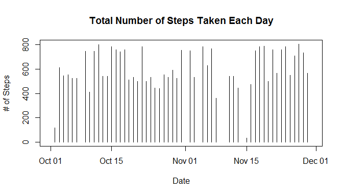
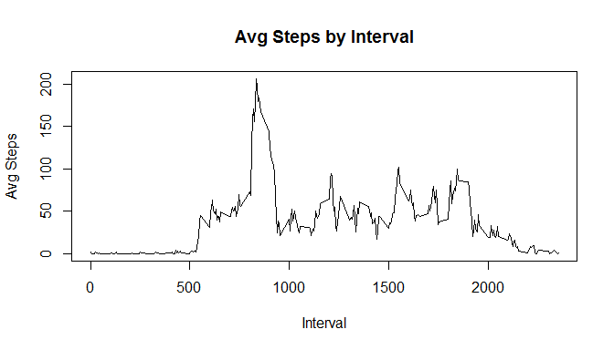
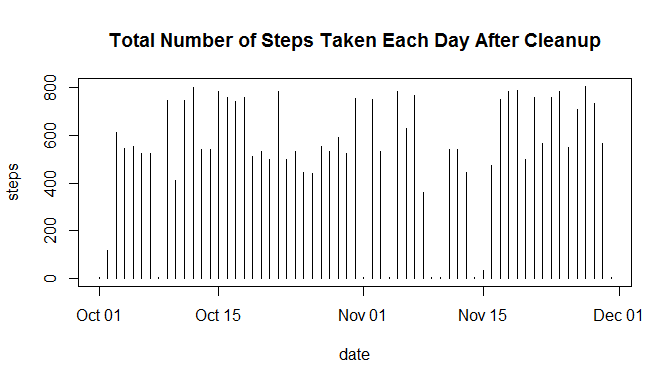
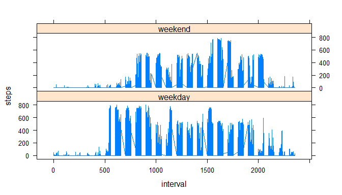

# Reproducible Research: Peer Assessment 1


## Loading and preprocessing the data

1. Load the data.


```r
setwd("~/GitHub/RepData_PeerAssessment1")

unzip(paste(getwd(),"\\","activity.zip",sep=""), exdir = getwd())
        
df <- read.csv("activity.csv", as.is = TRUE)
```

2. Process/transform the data.


```r
df$date <- as.Date(df$date)

library("dplyr")
```

```
## Warning: package 'dplyr' was built under R version 3.1.3
```

```
## 
## Attaching package: 'dplyr'
## 
## The following object is masked from 'package:stats':
## 
##     filter
## 
## The following objects are masked from 'package:base':
## 
##     intersect, setdiff, setequal, union
```

```r
library("lattice")
library("ggplot2")
```

```
## Warning: package 'ggplot2' was built under R version 3.1.3
```

```r
by_date <- group_by(df, date)
by_interval <- group_by(df, interval)

str(df)
```

```
## 'data.frame':	17568 obs. of  3 variables:
##  $ steps   : int  NA NA NA NA NA NA NA NA NA NA ...
##  $ date    : Date, format: "2012-10-01" "2012-10-01" ...
##  $ interval: int  0 5 10 15 20 25 30 35 40 45 ...
```

```r
summary(df)
```

```
##      steps             date               interval     
##  Min.   :  0.00   Min.   :2012-10-01   Min.   :   0.0  
##  1st Qu.:  0.00   1st Qu.:2012-10-16   1st Qu.: 588.8  
##  Median :  0.00   Median :2012-10-31   Median :1177.5  
##  Mean   : 37.38   Mean   :2012-10-31   Mean   :1177.5  
##  3rd Qu.: 12.00   3rd Qu.:2012-11-15   3rd Qu.:1766.2  
##  Max.   :806.00   Max.   :2012-11-30   Max.   :2355.0  
##  NA's   :2304
```

## What is mean total number of steps taken per day?


```r
stepsByDay <- tapply(df$steps, df$date, sum, na.rm = TRUE)
```

1. Make a histogram of the total number of steps taken each day.


```r
plot(df$date, df$steps, type = "h", main = "Total Number of Steps Taken Each Day", ylab = "# of Steps", xlab = "Date")
```

 

2. Calculate and report the **mean** and **median** total number of steps taken per day


```r
df.daily.summary <- summarize(group_by(df, date), mean(steps, na.rm = TRUE), median(steps, na.rm = TRUE))

df.daily.summary
```

```
## Source: local data frame [61 x 3]
## 
##          date mean(steps, na.rm = TRUE) median(steps, na.rm = TRUE)
## 1  2012-10-01                       NaN                          NA
## 2  2012-10-02                   0.43750                           0
## 3  2012-10-03                  39.41667                           0
## 4  2012-10-04                  42.06944                           0
## 5  2012-10-05                  46.15972                           0
## 6  2012-10-06                  53.54167                           0
## 7  2012-10-07                  38.24653                           0
## 8  2012-10-08                       NaN                          NA
## 9  2012-10-09                  44.48264                           0
## 10 2012-10-10                  34.37500                           0
## ..        ...                       ...                         ...
```

## What is the average daily activity pattern?

1. Make a time series plot (i.e. `type = "l"`) of the 5-minute interval (x-axis) and the average number of steps taken, averaged across all days (y-axis)


```r
df.interval.mean <- summarise(by_interval, mean.steps = mean(steps, na.rm = TRUE))

df.interval.mean[is.na(df.interval.mean$mean.steps),2] <- 0

plot(df.interval.mean$interval, df.interval.mean$mean.steps, type = "l", main = "Avg Steps by Interval", xlab = "Interval", ylab = "Avg Steps")
```

 

2. Which 5-minute interval, on average across all the days in the dataset, contains the maximum number of steps?


```r
df.interval.summary <- summarise(by_interval, sum(steps, na.rm = TRUE))

df.interval.summary[which(df.interval.summary$`sum(steps, na.rm = TRUE)`==max(df.interval.summary$`sum(steps, na.rm = TRUE)`)),1]
```

```
## Source: local data frame [1 x 1]
## 
##   interval
## 1      835
```

## Imputing missing values

1. Calculate and report the total number of missing values in the dataset (i.e. the total number of rows with `NA`s)


```r
length(df[is.na(df$steps),1])
```

```
## [1] 2304
```

2. Devise a strategy for filling in all of the missing values in the dataset. The strategy does not need to be sophisticated. For example, you could use the mean/median for that day, or the mean for that 5-minute interval, etc.

We plan to imputer by using the mean for the 5-minute interval we calculated earlier.

3. Create a new dataset that is equal to the original dataset but with the missing data filled in.


```r
df.imputed <- merge(df, df.interval.mean)

length(df.imputed[is.na(df.imputed$steps),1])
```

```
## [1] 2304
```

```r
df.imputed$steps[is.na(df.imputed$steps)] <- df.imputed$mean.steps
```

```
## Warning in df.imputed$steps[is.na(df.imputed$steps)] <-
## df.imputed$mean.steps: number of items to replace is not a multiple of
## replacement length
```

```r
length(df.imputed[is.na(df.imputed$steps),1])
```

```
## [1] 0
```

4. Make a histogram of the total number of steps taken each day and Calculate and report the **mean** and **median** total number of steps taken per day. Do these values differ from the estimates from the first part of the assignment? What is the impact of imputing missing data on the estimates of the total daily number of steps?


```r
with(df.imputed, plot(date, steps, type = "h", main = "Total Number of Steps Taken Each Day After Cleanup"))
```

 

```r
with(df, plot(date, steps, type = "h", main = "Total Number of Steps Taken Each Day", ylab = "# of Steps", xlab = "Date"))
```

 

```r
df.compare <- merge(df,df.imputed, by = c("date", "interval"))
#select(df.compare, date, interval, raw.steps = steps.x, imputed.steps = steps.y)
```
## Are there differences in activity patterns between weekdays and weekends?
For this part the `weekdays()` function may be of some help here. Use
the dataset with the filled-in missing values for this part.

1. Create a new factor variable in the dataset with two levels -- "weekday" and "weekend" indicating whether a given date is a weekday or weekend day.


```r
df.imputed$weekday.end <- "weekday"
df.imputed$weekday.end[weekdays(df.imputed$date)=="Saturday"|weekdays(df.imputed$date)=="Sunday"] <- "weekend"
df.imputed$weekday.end <- as.factor(df.imputed$weekday.end)
str(df.imputed$weekday.end)
```

```
##  Factor w/ 2 levels "weekday","weekend": 1 1 2 1 2 1 2 1 1 2 ...
```

1. Make a panel plot containing a time series plot (i.e. `type = "l"`) of the 5-minute interval (x-axis) and the average number of steps taken, averaged across all weekday days or weekend days (y-axis). The plot should look something like the following, which was created using **simulated data**:


```r
xyplot(steps ~ interval|weekday.end, data = df.imputed, layout = c(1,2), type = "l")
```

 

It looks like this guy is sleeping in on the weekends...
